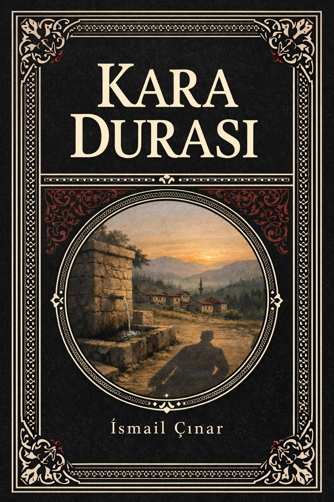{width=100%}

```{=latex}
\newpage
```

# KARA DURASI

**İsmail Çınar**

---

*Bu kitap, İsmail Çınar tarafından kaleme alınmış ve dijital ortamda erişilebilir hale getirilmiştir.*


# KÜNYE

**Kitap Adı:** Kara Durası

**Yazar:** İsmail Çınar

**Yayın Tarihi:** Şubat 2026

**Editör ve Proofreading:** Naim Çınar

**Kapak Tasarımı:** Naim Çınar, Berna Görgülü

**Dijital Yayın:** Açık Erişim

**Lisans:** Bu eser açık erişim olarak yayınlanmıştır. Kaynak gösterilmek kaydıyla paylaşılabilir ve kullanılabilir.

---

**Not:** Bu kitap, İsmail Çınar tarafından kaleme alınmış ve dijital ortamda erişilebilir hale getirilmiştir. Kitap, yazarın büyük dedesi Molla Mehmet ve dedesi Koca Hüseyin'den dinlediği gerçek olaylara dayanmaktadır.


```{=latex}
\tableofcontents
\newpage
```

# İÇİNDEKİLER

[Önsöz](#önsöz)

[1. Bölüm](#1-bölüm)

[2. Bölüm](#2-bölüm)

[3. Bölüm](#3-bölüm)

[4. Bölüm](#4-bölüm)

[5. Bölüm](#5-bölüm)

[6. Bölüm](#6-bölüm)

[7. Bölüm](#7-bölüm)

[8. Bölüm](#8-bölüm)

[9. Bölüm](#9-bölüm)

[10. Bölüm](#10-bölüm)


# Önsöz

Ben İsmail Çınar; Eşkıya Kara Durası tarafından en fazla zarar verilen ailelerden Gölpazarı, Karaahmetler köyünden Yahyalar sülalesine mensubum. Ailem Cumhuriyet'in İlanından sonra soyadı kanunuyla birlikte Çınar soyadını aldı. Bu yaşanmışlıkları büyük dedem Molla Mehmet ve dedem Koca Hüseyin'den dinledim. Dinlediklerimi az da olsa hayalimde oluşturduğum bazı olaylarla harmanlayarak bu kitabı yazmaya çalıştım. Beni yazmaya iten nedenler bazı yerlerde okuduğum, neredeyse Eşkıya Kara Durası'nı zenginden alıp, fakire dağıtan bir halk kahramanı gibi anlatmalar oldu.

Aslında yazmaya Eskişehir Anadolu Üniversitesi, İletişim Bilimleri Fakültesi'nde akademisyen olan oğlum Naim Çınar teşvik etti.

Yıllar önce geçirdiğim bir trafik kazası sonucu görme yetisini yitirmiştim.
Oğlum benim için araştırdı, görme engelliler için kullanılmaya başlanan ekran okuma programlarını temin etti. Önce bu programları kendi kullanmayı öğrendi, sonra bana öğretti. Bana bu ekran okuma programlarıyla yeniden bilgisayar kullanmayı öğretti. İstanbul Boğaziçi Üniversitesi'nin 2006 yılında görme engelliler için kurduğu GETEM'in (Görme Engelliler Teknolojik Eğitim Merkezi) ilk üyelerinden birisi olmamı sağladı. Böylelikle binlerce sesli kitaba, dergiye, sesli betimleme sinema filmine, radyo tiyatrosuna ulaşmamı sağladı. Kaza geçirmeden önce okumayı çok seven biri olarak bana çok büyük bir ufuk açtı, tünelin ucundaki ışık oldu.

Bir baba olarak bir evladından daha ne isteyebilirim ki diye düşünüyorum, teşekkür ederim oğlum Naim Çınar.

Tabii kaza geçirip, görme yetisini yitirdiğim günden bu yana ardımda kapı gibi duran eşim Ayten Çınar'a, hep pozitif, sevgi dolu, görmeden üniversite bitirmeye çalışan babasına kitapları abisi ve annesiyle birlikte okuyan fizik öğretmeni, eğitim kolunda faaliyet gösteren iş yeri sahibi, iş kadını kızım Nilay Çınar Ferah'a (üniversite öğrencisi olduğum yıllarda henüz ekran okuma programları yoktu) daha sonraları aileme katılan beş parmağında beş marifet, pozitif, yüzü hep gülen elektrik mühendisi damadım Yakup Ferah'a, en son aileme katılan ve ailemin odak noktası olan yaşam kaynağım sevgili torunum Çınar Ferah'a en içten sevgi, minnet ve teşekkürlerimi sunuyorum, iyi ki sizin gibi sevgi dolu bir ailem var.

Ayrıca bu kitabı dijital olarak yayına hazırlayan oğlum Naim Çınar ve ona yardımcı olan Berna Görgülü'ye ayrıca teşekkür ederim.
Bu kitabı, bu yazdıklarımın büyük çoğunu kendilerinden birebir dinlediğim büyük dedem Molla Mehmet Ağa ve dedem tam bir köy efesi olan Koca Hüseyin'e, bana bu olayları anlattıkları için teşekkür ederek ve saygı ve minnetle anarak bitirmek istiyorum.

Karamatlar'lı Molla Mehmet'in Kara Durası tarafından fidye istemek üzere defalarca kaçırılarak dağa çıkarılan oğlu Koca Hüseyin, torunu olan bana şöyle diyecekti:
— Ah torunum o zamanlar 10-11 yaşlarındaydım. Hep keşke 5-6 yaş daha büyük olsaydım diye geçirdim içimden. Hep bir gün Kara Durası'nı alnının ortasından vurmayı hayal ettim o çocuk yaşımda. Kara Durası'nın bana verdiği o bıçağı Kara Durası'na olan nefretim körelmesin diye o pislik, o can düşmanı, o canavarın öldürülmesinden sonra da uzun yıllar sakladım. Ona ilk kurşunu sıkan askerin yerinde ben olmak çok isterdim. Bu milletin kahramanı da, haini de bitmez evlat. Kara Durası da bu Gölpazarı kazasının, Bilecik Vilayeti'nin en acımasız, en vicdansız eşkıyasıydı. Yapılan iyilik de, kötülük de karşılıksız kalmaz torunum; önünde sonunda yapanın karşısına iyilik yaptıysan, mükafat olarak, kötülük yaptıysan, ceza olarak çıkar. İnşallah bu millet bir daha kurtuluş savaşı yapmak zorunda kalmaz. İnşallah Atatürk ve arkadaşlarının bu millet için yaptıklarını, bu milletin evlatları unutmaz, onların bize, bizden sonra size emanet ettikleri cumhuriyete, özgürlüklere, adalete, huzura sahip çıkarlar.
Bunları söylerken o sert mizaçlı Koca Hüseyin'in gözlerinden akan gözyaşı damlaları sakallı yanaklarından süzüldü.

Benim bu kitapta aktarabildiklerim Eşkıya Kara Durası ve çetesinin bu millete yaptıklarının belki de onda biri, yüzde biri. Yaptıklarından unutularak aktarılmayan, yaptıkları gizli kalan kim bilir daha ne kadar fazla olay var, kim bilir ne kadar gözü yaşlı kadın var.

Özellikle yalnız kalan, kocası askerde olan ya da şehit düşen o güzel yürekli kadınlara yaptıklarının daha fazlasını yazmaya içim elvermedi. Özellikle bu taciz ve tecavüze uğrayan kadınların isminden ya hiç bahsetmedim, ya da isimlerini bildiğim halde isimlerini değiştirdim.
Dedem Koca Hüseyin Çınar'ın da dediği gibi bu millet Ulu Önder Mustafa Kemal ATATÜRK ve asker, sivil mücadele arkadaşlarının; kadını, ihtiyarı, çocuğu, erkeği tüm insan varlığı ve unsurlarıyla topyekün vatan kurtarma mücadelesi veren ve sonunda emperyalistleri ve maşalarını bu ülkeden bir daha geri gelememek üzere kovan, emperyalizme karşı ilk kazanılan ulusal mücadeleyi veren atalarının yaptıklarını iyi anlar, armağan ettikleri cumhuriyet ve getirilerine gönülden sahip çıkar.
Cumhuriyetimizin kurucu önderi Mustafa Kemal ATATÜRK'ün dediği gibi,
"Ulusal egemenlik; Kayıtsız, şartsız milletindir."


```{=latex}
\newpage
\vspace*{\fill}
\begin{center}
```

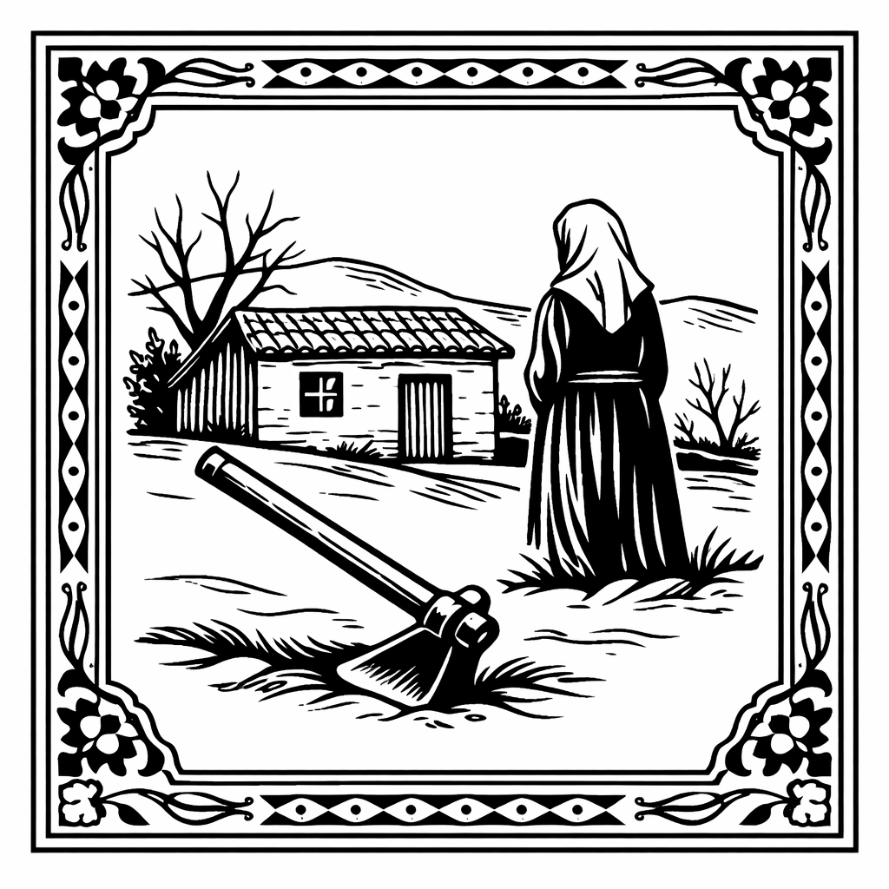{width=80%}


```{=latex}
\end{center}
\vspace*{\fill}
\newpage
```

# 1. Bölüm

Dura, Ertuğrul Sancağı'nın, Gölpazarı Nahiyesi'nin Dereli köyü'nde 1900 yılında dünyaya gözlerini açtı. Anası Fadime kadın evinde ona yardım edecek bir yakını olmadığından oğlu Dura'yı doğurana kadar tarlada öküzlerle çift sürdü, bahçe çapaladı, ekin biçti, harman yaptı. Çalışmaktan ne kendine, ne de karnındaki bebesine doğru dürüst bakamadı. Durası'nı doğurduğu gün bile bahçe çapalıyordu. Ne yapsın, tek başına bir kadındı. Kendi anası, babası da, kocasının anası babası da genç denecek yaşta ölmüşlerdi. Hele kendi babasını hiç tanımamış, o doğduktan 3 ay sonra anlatılanlara göre babası yakalandığı ince hastalıktan kurtulamamış, 3 ay kadar hasta yatağında yattıktan sonra ruhunu teslim etmişti. Kocası da Balkan Savaşlarında askere alınmış, gidiş o gidiş, bir daha haber alınamamıştı. Kadın başına her işini kendisi yapmak zorundaydı. Sancıları başlayınca çapayı yere atarak evine koştu. Onun bu halini gören komşusu yaşlı Hatice teyze,

— Kız Fadime, telaşlı telaşlı neden eve doğru koşarsın?

— Sancılarım başladı Hatice teyze, çok sancım var, ne yapacağımı da bilemiyorum.

— Dur kız Fadime, hocanın karısı bu ebelik işlerinden anlar, haydi sen git eve, ateşe su koy, ben bir yol çağırayım da geleyim.

Beş dakika kadar sonra Hatice teyze ile hocanın karısı önlü arkalı girdiler eve. Kapıyı arkasından kapatan hocanın karısı bir taraftan besmele çekip, kollarını sıvarken,

— Kız Fadime, ne bu telaş, korkma kızım, korkma. Ben de, Hatice teyzen de burada yanındayız. Korkacak bir şey yok, biz sana yardımcı oluruz. Hem sevin, canına can katılacak kız.

— Ne bileyim abla, telaşlandım işte. Ne koca var, ne ana, ne baba, yapayalnızım, korktum işte.

Hocanın karısı doğuma yardımcı oldu. Dura, kara kuru, zayıf bir çocuk olarak gözlerini açtı dünyaya. O kadar zayıftı ki, bacaklarının derileri sallanıyor, neredeyse derinin altında kemik görünüyordu. Sürekli ağlıyor, emmekte zorlanıyordu. Anasının ondan önce biri kız, biri oğlan 2 çocuğu daha olmuş, her ikisi de daha 1 yaşına gelmeden ölmüşlerdi. Dura'nın babası daha o doğmadan askere alınmıştı.

Fadime asker kocası Arif ile evlendiğinde daha 17 yaşındaydı, kocası Arif de 18 yaşındaydı. O yıllarda erkek çocuklar askere gitmeden önce evlendirilirlerdi. Evliliği askerlik sonrasına kalana yaşlı, kartalmış derlerdi. Askerlik dediysek o yıllarda askerlik en az 4 yıl sürer, bazen on yılı aştığı olurdu. Karısı hamile olarak askere giden 12 yıl sonra teskeresini alıp evine döndüğünde evladını ilk defa delikanlı olmuş, neredeyse boyu boyuna ulaşmış olarak görürdü.

Arif askere alınmadan önce doğan iki çocukları da bebek yaşta ölmüşler, Fadime kadın kocasına askerlik çağrısı gelmeden bir hafta kadar önce yeniden hamile olduğu müjdesini vermişti. Arif askere uğurlanırken karısına göğsünü gere gere "oğlumuza iyi bak" demişti. İyi bak demişti de; kadın başına hem çift çubukla uğraş, hem dam, samanlıkla uğraş, hem koca yolu gözle derken kadıncağızın ne kendine, ne de karnındaki bebesine bakacak zamanı olmamıştı. Çoğu zaman işleri yetiştirebilmek için o kadar dalıyor, karnındaki bebesini bile unutuyordu. Hamile olduğunu ancak karnındaki bebesinin tekme atması sonucu hatırlıyordu. O zaman daha dikkatli olmaya çalışıyor ama işlerin çokluğundan birkaç dakika sonra hemencecik unutuveriyordu.

Doğumun geldiğini de tarlada çapa yaparken birden sancılarının tutması sonucu hatırlamış, çapayı fırlatarak karnını tuta tuta eve koşmuştu. Şükür Hatice teyze ve ebe kadının yardımlarıyla evladını dünyaya getirmişti, getirmişti de, korkusu ya bu da yaşamazsaydı... Çocuğun bacak derileri sanki bir zar gibi inceydiler. Onu böyle zayıf gören anası Fadime yavrusuna ilk ana sütünü içirmeye çalışırken,

— Hatice teyze, yavrum pek zayıf, iki bebem öldü, babası da asker, evladım yaşar mı acep.

— Allah bilir kızım, yiyecek nafakası varsa yaşar. Sen emzirmeye bak, emerse çabucak toparlar. Fadime kadın, yaşayacak oğlum, yaşayacak. Yalnız anasının umudu, gözünün ışığı olacak.

dedi bacaklarında sallayarak, ninni söylerken.

— Uyu yavrum ninni. Uyu yavrum uyu, uyu da büyü. Asker baban görmek ister seni aslan gibi besbelli. Uyu aslanım uyu, uyu ki çabucacık büyü. Gönlümde var senin asker babanın sıcacık yeri.

Fadime kadın ilk iki çocuğunu daha emzikliyken vermişti kara toprağa. En azından o zaman kocası yanı başındaydı. Sırt sırta vermiş, direnmişlerdi yaşama, yaşamda yaşanan zorluklara. Ya şimdi tek başınaydı. Kendi kendine içinden:

— Em oğlum, em, hem de ananın memelerinde süt, damarlarında kan kalmayasıya kadar em. Em ki, karnın doysun, karnın doysun ki yaşayasın. Em benim kara, kuru oğlum. Em gözümün nuru, umudum, em yüreğimin merhemi em.

Kara Durası, kara kuru haliyle o zor günlere kara bahtına düşeni yaşamak üzere doğmuş gibiydi. Bir taraftan uzun yıllardır süre gelen savaşların getirdiği geçim sıkıntıları, bir taraftan sık sık yoklayan salgın hastalıklar Anadolu insanını kavruk toprakları gibi kavurmuş geçmişti adeta. Askerlik çağına gelen her genç davul, zurna eşliğinde kınaları yakılarak, dualar eşliğinde uğurlanıyordu vatan bekçiliğine. Gidenlerin çoğunun geri dönemeyeceği bilinse de yine davul zurna eşliğinde düğüne gider gibi cepheye uğurlanıyordu daha bıyıkları yeni terlemeye başlayan köy gençleri...

Dereli köyünün o yıllarda Karaahmetler, Nalçacılar, Kuzlar adında 3 mahallesi daha vardı. Ondan bir 40-50 yıl kadar önce 3 mahallesi daha vardı. O mahalleler Alanlar, Haydan ve Madanlar'dı. Haydan ve Alanlar daha da önceki yıllarda müstakil köylerdi. Hem de ne köyler, hem kalabalık, hem de cesur savaşçıların yetiştiği köyler.

Osmanlı İmparatorluğu'nun güçlü yıllarında bu Haydan ve Alanlar köyleri'nden padişahın sefere çıkmadan önceki sefer çağrısına 40 atlı, silahlı süvari katılırdı. Bu askerler tımar askerleriydi. Bu bölge bir ağaya tımar olarak verilmişti. Ağa bu toprakları ekip, biçiyor, dağlarının odununu kesip, satıyor asker ailelerini besliyordu. Aileler barış zamanı kendilerine tahsis edilen toprakları işliyor, elde ettikleri mahsulün bir kısmını kendine ayırırken, bir kısmını yurtluk sahibi ağaya veriyorlardı. Barış zamanı köyde hem çiftçilik, hem de asker talimi yapan köy gençleri savaş zamanı padişahın fermanı üzerine silahlarını kuşanıyor, atlarını eğerliyor, sanki düğüne gider gibi savaşa gidiyorlardı. Bu köyler tipik yörük, manav köyleriydi.

Alanlar köyü'nü çetin savaşçı olan ve kurulu imparatorluklara, beyliklere, derebeylere paralı askerlik yapan Alan Türklerinin kurduğu bir köy olduğu biliniyordu. Haydan köyü'nü ise Kayı boyunun bir kolu olan Haydanlılar kurmuştu. Haydan Türkleri önce 1035 yılında Denizli'nin, Çivril İlçesi'nin Haydan köyü'nü kurmuşlar, daha sonra 1470 yılında 9 aile buradan gelerek Gölpazarı Haydan köyü'nü kurmuşlar.

Karaahmetler ve Madanlar mahallelerinde ise bazdaran aileler vardı. Padişahlar barış zamanı yırtıcı kuşlar doğan, şahin ve atmacalarla avlanmayı pek severlerdi. Bölgede atmaca bulunmasa da, şahin ve doğan çok fazlaydı. Bu bölgelerden saraya avcı kuş yakalayıp, eğitmeleri için bazı ailelere araziler tahsis ediliyordu. Kuş yakalamak için geniş araziler tahsis edilen ailelere bazdaran deniliyordu. Bu bazdaran ailelerinin yanında çalışan kuşçu aileler vardı. Bu aileler, aile aile arazinin çeşitli yerlerine dağılmışlardı. Bu kuşçu aileler arazinin tamamında bu yırtıcı kuşlar doğan ve şahinlerin nerelere yuva yaptıklarını çok iyi bilirlerdi. Sivrilce tepesi, eski harman, gelin kayası, ziyrat, ismelen belen doruğu, kranlar tepesi önemli şahin ve doğanların yuva yaptığı yerlerdi. Bu bazdaran aileler, yanlarında çalıştırdıkları bölgeyi iyi tanıyan, iyi avcı bu kuşçu ailelere doğan ve şahin yavrularını yakalatırlardı. Bu ailelere yakaladıkları şahin ve doğanlar karşılığında ormanlık alanlarda keçi sürülerini gütmelerine müsaade ederlerdi. Bu Kayı boyuna ait manav aileler keçicilik yaparlardı.

Bölgede tarım yapılacak arazide yoktu zaten. Türklerin Bozok kolu, Günhan soyu, kayı boyu, kınık boyu, Dodurga boyu, Toypuk boyu, Bayat boyu gibi çeşitli boylara ait Türkler asimile olmuş ve müslümanlığı kabul etmiş yerleşik ağırlıklı Rum ve Ermeni ailelerle de karışarak yeni bir grup Manav boyunu oluşturmuşlardı. Manavlar ağırlıklı olarak Bilecik, Sakarya, Bolu, Kocaeli, İstanbul, Bursa, Balıkesir, Kütahya, Afyon, Eskişehir, Ankara yörelerinde yoğunluklu olarak yaşıyorlardı. Bu bölgede ayrıca Tatarlar da yaşıyorlardı. Tatarlar, Manavlar arasında eriyip gitmemiş, Tatar kimliklerini korumuşlardı.

Bölgenin tamamı ormanlıklarla kaplıydı. Dağlarda ağırlıklı olarak kara çam vardı. Güneye bakan yamaçlarda kızıl çamlar, tepelerde de meşelikler vardı. Bu bölge yüksek ve kışları soğuk olduğundan tepelerdeki meşeler daha fazla gerce meşesiydi. Gerce meşesi, palamut meşesine göre soğuğa daha dayanıklı ve daha kanaatkardı. Tohumunun çimlenebildiği her yerde büyüyebilirdi. Bu gerce meşesi daha ufak pelitli olur, yaprakları hem daha küçük, hem de daha koyu yeşil olurdu. Bölgede kışları çok fazla kar yağar, kar kalınlığı bazen bir metreyi aşardı. Sürüleri oluşturan kara keçiler bu gerce meşesinin yaprağı ve pelitlerini yemeyi pek severler. Çam ormanlarının içerisinde yaprakları daha kısa ve daha sert olan ardıç ağaçları da olurdu. Bu aileler meşelerin pelitlerini yazın toplarlar, kışın çok karlı günlerde davar sayadan çıkamadığı günlerde, davarı bu pelitlerle beslerlerdi. Gerçi bu yılda on, on beş günü geçmezdi. Kar ne kadar çok olursa olsun aile fertleri karı çiğneyerek davara yol açar, böylece çam ormanlarına ulaşan keçiler yazın dönüp, bakmadıkları çam pürçüklerini iştahla yerlerdi.

O yıllarda ormanlardaki en kıymetli ağaç daha az bulunan ardıçtı. Ardıçın kerestesi çok fazla dayanıklıydı. Neredeyse 100 yıldan fazla çürümeden, kullanıldığı yerde dayanabilirdi. Ayrıca bu ardıçlardan katran çıkartılırdı. O yıllarda katran çok kıymetli ve pahalı bir maddeydi. İnşaatlarda yapıştırıcı olarak, ilaç yapımında daha birçok yerde kullanılırdı.

Bölgede yeşilin her tonuna rastlanılırdı. Bazı bölgelerde ormanlık alanlar o kadar sıktı ki, ne insanlar, ne de hayvanlar bu ormanların içerisinde gezinemezdi. Kartal, doğan ve şahin gibi yırtıcı kuşlarla karga, kumru, güvercin, karabakal, bıldırcın, keklik gibi kuşların sesleri birbirine karışırdı. Akşamları ve sabaha karşı ise etrafı bülbüllerin, sakaların o güzel şakımaları kaplardı. Geceleri ise etrafta baykuş seslerine, ormanlık alanlarda uluyan kurtların, çakalların, tilkilerin sesleri karışırdı. Bazı gecelerde uzaklardan geyik böğürmeleri duyulurdu.

Kuşçu ailelerin çocuklarının en büyük zevkleri şırıl şırıl akan derelerin kıyılarındaki olgunlaşmış böğürtlen meyvelerini yemek, keklik palazlarını yakalayarak kafeslerde büyütmekti. Çocukların yakalayarak büyüttükleri keklik palazları büyüyüp, keklik olunca babalarının yırtıcı kuş yakalamakta en büyük yardımcıları olurdu. Kafes içerisindeki bir keklik kafes içerisinde tuzaklanan bir yere konulur. Keklik kafes içerisinde keyifle ötmeye başlayınca kekliğin sesini duyan doğan ve şahinler kekliğin sesinin geldiği yere pike yaparlar ve hazırlanan tuzaklara yakalanırlardı.

Bu kuşçu ailelere yurtluk veren bazdaranlar, ailelere yakalattıkları şahin ve doğanları büyütür, avcı kuş olarak yetiştirir, avlanmaları için padişahlara gönderirlerdi. Padişah her bazdaran aileden verdiği yurtluğun büyüklüğüne göre avcı kuş taahhüdü alırdı. Bazdaranlar taahhüt ettikleri kadar kuş saraya gönderebilirlerse vergi ödemezler, taahhüt ettikleri miktarda kuş gönderemezlerse vergi öderlerdi. Bazdaranlar saraya taahhüt ettikleri avcı kuş sayısından daha fazla kuş eğittiklerinde bu fazla kuşları avlanmayı seven, zengin ermeni ve rumlara satarlardı. İyi eğitilmiş avcı şahin ve doğanlar çok kıymetliydi.

Kuşçu aileler ise bazdarana taahhüt ettikleri kadar kuş yavrusu teslim edemezse eksik teslim edilen her kuş sayısına bedel bazdarana erkeç vermek zorundaydılar. Erkeç testisleri kastre edilmiş erkek keçilere denilirdi. Kuşçu aileler dişi oğlakları davarı çoğaltmak için damızlığa ayırır, erkeklerden anası verimli bir kaçını damızlık teke olarak ayırır, kalan erkekleri bir yaşına gelmeden kastre ederek kısırlaştırır ve 2 yaşına gelip, erkeç olunca satarlardı. Bu erkeçler iki yaşına geldiğinde kışa girmeden önce iyice semirdiğinde satılırlardı. Bu erkeçleri alan çevredeki zengin rum ve ermeniler kavurma, pastırma, sucuk ve kuru et yaparak kışın tüketirlerdi.

Çevredeki Rum ve Ermeni köylüleri zengin insanlardı. Bu Ermeni ve Rumların zenginlikleri iyi zanaatkar olmalarından ve ipek böceği yetiştirmelerinden kaynaklanıyordu. Günümüzde Yenipazar, Türkmen, Göldağı, Demirhanlar diye bilinen köyler ve zamanında adı Norkök olan, günümüzde Gölpazarı'nın mahallesi, eski adı Ermenicesinin Türkçe karşılığı olan Yeni köy, günümüzde Reşadiye Mahallesi'nde çok zengin kalabalık Ermeni aileler yaşardı. Bu Ermeniler usta ipek böceği yetiştiricileriydi. İpek böceği sadece dut yaprağı yiyerek beslenir. İğne ucu kadar küçücük siyah yumurtadan çıkan ipek böceği büyür büyür kocaman parmak kadar bir kurt olur. Büyüdükçe yediği dut yaprağı da artar. Sonunda yediklerini ipek iplikçikleri olarak kusarak etrafına bembeyaz ipek iplikçiklerinden bir koza örer. Bu kozanın içerisinde belirli bir dönem krizalit halinde yarı ölü dinlenme dönemi geçirir. Daha sonra uyanır, yine ağzından çıkardığı eritici bir sıvıyla kozayı delerek çıkar. Kozadan çıktığında kurt artık bir kelebeğe dönüşmüştür. Bu kelebekler bir hafta kadar çok kısa mesafelerde uçar, uçarken çiftleşir ve hemen yumurtlar ve daha sonra bu kelebekler görevini tamamlamış olarak ölürler.

Bunları çok iyi bilen ipek böceği yetiştiren Rum ve Ermeni aileler bu kozalardan damızlık kadar ayırdıktan sonra kozaları kaynar kazanlara atarak, kozaların içerisindeki krizalit halindeki böcekleri öldürürler. Daha sonra da bu kozaların ipeklerini çekerek binlerce metre ipek iplikçikler elde ederler. Bu iplikçikleri birleştirerek ipek ip yumakları elde ederler. Bu ipek ipliklerden çok yumuşak, parlak çok değerli kumaşlar dokunur yine bu Ermeni ve Rum ailelerin evlerindeki tezgahlarda. İplikler dokunmadan önce çeşitli renklere doğal kökler ve yapraklardan elde edilen boyalarla boyanır. Tezgahlardan çıkan göz alıcı, kıymetli ipek kumaşlar zengin beylerin, güzel kızların vücutlarını elbise olarak süsler. Bu Ermeni ve Rum köylerinin etrafında ipek böceğine yapraklarını yedirmek için geniş dut bahçeleri bulunurdu.

Bölgede yaşayan Türk, Manav aileler daha sonra bu Ermeni ve Rum'lardan ipek böceği yetiştiriciliğini öğrenerek onlar da ipek böceği yetiştirmeye başlamışlardır.

Yenipazar, Harmanköy, Mihalgazi, Tarpak, Akköy, Göynük, Taraklı taraflarında ise daha çok Rumlar bu işi yapıyorlardı. Bölgeye yerleşen Manavlar da yerleşik Rum ve Ermeni'lerden ev yapmasını öğrenmişlerdi. Günümüzde ana malzemeleri taş, kerpiç, tahta, kereste, oluklu kiremit olan 2 katlı ahşap Manav evlerinin yapımını Ermeni ve Rum ustalardan öğrenmişlerdir. Bu evlerin alt katlarında hayvanlar yaşar, üst katlarında insanlar yaşardı. Pratik, kullanışlı, dayanıklı, soğuktan korunaklı evlerdi. Zengin Rum ve Ermeni'ler bu evleri bazen 3, bazen de 4 katlı yaparlardı. Son iki kat oda olarak bölünmez, sadece ipek böceği yetiştirmek için kullanılırdı. Bu Ermeni ve Rum köyleri çok kalabalık köylerdi. Birçoğunda Pazar bile kurulurdu. Her köyde okul vardı, bu okulların bandoları da vardı. Bu Ermeni ve Rum köylerindeki okullarda okuma yazma eğitiminin yanı sıra matematik, tabiat ilimleri, müzik, resim, tiyatro gibi konularda da eğitim veriliyordu.

Manavlar, Yörük kültüründen geldiklerinden dağınık, küçük topluluklar halinde yaşıyorlar, hayvancılık, daha çok da arazinin durumuna göre keçicilik ve koyunculuk yapıyorlardı. Dereli, Alanlar, Haydan, Kuzlar, Madanlar, Nalçacılar ve Karaahmetler'in arazileri dağlık ve engebeli olduğundan koyun yetiştiriciliğine pek elverişli değildi, bu nedenle keçicilik yapılırdı. Bu aileler daha çok Kayı boyunun Karakeçili Aşiretine mensup olduklarından sürülerindeki keçilerin tamamına yakını kara keçiydi. Buralarda keçi sürülerine davar denilirdi. Davarın içerisinde az da olsa sarı keçiler ve koyunlar bulunurdu. Kara keçi yerinde duramayan, çok hızlı hareket eden hayvandır. Davarda bulunan az da olsa sarı keçi ve koyunlar davarın daha yavaş hareket etmesini, sürünün daha kolay kontrol edilmesini sağlardı.

Bölge geniş ormanlardan oluştuğundan davarın can düşmanı kurtlar da bölgede çokça bulunurdu. Kurtlar zaman zaman davarlara saldırır, zarar verirlerdi. Kurt zararını en aza indirmek için her davar sahibi 4-5 tane akbaş ya da karabaş cinsi çoban köpeği beslerlerdi. Bu çoban köpekleri davarın etrafında dolaşır, sürüyü kurtlara karşı korurdu. Kurtlar çok aç değilse genellikle çoban köpeklerinden korkarak, kaçar. Az rastlansa da sıkışan kurtların karşı koyması sonucu kurt, köpek dalaşmalarına rastlanırdı. Sürüye saldıran kurtlar erkek tek başına ya da bir erkek ve bir dişi birlikte saldırırlardı. Sürüdeki çoban köpeği sayısı en az 4-5 tane olduğundan bu dalaşmalar çoğunlukla köpeklerin zaferiyle sonuçlanırdı. Ormanlık alanlarda yılda birkaç defa da olsa köpeklerin parçaladığı kurt ölülerine rastlanırdı. Bazen birkaç kurdun bir çoban köpeğini tek başına kıstırdıkları zaman köpeği yaraladıkları hatta parçalayarak, öldürdüklerine rastlanılırdı. Tek başına olan tecrübeli çoban köpekleri kurtları kovalarken belirli mesafeden fazla yaklaşmazdı. Çoban köpekleri bu kuşçu ailelerin en büyük yardımcıları ve koruyucularıydı. Davarı kurtlardan koruduğu gibi aile ve davara bölgede gezen hırsız, çapulcu ve eşkıyaların yaklaşmasına izin vermezlerdi.

Bu kuşçu aileler, kuşçuluğu buraları yurt edinebilmek için zorunluluktan, keçiciliği ata mesleği olduğu, bildikleri iş bu olduğu için yapıyorlardı. Bu manav aileler sık sık yer değiştirdiklerinden ilk yıllar keçi kıllarından dokudukları çadırlarda kalıyorlardı. Her ailenin evinde ve çadırında mutlaka bir dokuma tezgahı bulunurdu. Bu dokuma tezgahlarında keçi kılından çadır, çul, çuval, koyun yünlerinden de kilim dokur, kazak, çorap örerlerdi. Köklerden çok renkli boya elde etmesini biliyorlardı. Çoğunlukla yeşil, sarı, kırmızı, siyah, kahverengi renklerini kullanıyorlardı.

Zamanla bölgeden saraya gönderilen avcı kuş sayısı azalmış ve bu kuşçu aileler sadece davarcılık yapmaya başlamışlar. Daha sonraki yıllarda bölgeye başka Manav aileler gelerek yerleşmişler ve onlar da yanlarında getirdikleri davar sürülerini otlatmaya başlamışlardır. Bu Manav aileler çoğaldıkça keçicilikten kazandıkları ailelerin ihtiyaçlarına yetmemeye başlamıştı.

Bu aileler davarcılığın yanı sıra çiftçilik de yapmaya başladılar. Ormanların görece düzlük alanlarını keserek temizlediler ve açık toprak elde ettiler. Bu elde ettikleri alanlara buğday, arpa, ıza ve yulaf ekerek hem kendi ekmek ihtiyaçlarını hem de hayvanlarının yem ihtiyacını karşılamaya başladılar.

Yıldırım düşmesi sonucu çıkan doğal yangınların yanı sıra, bölgede görünen insan eliyle oluşan yangınlara rastlanmaya başlandı. Bu aileler daha geniş tarım alanları elde edebilmek için düze yakın meğillikteki alanları yakarak tarım alanı açmaya başladılar. Yanan alan daha kolay temizlenebiliniyordu. Hem bu yeni açılan alanlarda yanan ağaçların kalıntısı küllerin etkisiyle araziye ekilen buğday ve arpalar daha fazla mahsul veriyordu. Bazen de bu kontrollü yangınlar aniden çıkan kuvvetli bir rüzgarın etkisiyle kontrolden çıkıyor, istenmeyen alanlarda çatır çatır yanıyordu.

Çiftçilik yapmak için öküz gerekiyordu, bu nedenle büyük baş sığır yetiştirmeye de başladılar. Bu sığır cinsi büyük baş hayvanlar keçi gibi engebeli, sık ormanlık alanlarda dolaşarak beslenemiyorlardı. Onlar için düz ağaçlık olmayan otluklar gerekiyordu. Tarım alanı için bir taraftan, sığırların otlayabilmesi için diğer taraftan ormanlık alanlar yok edilmeye başlandı. Bir taraftan tarım ve hayvancılık için, diğer taraftan kışın ısınabilmek ve yemek yapabilecek odunu elde edebilmek için ormanlık alanlar sürekli kesilmeye başlandı, zamanla ormanlık alanların düz kısımları tamamen tarlalıklara dönüştürüldü, ormanlık olarak tarıma uygun olmayan fazla engebeli alanlar kaldı.

Osmanlı İmparatorluğu'nun duraklama ve gerileme döneminde bölgede güvenlik sorunları yaşanmaya başlandı. Bölgeye gelen eşkıyalar bölge halkına zarar veriyor, mallarını talan ediyorlardı. Karaahmetler köyü bu güvenlik sorunları sonucu kuruldu. Beş davarcı aile günümüzdeki köy yerinde bir araya gelmeye karar verdiler.

Köyün yeri korunaklı ve daha kolay savunulabileceği için seçildi. Köyün şu anki yerinde sadece Zeyniler sülalesi yerleşikti. Köy yerine taşınan diğer 5 aileyle birlikte 6 aile Karaahmetler köyü'nü kurdular. Yahyalar sülalesi günümüzde Gölpazarı-Taraklı şosesinin yakınındaki Ayvalı dere mevkiinden bugünkü köy yerine taşındı. Hacıveliler günümüzde Cansızlar köyü yakınındaki Toypuklar'dan, Yamacılar Haydan köyü'nden, Aliçavuşlar Metderesi mevkiinden, Halimeler Ziyrat'tan, Muratlar Demirderesinden taşındılar. Köye evlerini, ağıllarını ve hep birlikte camilerini yaptılar.

Artık bir arada daha güvendeydiler. Çetelere karşı ailelerini, hayvanlarını daha kolay korur olmuşlardı. Köyü oluşturan aileler Kayı Boyu'nun alt boyları Karakeçili, Toypuklu ve Haydan alt boylarından oluşuyordu.

İmparatorluğun duraklama ve gerileme döneminde daha önce yükseliş döneminde savaşa katılan askerlerin çoğu atlarının üzerinde neşeyle, heybelerindeki ganimetlerle dönerlerken, gerileme döneminde hem dönen asker sayısı, hem de askerlerin dönerken yanlarında getirdikleri ganimet miktarı azalmaya başladı. Askere savaşmaya uğurladıkları atlı süvari evlatlarını daha önceleri neşeyle bekleyen aileler, gerileme döneminde dönenler azalmaya başlayınca endişeyle beklemeye başladılar. Bölge ekonomik ve insan varlığı yönünden fakirleşmeye başladı. Bölgede erkek nüfus hızla azalmaya başladı. Önce önemli tımar köyleri olan Alanlar ve Haydan boşaldı. Bu köylerde kalanlar ya Dereli, Kuzlar ve Karaahmetler'e ya da başka yerlere taşındılar. Alanlar, Haydan, Madanlar ve Nalçacılar tamamen terkedildiler, sadece mezarlıkları ve eski evlerinin temel taşları kaldı. Daha çok davarcılık yapan Dereli, Kuzlar ve Karaahmetler varlıklarını sürdürdüler. Daha sonra da Kuzlar yok olup gitti.

Karaahmetler 25 haneye kadar çoğaldı, hane sayısını günümüze kadar korudu.

Bölgedeki erkek nüfusun, sonunda da genel nüfusun dramatik bir şekilde azalmasının ana nedenlerinden biri de savaşa giden erkeklerin geri dönenlerinin azalmasının yanı sıra Manav ailelerin genellikle çocuk sayısının az olmasıdır. Manav ailelerinin çoğunlukla 2 veya 3 çocukları vardır, 4-5 çocuklu ailelere nadiren rastlanır.

Gerileme hele çöküş dönemlerinde savaşmaya giden genç erkeklerin geri dönenlerinin sayısı iyice azalmıştı.

O yıllarda köy imamları, köy muhtarları, bir de medrese öğrencileri askere alınmıyorlardı. Bunun yanında o dönemde de bedelli askerlik vardı. Bedelini ödeyen zengin ailelerin çocukları askere alınmazdı.

Karaahmetler köyü’nde Yahyalar Sülalesinin lideri Hacı Mustafa oğlu Mehmet’in okuyarak hoca olmasını istiyordu. Mustafa ağanın Mehmet’ten küçük Yakup adında bir oğlu, daha sonra Çiftlik köyüne gelin gidecek Ayşe adında da bir kızı vardı.

Erkek kardeşi İlyas hacca gidip, gelmeden evlenmemeye karar vermişti. Daha önce abisi Mustafa da genç yaşta hacca gidip, gelmişti. O yıllarda hacca ya at sırtında, ya deve sırtında, ya da yayan gidiliyordu. Bu nedenle haç yolculuğu aylarca sürüyordu.

Hacca gidenlerin birçoğu da ya hastalıklardan, ya da eşkıya saldırılarından yaşamlarını yitirerek geri dönemiyorlardı.

Hacı Mustafa hacca atla gitmişti. Atla yolculuk daha kısa sürdüğünden kardeşine de atla gitmesini tavsiye etti. İlyas 30 yaşında artık delikanlılık yıllarının sonuna yaklaşmıştı. Onun akranlarının on yaşın üzerinde çocukları vardı. Hacı Mustafa kardeşine cins bir doru at aldı. At eğerlendi. Yanına yedek at almaya yetecek, yiyecek, içecek, konaklama masraflarını kolayca karşılayabilecek kadar altın para konuldu. İlyas heybelerinin birini yedek giysilerle, diğerini kavurma, peynir, ceviz, badem gibi yiyeceklerle doldurdu.

İlyas hac yolculuğuna çıkmak üzere köyden dualar eşliğinde Taraklı'ya birlikte hareket edeceği kafilesine doğru uğurlandı. Ağabeyi Hacı Mustafa Taraklı'ya kadar eşlik etti. İki kardeş kafilenin hareketine kadar 2 güne yakın birlikte vakit geçirdiler. Geçirdikleri her anın kıymetini bilir şekilde sohbet ettiler. Gitmek vardı, gidip de dönememek vardı, dönüp de bulamamak vardı. Hacı Mustafa Cuma namazından sonra kardeşi İlyas'ı kafileyle birlikte dualar eşliğinde uğurladı. İki kardeş birbirlerine defalarca sarıldılar.

Hacı Mustafa tam ayrılırken kardeşine seslendi,

— İlyas yaş geçiyor artık, kartalıyorsun. Kabe'yi tavaf ederken dönüşte hangi kızı gelin olarak isteyeceğinizi de düşün, gönlündekinin yar olması için Allaha dua et. Mekke'de özellikle de Kabe'de edilen dualar kabul edilirmiş.

İlyas atının üzerinde yan dönerek gülümsedi,

— Nasip ağam, hele bir vazifemizi yapıp, dönelim de.

Hacı Mustafa gözlerinden akan yaşları kardeşi görmesin diye, o uzaklaşmadan silmedi. Hacı Mustafa da atının eğerine atladı. İki kardeş gülümseyerek son bir defa birbirlerine el salladılar. Kafile Göynük yolunda gözden kaybolunca; Hacı Mustafa kır atını dört nala kaldırarak köyünün yolunu tuttu.

Aradan 6 ay kadar geçmişti, bir gün Taraklı kafilesinin hacdan dönmekte olduğu haberi geldi. Hacı Mustafa yanına köyden iki arkadaşını alarak atlarına atlayarak, dört nala heyecanla Taraklı'nın yolunu tuttular. Taraklı'da heyecanla kafilenin gelmesini beklemeye başladılar.

Kafile gelmişti artık. Herkes hacdan dönen yakınlarına hasretle sarılıyordu. Gelen geliyor, fakat İlyas yoktu. Halbuki giderken kafilenin en önünde gitmişti. Bakıldığında hacdan dönenlerin birçoğu 50 yaşının üzerindeydi. Taraklı'dan İlyas ile birlikte hacca giden İlyas gibi genç bir arkadaşı gelerek Hacı Mustafa'ya sarıldı.

— Ağam gitmek var, dönememek var diye yola çıktık birlikte. İlyas kardeşimle birlikte tavafımızı yaptık, ihramdan çıkıp, kurbanlarımızı kestik, hac farizemizi Allahın izniyle yerine getirdik. Daha sonra dönüşe hazırlanıyorduk, İlyas kardeşim hastalandı. Bir hafta kadar ateşler içerisinde yattı. Ben kafileden ayrılarak başında bekledim. Hacı İlyas kardeşim daha sonra ruhunu teslim etti. Kardeşim hac yollarında şehit oldu. Hastalığının adı sarı hummaymış. Ben kardeşimi cenaze namazını da kılarak ellerimle toprağa defnettim. Oradaki mezarlar sadece topraktı, başında hiçbir şey yoktu. Benim gönlüm razı olmadı, buralarda yaptığımız gibi baş ucuna bir de taş diktim. Elindeki altın paraları uzatarak aha bunlar da cebinden çıkan paraları ağam.

— Hacı kardeşim o sarı liralar sende kalsın. Bak başını beklemiş, toprağa vermeden başından ayrılmamışsın, senden Allah razı olsun.

Defnettikten sonra kendi atımı, İlyas'ın atını da alarak iki atla yollara düştüm tek başıma. At değiştirerek yol aldım. Şam yakınlarında kafileye yetiştim. Daha sonra kafileyle birlikte günlerce yol alarak sonunda memlekete dönebilmek nasip oldu. İlyas kardeşimin emanetlerini size sağ salim ulaştırmak için epey dikkatli davrandım ağam. Tamam, madem sen öyle istiyordun ağam. Ben de bu paraları hacı kardeşimin hayrına fakirlere dağıtırım.

Hacı Mustafa vedalaşarak, karışık duygular içerisinde birlikte geldiği arkadaşlarıyla birlikte köyünün yolunu tuttu. Bir taraftan da içinden şunları geçiriyordu:

Benim hac şehidi kardeşim Hacı İlyas, demek o yollara can vermeye gittin, can vermeyi gönlüne koymuşsun. Tevekkeli ondan evlenmedin. Atını bu derin düşünceler içerisinde köyüne doğru sürdü. Kardeşini karşılamaya gelmişti. Kardeşiyle birlikte köye dönmeyi, onu evlendirmeyi düşünmüştü ama nasip olmamıştı. Geldiği gibi tek başına dönüyordu köyüne.

Aynı günlerde Dereli köyü'nde Fadime kadın bir taraftan askerdeki kocasının yolunu bekliyor, bir taraftan da yeni doğan çocuğunu büyütmeye çalışıyordu.

Fadime kadın doğan çocuğuna hem sevgi, hem de acıyarak baktı. Bu kara kuru çocuk yaşamazdı, nasıl bakacaktı, neyle besleyecekti, kendine bile bakamıyordu zaten. Daha önce doğan biri oğlan, biri kız iki çocuğu da öldüğünden Fadime kadın bu doğan çocuğuna yaşasın, dursun diye Dura adını koydu. Fadime kadın bir taraftan evini çekip çevirecek, bir taraftan çift sürecek, odun kesecek, bir taraftan da kara kuru oğlunu büyütecekti.

Dura anası tarlalarda karasabanla çift sürerken aç diplerinde büyüdü. Dura'ya ana sütü yaramıştı. O bacaklarının derisi sallanan kara kuru çocuk her geçen gün toparlanıyor, anasına hiç sorun çıkarmıyordu. Öyle pek ağlaması da yoktu, anası ne verirse onu iştahla yiyordu. Anası meme vermeye devam etse neredeyse anne memesini hiç bırakmayacaktı. Annesi de ona memesinden verdiği sütten başka verebilecek bir şey bulamıyordu. Kendi içtiği tarhana çorbasından içiriyor, yabani böğürtlenlerden olgun meyvalarını toplayarak yediriyordu. Bir de dağda bayırda gezerken bulduğu dobalan (türüf) mantarlarını getiriyor, Durası bu dobalanları çiğ çiğ kıyırdatarak yiyordu. Pek hasta da olmuyordu. Anası çapa yaparken, çift sürerken onu bir ağacın gölgesine bırakıyor. Durası taşlarla, topraklarla oynuyordu. Durası taşları, toprakları, ağaç dallarını kendine oyuncak yapıyor, kendi kendine sessiz sessiz oynuyordu. Sanki anasının işinin ağırlığının farkında gibiydi, bir de o anasının işleri arasında sorun çıkarmak istemiyor gibiydi. Anası Durası'nın bu kadar sessiz olmasına ara sıra şaşırmıyor da değildi.

Fadime kadının kocası askere gideli 2 yılı aşmış ama gittiği günden bu yana hiç haberi gelmemişti. Balkan Cephesi'ne gittiği söyleniyordu. Balkan Cephesi neredeydi acaba, kaç günlük yoldaydı. Gelebilecek miydi. Köyden gidenlerin çoğu dönmez olmuştu son yıllarda. Ya şehit haberi geliyor, ya da hiç haber gelmiyordu.

Fadime kadının birine tomaş, diğerine azman dediği iki öküzü birden hastalandı. Öküzlerin önce ağızları yara oldu, öküzler ot bile yemekte zorlanır oldular. Daha sonra öküzlerin ayakları da yara içerisinde kaldı. Öküzler yürüyemiyordu artık. O yıllarda sığırlar şap denen bir hastalığa yakalanıyorlardı. Bu hastalığa yakalanan hayvanlardan pek te kurtulan olmuyordu. Fadime kadın kendi kendine inşallah şap değillerdir, bir de öküzlerim ölürse o zaman ben ne yaparım. Maazallah küçücük sübyanla aç, açık kalırız diye söylendi.

Bir sabah Fadime kadın dama hayvanlara bakmaya indiğinde öküzlerin birinin öldüğünü görünce içini bir korku sardı, ne yapacaktı şimdi, çifti nasıl sürecekti. Bu hasta öküzlerle çift sürülemezdi zaten aslında. Baktı diğer öküz de ölecek, yere ölü gibi yatmıştı zaten. Ölü öküzü komşularının yardımıyla sürükleyerek dışarı çıkardı. Daha sonra yerde yatan hasta öküzü zorla da olsa ayağa kaldırdı, yarı çekerek, yarı sürüklemeye çalışarak dışarı çıkardı. Evden gidip askere giden kocasından kalan bıçağı aldı, gözlerinden akan yaşlar arasında çaldı bıçağı öküzün boynuna. Kafasını kaldıracak mecali olmayan öküz bir iki arka bacağını titretti, boğazından son bir soluk çıktı ve yere serildi kaldı.

Fadime kadın yerde kendi kendine oynayan oğluna bir baktı sonra başladı önce kestiği, daha sonra kendiliğinden ölen öküzü yüzmeye. O hem ağlar, hem öküzleri yüzerken iki komşu kadın gelerek ona yardım ettiler. Derisini aldıktan sonra kendiliğinden ölen öküzü yardıma gelen kadınlarla birlikte avlunun dışına çıkardılar. Köyün aç köpekleri onlar daha oradayken öküzü parçalamaya başlamışlardı bile. Fadime kadın komşuların yardımıyla diğer öküzün az da olsa kemiklerine yapışmış etlerini sıyırdı. Bahçeye bir ateş yakarak üzerine komşusundan aldığı bakır bir kazan koydu. Bu kazanda etleri pişirerek kavurma yaptı. Derileri de tuzlayarak astı. Deri de en azından et kadar değerliydi. En azından öküzlerin derisi sağlamdı. Derilerden ayaklara çarık, çift sürmek için hayvanlara koşumluk yapılırdı.

Öküzler yaz sonuna doğru, işlerin az olduğu dönemde ölmüşlerdi. Sonbahar gelecek, ekinler ekilecekti, şimdi artık öküzleri de yoktu, çiftler nasıl sürülecekti. Öküzler öleli epey olmuştu. Fadime kadın nasıl çift süreceğim diye kara kara düşünürken kendi kendine,

— Damda kaldı iki hayvanım; Biri kara kuru ineğim, öteki inat mı inat eşeğim. Çare yok inek ile eşeği koşacağım çifte. Biri sağa, biri sola çekseler de önünde sonunda alışırlar çifte koşulmaya.

Çift zamanı gelince çaresiz ineğiyle eşeğini kattı önüne. Başka çaresi mi vardı sanki. Öküzlerin yerine damında kalan son iki hayvanı ineğiyle, eşeğini koşmak zorunda kalmıştı. Boyunduruğa koşulan eşek bazen inat ediyor, ben gitmem diyordu. Eşek böyle inat ettiği anlarda Fadime kadın eşeğin boynuna sarılıyor,

— Damımın kıymetlisi, güzel gözlü eşeğim, eşekliğin tuttu yine, inat etme bak şu inekcik gibi uysal uysal çek şu sabanı. Bak saban demirini zaten fazla batırmıyorum toprağa. Bak yanındaki inekcik daha akşama biz sağalım diye süt yapıyor. Haydi gözünü sevdiğim, inat etme de çek şu sabanı.

Sonra sabanın sapından tutup deh dediğinde eşek, inekle beraber başlardı sabanı çekmeye.

Fadime kadın yılmadı, çift sürmek için boyunduruğun bir tarafına damında kalan iki hayvanından biri olan ineği sarıkızı, diğer tarafa da kalan diğer hayvanı eşeği koştu. Dura da yürüyor, koşuyordu artık, çift sürülen tarlanın tezekleri arasında düşe kalka. Eşek ile ineği çift sürmeye alıştırmak zor olsa da, Fadime kadın yılmamış, sabretmiş, sonunda başarmıştı. Eşek bazen gitmem diye inat etse de, o kadar olacaktı artık. Tarlaları öküzlerle sürdüğü zamanki gibi derin süremediğinden tarlaların verimi de azalmıştı ama Fadime kadın buna da şükrediyordu. Kocası askere alınalı neredeyse 8 sene olmuştu; O günden bu yana kocasıyla ilgili hiçbir haber alamamıştı ama sanki çıkıp geliverecekmiş gibi her gün umutla kocasını bekliyordu. Doğduktan hemen sonra ölen 2 çocuklarından sonra bu adını Dura koyduğu kara kuru oğlu her şeye inat direniyor, hayata tutunuyor, yaşama kafa tutuyordu.

Fadime kadın işinin olmadığı günlerde evde pencerenin önüne oturuyor, elini pencerenin kenarında çenesine dayıyor, dışarıda taş, çomak, çamur ne bulursa oynayan Durası oğlunu seyrediyor ve kendi kendine söyleniyordu.

— Bu adam köyden gideli 8 sene oldu. Ne kendi geldi, ne de bir haberi. Sağ salim olsa bir haberi gelmez miydi. Ya şehit düştü, ya da esir düştü. Bir de oralarda başka bir kadınla evlenip, kalmasın oralarda. Yok yok yapmaz benim kocam öyle şey. Giderken demedi miydi, Bekle Fadimem, şehit düşmezsem sürünerek bile olsa sonunda döneceğim sana. Rabbim bana bu kuru, kara oğlanı nasip etmiş, o da olmasa bu kadar zorluğa nasıl dayanırdım.

Pencerenin kenarında otururken bazen de derin bir ah çekiyor; Ah be Arifim, yolunu gözlediğim sevdiceğim, bak günler, aylar değil, yıllar geçti. Oğlumuza iyi bak dediydin giderken, sana malum mu olmuş ne, bak oğlumuz oldu, hem de topaç gibi. Ben sana verdiğim sözü tuttum, oğlumuza iyi baktım, yaşattım. Sen de tut sözünü be Arifim çıkıver şu yoldan, ben geldim deyiver. Gel be erim, gözümün nuru, artık bu yükü kaldıramıyorum ben. Gel de o geniş omuzlarınla alıver şu yükümü, iyice çökmüş omuzlarımdan diye söyleniyordu kendi kendine.

Fadime kadın kavurmayı idareli kullanmış, kavurma 2 sene yetmişti onlara. Öküzleri öldükten sonra aradan 3 yıl geçmiş, hala bir haber yoktu askere giden kocasından. Oğlu Dura'yı hep anasının Dura'sı diye severdi. O Durası dedikçe bu çocuğa köyde herkes Durası diye çağırmaya başladı. Kara çocuk her türlü hastalığa, bakımsızlığa rağmen hayata tutunuyor, her geçen gün büyüyordu.

Bir gün komşuları Fatma yenge,

— Fadime kız bu senin oğlan yüzü gibi, tam kara damaklı olacak galiba, kız bu çocuğun yüzü de hiç gülmüyor.

— Nasıl gülsün Fatma yenge çocuk, yüzü gülen bir insan mı gördü. Çocuk annesini hep ağlarken gördü.

— Yok kız baksana şunun bakışlarına, kerata acımasız da olacak gibi. Geçen gün kediyi zor aldım elinden. Elindeki sopayla miyavlamasına bakmadan vuruyordu kediye.

— Öyle deme Fatma yenge çocuk o daha, bilememiştir hayvanın canının yandığını. Durası anacığının yüzünün güldüğünü hiç görmemişti. Anası hep koşturuyor, hep babasının yolunu gözlüyordu hala.

Fadime kadın çifte çubuğa, nereye giderse oğlu Durası'nı da yanında götürüyordu. İşleri çift sürmekle bitmiyordu. Tarlalardan elde ettikleri arpa ve buğday ne onlara, ne de damdaki eşek ile ineğe yetiyordu. Boş kaldıklarında dağlara mantar toplamaya gidiyorlardı. Bunun yanı sıra ağaçlardaki ökse otlarını topluyorlar, geven otlarının köklerini söküyorlar, bunları da hayvanlarına yediriyorlardı. Karaahmetler, Kuzlar ve Kavak köyü'nün Şıhlar mahallelerinden gelen küçük dereler köyün hemen üstünde birleşiyorlar Kızılçay'ı oluşturuyorlardı. Kızılçay evlerinin hemen yanından akıyordu. Evlerinin arkasındaki küçük bahçelerine Fadime kadın lahana, ıspanak, havuç, turp, fasulye, domates, biber gibi sebzelerden birer karık ekiyor, bu sebzeleri çayın suyuyla suluyordu.

Karlı, soğuk kış günleri. Fadime kadın çift sürmenin yanı sıra kışın yiyeceklerine katkı olsun diye kurutmak için mantar, yenir otlardan topluyordu. Bölgede kanlıca, sümüklüce, akça mantar, kara kulak mantarı, söbelen mantarı, dobalan mantarı bol bol bulunuyordu. Tarla kenarlarında ve dağlarda hekimcik otu, kuzu kulağı, labada, yabani bezelye bol bol bulunuyordu. Bir kısmını o gün pişirip yiyorlar, kalanını kışlık kurutuyorlardı. Evin arkasındaki küçük bahçede de havuç, patates, soğan, pırasa, lahana yetiştiriyorlardı. En büyük sıkıntı yiyecekleri ekmek için gereken buğdayı ve eşekle ineğin yemi arpayı üretmekti. Buğday bitince, hayvanların yemi arpadan ekmek yapmaya başlıyorlar, hayvanlara sadece saman kalıyordu, tabi bir de ağaçlardan topladıkları buruçlar. Kümeste on kadar da tavukları vardı. Fadime kadın her gün oğlu Durası'na bir yumurta yediriyordu. Diğer yumurtaları da biriktiriyor, iki haftada bir toplanan 40 kadar yumurtayı kasabaya pazara götürerek satıyordu. Bu sattığı yumurtalarla eve çamaşır yıkamak için kil, kandilde yakmak için gaz yağı alıyordu. Oğlunun ve kendisinin giyeceği giysileri evinin bir odasında kurulu bulunan tezgahta dokuyordu. Fadime kadın çok güzel bez dokurdu. Komşu kadınlara da çift sürmek için bir iki günlüğüne öküzlerini ödünç vermeleri karşılığı bez dokuyuveriyordu.

Dura’ya önce Durası derken daha sonra esmer tenli oluşundan dolayı Kara Durası demeye başladılar. Kısaboylu bir çocuktu ama kemikleri sağlamdı. Kalın kalın kolları bacakları vardı.

Komşuları Ayşe yenge bir gün,

— Kız Fadime senin bu kara oğlan yarı aç, yarı tok büyüyor ama kollara, bacaklara bak kalın kalın.

— Ayşe yenge aç kalmaz o her şeyi yiyor. Yazın orman üzümlerinin dibinden ayrılmıyor, elini, kolunu çizseler de. Gevenlerin kökünün tatlı olduğunu nereden öğrendiyse bir geven dikeni görmesin, hemen dibini eşiyor, köklerini emiyor, hatta bana bile getiriyor.

— Kız Fadime senin bu kara oğlan biraz büyüsün, işin bir tarafından tutar, senin işini kolaylar.

— İnşallah, inşallah, benim ondan başka, onun benden başka kimsemiz yok. Ana oğul hayatımızı sürdürmeye çalışacağız. Az da bir umut olsa evimizin babasının askerden dönmesini birlikte bekleyeceğiz. İnşallah babası döner de askerden, oğlum babasını tanır.

Durası, annesinin yanına bir kadın geldiğinde hiçbir şey demeden yanlarından uzaklaşıyor, mecbur kalmadıkça kimseyle konuşmuyordu. Tek konuştuğu kişi anasıydı.

Fadime kadın boş zamanda oğlu Kara Durası'nı yanına alarak ormanların içerisinde bulunan dağ erikleri ve ahlatların meyvelerini topluyordu. Bu meyveleri kurutuyor, kışın hem hoşaf yaparak içiyorlar, hem de meyve kurusu olarak yiyorlardı. Kara Durası 8 yaşına gelmiş, babasından hala bir haber gelmemişti. Fadime kadın umudunu korumaya çalışsa da, bazen de umutsuzluğa kapıldığı günler olmuyor değildi. Kara Durası 8 yaşına geldiğinde muhtar bir gün nüfus kağıdını getirip, Fadime kadına verdi. Muhtar köyde 7-8 yılda doğan çocukları gidip nüfus dairesine toptan yazdırıvermişti. Durası'nın artık bir nüfus kağıdı vardı. Muhtara nüfus memuru bu çocuğun adı ne olacak diye sorduğunda muhtar Durası demiş, nüfus memuru da Durası yazmıştı. Aynı günlerde Dereli'nin bir mahallesi olan Karaahmetler'de biraz hüzünlü bir telaş vardı.

Hacı Mustafa’nın köye yalnız döndüğünü gören köylüler durumu anladılar. Karaahmetler köyüne bölge halkı Türkçe söyleniş şekline göre yuvarlamış, büyük ünlü ses uyumuna kendiliğinden uydurarak Karamatlar demeye başlamışlardı. Aslında Karaahmetler sadece resmi kayıtlarda geçiyor, halk Karamatlar diyordu.

Hacı Mustafa sanki kardeşi İlyas hacdan dönmüş gibi hac mevlüdü düzenledi. İki erkeç keserek etli bulgur pilavı yaptırdı. Komşu köylerden kadınlı erkekli, köylerde erkek azaldığından çoğunlukla da kadınlı, çocuklu gruplar akın akın hacı mevlüdüne akın ettiler. Mevlüt okundu, dualar yapıldı. Özellikle de askere vatan savunmasına giden evlatların sağ salim köye dönebilmeleri için, ordunun muzaffer olabilmesi için dua edildi.

Mevlütten sonra gelen misafirler etli pilav, yufka ve ayrandan oluşan hacı mevlüdü yemeğiyle karınlarını tıka basa doyurdular. Fadime kadın diğer köylü kadınlarla birlikte oğlu Durası'nı da yanına alarak Karamatlar'a hacı mevlidine gitmişti. Avurtlarını doldura doldura etli pilav yiyen Durası'nı gören kadınlar, kız Fadime senin bu oğlan adam olacak, şu yiyişe baksana diyerek gülüşmüşlerdi. Durası söylenenlere aldırmadan pilav yemeğe devam etmişti. Yufkadan bir parça koparıyor, tepsideki pilava parmaklarının arasında tuttuğu yufkayla aldığı pilavı ağzına atarak iştahla karnını doyuruyordu. İçtiği ayranın damlaları da ağzının kenarından aşağı süzülüyordu. Durası kim bilir ne zamandan beri et yüzü görmüyordu. Hacı Mustafa hac yollarında yaşamını yitiren kardeşi İlyas'ın hacı mevlidini yaptıktan sonra ailesinin geleceği konusunda yeni kararlar almaya çalışıyordu.

Hacı Mustafa büyük oğlu Mehmet’i medresede okutmak istiyordu. Taraklı’da tanıdığı iyi bir hoca gelsin ben ona bir yıl ders vereyim, yetiştireyim daha sonra medreseye yazdırırım dedi.

Hacı Mustafa oğlu Mehmet'i atına bindirerek Taraklı'daki hocaya teslim etti. Mehmet Taraklı'daki eğitiminden hiç mutlu değildi. İki ay kadar sonra Mehmet kaçtı geldi köyüne. Babası da hemen atının terkisine atarak yeniden götürdü. Mehmet böyle defalarca kaçtı geldi, her defasında babası yeniden götürdü.

Son gelişinde babası bir dakika bile köyde kalmasına izin vermeden atının terkisine atarak yola düştü. Gövemcik mevkiinden Bilyaz köyünün kenarından geçtiler, Taraklı'ya doğru yol aldılar. Babası sinirlenmiş, atını hızlı hızlı dehliyordu. Taraklı'ya yaklaşınca iyice bir tembihlemek için geri baktığında oğlunun atın arkasında olmadığını görünce kafasını büktü, söylenerek gerisin geri döndü. Bilyaz'a gelince rastladığı arkadaşına selam verdikten sonra,

— Osman arkadaşım benim oğlanı gördün mü?

— Senin oğlan koşa koşa sizin köy tarafına gidiyordu.

— Ya arkadaş bezdirdi bu çocuk beni. Okusun, adam olsun diye uğraşıyorum, o her defasında kaçıp, geliyor.

— Ya arkadaş bakalım bir konuş çocukla. Neden kaçıyormuş, ne yapmak istiyormuş.

Hacı Mustafa atını dört nala kaldırarak köyünün yolunu tuttu. Oğlu Mehmet çoktan gelmişti bile. Çok kızmıştı ama kızgınlığını belli etmemeye çalışıyordu.

Oğlunu karşısına alarak konuştu.

— Evladım ben senin okuyup, adam olmanı istiyorum ama sen her defasında kaçıp, geliyorsun. Evladın sen ne yapmak istiyorsun?

— Baba ben hoca olmak istemiyorum, ben okumak istemiyorum. Kuran okumayı, kendime yetecek kadar okuma yazmayı, dini bilgileri de öğrendim. Hocam da bana Molla Mehmet diyor zaten. Hem baba ben neredeyse evlenecek yaşa geldim. Kendi işimi, kendi yuvamı kurmak istiyorum. Yıllarca medreselerde okumak bana göre değil. Ben köyümde bir şeyler yapmak istiyorum. Ben, alim, hafız olmak istemiyorum, mollalık yeter bana.

— Baba ben davarcılık yapmak istiyorum, sürüdeki keçi sayısını artırmak istiyorum.

Hacı Mustafa sinirlendi, kafasını büktü, o anda arkadaşının dediği aklına geldi. Madem okumayacak o zaman yapsın davarcılık bakalım görelim diye içinden geçirdi.

— Tamam oğlum şu anda ağılda 50'den fazla keçi var, sana bir 50 keçi daha alırım, ne yaparsan, yaparsın ben karışmam artık. Oğlum zamanı gelince münasip bir kızı ister, yuvanızı da kurarız. Kurarız da, oğlum böyle şeyleri biz zamanında babamıza söyleyemez, anamıza çıtlatırdık. Zamanemidir ne, sen kalkmışsın açık açık ben evlenme yaşına geliyorum diyorsun, tövbe tövbe.

Mehmet babası 50 keçiyle çıkıp gelince Mehmet çok heyecanlandı. Köy kuzeye bakan yamaçta kurulduğundan kışlar çok soğuk ve karlı oluyordu. Karlı günlerde davarın yiyecek bulması zor oluyordu. Buna karşılık karşıda bağlar yakası güneye bakıyor, kar çok çabuk eriyordu. Bağın yanına bir saya yaptı, sayanın yanına da çobanların kalabilmesi için bir kulübe yaptı. Artık davar yazları köydeki sayada, kışları karşıdaki bağın yanındaki sayada kalır oldu.

Mehmet dişi oğlakları damızlık bıraktı, erkek oğlakları kastre ederek erkeç yapıp, sattı. Erkeçlerin parasıyla da yeniden keçi aldı. Keçilerin sütüyle peynir yapıp, sattı. Peynir paralarıyla evin ihtiyacını bol bol karşılıyorlardı. Kardeşi Yakup da büyüyünce iki kardeş sırt sırta vererek sürüyü her geçen yıl çoğalttılar.

Mehmet anasına, anacığım artık beni evlendirseniz mi artık dediğinde davardaki keçi sayısı 500'ü bulmuştu. Artık çobanları vardı. Mehmet hoca olmamak için kaçtı ama bu eğitim döneminden dolayı lakabı molla olarak kaldı. O tarihten sonra Molla Mehmet dediler ona. Yazın davarı geceleri tarlalarda yatırarak, tarlaları gübreliyor, buğdayları bu gübreli tarlalarda adam boyuna ulaşıyordu neredeyse. Molla Mehmet artık dişileri damızlık bırakıyor, erkekleri 2 yaşlı erkeç olduklarında satıyordu. Molla Mehmet kazandığı paralarla satılan her tarlayı alır olmuştu. Tarlalarının dönümü her geçen yıl artıyordu. Köydeki diğer aileler her geçen yıl fakirleşirken, Molla Mehmet'in varlığı her geçen yıl artıyordu.

Aynı zamanlarda yakın köy Dereli'de askere giden kocasından bir haber alamayan Fadime kadın, oğlu Durası ile birlikte hayatta kalmaya çalışıyordu, çalışıyordu ama her geçen gün ne asker kocasından bir haber geliyor, ne de kursaklarından bir fazla lokma geçiyor, her geçen gün daha da fakirleşiyorlardı.

Aradan yıllar geçmiş Fadime kadının kocasından hiçbir haber alınamamıştı. Fadime kadın bazen umudunu kesiyor, bazen de seyrek te olsa askerden bir dönen olduğunda yeniden umutlanıyordu. Askere gittikten sonra hiçbir haber gelmemesine rağmen on yıl sonra köyüne dönüp, gelenler oluyordu.

Bazı dramatik olaylar da yaşanmıyor değildi. Askere giden birinin birkaç yıl sonra şehit düştüğü haberi geliyor, karısı yasını tutuyor, aradan birkaç yıl sonra başka biriyle yeniden evleniyordu. Şehit haberi gelen koca 5-6 yıl sonra bir gün yaralı bir şekilde çıkıp, geliyordu köye. Köyünde karısını başkasıyla evli bulunca iyileşir iyileşmez ya yeniden askere gidiyor, ya da köyü terk ediyordu.

Fadime kadın hiç evlenmedi, oğlu Kara Durası’nı büyüttü.

Kara Durası farklı bir çocuktu. Pek yüzü gülmez, pek fazla konuşmaz, anasının yanından pek ayrılmazdı. Dağlarda geziyor, diğer çocuklarla pek oynamıyordu. Gerçi köy çocuklarının pek oynamaya vakitleri de olmazdı. Çocuklar da çalışırdı köylerde. Hele erkeklerin çoğu askerde olduğundan erkek çocuklar özellikle çocuk denecek yaşta her işi yapmak zorunda kalırlardı. Kara Durası on yaşından sonra anasıyla birlikte çift sürer, odun keser, bahçe çapalar olmuştu. Anasının yükünü hafifletmişti az da olsa. Bazen anasına haber vermeden dağlara gidiyor, saatlerce eve gelmiyordu. Anası sorduğunda ise,

— İçim daralıyor ana, dağlarda dolaşıyorum, hayvanlarla arkadaşlık ediyorum.

Fadime kadın kendi kendine,

— Biraz tuhaf benim bu oğlan. Köyde az da olsa akranı çocuk var. Onlarla arkadaşlık etmiyor, hayvanlarla arkadaşlık ediyormuş, tuhaf vallaha.

Karamatlar'lı Molla Mehmet Zeynilerin güzel kızı Fatma ile evlenmiş; önce Emine adında bir kızı, daha sonra da Hüseyin adında bir oğlu Dünya'ya gelmişti. Daha sonra kardeşi Yakup da evlenmiş, onun da Hüseyin ile yaşıt bir oğlu Dünya'ya gelmişti. Onun adını da Hasan koymuşlardı.

Kara Durası 14 yaşına geldiğinde neredeyse yiyecek ekmek bulamaz hale gelmişlerdi. Artık çift sürecek bir inekleri, bir eşekleri bile yoktu. Anası onu bir akşam karşısına alarak konuştu.

— Duram, benim kara olum artık delikanlı oldun. Ne paramız var, ne de yiyecek ekmeğimiz. Çift sürecek öküzümüz de yok, öküz alacak paramız da. Seni Karamatlar'dan Zekiyeyengegiller çoban olarak istiyorlar. Sana yapacağın çobanlık karşılığında her yıl 10 oğlak verecekler. Şimdi başlarken de 3 erkeç parası verecekler. Hem onların davarını güdersin, hem de sana verecekleri oğlakları çoğaltırsın, ne dersin a benim kara oğlum.

Kara Durası anasına hiç cevap vermedi, sadece dalgın dalgın önüne baktı. Başka köyde başka insanlarla nasıl yaşardı. Anasını görmeden nasıl yapardı. Anası onsuz tek başına ne yapardı. Gitmek istemiyordu ama ne yerler ne içerlerdi. Gitmekten başka çaresi var mıydı sanki. Şimdi her yıl kozadan aldıkları üç beş kuruş kalmıştı. Her köylünün yaptığı gibi bahar gelip, havalar ısınıp, dutlar yapraklanınca hasbelkader Fadime Kadın da böcek bakıyordu. Yüz yıllar önce bölgeye yerleşen Manavlar bölgede yerleşik Rum ve Ermenilerden ipek böceği yetiştirmesini öğrenmişlerdi. Fadime kadının evinin yanındaki dut ağaçları 2 yüzük böceğe bakmaya yetiyordu. İpek böceği tohumu yüzük ile ölçülüyordu. Bu kadınların kullandığı dikiş yüzüğüydü. Dört yüzük tohum da bir paket deniliyordu. Köyde bir paket böcek besleyen aileler de vardı. Hele aşağı ova köyleri Çiftlik, Arıcaklar ve Çımışkı'ya inildikçe 2-3 paket böcek besleyen aileler vardı. Bir paket ipek böceği bakan bir köylü sezon sonunda 35-40 kilogram ipek kozası üretiyordu. Kara Durası'nın anası Fadime Kadın da 18-20 kilogram koza üretiyordu. Bunu kasabada satıyorlar, ihtiyaçlarını alıyorlardı. Son yıllarda süren savaşlar yüzünden ipek böceği kozası fiyatları da iyiden iyiye düşmüştü. Az da olsa tarlaları vardı ama çifti sürecek hayvanları yoktu. Önce öküzler ölmüş, öküzler ölünce Fadime kadın çifte ineğiyle, eşeğini koşmuş, aha sonunda ineği de ölüvermişti. Ellerinde kala kala bir eşek kalmıştı. Tek eşekle de çift sürülmezdi ya. Eşek de iyiden iyiye yaşlanmaya başlamıştı. Eşeğin yanına boyunduruğa bazen Durası, bazen de anası koşulsa da olmuyordu işte. Artık eşekle sadece dağdan odun çekiyorlardı. Tarlalarından bir iki parçayı ise Fadime kadının tezgahında dokuyuverdiği bezler karşılığında komşularının bir iki günlüğüne verdikleri öküzleriyle çiftlerini sürüyorlardı. Aslında Dereli'den Karaçobanlar da Kara Durası'nı çoban olarak istiyorlardı. İstiyorlardı da ama yılda sadece 5 oğlak veriyorlardı. Hadi 7-8 oğlak verseler neyseydi. Karamatlarlılar tam on oğlak veriyorlardı. Kara Durası dalgın dalgın dağlarda dolaşıyor, geven köklerini sökerek emiyordu. Yine bir gün dağda gezerken kendi yaşlarında köyden Naci adında bir çocuk,

— Durası haydi gel bir çıkıver, gel seninle bir güreşelim.

— Haydi git işine, ben güreş müreş istemiyorum.

— Korkak Kara Durası, korktun mu benden?

— Ne korkacağım senden, canım güreşmek istemiyor.

Uzun boylu gürbüz Naci bir hamlede atladı Kara Durası'nın üzerine. Her iki çocuk birlikte yere yuvarlandılar. Kara Durası altta debeleniyor, yerden kalkamıyordu. Naci sonunda Kara Durası'na arkadan boyunduruk atarak sırt üstü çevirdi. Kara Durası yenilmişti. Naci yenince bir de üstten yüklendi, Kara Durası'nın sırtına alttan taş batınca canı epey yandı. Kara Durası ne olduğunu anlayamamış, kendini yerde buluvermişti. Anlasa da Naci'yle başa çıkması zordu. Aynı yaşta olmalarına rağmen Naci onun iki katı boya sahipti neredeyse. Naci üzerine atlayınca Kara Durası'nın kızılcık dallarından yaptığı bir metre kadar boyunda, dümdüz, bileği kalınlığındaki sopa da 3 metre kadar uzağa fırlamıştı. Bıçakla yontularak iyice düzgün hale getirilen kızılcık sopası Durası'nın silahı gibiydi. Bu sopayı özellikle de dağlarda gezerken hiç ayırmazdı yanından. Kara Durası hiçbir şey olmamış gibi yerden kalktı, önce üstünü başını düzeltti. Elini ağrıyan sırtına götürdü, daha sonra yerden sopasını aldı. Hiçbir şey demeden Naci'ye elindeki kızılcık sopasıyla vurmaya başladı. İlk darbeyi alan Naci şaşırdı, daha sonra kendini toparlayarak, elleriyle kafasını, yüzünü korumaya başladı. Bir taraftan da yapma, biz kavgamı ettik, güreştik diyordu. Kara Durası bir kelime bile etmeden aralıklarla sopayı Naci'nin neresine gelirse vuruyordu. Naci kafasını korumak için elleri yukarı kafasına doğru kaldırdığında göğsüne, sırtına vuruyor, Naci göğsünü korumak için ellerini göğsüne indirdiğinde sopayı kafasına vuruyordu. Naci'nin kafasından kanlar sızıyordu. Naci etme eyleme diye yalvarmaya başladı. Naci ne kadar yalvarsa da Kara Durası sanki duymuyordu. Hiçbir şey söylemeden vuruyor, vuruyordu. Artık Naci yere düşmüş, kirpi gibi tortop olmuş, kendini korumaya çalışıyordu. Kara Durası sonunda arkasından yerde yatan Naci'ye hışımla bir tekme savurdu. Tekme Naci'nin hayalarına gelince acıyla çığlık attı.

Kara Durası ardına bile bakmadan köye doğru yürümeye başladı. Naci baygınlık geçirse de bir 5 dakika sonra kendine geldi. Yürüyecek hali yoktu. Köyden tarafa doğru kah emekliyor, kah sürükleniyordu, canı çok yanıyordu. Naci ayağa kalkmaya çalışıyor ama başaramıyordu. Kara Durası, Naci'nin hayalarına savurduğu tekmeyle son darbesini vurmuş, Naci'nin acı içerisinde çığlıklarına, yalvarmalarına aldırmadan söktüğü geven köklerini kucakladıktan sonra arkasına bile bakmadan köye doğru yürüyüp gitmişti. Kara Durası sanki hiçbir şey olmamış gibi yerden sökerek dikenlerinden sıyırdığı geven köklerini kucaklayarak, anasına götürmek üzere sallana sallana köye doğru yöneldi. Köye gelince kucağındaki geven köklerini sedire bıraktıktan sonra kendisi de sedirin bir köşesine usulca ilişti. Kara Durası yanında getirdiği geven dikeni köklerini anasına uzattı.

— Ana bak sana geven kökü getirdim, em bak, çok tatlılar.

Anası oğlunun getirdiği geven köklerini emdi. Şükür bugün de karnımızı doyurduk dedi.

Naci ayağa kalkmaya çalıştı, sendeleyerek yere yuvarlandı. Yeniden denedi, sallandı ama ayakta durabildi. Tam o sırada uzaktan birinin eşeğine yüklediği odunlarla köye doğru gittiğini gördü. Bu köylerinden yaşı 70'i bulmuş Hasan dede'ydi. Naci can havliyle,

— Hasan dede, Hasan dede bana yardım et.

Sesi duyan Hasan dede sesin geldiği tarafa baktı ama bir şey göremedi. Birkaç dakika ayakta kalabilen Naci yeniden yere yuvarlanmıştı.

Dereli'nin dağlarında sadece çam vardı, meşe yoktu. Daha da yüksek olan Karamatlar'ın dağlarında hem çam, hem de meşe vardı. Meşe odunu, çam odununa göre ocakta hem daha fazla dayanır, hem de daha fazla ısı verirdi. Evlerde günümüzde zengin evlerinde keyif amaçlı kullanılan şöminelerin atası ocak başları bulunurdu. Odanın tam giriş kapısının karşısındaki duvarın tam ortasında ocaklık bulunurdu. Bu ocaklıkta kışın kalın çam ve meşe odunları yakılır öyle ev ısıtılır, aynı zamanda bu ocakta yemekler pişirilirdi. Yerlerde yaygı olarak sadece keçi kılından dokunmuş çullar bulunurdu. Duvar kenarlarında ise yaslanmak için içerileri saman ve kuru ot dolu olan yan yastıkları bulunurdu.

Kara Durası eve geldiğinde yaz olmasına rağmen anası yemek pişirmek için ocağı yakmaya çalışıyordu. Yemek dediysem ocağa koyacağı sadece bir tarana çorbasıydı. Kara Durası sessizce geçti, oturdu.

Hasan dede eşeğini bir ağaca bağlayarak sesin geldiği yöne seyirtti. Yaklaştıkça inleme sesleri geliyordu. Bir de ne görsün amcasının torununun oğlu kanlar içerisinde yerde iniliyordu. Tuttu, kucağına aldı, çocuk yaralıydı ama yarı baygındı. Sırtlamak istedi, gürbüz çocuğu yerden kaldıramadı. Hemen eşeğinin yanına koştu. Eşeği çocuğun olduğu yere çıkarmaya çalıştı ama yüklü hayvan bayırı tırmanamadı. Yukarı çıkarabilse belki odunların üzerine yatırırdı. Odunları da pek kıymetliydi. Kimse görmeden Karamatlar'ın dağlarından kesmişti. Karamatlarlılar dağlarından bir tek odun bile kesmelerine izin vermezlerdi. Yakalasalar hem odunlarını yıktırırlar, hem de baltasını elinden alırlardı. Belki de bu yaşında küfür yer, tartaklanırdı. Köylerde herkesin dağı ayrıydı, kimse, kimsenin dağından odun kesemezdi. Dereliler yetmiyormuş gibi neredeyse hiç dağı olmayan Arıcaklarlılar da Karamatlar'ın dağlarına ay ışığı olan geceler geliyorlar, gizli gizli keserek, odun çalıyorlardı.

Hasan dede kendi kendine kızdı, başladı eşeğin semerindeki odunları yıkmaya. Önce eşeğin bir tarafındaki, daha sonra öbür tarafındaki tilleleri gevşetti, odunlar gakış diye yere boşaldı. Hemen eşeği çekerek çocuğun yanına çıktı. Naci epey ağırdı, kaldırmaya çalışsada kaldıramadı.

O uğraşırken Naci yavaş yavaş kendine geldi.

— Ne oldu sana evlat, bunu sana kim yaptı, eşkıyalarla mı karşılaştın?

Sadece şişmiş dudaklarının arasından Kara Durası diyebildi. Hasan dede zorda olsa Naci’yi elleri, ayakları aşağı sarkacak şekilde eşeğin semerine yerleştirdi. Naci’nin zira semerde oturabilecek hali yoktu. Düşmesin diye bir güzel urganla da bağladı. Eşeğinin yularını çekerek, köye doğru yollandı. Naci, Kara Durası demişti ama bir Naci'ye baktı, bir Kara Durası'nın boyu posu aklına geldi. Gerçi Kara Durası’nın kolları, bacakları kalın kalındı ama bu boyla Naci ona bir vursa yarısı boşa giderdi.

Köye geldiklerinde Naci'yi eşeğin üzerinde öyle gören anası Fatma kadın bastı çığlığı.

— Hasan ağam ne oldu benim aslan oğluma, kim yaptı ona bunu?

— Bilmiyorum Fatma, bir ara Kara Durası dedi ama hiç aklım yetmedi.

Eşekten hemen indirdiler. Ninesinin getirdiği çarşafın üzerine avluya yatırdılar. Yaz günüydü, hava sıcaktı. Hemen ocakta kaynayan suya anası kafasındaki tülbenti daldırıp, ellerinin yanmasına aldırmadan sıktı. Islak tülbentle kuruyan kanlarını temizledi. Kanlar temizlenince yüzü ortaya çıktı Naci'nin. Yüzü mosmordu, moraran gözleri de iyice kapanmıştı. Aynı dakikalarda Kara Durası sedirin üzerinde iliştiği yerde öylece sessizce oturuyordu. Ağzını açıp, anasına bir kelime bile söylememişti. Naci inliyor ama bir şey söyleyemiyordu.

Kara Durası, anasına ben çorba içmeyeceğim demiş, bir ot yastığa yaslanarak sessizce oturmaya başlamıştı. Oturuyor ama sopasını da yanından hiç ayırmıyordu. Gece bir ara anası tuvalete gitmek için kalktığında Kara Durası'nın akşam oturduğu yerde hala oturduğunu görünce,

— Durası oğlum, sen hala yatmadın mı?

— Uykum yok ana, sen uyu.

Anası yatar yatmaz yeniden uyudu kaldı. Kara Durası oturduğu yerde büzüldü, yüzü kapıya dönüktü, kapıyı gözlüyordu. Naci kendine gelince hesap sormaya geleceklerinden emindi, sanki pusuya yatmış gibi bekliyordu. Sabaha doğru Naci gözlerini aralayarak kendine geldi.

Fatma telaşla,

— A benim aslan oğlum, gözümün nuru oğlum, şehit babasının emaneti oğlum. Bu hayınlığı hangi eli kırılası yaptı, elleri kırılsın, kurşunlara gelesi inşallah.

— Dura ile güreş tuttuk ana, ben onu yenince, yenilgiyi kendine yediremedi. Benim beklemediğim bir anda yerdeki sopasını alarak bana saldırdı. Beni gaflete düşürdü. Ben ne olduğunu anlayamadan elindeki sopayla acımasızca vurmaya başladı. Beni gafil avladı, gafil avlamasaydı ben ona gününü gösterirdim.

Fatma kadın yalın ayak, başı kabak hırsla koşturdu Fadime kadının evine doğru. Onun sesini duyan akrabaları da peşine takıldılar.

Dışarıdaki bağırışmaları duyan Fadime kadın kapıyı açarak dışarı çıktı.

Fatma sinirden avazının çıktığı kadar bağırıyordu.

— Kız Fadime nerede senin o Durası mı, kalası mı olacak oğlun, çıksın ortaya.

— Dur hele geri bas Fatma dağdaki eşkıya bitti de, şimdi de başımıza sem mi eşkıya kesildin?

— Eşkıya ben değilim, senin o Durası mı ne oğlun. Benim civanım oğlum Naci'ni tufaya düşürmüş, bayıltana kadar dövmüş. Kız o ne vicdansız, ne ahlaksız. O nasıl benim oğlumun kafasını kırdıysa, ben de onun kafasını kıracağım.

Fadime hemen orada duran meşe odununu kaparak havaya kaldırdı.

— Geri bas Fatma, ben sana oğlan moğlan vermem. Bir adım daha atarsan odunu indiririm kafana.

Fatma durakladı. İşin kötüye doğru gittiğini gören Fatma'nın akrabaları onu kucaklayarak evine doğru sürümeye başladılar.

Fatma akrabalarının arasında hem gidiyor, hem de bağırıyordu.

— Bu burada kalmaz Fadime, ben bunun acısını bırakmam. Senin o Durası oğlun nasıl benim oğlumun kafasını kırdıysa, ben de onun kafasını kırarım elbet.

Fatma kendine gelerek ellerini saçlarına götürerek bağırdı,

— Nerede benim örtmem, kafamdan düşmüş, onu alayım bari.

Kaynanası,

— Ah benim cevval gelinim sen buraya örtmesiz geldin zaten. Naci, Durası yaptı deyince birden örtmeni bile örtmeden fırladın.

Fadime kadın evine girerek kapısını örttü. Durası aynı yerde oturuyor, yere bakıyordu. Anası eve girmeden önce Naci’nin amcasının karısından olan biteni öğrenmişti. Naci’nin amcasının karısı Emine, Fadime kadının kız kardeşiydi. O geride kalmış, olan biteni bir bir ablasına anlatmıştı. Fadime kadın hiçbir şey demeden oğuna ne yaptın sen der gibi baktı. Aslında her ikisinin kaderi de aynıydı. İkisi de babalarını hiç görmemişlerdi. İkisi de annelerinin karnındayken babaları birlikte askere alınmışlardı. Naci de aynı Kara Durası gibi babasız büyümüştü. Onun babası da askere alınmış, o da Balkan Cephesinde vuruşmuş, askere gidişinden bir yıl kadar sonra onun şehit düştüğü haberi ulaşmıştı köye. Kara Durası'nın babasından neredeyse 15 yıl geçmesine rağmen hiçbir haber gelmemişti. Anası Durası'na bir şey dememiş ama gözlerinin içine neden yaptın oğlum der gibi derin derin bakmıştı. Fadime kadın ağzını açıp oğluna bir şey demedi. Zaten insanlardan uzak, bir gölge gibi yaşayan oğlu Durası'ya bir laf söylerse kendinden de uzaklaşıp, iyice içine kapanacağını düşünüyor, maazallah kendine bir şey yapmasından hatta kafasını bozmasından korkuyordu. Ne yapmalıydı? Naci'nin ailesi köyün en kalabalık ailesiydi. Durası'yı rahat bırakmazlar, karşılığını vermek için bir pundunu kollarlardı. Anası bir şey demese de, bakışlarıyla ne yaptın sen oğlum, bunlar artık seni bu köyde barındırmazlar, der gibi acı ve endişeyle bakmıştı. Kara Durası da bundan sonra bu köyde barınamayacağını, barınsa bile anasını çok üzeceğinin farkındaydı. Kara Durası artık köyde kalamayacağını anlamıştı. Köyde durduğu müddetçe hem kendi, hem de anasının başı belaya girecekti. Kendi korkmazdı, onların kafasını yine kırardı ama anasına ya bir şey olursa işte o zaman farklıydı. Madem anası da istiyordu, o zaman Karamatlar'a gidecek, çoban duracaktı. Köyde zaten doğru dürüst arkadaşı da yoktu.

Kara Durası hiçbir şey demedi. Ertesi gün ben Karamatlar'a gidiyorum ana dedi. Zaten Karamatlar yakındı, o da annesini görmeye gelir, annesi de onu görmeye giderdi. Anası tamam git, bence de en doğrusu o evlatta, seni tek başına göndermem, ben kendi ellerimle götürüp, teslim edeceğim dedi. Zaten bu köyde bundan sonra kalman demen birlikte aç kalmamız demektir. Çift sürecek öküzü bırak, ineğimiz bile yok. Eşek dersen o da yaşlandı. Kırk kere söyleyerek de olsa öküzü olanlar yılda bir defa bile olsa çift sürebilmemiz için öküzlerini emanet veriyorlardı, şimdi bu olaydan sonra öküz veren de olmaz. Yılda on oğlak az değil oğlum; yeter de artar bile dedi oğluna Fadime kadın. Sabah çorbasından sonra eşeğini semerledi. Eşeğin heybesine oğlunun birkaç parça eşyasını koydu ve eşeğin semerine binerek eşeğe deh dedi. Fadime kadın eşeğin semerinde, Kara Durası yayan Karamatlar'a doğru yollandılar. Madanlardaki kestirme yoldan gittiler. Yol dediysem bir eşeğin geçeceği kadar dar patika yoldu. Durası önünde eşeğe deh diyerek giden annesinin ardından yürürken hiç konuşmuyor ama yeni bir köyde ne yapacağım diye dişiniyordu. Kendi kendine hayvanlarla anlaşmak, insanlarla anlaşmaktan daha kolay dedi. Hem Dereli’de sanki bir arkadaşı vardı. Karamatlar’a da defalarca gitmişti. Karamatlar’ın insanlarını da simaen tanıyordu.  Bir saat kadar sonra Karamatlar’a vardılar. Fadime kadın Zekiye yengegillerin kapısına varınca eşeğine çüş diyerek yere indi. Neredeyse bir saatlik yolda hiç konuşmamışlardı.

Sülaleye adını veren Zekiye kadın;

— Kız Fadime hoş geldin, safa getirdin. Durası oğlum sen de hoş geldin.

— Hoş bulduk Zekiye, sana babasının emaneti oğlumu getirdim. Ona analık, ablalık yapacaksın, sana emanet olacak.

— Kız Fadime gözün arkada kalmasın, bizim delikanlılar ona ağabeylik yaparlar askere gidene kadar. Gerçi bugün yarın onları da çağırırlar askere zaten. Ona yalnızlık çektirmezler.

Fadime kadın soluklanıp, karnını doyurduktan sonra köyüne dönmek için ayağa kalktı. Neredeyse geleli iki saat olmuştu, Durası ağzını açıp bir kelam etmemiş, hep yere bakmıştı.

— Durası oğlum ben gidiyorum. Bu hanenin insanlarının sözlerini iyi dinle, itaatli ol, çalış, gözüm arkada kalmasın.

— Sen meraklanma ana, ben tembihlerini dinleyeceğim.

Fadime kadın önce Zekiye kadına sarılarak vedalaştı, ondan sonra oğlu Durası'na sıkı sıkı sarıldı, öptü, sonra eşeğine binerek dehledi.

Zekiyeyengegillerin iki oğlu vardı. Bunlar Kara Durası’ndan 4-5 yaş büyüktüler. Kara Durası davar ağılının yanındaki tek odaya yerleşti. Gündüz davar güdüyor, gece kulübesine çekiliyordu. Kara Durası Karamatlar'da da akranlarıyla hiçbir araya gelmiyordu. Çobanlığı çabucak öğrenmişti. İlk günler sürüyü hep bildiği Dereli ve Kuzlar tarafındaki arazilere götürüyordu. Daha sonra yavaş yavaş Kavak, Pirler, Cansızlar hatta Hacıköy tarafındaki arazilere de götürmeye başladı. Hayvanlarla da iyi anlaşmıştı. Yüz yirmiye varan koyun ve keçilerin her birini tek tek tanır olmuştu. Çobanlık yaptığı Zekiyeyengegillerin oğlu Halil avcılığı çok seviyor, boş zaman buldukça ava gidiyordu. Ava gittiğinde çoğunlukla davarın yanına uğruyordu. Kara Durası Halil’e ağam diyor, ona çok hayranlık duyuyordu. Halil davarın yanına gittiğinde kendine belirlediği hedeflere ateş ediyor, Kara Durası onu hayran hayran izliyordu.

Bu Halil farklı bir adamdı, yüzü hep gülüyordu. Önüne gelene laf atıyor, şakalaşıyor, yaşlı kadınların ellerini öpüyordu. Köpeklerle, kedilerle, keçilerle, koyunlarla hatta dağda, taştaki kaplumbağalarla konuşuyordu. Durası ne kadar sessizse, Halil bir o kadar neşeli, yaygaracıydı. Kulübesine bir bu Halil gelsin ister olmuştu Durası. Durası'nın yemeklerini ya bu Halil getiriyor, ya da Zekiye yenge getiriyordu. Zekiye yengeye bir gün komşusu Zeyni kadın,

— Kız Zekiye bu kara oğlanı niye getirdin. İki tane delikanlı var evinde aslan gibi. Bilen bilmeyen de Molla Mehmet gibi 600 davarın varsa nacak.

— Kız Zeyni yenge ben bilmem mi sanırsın. İki aslan gibi delikanlım var da ha bugün, ha yarın alınırlar askere. Ondan sonra ne zaman dönerler, dönebilirler mi; orasını gayrı Allah bilir. Hem ucuz da çalışır garibim. Oğlaklar olursa her yıl on oğlak vereceğim, olmazsa ona da yok, bana da. Hem anası Fadime de ahiretliğim.

— Kız Zekiye bu çok kara damaklı, baksana hiç yüzü gülmez. Şuraya geleli epey zaman oldu, ufacık köyde yüzünü görmeyen çok insan vardır. Şuracıkta kapı bir komşuyuz, benim bile gördüklerim sayılıdır. Şurada koyunları dağa salarken, köye getirirken görmesem, görmezdim hani.

— Garibim köyünde bir kavgaya karışmış, biraz da ondan çekinir gibi.

Zekiyeyengegillerin davarında yüz kadar koyun, yirmi kadar da keçi vardı. Zekiye yenge oğlak veririm demişti çobanlık parası için zira kuzular, oğlağa göre daha pahalıydı. Zekiye Halil ile evleneli 3 yıl kadar olmuştu, biri kız, biri oğlan iki evlatları doğmuştu. Kocası Halil'in küçük kardeşi kaynı Ali de Yahyalar'ın Molla Mehmet'in kızı Emine ile nişanlıydı. Zekiye bu kapıya gelin geldikten sonra artık bu hanenin adı Zekiyeyengegiller diye anılmaya başlanmıştı.

Molla Mehmet'in Sülalesi Yahyaların davarındaki hayvan sayısı 600'ü buluyordu. Bunların 550 kadarı kara keçi, 50 kadarı da koyundu. Dereli köyünde de Karaçobanların bir o kadar davarı vardı. Davarda az da olsa koyun bulundurulurdu. Koyun olmazsa keçiler çok daha fazla gezer, zaptetmek zor olurdu. Yahyaların 3 çobanı vardı. Onlardan biri Durası'ndan 3-4 yaş büyük İsa'ydı. O da bu köye çoban olarak Durası'nın yaşındayken gelmişti.

İsa o zamanlar imparatorluk toprağı olan, günümüzde Bulgaristan toprakları içerisinde olan Razgrat şehrinin bir köyünde doğmuştu. Birinci Balkan Savaşında köyü çetelerce yakıp, yıkılmıştı. Köydeki akrabaları mezalimden bunalarak Anadolu topraklarına göç etmeye karar vermişlerdi. İsa'nın ağabeyleri savaşlarda şehit düşmüş, anası ve babası da hakkın rahmetine kavuşmuşlardı. İsa 14 yaşındaydı, yakın akrabası kimse kalmamıştı. Uzaktan akrabalarının peşine takılarak o da Anadolu'nun yolunu tuttu. Önce Edirne'ye, oradan da pahitat İstanbul'a geldiler. Osmanlı İmparatorluğu'nun iskandan sorumlu görevlileri gelenleri Anadolu'nun savaşlardan uzak bölgelerine gönderiyorlardı. Onlarında ellerine kağıtlarını tutuşturarak trene bindirdiler, Gidecekleri yer Ertuğrul Sancağı, Gölpazarı Nahiyesi'ydi.

Haydarpaşa Garı'ndan bindikleri yük treniyle taka tuka, taka tuka 8 saatte Vezirhan denen bir yere geldiler. Gidecekleri yer Gölpazarı Sakarya Nehri'nin doğusundaydı, Vezirhan'a yaya 6-7 saatlik mesafedeydi. Trenden inerek yanlarındaki eşyalarla birlikte Gölpazarı'nın yolunu tuttular.

Yanlarında geldiği akrabaları memleketlerinden varlıklı gelmişlerdi. Kendi köylerinde zengin insanlardı. Kıyıda, köşede epey birikmiş paraları vardı. Bunun yanı sıra ölü parasına da olsa arazilerini, evlerini Bulgarlara satmışlardı. Nahiye Müdürü onları Gölpazarı'nın girişinde Yeni köy denen bir köye yerleştirdiler. Bu köyde Ermeniler ile Türkler birlikte oturuyorlardı. Bu köyün Türkçe adı da Ermenice'deki adının Türkçe karşılığından başkası değildi. Ermeniler bu köye Ermenice'de yeni köy anlamına gelen Norkög diyorlardı.

Gelenler hemen ovada buldukları satılık tarlaları almaya başladılar. Bu köye aynı onlar gibi birçok Balkan göçmeni yerleştirilmişti. İsa akrabalarına karın tokluğuna çalışıyor, onlarla birlikte kalıyordu.

Akrabalarının evinin büyüğü bir gün İsa’yı karşısına alarak,

— Bre İsa artık kocaman adam oldun. Taşı sıksan suyunu çıkarırsın. Bre bizimle nereye kadar. Artık sen de kendi yolunu çizmelisin. Karamatlar diye bir köy varmış. O köyün ağası davarını güdecek bir çoban ararmış, seni oraya çoban gönderelim mi ne dersin?

— Olur dayı, giderim, olur.

Bundan birkaç gün sonra Molla Mehmet’in kardeşi Yakup iki atla çıka geldi. İsa tamam deyene kadar orada çobanlık yapacaktı. Anlaştıkları çobanlık ücreti her yıl akrabalarına teslim edilecek, onlarda İsa ileride bir yuva kurarken kullanmak üzere biriktireceklerdi. Bindikleri atlarla Yakup önde İsa arkada köyün yolunu tuttular.

Arıcaklar altını geçip, ova bitince İsa'nın neşesi yerine gelmeye başladı. Artık sivri sinek bitmiş, ormanlık alanlar başlamıştı. Buralar doğup büyüdüğü Razgart'a benzemeye başlamıştı. Yol aldıkça İsa'nın keyfi daha fazla yerine gelmeye başladı.

Karamatlar'a geldiklerinde derin bir oh çekti. Hava püfür, püfürdü. Burası aynı doğup büyüdüğü köyü gibi ormanlıktı. Çam havasını derin, derin içine çekti. Önce Molla Mehmet ve karısı Fatma ananın ellerini öptü. Molla Mehmet'in İsa yaşlarında Emine adında bir kızı, bir de 3-4 yaşlarında Hüseyin adında bir oğlu vardı. Onu getiren Yakup ağanında hüseyin yaşında Hasan adında bir oğlu vardı. Akran olduklarından peygamberin torunlarının adı verilmişti ikisine.

İsa akça pakça, sarı saçlı, uzun boylu bir delikanlıydı. İsa kısa zamanda kendini sevdirdi. Aradan bir yıl geçmeden İsa, Yahyalar sülalesine kendini sevdirdi, çoban değil, ailenin bir oğlu gibi oldu. İlk zamanlar köyün çocukları konuşurken beya, bre, napıysın gibi farklı konuşmasına gülseler de, kısa zamanda tüm köy sevdi İsa'yı. İsa artık köyden biri gibiydi.

Yazın köyde, kışın diğer çobanlarla birlikte bağlar yakasında sayada kalıyordu. Yaşının küçük olmasına rağmen çobanlar arasında söz sahibi olan, idareyi elinde tutan İsa olmuştu. İsa sayada neredeyse çoban değil, Molla Mehmeti temsil eden oğlu gibiydi. Molla Mehmet haber gönderiyor 40 erkeç satacağım, çobanlar ayırsın diye; Hangi erkeçlerin satılacağına İsa karar veriyordu. Çocuk denecek yaşına rağmen öteki çobanlara talimat verir olmuştu. Sempatik tavırları, farklı konuşmasıyla köyde de kısa zamanda herkes sevmişti İsa'yı.

Bir zaman sonra Molla Mehmet'in çakır gözlü güzel kızı Çakır Emine, Zekiyeyengegillerin oğlu Ali ile nişanlandı. İki aile zaten akrabaydılar ama daha da yakın akraba olacaklardı. Köyde savaşlardan dolayı aileler her geçen gün fakirleşirken Yahyalar’ın varlığı yaptıkları davarcılık sayesinde her geçen gün artıyordu. Evde paralar bir küpeciğin içerisinde duruyor, ihtiyacı olan başkasına sormadan ihtiyacı kadar bu küpecikten alıyordu. Küpecikteki paranın seviyesi hiçbir zaman yarının altına inmezdi. Bir de köyde Zekiyeyengegiller ve Zeyniler'in durumları fena değildi. Zaten onlar aynı ailedendiler. Daha on yıl kadar önce hep beraber aynı evi paylaşıyorlardı. Bu aileler haşhaştan yağ çıkarıyor, çıkardıkları yağdan hak alıyorlardı. Bu aldıkları haklar onları aşsız, ekmeksiz bırakmıyordu. O yıllarda köy muhtarları, imamlar, medrese öğrencileri askere alınmazdı. O zamanlarda da bedelli askerlik vardı. Belirlenen bedeli ödeyen askere alınmazdı. Yahyaların lideri Molla Mehmet hem kendi, hem de kardeşi Yakup adına bedel ödemiş, her iki kardeş de askere alınmamışlardı.

Çakır Emine ile nişanlısı Ali birbirlerini pek seviyorlardı. Musallat olur muydu, olmaz mıydı bilmiyorlardı ama birbirlerini bir gün bile görmeden duramıyorlardı. Bu mutlu günler çok uzun sürmedi.

Çanakkale Savaşlarında önce Çakır Emine’nin nişanlısı Ali alındı askere. Çakır Emine gözleri yaşlı uğurladı nişanlısı Ali’yi davul zurna eşliğinde askere. Ali'den bir 6 ay kadar sonra da kardeşi Halil alındı askere. Köyde 18 yaşının üzerinde genç kalmamış, hepsi askere alınmıştı. Askere gidip de on yıldır haber alınamayanlar vardı. Köydeki tek 18 yaşın üzerinde genç kala kala İsa kalmıştı. İsa da göçmen olarak geldiğinden askerlikten muaf tutulmuştu. Ali abisi Halil evli ve 2 çocuk sahibi olduğundan, abisinden bir yaş küçük olmasına rağmen gönüllü önce askere gitmeye razı olmuştu. Ali’den bir altı ay sonra da ağabeyi Halil askere alınmıştı.

Halil askere alındıktan hemen sonra Ali'nin şahadet haberi geldi. Köye gelen haber köyü yasa boğdu. Şehit olan Ali binlerce vatan evladı gibi Çanakkale topraklarında şahadet şerbetini içmişti.

Çakır Emine günlerce çıkmadı odasından, günlerce ağladı, neredeyse göz pınarları kurudu. Anası Fatma ana kızını teselli etmeye çalışsa da, Emine sürekli ağlıyordu. Yemiyor, içmiyor hep ağlıyordu. O güzel Çakır Emine yataklara düşmüş, bir deri kemik kalmıştı. Kendini toparlamaya başladığında neredeyse aradan bir yıl geçmişti.

Birinci Dünya Savaşında Almanlarla birlikte hareket eden Osmanlı İmparatorluğu, Almanlar yenilince yenik sayılmıştı. Sevr anlaşmasıyla imparatorluk topraklarının çoğu galip devletler tarafından paylaşılıyordu.

İngiltere, Fransa ve İtalya’nın desteğiyle 15 Mayıs 1919 da Yunanlılar Anadolu’yu işgal etmek amacıyla İzmir’e asker çıkardılar. Yenilen İmparatorluğun askerleri terhis ediliyordu. Terhis edilen askerler perperişan bir vaziyette köye dönüyorlardı. Karamatlar köyünden askere alınanların çoğu cephelerde çarpışırken şehit düşmüşlerdi.

Köye 3 genç yaralı döndüler, yaraları hafitti. Bunlar Zekiyeyengegillerin oğullarından biri Halil, diğeri Alilerin Hasan, diğeri de Halimelerin Nuri’ydi. Köyden silah altında olan bir kişi kalmıştı o da Zeynilerde iç güveyi olan, Kamilegillerin oğlu İbrahim.

Kara Durası kısa boyluda olsa askerlik yaşına gelmiş, sırım gibi bir delikanlı olmuştu. Neredeyse 4-5 yıldır bu köyde çobanlık yapıyordu. Her yıl hakkı on oğlağı büyütmüş erkeç olunca satmış, parasını anasına göndermişti. Anası da o çoban durduktan sonra aç kalma kaygısı yaşamamıştı. Elinden geldiği kadar evine yakın dere kenarındaki bahçesine sebze dikiyor, yakın bir tarlasına da gücünün yettiğince elindeki çapayla buğday ekiyordu. Oğlu ara sıra çoban durduğu evden aldığı eşeğe odun sararak Dereli'ye anasına götürüyordu. Götürdüğü odunları kıydıktan sonra kimseye görünmeden yeniden Karamatlar'a dönüyordu. Karaçobanlar, Durası gel bizim davarı güt, biz de on oğlak veririz, ananın yanında olursun deseler de o kabul etmiyordu. Naci ve akrabalarıyla hasım olmuştu bir kere. Köye dönse küllenen hasımlık yeniden alevlenirdi. Kara Durası ister odun getirdiğinde, ister anasını özlediğinde Dereli’ye gelirken havanın kararmasını bekliyor, hava kararmadan köye girmiyordu. Gelirken hazırladığı bir metre boyunda bilek kalınlığında kızılcıktan yapılma düzgün sopasını ve Halil ağasının ona hediye ettiği bıçağı yanından ayırmıyordu. Bir saldıran olursa her zaman anında karşılık vermeye hazırdı. Sabahleyin de anasının evinden ortalık aydınlanmadan çıkarak yola düşüyordu.

Bir gün anası ona,

— Benim aslan Durası oğlum sen de artık askerlik çağına geldin, yakında seni de askere çağırırlar. Sen de baban gibi düşmana kurşun sıkacaksın. Ölürsen oğlum şehit oldu derim, sağ kalırsan gazi anasıyım derim, tabi ömrim yeterse. Artık nefesim yetmez oldu gayrı.

Kara Durası anasına hiçbir şey demedi. Askerliği, savaşı aklına hiç getirmek istemiyordu.

Askerden dönen Halil ağası’nı görünce biraz gözleri korkmuştu galiba.

Askere alınmadan çok neşeli bir genç olan Halil yaşadıklarının etkisiyle neredeyse on yaş daha fazla yaşlanmıştı. Neredeyse hiç gülmüyor, dalıp, dalıp gidiyordu. Bunda savaşı kazanmalarına rağmen yenik sayılmalarının, yanı başında şehit düşen birçok arkadaşını görmesinin, hepsinden önemlisi de kardeşi Ali'nin de şehit düşenlerin arasında olmasıydı. Kardeşinin nişanlısının perişan durumunu görünce iyice kahrolmuştu.

Zaman geçtikçe Halil de yavaş yavaş kendini toparladı. Vaktinin çoğunu kendisi gibi yaralı olduklarından terhis edilen Hasan ve Nuri ile birlikte geçiriyordu. Tam o günlerde Halil yeniden askere çağrıldı. Halil bu defa davul zurna ile değil, sessizce ayrıldı köyünden. Daha şehit kardeşi Ali'nin acısı yüreğinde tazeydi. Halil askere yeniden alındıktan daha bir ay bile geçmeden şahadet haberi ulaştı köye. Zekiyeyengegillerin civan gibi iki oğlu da bir yıl içerisinde ardarda vatan savunması için şehit düşmüşlerdi. Zekiyeyenge iki küçük çocuğuyla tek başına kalakalmıştı. Günlerce ağladı. O günlerde çobanları Kara Durası sessizce her işlerine koşuyordu. Zekiyeyenge işlerle başa çıkamaz olmuştu. Bir gün akrabalarından biri,

— Bak kızım Zekiye gelin, ölenle ölünmüyor, yaşam devam ediyor. Allah ne kadar ömür verdiyse acısıyla, tatlısıyla yaşayacağız bu ömrü. Ali derken kocan Halil de şehit düştü. Kadın başına kalkamazsın bu işlerin altından. Çift çubuk var, koyunlar var, bir de çocuklar. Bu savaş zamanı dul kadın tek başına yaşaman zor. Bak Bilyaz köyünde askerden dönen ve hava değişiminde olan Süleyman var. Süleyman iyi bir deli kanlı, onunla evlendirelim seni, ne dersin?

İlk zamanlar Zekiye olmaz dese de sonunda zorluklardan yıldı, Bilyaz'lı akrabaları Kel Süleyman ile evlenmeye razı oldu.

Bu arada Yunanlıların İzmir’e ayak basmasından hemen sonra Mustafa Kemal Paşa Karadeniz Bölgesindeki birlikleri denetlemek amacıyla ordu müfettişi kadrosuyla Bandırma Vapuruyla Samsun’a gitmek üzere İstanbul’dan yola çıktı. Mustafa Kemal ve yanındakileri taşıyan Bandırma Vapuru 19 Mayıs 1919'da Samsun'a vardı, Mustafa Kemal yanındakilerle birlikte Anadolu topraklarına ayak bastı. Resmi görevi ordu müfettişi olsa da esas amacı terhis edilen birlikleri yeniden toparlamak, yeniden düzenli ordu oluşturmak, düşmana karşı direnişi organize etmek, milli mücadele meşalesini yakmaktı.

Mustafa Kemal ve yurtsever arkadaşları sevr anlaşmasını bir paçavra gibi yırtarak emperyalistlerin suratına fırlatmayı kararlaştırmışlardı. Gerekirse vatan uğruna can verecekler fakat vatan toprağını vermeyeceklerdi. Amasya'da yayınlanan genelgeden sonra, Erzurum ve Sivas Kongrelerini toplayarak halkı işgale karşı tüm unsurlarıyla topyekün bir direnişe hazırlamak istiyorlardı. Hem askerler, hem de millet savaşlardan yorgun, yılgın ve bitkindi. Bu yorgun askerlerden yeniden düşmana direnecek düzenli birlikler oluşturulması gerekiyordu. Savaşlardan yılarak askerden kaçanların birçoğu çetelere katılmış, kafalarına göre hareket ediyorlardı. Bu düzensiz çetelerin birçoğu efe olarak dağa çıkmış, birçoğu da vatanperverdi. Bunlardan önce düzenli birlik olarak yararlanılamazsa, belirli özgürlükler tanınılarak kuvayi milliye birlikleri olarak düzenli birliklerin yanında yararlanılabilinirdi. Memleketin her köşesinde müdafayı hukuk cemiyetleri kuruluyordu.

Mustafa Kemal'in gerçek niyetini anlayan İstanbul'daki İngiliz kuvvetleri komutanı padişaha baskı yaparak, Mustafa Kemal ve arkadaşlarını İstanbul'a geri çağıttırdı. Mustafa Kemal, İstanbul'a dönmeyi reddederek, ordudaki tüm görevlerinden de istifa etti.

Bunun üzerine padişah şeyhülislama bir fetva yayınlattı. Bu fetfada Mustafa Kemal ve arkadaşları vatana ihanetle suçlanıyor, idam kararları verildiği belirtiliyor, görüldüğü yerde yakalanarak İstanbul’a sevkedilmesi gerektiği belirtiliyordu. Bu bildiriler İngiliz uçaklarıyla Anadolu’nun her şehrine atıldı Mustafa Kemal Erzurum, Sivas’ta kongreler toplayarak halkın direnişini, topyekün direniş haline getirmek üzere örgütlenme faaliyetlerine girişti. Sonunda 23 Nisan 1920'de Ankara'da TBMM'yi toplayarak halk direnişini resmileştirdi, Ankara TBMM hükümetini kurdu.

Artık 2 hükümet vardı; Biri Ankara, diğeri İstanbul hükümeti. Ankara Hükümeti emperyalizme karşı savaşarak vatanı kurtarma derdindeydi. İstanbul Hükümeti ise İngilizler ve müttefiklerle iyi geçinerek, onları kızdırmayarak tahtını koruma telaşındaydı. Olayı İzmir’e ayak basarak , Anadolu içlerine ilerleyen , halka zulmeden Yunan kuvvetlerine halifenin ordusu diyebilecek kadar ihanet ve aymazlık içinde olabiliyorlardı.

İngiliz uçakları sürekli bildiriler atarak halkın kafasını karıştırmaya çalışıyorlardı. İstanbul Sarayı'nın milli orduyu yasa dışı ilan etmesi sonucu halk nezdinde oluşan kafa karışıklığının giderilmesinde Kuvayi Milliye Birlikleri çok etkili oldular. Bölgenin çocukları olan efeler sürekli yer değiştirmelerinin de avantajıyla halka gerçekleri anlatmada çok başarılı oldular, halkın milli kuvvetlerin yanında yer almasını sağladılar. Ordu birliklerindeki tecrübeli subayların birçoğu Kuvayi Milliye Birliklerinde görev alarak gruplar arasındaki organizasyonu sağlıyorlardı. Kuvayi Milliye Birlikleri vur kaç şeklindeki saldırılarıyla Yunan Birliklerine çok fazla zarar veriyor, saldırının nereden, ne zaman geleceğini tahmin edemeyen Yunan Birlikleri moral bozukluğuna uğruyorlardı. Bu Kuvayi Milliye Birliklerinin efeleri bölgede çapulculuk yapan, halktan haraç alan çeteleri de dağıtmakta büyük başarı elde ediyorlardı.

Halk ülke genelinde sıkıntı içerisindeydi. Düşman işgali altındaki bölgelerde, düşman askerlerinin taciz ve tecavüzüne uğruyor, işgal altında olmayan bölgelerde ise halk üyelerinin çoğu asker kaçağı olan yerel çetelerin taciz ve baskısına maruz kalıyordu.

Koca imparatorluk savaşlarda toprak kaybede kaybede Anadolu topraklarına sıkışmış, şimdi de Yunan kuvvetleri Anadolu'ya asker çıkararak, işgale başlamışlardı. Fakir halk bıkkın ve yılgındı.

Bu fakir ve savaş yılgını Türk halkı ya topyekün yok olacak, ya da zümrütü anka gibi yeniden küllerinden doğarak emperyalist güçlere karşı savaşacak ve yeniden tarih sahnesindeki yerini alacaktı. Mustafa Kemal de bu amaç uğruna Samsun'da ilk meşaleyi yakmamış mıydı?

Bu millet tarih boyunca devletsiz kalmamıştı,yine devletsiz kalmamalıydı. Bu karamsar yılgınlık içerisindeki günlerde milletin bağrında yeni bir özgürlük inancı filizlenmeye başlamıştı.


```{=latex}
\newpage
\vspace*{\fill}
\begin{center}
```

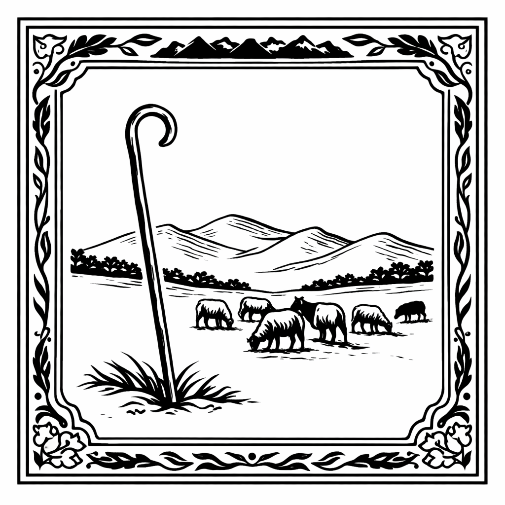{width=80%}


```{=latex}
\end{center}
\vspace*{\fill}
\newpage
```

# 2. Bölüm

Kara Durası Karamatlar'da daha mutlu ve daha huzurluydu. Burada en azından onu küçümseyen kimse yoktu. İnsanlarla fazla ilişkisi olmasa da en azından işini yapıyor, bir işe yaramanın huzurunu yaşıyordu.

Çobanlık yaptığı Zekiyeyengegiller ondan çok memnunlardı. O gelip koyunları gütmeye başladıktan sonra koyunların sütü artmış, koyunlar daha fazla yavru verir olmuş ve koyunlar daha besiliydiler. Sürüdeki koyun ve keçiler her akşam karınları tıka basa doymuş olarak dönmüş geliyorlardı dağdan.

Zekiye yenge annesine verdiği sözü tutuyor, Durası'nı evdekilerden ayırmıyordu. Evde ne yemek pişerse, evdeki diğerleri ne yerse Kara Durası da aynı şeyleri yiyordu. Tek farklı olan o diğer aile bireyleri gibi evde kalmıyor, evin hemen yanındaki sayanın önünde yapılan tek odalı kulübede kalıyordu. Kara Durası'na da sorsalar, o da bu kulübede kalmak isterdi zaten.

Bazı geceler uyku tutmadığında dağa çıkıyor, ay ışığında kıranlar tepesinde geziyordu. Bu kulübe onun özgürlüğünün merkeziydi.

Köpeği toraman nereye giderse onunla gidiyor, onu hiç yalnız bırakmıyordu. Durası kimseye güvenmiyor, hatta kendine bile güvenmiyordu. Olabildiğince insanlardan uzak duruyordu. Güttüğü koyun ve keçiler ona insanlardan daha yakındı, hele köpeği toraman onun en yakın dostuydu. Onun isteklerini, emirlerini sorgulamıyor, verdiği her komutu anında yerine getiriyordu. Kara Durası dal dediğinde hiç tereddüt etmeden 3-4 köpeğin arasına dalıyor, kıyasıya, ölesiye dalaşıyordu. Eğer Durası çevrede kimsenin olmadığından eminse elindeki sopayla diğer köpeklere dürtüyor, hatta vuruyor, toramanın galip gelmesine yardımcı oluyordu. Kara Durası'nın kafasında yaşamak istiyorsan acımasız olacaksın, gerekirse pusu kuracaksın, gerekirse hile yapacaksın ama yenilmeyeceksin.

Karaahmetler'de olabildiğince insanlardan uzak duruyordu. Sanki koyun otlattığı anlar dışında bir gölgeden farksızdı. Koyunlarını da olabildiğince insanlardan uzak yerlerde otlatıyordu. Sabah çiği kalkar kalkmaz koyunlarını dağlara sürüyor, hava kararmadan köye dönmüyordu. Çiğ kalkmadan koyunlarını otlatırsa çiğden hayvanlarının ağızlarının yara olacağını iyi biliyordu. Yazları öğle sıcağında gözlerden uzak bir yerde hava serinleyene kadar koyunlarını gölgede yatırıyordu. Neredeyse her koyunun huyunu, suyunu ezbere biliyordu. Koyun ve keçiler de ondan korkuyor, itaat ediyorlardı.

Kendi köyü Dereli'ye Naci ile yaşadığı o olaydan sonra insanlar onu iyice dışlamış, o da insanlardan iyice uzaklaşmıştı. Çobanlık yaptığı Karaahmetler'de insanlardan daha da fazla uzak durur olmuştu. Burada biriyle sorun yaşarsa köyden sürüleceğini biliyordu. Buradan da sürülürse kendi köyüne de gidemezdi, o nedenle çok dikkatli davranıyordu. Bazen karşılaştığı kendinden küçük çocuklar "Durası, Kara Durası senin dilin yok mu, güttüğün koyunlar gibi sen de meliyor musun yoksa?" diye dalga geçseler de, o bunları duymazdan geliyor, arkasına bile bakmadan yürüyüp, gidiyordu.

O hayatından memnundu aslında. Koyunları otlatırken kendi kendine talim yapıyordu. Elindeki bıçağı defalarca hedefine fırlatıyor, tam istediği yere isabet ettirene kadar bıçağı atmaya devam ediyordu. Bazı günlerde dolma av tüfeğini veriyorlardı yanına. O günler Durası pek heyecanlı oluyordu. O günler koyunları otlatmak için köyden epey uzaklara, kimselerin olmadığı ıssız yerlere götürüyor, dolma tüfeğiyle hedeflere ateş ediyordu. Koyunlar artık ona o kadar itaat eder olmuşlardı ki, uzaktan sesini duyduklarında hemen komutuna uyuyorlardı.

Bir gün bir koyun ekin tarlasına girmiş, iştahla sapa kalkmış olan buğday çimlerini yiyiyordu. Durası koyuna bağırdı, koyun oralı bile olmadı. Koyun karnını doyurmakla meşgul olduğundan sesi duymamış mıydı, yoksa buğday çimlerinin lezzetine mi kaptırmıştı kendini, yemeye devam ediyordu. Kara Durası belindeki bıçağı kınından çıkardı. Bıçağın yüzünü avucunun içine alarak nişan aldıktan sonra bıçağı hırsla koyuna doğru fırlattı. Koyun sadece me diyebildi ve sonra sırt üstü yere yuvarlandı. Kara Durası koyunun yanına vardığında, koyun çoktan ölmüştü. Sanki normal bir şeymiş gibi koyunu yattığı yerden alarak bir çam dalına astı. Koyunu yüzdü. İç organlarını köpeklere attı. Koyunun derisini çantasına, yüzülmüş koyunu da omuzuna attı. Köye geldiğinde hava iyice kararmıştı. Koyunun etini Zekiyeyenge'ye teslim etti. Ne oldu diye sorunca,

— Yenge kaya yuvarlandı, koyuna çarptı. Koyun can vermek üzereyken ben de kestim koyunu.

— İyi etmişsin Durası kardeşim, ben şimdi ondan bir güzel haşlama yaparım, kalanı da kavururum, sonra yeriz.

Kara Durası deriyi tuzladı, ağaç dallarına gerdirerek kulübesinin çatısına astı, kuruması için. Zekiye yenge'nin getirdiği haşlama eti iştahla yemiş, sofrayı toplarken kulübenin kapısında Zekiye yengenin yeni evlendiği iç güveyi kocası Kel Süleyman kapıda göründü. Kel Süleyman'ın elinde koyunun yüreğini gören Kara Durası durumu anladığından gözlerini kaçırarak yere baktı. Kel Süleyman elindeki koyun yüreğini sallayarak,

— Durası çocuk, sen bu yollardan giderken, ben dönmüş, geri geliyordum. Koyuna bıçak atmışsın, koyunun yüreği delinmiş. Anlat nasıl oldu?

Durası bir iki yutkunduktan sonra konuşmaya başladı.

— Süleyman ağam, koyun hırsızlama elalemin tarlasına girdi. Bağırdım, dinlemeyince ben de kızarak bıçağı fırlattım, o da gidip yüreğine saplanıvermiş.

— Bak çocuk sen bile isteye atmışsın bıçağı. Bir daha avcılığını koyunların üzerinde denemeye kalkarsan ben de o zaman senin yüreğini sökerim.

Kel Süleyman, Durası'nın cevap vermesini beklemeden çekip, gitti.

Kara Durası çok korkmuştu ama, neyse ucuz atlatmıştı. Kendi kendine:

— Bayağı da iyi avcı oldum hani. Mesafe epey de vardı. Durası, Süleyman'ın elinde sallandırdığı koyun yüreğini görünce epey korkmuştu ama hiç pişman olmamıştı. Bütün koyunlar itaat ederken, o koyun neden itaat etmemişti. İpin ucunu koyvermiyecekti. Başka bir koyun da aynı itaatsizliği yapsa yine cezalandırır, belki bu defa bıçak yerine sopa fırlatırdı. Koyunun yüreğine nişan aldım, hem de tam isabet, afferin bana diye kendi kendine böbürlendi.

Dağda bayırda sık sık Yahyalar'ın davarıyla karşılaşıyordu. Durası Molla Mehmet'ten korkuyor, olabildiğince onunla karşılaşmamaya çalışıyordu. Onun kendine hep şüpheyle baktığını hissediyordu. Molla Mehmet bir gün sayaya davarı kontrole gidiyordu. Durası'nın güttüğü koyunlar da Göçük Deresi'nden Kovalcaya doğru çıkıyorlardı. Sürünün epey önünde giden 3 keçi ekili buğday tarlasına girmek üzereylerdi. Epey uzaktan Durası'nın sesi duyuldu.

— Küpeli dön, varmayayım oraya.

Sesi duyan keçiler anında geri döndüler. Molla Mehmet kendi kendine bu çocuktan iyi çoban olacak dedi.

Kara Durası'na göre o sürünün reisi, toraman onun yardımcısı, koyun ve keçiler de sürüydüler. Ona itaat etmek zorundaydılar. İtaat ederlerse onları otların en yeşil, en yüksek olduğu yere götürür, itaat etmezlerse taşlık bir yerde çevirir, akşama kadar aç susuz bırakırdı. Koyun ve keçiler de kısa sürede onun her sözünü dinler, ondan aldıkları komutlara anında uyar olmuşlardı. Toraman ise onun için canını vermekten geri durmazdı.

Molla Mehmet kendi kendine:

— Bu çocuktan iyi çoban olacak da, yalnız karanlık bir yönü de yok değil. Sanki insanlardan kaçıyor diye söylendi Molla Mehmet.

Durası gündüzleri dağda bayırda, hayvanlarla uğraşırken zamanın nasıl geçtiğini anlamıyordu da, akşam oldu mu eve gelmek istemiyor, ayakları geri geri gidiyordu.

Son günlerde evde kimsenin yüzü gülmez olmuştu. Halil ağasının şehadet haberinden sonra Zekiye yenge günlerce ağlamış, insan içine çıkmamıştı. Sonunda akrabalarının "kızım aklını başına al, ufacık iki çocuk, koyunlar var, yağhane var. Nasıl çıkacaksın bunlarla başa. Bak Süleyman akrabamız da, evlen onunla hem sana, hem de çocuklarına sahip çıkar. İti, uğursuzu var. Dağda eşkıyası, çulsuzu var. Bir gün biri musallat olur, rezil olursun elaleme maazallah" demeleri üzerine sonunda isteksiz de olsa Zekiye razı olmuştu evlenmeye.

Süleyman sakin yapılı biriydi. Sanki hep oradaymış gibi dört elle sarılmıştı her işe. Ne denirse yapıyordu. Evdeki yasa o da katılmış, o da onlarla aynı yası yaşar gibiydi.

Zekiyeyengegiller'in evinde uzun zamandır büyük bir hüzün yaşanıyordu. Evin nişanlı oğlu Ali'nin şehit olduğuna dair haber alan aile bireylerini büyük bir hüzüntüye düşürmüştü. Bu üzüntüyü atlatamadan bu defa evin büyük oğlu, hem de iki çocuk babası Halil'in şehadet haberi ulaşmıştı köye. Aile hepten yıkılmıştı. İki cengaver delikanlı kardeşlerin peş peşe bir yıl içerisinde şehadet haberleri gelmişti. Zekiye yenge iki küçük çocukla kalakalmıştı. İstemese de evlenmek zorunda kalmıştı Kel Süleyman'la. Zekiyeyenge ve diğerlerinin göz yaşları haftalarca kurumadı. Köye neredeyse ayda bir şehit haberi geliyordu. Her gelen şehit haberi yeni bir aileyi büyük bir üzüntüye boğuyordu.

Zekiyeyengegillerin ilk şehidi Ali'nin şehadet haberine en fazla üzülen ise şehidin nişanlısı Molla Mehmet Ağa'nın güzel kızı Çakır Emine'ydi. Ali'nin şehadet haberi ilk günler nişanlısı Çakır Emine'den gizlenmeye çalışıldı.

Çakır Emine gergef işliyor, oyalar yapıyor çeyizini tamamlamaya çalışıyordu. Allah izin verirse Ali askerden ilk gelişinde ister teskereye gelsin, ister izine gelsin düğünleri yapılacaktı.

Çakır Emine'nin el emeği, göz nuruyla işlediği şeyler pek te güzel şeylerdi. Yüreğinde sakladığı sevgisini, hasretini bu motiflere aktarıyordu. İşlerken Ali'si geldiğinde yaşayacakları mutlu günleri düşünüyor, bazen de dalgınlıktan iğneyi parmağına batırıyordu. İğne parmağına batınca acıyla parmağını ağzına götürüyor, onu öyle gören kardeşi Hüseyin gülerek,

— Ablam, benim çakır gözlü ablam, gözlerin mi görmüyor desem, bilirim gözlerin karşı tepedeki doğanı görür. Aklın nerede ablam, nerelerde gezersin yine?

— Bırak hınzırlığı, sen işine bak. Abla ne oldu canın mı yandı diyeceğine bir de dalga geçersin.

— Yok be ablam ne dalgası, seni kızdırmak, hele o çakır gözlerini çattığını görmek hoşuma gidiyor da ondan.

Ali ve Çakır Emine çocukluklarından beri birbirlerini seviyorlardı. Ali askere alınacağı belli olduğunda nişanlısıyla yüz yüze görüşmenin bir yolunu arıyordu. Komşuları Hacı Veliler'in Hatice yengeye bir gün,

— Hatice yenge benim gitmeme az kaldı. Gidip de gelememek var, Çakır Emine'mi sizin eve çağırsan da son bir defa bir görüşebilsek.

Hatice yengenin iki kızı Ayşe ve Fatma'nın babaları Hüseyin Balkan Cephesi'nde şehit düşmüştü. Hatice kadın iki küçük kızıyla yalnız kalmıştı. Kocasının şehit düşmesinden birkaç yıl sonra da babası Hacı Hasan da rahmetli olmuştu. İki kızıyla tek başına kalan Hatice yenge varlıklı bir aile olmalarına rağmen büyük sıkıntılar yaşamıştı. O güne kadar çift çubuk bilmezken babasının da ölümüyle çocuklarını yanına alarak öküzlerle çift sürmeye gidiyordu. Güçlü öküzlerin çektiği kara sabanı kontrol etmekte zorlanıyor, sık sık tarlaya yuvarlanıyordu.

Ali buluşmalarına yardım etmesini istediğinde o günler aklına geldi hemen kabul etti.

Hatice yenge hemen Yahyalar’ın evine gitti. Molla Mehmet Ağa’nın karısı Fatma ana’yı köyde herkes sever, sayardı.

— Hu Fatma ana benim büyük kıza gergef işlemeyi öğretmeye çalışıyorum. Örneği ben de beceremedim. Git Emine ablana göster dedim, utandı gelemedi. Fatma ana Emine gelse de bizim Ayşe'ye bir yol gösteriverse.

— Tamam, tamam Hatice, Emine'nin bir işi yoksa geliversin. Kız Emine bak Hatice yengen seni çağırmaya gelmiş. İşin yoksa git Ayşe kıza bilemediği yeri gösteriver, sevaptır.

— Tamam ana ben giyineyim, gideriz birlikte.

— Benim işim var kızım. Kuşluk vakti yaklaşıyor. Biraz sonra davar gelir, keçiler sağılacak, hazırlık yapmak lazım. Sen Hatice yengenle git.

Hatice kadın Fatma ana duymayacak şekilde Emine'den tarafa eğilerek kısık bir sesle,

— Kız Çakır Emine nişanlın Ali seni bizim evde bekler, çabuk ol.

Çakır Emine çabucak hazırlandı, birlikte evden çıktılar. Zekiye yengegillerin eviyle Hatice kadınların evi saçak saçağaydı zaten.

Güzel Çakır Emine giderken çok heyecanlanmıştı, yüreği neredeyse ağzında atıyordu. Kapıdan içeri girince Emine'nin heyecanı iyiden iyiye artmıştı. Ali'nin olduğu odaya girerken neredeyse heyecandan düşüp, bayılacaktı.

Kapıdan içeri adım atar atmaz Ali'yle göz göze geldiler. Çakır Emine'nin sevgiyle bakan gözleri etrafa sevgi ışıkları saçıyordu. "Ali geldin mi, hoş geldin nişanlım" derken heyecandan sesi titriyordu. Emine, Ali, Alim diyebildi. O güzel dudakları büküldü, sesi titredi, gözlerinden sicim gibi yaşlar akmaya başladı.

İki nişanlı birbirlerine sevgiyle sıkıca sarıldılar. Uzun süre öylece konuşmadan durdular. Çakır Emine'nin göz yaşları nişanlısı Ali'nin gömleğini ıslattı, göz yaşları Ali'nin tenine deyince Ali ürperdi.

— Eminem, güzel gözlü, çakır gözlü Eminem, ben iki gün sonra askere gideceğim. Gitmek var, gelememek…

Çakır Emine'nin hıçkırıkları Ali'nin sözünü yarıda kesti.

— Söyleme Alim, öyle söyleme. Sen gönül rahatlığıyla git vatan borcunu ödemeye. Bizim buralarda savaş yok biz rahatız. O savaş bölgelerinde yaşayan kızlar, kadınlar ne kadar zorluk içerisindeler. O insanlar tacize, tecavüze uğruyorlar. Sen hem bizim namusumuzu, şerefimizi; hem de tüm vatan evlatlarının namusunu şerefini korumaya gideceksin. Git vatanını savun, gel, göğsümü gere gere düğünümüzü yaparız o zaman.

— Tamam Eminem gideceğim zaten. Şunu iyi bil seni her an düşüneceğim, senin varlığın, senin sevgin bana güç verecek. Şunu iyi bil nişanlım ben bu güne kadar senden başka kimseyi sevmedim, sevmeyeceğim.

— Özlemle, sevgiyle, hasretle ve de aynı zamanda gururla bekleyeceğim seni Alim.

Çakır Emine avucunun içerisindeki işlemeli çevreyi Ali'ye verdi.

— Alim al bunu, terleyince bununla terini silersin. Baktıkça beni hatırlarsın. Yüreğin daraldığında, başın sıkıştığında bu çevreye bak. Senden uzakta da olsa senin yolunu sevgiyle bekleyen bir çift göz, senin için atan bir yürek, senin yolunu gözleyen bir nişanlın olduğunu hatırla.

— Hiç unutmayacağım, unutamam benim güzel Çakır Eminem.

İlk geldiklerinde sarıldıkları şekilde hala ayakta duruyorlardı. Hatice yenge odanın kapısını tıklattı.

— Emine kardeşim geç oldu, anan merak eder sonra.

— Tamam Hatice yenge geliyoruz.

Uzun uzun gözlerinin içine sevgiyle baktılar. Ali eğilerek Çakır Emine'nin alnından sevgiyle öptü. Emine de sıkıca sarılarak onu yanağından sevgiyle öptü.

— Eminem, Çakır Eminem, Allah'a emanet ol, ağlama artık, seni gülerken anımsamak istiyorum.

Çakır Emine göz yaşlarını silerken, zorla da olsa gülmeye çalıştı.

— Allah yardımcın olsun Alim. Güle güle git, güle güle gel. Senin yolunu bekleyeceğim, kalbim seninle.

— Benim de kalbim seninle Eminem, tüm benliğimle seninle.

Hala sımsıkı birbirlerine sarılı duruyor, ayrılamıyorlardı. Onları böyle birbirlerine karşı aşkla bakışlarını gören Hatice yenge de göz yaşlarına hakim olamamıştı. Geleli 2 saati geçmiş, sanki 2 dakika gibi gelmişti. İki saat boyunca iki nişanlı oturmadan, ayakta öyle birbirlerine sarılmış vaziyette durmuşlardı. Bu onların yüz yüze son görüşmeleriydi.

İki gün sonra Ali davul, zurna seslerine kadınların ağlamalarının karıştığı bir törenle uğurlandı askere. Çakır Emine en güzel kıyafetlerini giymiş, dimdik duruyordu kadınların en önünde. Göz yaşlarını yüreğine akıtıyor, gözlerinden o güzel yanaklarına akan yaşları silmiyordu bile.

Ali bir fırsatını bulup baktı Emine'sinden tarafa. İki sevdalının gözleri kenetlendi birbirlerinin gözlerine. Emine kendini zorluyarak gülümsedi, kimseye fark ettirmeden elini salladı. Ali arkasına dönerek hazırlanan atın eğerinin üzerine atlayarak atını dörtnala sürdü. Ali ardına bile bakmadan hırsla sürdü atını dört nala. Ardına bakarsa gözlerinden akan göz yaşlarının görülmesinden korktu.

Emine ise gözlerinden akan yaşları silmeden, ağladığının görülmesine aldırmadan dimdik durarak baktı atının üzerinde uçar gibi giden nişanlısı Ali'nin ardından. Dudaklarından mırıl mırıl dua sesleri yükseldi. Sonunda Fatiha suresini okuyarak amin dedi ve ellerini yüzüne sıvazladı. Sonra sanki orada kendisinden başka kimse yokmuş gibi,

— Güle güle git yiğidim. Vatan senden ve senin gibi evlatlarından hizmet bekler. Bekleyeceğim seni, hem de dört gözle bekleyeceğim.

Ali'si silah altına alındıktan sonra Çakır Emine mecbur kalmadıkça pek fazla evden dışarı çıkmaz oldu. Gergef işliyor, duygularını motif motif işliyordu. Çakır Emine kendi kendine işlemelerini yaparken "Alim ne zaman gelir, gelir mi, yoksa şehadet haberi mi gelir" diye içinden geçirirken kendini tutamadı hıçkırıklara boğuldu.

Ayrılırlarken her ikisi de biliyorlardı kavuşma ümitleri ne kadarsa kavuşamama umutsuzluğu da bir o kadardı. Öyle de olsa vatan borcu kutsaldı, vatan savunması namustu. Vatan savunulmazsa ortada ne vatan kalırdı, ne bir şey. Çakır Emine bunları düşünerek kendini ferahlatmaya çalışıyordu bir taraftan, bir taraftan da Ali'sine dair bir haber alabilme umudunun heyecanıyla yüreği pır pır atıyordu.

Çakır Emine duygularını yüreğinde yaşıyor, yapacağı işlerle kendini avutmaya çalışıyordu. İşlerini de hiç aksatmıyordu. Sağılan davarın sütünü süzüyor, peynir mayalıyordu. Peynir mayalama işi Emine'nindi. Fatma ana kızına,

— Kız Emine bu peynir mayalama işini sana ben öğrettim ama benden bile güzel yapıyorsun bu işi. Boşuna boynuz kulaktan sonra çıkar ama kulağı geçer dememişler.

Emine'nin mayaladıkları peynirler pek güzel olurdu. Hiç delik delik olmazdı. Peynir mayası doğru miktarda katılmaz ve iyi karıştırılmazsa, peynir delikli olur, bu da kaliteyi düşürürdü. Babası Molla Mehmet bu peynirleri Bursa, Bilecik, Gölpazarı pazarlarına götürdüğünde peynirler kapış kapış satılıyordu. Alan ertesi hafta yeniden almaya geliyordu. Molla Mehmet'in müşterisi her geçen gün artıyordu. Bursa, Bilecik pazarlarında bile onun peynir satmaya gideceği günleri bekleyen birçok müşterisi oluşmuştu. Müşteriye her hafta aynı kalitede peynir verebilmek güven açısından çok önemliydi.

Emine böyle durmadan çalışarak nişanlısının hasretini azaltmaya çalışıyordu, çalışıyordu da azalma şöyle dursun, her geçen gün hasret katlanarak artıyordu. Emine sık sık bir kenara çekiliyor, özlediği Ali'sine türküler yakıyordu. Türkü söylerken gözlerinden akan yaşları oyalı yemenisine siliyordu. Ali askere gideli 6 ay olmuştu ama sen gel bir de Çakır Emine'ye sor, ona sanki 6 yıl, 60 yıl gibi gelmişti.

Gündüzleri kalabalık aile olduklarından öyle veya böyle vakit geçiyordu da; akşam olup, akşam yemeğini yiyip, yatsı namazını da kıldıktan sonra Emine odasına çekilince zaman bir türlü geçmek bilmiyordu. Pencerenin perdesini hafif aralayarak dışarı bakıyor, ayı ve yıldızları seyrediyordu. Ali'sini hayal ediyor, gelecekleriyle ilgili düşler kuruyor, kurduklarıyla bazen dudaklarına bir tebessüm yayılıyor, bazen de kaşları çatılıyordu.

Onu tek güldüren küçük kardeşi Hüseyin'in haylazlıklarıydı. Hüseyin ne zaman bir yaramazlık yapsa anasından yiyeceği zılgıttan kurtulmak için hemen ablasının yanına koşuyordu. Çakır Emine bırak kardeşine bir fiske vurdurmak, laf bile söyletmezdi. Fatma ananın, Hüseyin'in durdurak bilmeyen haylazlıkları sonucu kabaran ayranı, iki kardeşin öyle sımsıkı birbirlerinin ardında durur görünce hemen iniverir, iniverir ama Hüseyin'e "ulan haylaz oğlan sanma bir gün ablanın olmadığı bir yerde seni sıkıştıramayacağımı, o zaman bacaklarını kıracağım senin" derdi. Her iki kardeş birden analarına sımsıkı sarılınca bu defa mutluluk ve gururdan Fatma ananın gözleri dolardı. Hüseyin'e kızsa da, böyle cesur, korkusuz, civan gibi bir çocuk olarak yetişmesinden pek te memnundu aslında.

Çakır Emine'nin tek gittiği yer Hatice kadının eviydi. Hatice kadının büyük kızı Ayşe'ye gergef işlemeyi öğreteceğim bahanesiyle annesi Fatma anadan izin alıyor, Hatice kadınla dertleşiyordu. Hatice kadın, Çakır Emine'ye baktıkça kendi geçmişini anımsıyor; kendi kendine "inşallah sonları bizim gibi olmaz" diyordu. Çakır Emine'nin yüreği ferahlasın diye ona hep güzel şeylerden bahsediyor, onun sırtına gelinliği kendi elleriyle giydireceğini söylüyor, onu kendi elleriyle süsleyip, Ali'sinin koynuna yollayacağını söylüyordu. O böyle söyleyince Çakır Emine utanıyor gözlerini gergefe dikiyordu.

Hatice'nin dedeleri Cansızlar köyü yakınlarındaki Toypuklar denilen mevkiden bu köye gelmişlerdi. Toypuklardaki ailenin yarısı Karamatlar'a gelirken, yarısı da Cansızlar köyü'ne yerleşmişlerdi. Köyün en zengini olan babası Hacı Hasan'ın oğlu gittiği vatan borcundan dönememiş, şehit haberi gelmişti. Hacı Hasan kızı Hatice evlenme yaşına gelince kızı Hatice'yi bir gün karşısına alarak,

— Kızım Hatice evlenme yaşın geldi. Ağabeyin de şehit düştü, bizim başka erkek evladımız da yok. Bu kadar mal, mülk var bu ocağın tütmesi lazım. Kızım Cansızlar'lı amcamın torunu Hüseyin ile sizi evlendirelim diyoruz. Eğer sen kabul edersen, sen gelin gitmeyeceksin, Hüseyin bu eve iç güveyi gelecek.

— Sen bilirsin hacı babam.

Hatice ve Hüseyin de birbirlerine ilgisiz değillerdi. Birbirleriyle karşılaştıklarında her ikisi de ilgi ve sevgiyle ötekisine bakmaktan kendini alamıyordu. Hatice kadın Hüseyin'iyle davul zurnayla evlenmiş, iki de kızları olmuştu. Kızlarının büyüğüne peygamberimizin sevgili eşi Ayşe, küçük kızlarına da peygamberimizin küçük kızı, soyunu sürdüren Fatma'nın isimlerini vermişlerdi. Hüseyin askere giderken Fatma daha küçücüktü. Hüseyin ikinci kızları Fatma daha emeklerken askere alınmıştı. Hüseyin bir intikal anında Taraklı civarından geçerlerken kısa süreliğine firar ederek evine gelmiş, eşi ve çocuklarıyla hasret gidermişti. Hatice kadın aradan 3 gün geçtikten sonra,

— Hüseyinim, özledim dedin, geldim dedin, bak 3 gün oldu. Vatan senden ve senin gibilerden hizmet bekler. Bu gün gidip şubeye teslim ol. Bir daha da terhis belgeni almadan gelme bu eve. Gelirsen şart olsun seni sokmam bu eve.

Hüseyin ertesi sabah karısı ve çocuklarıyla vedalaşarak gidip teslim oldu Gölpazarı Askerlik Şubesi'ne. Teslim olmasından bir yıl bile geçmeden Çanakkale Cephesi'nde şehit düştüğü haberi geldi köye. Şehit dulu olan Hatice, Çakır Emine'yi çok iyi anlıyor, ona destek olmaya çalışıyordu. Ali de askere gideli bir altı ay kadar olmuştu.

Aradan 6 ay geçmiş, o güne kadar hiç haber gelmemişti. Ali'nin gelen ilk haberi şehadet haberiydi. Emine bir gün annesiyle amcasının karısı yengesinin pısır pısır konuştuklarını duydu.

Amcasının hanımı yengesi,

— Fatma yenge ne zaman söyleyeceksin Emine'ye, böyle bir şey daha ne kadar saklanır, önünde sonunda öğrenmeyecek mi?

Çakır Emine bunları duyunca merakı iyice arttı. Ne saklıyorlardı ondan, neyi önünde sonunda öğrenecekti.

— Eltim elbet söyleyeceğiz tabi ama böyle bir şey nasıl söylenir. Kızım nişanlın şehit düşmüş nasıl denir?

Bir çığlık duyuldu ardından bir güldürtü duyuldu.

Fatma ana çığlığın geldiği yöne bakarak; "Kızım, güzel kızım, kusuruma bakma, böyle duymamalıydın" diyebildi. Konuşmaları duyan Çakır Emine derin bir üzüntü duymuş, acıyla çığlık atmış, ardından da kendini kaybederek bayılmıştı. Çakır Emine'yi yerden kaldırarak sedirin üzerine yatırdılar. Yere düşerken kapının eşiğine kafası vuran Çakır Emine'nin şakağından kan sızıyordu. Önce akan kanı dindirdiler. Çakır Emine ancak saatler sonra gözlerini açarak kendine gelebildi.

Gözlerini açar açmaz yaşananların gerçek olduğunu idrak edince göz yaşları sel olup, akmaya devam etti. Çakır Emine derin bir elem içerisindeydi. Günlerce uyumadı, bir şey yemedi, sabit bir noktaya bakarak hep ağladı, ağladı Emine.

Akranları, büyükleri, anası, yengesi hep konuştular, teselli etmeye çalıştılar, hiç konuşmadı Çakır Emine. Hep ağladı, ağladı, göz pınarları kuruyana kadar ağladı. Hatice yengesi hemen hemen her gün yanına uğruyor, onu teselli etmeye çalışıyordu ama Emine'nin yaşadığı acı ve elem o kadar büyüktü ki, hiçbir şey kar etmiyordu.

Çakır Emine kederinden hastalandı, yataklara düştü.

Bir ay sonra gördüğü rüyadan sonra yatağından çıkarak gusül abdesti aldı ve ardından iki rekat şükür namazı kıldı.

Rüyasında nişanlısı Ali:

— Ben ölmedim Eminem, şehitler ölmez. Peygamberimiz de şehitlerinize ölü demeyiniz, onlar ölmemişlerdir dememiş midir. Sadece bir süre birbirimizden uzak kalacağız. Önünde sonunda ahirette kavuşacağız. Sen ağladıkça, sen yataktan çıkmadıkça ben çok üzülüyorum. Dünya'da mutlu ol, sen mutlu olursan bil ki ben de mutlu olurum.

Çakır Emine'nin yataktan çıkarak abdest alıp, namaz kıldığını gören anne ve babası şaşırsalar da çok sevindiler. Selam verdiğinde kardeşi Hüseyin gelerek ablasının boynuna sarıldı, yanaklarından öptü. Hüseyin de ablası gibi çakır gözlüydü.

— Abla benim karnım acıktı, bana yemek yapar mısın, başkasının yaptığı yemekler seninki kadar lezzetli olmuyor.

— Yaparım tabi kardeşim, yaparım tabi gözümün nuru, sen yeter ki iste. Anamınkilerden bile mi lezzetli oluyor benim yemeklerim.

— Aneminkilerden bile abla. Ben senin yaptığın yemeği yemezsem doymuyorum canım ablam.

Annesi, Hüseyin'e,

— Seni hınzır, seni bak anasınınkilerden bile lezzetliymiş. Ablan yokken sana yemek yemekte yapmam artık. Bakalım o zaman ne yapacaksın.

Çakır Emine kardeşi Hüseyin'i çok severdi. O zor günlerinde onu birkaç dakikalığına da olsa güldürebilen kardeşi olmuştu. Onu hep yatakta tavana bakarken görünce gelip ablasını gıdıklıyordu.

Hüzün Yahyaların evinin yanı sıra aynı oranda Zekiyeyengegillerin evini de sarmıştı. En çok da kardeşi Halil derin bir eleme kapılmıştı. Halil de kardeşi Ali'den 1 ay sonra askere alınmıştı. Halil yaralı olarak köyüne hava değişimine döndüğünde kardeşinin şahadet haberiyle derinden sarsılmıştı.

Halil kardeşinin şehit haberiyle çok fazla etkilenmişti. Evde oturuyor, ya da aynı kendisi gibi Çanakkale Cephesi'nde yaralandıkları için hava değişimine gönderilen Katil Nuri ve Kel Hasan'la bir araya geliyor sohbet ediyorlardı. Halil neredeyse Durası'nın farkında bile değildi. Durası ise endişe ve telaş içerisindeydi. Bir gün askere alınma sırasının kendisine geleceğini biliyor, köye her asker müfrezesi geldiğinde yüreği ağzına geliyor, bazen de usulca kıranlara doğru sıvışıyordu.

Kara Durası her yıl kendisine verilen oğlakları 2 yaşına gelip, erkeç olunca satıyor, parasını annesine gönderiyordu. Annesi o çoban durduktan sonra geçim sıkıntısı çekmez olmuştu.

Karamatlar'ın dağlarında odun da boldu. Çam mı istersin, meşe mi istersin, hepsi vardı. Durası koyunlar otlarken baltasıyla dağlarda odun hazırlıyor, zaman zaman bu odunları Zekiyeyengegillerin eşeğine sararak akşam hava kararınca anasına Dereli'ye götürüyordu. Fadime kadının artık oğlu sayesinde sofrasında aş, ocağında odun vardı. Sırtına giyeceği giysileri dokuyabilecek ipi de oluyordu.

Kara Durası bir sabah kalkmış sabah çorbasını içmiş, köpekleri yallamış, koyunları otlatmaya götürmeye hazırlanıyordu.

Tam koyun ağılının kapısını açacaktı, Zekiye yengenin kendine seslendiğini duydu.

— Hu Durası oğlum, şuraya bir gel hele.

— Zekiye yenge koyunları otlatmaya götüreceğim, ne söyleyeceksen oradan söyleyiver.

— Koyunların acelesi yok, sen biraz gel hele.

Zekiye yengenin yanına giden Kara Durası,

— Yenge ne diyeceksen, deyiver, acelem var, bu gün koyunları uzağa götüreceğim.

— Böyle şey nasıl söylenir bilemiyorum ama biraz önce sizin Dereli'den biri geldi. Biliyorsun anan son zamanlarda biraz hastaydı. Anan dün gece hakkın rahmetine kavuşmuş, başın sağolsun oğlum.

Kara Durası duydukları karşısında donup kalmıştı. Konuşamıyor ama gözlerinden akan yaşlar yanaklarından sızarak yere damlıyordu. Onu hayatta gerçek anlamda tek seven, tutunabileceği tek dalı olan anacığı ölmüştü. Neden sonra,

— Zekiye yenge ben ne yapacağım şimdi? Ölen biriyle ilgili ne yapılır ben bilmem ki.

— Sen onları merak etme Durası oğlum, dini vecibeler neyse hepsini birlikte yerine getiririz. Zaten Halil ağam mezarı kazdırmak, ve diğer yapılacak işler için çoktan Dereli'ye gitti bile. Biz de buradan kefen, sabun ne gerekirse alıp, birlikte gideriz. Haydi sen vakit geçirme, hazırlan.

Zekiye yenge eşeğinin semerini vurdu, semerin üzerine heybesini yerleştirdi. Heybelere ne gerekirse doldurdu. Kara Durası her söyleneni yapıyor, gözlerinden akan yaşları sürekli siliyordu. Zekiye yenge, Kara Durası, köyden birkaç yaşlı erkek ve kadın cenaze törenine katılmak üzere birlikte yola çıktılar. Madanlar deresine vardıklarında Yahyalar'ın çobanı İsa nefes nefese koşarak arkalarından yetişti.

— Bre Durası kardaş, anan rahmetli olmuş, başın sağolsun beya. Allah sana sabırlar versin, anacığının mekanı cennet olsun.

— Sağol İsa aga, Allah razı olsun.

Kafile Dereli'ye vardığında her şey hazırdı. Halil her şeyle ilgilenmişti. Öğle namazından sonra kılınan cenaze namazının ardından anacığını mezarlığa defnettiler. Defin esnasında başın sağolsun diyenlere, Kara Durası sadece sağol diyordu. Kendi kendine keşke anamı Karamatlar mezarlığına gömseydim dedi. Kara Durası kendini Dereli'liden daha fazla Karamatlar'lı hissediyordu. Mezarlığa gelenlerden Karamatlar'lılar onun köylüsü, Dereli'ler yabancı gibiydi. Mezarlıkta Dereli'liler dağılmış, yanında Karamatlar'lılar kalmıştı. Zekiye yenge,

— Durası evladım bundan sonra kalan dini vecibeler Kuran okuma, mevlüt gibi şeyleri biz Karamatlar'da yaparız. Sen birkaç gün kal, evi derler toplarsın, ne zaman işin biterse gelirsin.

— Burada kalmama neden olacak bir şey yok Zekiye yenge. Siz gidin ardınızdan biraz sonra ben de gelirim. Yapılacak bir şey yok. Anamın yaşlı bir eşeği vardı, o eşeği de teyzeme verdim.

Karamatlar'lılar mezarlıktan ayrıldıktan sonra anasının mezarının üzerine eğildi, anası için yeniden bildiği kadarıyla dua etti.

— Anacığım biliyorum hep benim iyi olmamı istedin, Karamatlar'a da onun için gönderdin, beni beladan uzak tutmaya çalıştın. Ben böyleyim ana her şeye, bana yapılanlara karşı bir kin var içimde. Yattığın yerler cennet olsun anam.

İki tane taş buldu; büyüğünü anasının baş ucuna, küçüğünü ayak ucuna dikti. Ayağa kalktığı sırada arkasında bir çıtırtı duydu. Geri dönüp baktığında arkasındakinin teyzesi olduğunu gördü. Teyzesi gözlerinden akan yaşları siliyordu. Teyze yeğen birbirlerine sarıldılar.

— Ah be teyzem, yabancı olduk birbirimize. Ne ben abla diyebildim, ne ablam kardeşim diyebildi.

Kara Durası'nın teyzesi öldüresiye dövdüğü Naci'nin amcasıyla evliydi. Teyzesinin kocası da askerde şehit düşmüştü. Teyzesi biri 2, diğeri 4 yaşında iki çocukla baş başa kalakalmıştı. Teyzesi iki çocuğu ile birlikte Naci, Naci'nin kardeşi, annesi; kayınbabası ve kaynanası ile birlikte aynı evde kalıyordu. İki çocuğu ile birlikte onlar kol kanat geriyorlardı ona. Kara Durası, Naci'yi öldüresiye dövünce onlar da Durası ve anasına karşı bir husumet oluşmuştu. Teyzesi de onlardan korktuğundan ablası ve yeğeniyle görüşmeyi bile göze alamamıştı. Halbuki o olaydan önce iki kız kardeş birbirlerine ne kadar da yakındılar. Olaydan sonra iki kardeş sanki suç işliyorlarmış gibi kıyıda köşede, gözlerden uzak görüşmek zorunda kalmışlardı.

Kara Durası'nın dikkatini bir genç kız çekmişti. Cenaze defnedilene kadar hep göz yaşı dökmüştü, Kara Durası'ndan bile fazla ağlıyordu. Bu güzel kızı Durası bir yerlerden hatırlıyordu ama nereden bir türlü çıkartamıyordu. Kız cenazeye katılanlarla da birbir ilgilenmişti. Özellikle dışarıdan gelen misafirlere sürekli ayran, su taşımıştı.

Kara Durası zaten cenaze evden çıkarılırken evin kapısını kilitlemişti. Teyzesinin elini öperek Karamatlar'a doğru yollandı. Köye gelince Zekiye yenge onunla evladı, kardeşi gibi ilgilendi. Bir de İsa aga gelerek sık sık hatırını sordu. İsa'nın da ne anası, ne de babası vardı. O bir de memleketini, doğup büyüdüğü toprakları terkedip, hiç bilmediği memleketlere göç etmek zorunda kalmıştı.

Kara Durası o gece hiç uyumadı, ay ışığında kıranlarda dolaştı, hoca sabah ezanını okurken köye döndü. Saatlerce hiçbir şey düşünmeden anlamsızca dolaşmıştı dağlarda. Şimdi artık tamamen yapayalnızdı, hayattaki tek canı anası da terk etmişti onu. Yaşama karşı, yaşanılanlara karşı kini bir kat daha arttı. Kendi kendine:

— Ulan annemin ardından göz yaşı dökecek bir evladı, kardeşi, komşuları vardı, ulan ben ölsem ardımdan bir damla bile göz yaşı dökecek bir insan evladı yok şu koca Dünya'da. Ulan ben böyle hayatın içine ederim, ulan ben kimin için savaşacağım, şehit düşersem, şehit haberimi kime verecekler?

Bunları düşünürken kulübenin önündeki kütüğün üzerine tüner gibi çökmüştü. O böyle içinden söylenirken köpeği toraman "ben varım" der gibi sesler çıkartıyor, kuyruğunu sallıyordu.

Kara Durası ertesi sabah hiçbir şey olmamış gibi koyunları önüne katarak otlatmaya götürdü. İnsanlardan iyice uzak olmak için koyunlarını o zamanlarda pek insanın gitmediği Hacıköy sınırındaki Akderelere götürdü sürüsünü.

Gölpazarı topraklarında savaş olmasa da Sakarya Nehri'nin hemen batısı Osmaneli, Vezirhan, Bilecik, Söğüt düşman mezalimi altındaydı. Kurtuluş Savaşı son şiddetiyle devam ediyordu. Ankara TBMM hükümeti milletin topyekün mücadele etmesi gerektiği gerekçesiyle Tekalifi Milliye kanunu çıkarmıştı. Her aile elinden ne gelirse katkı verecekti. Gerektiğinde milletin elindeki ulaşım araçlarına, bazı mallara savaştan sonra bedelleri ödenmek üzere el konulacaktı. Her aile karınca kaderince orduya yün çorap, iç çamaşırı, çarık gönderecekti.

İstanbul Saray Hükümeti ise bu direnişi kırmak için elinden geleni yapıyordu. Sürekli Yunan kuvvetlerine direnilmemesi gerektiği konusunda fermanlar, fetvalar yayınlatıyordu. Ülkenin askere ihtiyacı vardı. TBMM aldığı bir kararla 18 yaşın üzerindeki gençleri, daha önceki savaşlarda yaralandıklarından hava değişimine gönderilen, ya da terhis edilen eski askerleri de silah altına çağırıyorlardı. Karamatlar'dan Halil, Pepe Hasan ve Katil Nuri de yeniden silah altına çağrılmıştı. Üç arkadaş kafa kafaya vererek günlerce konuştular. Katil Nuri,

— Şart olsun ben bir daha gitmem askere. Yıllarca savaştım bu millet, bu vatan için. Sıra şimdi başkalarında. Vücudumdaki yara izleri bunun şahidi. Doğru demiyor muyum kardaşlarım, hele bir de siz söyleyin.

Pepe Hasan kafasını kaşıdıktan sonra,

— Vallaha doğru dersin Nuri, benim de yaralarım şahidim doğrusu. Kaç gavur öldürdüm hatırlamıyorum bile. Biraz da başkaları savaşsın.

Halil arkadaşlarını dinledikten sonra,

— Arkadaşlar haklısınız ama vatan elden gidiyor. Sen gitmezsen, ben gitmezsem, o gitmezse, kim gidecek düşmanla savaşmaya. İyi düşünün kardaşlar. Bak benim civan kardeşim Ali de daha yeni şehit düştü. Nişanlısı Çakır Emine'yi görünce içim sızılıyor vallaha. Ben şimdi vatan için vuruşmaktan kaçarsam nasıl bakarım kardeşimin nişanlısının yüzüne. Vallahi sizleri bilmem ama ben gideceğim askere yeniden. Gelin 3 kardaş hep birlikte gidelim vatan savunmasına. Belki de aynı bölüğe düşeriz kim bilir. Omuz omuza vuruşuruz. Ya şehit oluruz, ya da yeniden gazi. Kuran-ı Kerim mücadelemiyor mu, şehitler ölmez, onlar yaşıyorlardır.

Halil ne kadar dil dökse de Katil Nuri'yi ikna edemedi. Hasan da Nuri'ye uydu. Sonunda Halil tek başına gitmeye karar verdi. Karısıyla, köylüleriyle vedalaştı. Evlatlarını bağrına bastı. Kara Durası'na sarıldı. Giderken,

— Durası buraları sana emanet, emanete sahip çık, gelince sorarım hesabını ha.

— Sen, sen meraklanma ağam, canım pahasına.

Halil tek başına gitti vatan savunmasına yeniden. Halil köyden ayrıldıktan sonra aynı kardeşi Ali'nin şehadet haberi gibi onun da şehadet haberi ulaştı köye. Aynı yıl içerisinde Zekiyeyengegillerin evine iki kardeşin de şehadet haberi ulaştı.

Zekiye yenge acısını aylarca yaşadı, evlatlarına sarılarak göz yaşları döktü, sonunda akrabalarının israrına dayanamayarak evlatlarını koruyabilmek için Bilyaz köyünden akrabaları Kel Süleyman ile evlenmek zorunda kaldı.

Durası daha bir sarıldı işlere Halil ağasının şehadetinden sonra. Kendisine söylenmeden odunları kesiyor, ekinleri biçiyor, koyunları kırpıyor, evin her işine koşuyordu. Kel Süleyman eve geldikten sonra aynı Halil ağasında olduğu gibi ona da itaat etmiş, sözünden çıkmamıştı. Sanki Halil gitmiş Halil'in yerini Süleyman almıştı.

Süleyman hem Halil, hem de Nuri ve Hasan'ın yakın arkadaşıydı. Çanakkale cephesinde ise Nuri ile aynı alayda sırt sırta savaşmışlardı. Süleyman Taraklı'nın Bilyaz köyündendi. Aynı Halil, Nuri ve Hasan gibi o da yeniden silah altına çağırılmış ama o da Nuri ve Hasan gibi çağırıya uymamıştı. O başka ilçeden olduğundan Karamatlar'da onu arayan da olmuyordu.

Molla Mehmet bir gün atıyla Bilecik pazarından dönerken Dereli Muhtarı eline bir evrak sıkıştırmıştı. Bu evrağa göre Kara Durası da askere çağırılanların arasındaydı. Molla Mehmet köye dönünce İsa'yı göndererek Kara Durası'nı çağırttırdı.

— Durası evladım seni de askere çağırıyorlar, askerlik çağın gelmiş. Vatan tüm evlatlarından olduğu gibi senden de hizmet bekler. On gün içerisinde şubeye teslim olman gerekiyormuş, hazırlıklarını yap.

Kara Durası, Molla Mehmet ağa'yı dinledi ama hiçbir şey söylemeden çıkıp, gitti. Zaten Durası'nın konuştuğu pek görülmemişti. Aldığı habere üzülmüş mü, sevinmiş mi kimse anlayamamıştı. Molla Mehmet askerlik çağrılarını köyde hava değişiminde olan Kel Hasan ve Katil Nuri'ye de bildirmişti.

Süleyman, Nuri ve Hasan hiçbir aradan ayrılmıyorlardı. Halil şehit düşünce onun yerini Süleyman almıştı. Bir gün Nuri'lerin evinde toplanmışlardı. Katil Nuri,

— Arkadaşlar biz bu vatan uğruna yıllarca savaştık, yaralandık. Bizi yine askere çağırıyorlar. Ben sizi bilmem ama ben bir daha askere gitmeyeceğim. Zaten ne olduğu da belli değil. Padişah hükümeti terhis ediyor, Ankara Hükümeti yeniden askere çağırıyor. Ben anlamadım arkadaş bir memlekette iki hükümet mi olurmuş.

Kel Hasan,

— Ben böyle siyaset işlerinden anlamam arkadaş ama ben de gitmeyeceğim yeniden askere.

Süleyman düşündükten sonra,

— Tamam arkadaşlar gitmeyelim de, ne yapalım. Benim de takatim kalmadı aslan gibi 2 kardeşimi şehit verdim bu memlekete. Kardeşimin nişanlısının o halini görünce içim parçalanıyor. Kardeşim diyorum, hem Ali, hem de Halil benim kardeşim gibiydiler. Onlar benim yakın akrabalarımdı, hep kardeşim olarak gördüm onları. Ben derim iyi düşünelim. Benim size göre sorumluluğum daha fazla olsa da ben yine de gidip, teslim olalım derim.

Yahyalar ile Halimeler'in evleri karşı karşıyaydı. Pencere'den şehit düşen kardeşinin nişanlısı Çakır Emine'yi göstererek,

— Bakın şuna arkadaşlar, yürüyor ama sanki içinde ruhu yok gibi, yazık vallaha. Tamam ben de kesin kararlıyım asker kaçağı olmayı göze alacağım askere gitmeyeceğim. Bunları söylüyorum ama kafam da çok karışık. Birlikte düşmana silah sıktığımız arkadaşlar cephede şehit düşerken biz burada nasıl günümüzü gün edeceğiz onu bilemiyorum işte.

Katil Nuri:

— Arkadaşlar dağları mekan tutmuş birçok efe, çete grupları var. Ben çete olalım demiyorum ama efe olalım diyorum. Biz üçümüz sırt sırta verdik mi, memleketin tozunu atarız alimallah.

Süleyman,

— Tamam ben varım, efe olalım. Zaten memlekette daha çok ta Göynük ve Taraklı'mın bazı büyük köylerinde zengin ağalar fakir milleti eziyor, onları köle gibi çalıştırıyor. Efe olalım o zalim ağaları haraca bağlarız. Onlardan aldıklarımızla hem kendi ihtiyaçlarımızı karşılarız, hem de fakirlere, özellikle dul kadınlara dağıtırız.

Pepe Hasan heyecanlanmıştı.

— Vay be benim can arkadaşlarım, ağızlarınızdan bal damlar, ben de varım. Bekleyin dağlar, bekleyin kalonoz kırı, Karamatlar'lı efeler geliyor.

Üç arkadaş verilen zamanda askerlik Şubesi'ne teslim olmayarak asker kaçağı durumuna düştüler. Molla Mehmet ne kadar teslim olmaları konusunda nasihatlar verse, ikna etmeye çalışsa da onlar geri adım atmadılar, asker kaçağı olmayı, dağa çıkıp efe olmayı kafalarına koydular.

İçlerinde en serti, en acımasızı Katil Nuri'ydi. Molla Mehmet'in Süleyman ile Hasan'ı ikna etmesinden korktuğu için Molla Mehmet'e dönerek,

— Mehmet ağam senin için konuşması kolay tabi. Senin yanında arkadaşların şehit düşmedi. Paran var diye hem kendine, hem de kardeşin Yakup ağa'ya bedel ödedin. Senin için konuşmak kolay tabi.

Bu sözler üzerine Molla Mehmet bir şeyler söyleyecek oldu, sustu, kalbini kırmamak için yutkundu. "Gençler ben bir daha düşünün derim, son pişmanlık fayda vermez" dedikten sonra yanlarından ayrıldı. Üç arkadaş konuşmadan, hatta birbirlerinin yüzlerine bile bakmadan uzun süre öyle oturdular. Sessizliği Süleyman'ın sesi bozdu.

— Haydi kalkın, kendinize gelin, ne düşünürsünüz arpacı kumruları gibi. Karar verdik bir kere, haydin binelim atlara.

Diğer ikisi bir şey söylemedi. Atlandılar, mavzerlerini sırtlarına astılar, çapraz fişekliklerini kuşanarak dağa çıktılar. Önce köyün hemen üzerindeki Kıranlar Tepesi'ne çıktılar. Süleyman atına ho diyerek yere atladı, ardından da diğerleri atladı. Atlar yeşil otları yerken Süleyman,

— Artık birlikte çıktık yola. Bunun dönüşü yok arkadaşlar. Efelikle, eşkıyalık arasında ince bir çizgi var, şimdi söz vereceğiz birbirimize. Bu çizgiyi aşmak yok. Aşan olursa diğer ikimiz onun cezasını acımadan vermeli. Var mısınız, söyleyin.

Pepe Hasan kekeleyerek:

— Ba va varım, ben varım, hem de sonuna kadar varım, anca beraber, kanca beraber. Bundan sonra siz benim için öz kardeşten ilerisiniz. Kavili bozan çeker cezasını. Tek isteğim var karı, kız işlerine fazla karışmak yok.

Katil Nuri ok gibi fırladı yerinden.

— Ben varım, vallahi de varım, billahi de varım, tallahi de varım. İkinizden biri sözünde durmazsa ben kardeşim demeyeceğim, acımadan vuracağım. Ben sözümden dönersem siz de bana acımayın, alnımın ortasından vurun.

Kavilleşen 3 arkadaş havaya üçer el ateş ettiler. Mavzer seslerine atlar kafalarını kaldırarak, kulaklarını diktiler. Katil Nuri,

— Arkadaşlar ikiniz de kelsiniz. Biriniz Kel Süleyman, diğeriniz kel Hasan. Vallahi Süleyman bence daha kel. Bence bundan böyle Süleyman kel lakabıyla anılmaya devam etsin, Hasan kardeşim bak sen de de biraz kekemelik var, karışmasın, sana da pepe Hasan diyelim.

Hasan önce kaşlarını çattı, olmaz diyecek oldu. Sonra kafasındaki fesi çarptı yere.

— Tamam ulan, tamam ben bu günden itibaren kellikten, pepeliğe terfi ediyorum. Ulan adam akıllı bir lakap yok mu; biriniz katil, biriniz kel, ben de pepe, hey Allahım.

Kel Süleyman kararlı bir şekilde arkadaşlarına bakarak,

— Anca beraber, kanca beraber, efe olacağız. Çete olmak yok. Çeteliğe özenen canıyla öder. Efelik ne gerektirirse o şekilde hareket edeceğiz. Hasan kardeşim biz evliyiz, senin uçkur işine karışmayız ama adabıyla olursa. Zorla, ya da kandırarak bir şey yapmaya kalkarsan o zaman çeteciliğe girer, sonucuna da katlanırsın.

Bu 3 arkadaş o tarihten sonra Karamatlar'lı efeler diye bölgede, özellikle de Narzanlar, Kilciler, Gerişler, Hilaller, Nalçacılar, Boyacılar, Dumanköy, Akçapınar, Gökçeözü'nü de içine alan Kalanoz bölgesinde nam saldılar. Bölgenin zengin ağalarını haraca bağladılar. Zengin ağalardan haraç alıyorlar, alınan haracın yarısından fazlasını ihtiyacı olanlara dağıtıyorlardı.

Üçünün de görünüşü heybetliydi. Altlarında cins atlar, sırtlarında çapraz asılmış fişeklikler, Alman filintası mavzerler, bellerinde tabancalar, görünüşleri bile görenlere korku salıyordu. Tek başına hiçbir yere gitmiyor, üçü hep birlikte hareket ediyorlardı.

Zengin ağalara diş bileyen fakir halk bu efeleri el üstünde tutar, gelmelerini dört gözle bekler olmuşlardı. Kel Süleyman Efe, Katil Nuri Efe ve Pepe Hasan Efe'den oluşan Karamatlar'lı efeler, Karamatlar ve çevre köylerden hiç kimseden haraç almadılar. Dağa çıktıkları ilk gün kendi köylerinden ve kendi köylerine bitişik köylerden haraç almayacaklarını kararlaştırmışlardı.

Aynı günlerde Kara Durası da askerlik şubesine teslim olmayarak asker kaçağı durumuna düşmüştü. Sık sık jandarma müfrezesi bölgedeki asker kaçaklarının peşine düşüyor, yakaladıkları asker kaçaklarını askere sevk ediyorlardı. Kara Durası jandarma köye gelince dağa kaçıyor, jandarma köyden ayrılana kadar dağda yaşıyor, jandarma köyden ayrılınca hiçbir şey olmamış gibi köye dönerek koyunları gütmeye devam ediyordu.

Jandarma Karamatlar ve yukarı köylerde asker kaçağı takibine çıkacağı zaman karargahını Molla Mehmet Ağa'nın evine kuruyordu. Böylelikle daha jandarma köye gelirken Kara Durası'nın haberi oluyordu.

Kara Durası kafaya koymuştu gitmeyecekti askere, askerlik şubesine teslim olmayacaktı. "Kimin için savaşacağım ben, benim kimim var, öküzlerimiz öldüğünde kim verdi bize öküz. Anam eşekle, ineği koşarken çifte, biri çekemeyince annem asılıyordu boyunduruktan, kim yardım etti bize. Sürmediler mi beni Dereli köyünden. Ulan ne olursa olsun kaçacağım. Yakalanırsam yolda, o da olmadı cepheden bir yolunu bulup, yine kaçacağım" diye söyleniyordu.

Zekiye yenge ise iki şehit vermişti aynı kapıdan. Şehit kocası Halil'den sonra hısım akraba baskısıyla Süleyman ile evlenmiş, o da askere yeniden çağrılınca efe olarak dağa çıkmıştı. Yaşananlardan yılmıştı Zekiye yenge. Durası'nın asker kaçağı olduğunu bile bile ona hiçbir şey demiyor, hatta kollayıp, gözetliyordu. Durası sanki o evin çocuğuymuş, çobanı değilmiş gibi her işe koşuyor, hiçbir işten geri kalmıyordu. Karşılıklı söylenmemiş bir anlaşmaya uyar gibiydiler. Hem Zekiye yenge, hem Durası bu günlerin sona ermesinin yakın olduğunun farkındaydılar. Süleyman da yakalanırım korkusuyla eve çok seyrek uğrar olmuştu.

Karamatlarlı 3 asker kaçağı; Kel Süleyman, Pepe Hasan ve Katil Nuri'nin dağa çıkarak oluşturdukları efe grubu çevrede Karamatlarlı efeler diye nam salmış, fakir halk arasında sevgi ve sempatileri artmıştı.

Yıllarca süren savaşlarda evlatlarını yitiren, fakirleşen çevre köy halkları kendilerine zarar vermeyen, hatta ara sıra yardım eden bu efeleri benimsemiş, onlardan efsane gibi bahsetmeye başlamışlardı. Bu efeler zenginleri soyduklarından, haraca bağladıklarından çevre fakir köy insanları tarafından kötü yaptıkları şeyler göz ardı ediliyor, yaptıkları iyi şeyler de bire bin katılarak ballandıra ballandıra anlatıyorlardı.

Köylerdeki çocuklar şeker veriyorlar diye bu efelerin atlarını tozu dumana katarak gelişlerini dört gözle bekler olmuşlardı. Kara Durası bu efelere özeniyor ama konuşmaya, "beni de alın yanınıza" demeye bir türlü cesaret edemiyordu. Karamatlarlı üç efenin namı köyden köye, kasabadan kasabaya yayılıyor, isimleri birer efsane oluyordu.

Zekiyeyengegiller kalan tek oğulları Süleyman de silahlanıp, dağa çıkarak efe olduğundan işleri yapacak Durası'ndan başka kimse kalmamıştı. Durası koyunları güdüyor, odun kesiyor, damlara bakıyor, söylenen her işi yapıyordu. Onlar da kulaklarının üzerine yatmışlar, ne olacaksa olsun beklemeye karar vermişlerdi. Tek oğulları diyorum, Zekiyeyengegiller'in iki oğlu da şehit düşünce Süleyman, Halil'in yerine konulmuştu. Zekiye yenge Halil'den sonra Süleyman da askere çağrılınca hiç teslim ol diye ısrar etmemiş, neredeyse kulağının üzerine yatmıştı. Sanki dağa da çıksa en azından kollar gözetler der gibiydi. Askerlik konusunu Zekiye yenge Durası ile de hiç konuşmuyor, her şey olacağına varır der gibiydi.

Bursa’nın Yunan kuvvetlerince işgali millette büyük üzüntüye sebep olmuştu. Ankara’da TBMM kürsüsü Bursa düşman işgalinden kurtulana kadar  kaldırmamak üzere siyah örtüyle örtülmüştü. Bölgeden toplanan askerler Gölpazarı üzerinden düşman kuvvetlerinin ilerleyişini durdurmak, buda olmazsa yavaşlatmak için Bursa cephesine sevk ediliyordu.

Karamatlar'lı efeler bir gün Bilyaz tarafından geliyorlardı. Avlanmışlar, av bereketli geçmişti. Katil Nuri efe avcılığa çok meraklı olduğundan eğerinde her zaman saçma atan bir de av tüfeği bulunurdu. O gün 4 kınalı keklik vurmuşlardı. Badet Çeşmesi'ne giderek keklikleri kızartacaklardı.

Tuz kayasına yaklaşmışlardı ki Taraklı tarafından kalabalık bir kafilenin geldiğini fark edince atlarını kuytu bir yere bağlayarak beklemeye başladılar. Kafile yaklaştıkça, kafilenin asker kafilesi olduğunu anladılar. Kafilede atlı ve yayalar vardı. Anlaşılan Mudurnu, Göynük ve Taraklı bölgelerinden toplanan asker adayları Gölpazarı üzerinden Bursa'ya sevk ediliyorlardı.

Tuz kayası Gölpazarı yönünden de gelindiğinde, Taraklı yönünden de gelindiğinde yolun en zirve noktası ve aynı zamanda Bilecik-Sakarya il sınırlarının kesişim noktasıydı. Yukarı tırmanan askerler yorulmuşlardı. Ağaç gölgelerinde dinlenmeye çekildiler. Taraklı'dan buraya kadar sürekli rampa tırmanmışlar. Bundan sonra da Gölpazarı'na kadar hep inişti. Kafilenin başında uzman çavuşlar, bir baş çavuş, bir de omzu kalabalık olan ve paşa olduğu anlaşılan bir komutan vardı. Kel Süleyman'ın yüzüne bir keder yerleştiğini gören arkadaşları merakla ne olduğunu sordular.

— Kafile'deki askerlerden birini tanıdım. Bilyaz köyünden Ahmet. Ahmet hepimizin çocukluktan beri arkadaşımız. Ahmet ile Çanakkale Cephesi'nde aynı bölükteydik. Sırt sırta birlikte savaştık. İkimiz de aynı saldırıda yaralandık, o benden çok daha ağırdı. Günlerce ölü gibi yattı, herkes, doktorlar bile yaşamaz diyorlardı. Sonunda gözlerini açtı. Birlikte hava değişimine gönderildik. O bak yeniden savaşmak üzere cepheye gidiyor, bir de bize bak. Komutanı da tanıdım. Komutan Deli Halit Paşa.

Pepe Hasan Efe:

— Komutanı ben de tanıdım. Deli Halit Paşa benim komutanımdı. Lakabı gibi tam delidir. Cepheden kaçan askerlere acımaz vurur alınlarından. İnşallah atlar kişnemezler de, bizi fark etmezler. Eğer fark ederse bizi de acımaz vurur alınlarımızdan. Bir gün cephede düşman kuvvetleri çok kalabalıktı. Dayanamadık, bizi geri püskürttüler, düzenli geri çekiliyorduk. O sırada bir kargaşa oldu. Panikleyen bazı askerler dağılarak kaçmaya başladılar. Deli Halit paşa tabancasını çekerek en önde kaçan 2 askeri birer mermide yere serdi. Daha sonra yat emri verdi. Bunun üzerine bütün askerler yattı. Ardından süngü tak emrini verdi. Sonunda asker kalk emrini verdi. Bizi böyle gören düşman askerleri, ne yapıyorlar diye şaşırmışlar, oldukları yerde kalmışlardı. Deli Halit paşa kılıcını çekerek havaya kaldırdı.

— Ölmek var, dönmek yok, döneni ben öldürürüm, ben dönersem siz de beni öldürün.

Dedikten sonra en önde o, arkasında subaylar ve askerler düşmanın üzerine hızla, kararlı koşmaya başladık. Bizi böyle gören düşman panikleyerek bir an tereddüt yaşadılar, sonra geri kaçmaya başladılar. Biraz önce kaybettiğimiz tepeyi kolayca aldık. İşte Deli Halit böyle bir komutandır. Bizim dağa çıktığımızı duymuşsa, bizi de görürse acımaz, vurur üçümüzü birden.

Kafile bir 15 dakika kadar dinlendikten sonra Gölpazarı'na doğru yola devam etti. Efelerin, özellikle de Süleyman ve Hasan efelerin kafaları karışmıştı. Dağa çıkarak asker kaçağı durumuna düşmekten utanmışlardı.

Katil Nuri efe,

— Ulan ne oldu size ananız mı öldü, babanız mı? Ulan kalkın kendinize gelin.

Kel Süleyman Efe,

— Ulan sus Nuri neredeyse komutan görse, bizi de kafileye alsa diye dua edecektim.

Katil Nuri Efe bir kahkaha attı.

— Ulan o Deli Halit Paşa görseydi hepimizin alın çatılarına birer kurşun sıkardı. O Deli Paşa'nın kitabında pişmanlık var mı sanıyorsunuz. Artık çıktık bir yola, dönüşü yok gayrı bu yolun.

Efeler Badet çeşmesinde atlarını suladılar, otlamaları için çayıra saldılar. Pepe Hasan Efe keklikleri yolarken Katil Nuri Efe de ateş yakıyordu. Kel Süleyman Efe karışık duygular yaşıyordu. Çayıra yüzükoyun yattı. Keklikler kızarmıştı, Hasan, Süleyman Efe'yi uyandırmak için eliyle dürtünce, Kel Süleyman Efe hızlıca yana yuvarlandı, tabancasının namlusunu Hasan efe'nin kafasına dayadı.

— Süleyman efem, hayırdır beni mi vuracaksın?

— Hasan kardeşim, böyle adam uyandırılır mı, dağda her an tetikteyiz. Ya tetiği çekseydim. Aman arkadaşım dikkatli olalım.

Keklik kebabını çok sevmesine rağmen Süleyman efe'nin keyfi yerine gelmemişti, çok az yedi. Aklı hala Gölpazarı yönüne giden Deli Halit Paşa komutasındaki asker kafilesindeydi.

Asker kafilesi 2 saat kadar sonra Doğancılar altındaki Kaynar'a ulaşmışlardı. Askerler su içerler, dinlenirlerken Arıcaklar yönünden beyaz bir at üzerinde biri gelerek atından indi ve kafileye büyük hürmet ve ilgi gösterdi. Gelen Arıcaklar köyü'nün ağası Ragıp ağaydı. Ragıp ağa, Deli Halit Paşa'ya,

— Paşam sürüm hemen şurada. İzin verin koyun keseyim, vatanı korumaya giden bu kahraman askerlere bir ziyafet çekeyim, izin verin en azından bunu yapayım.

— Sağol ağa, zamanımız dar. Akşam Gölpazarı'nda Taşhan'da dinleneceğiz, hayırlısıyla yarın sabah yola devam edeceğiz.

— Paşam vakit daha ikindi bile olmadı, izin verin ben de en azından bunu yapayım.

Ragıp ağa'nın ısrarları sonucu kalmayı komutan kabul etti. Ragıp ağa'nın bin başın üzerinde koyun sürüsü vardı. Hemen besili 4 kısır koyun kestirdi. Kasaplıktan anlayan askerler de yardım ettiler, kısa sürede koyunlar yüzüldü temizlendi, sopalara takılarak yanan ateşin közünde çevire çevire pişirildiler. Ağa hemen yakındaki bahçeden bir çuval domates, biber, patlıcan da getirmişti. Bir taraftan da bu sebzeler közlendi. Askerler karınlarını tıka basa doyurdular. Yemeklerini yedikten sonra komutanın izniyle sazı yanında olan bir asker saz çaldı, sesi güzel olanlar da türküler söylediler. Komutan kendi kendine askerler için cephe öncesi güzel bir moral yemeği oldu diye düşündü. Güneş iki minare boyuna inince Komutan Deli Halit Paşa,

— Ragıp ağa bize müsaade. Yedik, içtik, askerler için güzel bir moral yemeği oldu. Her şey için sağol.

— Lafımı olur paşam, keşke daha fazlasını yapabilseydim.

Vedalaşmadan sonra kafile Gölpazarı'na gitmek üzere yola devam etti. Sabahleyin sürünün yanına gelen Ragıp ağa gece sürünün yanında yatan 15 yaşlarındaki çoban çocuğun kendi kendine sinirli sinirli söylendiğini görünce,

— Hayırdır evlat, ne oldu, niye söylenip, durursun.

— Ne olacak ağam dün siz askerlere yedirdiniz, içirdiniz, gece kafileden 3 asker gelerek bir koyun çaldılar, Kaynar'da pişirip, yediler. Silahları vardı, korktum, sesimi çıkaramadım.

— Görsen askerleri tanır mısın?

— Tanımaz mıyım ağam, yakınıma kadar geldiler, ay ışığı da güneş gibi ortalığı aydınlatıyordu.

Ragıp ağa atına atladı, çoban çocuğu da atının terkisine alarak atını dörtnala Gölpazarı'na doğru sürdü.

Deli Halit Paşa sabah kahvaltısını yapmış, Taşhan'ın önüne çıkmıştı. Karşıdan dörtnala Ragıp ağa'nın geldiğini görünce,

— Ragıp ağa hoş geldin, bizi uğurlamaya mı geldin?

— Uğurlamaya da gelecektim paşam ama canımı sıkan bir şey oldu.

— Nedir söyle ağam.

— Paşam askerlerden 3 kişi gece sürüye gelerek bir koyun çalarak, yemişler. Paşam askere bir değil on koyun feda olsun. Keşke çalmayıp, isteseler ben iki koyun verirdim.

— Ağa çalan kimlermiş, tanıyabildiniz mi?

— Ay ışığı varmış paşam, çoban çocuk görmüş.

Halit Paşa baş çavuşa,

— Baş Çavuş tüm askerler hanın dışına çıkarak duvarın dibine dizilsinler.

Askerler hanın duvarı dibine dizilince Deli Halit Paşa çoban çocuğa,

— Evlat göster şimdi akşam gelerek koyunu çalan askerler hangileriydi?

Çocuk korkudan kekeleyerek işaret parmağıyla gece koyun çalan 3 askeri gösterdi.

Komutan "3 asker kalsın, diğerleri hana girsin" dedi. Deli Halit Paşa belinden beylik tabancasını çıkardı. Paşa'nın niyetini anlayan Ragıp ağa paşanın ellerine sarılarak,

— Etme paşam, etme, bir değil, bin koyun feda olsun. Affet paşam ben gelmedim, bir şey demedim, benim cahilliğime ver paşam.

İçeriden bir asker ok gibi fırladı, komutana selam verdikten sonra,

— Komutanım onlarla birlikte beni de cezalandırın. Onlar benim adamlarım, onları ben zaptedemediğime göre onlar kadar ben de suçluyum.

— Asker burada sen efe reisi değilsin, onlar da senin kızanların değil, efelik Mudurnu'da kaldı. Geriye dön, marş marş hanın içerisi asker.

Gelen eski efe asker "emredersiniz komutanım" dedikten sonra hanın içerisine girdi.

Ragıp ağa hala yalvarıyor, afetmesi için dil döküyordu.

— Ragıp ağa bu gün yediği sofraya ihanet eden adam, yarın vatanına ihanet eder, bu işin affı olmaz.

Belinden çıkardığı beylik tabancasını gece koyun çalan 3 askere doğrultarak alınlarına birer mermi sıktı. Askerler oldukları yere yuvarlandılar. Baş çavuşun talimatıyla ölen askerlerin cesetlerini arkadaşları yerlerinden kaldırarak hemen yolun karşısındaki Mihal Gazi Camii'nin musalla taşına götürdüler. Kafile 15 dakikada hazırlanarak sessizce Bilecik yönüne doğru yola çıktı.

Köyüne dönmek üzere yola çıkan Ragıp ağa ben ne yaptım, nelere sebep oldum der gibiydi. Akan göz yaşlarını silerek yola devam ederken üzgün, şaşkın ve büyük pişmanlık içerisindeydi.

Deli Halit Paşa özellikle cepheden kaçan askerleri yakaladığında vurarak cezalandırmasıyla herkes tarafından tanınılıyordu. Deli Halit Paşa'nın bu tavrı halk arasında karışık duygulara sebep oldu. Hak veren de, eleştiren de oldu. Ama herkes çok üzüldü. Keşke böyle bir olay yaşanmasaydı diye söylenir oldu dilden dile.

Daha sonra da asker kafileleri geçti bu yollardan ama bu olay unutulmadı, dilden dile anlatılagelir oldu. Gölpazarı'nda Deli Halit Paşa'nın yaptıkları üç efenin kulağına gelince tüyleri diken diken oldu. Kendi kendilerine "maazallah paşa bizi fark etmedi, yoksa bizi de ibret olsun diye alınlarımızın ortasından vururdu" dediler.

Savaşlı yıllardı, insanlar zorluk içerisindeydiler. Bu nedenle özellikle aile içi dayanışmalar çok daha fazla önem kazanmaya başlamıştı.

Molla Mehmet bir gün karısı Fatma anayı karşısına alarak konuştu.

— Hanım İsa bizim evimize çocuk denecek yaşta geldi. Yıllardan beri yanımızda artık oğlumuz gibi oldu. Ölenle ölünmüyor. Bizim kızın nişanlısı şehit oldu, geri gelme şansı yok artık. Kızımız da biraz toparlanmış gibi. Sen Emine kızımızla bir konuşsan, kabul ederse kızımızı İsa ile evlendiriverelim.

— Bilirsin İsa'yı ben de oğlum gibi severim Mehmet Ağa, bilmem ki Emine ne der?

— Sen bir ağzını ara hanım, he derse yapıveririz düğünlerini. Oğlumuz Hüseyin de seviyor İsa'yı. Hem ona da abilik eder.

Fatma ana kızı Çakır Emine'yi karşısına alarak konuştu. Babasının dediklerini bir bir söyledi. Annesi bunları söylerken Çakır Emine'nin gözlerinden akan yaşlar yanaklarından süzülüyordu.

— Anacığım olmaz, olmaz. Benim nişanlım şehit düştü, nişanlımı ne kadar çok sevdiğimi sen de biliyorsun. Ben İsa'yı nasıl kocam olarak düşünür, kocam olarak kabul ederim?

İsa evlerinin bir ferdiydi. Çobanları değil sanki evin oğlu gibiydi. İsa da memleketi Balkanlar'dan uzakta kendisine kucak açan bu aileyi kendi ailesi bilmiş, minnet duymuştu. O böyle bir şeyi hayal bile edemezdi. Ağanın kızını ona verecekler, olacak şey miydi bu? Olmaz anam, olmaz.

Aradan on gün kadar geçmişti. Kardeşi Hüseyin bir gün Çakır Emine'ye,

— Abla sen İsa aga ile evlensene, o iyi biri.

— Anam, babam gibi sen de mi İsa ile evlenmemi istiyorsun?

— İsterim ya abla. İsa aga seni üzmez. Başka bir adamla evlenirsin, o da seni üzecek olursa onu alnının ortasından vururum abla.

Çakır Emine çok düşündü, karışık duygular içerisindeydi. Zaman gelecek mutlaka evlendireceklerdi. Evlendiğinde hem kocasını sevmeyecek, hem de baba ocağından gidecekti. İsa ile evlenirse baba evinde kalacak, İsa iç güveyi olacaktı.

Günlerce düşündükten sonra anasının teklifini kabul etmeye karar verdi. Karar vermesinde kardeşi Hüseyin'in sözleri de etkili olmuştu.

Bundan böyle kimseyi sevemezdi, o hayatında bir kişiyi sevmiş, bir kişiye aşık olmuştu o da şehit düşen nişanlısı Ali. Kalbinde Ali'den başkasına yer yoktu, olmayacaktı da. Evlilik ise anasının, babasının, kardeşinin isteğiydi. Ali'sinin aşkını yüreğinin en derinlerinde saklayacak, kadere boyun eğecekti.

Çakır Emine'nin olumlu kararı sonucu anası, babası, kardeşi sevinmişlerdi ama bir kişi bırak sevinmeyi, havalara uçuyordu. İsa söyleyemese de bu kapıya çoban geldiği günden bu yana Çakır Emine'yi içten içe sevmiş, aşık olmuştu. Emine'nin kendini bir erkek, bir eş olarak şimdi sevmese de zamanla sevebileceğine inanıyordu İsa.

İsa bulutların üzerinde uçar gibiydi. Molla Mehmet düğün kurdu. Üç gün üç gece çalgılar çaldı, oyunlar oynandı. Akın akın misafirler geldi. Molla Mehmet gelen misafirler bolca yesinler diye 5 adet besili erkeç kestirdi.

Düğüne gelen herkes eğleniyordu. Düğünde eğlenmeyen tek kişi vardı, o da gelin Çakır Emine. Çakır Emine sanki kendi cenazesinde gibiydi. Misafirlere fark ettirmeden akan göz yaşlarını siliyordu. Kızının hüzünlü halini gören Fatma ana biz ne yapıyoruz der gibiydi.

Bölgede gelinler al gelinlik giyerlerdi. Çakır Emine al gelinlik giymemiş, bunun yerine siyaha yakın, koyu mor ipek bir gelinlik giymişti. Mor gelinliğin içerisinde göz yaşlarını akıtıyor, başkalarına hissettirmemeye çalışıyordu. Ara ara Hatice ablasıyla göz göze geldiklerinde dudakları bükülüyor, elleri titriyor, gözleriyle sanki kaderim buymuş diyordu.

Gerdek gecesi sabahı yatakta yanında mutlulukla uyuyan İsa'yı gören gelin Çakır Emine,

— Allahım sen bana yardımcı ol, Allahım sen benim kalbime sevgi ver, Allahım sen bana dayanma gücü ver.

Zaman geçtikçe Çakır Emine erkek olarak, koca olarak sevmede zorlansa da İsa'nın çok iyi bir insan olması, Çakır Emine'yi memnun edebilmek için çırpınması ona yavaş yavaş ısınmasına sebep oldu. Çakır Emine zamanla alıştı, kabullendi. İsa'yı kocası olarak kabullense de, yüreğinde hep şehit düşen nişanlısının yeri hep boş kaldı. O kadar büyük bir sevginin, aşkın yerini doldurabilmek mümkün değildi zaten.

Çakır Emine zamanla daha fazla alışmaya çalışsa da yüreğindeki, yüzündeki hüzün hiç eksilmedi.

Efelerden Pepe Hasan eşi savaşta şehit düşen ve daha sonra da babasını yitirerek iki kızıyla tek başına kalan Hacı Velilerin kızı Hatice ile nikah kıymıştı. Hatice kadının babası köyün en varlıklı insanıydı. Babasından epey mal kalmıştı. Hatice'ye göz koyan çok kişi vardı.

Hatice kendi namusunu, kızlarının namusunu koruyabilmek için Pepe Hasan Efe'nin nikahlanma teklifini kabul etmek zorunda kalmıştı. Pepe Hasan ara sıra özellikle de hava karardıktan sonra Hatice kadının evine gelir gider olmuştu. Hatice kadının ailesine Hacı Veliler sülalesi derler, itibarlı bir aileydi.

Pepe Hasan'ın bir gece karısı Hatice'nin yanına geleceği istihbaratını alan Jandarma pusu kurmuştu. Jandarmanın amacı bir taşla iki kuş vurmaktı. Hem Pepe Hasan Efe'yi, hem de Kara Durası'nı yakalamak istiyorlardı.

Hasan'ın eve girdiğini gören jandarma müfrezesi Hacı Veli'lerin evini sardı. Ev Ermeni ustalarca yapılmış kale gibi bir evdi. Pencerelerde dövme demirden parmaklıklar vardı. Hasan Efe teslim olmayınca komutan ateş emri verdi.

Karamatlar'lı efeler dağa çıkıp, efe olduklarında şartlar ne olursa olsun askere silah sıkmayacaklarına kendi kendilerine söz vermişlerdi. Hasan pencerelerden sadece havaya taciz atışı yapıyordu. Artık o hale gelmişti ki mavzer kurşunu yüzünden duvarlar delik deşik olmuştu. Hatice kadın iki kızı Ayşe ve Fatma'yı iki duvarın birleştiği korunaklı bir yere yatırmış, üzerlerine kapaklanmıştı. Bir taraftan da bağırıyordu.

— Kurşunlara gelesi Hasan, senin Allah belanı versin. Çocuklar ölecek, teslim ol artık. Bak çocukların etrafı bile delik deşik.

— Bağırıp durma kadın. Çocukların etrafına yataklardan bariyer yap.

— Yağlı urganlara gelesi Hasan. Seninle evlendiğim güne lanet olsun. Duvarları delip, geçen kurşunlar, yatakları delmez mi sanırsın.

— Önlem, önlemdir, sen dediğimi yap.

Hatice kadın çocukların etrafına kocaman bakır kazanları koydu, üzerlerine de yatakları yığarak korunaklı bir yer yaptı. Jandarma müfrezesi komutanı Hasan Efe'ye teslim ol çağrısında bulundu bir daha.

Hasan Efe teslim olmayınca biraz bekledikten sonra komutan çatıya el bombası attırdı. Bombanın etkisiyle ev deprem olmuş gibi zangır zangır titredi. Çocukların korkuyla baktıklarını gören Hasan Efe tam teslim olmaya hazırlanırken 4-5 yönden silah sesleri gelmeye başladı. Silah sesleri her geçen dakika yaklaşır gibiydi.

Pepe Hasan Efe sevinçle bağırdı.

— Aslanlarım, arkadaşlarım yetiştiniz, tam da teslim olmak üzereydim.

Jandarma komutanı tereddüte düştü. Gelenlerin kalabalık olduğunu düşünerek evin önünde askerleri pusuya yatırdı. Pepe Hasan'ın arkadaşları çatışmayı duyunca yanlarına 4 adam daha alarak her adam ayrı noktalardan taciz atışında bulunarak jandarma müfrezesini yanıltmak istemişlerdi. İstemlerinde başarılı da oldular.

Jandarma safa düşünce Hasan Efe evin çatısına çıkarak evin dağ tarafındaki çatının alçak noktasından atlayarak hızla dağa doğru koşarak gözlerden kayboldu. Taciz atışı durunca komutan eve girme emri verdi. Ana kapıyı kırarak eve giren askerler kazanların ve yatakların arasında iki küçük çocuk ve annelerini korkuyla ağlarken buldular. Pepe Hasan Efe çoktan kaçmıştı bile. Uzman çavuş pencereden dışarı seslenerek,

— Komutanım evde bir kadınla iki küçük çocuktan başka kimse yok. Hasan kaçmış.

Jandarma komutanı Pepe Hasan Efe'nin kaçtığını anlayınca askerleri dinlensinler diye Molla Mehmet'in evine çekti.

Silahların patlamaya başlamasından hemen sonra Kara Durası kulübesinin penceresinden atlayarak hızla dağa kaçmıştı. Kıranlara çıkınca hava aydınlanana kadar saklanabilmek için sık bir çamın üst dallarına tırmanarak gizlenmişti. Pepe Hasan Efe aynı yoldan kıranlara çıkınca tam tepede bir sigara yaktı. Sigara yakılışını gören Kara Durası telaşlanarak istemeden ses çıkartmıştı. Hasan Efe yere yatarak silahını sesin geldiği ağaca çevirdi.

— Kimsin len, in aşağıya, yoksa basarım kurşunu, postunu deldirmek istemiyorsan ses ver ulan.

Kara Durası:

— Etme ağam ben Durası, Halil Efe'nin çobanı Durası.

— Ulan Durası çamın tepesinde gece gece ne bok ararsın?

— Ağam ben asker kaçağıyım. Silah seslerini duyunca kaçtım.

Kara Durası çamdan kayarak aşağı indi.

— Ulan Durası az kalsın yiyecektin kurşunu.

O sırada yanında iki başka adamla Kel Süleyman Efe geldi. İki efe birbirlerine sarıldılar. Biraz sonra da iki kişi ve yanlarında bir de boş atla Nuri efe geldi. O da arkadaşına sarıldı.

— Len Hasan Efe kaç delik var?

— Delik melik yok ta, az daha geç gelseydiniz teslim olacaktım. Çocuklar çok korktular.

— Ulan Hasan ben sana demedim mi bu senin uçkur düşkünlüğün bir gün başına iş açacak diye.

Oraya taşların üzerine çökerek birer sarma sigara yakarak sohbete daldılar.

Kara Durası:

— Süleyman Efem müsaade ederseniz size bir şey diyeceğim.

— Len Durası sen de mi buradasın?

— Buradayım ya ağam. Ben de asker kaçağıyım. Silah seslerini duyunca kaçtım, geldim. Ağam beni de yanınıza alsanız, senin kızanın olurum. Gözün, kulağın, namlunun ucundaki mermi olurum.

Hasan ve Katil Nuri efeler kahkahayla gülmeye başladılar. Kel Süleyman efe de küçümser gibi hafifçe gülümsedi.

Katil Nuri efe:

— Vay gidi koyun çobanı. Bizimle dağa çıkacak efe kızanı olacakmış. Ulan koyun çobanı senden efe mefe olmaz. Çocuk, çolukla mı uğraşacağız. Sen bize ayak bağı olursun.

Kara Durası, Süleyman Efe'nin gözlerinin içerisine bakmış, Efe bir kelime bile söylememişti. Anlaşılan onu efeliğe layık görmüyorlardı.

Belki Süleyman Efe'ye kalsa onu yanına alırdı, şu Katil Nuri efe yok mu, burnu bir karış havada, onu aşağılayan, küçük gören oydu. Durası usulca ayrıldı efelerin yanından.

Efelere, hele de Katil Nuri efeye içten içe diş bilemeye başlamıştı. Aslında aynı zamanda korkuyordu bu Katil heriften. Sağı soluna uymaz, basardı kurşunu.

Kara Durası artık başının çaresine bakmak zorundaydı. Kendi ipini kendi çekecekti. Kulübesinde gece yatarken penceresi açık yatıyordu. Kulübenin kapısı gelenleri görecek açıdaydı. Pencere ise dağa bakıyordu. Pencereden hemen 20 metre sonra ormanlık alan başlıyordu.

Bir gece yatsı vakti geçmiş, Kara Durası yatmaya hazırlanıyordu. Kapıdan usulca dışarı baktığında 5 jandarmanın kulübesine doğru geldiğini görünce çarıklarını ayağına giyerek pencereden atladı. Yirmi, otuz adım sonra ormanlık alandaydı.

Jandarmalar kulübeyi çevirdiler. Bir uzman hızla kulübenin kapısını açarak kulübeye girdi. Kulübe boş, pencere açıktı. Uzman çavuş "pencere açık, puşt geldiğimizi yine fark etmiş, pencereden atlayarak kaçmış. Hava bulutlu, bu havada ormanda onu takip edemeyiz" diye söylenerek dışarı çıktı. Jandarma müfrezesi Molla Mehmet ağa'nın evine geri döndü.

Kara Durası çamlıkta yürümeye çalışırken ayağı bir köke takılınca yuvarlandı. Düştüğü yerde yanağına bir budak batınca, yanağı kanamaya başladı. Çalıdan yapraklar kopararak yaranın üzerine bastırdı, kanı dindirmeye çalışıyordu. Bir taraftan da:

— Ulan molla mısın, ağa mısın, ulan ben bunların acısını senden çıkarmaz mıyım. Ulan sen şimdi yap bakalım jandarmaya yataklık, zaman gelecek korkumdan yatağında uyutmayacağım seni. Ulan sana Kara Durası'nın kim olduğunu öğretmezsem anam avradım olsun.

Hava bulutlu olduğundan düşe kalka kıranlara çıktı. Bir çamın altına sürterek yere uzandı. Burada onu gündüz hava aydınlıkken bile bulamazlardı. Yorgunluk göz kapaklarını ağırlaştırdı, uyudu kaldı.

Bir çıtırtıyla gözlerini açtı. Hemen yanı başına düşen bıçağının sapını sıkıca kavradı. Kendi kendine "bu defa paçayı kaptırdık galiba" diye düşünürken usulca sürünerek çamın dibinden çıkınca erkek bir domuzla burun buruna geldi. Domuz ona bakıyordu. Erkek domuzlara has dışarı fırlamış iki uzun azı dişiyle erkek domuz iki bıçağını ona doğrultmuş bir süvari gibiydi.

Kara Durası "ho" diye bağırınca erkek domuz arkasını dönerek çalının üzerinden atladı. Arkasından bir dişi ve 7 yavru domuz bayırdan aşağı doğru hızla koşmaya başladılar. Kara Durası'nın yüreği ağzına gelmişti. Kendi kendine "amma da korktum" dedi. Yine kendi kendine "ulan Durası domuzdan korkuyorsun, eşkıyayla, jandarmayla nasıl başa çıkacaksın" diye düşündü.

Bir çalının dibinde bir tavşanın uyuduğunu fark edince yerden eline aldığı kafa büyüklüğündeki taşla yavaş yavaş yaklaştı. Tavşan fark edemeden taşı tavşanın kafasına fırlattı. Tavşan uykudayken ne olduğunu anlayamadan öldü.

Tavşanı hemen yüzerek, iç organlarını temizledi. Yaktığı ateşte tavşanı kızartarak yedi. O sırada toraman hav hav diyerek çıktı geldi. Tavşandan kalan kafası, kemikleri, ayakları ve iç organlarını yesin diye toramanın önüne attı.

Kara Durası akşama kadar dağda dolaştı. Hava kararınca köye indiğinde tedirgin tedirgin dağın yamacında beklerken Zekiye yenge:

— Durası gel, gel, jandarmalar gittiler. Gel önce karnını doyur.

— Zekiye yenge benim karnım tok. Dağda ben tavşan öldürerek, pişirdim, yedim. Sağolasın, çok yorgunum, müsaade edersen biraz kestireceğim.

Kulübesine girerek yatağına yattı ama yine penceresini açık bıraktı. Gece yarısı bir sesle uyandı. Açık pencereden giren yarasa içeride telaşla uçuyordu. Hemen kapıyı açarak yarasanın dışarı çıkmasını sağladı. Uykusu dağılmıştı. Giyinerek dışarı çıktı. Cebinden bir sarma sigara çıkararak yaktı. Sigaranın dumanını düşünceli düşünceli içine çekti, sonra uzayan dumanına baktı. Gece karanlıktı. Köyün içerisinde yavaş yavaş yürümeye başladı.

Kara Durası, Karamatlar'daki çobanlık günlerinin sonunun yaklaştığının farkındaydı. Ya dağa çıkacak çete olacak, ya da izini kaybettirecek, büyük bir şehre gidecekti. Gidecekti ama nasıl? Bu güne kadar Taraklı ve Gölpazarı'ndan başka bırak bir şehir kasaba bile görmemişti. Çobanlıktan başka bir işte bilmezdi. Haydi diyelim gittim, şehirler düşman işgalinde, hadi onu da atlattım, izimi kaybettirdim; o zaman ne iş yaparım, ne yer, ne içerim diye düşündü. Kendi kendine tek çare dağa çıkıp, çete olmaktı. Olmaktı ama nasıl olacaktı. Onun için de at, silah, mermi, adam lazımdı. Silahsız, atsız, adamsız çete mi olurdu.

Kara Durası:

— Bir gün kendi çetemi kurayım, bu dağları inleteceğim anam avradım olsun. Kimseye acımak yok. Acımayacağım da kimseye. Durası korkusundan ağlayan çocuklar korkudan susacaklar, korkularından kızlar altlarına kaçıracaklar. Hele şart olsun bu Katil Nuri'yi nallayacağım, hem de alnının çatısından nallayacağım.

Bir taraftan da Molla Mehmet ağa'ya bileniyordu. Kara Durası'na göre o jandarmayı beslemese, evinde yatırmasa, jandarma bırakırdı onun izini sürmeyi. Kararlıydı onun da hakkından geleceğim, ona da Durası, Kara Durası kimmiş göstereceğim diye söylenir olmuştu.

Kendi kendine:

— Anam hayatta olsaydı, benim düşündüklerimi bilseydi kahrından ölürdü herhalde.

Anası aklına gelince yüreğine bir sızı oturdu. Ya teslim olacak, ya da yabani hayvanlar gibi kaçarak dağda yaşayacak, ya da eşkıya olacak, çetesini kuracak, etrafı haraca boğacaktı. O üçüncü yolu seçecekti, kararlıydı. Kime acıyacaktı, ona acıyan olmuş muydu?

Sabahleyin Zekiye yengenin getirdiği sıcacık tarhana çorbasını içtikten sonra Durası koyun sürüsünü önüne katarak kıranlar tepesinden aşırdı. Koyunlara o gün hiç bağırmadı, talimatlar yağdırmadı. Sanki sürüdeki koyunlarla vedalaşır gibiydi. O gün dağda koyunlar özgürce yayıldılar, Durası'nın o korktukları sesini hiç duymadılar.


```{=latex}
\newpage
\vspace*{\fill}
\begin{center}
```

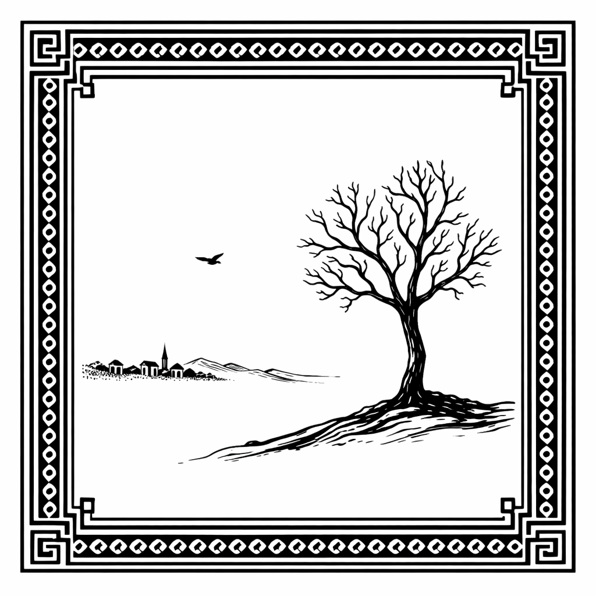{width=80%}


```{=latex}
\end{center}
\vspace*{\fill}
\newpage
```

# 3. Bölüm

Kara Durası artık Karamatlar'da da neredeyse kimseyle görüşmüyordu. Sanki bekle gör der gibiydi. Dağda davar güderken karşılaşırsa bir İsa ile konuşuyordu. İsa'nın bre, bey alı balkan lehçesiyle konuşması çok hoşuna gidiyordu. İsa'nın özlemle geldiği yerleri anlatmasını da pek seviyordu aslında. Asker kaçağı olduğunu, jandarmaların önünde sonunda onu kıstırarak yakalayacaklarını bir İsa ile konuşurken, bir de dağda köpeği toramanla oynarken unutuyordu.

Durası'da, İsa aga'da 14'lü yaşlarda Karaahmetler köyü'ne gelmişlerdi. Durası'nın geldiği Dereli köyü ne kadar yakınsa, İsa aganın geldiği Balkanlar bir o kadar uzaktı. İsa aganın Gölpazarı'nda birlikte geldikleri uzaktan akrabası Gafur ağa ve ailesinden başka tanıdığı kimse yoktu. Gölpazarı'na geldikten sonra bir altı ay kadar Geyve'de birine çobanlık yapmış, karın tokluğuna çalışmasına rağmen bir de aşağılanmıştı. Geyve'den sonra Karaahmetler'e gelmek onu pek sevindirmişti. Ormansa orman, aileyse aile. Yahyalar ona bir yanaşma gibi değil evin evladı gibi davranmışlardı.

Şaka maka, İsa bu köye geleli ne kadar olmuştu, onu bile unutmuştu. Neredeyse bu köyde doğup, büyümüş gibi hissediyordu kendini. Sadece memleket dediği oralarda mezarlarını bıraktığı ana ve babası, savaşlarda şehit düşen ağabeyi, akrabaları aklına geldiğinde burnunun direği sızılıyor, derin bir ah çektikten sonra bre yandığım yalan Dünya diyerek fesini yere çalıyordu.

İsa bir gün çobanlarla birlikte sürüyü soğucakpınar çeşmesine sürdü. Bir gün önceden Durası'nın kulübesine giderek,

— Bre selamünaleyküm Durası kardaş.

— Aleyküm selam İsa aga, hoş geldin, buyur otur.

— Oturmuyacağım bre, yarın soğucakpınarda davar öğleyin yatarken erkeç keseceğiz, sen de gel bre. Hem sohbet eder, hem de erkeç kızartması yeriz.

— İsa aga sağol, bana insan gibi davranan bir Zekiyeyenge var, bir de sen. Aga biliyorsun ben asker kaçağıyım, şimdi çobanlar bir şey der canımı sıkarlar.

— Bre kızan beni seven kimse yok dersin, kimseler seni nasıl sevsin, sen insan içine çıkmıyorsun bre. Kunduz gibi gözlerden ıraksın. Ben çobanlara tembihlerim, sana takaza etmezler. Gelmezsen darılırım bre, hiç mi hatırımız yok.

— Tamam İsa aga gelirim.

— O zaman hoşça kal kızancık, yarın görüşürüz.

O gece Durası yatağında döndü durdu. Ya bu işte bir oyun varsa, ya bir tuzağa çekiliyorsa. Gidecekti İsa aga yapmazdı böyle bir kahbelik her halde.

Yahyaların davarından bir saat kadar sonra vardı soğucakpınara. Kendi koyunlarını yüz metre kadar uzakta bir ağaçlık alanda yatırdı. Köpeği toramana da yat, ben gelene kadar ayrılma buradan dedi. Köpeği toraman verdiği komutlara harfiyen uyardı. Tepelere çıkarak soğucakpınar çeşmesini gözledi. Bir tehlikeli durum görülmüyordu. İsa agalar erkeci yüzmüşler, bir sopaya takarak ateş üzerinde çevire çevire kızartıyorlardı. Usulca onlara doğru yaklaştı.

— Selamunaleyküm ağalar, erfananız neşeli olsun.

Pınarın hemen altında yabani fındıklar vardı. Sesleri duyan köpekler fındıkların dibinden kalkarak kulaklarını diktiler. Kara Durası'nı tanıyınca yeniden fındıkların gölgesine yattılar.

— Ödünü patlattın bre Durası. Bu ne sessizlik, sanki yılan gibi kayıp, geldin. Aleyküm selam, hoş safa geldin. Köpekler de havlamadılar hiç.

Hava çok sıcaktı. Kara Durası çeşmenin oluğuna ağzını dayayarak, kana kana su içti. Sonra da suyla elini, yüzünü, saçlarını yıkadı. Soğucakpınar adı gibi suyu buz gibiydi. Hani oluğuna karpuzu koysan, karpuzu çatlatan cinsinden. Soğucakpınar, Kuz denilen dağın hemen tepesindeydi. Yaz aylarında çobanların sık sık uğrak yeriydi. Suyu soğuk olduğu kadar, boldu.

Oturup biraz sohbet ettiler. Gerçi İsa konuştu, onlar dinlediler. İsa aga'nın çobanları tembihlediği belliydi. Çobanlar ara sıra imalı, imalı baksalar da bir şey demediler. Çobanlardan biri Çanakkale Savaşı'nda bir kolunu kaybetmiş bir gaziydi.

Oturdular, kızarmış erkeç etini iştahla yediler. Kara Durası oturdukları 2 saat boyunca neredeyse hiç ağzını açmadı. Yahyaların sürüsü 600 başa yakın kara keçi sürüsüydü. Hava serinlemeye başlayınca keçiler etrafa yayılmaya başladılar. Durası’nın sürüsünde ise yüz civarında koyun, 40 civarında da keçi vardı. Koyunlar daha geç otlamaya başlar, sıcağın iyice geçmesini beklerlerdi. Yahyaların davarı Akdere tarafına doğru hareket edince iki çoban sürünün ardından yollandılar. Şimdi pınarın başında bir İsa, bir de Durası kalmıştı.

— Durası kardaş, çobanlara bir şey dedirtmedim ama, duramadım ben bir şeyler diyeceğim sana.

— Söyle İsa aga da, her şeyi dede, kızancık deme be agam.

— Tamam bre kızancık demem, kızan derim. Bak Durası kardaş ben savaş nedir, vatan savunması nedir, düşman mezalimi nedir iyi bilirim. Ben düşman mezaliminden kaçıp geldim buralara. Bre Durası kardaş, vatanını savunmazsan, vatan matan kalmaz, bakmışsın Yunan palikaryasının toprakları oluvermiş buralar. O zaman ne ananı koruyabilirsin, ne karını, ne de kızını. Şimdi sen diyeceksin bende ne ana var, ne karı, ne de kız. Bre sap gibi böyle kalacak halin yok. Bir gün gelir sende bir kızçeyle evlenirsin. Bak bana te Balkanlardan, Bulgaryanın Deli ormanlarından geldim. Allah'ın sevgili kuluymuşum ki yanaşma olduğum kapıya damat oldum.

Kara Durası hiçbir şey demedi. Elindeki çomakla yeri karıştırmaya devam etti. Sonunda kafasını yerden kaldırarak,

— Bana müsaade İsa aga, benim koyunlar da kalkarlar artık.

Kara Durası çeşme başından uzaklaşırken İsa ardından seslendi.

— Bre Durası kızan, dediklerimi düşün, teslim ol şubeye, vatanını savun. Eşkıya olup Jandarma kurşunuyla öleceğine, asker ol ölürsen şehit, sağ kalırsan gazi olursun. O zaman seni kimse görmezden de gelemez.

Kara Durası hiçbir şey demeden yürüdü, gitti. Kara Durası kararını vermişti bir kere, askere gitmeyecek, gerekirse çete olacaktı. Vurmak gerekirse vuracak, çalmak gerekirse çalacaktı, sonunda nasıl olsa ya af çıkar, ya da izini kaybettirir, sırra kadem basardı.

Kara Durası biraz da bundan kaçıyordu insanlardan. Kimi aşağılamak için, kimi de İsa gibi sevdiği için bir şeyler söylüyordu. Kara Durası kimseyi dinleme niyetinde değildi. Zamanı kollayacak, sıkışınca dağa çıkacaktı. Gerçi daha şimdiden neredeyse zamanının dörtte birini jandarmadan kaçarak geçiriyordu.

Doruklar da koyunlarını otlatırken bir taraftan da Yahyaların davarının hangi yöne gideceğini takip ediyordu. O, onların gittiği yöne gitmeyecekti. Yahyaların davarının Kızılcık Pınar, Kıranlar tarafına gittiğini görünce koyunları Kuz Dağ'ından aşağı doğru saldı. Demir Deresi, Esebe Tarla'sından sonra Oluklu'ya gelince güneş battı.

Oluklu'da havanın iyice kararmasını bekledi. Hava kararınca Yahyaların sayasının üzerinden koyunlarını kendi sayalarına götürdü. Yahyaların davarı çoktan gelmiş, keçiler yatarak geviş getirmeye başlamışlardı bile. O akşam da jandarma korkusundan koyunları köye hava kararmadan sokamadı. Karnını doyurdu, yatağına yattı ama uyku tutmadı. Biraz dolaşıp, çevreyi kolaçan etmek istedi.

Çoğu gecelerde olduğu gibi, o gece de uykusu dağılınca sessizce köyün girişindeki köy çeşmesine gitmeye karar verdi. Köy çeşmesine gittiği geceler kana kana su içtikten sonra oraya tüneyerek dalıp, dalıp gidiyordu. El ayak çekilip, ortalık iyice sessizleştikten sonra çeşmeden akan suyun sesini dinleyerek düşünmeyi pek seviyordu. Köyün tüm köpekleri Durası'nı tanır, onu severlerdi. O köyde sessizce dolaşırken, çeşme başında otururken hiçbir köpek havlamıyordu. Neredeyse 2-3 gecede bir kulübesinden gece yarısından sonra çıkıyor, sessizce köyün içini dolaşıyor, sonra köy çeşmesinin başına gelerek kana kana su içtikten sonra çeşmenin başına tüner gibi oturuyordu.

O gece yine çeşmenin başında otururken Pepe Hasan'ın atıyla geldiğini görünce köy kadınlarının çamaşır yıkadıkları, köylülerin ırmak dedikleri yere girdi. Hasan her halde karısını görmeye gelmiştir diye düşünürken, Pepe Hasan'ın köydeki başka bir dul kadının kapısını tıklattığını görünce şaşırdı. Biraz sonra kapı hafif aralanınca Hasan usulca eve girdi.

Kendi kendine Süleyman ağam kimlerle çıkmış dağa. Biri acımasız Katil Nuri, öteki uçkur düşkünü Kel Hasan. Kafasını büktü, dişlerini gıcırdattı ama korkusundan iyice sindi olduğu yere. Kendi kendine, İsa aga evlenirsin diyor, şu köye geleli kaç yıl oldu, sanki bir kız bakıp ta gülüverdi şu Durası'na. Ulan ne ana var, ne baba, ne mal var, ne mülk, köy bile yok. Ulan sanki benim farkımda olan var. Vatanmış, vatan savunmasıymış, ben kendimi savunur, kendim için yaşarım, başka bir şey de beni ilgilendirmez dedi.

Bir ah çekerek, ulan şu kekeme Hasan bir karısı yetmiyormuş gibi, bir de elin duluna uçkur çözüyor. Sadece bu köyde iki karı, başka köylerde başka bilmem kaç karısı daha var. Vatan, millet derler, şehitlik lafları düşmez ağızlarından ama şehitlerin dul karılarını kandırıp, koyunlarına girmekten de geri durmazlar. Kara Durası geldiği gibi yine sessizce bir gölge gibi kayarak kulübesine gitti.

Kara Durası'nın anasından sonra tek güvendiği adam Halil ağası olmuştu. Halil askerden yaralı geldikten sonra ava veya atış talimine giderken her defasında keşke beni de yanına alsa diye geçirmişti içinden. Ara sıra Halil, haydi Durası sen de gel dediğinde Dünya'lar onun olurdu. Bazen koyun güderken Halil ağası yanına uğrar, mavzeriyle ona da atış yaptırırdı. Halil ağasıyla aynı zamanda asker kaçağı durumuna düşmüşlerdi.

Halil ağasını ne kadar fazla seviyor, onu kendine örnek alıyorsa, Katil Nuri'den bir o kadar nefret ediyor, korkuyor, içten içe kinleniyordu. Aslında Katil Nuri'den. Korkmakta da haklıydı, Katil Nuri'nin sağı solu belli olmaz, acımadan çeker vururdu.

Halil ağa'sının kaçaklığı fazla uzun sürmedi. Katil Nuri ne kadar gel teslim olma, birlikte hareket eder, efe olur, buralarda namımız yürür dese de, Halil teslim olup, cepheye gitmeye karar verdi. Halil ağası teslim olduktan kısa süre sonra şehadet haberi gelmiş, onun yerini ise bir süre sonra Süleyman almıştı.

Süleyman'a mesafeli davransa da aslında Süleyman'dan zarar gelmeyeceğini biliyordu. Süleyman, Zekiye yenge'den korkardı, ne de olsa iç güveyiydi. Süleyman ağası Katil Nuri ve Kel Hasan ile birlikte silahlanarak, atlarına atlayıp dağa çıktıklarında hep onlara özenmişti. Süleyman da Taraklı jandarmasınca asker kaçağı olarak aranmaya başlanmıştı. Hele Karamatlar'lı 3 efe diye nam salmalarından sonra hayranlığı iyice artmıştı. Artık Göynük, Taraklı, Gölpazarı köylerinde herkesin Karamatlar'lı efelerden bahsetmeye başlayınca onlarla birlikte dağda efe olabilme arzusu iyiden iyiye artmıştı. Zaten jandarma da aman vermeyecek gibi görünüyordu.

Süleyman ağası onu yanına alsa ne iyi olurdu, onun sözünden hiç çıkmaz, ona kızanlık yapardı. Süleyman Efe'ye seve seve kızanlık yapardı ama Katil Nuri ve Pepe Hasan'a asla kızanlık yapmazdı. Durası ara sıra da olsa Halil ağasıyla yaptığı atış talimlerinde mavzer kullanmayı, hedefi vurmayı öğrenmişti. Artık neredeyse hiç ıskalamıyor, attığını vuruyordu. Kendi kendine düşünüyor, bir yolunu bulsam da, Ağam'a beni yanına al diyebilsem. Onun sağ kolu olurdum.

Bir gece Jandarma köye gelince Durası usulca kulübesinden çıkarak dağa çıkmıştı. O gece bir çam ağacının tepesinde tüneyerek sabahı yapmıştı. Korkusundan yere de inememiş, sabaha karşı yağan çiğden sırıl sıklam ıslanmıştı. Güneş doğmaya başlayınca Kızılcıkpınar tarafından 3 atlının geldiğini görünce iyice korktu. Kendi kendine,

— Beni buldular galiba, direk üzerime geliyorlar, bunlar jandarma galiba, kaçacak zaman da yok.

Gelenlerin efeler olduğunu görünce rahatlayarak, usulca çamdan aşağı indi. Koşarak atına ho diyerek duran en öndeki Süleyman Ağa'sının atının dizginlerinden tuttu. Süleyman atından yere atlayarak,

— Len Durası sabah sabah ne işin var Kranlar'da. Bilmez misin bu saatte koyunlar otlarsa çiğden ağızları yara olur.

— Bilirim ağam, bilmez miyim. Koyunlar yok, akşam jandarma geldi köye, malum asker kaçağıyım, ben de korktum, dağa kaçtım.

Kara Durası tüm cesaretini toplayarak Süleyman Efe'ye,

— Ağam beni yanınıza al.

dedi. Bu sözleri duyan Katil Nuri ve Hasan önce Durası'na, daha sonra birbirlerine baktıktan sonra kahkahayla gülmeye başladılar.

Katil Nuri bir taraftan gülerken, bir taraftan da,

— Len Süleyman, Len Hasan bak hele şu yerden bitme, donunu toplayamayan Durası çakalına. Adam olmuş ta bizim guruba katılacakmış. Ulan şuna bak, asker kaçağı olunca kendini adamdan saymaya başlamış. Len Hasan indir şunun donlarını, bakalım burnuna siyebiliyor mu. Burnuna siyebilirse o zaman bir bakarız.

Yeniden bir kahkaha attı. Süleyman Efe,

— Nuri o kadar da uzun değil, bırakın çocuğu.

Ötekiler gülünce o da gülmüştü. Gerçi ötekilerin kendisiyle alay etmelerine Süleyman ağası katılmamıştı. Gömlünü de almıştı aslında.

— Durası zaten benim derdim bana yetiyor, bu sıralar bir de seninle uğraşamam, sen en iyisi teslim ol. Bu millet askerden kaçan adama iyi gözle bakmaz. Biz de asker kaçağı durumuna düştük ama bizim durumumuz başka. Bizim her birimiz aylarca, yıllarca cephelerde çarpıştık, gevur öldürdük, hepimizin vücutlarında gevur kurşunu yaraları var.

Sinirlenen Katil Nuri,

— Ulen Süleyman bırak şu sümüklüye laf anlatacağım diye uğraşmayı. Dağda çoluk çocukla mı uğraşacağız.

Durası'na sert sert bakarak,

— Ulan çulsuz defol git buradan. Ulan utanmadan bir de bize katılacakmış. Git ulan buradan, kafamı attıracaksın şimdi iki kaşının ortasında bir delik açacağım.

Kara Durası oradan usulca ayrıldı. Kendi kendine bu Katil Nuri'yi bir gün iki kaşının tam ortasından ben nallayacağım anam avradım olsun. Çamların arasında hem yürüyor, hem de kendi kendine mırıldanarak konuşuyordu. Süleyman ağası onu kızanı olarak yanına alsa bir sırt sırta verirlerse bu dağları inletir, adlarını duyan ağlayan çocukların sesini keserlerdi. Ah Süleyman ağam benim kıymetimi bilmedin. Beni küçümsedin, beni çocuk gördün. İnşaallah yarın, öbür gün ben de dağa çıkıp, çetemi kurduğumda karşı karşıya gelmeyiz.

Dağda çam ağaçları arasında yürürken bunlar aklına geldiğinde canı sıkıldı. Kendisini küçümsenmiş, adam yerine konulmamış hissetmişti. Zamanında köyünde Naci onu adam yerine koymadığında ne olduğunu görmüştü, and olsun bir gün ben de çetemle dağda azılı bir eşkıya olduğumda o Katil Nuri ve Hasan'a günlerini gösteririm. Bakalım gülüvermek, dalga geçmek, çocuk yerine koymak nasıl oluyormuş. Onlara kinlenirken Süleyman Efe'yi dışarda tutuyordu. O öbür ikisi gibi dalga geçmemiş, sadece gülmüştü. Zaman gelecek, görecekti onlar el mi yaman, bey mi yaman.

Pepe Hasan'a da kinlense, esas kinlendiği, diş bilediği Katil Nuri'ydi. Daha askere gitmeden önce Durası Karamatlar'a yeni çoban geldiğinde de hep Kara Durası'na kötü davranmıştı bu Katil Nuri. Bir defasında yanına gelmiş zorla bağlara üzüm aldırmaya göndermişti. Çabucak git gel, yoksa senin ananı bellerim Durası mı, yoksa kalası mısın ne? Kara Durası bir şey diyememiş, bağlara giderek o Katil Nuri'ye üzüm getirmişti. Geldiğinde de dağılan koyunlarını toparlayana kadar epey uğraşmıştı.

Kara Durası, Katil Nuri ile karşılaşmamak için elinden ne gelirse yapıyordu. Durası'nın en fazla zoruna giden adam yerine konmamak, aşağılanmaktı. Aslında bunda en büyük pay yine kendindeydi. İnsan içine çıkmıyor, insanlardan kaçıyordu. Bir çocukla bile karşılaşsa yolunu değiştiriyordu. Onu köyün içerisinde, hele köy meydanında bir kere bile gören nadir olmuştu.

Camiye de yılda iki defa gidiyordu. Onlar da bayram namazlarına gitmek içindi. Karamatlar köyü'nde çocukluktan çıkan her erkek bayram namazları, Cuma namazı ve Teravvih namazlarını camide birlikte kılarlardı. Durası da Cuma ve Teravvih namazlarını es geçse de biri Ramazan, diğeri Kurban Bayramı'nda olmak üzere iki bayram namazını kılmaya camiye gidiyordu. Bayram namazından çıktıktan sonra köyün en yaşlı erkeği başa geçiyor, yaş sırasına göre tüm köylü birbiriyle bayramlaşıyordu. Bayramlaşma faslından sonra her evden köy odasına yemek taşınıyor, bayram sabahı sabah kahvaltısı birlikte yapılıyordu. Durası, Zekiye yenge'nin hazırladığı yemek tepsisini köy odasına bırakır, bırakmaz kulübesine geri dönüyordu. Eskiden Halil ağası, şimdilerde Süleyman ağası ne kadar haydi sen de gel deseler de hiçbir bayram sabahı yemeğine katılmadı Durası.

İnsanlarla bir arada olmaktan kaçınıyordu. İnsanlarla bir araya gelse her defasında kendi kendine aşağılandığını, hor görüldüğünü hissediyordu. Karamatlar köyü'ne geldiği günden bu yana Katil Nuri hariç onu aşağılayan, horlayan kimse olmamıştı. Hiç sevmediği Molla Mehmet bile tesadüfen karşılaştıklarında halini hatırını sorar, bir ihtiyacın olursa çekinme gel derdi. Durası kendi kendine insanlardan soyutlamıştı kendini. Dereli'de yaşadığı Naci olayından sonra tüm köylü onu dışlamış, o da hem kabuğuna çekilmiş, hem de insanlara kinlenmişti.

Karaahmetler aslında onun için yeni bir başlangıçtı. Belki de böyle kendini kapatmasa köylüler onu içerilerine almaya hazırdılar. Geçmiş zamanlarda Halil, şimdilerde Süleyman mevlüt gibi bir etkinlik olduğunda onu da yanlarında zorla da olsa götürüyorlar, Durası mevlütten sonra pilavını yiyor ve oradan sessizce ayrılıyordu. Karamatlar'da ona bu güne kadar kötü davranan tek kişi olan Katil Nuri onu aşağıladığında, takaza ettiğinde içinde kin ve nefret duyguları iyice kabarıyordu. Kendi kendine,

— Nuri Katil Nuri gün gelir devran döner. Keser döner, sap döner, bir gün gelir hesap döner. Günü gelince karşına geçip, mavzerimi ağzına dayadığımda bakalım o zaman da gülebilecek misin.

Kafasından bunlar geçerken koyunlar yayıla yayıla köye yaklaşmışlardı. Koyunları köye artık hava kararmadan getirmez olmuştu. Zekiye yenge; Durası koyunları neden bu kadar geç getiriyorsun diye sorduğunda, akşam serininde koyunlar daha iyi otluyorlar diyordu.

Artık Karamatlar'ın dağlarında her kovuğu bilmede, nerede daha çok ot var, neredeki otlar koyunlar için daha besleyici olduğunu bilmede onunla boy ölçüşebilecek çok az insan vardı. Ondan iyi bilse bilse bir İsa aga vardı. İsa aga ile köye geliş kaderleri az çok birbirine benziyordu. Her ikisi de 14'ünde evlerinden ayrılmak zorunda kalmışlardı. İsa aga uzaklardan, kendi deyişiyle ta Bulgarya'dan, Kara Durası ise hemen yakın köyden gelmişti. Dağda davar güderken karşılaştıklarında İsa aga, Durası'na hep memleketini anlatırdı.

“		Bre Durası ben burayı neden çok severim bilirmisin ? Aynı benim memlekete benzerde ondan bre. Aynı dağlar, aynı ormanlar. Aynı dediysem heptende aynı değil bre. Bizim oralarda yağmur daha çok yağardı, buralarda yağmur daha az. Buralarda tarlalarda Temmuz, Ağustos gelince otlar kuruyor, bizim oralarda kurumaz, herdaim yeşil kalırdı. Birde bizim oralarda biz Türk, Bulgar içiçe yaşardık, aynı öz kardaş gibi. Ne olduysa sonunda Bulgarlar bize düşman oldu. Komşularımız bile saldırır oldu bre.. Halbuki kardaşça yaşasaydık ata topraklarında ne güzel olurdu. Misal bak senin anan öldü, gidip mezarında bir fatiha okuyorsun. Benim anamın, babamın, dedemin, ninemin mezarları ta Bulgarya’da kaldı beya. Beni köklerimden kopardılar. Allah razı olsun bu Molla Mehmet ağadan, Fatma anadan. Bana analık, babalık yaptılar, kök salmamı sağladılar. Molla Mehmet Durası’nın çobanlığını beğeniyor,takdir de ediyordu aslında. Bir defasında damadı İsa’ya ”İsa oğlum şu Durası’nın çobanlığı yaman hani. Aynı dağlarda yayılıyor bizim davar da, onların davarı da. Bak onların davar daha besili,ikiz yavrulayan koyun ve keçi bizim davara göre daha fazla.”

“Bre baba onların sürü hem az,hemde o sürünün çoğu koyun. Koyun fazla gezmiyor,keçi durmadan hareket ediyor,yediğinide eritiyor.	“

Öylede olsa aslında bu Durası iyi çoban bence,keşke bizim çoban olsaydı.”

Aslında haklısın bre baba. Bu Durası insanlarla hiç konuşmaz amahayvanlarla bıdır bıdır konuşur,hiç ağzı durmaz. Bir keresinde bu delimidir nedir kendi kendine konuşuyor dedim ve farkettirmeden izlemiştim. Meğer koyun ve keçilerle konuşurmuş. Hele köpeği toramanla bir konuşması var ,kırk yıllık ahbap gibi. Koyunlarda dinler onu. Uzakta birinin ekinine girse koyunlar, Durasının sesini duyar duymaz hemen oradan uzaklaşır,ona itiat ederler.”

“Eskiden olsaydı bunları duyduktan sonra ne yap yap onu razı et bize çobanlık yapsın derdim ama artık asker kaçağı bize yaramaz Ara sıra konuştuğunuzu bilirim,sen ona bu yolun yol olmadığını anlat,teslim olsun,gitsin askere.””Söylemez olurmuyum bre baba,hep söylerim de Durası Nuh der Peygamber demez..”.” Kara Durası ,İsa agayı dinliyor ama hiçbir cevap vermiyordu.

Kara Durası bir şey demedi ama asker kaçağı takibine çıkan jandarmaları evinde yatıran, yediren, içiren Molla Mehmet’e diş biliyordu.

“Benimde babam nerede öldü, mezarı nerede, varmı bir mezarı onu bile bilmem İsa aga. “

“Sen hiç meraklanma be Durası kardaş. Türk askeri geride şehidini bırakmaz, mutlaka verir toprağa. Tabi askerden kaçıp, bir çete kurşunu ile ölmediyse. Gerçi oralarda pek kaçak asker olmazdı. Olsa uzak memleketler, yol bilmez, iz bilmez. Kaçıpta nereye gidecek. Durası kardaş böyle senin gibi hiç askere gitmeden kaçanını az gördüm ben. Kaçanlar yıllarca cephede savaşmış, yanında bir çok arkadaşı şehit düşmüş, kendiside yaralanmış, sonunda iyileşsin diye hava değişimine gönderilmiş. İyileşince , yeniden asker lazım olunca, tekrar çağrılanların arasında yılgınlıktan asker kaçağı olanlar olmuş.

İsa ile Kara Durası'nı ayıran en önemli farklılıklar; İsa ne kadar herkesle barışık, güler yüzlü, çoluk çocuk demeden önüne gelene laf atan, sohbet eden biriyken; Kara Durası tam aksine bırak insanlara laf atmayı, insanları görünce yolunu değiştiren, mecbur kalmadıkça kimseyle konuşmayan, yüzü hiç gülmeyen biriydi.

Dağda koyun otlatırken, koyunları insanların olmadıkları yerlere götürürdü. İnsanlara ne kadar uzaksa, dağlara, tepelere o kadar yakındı Kara Durası. Tavşanları yuvalarında elleriyle canlı yakalayabilirdi. Su kenarlarına tuzak kurarak bir çok kuş yakalıyordu. O kadar sessiz hareket edebiliyordu ki, kimseye duyurmadan, çıtırtı bile çıkarmadan bir yerden bir yere hareket edebilirdi.

Dağda davar güderken bir gün birden yanında bitiveren Kara Durası'nı gören İsa; bre kara Durası tam kara bir yılan gibisin, çıtırtı bile çıkarmadan kayar gibi hareket ediyorsun. Bre ne zaman yanıma geldin, fark etmedim bile, bere korkuttun beni demişti.

Bir gün yine hava karardıktan sonra koyunlarını önüne katarak gelmişti. Koyun sayasının önüne koyunları getirip, ağıla koyduktan sonra kurudukları için ayaklarını sıkan çarıklarını çıkararak suya ıslattı. Sızılayan ayaklarını epey ovduktan sonra Zekiye yengenin getirdiği tarhana çorbasıyla, bulgur pilavını kaşıklamaya başlamıştı.

O sırada toraman havlamaya başladı. Kara Durası telaşlandı, bir gelen var demekti, toraman durduk yere havlamazdı. Çoktan beri odanın küçük penceresini zor durumda çabucak kaçabilmesi için aralık tutuyordu. Durası hemen kulübenin ufak penceresinden süzülerek dışarı sızdı. Gelen kimdi acaba. Hemen kulübenin kapısını rahat görebilecek, aynı zamanda kendi görülmeyecek bir pozisyonda kapının önünü gözlemeye başladı. Geleni görünce rahatladı, gelen İsa'ydı. Aşağıdan sallana sallana kulübeye doğru geliyordu. Kara Durası'nı görünce gülümsedi.

“Bre durası, neredesin len.”

“Buradayım İsa aga, ne yapacaksın beni ?”

Durası elindeki bıçak ne öyle, beni mi bıçaklayacaksın ?”

“Hiç olurmu be İsa agam, alışkanlık işte. Şu sıçtığım Dünya’da sevdiğim tek adamsın belkide. Halil Efe’yide severdim,ondan sonra Süleyman efe’yi de sevmiştim ama  ama beni yanına bile almadı, hem almadı hemde Katil Nuri’nin alay etmesine sesini çıkarmadı olsun ses çıkarmadıysa da ben yine onu hep çok sevdim,hemde anamdan hemen sonra. Bak Halil Efe’de  askere gittide ne oldu, öldü işte. Bak Süleyman’a hem arkadaşlarının arkadaşı,hem de karısının kocası oluverdi.

İsa kafasını büktü,

“ Bre Durası söyleme şöyle,günaha girersin, şehit ağanın kemiklerini sızlatırsın.”

“Haşa aga benim lafım Halil ağa’ma değil,Süleyman’a.”.”

“Len Durası sen bu yaşta bu kadar kini içinde nasıl biriktirdin. Molla Mehmet ağam bu gün kasabaya pazara peynir satmaya gitmişti, seni sormuşlar, haberleri varmış, çağırda bir konuşalım dedi.”

“Sen git İsa aga, ben ardından gelirim.”

İsa gittikten sonra Durası çarıklarını ayağına giydi, sırtındaki kirden rengi değişmiş mintanını değiştirdi, Yahyaların evine doğru yollandı. Köydeki en büyük ev Yahyalar’ın eviydi. Yahyalar kalabalık bir sülaleydi. Onun kulübesi köyün üst tarafında , Yahyalar’ın evi köyün alt başındaydı. Köye gelen her hükümet görevlisini, tanrı misafirini Yahyalar misafir ederlerdi.

Kara Durası  kara bir gölge gibi Yahyalar’ın evine yaklaştı. Çevre sessizdi. Jandarmalar gelse yaz günü olduğundan atlarını dışarı bağlarlardı Durası tedirgindi, temkinli bir şekilde yavaş yavaş eve yaklaştı. Yaklaşırken arkasını, yanlarınıda kontrol ediyordu.. Tam  eve  iyice yaklaşmıştıki ;. Tam ana kapıdan eve girecekken açık bir pencereden gelen sesleri duydu. Seslerin geldiği yöne dolandı. Usulca pencerenin altına büzülerek konuşmaları dinlemeye başladı. Evde iki kişi sohbet ediyordu. Seslerden biri Molla Mehmet’in sesiydi,diğeri kimdi acaba ? Kara Durası sesleri iyice duyabilmek için iyice açık pencerenin altına sokularak konuşulanları iyi duyabilmek için kulaklarını iyice açtı.

“Komutanım ne yapmayı düşünüyorsunuz ?”

“Ne düşüneyim Mehmet ağa, Yunan, Bilecik’e dayanmış. İlyasça köyüne karargah kurmuş. Biz burada efesiyle, çetesiyle uğraşmamız yetmezmiş gibi birde asker kaçağı daha sakalı yeni çıkmış bir çocukla uğraşıyoruz. Artık bu iş kabak tadı verdi. Bu akşam derdest edersek Gölpazarı’na götürürüz. İfadesini alırız, aklı başına gelsin diye birkaç gün nezarette tutarız, sonra asker olarak sevkederiz. Memleketin askere ihtiyacı var. İnce eleyip, sık dokuyacak zaman değil.”

Komutanım bende anlayamadım bu çocuğu. Maşallah güçlü, kuvvetli. Boyu kısa olsada sırım gibi. Bizim İsa attığını vuruyor diyor. Geçen bir kuşu bıçağıyla vurmuş.”

“Mehmet ağa sen görürsün efelerede söyle gelsinler teslim olsunlar. AZ bir cezayla kurtulurlar. Bu gidişle sonları yağlı urgan olacak.”

Komutanım ben ne yapayım her defasında anlatıyorum hem efelere, hemde Durası’na. Ben askere gitmemişim, askerliğe bedel ödemişim diye bana bıyık altından gülüyorlar Birde diyorlarki eşekten düşmeyen, eşekten düşenin halinden ne anlarmış. Kendisi parası var diye bedel ödemiş askere gitmemiş, askere gitmeyenlere nasihat ediyor. Bırakta başkası nasihat etsin diyorlar..”

“Sen devletin verdiğibir haktan yararlanmışsın, onlaramı düşmüş bunu sorgulamak ?”

“Komutanım bu kadar vatan evladı şehit düşerken bende bazen kendi kendime sormuyorum değil. Keşke bedel ödemeseymiydim diye.”

Senin gibi adamlarda lazım be Mehmet ağa. Bak her gelişimizde hem askerin, hemde atların karnını doyuruyor, yatacak yer veriyorsun.”

“Feda olsun be komutanım, keşke daha fazlasını yapabilsem Kara Durası sindiği pencerenin altında bunları dinlerken neredeyse nefes bile almıyordu. .Kendi kendine vay be İsa Aga’da sattı beni. Güvenip paldur küldür gitseydik şimdi elimiz ayağımız bağlanıp,derdest edilmiştik. Komutan evde olduğuna göre İsa Aga’nın haberinin olmaması neredeyse imkansız gibi Kara Durası duyacağını duymuştu. Şimdi farkedilmeden oradan uzaklaşmanın yolunu düşünmeye başladı.

Köy muhtarlığı Dereli’den olan muhtar istifa ettiğinden belirli bir süreliğine o sene muhtarlık Karamatlar’a geçmişti . Karamatlar ile Kuzlar birlik olmuşlar, birde Haydan’dan Dereli’ye göçenlerde onları desteklemişler muhtar Karamatlar’dan olmuştu. Karamatlar’da iç güveyi olan Ali Çavuş ikinci aza olmasına rağmen  bağlı mahallelerin tamamıyla, Dereli’de oturanların bir çoğu birinci azanın muhtar olmasını istememişlerdi.. Ali Çavuş’un muhtar seçilmesinde en büyük pay gerçi Molla Mehmet’in di ama , Ali Çavuş hep onun varlığını, zenginliğini kıskanıyordu.

Ali Çavuş muhtar  olmasına olmuştu ya gelen devlet yetkililerini eskiden olduğu gibi yine Molla Mehmet ağırlıyordu. Jandarmanın köye çok sık gelmeye başlamasından beri efeler köye daha seyrek uğrar olmuşlardı. Ali Çavuş şöyle bir jandarmalara hoşgeldiniz demiş, daha sonra ortadan kaybolmuştu.

“Mehmet ağa sen niye kendin muhtar olmadında Ali Çavuş’u yaptın ?”

“Hem çok hevesliydi, hem de benim zamanım yok be komutanım. Haftada 3 gün hem Gölpazarı, hem Taraklı, hem de Bilecik pazarlarına , ayda bir de Bursa  pazarına peynir satmaya gidiyorum.”

“Gerçi ben onun askerlikten kurtulmak için muhtar olmak istediğini biliyorum ya neyse.”

“Komutanım onun yaşı otuzu geçti, ne askerliği ?”

“Mehmet ağa otuzu varmı, memlekete asker lazım. Şimdi 40 kadar yaşı olanlarıda geri hizmete ihtiyat olarak çağıracaklar.”

Bizde günlerce bıyığı yeni terlemiş bir Durası’nın peşinde koşuyoruz. Gelsede şu çocuk derdest edip, götürsek, bu iş canımı sıkmaya başladı artık 	Durası konuşulanları sessizce dinlerken kendi kendine; Karamatlarlı günlerin, çobanlık günlerinin sonuna yaklaştık galiba diye geçirdi içinden. .

Jandarmaların onu yakalamak için evde tertibat aldıkları anlaşılıyordu. Durası hiç ses çıkarmadan oradan uzaklaştı. Hemen kulübesinden  bir iki parça giyecek, bir ekmek, biraz peynir alarak fırladı dağa doğru.

Jandarmalar Durası gelmeyince, kulübesini basmaya karar verdiler. Bir manga asker başlarındaki baş çavuşla birlikte Durası’nın kulübesinin etrafını sardılar. Kulübenin kapısı ardına kadar açıktı. İçeri giren baş çavuş,

“Kaçmuş deyyus, yine kaçmış. Bu defada kaçırdık elimizden. Hey Allahım şu uğraştığımız işe bak. Bir çocuğu yakalayamadık 		Kara Durası çoktan kranların yolunu tutmuştu. Komutan gece gece bulabilmenin mümkün olmadığını düşünerek askerlerini toparlayarak Molla mehmet’in evine döndüler. Komutan askerlere istirahata çekilin dedikten sonra Molla Mehmet’le derin bir sohbete daldılar. Gele gide artık iki yakın dost olmuşlardı. Askerler her takibe çıktıklarında Yahyaların evinde kalıyorlardı. Yenipazar tarafındaki köylerede gitseler Gölpazarı’na dönmeden önce bir gece kalıp, dinleniyorlardı.

Molla Mehmet kahve çekirdeklerini pirinç kahve  değirmeninin içerisine koyarak yavaş yavaş kahve değirmeninin kolunu çevirmeye başladı. Biraz sonra değirmenin kapağını açtığında odanın içerisini mis gibi kahve kokusu sardı.”Mehmet ağa şu kahve kokusuda çok hoş hani.”

Molla Mehmet kahve değirmeninin içerisindeki kahveyi boşaltırken bir tarattanda,

“Komutan kahveyi nasıl içersin.”

“Orta olsun, fazla tatlı sevmiyorum, bu günlerde şeker bulmakta zor be ağam diyerek bir kahkaha patlattı.

Molla Mehmet mangalın üzerinde bakır cezvede mis gibi kokular yayarak pişen kahveyi karıştırırken,

“Kahvede bulunmuyor komutan. Bu kahveyi geçtiğimiz hafta Bursa’dan aldım.”

“Bursa , Yunan işgali altında  atlarla gidip gelmek  zor olmuyor mu ?”

“Zor olmazmı komutan, çok zor oluyor da, ne yaparsın bu 600 baş davarın peynirini satabilmek buralarda zor. Yolda en az on kere durduruyorlar. Neredeyse peynirin üçte birine el koyuyorlar. İçimden sövsemde bir şey yapamıyorum 				vatanı işgal eden düşman kuvvetlerine haraç vermek zorunda kalmak çok zor be komutan..”

“Korkmuyormusun , gidip, gelirken Savaş halindeyiz, senden Bursa-cephe arasında haber getirip, götürüyorsun sanabilirler. ?”

“Korksan ne yapacaksın komutan ? Benim bacanak dediğim sağlam bir arkadaşım var sende tanıyorsun ya hani Yamacı Hasan . Onu yanıma alıyorum. Biz iki ata biniyoruz, iki ata da peynir sarıyoruz, düşüyoruz yollara. Mal götürenlere pek bir şey demiyorlar, malın birazına el koyup, salıyorlar. Bakalım ne zamana kadar gidebiliriz bilemiyorum. Biz her hafta gidince göre göre alıştılar sanıyorduk. Her defasında Bilecik-Yenişehir üzerinden Bursa’ya gidiyorduk. Bir hafta Lefke  üzerinden giderek Köprühisar’a çıkıverelim dedik. Tam Köprühisar’a barmıştıkki bir manga Yunan askeri önümüzü kesti. Bizi alıp Yenişehir’deki karargaha götürdüler. Meğer bizi her hafta takip ediyorlarmış. Sorgu, sorgu; Her hafta Bilecik tarafından gelirken, bu defa neden Lefke üzerinden gelmişiz, amacımız neymiş,bir sürü soru. Anlatmaya çalıştık ama epey ter döktürdüler bize. İnsanı en çok üzen komutan karargahta Türk oldukları belli olan bir çok yardakçı vardı..”

“Olmazmı Mehmet ağa,düşmana hizmet eden bir çok Türk var. Kimisi korkusundan,kimisi üçkuruş çıkar uğruna düşmana hizmet ediyor.” Onlar evde sohbet ederlerken Kara Durası bir an önce köyden uzaklaşmaya çalışıyordu. Görüş mesafesi uygun olmadığından bu pekte kolay olmuyordu.

O gece hava bulutluydu. Kara Durası karanlıkta düşe kalka telaşla ilerledi.

Bu defa ardından takip ederler diye Kranlarda duramadı, Efendağı tarafına geçti. Karanlıkta bir kuru çam dalı yüzünü yırt sa da korkudan duramadı, yürüdü. Düşe kalka geldiği efendağına geldiğinde epey yorulmuştu, nefes nefese durdu. Ne kadar kovalasa da köpeği toraman da onun ardından gelmişti. Tam o anda gözleri parladı. Hemen yanında daha önceden de bildiği dalları şemsiye gibi dibini tamamen kapatan mart çamını görünce. Hemen mart çamının dibine sürttü. Yerdeki çam pürçüklerini temizledi, yere uzanır uzanmaz yorgunluktan uyudu kaldı.

Uyurken kovalamama rağmen toraman iyi ki gelmiş, biri, ya da Jandarmalar gelirse toraman havlar, ben de kaçarım diye düşündü. İki tepe atladığından jandarmaların buralara gelmeyeceklerini düşünerek rahat uyumuştu aslında. Buralara kadar jandarmaların gelmeyeceklerini tahmin ediyordu.

Bir kere askere gitmemeye karar vermişti. İnat mizaçlı biriydi. Bir şeyi yapmayacağım dediğinde onun doğruluğuna, yanlışlığına bakmadan sonuna kadar direniyordu. Aslında vatan sever biri de değil, vatan haini biri de değildi. Aslında bu kavramları hiç bilmiyordu. Hiç eğitim almamıştı. Okuma yazma bilmiyordu.

Gerçi o yıllarda özellikle köyde doğup, büyüyen insanların kaçı okuma yazma biliyordu. Köyde birkaç yıl köy imamına derse gitmişti. Hoca da namaz surelerini, islamın, imanın şartı gibi farzları öğrenmeye çalışmıştı. Bir gün Ayetel Kürsü'yi ezberlemeden hocaya gidince hoca elindeki kızılcık sopasıyla Durası'nın avuçlarına ikişer kere vurmuştu, bu da yetmez gibi sureyi hoca gibi telaffuz edemeyince hoca ensesine sertçe vurmuş, alnı rahleye çarpan Durası dilini ısırmış, ağzı kanla dolmuştu. Canı çok yanan Durası mektepten fırlamış, evde almıştı soluğu. Avuçlarını oğuşturarak eve girince anası sormuştu.

— Durası bu ne hal oğlum, niye geldin eve, neden ellerini ovuşturursun?

— Ezberimi bilemedim diye hoca beni dövdü ana, ben bir daha hocaya mocaya gitmem.

Anası git oğlum, hocanın vurduğu yerde gül biter dese de, Durası bir daha hocaya gitmemişti. Fatiha dışında bir, iki sure, bir, iki dua biliyordu. Vakit namazlarını kılmasa da bayram namazlarını kaçırmamıştı. Karamatlar'da belirli yaşın üzerindeki her erkek Cuma ve bayram namazlarına giderdi.

Kara Durası neden askere gitmek istemediğini aslında kendi de bilmiyordu. Belki de anasının hiç bıkmadan, usanmadan babasının askerden döneceği günü beklemesi ve babasının hiç gelmemesiydi.

Gece çamların arasında düşe kalka ilerlemekten çok yorulmuş olacak ki, hava aydınlanana kadar deliksiz uyuyakalmıştı. Sabahleyin uyandığında güneş doğuyordu. Hemen dereye inerek elini yüzünü yıkadı. Vücudu uyuşmuş, biraz da üşümüştü. Çantasındaki peynir ekmekle karnını doyurdu. Başını avuçlarının içerisine alarak uzun uzun karşı tepelere bakarak düşündü. Kendi kendine,

— Ey Durası, Fadime kadının öksüz oğlu Kara Durası. Teker taşa dayandı artık. Çobanlık, Karamatlar sevdan bu gün itibariyle sona erdi. Bu jandarma komutanı kafaya koymuş, yakalayacak beni. Köye dönersem Molla Mehmet'te yataklık yaparken beni yakalamaları uzun sürmez. Ahd ediyorum. Jandarmaya yakalanmayacağım. Beni yakalamaya kim kalkarsa asker, efe demeden aha şu belimdeki sivri bıçakla karnını deşeceğim. Beni yakalamaya çalışanı öldürmeden, ölmeyeceğim. Yine ahd olsun bu yaptıklarını o Molla Mehmet'in burnundan fitil fitil getireceğim.

Yerinden kalktı, önce şaşkın şaşkın etrafına bakındı. Nereye, ne tarafa gidecekti. Bir gün gelecek jandarmadan kaçmak zorunda kalacaktı bunu biliyordu, biliyordu da nereye gideceğini pek düşünmemişti. Gözden uzak olsun diye soğucakpınar tarafına geçti. İki gün yer değiştirerek dağlarda gezdi. Buralarda hayvan güttüğünden, buraları avucunun içi gibi biliyordu.

Çantasındaki yiyecek de bitmişti. Birkaç günde geven köklerini emerek, yenilebilir otları yiyerek idare etti. Anacığı ona hangi otların yenilebileceğini, hangi otların nerelerinin yenebileceğini öğretmişti. Mantarları da iyi tanırdı. Hangi mevsimde, hangi mantar çıkar, hangileri yenir iyi biliyordu.

Bir sabah karnı açlıktan guruldayarak uyandı. Kalktı, gerindi, sağa, sola baktı. Uzakta bir açıklıkta bir beyazlık fark edince gözleri fal taşı gibi açıldı. Hemen doğrularak o tarafa koştu. Kendi kendine şansa bak dedi. Karşısında yan yana çıkmış 5 tane söbelen mantarı duruyordu. Söbelen mantarı pek te lezzetli olurdu, ona göre en lezzetli mantar söbelen mantarıydı.

Mantarları yerinden çıkarmadan hemen mantarların yanına bir ateş yaktı. Büyük yassı bir taş buldu. Ateş köz olunca mantarları yerlerinden sökerek ateşte kızan yassı taşın üzerine yatırdı. Pişmeye başlayan söbelen mantarları cız cız diye sesler çıkarıyordu. Kara Durası'nın ağzı sulandı. Mantarların tersini çevirince yeniden cos diye bir ses çıktı. Pişen mantarları iştahla yiyerek karnını doyurdu. Kendi kendine hayatımda yediğim en güzel yemeklerden biri bu diye düşündü. Söbelen mantarı zaten lezzetli olurdu da, Kara Durası'nın karnı aç olması mantarları daha lezzetli hissetmesine sebep olmuştu.

Karnı doyunca keyfi de yerine geldi. Soğucakpınar'ın buz gibi suyundan kana kana içti. O sırada Dereli'deki evlerine daha önce tulumun içerisine doldurarak dolaba koyduğu kavurma aklına geldi.

Dereli'ye gidebilse evlerinde kestiği erkecin etinden yaptığı kavurmayı doldurduğu bir tulum kavurma vardı. Hiç aklına gelmemişti daha önce, belki de anası ölmeden ona gönderdiği oğlak paralarından kıyıda köşede üç beş kuruş kalmıştı. Kavurma aklına gelince ağzı yeniden sulandı.

Günlerdir yaban hayvanı gibi tek başına dağlarda geziyordu, tek silahı ustura gibi keskin bıçağıydı. Nereye kadar böyle dağlarda gezecekti. Uzakta bir insan görse, davar görse hemen yerini değiştiriyordu.

Bir ay kadar önce 2 yaşına gelen çobanlık ücreti olarak kendine verilen on erkecin dokuzunu satmış, birini de kavurma yaparak ne olur, ne olmaz diye deri tulumun içerisine doldurarak Dereli köy'ündeki evlerine koymuştu.

Bir gece yeniden köye gitmeye karar verdi. Bu böyle olmayacaktı, nereye kadar saklanacaktı, önünde sonunda bir gören olurdu. Sattığı 9 erkeçin parasını da çoban kulübesinin taban tahtalarının altına gizlemişti, bir gün gidip, onları da almalıydı.

Toraman gündüzleri köye sürünün yanına dönüyor, geceleri gelip onu buluyordu. O da toraman yanındayken korkmadan uyuyabiliyordu. Bir gölge gibi sessizce köye yaklaştı. Kulübesini görünce gözleri ışıldadı. Ağıla bakınca şaşkınlıktan neredeyse nefesi kesilecekti.

O iki yüzün üzerindeki koyun-keçi gitmiş, yerinde on kadar koyun kalmıştı. Kulübesine girince içi iyice burkuldu. Yatağının yerinde yerler esiyordu. Bir iki parça eşyası da bir çuvalın içerisine tıkılmıştı. Anlaşılan o 4-5 gün uğramayınca Zekiyeyengegiller ondan umudu kesmişler, koyunları da satmışlardı. Kara Durası çuvalın içerisindeki üç beş eşyasını alıp, oradan uzaklaşmak istedi ama çok yorgundu, gözlerinden uyku akıyordu. Aslında bu çoban odasını hep çok sevmişti. Bu odada geceleri yatağına uzandığında kendini özgür hissetmiş, gecenin sessizliğinde hayallere dalıp, dalıp gitmişti. Bıçağının ucuyla döşeme tahtasını kaldırdı. Parası koyduğu yerde duruyordu. Paraları alarak cebine yerleştirdi, döşeme tahtasını da yeniden yerine oturttu. Kulübenin kapısından çıkarken karar değiştirerek, kulübeye geri döndü. Eşyalarının olduğu çuvalı yastık yaparak yerdeki kıl çulun üzerine uzandı. Uzanır uzanmaz da hemen derin bir uykuya daldı. Sanki en rahat yatakta yatar gibi uyumaya başladı.

Efelerden Pepe Hasan, Hacı Veli'lerin kızı iki çocuklu Hatice'yle imam nikahı kıyarak evlenmişti. Hatice'nin kocası Hüseyin, Çanakkale Savaşlarında şehit düşmüştü. Hatice 2 çocuğuyla kalakalmıştı. Hele bir de babası Hacı Hasan öldükten sonra iyice yalnız kalmıştı, daha yirmili yaşlarda gencecik bir kadındı.

Baştan Hasan'ın ısrarlı tekliflerine hayır demiş, her önüne çıktığında terslemişti. Köyde bazı kocakarıların dedikodu çıkarmaya başlamalarından sonra en azından evli, kocası var derler, ağızları kapanır diye Hasan'ın evlenme teklifini kabul etmek zorunda kalmıştı. Efe adamdı, dağda asker kaçağıydı. Her an bir kurşuna hedef olur, öldürülebilirdi. Kocakarıların dedikodusu onu evliliğe razı olmaya zorlamıştı.

Kaçak olan Hasan haftada birkaç gece Hatice kadının evine uğruyordu. Köyde asker olup olmadığını bilmediğinden ya gece yarısından sonra geliyor, ya da dağdan iniyordu. Hacı Veliler ile Zekiyeyengegillerin evleri yan yana hemen dağın eteğindeydi.

Pepe Hasan yine bir gece dağdan eve girmek üzere inerken Zekiyeyengegillerin çoban kulübesinden bir horlama sesi geldiğini duydu. Filintasının namlusuna mermi sürerek yavaş yavaş kulübeye doğru yaklaşırken toraman onu fark edince havlamaya başladı. Yerden aldığı bir taşı köpeğe fırlattı. Taş köpeğe isabet edince canı yanan köpek mazıklayarak kaçtı. O sırada gürültüye uyanan Kara Durası kulübenin kapısından ok gibi fırlayarak dağa doğru koşmaya başladı. Hasan, Durası'nın dağda kaçak olduğunu biliyordu. Kendi kendine,

— Vay şerefsiz Durası demek geceleri gelip kulübede yatıyor.

— Dur len Durası, kaçma, yoksa basarım kurşunu.

Korkan Kara Durası hızla dağa doğru koşmaya devam etti. Kara Durası tam çamlığa girerek gözden kaybolmak üzereyken Pepe Hasan tetiğe bastı. Kara Durası yandım anam diyerek yere yuvarlandı. Hasan yanına vardığında, Kara Durası kanlar içerisinde yerde yatıyordu. Mavzer kurşunu karnından girmişti. Kara Durası acı içerisinde inleyerek,

— Ben sana ne yaptım efem, neden beni vurdun, sen de asker kaçağı değil misin?

— Hala konuşur musun sen şerefsiz, kendinle beni mi kıyaslarsın. Ben yıllarca cephede düşmanla vuruştum. Bir çok düşman askeri öldürdüm, ben de yaralandım. Hava değişimine geldim, ondan sonra gitmedim. Ulan sen daha bir gün bile askerlik yapmadın.

Durası kanlar içerisinde yerde yatıyor, Pepe Hasan Efe de mavzerini ona doğrultmuş başında bekliyordu. Hasan kafasına bir mermi daha sıkıp sıkmama konusunda kararsız bekliyordu. Kendi kendine tüyü yeni bitmiş bir oğlanın, hele bir de kendini koruyamayacak durumdayken kafasına sıkmak efeliğin şanına uymaz diye düşündü. Bir de eğer öldürürse arkadaşı Süleyman Efe'nin ne tepki vereceğini kestiremiyordu. Süleyman Efe istese Durası'nı yakalar, jandarmaya teslim edemez miydi?

Durası yerde inler, Hasan eli tetikte başında beklerken köyden onlara doğru sesler gelmeye başladı.

Silah sesini duyan köylüler birer birer gelmeye başladılar. Kara Durası kendini bilir bilmez inliyordu.

— Su, su, bir yudum su. İçim kavruluyor, yalvarırım su.

Arkadan Molla Mehmet'in sesi duyuldu.

— Verin şuna suyu, içsin de gebersin gitsin. Askerlikten de kaçıyor zaten, dünün sümsüğü, yarın gelir dağa çıkar, milletin başına bela olur. Gebersin gitsin de hiç olmazsa yılan büyümeden başı ezilmiş olur.

Birilerinin uzattığı çoturayı alan Hasan, Durası'nın ağzına su döktü. Birkaç yudum zorla su yutan Durası kendinden geçti.

Kara Durası yaralı halde cami önüne getirildi. Ölür diye beklediler ama aradan birkaç saat geçmesine rağmen yaşadığını görünce jandarmaya haber vermeye karar verdiler. Jandarmaya haber verme kararı alınınca Hasan Efe atına binerek köyden uzaklaştı. Jandarmaya haber verilmesi, Jandarmanın köye gelmesi derken Durası'nın vurulmasının üzerinden neredeyse 6-7 saat geçmişti. Durası caminin önünde üzerine yatırıldığı çulun üzerinde baygın yatıyordu. Jandarma komutanı geldiğinde yaralıyı kontrol ettiğinde yaşadığını fark etti. Jandarma komutanı, Molla Mehmet'e dönerek,

— Ağam bu yaşıyor, nefes aldığı müddetçe asker kaçağı da olsa sonuna kadar yaşatmaya çalışmak bizim görevimiz. Ancak bunu kasabaya götürmek için bir sal lazım.

Molla Mehmet hemen bir sal yaptırdı. Salın üzerine Durası yatırıldı. Sal iki atın ortasına bağlanarak yola çıkarıldı.

İsa aga kederlenmişti. Kafasını iki yana bükerek,

— Bre kızancık kaçacak ne vardı bre. Ne vardı teslim olsaydın askerlik şubesine, gideydin askere. Anacığın da, babacığın da mezarlarında rahat ederlerdi. Bre Hasan, niye kızancığın karnına ateş edersin, bacağına ateş etseydin ya, o zaman da kaçamazdı garibim.

Gölpazarı'na varana kadar Durası kendine gelmedi. Kasabada sıhhiye yarasına baktı. Kan durmuştu ama çok kan kaybeden Durası baygındı. Sıhhiye burda buna benim yapacağım bir şey yok, vilayete hastaneye gitmesi lazım deyince; Kara Durası bir at arabasına yatırılarak Bilecik'e doğru yola çıkarıldı. Asker kaçağı olduğundan yanına silahlı bir asker verildi. At arabası saatler sonra Gülümbe köyüne geldiğinde Kara Durası bana ne oldu diye inleyerek gözlerini açtı. Silahlı asker hemen silahını ona doğru doğrultarak,

— Ulan vatan haini, ulan askerlikten korkan ödlek hem askerden kaçar, hem de yediğin kurşuna rağmen gebermez, bizi meşgul edersin.

Durası cevap vermedi, inlemeye devam etti. Hastaneye gelince doktor ve hemşireler ayırt etmeden sanki cepheden yaralı bir asker gelmişçesine itimamla tedaviye başladılar. Durası'nın karnındaki kurşun çıkarıldı. Ameliyat anında Durası yeniden kendinden geçti. Durası 3 gün ateşler içerisinde yandı, inledi durdu. 3 gün sonra gözlerini açtı. Durası 20 gün kadar hastanede tedavi gördü. Hastanede yattığı sürede yetkililer, doktorlar, hemşireler onunla konuşarak, telkinde bulundular. Askerliğin vatan borcu olduğunu, namus borcu olduğunu, şerefli bir görev olduğunu anlattılar. Kara Durası her zaman olduğu gibi hep sessizce dinliyor, cevap vermiyordu.

Onun o suskun, çekingen, içine kapanık hali hastane personelini de etkiledi. Doktor ve hemşireler ona yardımcı olmaya çalışıyor, ona doğru yolu göstermeye çalışıyorlardı. Onları dinleyen Durası pişmanlık gösterdi. Bir gün doktora,

— Doktor bey ben pişman oldum, çok yanlış yapmışım. İyileşip, cezamı çekince hemen askere koşacağım.

— Ceza çekmene gerek yok evlat, madem sen pişmanlık gösteriyorsun, ben askerlik şube komutanıyla görüşürüm sana ceza vermezler. İyileşince biraz dinlenir, sonra gidersin askere.

— Yok doktorum yok, ben dinlenmek falan istemiyorum, iyileşir, iyileşmez hemen buradan askere teslim olacağım.

Durası hem hastane personelini, hem askerlik şubesi yetkililerini tavırlarıyla ikna ettiğinden artık koğuşta onu bir silahlı asker de kontrol etmez olmuştu. Kara Durası bir taraftan yetkilileri askere gideceği konusunda ikna etmeye çalışırken, bir taraftan da hastaneden nasıl kaçacağını planlıyordu.

Hastane personeli onun o sakin, saygılı, sessiz tavrından ziyadesiyle etkilenmişler, Kara Durası'mı taburcu ettikten sonra askerlik şube başkanına teslim edecekleri günün planlarını yapıyorlardı. Aralarında para toplayarak ona giysi bile almışlardı. Hemşireler ona boş zamanlarında okuma yazma öğretmeye bile çalışıyorlardı. Hastane personeli bir asker kaçağını ikna ederek askere gönderecek olmanın mutluluğunu yaşıyorlardı.

Durası artık herkes tarafından sevgi görür olmuştu. Herkesin güvenini kazanan Durası bu durumdan yararlanarak hastanenin her tarafını dolaşarak, nereden daha kolay kaçabilir oraları tespit etmeye çalışıyordu. Diğer yatan hastalardan, hemşirelerden, hasta bakıcılardan Sakarya Nehri'nin ne tarafta olduğunu öğrenmeye çalışıyordu. Sakarya'ya bir ulaşır, hele bir de karşıya geçebilirse yolunu kolayca bulabilirdi.

Bir gün doktor gelerek Durası'na,

— Bak evlat iyileşir, iyileşmez askerlik şubesine teslim olacağım diyordun. Ben şube başkanı komutanla görüştüm. Yarın taburcu oluyorsun, haydi gözün aydın. Komutan bizzat gelip, seni alacak. Bak hemşire ablaları da sana aldığımız giysileri yatağının baş ucuna koymuşlar, yarın onları giyersin. Biz de hastane personeli olarak bir vatan evladını iyileştirerek askere göndermenin kıvancını ve gururunu yaşarız.

— Sağolun doktor bey, ben de sayenizde normal bir insan olacağım. Okuma yazmayı da tam olmasa bile çat pat öğrendim. En azından adımı yazıyor, imzamı atıyorum. Sizden, hepinizden Allah razı olsun.

Tam hastaneden taburcu olacağı günden önceki gece Durası gece yarısından sonra diğer hastalar uyurken hastane personelinin ona aldığı giysileri giyerek hastane odasının camından atlayarak kaçtı. Kaçarken hastane mutfağından ekmek ve peynir çalmayı da unutmadı.

Önce hastaneden bir an önce uzaklaşmak için rastgele bir yöne gecenin karanlığında hızlı adımlarla yürüdü. Kendini kontrol etti, yarası tamamen iyileşmiş, hiç acımıyordu. Buraları hiç bilmiyordu. O gece aya bakarak hep doğuya doğru gitmeye çalıştı.

Bir hafta kadar önce konuşurlarken bir hemşire Bilecik'ten kuzey doğuya doğru gittiğince önünde sonunda Sakarya Nehri'ne ulaşacağını söylemişti. Bir de ona karşına ilk çıkan nehri Sakarya zannetme, önce karşına Karasu çıkacak, Karasu'yu geçeceksin, daha sonra Sakarya çıkacak demişti. Onun bön bön baktığını görünce,

— Len bunları neden sorar durursun, sen hem askere gitmek için teslim olmayacak mısın?

— Olacağım abla, olacağım da, bir zaman gelir lazım olur diye sorarım, benimki de merak işte.

— En kolayı önce tren istasyonuna inmek lazım. Karasu zaten tren istasyonuna yakın. Yakında oralar pek tekin değil bu sıralar. Daha bir hafta kadar önce sen hastanede yatarken Bilecik'i Yunan işgal etti. Sen o sırada kendinde değildin. Milletin malına, ırzına musallat oldular. Bir gevur askeri beni burada sıkıştırdı, zorla tecavüz etmeye çalışırken sağ olsun doktor fark etti de, o kurtardı. Bu günlerde tren istasyonu düşman askeri doluymuş. Tren istasyonunu buldun mu kolay, Karasu hemen istasyonun yanından akar durur. Karasu'ya ulaştıktan sonra, Karasu'yu arkana alıp, kuzey doğuya doğru gittin mi, korkma kısa zaman sonra ulaşırsın Sakarya Nehri'ne.

Kara Durası bu dinlediklerini iyice kafasına yerleştirmişti. Hastane penceresinden atladıktan sonra şehrin dışına doğru koştu. Gece ay ışığı ile neredeyse gündüz gibi aydınlıktı. Birkaç defa devriye gezen Yunan askerlerini gördü. Onlara görünmeden kuzey doğuya doğru koştu.

Önce önüne küçük bir dere çıktı. Hemşire önce Karasu'ya ulaşacaksın demişti. Bu Karasu olmazdı herhalde, pek az akıyordu. Derenin önünde sonunda Karasu'ya ulaşacağını düşündü. Dereyi akış istikametine doğru takip etti. Bir saat kadar yürüdükten sonra karşısında Karasu'yu görünce çocuk gibi sevindi. Su pek temiz, pırıl pırıl akıyordu. Hemen eğilerek kana kana su içti. Daha sonra pantolonunun paçalarını sıvayarak karşıya geçti.

Yeniden kuzey doğuya doğru yürümeye devam etti. Artık işi daha kolaydı. Yolunu şaşırsa bile yeniden Karasu'yu bulur, oradan yeniden yönünü bulmaya çalışırdı. Şansı yaver gitmiş, hiç Yunan askeriyle de karşılaşmamıştı.

Bir iki saat kadar daha yürüyünce karşısında Sakarya Nehrini görünce çok şaşırdı, hem de heyecanlandı. Sonunda Sakarya Nehrine ulaşmıştı, ulaşınca önce sevindi. Sevindi ama sevinci kursağında kaldı. Aman Allahım bu ne kadar büyük bir suydu. Şimdi boku yemişti, karşıya nasıl geçecekti, ya Yunan askerlerine yakalanırsaydı. Türk askerinden kaçarken şimdi bir de Yunan askerinin eline düşme korkusu sarmıştı.

Nehir kenarında gizlenerek rastgele yukarı doğru ilerlemeye başladı. Bir on dakika kadar yürüdükten sonra 8-9 yaşlarında bir çocuğun kuzu güttüğünü görünce çocuktan bilgi alabilmek için ortaya çıktı. Onu gören çocuk korkuyla kaçmaya başlayınca,

— Dur çocuk kaçma, ben Yunan değil, Türk'üm.

— Abi sen Yunan'a esir düşüp, daha sonra kaçan Türk askerlerinden misin?

— He ya ben Yunan'a esir düşmüştüm, bir yolunu bulup kaçtım. Birliğimi de bulamadım.

— Abi buralarda Türk birliği yok, buraları gevur işgal etti.

— E o zaman ben ne yapacağım, gevura yakalanmadan nasıl kurtulacağım?

— Abi dedemler geceleri gevurdan kaçan askerlerimizi Sakarya'dan salla karşıya Gölpazarı tarafına geçiriyorlar. Meraklanma ben seni yakalatmam, dedemlerin yanına götürürüm. Sen hele gizlen burada, ben kuzuları ağıla koyup, geleyim.

Kara Durası çalıların arasına gizlendi. Çocuk on dakika kadar sonra onu oradan alarak dedesigillerin yanına götürdü.

— Dede, dede bu abi gevura esir düştükten sonra kaçan Türk askerlerinden, onu da geçiriverin karşıya.

— Tamam torunum sen oyalanma eve dön, görünme gevur askerlerine, biz çaresine bakarız.

— Hoş geldin evlat, demek bir fırsatını bulup sen de kaçtın. Hangi birlikteydin?

Askerlikle ilgili bilgisi pek az olan Durası baştan kekeledi, sonra hastanede konuşulanları hatırlayınca kendini toparladı.

— Ağam biz tam Yenişehir önlerindeyken cepheye intikal yapıyorduk, Yunan bizi pusuya düşürdü, esir aldı. Ne zamandır esirim vallaha bilmiyorum, ben de feleğimi şaşırdım.

— Merak etme evlat bu gece hava kararınca şu otların arasına gizlediğimiz salla senin gibi kaçan iki askerle, yaralanan bu bölgede çatışan iki efeyi karşıya geçirip, sabahleyin Gölpazarı kumandanına teslim edeceğiz.

Kara Durası içinden şimdi boku yedik diye geçirdi. Gölpazarı kumandanı onu görünce tanırdı zaten kaçtığımdan haberleri de olmuştur diye düşündü. Salla Deresakarı köyü ile Selbükü köyleri arasından karşıya Gemiciköy tarafına geçiyorlardı. Salda giderken ne düşmandan kaçan askerlerle, ne de yaralı kuvvacılarla pot kırmamak için mecbur kalmadıkça konuşmadı. Gece hava kararınca salla karşıya geçtiler. Salı kullanan ihtiyar yanında getirdiği erzakla onların karınlarını doyurdu. Yemeklerini yedikten sonra,

— Evlatlar bu taraf güvenli, sabaha da daha çok var. Sırayla nöbet tutun her ihtimale karşılık, diğerlerimiz uyuyalım. Hemen şu tepenin ardında Gemiciköy var. Onlar da bizim salla asker, kuvvacı kaçırdığımızı bilirler. Korkmayın Yunan bu tarafa geçmez. Buralara asker sık sık gelip, gidiyor diye buralara eşkıya da uğramaz. Kazara biri gelecek olursa köyden biridir.

Oradakilerin tamamı derin bir uykuya dalmışlardı. Kara Durası tuvaleti geldiğini söyleyerek kafileden uzaklaştı. Takip edilmediğini anlayınca koşarak kaçtı oradan. Telaşla koşarken itiyatı elden bırakmış, sağı solu kontrol etmeden koşmaya başlamıştı. Ayağı bir püğner çalısına takılınca yere yuvarlandı. Elleri yüzü çizilmişti, ovuşturarak acısının geçmesini sağlamaya çalışıyordu. Gürültüden korkan bir tilki gizlendiği püğner çalısının içinden telaşla çıkarak önce Durası'na baktı, sonra zıplayarak hızla oradan uzaklaştı. Toparlanan Durası bu defa daha dikkatli yeniden koşmaya başladı.

Ertesi sabah hemşire hastaları dolaşmak, ilaçlarını vermek için odaları dolaşırken Durası'yı yatağında göremeyince, yanı başındaki yatakta yatan yaralı askere,

— Asker bu yanındaki yatakta yatan arkadaşın nerede?

— Bilmem ki hemşire bacım, geceleyin ben tuvalete gideceğim diye kalktı, ben o ara uyumuşum, uyandığımda yoktu.

Hemşire doktora durumu haber verdi. Hastanenin tüm odaları, bahçe arandı ama Durası'nın izine rastlanmadı. Konuşmaları duyan aşçı,

— Doktor bey kaçmış galiba. Mutfaktan da ekmek ve peynir çalınmış. Baksanıza şu odanın camı da sonuna kadar açık.

Doktor kafasını sallayarak,

— Biraz sonra komutan gelecek, komutana ne diyeceğiz?

Hemşire şaşkın şaşkın,

— Doktor bey hepimizi aldattı, biz onu öyle sakin, sessiz görünce, bir de pişman oldum deyince, gerçekten pişman oldu sandık. Esas ben saf kafama yanayım. Ben ona okuma yazma öğretmeye çalışırken tevekkeli boşuna Karasu nerede, Sakarya ne tarafta boşuna demiyormuş.

— Bak uyanığa sen bir de onları mı sordu?

— Sordu ya doktorum, ben de saf saf anlattım.

Biraz sonra komutan gelerek selam verdi. Doktorun odasında sabah kahvelerini içtikten sonra,

— Doktor bizim asker nerede, teslim edin de delikanlıyı alıp, gidelim.

— Sorma komutan hepimizi kandırdı. Ona o kadar inandık ki, dün ben ona yarın taburcu olacaksın, komutan gelip kendi teslim alacaksın dediğimde pek sevinmiş göründü. Sabahleyin geldiğimizde kaçtığını fark ettik. Seni de yorduk bu kadar işinin içerisinde, kusura bakma komutan.

— Ne kusuru doktor, siz doğrusunu yaptınız. Kavun değil ki koklayasınız, cepheye sevk etseydik belki de başkalarını da ayartacaktı birlikte firar etmek için. Olsun, her şeyde vardır bir hayır doktor.

Komutan hasta odalarını dolaşarak yaralı askerleri ve diğer hastaları ziyaret etti, hal hatır sordu.

Gündüzleri gizlenerek, geceleri yürüyerek yol aldı Durası. Rast geldiği çocuklarda nerede olduğu, oralarda asker olup, olmadığıyla ilgili çok kolay bilgi alabiliyordu. 3 gün sonra kendini Neçinler köyü yakınlarında bulunca sevinçten ağlamaya başladı. Buraları avucunun içi gibi biliyordu artık.

İlk iki gece hava aydınlık olduğundan kolay yol almıştı. Üçüncü gece hava kapalı olduğundan ay bulutların arkasında kalmış, etraf karanlıktı. Karanlıkta olsa ilerlemek zorundaydı. Gündüzleri görünme, yakalanma korkusundan gizleniyor, ortaya çıkmıyordu. Sadece tek başına bir çocuk gördü mü çıkıyor, onlardan da olduğu yeri öğrenmeye çalışıyordu.

Çocuklara mutfaktan aşırdığı kuru üzümlerden veriyor. Kuru üzüm alan çocuklarla hemencecik ahbap oluveriyordu. Çocuklardan ihtiyacı olan bilgileri alıyordu.

Karanlıkta el yordamıyla ilerlerken bir çatırtı koptu. Çatırtıyı duyunca korkarak irkildi. Tam o sırada yanından hızla geçen bir şey ona çarparak yere düşmesine sebep oldu. Yerden korkuyla doğrulmaya çalışırken hemen önünde peş peşe 8-9 domuzdan oluşan domuz sürüsünü kaçarken gördü. Besbelli onun çıtırtısına korkan domuzlar yattıkları yerden fırlamışlar, biri de ona çarpmıştı.

Kendi korkaklığına gülerek, domuz da epey iriymiş diye düşündü. Kendi kendine bir dün geceye bak, bir de bu geceye dedi.

Bir gece önce ay ışığı vardı, ortalık aydınlıktı. Bir köyün kenarından geçerken kuytu bir yerde bir ağacın dibinde tek başına oturan bir kız gördü. 16-17 yaşlarında olduğu anlaşılan kız pek te güzeldi. Önce gördüğüne inanamadı, hayal gördüğünü zannetti. Gözlerini kapatıp, açtı, kız hala oradaydı. Kız başındaki örtüyü çıkardı. Örgülü olan saçlarını açarak saçlarını tarayarak omuzlarına saldı. Ne kadar da güzel bir kızdı.

Durası'nın hiçbir kız eli eline değmemişti bu güne kadar. Önce kızın yanına giderek ya güzellikle, olmazsa da zorla sahip olmayı geçirdi aklından. Sonra kız bağırır, duyan olursa diye korktu. Tam o sırada köy tarafından aynı yaşlarda bir oğlan çocuğunun geldiğini gördü. Oğlanın geldiğini gören kız ayağa kalktı. Oğlan gelince sıkı sıkı sarıldılar birbirlerine. Sonra sanki biri görür diye korkar gibi çekine çekine bir süre öpüştüler. Sonra yan yana oturarak elele bir saat kadar pısır pısır konuştular. Daha sonra önce kız, bir beş dakika kadar arkasından oğlan köye doğru gözden kayboldular.

Durası derin bir iç geçirdi. Kendi kendine benim şu yaşa gelmeme rağmen böyle güzel bir yavuklum olmadı, bu gidişle olmayacak ta. Ne yavuklusu, yüzüme bakıp, gülüveren bir kız bile olmadı diye söylendi.

Bu gece rahattı artık. Bundan sonrasını avucunun içi gibi bilirdi. Hava iyice kararıp, eletek çekilince gizlendiği yerden çıktı. Önce Dereli, yoksa Karaahmetler tarafına mı gitmek konusunda kararsız kaldı. Sonra hele yola bir çıkayım, sonra duruma göre karar veririm dedi. Akçay'ı geçerek yokuş yukarı tırmanmaya başladı. Alanlar'a gelince nasıl olsa buralarda kimse yoktur diye bildiği kadarıyla bir türkü tutturdu. O sırada Kuzlar yönüne dönmeyerek, Dobalanlık'a doğru yürüdü. Haydan, Dobalanlık, Sarıcaerik, Esebe tarlası, Oluklu derken kendini Karamatlar köyünün hemen kenarında buldu.

Gece yarısı Karaahmetler'e yaklaşırken heyecandan kalbi duracak gibi oldu. Karnı çok açtı. 3 gündür sadece ot yemiş, su içmişti. Cebindeki kuru üzümleri bilgi alabilmek için karşılaşacağı çocuklara vermek için saklamıştı. Ne yapıp, yapıp ekmek bulmalı, karnını doyurmalıydı.

Bir ara Zekiyeyengegillerin kapısını çalmayı düşünse de sonra hemen vazgeçti. Yahyalar kalabalık olduğundan bilirdi ki onların ayrıca fırın evleri vardı. Pişirdikleri ekmekleri burada tutarlardı. Köyde neredeyse özellikle kışları buğday ekmeği yiyebilen kalmamıştı. Buğday bitince arpadan ekmek yapıyorlardı. Yahyalar davarı yazın tarlalarda yatırarak, tarlaları gübrelediklerinden buğdayları çok oluyor, bir onlar ekmek sıkıntısı yaşamıyorlardı. Yahyaların nüfusu kalabalık olduğundan fırın evinde her zaman bol bol ekmek olduğunu bildiğinden karanlıkta hızlıca hareket edebilme kabiliyetinin de yardımıyla kayan siyah bir yılan gibi sokuldu fırın evine. Fırın evinin ayrı bir bina olması fark edilmeden girebilmek açısından avantaj sağlıyordu.

Kara Durası hemen fırın evine girerek 3 bükme ekmek aldı. Fırın evinin alt katı da tavuk kümesiydi. Tam giderken onu gören tavuklar hafif hafif gıt, gıt diye sesler çıkarmaya başladı. Karanlıkta hemen elini kümese uzattı, el yordamıyla bulduğu yumurtaları ceplerine doldurdu. Oracıkta hemen sanki sahiplerini uyarmak istermişçesine gıt gıt diye ses çıkaran 2 tavuğun da kafasını kopararak tavukları da aldı ve oradan hızla uzaklaştı.

Yahyaların 5 çoban köpeği Durası'nı tanıdıkları için ses çıkarmamışlardı. Ekmekler sırtındaki çantada, yumurtalar ceplerinde, kafası koparılmış iki tavuk elinde köyün kenarına doğru ilerlerken aklına bir şey gelince gözleri parladı. Çalca'ya gidecekti. Orada büyük bir mağara vardı. Hem korunaklı, hem de gözlerden ıraktı.

Çalca Deresi tam Karamatlar-Dereli köy sınırlarındaydı. Dere derin sayılabilecek bir vadiden geçiyordu. Derenin bir tarafında dik kayaların arasında bir oda büyüklüğünde bir mağara vardı. Duvarlarındaki renk değişimlerinden eski yıllarda da buralarda birilerinin yaşadığı belliydi.

Kara Durası mağaraya gece gitmeye korktu. Hava aydınlanana kadar mağara yakınlarında bir ağacın dibinde kıvrılıp, uyudu. Üşümüş olarak uyandı. Üzerine çiğ yağmıştı. Altındaki taşlardan her tarafı ağrımış, kolları, bacakları uyuşmuştu.

Esneyerek oturdu. Derede elini yüzünü yıkadıktan sonra mağaraya doğru yönlendi.

Mağara dereye doğru dik kayalıktı. Mağaraya sadece bir kişi sırtını kayalara dayayarak yan yan giderek girebilirdi, Kara Durası da öyle yaptı.

Mağaraya ulaşınca derin bir nefes çekti. Sırtından çantasını çıkardı, elindeki tavuklarla birlikte yere koydu. Cebindeki yumurtalar kırılmamıştı, onları da bir bir çıkartarak tavukların yanına koydu. Kendi kendine gülerek Kara Durası, eşkıyalığa ilk adımın üç bükme ekmek, 2 tavuk ve yumurta çalmakla başladı dedi. Mağaraya girince kendine bir güven geldi. Mağara konum itibarıyla bir eşkıya yuvası için sanki özel yapılmış gibiydi. Bu mağara o kadar korunaklıydı ki, yiyeceği içeceği olan bir kişi yanına kimseyi yaklaştırmadan günlerce burada tek başına yaşayabilirdi. Hele bir de silahı varsa o her yönden geleni görebilmesine rağmen, mağaradakini kimsenin görememesinin avantajıyla onlarca kişiye karşı durabilirdi. Sırtını kayalara dayayarak yan yan gidilebilmesi mağaradaki istemezse hiç kimsenin mağaraya gelebilmesini imkansız kılıyordu. Kara Durası kendi kendine,

— Ulen efelik senin neyine. Eşkıyalığı bile eline yüzüne bulaştırdın. Eşkıyalıktaki ilk işimiz de hırsızlık oldu. Hem de ne hırsızlık. Ekmek, yumurta, tavuk hırsızlığı. Korkak bir tilki gibi ekmekleri, yumurtaları, tavukları alıp sıvıştım.

Kara Durası hemen bir ateş yakarak yanında getirdiği tavukları yoldu ve pişirdi. Pişirdiği tavukların birini iştahla yedi. Karnı doyan Kara Durası mayıştı, hemen oracıkta uyudu kaldı.

Uyandığında hava kararıyordu. Diğer tavuğu da yiyip, dereden de su içtikten sonra dere kenarına tuvaletini yaptı ve mağaraya girerek yeniden derin bir uykuya daldı.

Sabahleyin uyandığında mağaranın ağzında toramanı kuyruk sallarken görünce sevindi. Köpeğe tavuğun kemiklerini, bir parça da ekmek attı. Köpek önüne atılanları iştahla yedi. Kendi kendine bir de hiç dostum yok diyordum. Şu toramanın gösterdiği dostluk, az dostluk muydu. Vurulmadan önceki geceler, her gece ne de olsa gelip, onu bulmamış mıydı. Köye gittiğinde kokusunu mu almıştı ne, hemen gelip onu yine bulmuştu.

Sevincini belli eden toraman bir iki zıplayıp, kuyruk salladıktan sonra köy tarafına doğru koşmaya başlamadan önce. Toramana çok özlediği bir dostuna sarılır gibi, sarıldı. Gündüzleri de görevini aksatmıyor, köye dönerek koyunlarla dağa gidiyordu. Böylece toraman yok diye aramaya da çıkmıyorlardı. Gündüzleri de yanına gelse belki köpeği aramaya çıkacaklar, bu yolla Kara Durası'nı da bulacaklardı.

Karnı doyan toraman kuyruğunu sallıyordu. Kara Durası toramanın boynuna sarıldı. Anasından sonra ilk defa bir canlıya sarılıyordu.

Cebinden tütün kesesini çıkararak bir sarma sigara yaktı. Nefesi ilk çektiğinde boğulacakmış gibi öksürdü. Sigaradan nefesi hırsla sert çekince pek alışık olmadığından öksürtmüştü. Ulan yarın öbür gün çete reisi olduğumda sigaradan nefes çekince öksürürsem adamların yanında itibarım sarsılır maazallah dedi. Karnı doymuştu, yatacak bir inde bulmuştu, hatta üzerine bir de keyif sigarası tüttürmüştü. Yarına Allah kerim diyerek kıvrıldı yattı mağaranın tabanına.

Molla Mehmet'in güzel kızı Çakır Emine sabahleyin kalkınca tavukları yemlemeye gitti. En sevdiği tavuk akkız ortalarda yoktu. O anda kümesin önünde yerdeki kanları fark etti.

— İsa bir bak hele, tavuk yok, yerde de kan var, tilki mi çalmış ne?

İsa karısının yanına geldiğinde yerdeki kanları görünce,

— Bu tilki işi değildir bre Eminem. Bu insan işidir. Bak fırın evinin kapısı da ardına kadar açık, oraya da giren olmuş. Bu insan işi de köpekler de hiç havlamadı, aslında köpekler buraya yabancı birini yaklaştırmaz. Tabi ya bu Durası. Aç kalınca gelip ekmek, tavuk çalmış. Köpekler Kara Durası'nı tanıdıkları için havlamamışlardır. Dün gelen Jandarma müfrezesinin komutanı Kara Durası hastaneden kaçmış, gören olursa haber versin dediydi, demek ki deyyus bu gece buraya kadar gelmiş dedi. Demek ki buralarda.

Çakır Emine sinirle söyleniyordu,

— Boyu devrilesi Durası, başka tavuk yokmuş gibi onca tavuk içerisinden bulabula en çok sevdiğim tavuğumu bulmuş.

İsa durumu kayın babası Molla Mehmet'e anlattı. Kahvaltıdan sonra Molla Mehmet kimseye bir şey demeden atına atlayıp gitti. Akşama yanında gözlerinin etrafı kara kocaman bir çoban köpeğiyle döndü. Damadı İsa,

— Baba ne yapacaksın bu köpeği, bizim zaten 5 köpeğimiz var. Şimdi bizimkiler bunu dalar. Alıştırmak zor olacak.

— Evlat bizim köpekler Durası'nı tanıdıklarından havlamamışlar. Bu yabancı köpek tanımadığından Durası gelince havlar, biz de duyar önlemimizi alırız.

İsa yeni gelen köpekle, diğer köpekleri birbirine alıştırana kadar akla karayı seçti. Yeni gelen kuyruğunu apış arasına sokup, tamam siz buraların efesisiniz, ben sizin hakimiyetinizi kabul ediyorum dese mesele yoktu da; kuyruğunu simit gibi kıvırıp, dişlerini çat çat birbirine vuruyor, onlara kafa tutuyordu.

Bir gün eski köpeklerden kardeş olan ikisi birden daldılar yeni köpeğe. Üç köpek epey dalaştıktan sonra yeni gelen sonunda kardeş köpeklerin hakimiyetini kabul etmek zorunda kaldı. Kardeş köpeklerden birini tek yakaladığında yine dişini gösteriyordu ama kardeşi hemen koşup gelince, kıvırdığı kuyruğunu indiriyordu. Akbaş cinsi bu 4 yaşlarındaki iki kardeş diğer 3 köpeğe de hakimiyetlerini öyle kabul ettirmişlerdi, iş birliği yapıyorlardı.

Yeni gelen köpek eski sahibinin yanında hep dağda, bayırda insanlarla pek karşılaşmadan yaşadığından yabancı insanlara daha sert saldırıyordu. Molla Mehmet te zaten bu nedenle o köpeği alıp gelmişti.

— Sen bu köpekleri iyi ki alıştırdın evlat. Yoksa bu deyyus dadandı artık, hep gelir demişti.

Durası mağarada yatarken daha önce bu günleri düşünerek anasının Dereli'deki evine koyduğu bir tulum dolusu kavurma aklına gelince ağzı sulandı. Kara Durası nevalesi bitince bir gece yarısı Dereli'deki evlerine giderek kavurma dolu tulumu, 2 de yorganı sırtlanarak yeniden mağaranın yolunu tuttu. Yanına bir de tencere almıştı.

Soluk soluğa mağaraya geldiğinde neredeyse hava aydınlanmak üzereydi. Yorganın birini altına serdi, birini üzerine örterek rahat bir uykuya daldı. Neredeyse 15 gündür sırtı döşek yüzü görmemişti. Bu mağara o tarihten sonra Kara Durası'nın İni diye anılmaya başlandı, aynı mağaraya günümüzde hala Kara Durası'nın İni denir.

Kara Durası bir gün bir gece hiç kalkmadan uyudu. Gündüzleri dışarıda dolaşıyor, geceleri mağarada uyuyordu. Mağaranın giriş yerine yeni bir kaya yerleştirmiş, kendisinden başka hiç kimsenin giremeyeceği hale getirmişti.

Düşünmek için zamanı boldu ama, ne yapacağına karar verememişti. Bir ara teslim olup, askere gitmeyi bile düşünse de hemen sonra vazgeçti. Kara Durası'nın kendinden çok, insanlarla sorunu vardı. İnsanlarla bir arada yapamıyordu. Askerde hem bir sürü insan, hem de hep bir arada diye düşündü. Böyle de yaşanmazdı ki, nereye kadar sürdürecekti. Bu işin yazı varsa, ardından da kışı vardı.

Her şeyden önce silah sorununu çözmeliydi. Elinde silah namına bir bıçak, bir de anasının evinden yorganları getirirken yanına aldığı balta vardı. Boş zamanlarında baltayla odun kesti, mağaraya yığdı. Hem geceleri mağara soğuk oluyordu, hem de yiyecekleri pişirmek için odun gerekiyordu.

Şimdilik yiyeceği vardı, tulum içerisindeki kavurma ona epey yeterdi. Sonunda gözlerinde şimşekler çaktı. Zekiyeyengegillerin evinde Halil Efe'nin eski mavzeri asılı duruyordu. Mavzer eskiydi, tek mermi sürülebiliyor, sık sık ta tutukluk yapıyordu ama en azından silahtı işte. Gören mavzer görecek, görüntüsünden korkacaktı. O gece gidecek o mavzeri çalacaktı. Onu çalamazsa ne yapıp, yapacak Molla Mehmet'in odasının duvarında asılı olan alaman filintası mavzeri çalacaktı.

Karnını doyurduktan sonra Karamatlar'a doğru yola çıktı. Köpeği toraman gündüz oldu mu köye dönüyor, gece oldu mu nerede olursa olsun onu gelip, buluyordu. Toraman yine yanındaydı. Yolda giderken fikrini değiştirdi. Gidecek Molla Mehmet'in filintasını çalacaktı. Hem kendisinin güzel bir silahı olur, hem de jandarmayla iş birliği yapan Molla Mehmet'e bir ceza vermiş olurdu.

Sessizce bir gölge gibi yaklaştı Yahyalar'ın evine. Köpekler onu görünce tanıdılar, kuyruklarını salladılar. Tam iyice yaklaşmıştı ki onun tanımadığı bir köpek önüne fırladı. Köpek harlıyor, harlarken dişleri çat çat birbirine vuruyordu. Kara Durası korkuyla geri fırladı, ne yapacağını şaşırdı. Elindeki bıçağın sapını sıkıca tuttu. O bir adım geri attıkça, köpek de ondan yana bir adım atıyordu. Aralarında 2 metre kadar mesafe vardı. Evde kıpırdanmalar başlamıştı. Bir mavzeri olsa kurtulurdu ama yoktu. Bu köpek bu akşam beni bırakmayacak, nasıl kurtulacağım diye kendi kendine düşünüyordu.

Evden İsa'nın sesi duyuldu,

— Durası bu, Kara Durası. Yeni köpek havlıyor, eski köpekler öyle bakıyorlar.

Kendi kendine bu Molla Mehmet çok akıllı adam. Geçen gün tavukları benim çaldığımı anlamış olacak ki, beni tanımayan yeni bir köpek almış.

Bir silah şakırtısı duydu, demek ki Molla Mehmet mavzerin namlusuna fişek sürüyordu. Köpekten kurtulmak için bıçağı köpeğin neresine saplayacağını hesaplamaya başladı. Boynuna saplayamazdı, boynunda kocaman sivri demirler vardı. Ya ön ayaklarının hemen sonuna, ya da ağzı, burnu karışık saplayacaktı bıçağı. Tam bıçağı saplamak için hamle yaparken nereden geldiği anlaşılamayan toraman ok gibi fırlayarak önüne geçti. Şimdi iki köpek var güçleriyle harlayarak birbirlerine meydan okuyorlardı. İki köpek hem hırlaşıyor, hem de ön ayaklarıyla yeri kazıyorlardı. Kara Durası bu andan faydalanarak ok gibi fırladı, bir solukta köyün dışında aldı soluğu.

İsa'nın sesi duyuluyordu,

— Bırak baba kaçıp, gitti. Bu karanlıkta nasıl bulacaksın. Kesin Durası'ydı. Bizim yeni köpek tam sıkıştırmıştı, Zekiyeyengegillerin toraman geldi bizim köpeğe kafa tuttu. O köpek bunu bir Halil Efe, bir de Durası için yapar. Halil Efe olamayacağına göre bu kesin Durası'ydı.

Kara Durası Alilerin cevizlerin yanından, Oluklu'ya doğru giderken hem gülüyor, hem de kendi kendine konuşuyordu,

— Vay anasına be bu gece neredeyse postu deldirecektik. Yunan kurşunuyla değil ama Molla Mehmet'in kurşunuyla mefta olacaktık. Beni öldürdü diye bu adama sorgu sual bile sormazlardı. Belki de adama madalya verirlerdi. Biz ona bilenip, onun vücudunda bir kurşun deliği açmak isterken, neredeyse o benim vücudumda bir delik açacaktı diye düşündü. Yine kendi kendine ulan Molla seni hayatta olduğum müddetçe hiç ama hiç unutmayacağım. O uçkur düşkünü Pepe Hasan'ın beni vurduğunda benim dudaklarım kavrulur su diye inlerken verin şu ite su, içsin de geberip, gitsin, dediklerin hala kulağımda çınlıyor.

Eli gayrı ihtiyari iyileşen yarasının üzerine gitti. Ahd ediyorum ki 3 kişiyi öldürmeden, ölmeyeceğim. Biri Katil Nuri, öteki Hasan, bir diğeri de Molla Mehmet. Bana yaptıklarınızı burunlarınızdan fitil fitil getireceğim. Ulan uçkur düşkünü Pepe Hasan sen de asker kaçağısın, ben de. Puşt soylu köylüye iyi görünmek için, şan olsun diye acımadı, bastı bana kurşunu diye söylendi.

Toraman arkasında Çalca Deresindeki mağarasında aldı soluğu. Silahsız olmuyordu, bir silah bulmalıydı. Baştan Molla Mehmet'in gözü gibi baktığı filinta mavzerini çalmayı düşündü ama sonradan vazgeçti. Onların evinde çok insan vardı, o kadar insana görünmeden nasıl Molla Mehmet'in odasına girerek mavzeri alacaktı. Sonra eski de olsa Zekiyeyengegillerin evindeki eski mavzer aklına geldi. Eski de olsa mavzerdi. Zekiye yenge Süleyman Efe evde yokken çocuklarıyla tek başınaydı. Gerçi o ona analık, ablalık yapmış, çoban gibi değil evden biri gibi davranmıştı ama başka bir fikir de gelmiyordu aklına.

Molla Mehmet'in mavzerini çalmaya çalışmayacaktı, köylü iyice huylanmadan bu defa Zekiyeyengegiller'in evindeki eski mavzeri çalacaktı. Mavzeri çalınca ya Süleyman Efe peşine düşerse idi. Efe'den korkuyordu ama başka da çaresi yoktu.

Topladığı kuru otların üzerine yatarak uyudu. Sabahleyin kalktığında üşümüş, her yeri tutulmuştu. Birkaç gün önce Molla Mehmet'lerin evinden çaldığı yumurtaları ocakta pişirdikten sonra ekmeğe katık yaparak yedi. Kararlıydı, Zekiye yengegiller'in evindeki mavzeri çalacaktı.

Hava kararınca Karaahmetler'e doğru yollandı. Oluklu deresine gelince sağa yönelerek Kranlar tepesine çıktı. Oradan Zekiyeyengegiller'in evi görünecek yere kadar dağdan indi. Bir çamın ardına gizlenerek beklemeye başladı. Biraz sonra yakınında bir çatırtı duyunca korkarak geri sıçradı. Pepe Hasan'a yine mi yakalanmıştı yoksa? Eğer gelen Pepe Hasan'sa bu defa sağ bırakmaz onu öldürürdü. Tam sıvışmak üzereyken gelenin köpeği toraman olduğunu görünce rahatladı. Toramana bir işaret yapınca, toraman yere sessizce upuzun yattı.

El ayak çekilene kadar kıpırdamadan oturdu. Evde Süleyman efe'nin olmadığını anlayınca rahatladı. Gece yarısını geçtikten sonra yine bir gölge gibi süzüldü köye. Neredeyse sabah ezanına bir saatten fazla vardı, insanların en derin uykuda olduğu zamandı. Toraman kuyruğunu salladı, usulca köpeğe otur deyince köpek yere uzandı, kafasını ön ayaklarının üzerine koydu.

Evin dağa bakan tarafındaki alçak pencereden usulca içeri girdi. Duvardaki mavzeri, fişek kutusunu aldı, parmaklarının ucuna basa basa yavaşça girdiği odaya gidiyordu ki, tam o sırada üst üste dizilmiş ve üzerleri çarşafla örtülmüş ekmekleri gördü. Uzandı bir bükme ekmek aldı. Tam o sıra iki ekmek daha yuvarlanarak ses çıkardılar. Sese uyanan Zekiyeyenge tam camdan atlarken Durası'nı fark etti.

— Dur Durası oğlum kaçma, yavan ekmekle olmaz, karnın acıkmıştır, peynir de koyuvereyim yanına.

Kara Durası pencereden atlayarak ardına bile bakmadan kaçtı. Zekiye yenge,

— Garibim Durası dağlarda ne yapar bilmem, demek ki iyice acıktı karnı. Demek ki acıkmış tabi, ekmek çalmaya gelmiş. Behey çocuk askere çağrılan, düşmanla vuruşacak olan bir sensin sanki. Teslim olaydın, şerefinle gideydin ya askere. Hem hava kararınca geleydin, benim karnım acıktı diyeydin, ben senin karnını doyurur, azığını da yanına koyardım. Zamanında ahiretliğim anana sana bakacağıma söz verdiydim. Hem Süleyman'de gelirse boş çevirme, karnını doyur diye tembihledi. Hatta dağda yalnız ne yapar, ne yer, ne içer, gelirse şu parayı da ver diye para bile bıraktıydı. Behey çocuk korkacak ne vardı, keşke kaçmasaydın. Hem Halilim, hem de kardeşi Ali şehit düşünce bu Durası iyice korktu mu ne?

Zekiye yenge camın kenarına oturdu, sabah ezanının okunmasını beklemeye başladı. Kendi kendine kardeşi şehit düştü, Halilim kardeşinin peşinden bir yıl bile geçmeden o da şehit düştü. Bu kara Durası da bizim elimiz ayağımız olmuş anlamadan. O gidince koyunları satmak zorunda kaldık, o da yetmezmiş gibi eve odun getirecek, odunları kıyacak insan da yok. Ah be Durası neden kaçtın öyle. Gelseydin, isteseydin; ben sana bir değil, 3 ekmek verirdim, yanına katık ta verir, kimselere de söylemezdim.

Sabah ezanını hoca okuduktan sonra namazını kıldı. Namazında Halil'i için dua etti, ardından yeni kocası Süleyman için de dua etti. Kader mi neydi, o da yeniden askere çağrılınca silahını almış, dağa çıkarak efeliğe soyunmuştu. Kendi kendine sen yıllarca düşmanla vuruş, ölümlerden dön, sonunda efe ol, asker kaçağı ol. Ah o Katil Nuri yok mu; Süleyman'la, Hasan'ın akıllarını da o çeldi. Yeniden sürttü yorganın altına, derin bir uykuya daldı.

Zekiye yenge sabahleyin kalkarak, sabah namazını kıldı, ardından mavzerin duvarında asılı olan odaya girerek Kuran-ı Kerim'i almak istedi. Odada bir tuhaflık vardı ama neydi. Sonra duvarda asılı duran mavzerin yerinde olmadığını fark etti. Zekiye yenge odada duvardaki mavzeri göremeyince,

— Gözü körolası, kurşunlara gelesi Durası. Demek ki mavzeri çalmaya gelmiş. Adam yediği sofraya sıçar mı, hey hain Durası bunu da mı yapacaktın? Ben de aç kalmıştır diye üzülüyordum.

Zekiye yenge 14 yaşından bu yana yanlarında olan, kardeşi, evin bir bireyi gibi davrandığı Durası'nın eve bir hırsız gibi girerek mavzeri çalmasına çok içerlemişti. Aylarca asker kaçağı olduğunu bile bile koruyup, gözetlememişler miydi onu. İsteseydi Süleyman'a sormadan vermezdi ama en azından ben hele bir yol Süleyman Efe'ye sorayım, o ver derse o zaman veririm derdi.

Durası Zekiyeyengegillerin evinden çıktıktan sonra hemen yanındaki Hacıvelilerin evinin arkasında durdu. Durası hemen Zekiyeyengegillerin evinin yanındaki Hacıvelilerin tavuk kümesine elini soktu. Tavukların gıt gıt demesine aldırmadan el yordamıyla bulduğu yumurtaları ceplerine doldurdu.

Bir taraftan da Hacıvelilerin Ermeni ustalarca yapılan pencereleri ferfoje demirli eve bakıyordu. Hacıvelilerin iç güveyi damadı Çanakkale cephesine gitmiş, bir daha geri dönmemiş, ne şehit, ne de yaralı haberi gelmemişti. Kayın babası Hacı Hasan'da ölünce Hatice kadın babasının ölümünden sonra iki küçük kız çocuğuyla tek başına kalmıştı. Hacıveliler varlıklı aileydi. Hasan, Hatice'ye göz koymuştu. Hatice ısrarlar sonucu güvenliklerini de düşünerek Hasan ile evlenmeyi kabul etmişti.

Durası, Pepe Hasan'ın en azından haftada bir kere hava kararınca bu eve geldiğini biliyordu. Ne olurdu Kel Hasan şimdi pencereden kafasını uzatıverse. Kel onu vurmuş, öldürememişti ama Durası bir kurşunda onu alnının ortasından mıhlayıverirdi. Canı öyle istiyordu ama evde hiçbir kıpırtı yoktu.

Omuzunda mavzer, ceplerinde yumurtalar Oluklu'ya doğru yürüdü. Kendi kendine güleceği geldi. Dağa çıkıp eşkıya olacağım derken tavuk, yumurta hırsızı olduk dedi.

Kara Durası inine geldiğinde keyfi yerindeydi. Güneş yeni doğuyordu. Mavzerini ve fişekliğini inin duvarına astı.

Tam o sırada bir kınalı keklik sürüsü par diye uçarak mağaranın önündeki dereye su içmek için kondular. Kayadan eğilerek kekliklere baktı. O keklikleri görüyordu ama keklikler onu göremiyordu. Elindeki uzun sopayla su içen kekliklere hışımla vurdu. İlk darbede iki kekliği yere serdi. Diğer keklikler korkuyla pır diye uçup gittiler. Gitti yerdeki yaralı iki kekliğin kafalarını kopardı. Kekliklerin tüylerini yoldu, içlerini temizledi. Keyifli keyifli güldü. Artık hem bir mavzerim var, hem de bu gün keklik kebabı yiyeceğim diye söylendi.

Yamaçlardan kekik topladı. Oraların kekikleri pek güzel kokardı. O dağlarda kısa ve çiçeği bol zahter çeşidi kekik bulunurdu. Meşe odunlarından bir ateş harlattı. Odunlar közleşince bir sopaya sapladığı, kekikle sıvadığı keklikleri çevire çevire pişirdi. Keklikler pişerken etrafa ne de güzel bir koku yaymışlardı. Keklikleri keyifle yedi, elinin tersiyle ağzını sildi.

Su içmek için dereye inmeye üşendi. Çoturadaki suyu kafasına dikerek kana kana içti.

Sonra keyifle yorganın altına girdi. Uyumak üzereyken şurda yorganın altında koynumda bir de karı olsaydı ne güzel olurdu diye düşünürken sırıttı. Kendi kendine o da olacak, o da olacak, bir gün mutlaka olacak diye söylendi.

Ekmeği alıp tam dışarı çıkarken çobanlık yaparken örtündüğü yorganı sekinin üzerinde katlanmış görünce sanki bir arkadaşını görmüş gibi sevindi. Yorganı da koltuğuna sıkıştırdı evden çıkmadan önce. Ekmek çalmasaydı iyiydi ya, yine mavzerin yanı sıra ekmek çalmıştı. Arkasından yine aç it fırın yıkar diyeceklerdi. Dağa çıktık, çete olmak için ama kümese girerek tavuk, yumurta hırsızı olduk dedi kendi kendine.

Kara Durası kendini ininde değil, sanki sarayda gibi hissediyordu. Bu güne kadar bir kadının elini bile tutmamıştı. Çoban kulübesine yakın olan Zeynilerin kızı Ayşe'ye uzaktan uzağa platonik aşık olmuş ama bir defa gözlerinin içine bile bakamamıştı. Çobanlık yaparken onların koyunlarını da o güdüveriyordu. Sabahleyin Ayşe kız koyunları sürüye katmaya geldiğinde bile Kara Durası Ayşe'nin yüzüne değil, hep yere bakıyordu. Gerçi Ayşe'nin de ondan tarafa baktığı yoktu. Koyunları katıp, biraz yiyecek verdikten sonra arkasına bile bakmadan dönüp gidiyordu.

Zaten Ayşe Kamilegillerin büyük oğlu İbrahim ile nişanlıydı. Zeynilerin oğlu olmadığından İbrahim bu eve iç güveyi olarak gelecekti. Kara Durası ile aynı zamanda İbrahim de askere çağırılmıştı. Celp emri geldikten sonra askerlik için teslim olmasına 1 ay gibi bir zaman vardı. İbrahim ile Ayşe'nin düğünlerini apar topar yaptılar. Kara Durası'nın kulübesinin içerisini klarnet, davul sesleri dolduruyordu. Durası kulübesinden çıkıp, düğüne katılmadı.

Bir ara İsa gel bre sen de gel, iki oynayalım dese de Durası yerinden bile kıpırdamadı. İbrahim düğünden 25 gün sonra karısıyla, köylüleriyle vedalaşarak askere gitti. Kara Durası ise bir yıl kadar kaçak olarak köyde yaşadı, çobanlık yapmaya devam etti. Sonunda iyice sıkışınca dağa çıktı.

Kara Durası dağa tamamen çıkalı bir ayı aşmıştı. Artık bir mağarası, bir silahı vardı, bir de atı olsaydı. Kara Durası mavzerini sırtına vuruyor, bazı geceler özlediği için köyün içinde sessizce dolaşıyordu. Köyde onu gören olursa yine tavuk çalmaya geldi sanırlardı, sanırlarsa, sansınlardı.

Bir kaç ay kadar aç kaldıkça köyden kümeslerden tavuk çalarak, su içmeye gelen  keklikleri avlayıp, pişirdikten sonra yiyerek   karnını doyurdu. Birkaç defa bıçağını fırlatarak tavşan bile vurdu.

Çoğunlukla geceleri ininden dışarı çıkarak dolaşıyor, gündüzleri ininde geçiriyordu. Gerçi Dereli köyündendi ama onun asıl köyünün Karamatlar olduğunu anladı. İnsan içine çıkmamışsa da, Katil Nuri ve Pepe Hasan'dan başka ona kötü davranan olmamıştı. Tesadüfen biriyle karşılaşsa halini hatırını sormuşlardı, o pek cevap vermese de.

Karamatlar'ı özlüyor, bazı geceler köye gidip, sessizce dolaşıyordu. Köye gittiği akşamlar ayakları sanki onu kulübesine doğru çekiyordu.

Yine bir gece sabaha karşı Çalca Deresi'ndeki mağarasına dönmüş, bir iki yudum bir şeyler yedikten sonra yatmaya hazırlanırken yeni doğan güneşin mağaranın ağzına vurduğunu görünce güneşlemek için mağaranın önüne çıktı. İninin önünde ayakta dururken suyun yüzeyinde yansıyan suratına uzun uzun baktı. Seyrek sakalları, saçları da epey uzamıştı. Bir ara Dereli'deki evlerine giderek annesinin makasını, babasından kalan usturayı almalıydı. Saç sakala karışmaya başlamıştı bile. Dereli'yi pek sevmezdi ama kimseye görünmeden gidip, ihtiyacı olan şeyleri almalıydı. Böyle giderse bırak insanları, dağda bayırda karşılaşacağı hayvanlar da korkacaklardı ondan.

Mağaranın girişinin hemen üzerinde kayanın oyuğunda bir güvercin yuvası vardı. Güvercinler gurk gurk diye sesler çıkarıyorlardı. Kendi kendine ben uyurken bu mağaraya biri gelmeye kalkarsa toraman varsa havlar ama toraman yoksa da, bu güvercinler tedirgin olur gurklarlar, o zaman anlar, önlemimi alırım diye söylendi. Sanki her şey ondan yana gibiydi.

Yorganın yarısını altına serdi, yarısıyla da üzerini örterek mağaranın tabanına uzanarak derin bir uykuya daldı. Uyandığında güneş batmak üzereydi. Kendi kendine amma da uyumuşum ha, sanki mağarada değil de, sarayda sanki diye söylendi. Kendi kendine Dereli'ye gidip, anamın evini bir kolaçan etmenin zamanı geldi diye söylendi. Hastaneden kaçalı epey zaman olmuştu. Jandarmalar ilk günler evi gözetim altında tutsalar bile hiç eve uğramadığından vaz geçmiş olmalıydılar.

Kara Durası o gece köyüne gidecekti. Karnını doyurduktan sonra Dereli'ye doğru yollandı. İnişaşağı hızla bir çırpıda ulaştı Dereli'ye. Zaten ini iki köyün sınırlarındaydı. Evleri köyün kenarındaydı. Evi görünce hüzünlendi. Ev oturmaya oturmaya dökülmeye başlamıştı. Çetesini bir kursun, cepleri altınla bir dolsun, bu evi saray gibi yaptıracaktı anasının, babasının hatrına.

Bir köşeye sinerek sağı, solu kolaçan etti. Ortalıkta görecek kimsenin olmadığını görünce ayaklarının ucuna basarak usulca eve girdi.

Tam eve girmiş, anasının makasını bulmuştu ki, hişt diye bir sesi duyarak irkildi. Geri döndüğünde bir kıkırdama sesi duydu. Ay ışığında karşısındakini görünce gözleri fal taşı gibi açıldı. Karşısında ona gülümseyen çok güzel bir kız duruyordu. Hayal mi görüyordu. Gözlerini ovuşturdu, karşısındaki kız hala gülümsüyordu. Kara Durası'nın gözleri fal taşı gibi açıldı. Bu kız anasının cenazesinde gördüğü çok ağlayan, her işe koşturan kızdan başkası değildi.

— Durası, Kara Durası ne oldu korktun mu? Bir de senin için acımasız, gözü kara, vurduğunu yıkar diyorlardı. Ne oldu korktun mu benden? E Durası senin için bir de dağa çıkacakmış, çete kuracakmış diyorlar. Sen benim gibi küçük bir kızdan korktuysan, dağda vay senin haline.

Kara Durası korkmadım ama şaşırdım, sen de kimsin?

— Kim olacak komşunuz Zehra yengenin kızı Şaziye.

— Kız Şaziye gerçekten sen misin, ben gittiğimde sen daha ufacıktın.

— İlahi Durası sen gideli 7-8 sene geçti. Ne o beğenemedin mi beni?

— Beğendim, beğenmesine de tanıyamadım, beğenilmeyecek gibi de değilsin hani.

Kara Durası bunları söylemişti ama nasıl? Kendi kendine utandı, gözlerini yere eğdi.

Şaziye sıcacık gülümseyerek ona doğru bakarken,

— Alacaklarını al da hadi bize gidelim, senin karnını doyurayım. Kaç zamandır kursağından sıcak yemek geçmemiştir. Seni başka yerde de görseydim hemencecik tanırdım. Sen beni tanımasan da ben seni tanırdım.

— E ne durup, durursun öyle, haydi gelsene.

— Olmaz, şimdi beni Zehra yenge görmesin.

— Sen duymadın mı?

— Neyi duymadın mu?

— Anam öleli 2 yıl oluyor.

— E sen tek başına ne yapıyorsun?

— Ne yapayım, yaşayıp gidiyorum. Amcamlarda kol kanat geriyorlardı ya. Geçenlerde Kuzlar'dan hısımlarından birinin oğluna vermek istediler, ben de varmam diye diretince azıcık aramız açıldı.

— Evlenseydin işte en azından bir evin, çocukların olurdu.

— Ben onu sevmiyorum ki, sevmeden evlilik mi olurmuş.

— Kız sen kimi seviyorsun, bir sevdiğin mi var?

Kız utandı bakışlarını yere eğdi.

— Kız senin adın Şaziye'ydi değil mi?

— He ya Şaziye, unutmamışsın adımı.

Olaflar ağzından sanki kerpetenle alınan Durası'nın Şaziye karşısında dili çözülmüş, sanki bülbüle dönüvermişti.

— Şaziye senin sevdiğin kimdi?

— Anan Fadime yenge beni gelinim diye severdi.

— Ne yani şimdi sen beni mi seviyorsun?

— He ya anan öyle dedikçe ben seni içten içe, uzaktan uzağa sevdim.

Kara Durası hiçbir şey diyemedi. İçten içe anamdan sonra beni seven başkası da varmış, hem de çok güzel bir kız diye geçirdi.

— Kız Şaziye bana kadar sevecek birini bulamadın mı. Hem boyum kısa, hem de dağa çıkmış biri.

— Olsun, gönül kimi severse güzel oymuş. Hem senin şu kollarına bak ne kadar kuvvetli, güzellik kıza lazım. Erkeğe güç, kuvvet lazım, gözü karalık lazım. Onların da hepsi sende fazlasıyla var.

Şaziye'nin sözleri Durası'nın gururunu okşamıştı. Bu güne kadar ona bu kadar güzel şeyler söyleyen olmamıştı. Şaziye önde, Kara Durası ardında Şaziyelerin evine doğru yönlendiler. Eve girince Kara Durası'nın içini bir ferahlık kapladı. Evde pek eşya yoktu ama her taraf pırıl pırıl, tertemizdi. Şaziye bir taraftan yemek hazırlıyor, bir taraftan hiç durmadan konuşuyordu.

— Ben seni çoktandır belki gelir diye bekliyordum. Muhtar, Fadime kadının oğlu Durası da askere çağrıldı, kaç defa haber gönderdim ama şubeye teslim olmadı, asker kaçağı durumuna düştü. Bu oğlanı anlayan beri gelsin, ne konuşur, ne kimseye bir şey anlatır, yarın öbür gün jandarmalar onu da yakalar derdest eder götürürler dediği günden beri seninle ilgili haberleri kulaklarımı dört açarak takip ettim. En sonunda Karamatlar'lı efelerden biri vurmuş, ağır yaralıymış haberi geldiğinde, gözüm hep yolda oldu. Aynı gün jandarmaların atlarının üzerinde dört nala Karamatlar tarafına gittiklerini görünce merakım iyice arttı. Gidip yolun kıyısındaki böğürtlen çalılarının arkasına sindim. İki saata yakın orada bekledim. Sonunda yukarı taraftan bir kafilenin geldiğini gördüm. Gelenler aynı giden kafileydi. Bu defa iki atın arasında bir sal vardı. Yanımdan geçerken salda ölü gibi yatan birini görünce saldakinin sen olduğunu anladım. Jandarma komutanı yavaş çocuklar fazla sarsılmasın dediğinde, yine rütbeli biri yaşamaz komutanım, çok kan kaybetmiş, kendinden de geçti dediğinde göz yaşlarımı tutamadım. Orada kafile gözden kaybolana kadar iki gözüm iki çeşme sessiz sessiz ağladım. Daha sonra evimde günlerce ağladım. Sonunda bir hafta kadar sonra Durası iyiymiş, Bilecik Hastanesi'nde her gün daha iyiye gidiyormuş diye duyunca çok sevindim, havalara uçtum. Muhtar bir gün Ahmet amcaya Durası akıllanmış galiba, iyileşince askerlik şubesine kendisi teslim olacakmış deyince sevincim bir kat daha arttı. Daha sonra Durası hastaneden kaçmış haberi gelince ne yalan söyleyeyim sana çok kızdım, küfrettim, hem de üzüldüm. Üzüldüm de yine de her gün bir haber alabilir miyim diye merakla beklemeye başladım. Sonunda bizim muhtar Durası eşkıya olacağım diyormuştu ya, şimdi eşkıya yerine tavuk, ekmek hırsızı olmuş. Aç kalmış olacak ki Karamatlar'lı Yahyalar'ın fırın evinden ekmek, kümeslerinden tavuk, yumurta çalmış diye anlatırken duyunca inan yakalanmamışsın diye pek sevindim. Ya jandarmalarla karşılaşsaydın, sen kaçmaya kalkınca seni yeniden vursalardı o zaman ben ne yapardım? O günden bu güne bir gün belki ana ocağını özler gelirsin diye gündüzleri uyudum, geceleri hep pencerenin önünde sizin evin kapısının önünü gözledim. Artık gelmeyecek galiba diyerek neredeyse umudumu kaybetmek üzereydim. Gelmeyince neredeyse beklemekten vazgeçecektim. Bunca zamandır nerelerdesin?

“Nerede olacağım be Şaziye; Orada burada, dağda bayırda dolaşıyorum yaban hayvanları gibi işte. Ne bileyim senin beni beklediğini bir bilseydim,dururmuydum daha önce gelirdim. Belkide gelmezdim,benim sana faydam olmaz ,zararım olur.” Vuruldum, hastanede yattım diyemedi. .

Şaziye gülerek saç sakala karışmış, haksızda değilsin hani, sanki birazda yakışmış gibi.”.”

Şaziye’nin yere kurduğu sofrada birlikte tarhana çorbalarını içtiler.

Kara Durası yemekten sonra sardığı sigarasını tüttürürken,

“Kıız Şaziye adam gibi birini sev. Ben dağda kaçak bir adamım. Ne olacağım belli değil. Bakmışsın bir kurşuna hedef oluvermişim.”

Kız gözlerinden akan yaşları baş örtüsüyle silerken usulca Kara Durası’na sokuldu. Sokulurken baş örtüsüde başından kaymıştı. Kızın simsiyah, beline kadar inen iki belik örgülü saçları ortaya çıkmıştı. Kızın saçlarının kokusu Kara Durası’nın başını döndürdü Ne oluyordu, Kara Durası’na bu kadar sıcacık yaklaşan bir kadın olmamıştı, kimse olmamıştı ya.  İkiside ne yapacaklarını bilmeden epey süre öylece durdular. O güne kadar Kara  Durası’nın eline bir kız eli, Şaziye’nin eline de bir erkek eli deymemişti. Kara Durası nasırlı elleriyle hafif hafif kızın saçlarını okşadı. Sonra sanki korkarmış gibi, utanırmış gibi Şaziye’nin saçlarını hafifçe öptü. Karmaşık duygular yaşıyordu Durası. Benim sonum ya kurşun, yada hapis diye geçirdi içinden, o sıra derin bir nefes aldı. Tam o sıra kız daha da sokuldu Durası’na. O ince narin koluyla Durası’nın kalın vücuduna sıkıca sarıldı. Kara Durası kızın nefesinin hızlandığını, vücuduna yapışan o narin vücudunun içinde Şaziye’nin kalbinin hızlı hızlı attığını duyuyordu Durası. Şaziye, Şaziyem  benden sana hayır yok diyebildi duyulur, duyulmaz. Şaziye dahada sokuldu. Şimdi Şaziye’nin sıcacık nefesi Durası’nın boynunu ürpertiyyordu. Şaziye olsun, ben senden başkasına yar olmam, hep gelmeni bekledim, hep beni farketmeni bekledim dedi sıcacık Ah be Şaziye,deli kız Şaziye,benim sonum yok,ardımdan seni de nasıl sürüklerim ?. Kara Durası kalın kollarıyla Şaziye’yi iyice kendine çekti. Dudakları birbirine birleşti. Her ikisi de ilk defa öpüşüyorlardı.Korkak,titrek,ne yapacaklarını bilmeden duygularının peşine takılarak iyice sokuldular birbirlerine. Daha sonra Şaziye’nin yere serili döşeği üzerinde tek vücut oldular. Kara Durası çok mutluydu, mutlu olmasınada, ne yapmıştı, buralarda gerdek gecesi kızoğlan kız olmayan kıza kötü gözle bakarlardı. Yaşadıkları çok güzeldi güzel olmasına ama , yaşananlar gerçekmi, hayalmi, rüyanı idrak edemiyordu. Ben bu kadar güzelliğe, bu kadar içtenbir sevgiye layik değilim diye geçirdi, içinden.

— Şaziyem bundan sonra sen benim karımsın, ben ara sıra gelir, giderim.

— Durası, Kara Durası sen de benim bundan sonra kocamsın.

— Şimdilik kimselere söyleme. Bana kızan biri sana zarar verebilir. Ben çetemi kuracağım. Güçlü, hem de çok güçlü bir adam olacağım. O zaman sen de göğsünü gere gere benim karım olduğunu söyleyeceksin.

— Sen ne istersen, ben öyle yaparım Durası.

Şaziye'nin ocakta ısıttığı suyla küçük banyo dolabında birlikte yıkandılar. Durası neredeyse 2 aydır yıkanmıyordu. Şaziye önce makasla Durası'nın saçlarını kısalttı, daha sonra Durası'nın babasının usturasıyla Durası'nın sakallarını traş etti. Şaziye Kara Durası'na bakarak gülümsedi.

— Sen bayağı yakışıklıymışsın be.

— Yakışıklıyım ya, şu boyumda biraz uzun olsaydı, o zaman kızlar bana bakmaktan gözlerini alamazdı herhalde.

Kara Durası gevrek gevrek güldü. Şaziye sıkıca beline sarılarak dudağının kenarına sıcacık bir öpücük kondurdu,

— Ben o kızların gözünü oyarım; oymam, oymam da, fena kızarım.

— Ah be Şaziye'm benim gibi bir asker kaçağına, benim gibi bir çete meraklısına kim bakar.

Kara Durası sevgiyle Şaziye'nin saçlarını öptü defalarca.

Tam o sırada hoca sabah ezanını okumaya başladı. Kara Durası telaşla giyindi. Şaziye dur sana bir çorba pişireyim dese de, Kara Durası,

— Şimdi hava aydınlanır, sonra bir gören olur, ben hemen gideyim.

Gideyim dedi de ne kalbi, ne vücudu gitmek istemez gibiydi. Hep Şaziye'nin yanında durabilseydi keşke. Her gece Şaziye'ye sarılıp, yatabilseydi. İkisi de vedalaşmak üzere ayağa kalkmışlardı. Tam o sırada kümesteki horoz ötmeye başladı; ne duruyorsun, sabah oldu der gibi.

Şaziye'nin yanağına bir öpücük kondurduktan sonra makasını ve usturasını alarak hızla çıktı evden Kara Durası.

İnine doğru giderken sanki bir şişe rakı içmiş gibiyim, başım dönüyor diye düşündü. Rüyada gibiydi, giderken ay ışığında çiçek bile topladı. Bir çalının dibinde uyuyan bir tavşanı görünce belindeki bıçağı kınından çıkardı. Tam bıçağı tavşana fırlatacağı sıra Şaziye ve onunla yaşadıkları aklına gelince kendi kendine,

— Haydi tavşan seni öldürmeyeceğim bu gece, Şaziye'ye dua et.

Yerden bir taş alarak tavşanın dibinde yattığı çalıya doğru fırlattı. Gürültüden korkan tavşan gözlerini açarak korkuyla ona doğru baktı. Sonra zıplayarak çalılıkta kayboldu. İnine gelince bir sarma sigara yaktı. Sigarasından derin bir nefes çekerek dumanını üfledi. Çok mutluydu ama bir taraftan da kıza yazık ettim diye düşündü. Kendi kendine bağırarak,

— E ne olduysa, oldu artık. Ulan benim yaşamaya hakkım yok mu şu üç günlük Dünya'da. Ulan bu gece olmasa belki de bir kurşunla geberip gideceğim, kadın nedir bilmeden.

“Hem ben zorlamadımki onu, o önce sokuldu bana, hemde seviyormuş beni. Ben sevilecek adam değilim ya neyse.”

“O benim karım, yavuklum bundan sonra,ona dokunanı , ona zarar vereni alnının ortasından vururum şart olsun. Dereli’dden inine kadar neredeyse bir saat yol yürümüştü, yürümüştü ama inine ne zaman geldiğinin farkında bile değildi. Yaşadığı mutluluk sarhoşluğu neredeyse onu bulutların üzerinde yürüterek getirmişti. Ben ölürsem Şaziye diye düşündü, içinde bir acı hissetti. Biliyordu daha dün kendini sevdiğini öğrenmiş, daha dün hiç beklentisiz, korkusuz girivermişti koynuna. Yinede kendine bir şey olursa Şaziye’nin çok üzüleceğini, göz yaşı dökeceğini biliyordu. Kendim için, Şaziye için ayakta kalmam lazım. Ölmemem için öldürmem gerekirseöldüreceğim. Vurmam gerekirse, vuracağım. Madem dağa çıktım, çete olmaya karar verdim bir kere o zaman dağlar Eşkıya Kara Durası’nın ve çetesinin mekanı olacaksınız bundan sonra diye karşı kayaya doğru bağırdı. ”

Kendi kendine bu böyle olmaz keçi çobanı gibi yayan, yapıldak. Bir at, birde sağlam mavzer bulmak lazım. Keçi çobanı gibi deyişine güleceği geldi. Kendi kendine ulan daha düne kadar çoban değilmiydin diye düşündü.

Kara Durası gece dolaşıyor, gündüzleri ininde uyuyordu. BU ine kendisi buradayken kimse yaklaşamazdı ama bir tehlike vardı. O indeyken girişi birileri tutarsa o da dışarı çıkamazdı. Giriş yönünün tam tersi istikamette kocaman bir kaya vardı. Kaya çok büyüktü. Kara Durası çevreyi iyice gözlemledi, giriş yerinden başka çıkılabilecek yer yoktu. Kayaya bakınca sanki kaya buraya sonradan yuvarlanmış gibiydi Gelirken anasının evinden ustura ve makasın yanı sıra kavurma tulumunu,balta,kazma,kürek gibi şeyler de almıştı. . Kayanın altını anasının evinden getirdiği kazmayla oymaya başladı, kayanın altı topraktı, kazılıyordu. Sevinçten gözleri faltaşı gibi açıldı. Hemen kazmanın sapını kesti, daha rahat tünel kazabilecek hale getirdi. Kayanın genişliği on metreden fazlaydı. Deneyecekti, bu kayanın altına bir tünel açmayı deneyecekti. Gündüzleri kazıyor, geceleri uyuyordu artık. Çıkardığı toprağıda dereye atıyordu. Aradan beş gün geçmiş, tahminine göre 5 metre kadar kazmıştı. Kazmanın ucunu vuruncakıvılcım çıktı. Anlaşılan kazma sert bir taşa deymişti. Eyvah kayaya çattık galiba dedi. Kazmayı vuruyor ama kayadan parça koparamıyordu. Tünelden dışarı çıktı , yeniden keşif yaptı. Anlaşılan dere tarafında tamamen yalçın kaya vardı, bu kayayı delmek mümkün değildi. Yukarı dağ tarafına baktı sanki topraktı. Akşam olunca her tarafı toz toprak içerisinde kaldığını görünce dereye inerek yıkandı. Kendi kendine ulen bir Şaziye’min evinde sıcak suyla yıkanmaya bak, birde burada derede taş üstünde yıkanmaya bak diye geçirdi içinden. Mağaraya döndü giyindi, kalan kavurmadan bir topak yedi, ısıtmaya bile hali yoktu, çok yorulmuştu. Kendi kendine çete olacağız diye çıktık dağa, inde köstebek olduk diye düşündü. Sabahleyin güneş doğarken gerinerek uyandı. Hemen dereye inerek elini, yüzünü yıkadı. Bir parça ekmekle, bir parça peyniri iştahla yedi. Hemen daldı kazmasıyla tünele. Tünele artık sadece donla giriyordu. Tünel kazarken fazla terliyordu.  Çıkan kayanın biraz solundan, dağdan yana kazmaya başlayınca o tarafın toprak olduğunu görünce sevindi.   On gün kadar kazdıktan sonra bir gün kazmayı vurduğunda kazmanın ucunda bir delik açıldı ve o delikten içeri ışık sızmaya başladı. Kara Durası’nın kalbi deli gibi atıyordu. Başarmıştı işte, tünel bitiyordu. Kazmayı hırsla vurdu, vurdu. Sonunda kendini meşe çalılarının ortasında buldu. Tünelin ucu öyle bir yere çıkmıştıki istese böyle yapamazdı. Tamda gür meşe çalılarının arasına çıkmıştı. Kaya neredeyse 3 metre kadar gerideydi. Şöyle bir kontrol etti, neredeyse 15 metre tünel kazmıştı. Bu kayanın yukarılardan yuvarlandığı anlaşılıyordu. Kaya öyle bir yere oturmuştu, tam da derenin kenarındaki yalçın kayanın hemen üst tarafına. Çok dikkat etmeyen bu kayanın , derenin kenarındaki kayanın devamı sanırdı. Baştan Kara Durası’da öyle zannetmişti, zaten. İki gün daha tüneli genişletmekle uğraştı. Kaya ile tünel arasındaki toprağı iyice sıyırdı. Artık tünel tavanının çökme tehlikeside yoktu. Tünelin tavanı tamamen kayaydı. Tünel bitince defalarca girdi, çıktı tünele. Artık bir insan eğilerek çok rahat yürüyebiliyordu tünelde.

Akşamda olmuştu yine . Kalan son kavurma topağını  tencerede eritti, kalan son kuru ekmeğide ıslatarak birlikte yedi. Yine derede yıkandı, yorganı kafasına çekerek derin bir uykuya daldı. Sırıtarak uyandı,  rüyasında Şaziye’sini görmüştü. Gerinerek mutlu mutlu kalktı.   O gün batarken uyumuştu, yine gün batıyordu. Demekki bir gün bir gece deliksiz uyumuştu. Karnıda iyice acıkmıştı. Dağdamn mantar topladı. Yiyecek başka bir şeyi kalmamıştı. Topladığımantarları pişirdi, yedi. Hava kararınca giyindi, mavzerini kuşandı, çıktı ininden, neredeyse bir haftadır dereden uzak bir yere gitmemişti. Mavzeri omuzunda dolaşmaya başladı.Epey zamandır Karamatlar’a hiç gitmemişti. Aslında bile bile gitmemişti. Hem Efeler pusu kurarlar diye korkmuş, hem de buralardan gitti zannetsinler istemişti.  Son zamanlarda efelerde köye sık sık gelemez olmuşlardı.

Süleyman  Efe bir hafta kadar sonra bir gece eve geldiğinde , Zekiye yenge, hoş beşten sonra”Süleyman  bir gece bu boyu devrilesi Durası yılan gibi girdi eve. Ben tanıyınca dur karnın açtır, karnını doyurayım, öyle git dedim ama fırladı kaçtı. Sabahleyin baktığımda mavzer yerinde yoktu. Mavzeri çalmış, 2 bükmede ekmek çalmış körolası.”

Süleyman  Efe bir kahkaha patlattı.

“Çalsınbe Zekiye’m, çalsın. Dağda silahsız ne yapsın çocuk, dağda silahsız yaşanmaz. Gerçi o mavzer işe yaramaz, sık sık mermi dikiyordu ama en azından görünüşü korkutur. Sayi Durası nerede yatıyormuş.”

“Dağlarda yattığı söyleniyor. Birkaç gece geldi kümeslerden tavuk, yumurta çaldı.”

“Ne yapsın , açkalmıştır.”

“Tilki gibi tavuk çalacağına gidip teslim olsaydı. Bak İbrahim gitti askere.”

“Deme öyle be Zekiye’m, kalbimi kırarsın, ben de kaçak değilmiyim ?”

“Aman sende hemen çocuk gibi alınma, benim sözüm sana değil, benim sözüm o tilki Durası’na.”

Jandarma geliyormu yine ?”

“Gelmezmi, haftada bir geliyor. Her gelişinde de bana hem seni, hem de Durası’nı soruyorlar.”

“Sabret be Zekiye’m, sanki bilmiş gibi sana yeni bir mavzer getirdim. Hemde Alman filintası, kız gibi vallaha.”

“Ben ne yapayım filintayı, milintayı, neye getirdin.”

“Dursun lazım olur. Nasıl olsa ateş etmeyi biliyorsun Durası veya başka biri gelecek olursa havaya ateş eder, korkutursun. Daha olmadı çal kurşunu. Haneye tecavüze girer, kimse sana sorgu sual sormaz.”

“Deli deli konuşma, ben insan vuramam.”

Kara Durası gağlarga avare avare  dolaşırken  Karamatlar’da buldu kendini. Kendi kendine, gece gece düşünerek yürürken ne zaman gelmişti buraya. Yahyaların sayasının etrafını şöyle bir keşfetti. O yeni köpek yoktu, her halde geçen gün olduğu gibi yine evin önünde yatıyordu. Diğer köpekler tanıdıkları için kuyruklarını salladılar. Durası mavzeri omuzunda asılı ağılın kapısına doğru usulca yanaştı. Bir oğlak alıp, inine dönecekti. Tam o sırada arkasında bir hışırtı duydu. Hızla geri dönerek, mavzerini dayadı.”Davranma, yakarım.”

Yahyaların çobanlarından biri arkasından yaklaşmış, tam elindeki ucu topuzlu sopayı havaya kaldırmış, Kara Durası’nın kafasına indirecekken, Durası farkedderek mavzerini doğrultmuştu. O sırada öteki çobanda uyandı. Durası mavzer elinde,

“Hemen şuradan iki oğlak kucaklayın, odada ne kadar ekmek , peynir varsa onlarıda şu çantaya doldurun , düşün önüme.

Çobanlar Kara Durası’nın kararlılığını görünce odadaki 3 bükme ekmekle, 2 fasla peyniri çantaya koydular. Durası gürledi, birde çuval alın yanınıza.

Çobanlar birer oğlak kucakladılar, onlar önde, Kara Durası arkalarında Oluklu'ya doğru yol aldılar. Oluklu çeşmesine gelince oğlakları kesin burada dedi. Çobanlar oğlakları kesip, temizlediler.

— Şimdi oğlak etlerini çuvala doldurun düşün önüme.

Çobanlar bir şey demeden çuvalı sırtlanarak yürüdü. Esebe tarlasına gelince,

— Durun burada, benim şurada bağlı atım var. Ben Neçinler tarafına gideceğim.

Çobanlar çuvalı sırtlarından indirdiler.

— Ardınıza bakmadan yürüyün köye doğru. Ardına bakan yer kurşunu.

Çobanlar arkalarına bakmadan hızla köyden yana yürümeye başladılar. Tam o sırada Kara Durası mavzeri ateşledi. Mermi çobanların başlarının üzerinden vızıldadı.

Kara Durası gülerek,

— O ağanız Molla Mehmet'e söyleyin, ben ne zaman, ne istersem verecek. Vermezse hem daha çok malını alırım, hem de daha fazla kızarsam canını yakarım.

Çobanlar mermide vızlayınca korkuyla koşmaya başladılar, neredeyse topukları kalçalarına deyiyordu. Kara Durası bu oğlakları Dereli’ye Şaziye’sine götürecekti ama nasıl. Bir oğlak olsa sırtında götürürdüde, iki oğlağı nasıl götürecekti. Çuvalı sırtladı zorda olsa inine kadar götürdü. Oğlakların birini ininin tavanına astı. Tavana astı , kokuya kurtlar veya köpekler gelebilirdi.

Diğer oğlağı sırtlanarak Dereli’nin yolunu tuttu. Dereli’ye geldiğinde gece yarısı olmuştu. Pencereyi usulca tıklattı. Sese uyanan Şaziye pencereden başını uzattı ama kimseyi göremedi. Anası ölen Şaziye tek başına yaşıyordu. Tam kafasını pencereden içeri sokuyorduki, hişt diye bir ses duydu. Sesin geldiği yöne baktığında kalbi deli gibi atmaya başladı Şaziye’nin.

Hemen kapıya yöneldi, gelen kocası Durası’ydı. Kapıyı usulca açtı, Durası içeri süzüldü. Uzun uzun sarıldılar birbirlerine. Uzun süre öyle kaldılar. Sessizliği bozan Durası oldu.

“Özledim be Şaziyem, özledim seni.”

“Ben özlemedim mi, hemde deliler gibi özledim.”

Kara Durası minderin üzerine yerleşirken,

“Şaziyem sana oğlak getirdim. Birde bir su ısıtuver, çok kirliyim”

Ocağın kenarında sıcak su var, sen yıkan, ben de oğlağı pişireyim.”

Kara Durası ocaklığın yanındakibanyo dolabında sabunla sabunlanarak yice yıkandı. Dışarı beline sarılı bir peştemalle çıktı.

Onu öyle yarı çıplak gören Şaziye kıkırdadı.

— Durası amma da kalın bacakların, kolların var, neredeyse benimkilerin 3 katı gibi.

— Öyle deme kız utanıyorum, ben kaba mıyım?

Şaziye gülerek,

— Kaba değil de, kalınsın, o zaman Naci'yi nasıl o hale getirdiğin anlaşılıyor. Bana hiç vurma Durası'm, vurmazsın değil mi?

— Hiç vurur muyum, vurmam tabi. Ben sana kıyamam. Yalnız sana vuranın, sana zarar verenin elini kırarım, kafasını kırarım.

Bunları derken Durası sertleşmiş, kaşları çatılmıştı Daha önceki yıllarda Durası bu kadarını hayal bile edememişti. Bu kadar güzel bir kız onu seviyordu. Seviyordu, hemde hiçbir şey sormadan, hiçbir beklentisi olmadan, hiç hesap, soru sormadan. Gülünce sanki gözlerinin içi gülüyordu Şaziye’nin. Nasıl böyle bir şey olabilirdi, daha çocukluğundan anasının kız Şaziye ben seni oğluma alacağım demeleriyle uzaktan uzağa gönlü ısınıvermişti. Kara Durası kendi kendine anam ammada ketun kadınmış, bana bir kere bile söylemedi diyedüşündü .Kara Durası , Şaziye’nin iş yaparken, gelip giderken hayran hayran hareketlerini izliyor, Şaziye farkedince utanarak bakışlarını yere indiriyordu; O zaman yakaladım seni der gibi Şaziye sıcacık gülüveriyordu.. Şaziye yerinden kalkarak sıkıca sarıldı Durası’na.

Durası’nın vücudunu bir ateş bastı. Şaziye , dur karnımızı bir doyuralım hele dedi. 		Kara Durası üzerine bir şeyler giydi. Şaziye  yere bir sofra kurdu.  Kalaylı sahanın içerisine oğlak eti doldurdu. Yanına bir kafada soğan kesti. Daha önce yaptığı kızılcık şerbetini sulandırarak bardaklara doldurdu. Kara Durası sanki 15 gündür yemek yemezmiş gibi iştahla sildi süpürdü tabaktaki etleri. Yemekten sonra biraz sohbet ettiler. Yorganın altına girerek seviştiler. Daha sonrada koyun koyuna uyuyup kaldılar. Şaziye hocanın sabah ezanını okuyan sesiyle uyandı. Yanında yatan Durası derin derin uyuyordu. Şaziye uyandırmak için dürtünce Durası ok gibi fırladı yataktan.

— Ne o Durası, gözü kara Durası, korktun mu?

— Korkmadım Şaziye'm, korkmadım da, ben dağ adamıyım, tetikte olmam lazım.

Kara Durası hemen giyindi, şaziye’sine sarılarak evden hızla uzaklaştı. Karamatlar yönüne yürürken Karaçobanların köpeklerinden biri harlayarak üzerine gelmeye başladı. Yerden kaptığı kocaman bir taşı köpeğe hırsla fırlattı, okkalıda bir küfür savurdu. Alnının ortasına taşı yiyen kocaman akbaş cinsi çoban köpeği arka ayaklarının üzerine çöktü, sonra canı yanan hayvan mayıklayarak oradan uzaklaştı. Kara Durası gevrek gevrek gülerek sadece mermiyle değil, taşlada tam isabet dedi Kestirme yollardan yürürken keşke Şaziye’min kollarında gerine gerine onun gülümsemesini göre göre gözlerinin içine bakarak uyanabilseydim, onun pişirdiği tarhana çorbasını içip, sonra eline sağlık karıcığım diyebilseydim diye düşündü..

İnine gelince oğlağı mağaranın tavanından indirdi, tencereye doğrayarak kavurma yaptı, kavurmadan başka bir şey yapmayı bilmiyorduki. Halbuki dün gece Şaziye’nin pişirdiği et ne kadarda lezzetli olmuştu.

Yaptığı kavurmanın bir kısmını ayırdı, bir kısmını tulumun içerisine doldurdu. Keyifliydi, Şaziye’sinin yanından geliyordu. Testiden kupasına rakı doldurdu. Rakıyı bir dikişte içti, içti ama öksürmedende duramadı Rakıyı  Zekiye yengegillerin evinden mavzer çaldığı gün onuda çalmıştı. Orda odanın köşesinde gördüğü testiyide kapıp götürmüştü. Testidekinin su olduğunu zannetmişti. İnine geldiğinde susadığından testiyi kafasına dikmişti. Ağzına aldığını yutmuştu , yutmasına ama boğazı, midesi de cayır cayır yanmıştı.. Kendi kendine ammada acı bu meret şey dedi. Şaziye pişman olmuşmudur diye epey korkmuştu ama , Şaziye onu daha bir muhabbetle karşılamıştı. Kendi kendine gönül ota da konar, boka da derler ya Şaziye’mimki tamda öyle.  Ulan bende ne bulduysa; Boy desen boy yok, yakışıklılık desen yakışıklılık yok, üstüne inde yaşamak zorunda kalan bir asker kaçağıyım. Ulan dağa çıktık çete olmaya; Ne atım var, ne adamım, nede doğru dürüst bir silahım. Karar verdi önce bir at, bir yeni mazzer bulacaktı, gerekirse satın alırdı. Karaçobanlara sattığı 14 hayvanın parasını altına çevirmiş, onlar yanındaydı. Dün akşam ayrılırken Şaziye görmeden yastığının altına 2 sarı lira koyuvermişti. Yatağı toplarken görünce Şaziye epey şaşırmıştır diye düşündü.

Ertesi sabah İsa sayaya çobanların yanına gittiğinde çobanları pek mahcup buldu.

— Ne oldu size bre arpacı kumruları gibi düşünürsünüz, davara kurt mu saldırdı yoksa?

— Sorma ağam kurt saldırdı ya, hem de iki ayaklı kurt. Gece Kara Durası geldi, oğlak çalmaya kalktı. Tam kafasına sopayı indirecektim fark etti mavzeri dayadı. Neredeyse vuracaktı beni. Daha sonra bize silahı dayadı, 2 oğlak seçtirdi. Bizi Oluklu'ya kadar götürdü. Oluklu'da oğlakları yüzdürdü. Oğlakları bize sırtımızda Esebe tarlasına kadar da taşıttı. Daha sonra burada atım var, ben biner giderim. Siz arkanıza bile bakmadan köyün yolunu tutun dedi. Ardımızdan bir elde ateş etti. Kafamızın üzerinden geçen merminin vınlamasını duyduk. Daha sonra ardımıza bile bakmadan koşa koşa geldik sayaya.

— Bre oğlakları siz yediniz de, Durası'nın üzerine mi atıyorsunuz yoksa.

— Yok be İsa ağam, yiyecek olsak davarda iki yabancı keçi var, onlardan birini keser yerdik. Bir de ağam o Molla Mehmet'e söyleyin, bundan sonra istediğimi vermezse canını yakarım dedi.

— Bre o zaman kesin şu yabancı keçilerden birini de bu akşam bir ziyafet çekelim.

O yıllarda davara karışan yabancı keçileri çobanlar pek geri vermez, keser yerlerdi. Yahyaların davarına, Karaçobanların davarından bir keçi karışmışsa bu keçiyi Yahyaların çobanları keser yer, Karaçobanların davarına, Yahyaların davarından bir keçi karışmışsa bu defada bu keçiyi Karaçobanların , çobanları kesip, yerlerdi

Kara Durası’nın düşünecek çok vakti olmuştu. Bir at sahibi olsun, bir de mavzer. Yanında da 3-5 adamı oldumu o zaman çkardı sahaya. O zaman gelsin haraçlar, gelsin çil çil altınlar. O çetenin başı olacaktı, bir çeteye  eleman olmayacaktı. Gerekirse dağda tek başına dolaşır, kimsenin adamı olmazdı. Birinin adamı olmayı kabul etse askere giderdi.. Bnun böyle olduğunu herkes bilirdi. Bir de kendine örnek seçtiği, ona silah kullanmasını öğreten, ona insan gibi davranan Halil Efe’sine kızan olmak istemiş; Halil Efe ötekiler gibi aşağılayıp, dalga geçmemiş ama yanına da almamıştı.

Şaziye nereden çıkmıştı şimdi. O acımasız olacaktı, acımayacaktı kimseye. Şaziye aklına geldikçe bir şeyler oluyordu ona. Biri tarafından sevilmek, hemde çok sevilmek ne kadarda güzel bir duyguydu.

Keşke böyle olmasaydı, benim anam da, Şaziye’min anası ga  sağolsaydı, hatta babalarıda yanlarında olsaydı, davullu zurnalı bir düğün kursalardı.

Tam o sırada karşıdaki ıhlamurun dalına bir serçe kuşu kondu, yanınada başka bir serçe kuşu. Sonradan gelen kuş boyuna postuna aldırmadan kanatlarını kabartarak diğer kuşun etrafında kısa uçuşlarla dolanıyordu. Anlaşılan ilk dala konan kuş dişi, sonraki erkekti. Erkek dişi kuşa kur yapıyordu. Sonra bir serçe daha gelerek kabaran serçenin üzerine atılarak onu gagalamaya başladı. İki kuş cırık cırık bir kavgaya tutuştu.  Yenilen erkek kuş uçarak oradan uzaklaştı. Galip gelen erkek kuş dişi kuşa kur yapmaya devam etti.

Kara Durası insan olsun , kuş olsun dişisi için ölesiye kavga ediyor diye düşündü.

İninden çıkarak önce Sarıcaerik’t oradan da Dobalanlık yönüne yürüdü. On metre kadar önünde bir çalının dibinde uyumakta olan tavşan onu farkedince telaşla atladı.

Kara Durası  bıçağının  yüzünden tutarak bıçağı tavşana doğrusavurdu. Bıçak gidip , tavşanın karnına saplanınca , hayvan oracıkta öldü. Tavşanı yüzerek inine döndü. Derisini de tuzlayarak mağaranın duvarına çubuklarla gererek astı. Bu deriden kışın soğuk günlerde kafasını korusun diye kendine başlık yapacaktı. Tavşanı tencereye doğradı, içine de bir soğanı parçalayarak attı, iki patetes, bir havucuda doğrayarak tencerenin içerisine attı. Yemek pişince iştahla yedi. Ben bu yemek işinibecereceğim, Şaziye’ninki kadar lezzetli yapamasam bile dedi.

Arazide gezerken  bahçelerden sebzede topluyordu. Hatta kış için mağaraya patetes, soğan, havuç, pırasa depoluyordu.

Ceviz zamanı gelince cevizde toplarım dedi. Bir taraftanda bir silah, birde at bulamazsam benim bu maceram fazla sürmez, yakayı ele veririm diye düşündü.

Kendinişaziye’yi düşünürken buluyordu sık sık. Kendi kendine eşkıya dediğin adam ardından ağlayacak bir kadın bırakmamalı ardında diye düşünmüştü. Kadınları tanımamasına rağmen bir kadın bir çeteiçin ayakbağı olur, onu zaafa sürükler diye düşünüyordu. Düşünüyorduda bir güzel kız daha çetesini bile kurmadan onun yüreğine girmişti.

Şaziye ile buluştuğu anlarda bıçağını fırlatarak vurduğu tavşanlardan, su içmeye gelen kekliklerin kafalarına sopayı indirerek öldürmesinden hiç bahsetmiyordu. Durası zaten az konuşan biriydi de, Şaziye’nin yanında iyice dili tutuluyordu.

Şaziye’yi evin önünde ip atlayan zayıf , çelimsiz bir kız olarak hatırlıyordu. Sık olmasada anasının sağlığında gidip, gelmişti. Bu serpilip, büyüyen kızı nasıl olmuşta hiç farketmemişti. Gerçi Naci veya akrabalarıyla karşılaşıp, yeniden dalaşmamak için hep hava karardıktan sonra gelmişti anasına.

Artık keşif yapmaya başlamıştı. Sadece Karamatlar, Dereli dağlarını gezmiyor; Kimseye görünmeden Neçinler , Softalar, Hacıköyy, Armutçuk, Kavak dağlarını geziyor, zorda kalınca gizlenebileceği  yerleri belirliyordu.Artık kesin kararını vermişti. Bundan böyle dağlar olacaktı onun mekanı. Gerekirse tek kişi bile olsa, tek kişilik çete olarak dağlarda yaşayacaktı Kara Durası bunları düşünürken, Şaziye’de Kara Durası’nı düşünüyordu. .

Şaziye mutluydu. Çetede olsa, dağların adamıda olsa artık onunda , onu seven, gerektiğinde onu koruyup, kollayacak bir kocası vardı. Kara Durası’nın banyo dolabından belinde peştamalle çıkışı aklına gelince önce kıkırdayarak, sonra yüksek sesle gülmeye başladı. Boyu kısaydı Durası’nın ama sırım gibi bir vücudu vardı. Banyodan çıkınca esmer vücudu sanki cilalı gibi parlıyordu. Hele o kollarının uzunluğunu, kalınlığını, ellerinin büyüklüğünü düşününce yeniden gülmeye başladı. Durası’nın o uzun, kalın kolu Şaziy’nin ince belini tamamen dolayabilirdi. Lengi, boyundan kime ne,  her şeyiyle benim dedi.Artık Şaziye çeşmeye su doldurmaya giderken kafası daha dik, kendine daha güvenli gidiyordu.

Artık Kara Durası’nın karısı olduktan 2 gün sonra amcasıgillerin evine giderek amcasıyla, yengesini karşısına alarak çata çat konuşmuştu.

“Bakın amca, yenge bana bundan sonra dünür münür getirmeyin. Onunla, bununla evlen demeyin. Şunu aklınıza yazın, ben gönlüm kime he derse onunla evleneceğim. Gönlüm birine he demezse evlenmem o zaman. Bak geçtiğimiz günlerde bana sormadan , beni Kuzlar’dan bir hısımınızın oğluna vermeye kalktınız, neredeyse birbirimizin kalbini kıracaktık.

Bu köyde benim sizden başka akrabam yok. Hem anam ölmeden bana vasiyet etti; Gönlünün sevmediği birine varma diye.””

Amcası,

“Tamam kızım , sen nasıl istersen. Biz seni düşündük. Evde tek başına kalıyorsun. Bize gel diyoruz, bizede gelmiyorsun. Hırlısı var, hırsızı var, eşkıyası var, namussuzu var. bir gece biri evine girer zorla sana bir şey yapar diye korkuyoruz.”

“Korkmayın amca, bana kimse bir şey yapamaz. Vallahi babamdan kalma dolma çifte duvarda asılı duruyor; Hem de her iki gözünde domdom kurşunlarıyla. Ateş etmesinide biliyorum zaten, gelenin alnının ortasından vururum alimallah.”

“Yengesi gülerek,

“Senden korkulur vallahi. Rahmetli ananada sağlığında , kız yenge bir kadın , bir kız tek başınıza korkmuyormusunuz diye sorduğumda, Anan neden korkacakmışız, benim kızım on erkeği cebinden çıkarır demişti, haklıymış.””Hem sayi yenge sadece duvardaki dolma tüfek olsa, belindeki uzunbıçağı göstererek, aha bunu da yanımdan hiç ayırmıyorum.”

Amcası ve yengesi sen bilirsin kızım demişlerdi. Ardından ilave etmişlerdi; Bize ihtiyacın olduğunda biz hep senin yanında oluruz demişlerdi. Daha sonra amcası ve yengesinin ellerini öperek , neşeyle ayrılmıştı oradan.

Evine geldiğinde kendi kendine,

— Durası ne zaman bir daha gelir acaba, ne zaman bir daha sarar beni? Aman ne yapayım sağ olsun da, ne zaman gelirse gelsin.

Diye söylendi kendi kendine.

Aynı sıralarda Kara Durası’da keşfini tamamlayarak inine dönmüştü. Burası kadar güvenli, burası kadar güzel, burası kadar rahat başka bir yer yok gezdiğim bütün dağlarda. Tamam başım daraldığında keşfettiğim o yerlerde de kalırım ama benim sarayım burası. Burada ömür billah kalabilirim. Hele bir de yanımda Şaziyem olursa diye düşündü. Şaziye aklına gelince dudaklarına bir gülümseme yayılıyordu. Kendi kendine ben de gülmeyi biliyormuşum, bende gülebiliyormuşum dedi.

Molla Mehmet Ağa aklına gelince dudaklarındaki gülümseme kayboldu, kaşları çatıldı.

Kendi kendine; ulan Mehmet ağa beni yakalamaya gelen jandarmaları evinde yatırır, yedirir, içirirsin ha; beni yakalasınlar diye bana kumpas kurarsın ha. Ben çetemi bir kurayım, sana buraları dar edeceğim anam avradım olsun.

Kara Durası inindeyken, etrafta dolaşırken çok dikkatli davranıyor, kimseye görünmemeye çalışıyordu. Bu ana kadar kendisi istemedikçe kimse görememişti onu. İni ortaya çıkarsa, nerede kalacağını belirlemişti ama burası inşallah hiç ortaya çıkmaz diye düşündü. Tek ihtimal vardı. Mağaranın tam karşısında bulunan ıhlamur ağacını bilenlerin, ıhlamur toplamaya gelmeleri halinde tesadüfen görürlerse.  Hemen aklına ıhlamurları tamamen toplamak geldi. Ihlamurları toplarsa gelenler başkası toplamış diye döner giderlerdi. Mağaranın giriş ağzına öyle büyük ve sivri bir kaya yerleştirmiştiki, mağarayı bilipte, girmek isteyen biri kayarım, kayalıklardan dereye yuvarlanırım diye hemen vaz geçerdi. Hemde ıhlamur çiçeklerinden kışın çay yapar yapar içerdi. Annesi çocukken ona hastalandığında hep ıhlamur çayı içirirdi. Ihlamur çayının soğuk algınlığına çok iyi geldiğini biliyordu Kara Durası.

Yıllardan beri Karamatlar’da çobanlık yapmasına rağmen köyde onu yaşlılardan belki hiç görmeyenler bile vardı.

İnsanlar, özelliklede yakın köylerin insanları onu daha çok Halil askerden yaralı olarak geldiğinde  tanımaya başlamışlardı. Zekiyeyengegillerin yağhanesi vardı. Haşhaştan yağ çıkarıyorlardı.  Karamatlarda haşhaş ekimi epey yaydındı. Kara Durası haşhaşların çiçek açtıkları zaman haşhaş tarlalarını çok severdi. Kırmızı, mavi, pembe, sarı, beyaz haş haş çiçeklerini seyrederken dalar dalar giderdi.

Haşhaşlar yeşilken kafaları çizilir, bu haşhaş kafalarının çizilen yerlerinden beyaz afyon sakızı sızar, daha sonra bu beyaz afyon sakızı güneşte olgunlaşarak kahverengi bir renk alırdı. Bu afyon sakızları haşhaş kafalarından kazınarak topak haline getirilir ve daha sonra iyi paraya satılırdı. Bu afyon yaralı askerlerin acılarının dindirilmesinde, ameliyat anında acıyı daha az duymalarına yardımcı oluyordu. Afyonu alınan haşhaş kafaları kuruyunca bu kafalar toplanıyor, kafalar kırılarak içerisindeki yağlı haşhaş tohumları çıkarılıyordu. İşte bu aşamadan sonra iş Zekiye yengegillerin yağhanesine düşüyordu. Haşhaşlar ocaktaki tavada kavrularak kıl çuvallara dolduruluyordu. Bu çuvallar ahşap preslerde sıkılarak haşhaşların yağı çıkarılıyordu. Bu sıkma esnasında insan gücüne ihtiyaç vardı, o zamanlarda Kara Durası, Halil ağasına yardım ediyordu. Çevre köylerden de Zekiyeyengegiller’in yağhanesine yağ çıkartmaya geliyorlar, o zaman sessiz, kimseyle mecbur kalmadıkça konuşmayan ama kalın kolları, kocaman elleriyle yağı pek güzel sıktığını görüyorlardı. Bu haşhaş yağına şırlan yağı deniliyordu. Yağ sıktıklarında Zekiyeyenge ısıtılmış ekmeğin üzerine bu şırlan yağını sürüyor, birde üzerine kırmızı toz biber serpiveriyor, Kara Durası bir çok insan gibi bu şırlan yağlı ekmeği pek ama pek çok seviyordu. Sıktıktan sonra çıkan küspede koyunlar için pek kıymetli bir yemdi. Küspeyi yiyen koyunlar hemen semirir, tüyleri uzardı.

Kara Durası 14 yaşından beri çobanları olduğu buZekiyeyengegil’i hep sevmişti, ona hep iyi davranmışlar, hakkını vermişlerdi. Bazı yıllarda soğuktan oğlaklar, kuzular ölse bile her yıl onun 10 oğlağınıeksiksiz   vermişlerdi. Zekiye yenge hiç ayrım yapmaz evde ne yenirse Kara Durası’na da aynı yemeği verirdi.

Kara Durası dağda tek korkum bir gün istemedende olsa Süleyman Efe ile karşı karşıya gelmek, başka hiç bir şey beni korkutamaz diye geçirdi içinden.Süleymanefesi onu yanına almasada o efesini hala seviyor, saygı duyuyordu. 	Kara Durası kendi kendine hiçbir şeyden çekindiğim , korktuğum yok ama tek beni düşündüren güngelir  Efe ile karşı karşıya gelirsek, o zaman ne yaparım bilemiyorum. Ben karşı karşıya gelmemek için her şeyi yapacağım. Bir gün istemeden de olsa karşı karşıya gelirsek ne yapacağımızı o zaman düşünürüz diye söylendi.. Ölümden öte köy yoktu ya Bazı şeyler yavaş yavaş ta olsa yoluna girmeye başlamıştı.


```{=latex}
\newpage
\vspace*{\fill}
\begin{center}
```

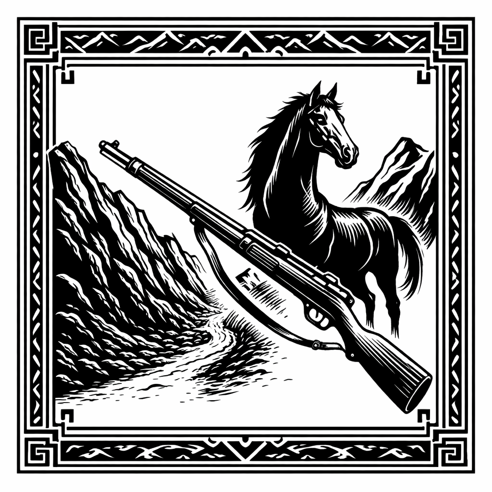{width=80%}


```{=latex}
\end{center}
\vspace*{\fill}
\newpage
```

# 4. Bölüm

Kara Durası kendi çetesini kuracaktı, kararlıydı, kurmalıydı. Kurmalıydı da nasıl? Bir atı, doğru dürüst bir silahı olmayan bir adamın arkasına kim takılırdı. Tek başına da nasıl çete olunurdu.

Her şeyden önce bir atı olmalıydı, sonra arkası gelirdi. Jandarmayla karşılaşsa, neredeyse hiç şansı yoktu. Ormanın arasına sıvıştı, sıvıştı; sıvışamazsa atlı olan jandarmalar onu ya çabucak yakalar ya da bir mavzer kurşunuyla yere sererlerdi.

Tek güvendiği şey dağları çok iyi bilmesiydi. Nerede mağara var, nerede sık ormanlıklar var, hatta dibine sürteni göstermeyen hangi dağın, neresinde mart çamı var tek tek biliyordu. Dağlarda o kadar fazla dolaşmış, dolaşırken çevreyi o kadar dikkatli hafızasına kazımıştı ki, bu dağlarda Kara Durası'nı yakalayabilmek pek de kolay değildi. Değildi de umudu kırılmaya başlamıştı.

Aylardır dağlarda dolanıyor, elde var tek şey çakar almaz mavzeriydi, onu da ekmeğini yediği evden bir hırsız gibi çalmıştı. Şimdi bir de Şaziye'si vardı. Hesaplarına onu da dahil etmek, yapacak şeyleri kararlaştırırken ona göre karar vermek durumundaydı.

Olmazsa da Şaziye'yi alır, izini kaybettirirdi. Giderim gâvur işgali altında bir yere Bursa'mı yoksa Adapazarı, ya da Geyve bir şehre sıvışırlardı. Kafa kağıdı soran olursa "eşyalarımızı çaldırdık, kafa kağıtları da eşyalarla çalındı" derlerdi.

Sırım gibi delikanlıydı, taşı sıksa suyunu çıkartırdı. Kendi kendine, "ulan şimdiden evli barklı bir adam gibi düşünmeye başladım. Avanaklığın alemi yok. Ben dağa çıkacak eşkıya olacağım. Kara Durası'nın namı bu diyarlarda dilden dile anlatılacak. Ulan benim o katil, kel, pepe efe bozuntularından eksiğim ne? Ulan onlardan hem daha gencim, hem de daha gözü kara" diye düşündü.

Ahtımı da unutmadım hani. O katil Nuri yok mu, onu nallayacağım önce. Karşısına geçecek, tam alnının çatısına nişan alacak sonra basacağım mavzerin tetiğine. Bir daha, bir daha, üç mermiyi de aynı delikten geçireceğim şart olsun.

Kendine güveniyordu. Cesareti, acımasızlığı, gözü karalığı yerindeydi ama hiçbir yer bilmiyor, çok az insan tanıyordu. Nereye giderdi, bu yaşa gelmiş Gölpazarı ve Taraklı'dan başka hiçbir yere gitmemişti. Gitse bile iz bilmez, izan bilmezdi. Jandarmalar gördüğü yerde yakalayıverirlerdi. O ne kadar "kafa kağıtlarımızı kaybettik" dese de, "Askerlik yaşındasın, biz senin kafa kağıdını buluruz" deyip askere yollamazlar mıydı.

Hele bir de yanında Şaziye varsa o zaman işi daha da zor olurdu. Onu askere almak için alıkoyduklarında Şaziye'cik o zaman tek başına yaban ellerinde ne yapardı. Zaten bu yaşa gelene kadar insanlardan uzak yerlerde hayvanlarla tek başınayken çok daha rahat hissetmişti.

Bunları düşünürken kendini Sarıcaerik'te buldu. Ne zaman mağarasından çıkmış, ne zaman buraya gelmiş farkında bile değildi. Yamacıların tarlasının anındaki ahlatın olgunlarından yedi, olgunlaşan meyveler pek tatlıydı.

Bu ahlat aynı kızılcık, alıç ve dağ eriği gibi bölge dağlarında doğal bitki örtüsü içerisinde bol bol vardı. Buralarda kış gelip kar yağmadıktan sonra insan karnını kolayca doyurabilirdi. Ahlat ve dağ eriklerinden sonra kızılcıklar, alıçlar olgunlaşırdı. Dağlarda övez ve muşmula ağaçlarına da sık sık rastlanıyordu.

Sonbahar yağmurlarından sonra bu defa bol bol mantar çıkardı. Sonbahar'da yenilebilir mantarlardan kanlıca, sümüklüce ve kara kulak mantarı dağlarda bol bol bulunurdu. Bu mantarların yanı sıra dobalan mantarı (türüf mantarı) da bulunurdu.

Dobalan mantarı pişirmeden çiğ çiğ yenilebilen tek mantardı. Yalnız dobalan mantarını bulmak pek de kolay değildi. Dobalan toprağın altında, hafif toprağı kabartarak bulunur, yuvarlak, fındıktan iricedir. Bu mantarın bölgede koyu ve açık kahverengi renkli olanı bulunurdu. Nadir de olsa tüm Dünya'da en değerli ve en pahalı mantar olan siyahına da rastlanırdı.

Kara Durası dobalan bulunca hemen ağzına atar, kıyır kıyır ses çıkartırarak yerdi.

Mavzerini omuzuna taktı, bıçağı kuşağına sıkıştırdı. Haydan, Alanlar'a doğru yürüyüp şöyle kendine bir bakınca güleceği geldi. Beni biri böyle görse eşkıyadan fazla, koyun çobanına benzediğimi görünce korkacağı yerde güler. Kendi kendine, "zaten koyun çobanı değil miydim" dedi.

Ayağındaki eski püskü çarıklar, üstündeki gömlek, pantolon tam çoban işiydi. Mavzer dersen çakaralmazın önce gideniydi. Bir şeye benzeyen tek şey bıçağıydı. O bıçağı ona askerde şehit düşen Halil ağası vermişti. Kemik saplı, oluklu, sivri uçlu, uzun ve keskin bir bıçaktı. Durası bıçağını sık sık kösüre taşında biler, bıçağının yüzü her zaman ustura gibi keskin olurdu.

Ellerini beline koyarak dobalanlık tarafına doğru baktı. Tam o sırada yakınında bir doğan kuşu sesi duydu. Hızla yere pike yapan bir doğan yerde çekirge yiyen kekliklerin üzerine pike yaptı. Keklikler daha neye uğradıklarını anlayamadan bir kekliği pençeleriyle yakalayarak havalandı.

Tam o sırada Durası da mavzerini yüzüne götürerek o yöne nişan almıştı. Üzerine doğru uçan keklik sürüsüne bir el ateş etti. Mavzer tutukluk yapmamıştı, şanslıydı. Ardından mavzerin kurma kolunu çekip, kekliklerin ardından bir el daha tetiğe asıldı ama bu defa mavzer tutukluk yaptı, tık diye tetik sesini duydu.

Beş metre kadar önünde bir keklik yerde cansız yatıyordu. Kekliği vurmuştu. Sevinçle kekliği yerden alarak çabucak yoldu. Hemen oraya bir ateş yaktı. Kekliği bir çubuğa takarak çevire çevire pişirdi. Keklik pişerken közlerin üzerine akan kekliğin yağı caz cuz sesler çıkarıyordu. Durası'nın ağzı iyice sulanmıştı. Pişen kekliği sıcak mı sıcak demeden ısıra ısıra iştahla yedi.

Karnı doyunca canı su çekti. "Şimdi dereye inmeyeyim, yolumun üzerinde Haydan Deresi'nde suyumu içerim" dedi.

Bu Sarıcaerik bölgesindeki arazilerin bir çoğu Karamatlarlı Yamacılar'ındı. Yamacılar belki 200 yıl önce Haydan'dan, Karamatlar'a taşınmışlardı. Haydan, Sarıcaerik'e çok ama çok yakındı. Arada tek dobalanlık mevkisi vardı. Bu mevki adını dobalan mantarının çok bulunmasından almıştı.

Oturduğu yerden kalkarak mavzerini sırtına vurdu, dobalanlığa doğru yürüdü. Dobalanlık tepesini aşınca iyice susadığını hissedince adımlarını sıklaştırdı. Haydan Deresi'ne varınca taşların arasından şırıl şırıl akan dereye eğilerek ağzını suya yapıştırarak kana kana su içti. Su içerken nefes nefese kalmıştı. "Oh be Dünya varmış" derken avuçlarına aldığı buz gibi suyu suratına çarptı.

Buraları iyi bilirdi. Dobalanlık, Haydan ve Alanlar'ı geçtikten sonra Neçinler'e doğru yöneldi. İninden, Alanlar'a kadar yokuş çıkmış, Alanlar'dan Akçay'ın hemen karşısındaki Neçinler'e doğru iniş aşağıya hızlı adımlarla yürüdü.

Neçinler tarafına yaklaşınca durarak, ellerini beline koydu ve Akçay yönüne doğru baktı. Gözlerine inanamadı, Akçay'ın kıyısında bir adamın atını bir ağaca bağlamış, kendisinin de ağacın dibinde uyuduğunu görünce:

— Ulan körün istediği bir göz, Allah verdi iki göz. Ata bak tüyleri pırıldıyor hani. Eğeri ise fıstık gibi.

Adam uyuyor, doru atta yeşil otları iştahla yiyordu. Kara Durası bu at benim olmalı dedi kendi kendine.

Sinsice, ses çıkarmadan yaklaşmaya başladı. Onu fark eden at kafasını kaldırarak ses çıkardı. Atın sesine sahibi uyandı. Şöyle tam dirseklerinin üzerine doğruluyordu ki, Kara Durası mavzeri elinde ok gibi fırladı.

— Davranma, yakarım.

— Kimsin sen, benden ne istersin?

— Bana Dereli'li eşkıya Kara Durası derler. Ya atını alırım, ya da canını, tercih senin. Gerçi canını aldıktan sonra atını yine alırım ya.

— Yolum uzun, Göynük'e giderim. İki sarı liram var, atımı bana bırak, sana onları vereyim.

— Senin sarı liran da mı var? Bana şu anda at lazım, ama fazla mal göz çıkarmaz.

— Ayağa kalk, şu ağaca kollarını daya.

Adam denileni yaptı. Kara Durası ardından yanaştı belini yokladı. Adamın belinden bir tabanca, cebinden de 5 sarı lira çıkardı. Bu üçü benim, ikisi de sana yeter. Diyerek adamın tabancasını beline taktı, altınları da cebine attı.

— Adama koş şimdi, yoksa kurşunu yersin.

Adam Akçay boyunca koşmaya başladı. Kara Durası adamdan gaspettiği tabancanın namlusuna mermi sürdü, tabancayı ateşledi. İlk mermi adamın saçlarının hemen bir karış kadar üzerinden vınladı, ikinci mermi adamın hemen arkasına suya çarpınca su sıçrattı. Zavallı adam kendi kendine şimdi boku yedik galiba diye söylenerek, arkasına bakmaya bile fırsat bulamadan tabanları yağladı. Kara Durası arkasından gevrek gevrek güldü. Bu iş çok kolay olmuştu. Hem eğerli bir atı, hem tabancası, hem de 3 altını olmuştu. Kendi kendine bağırdı:

— Heyt eşkıya Kara Durası geliyor. Bu günden itibaren eşkıyalığıma kimse bir şey diyemez. İlk haracımız, ilk ganimetimiz hem cins doru bir at, hem de 3 sarı lira.

Sarı liraları şıkırdatarak cebine koydu. Adam gözden kaybolmak üzereyken gözü üzerindeki elbiselere, ayağındaki çarığa kaydı.

— Ulan hay benim akılsız kafam. Adamın üzerindeki urbalar, başındaki fes, ayaklarındaki çizmeler pek fiyakalıydı. Neden aklıma gelmedi, "adama soyun lan" deseydim ya.

Adam gözden kaybolunca ata atladığı gibi Armutçuk köyü tarafına sürdü atını. Armutçuk tarafına sürdü, zira adam gözden kaybolmuştu ama ya bir yere sinerek takip ettiyseydi. Mahsus Armutçuk tarafına sürmüştü yeni doru atını. Karamatlardan tarafa sürse belki adam jandarmaya anlatır, jandarma da peşine düşerdi.

Tepeyi aştı, Dalak Pınar'ında atından atladı. Hem atı suladı, hem de kendisi kana kana su içti. Belindeki tabancayı çıkararak eline aldı. Kız gibi bir tabancaydı. Şimdi hem atın, hem de tabancanın iyisine sahipti. Sayı ne ilk iki haracı, ilk üç haracıydı. Tabanca da vardı, hem de cincik gibi tabanca.

Gevrek gevrek gülerek, "ulan bu eşkıyalık kafama taktığım kadar zor değilmiş" diye söylendi. Kendine olan güveni arttı. Kendi kendine söylenmeye devam etti:

— Ulan gençlik desen gençlik, bileği kavilik desen o da tas tamam, tip desen tam eşkıya tipi, neredeyse bugüne kadar yüzümün güldüğü anlar saysan bir elin parmakları kadar azdır. At desen at, hem de cins at, hem de dorusundan, tabanca desen sanki kılıfından yeni çıkmış gibi, mavzer desen biraz çakar almaz olsa da, görünüşü yeter, tek eksik olan boyumun kısalığı. Ulan biraz da boyum uzun oluverseydi. Şu Yahyaların çobanı İsa ağa gibi çam yarması gibi olsaydım ya.

Heyt ulan diye bir nara attı. Eksikleri olsa da, fazlalıkları da vardı. Bir kere attığını vururdu, acımasızdı, yüreği kinle doluydu, ardında bekleyeni de yoktu Şaziye'den başka. Şaziye'yi de daha dün tanımış sayılırdı. Bir süre uzak durursa o Şaziye'yi unutur, Şaziye de onu unuturdu. Yarın öbür gün bir jandarma kurşunuyla postu deldirirse Şaziye de olmasa kadın nedir tanımadan toprağın altına girecekti.

Kendi kendine bunları söylenirken ayağını atın özengisine koyarak bir sıçrayışta doru atın eğerine oturdu. Atın dizginlerini şaklatarak "haydi aslanım" deyince doru at ok gibi fırladı. Tepeyi aşarak Armutçuk tarafına sallandı.

Bir ardıç perdesinin üzerinde tünemiş bir karabakal kuşunu görünce biraz önce atla beraber gaspettiği belindeki tabancayı çıkardı. Nişan alır almaz tabancanın tetiğine asıldı. Ardıçın üzerindeki karabakal kuşu cırk diye bir ses çıkardıktan sonra yere yuvarlandı.

Kendi kendine, "avcılıkta mavzer ve bıçakla iyiydim de, tabanca ile de fena değilim hani" dedi. Daha bir saat önce keklik kebabı yemişti, karnı toktu. Karabakal kuşunu yerden almadı bile.

Kendi kendine, "şu sırtımdakileri çıkarır iyi bir esvap geçirirsem, ayağımdaki çarıkların yerine şöyle gıcır gıcır bir çizme geçirsem, bir de şu çakar almazın yerine güzel bir mavzerim olsa işte o zaman tam eşkıya olurum vallaha" dedi.

Biraz daha gidince düzlük bir yerde bir adamın öküzlerle çift sürdüğünü gördü. Adamın öküzleri hem cüsseli hem de çok bakımlıydılar. Anası çift sürecek öküz bulamamış, boyunduruğun bir tarafına ineği, diğer tarafına eşeği koşmuş, öyle çift sürmüş, sonunda inek te ölünce hiç süremez olmuştu.

Atın dizginlerini hafifçe çekince at zınk diye durdu. Bu adam zengin biri gibiydi. Öküzler cüsseli, hem de bakımlıydılar. Adamın sırtındaki kıyafetler çift sürerken dahi "ben buradayım" der gibiydi.

Kara Durası hemen atından yere yılan gibi kaydı.

Atını çalılığa bağladıktan sonra eğilerek sessizce yaklaştı. Adam zengin birine benziyordu, altını olurdu herhalde. Yaklaştıkça tarlanın anındaki ahlata asılı mavzeri görünce gözleri fal taşı gibi açıldı.

Mavzer güneşte pırıl pırıl parlıyordu. Bu bir Alman filintasıydı. Halil Efe'de gördüğünün aynısıydı. Halil Efe'nin Alman filintası mavzeri rüyalarına girmişti defalarca. Halil Efe arasıra onu da yanında atış talimine götürdüğünde kendisi filintayla hedeflere ateş eder, Durası'na da şimdilerde Durası'nın omzuna asılı çakar almaz mavzerle ateş ettirirdi. Bir iki defa Alman filintasıyla atış yapmasına izin vermiş, o zaman da Durası hedefi tam ortasından vurmuştu.

Bir çift süren yaşı ellilerindeki adama bakıyor, bir taraftan da ağaçta asılı Alman filintasına bakıyordu. Gözlerini bir türlü filintadan alamıyordu. Kendi kendine, "bu filinta benim olmalı" dedi. Bir taraftan da adamın belinde bir tabanca olabileceğini tahmin ediyordu.

Adam kalantor birine benziyordu. Sırtındaki mavzer çakar almazdı. Bir patlarsa, bir mermi dikiyordu. Adam direnir de, o da mavzerini ateşlemek zorunda kalır, mavzer mermi dikerse çift süren adam belinden tabancasını çıkararak onu vurabilirdi.

Ne olur, ne olmaz diyerek belindeki tabancanın namlusuna mermi sürdü, tabancanın emniyet mandalını açarak yeniden beline soktu. Mavzer çakar almaz da olsa çiftçi nereden bilecekti, görünüşü yeterdi.

Ne olursa olsun dedi, gizlendiği çalının ardından mavzerini eline alarak ok gibi fırladı.

Mavzerini çift süren adama doğrulttu.

— Hey ağa davranma, yakarım. Hiçbir yerin oynamasın, gözünü bile kırpma. Ya filinta, ya canın, sen seç?

— Dur hele evlat, ne canı, ne filintası, dur bir yol nefeslen hele. Sen kimsin, kimlerdensin?

— Bana Dereli'li Eşkıya Kara Durası derler. Belinde tabanca falan varsa davranayım deme ağa, yakarım sonra. Sen kimsin?

— Bana da Armutçuk'lu Halil ağa derler. Bazen Kara Halil ağa da derler ama, eşkıyası yok hani. Buralarda epey namımız vardır ama sen duymamışsın her hal. Dur be Durası, Kara Durası. Sen Kara Durası, ben Kara Halil; iki kara karşılaşmışız Armutçuk kırında anlaşırız her halde. Sonra demezler mi iki kara neyi paylaşamadınız. Gel Kara evlat sen vazgeç bu eşkıyalığa özenmekten. Gel birlikte öküzleri katalım önümüze, gidelim bizim eve. Yengen pişiriverir bir tarhana çorbası, kaşıklarız iki kara birlikte. Bak filintayı da geri istemem hani. O artık senindir.

— Bırak tatavayı ağa sen cevap ver hele, elim tetikte bilesin. Verecek misin filintayı, yoksa iki kaşının arasına sıkayım mı mermiyi?

— Elini tutan mı var Eşkıya Kara Durası, filinta ağaçta asılı, git al.

— Hem eşkıyalığında bir raconu yok mudur. Dedik ya Durası evladım, bizim de buralarda hatırı sayılır namımız var. Sen filintayı alırsan elalem ne demez. Koskoca Kara Halil Ağa filintayı kaptırmış, filintasız gelir. Bizim namımız da üç paralık olmaz mı.

Kara Durası yan yan giderek ağaçta asılı filintayı aldı, fişekliği omuzuna çapraz taktı. Filintanın namlusuna mermi sürdü. Kendi mavzerindeki fişeği çıkardıktan sonra, mavzeri boş ahlatın dalına astı.

— Ağa kes tatavayı, senin şanından bana ne, sen dua et iyi tarafıma geldin, iki kaşının ortasına bir delik açmıyorum. Ağa bu benim mavzeri de sana bırakıyorum.

— Evlat hem eşkıyayım dersin, hem de mavzer bağışlarsın, baya da büyük gönüllüymüşsün.

— Maytap geçmeyi bırak ağa, kafam atacak, sıkacağım kurşunu ha.

— Ne haddimize evlat, maytap kim, biz kim. Ha seni tanıdım. Sen Karamatlar'lı Halil Efe'nin çobanı değil misin?

— Çobanıydım, o eskidendi, şimdi dağa çıktım eşkıya oldum. Milletten haraç alırım, senden de haraç olarak filintayı aldım.

— Halil benim oğlanın asker arkadaşıydı. Seni iyi yetiştirememiş besbelli. Gerçi hani derler ya, katranı ne kadar kaynatırsan kaynat olur mu şeker, cinsini neyse.

— Eşkıya Kara Durası evlat senin asker kaçağı olduğunu duyduydum Molla Mehmet ağadan. Teslim olup, gitseydin askere. Eşkıyalığın sonu yok. Savaş önünde sonunda bitecek, bu vatan düşmandan temizlenecek. Kurulacak yeni devlet dağdaki eşkıyayı yaşatır mı sanırsın. Hem bak Halil ağan yeniden gitti askere. Düşmanla vuruşa vuruşa kardeşi Ali gibi o da vatanı uğruna şehit düştü. Ben derim ki Durası evladım, ağanın yolundan git sen de.

— Bırak Halil ağa, nasihat zamanı çoktan geçti. Başıma ne geldiyse o Molla Mehmet yüzünden geldi. Ona Karamatlar'ı dar etmezsem bana da Eşkıya Kara Durası demesinler.

— İnşallah pişmanlık duyduğunda çok geç olmaz evlat. Delikanlı adamsın, sırım gibisin. Sen bu mavzeri düşmana sıkacakken bana doğrultursun evlat. Hem bak benim oğlan da asker. Şimdi düşmanla mı boğazlaşır, yaralı mıdır, şehit mi düşmüştür haberimiz yok.

— Bak evlat sen bu Kara Halil'i dinle, başlamadan vazgeç şu eşkıyalıktan. Bu gidişle sonun ya bir jandarma kurşunu, ya eşkıya kurşunu, ya da savaş bitince yağlı urgan. Yol yakınken vazgeç bu eşkıya olma sevdasından, teslim ol, diğer vatan evlatları gibi git hırsını düşmandan al. Ya şehit olursun ya da gazi olur, halk arasında namın yürür. Hem evlat sen Molla Mehmet ağaya kinlenirsin ama o iyi adamdır. Ne yapsaydı? Kara Durası teslim olma, dağa çık eşkıya ol, sonunda bir kurşunla yere seril mi deseydi?

Durası’nın beynine bu sözler mıh gibi çakılsa da bir şey demedi, bakışlarındaki sertlikte en ufak bir yumuşama olmadı.

Kara Durası mavzeri elinde geri geri giderek çalılıkların içerisinde kayboldu. Atına atladı, sürdü doru atını Olucak tarafına doğru, aklınca hedef şaşırtacaktı.

Halil ağa, Durası'nın geldiği yöne değil de Olucak yönüne doğru gittiğini görünce koşturarak kestirmeden tepenin öbür tarafına dolanarak pusuya yattı. Kara Durası atını tırısa kaldırmış geliyordu. Tabancasına mermi sürerek nişan aldı.

Tam Kara Durası atının üzerinde denginden geçerken Halil ağa elini tetiğin üzerine koydu, tetiğin boşluğunu aldı, göz, gez, arpacık tam alnına nişan aldı, ama tetiği çekemedi. Karşısındaki gencecik çocuktu. Önce Çanakkale'de şehit düşen oğlu geldi gözlerinin önüne, hemen ardından şu sıralarda Batı cephesi'nde asker olan küçük oğlu geldi aklına. Kıyamadı, dağa çıksa da, eşkıya olmaya heveslense de, filintasını gasp etse de o da bir ana evladıydı. Kıyamadı, tabancasının tetiğinden çekti sağ elinin işaret parmağını.

Halil ağa kendi kendine:

— Git be evlat, git bu gidişle önünde sonunda sonun bir namlunun ucunda sona erecek ama bu benim doğrulttuğum namlu olmasın. Belki daha sonra bu kararıma pişman olacağım ama ne yapalım vicdanım el vermedi işte.

Halil ağa alnında biriken boncuk boncuk olmuş terleri elinin tersiyle sildikten sonra tabancasını beline sokarak Durası'nın gidişini ardından izledi. Kara Durası da atının üzerinde uzaklaştı gitti. Belki Halil ağa tetiğe bassaydı Bilecik vilayetinin tarihi boyunca gördüğü en acımasız eşkıyanın hikayesi daha başlamadan bitecekti.

Halil ağa öküzlerin yanına gelince kendinde çift sürecek ne iştah ne de derman kalmadığını görünce öküzleri boyunduruktan boşandırdı. Bir çocuk olacak yaşta bir delikanlı gelmiş Halil Ağa'nın mavzerini gasp etmişti. Kara Durası'nın bıraktığı mavzeri eline alınca gülümsedi acı acı.

— Ulan Kara Durası mı, Alaca Durası mısın, nesin bilmem. Ulan bu çakar almazla mı çıktın eşkıyalığa.

Halil Ağa çakar almaz mavzeri hırsla çaldı taşa. Mavzerin kundağı kırıldı, namlusu bir tarafa, mekanizması bir tarafa dağıldı. Namluyu yerden aldı, kayaya vurdu, vurdu, paramparça yaptı. Öküzleri önüne kattı, arkalarından yavaş yavaş köye yönlendi. Daha sonbahar günleri olduğundan öküzleri dama koymadı, avludaki sundurmaya sürttü öküzler.

Onu gören karısı:

— Bey hayırdır, sen bu saatte çiftten dönmezsin, hayırola hasta falan mı oldun?

— Sorma hanım başıma gelenleri, hele sen bir soğuk ayran yapıver de kendime geleyim, ondan sonra anlatayım.

Halil Ağa evin önündeki kütüğün üzerine bitkin bitkin oturdu, yaşadıklarını bir bir anlattı karısına. Görmüş geçirmiş bir kadın olan karısı şöyle derin bir nefes aldıktan sonra:

— Doğrusunu yapmışsın Halil ağa, hem de tastamam doğrusunu. O tetiğe bassaydın bir cana kıyacaktın. Belki namına nam katacaktın. "Halil ağa eşkıyalığa soyunan çobanın işini eşkıyalığa başlamadan bir kurşunla bitirmiş" diyeceklerdi, diyeceklerdi ama cana kıymak kolay mı, için içini yiyecek, uykuların kaçacaktı. Senden Allah razı olsun ağa doğrusunu yapmışsın, cezasını devlet verir önünde sonunda.

— Ben de öyle düşündüm hanım, önümden atın üzerinde geçerken şehit evladımız geldi aklıma, tetiğin üzerindeki parmağım gevşeyiverdi.

Halil Ağa dendi mi bölgede namı vardı. Armutçuk, Belenköy, Baltalı, Tohumlar, Belenören, hatta Yenipazar civarında bile Halil ağa'nın lafının üzerine laf söyleyen pek olmazdı, olmazdı da bugün ne olmuştu? Yirmili yaşların başında bir genç gelmiş, filintasını gasp etmişti. Şimdi milletin diline düşecek, itibarı beş paralık olacaktı.

Milletin diline de düştü. Bu hikaye dilden dile, köyden köye anlatıldı. Gerçi Halil Ağa'nın itibarına bir halel getirmedi ama Durası'nın o tarihten sonra Eşkıya Kara Durası diye anılmasına sebep oldu. Daha sonra Neçinler deresindeki at gasp etme olayı da eklenince böyle hikayeleri abartmayı pek seven bölge halkı birin yanına bin katarak anlatmaya devam etti.

Halil Ağa'nın itibarını kurtaran da yakın köy olan Belenköy'den yaşlı bir kadın oldu. Yaşlı kadın oralara söbelen mantarı toplamaya gelmişti. Söbelen mantarının nerelerde çıktığını pek iyi bilirdi. Atın üzerinde, mavzerli birini görünce çalıların arasına sinmiş, beklemeye başlamıştı.

Tam o sırada bir ağacı siper etmiş, elinde tabanca Halil Ağa'yı görmüştü. Nefesini tutmuş, Halil Ağa'nın atın üzerindekini düşürmesini beklerken; Halil Ağa ateş etmemiş, tabancasının horozunu indirerek, tabancasını beline sokmuş ve kendi kendine bir şeyler söyleyerek oradan uzaklaşmıştı.

Oralarda yaşayan herkes çok iyi bilirdi. Halil Ağa bölgenin en namlı nişancısıydı, attığını vururdu. Kadın bu gördüklerini herkese anlatmıştı. Tabii anlatırken bire bin katarak. Atın üzerindeki dev gibi bir adamdı, hani onların köylerindeki Koca Mehmet'ten bile uzun boyluydu. Koca Mehmet'in en az 1.80 santimetre boyu vardı ama neyse.

Bu olay Halil Ağa'nın itibarına zarar vermese de, Kara Durası'nın adının her tarafta duyulmasını sağlamıştı. Halil ağayı o güne kadar hiç mavzersiz gören olmamıştı. Ne yapıp yapıp en kısa zamanda yeni bir filinta bulmalıydı.

Bu günlerde Yunan kuvvetlerini pusuya düşürerek ele geçirdikleri silahları satan efeler çok oluyordu, gerçi Yunanlıların elindeki İngiliz mavzeriydi. Yunan askerleri çatışmalarda Türk Ordusundaki subaylardan ele geçirdikleri filintaları kaçakçılara satıyorlardı. İyi para verirse Alman filintasını da bulması zor olmazdı. Halil Efe kafaya koymuştu bir kere illa da filinta alacaktı. O "Halil ağa filintayı eşkıyaya kaptırdın, İngiliz mavzerine mi düştün" dedirtmezdi.

Halil Ağa hemen kaçakçılarla irtibata geçerek yeni bir Alman filintası daha aldı. Bu defa çift sürerken filintayı uzağa ağaca asmadı, tarlada hemen yakınına bir taşın ya da yanında getirdiği erzak çantasının üzerine koydu.

Halil Ağa, Kara Durası'nı vurmadığına hiç pişman olmadı. O bugüne kadar askerlikte düşman askerinin dışında hiçbir insan oğluna ateş etmemişti, mecbur kalmazsa yine de ateş etmezdi.

Kara Durası, Halil Ağa'nın namlusunun ucundan son anda döndüğünden habersiz gasp ettiği cins doru atını keyifle dağdan aşağı sürdü.

Kara Durası atının yönünü Akçay'a doğru çevirdi. Hacıköy'de bir terzi olduğunu biliyordu, şimdi gidip kendine külotlu bir pantolon diktirmeliydi. Bu atın üzerinde, sırtında da bu filinta varken kilotlu pantolonda yakışırdı hani. "O zaman tam eşkıya olurum" dedi, kendi kendine gururlandı.

Doru atını çay boyunca Hacıköy'e doğru keyifle sürdü. Köye ne zaman gelmişti, farkına bile varamamıştı. Hacıköy'de bir çocuk görünce seslendi:

— Hişt len çabuk gel buraya.

— Ne var ağam, ben bir şey yapmadım ki.

— Gellen buraya sana bir şey soracağım. Terzinin evi nerede?

Çocuk incecik işaret parmağını uzatarak:

— Aha şu ev ağam, hani önünde dut ağacı olan.

Kara Durası atından inmeden mavzerinin namlusuyla evin kapısına vurdu birkaç defa.

Terzi ikinci kattaki pencereden kafasını uzatınca:

— Terzi sen misin?

— He ya benim, sen kimsin?

— Bana Dereli'li Eşkıya Kara Durası derler, bana kilot pantolon lazım.

— Tamam da hemen olmaz, bir ölçü almak lazım.

Yakın köy olduğundan terzi onu tanımıştı ama bir şey demedi. Aslında Kara Durası da onu tanımıştı. Karamatlar'lı Zekiye yengegillerinin çobanının asker kaçağı olarak dağa çıktığını duymayan kalmamıştı.

Hacıköy'lü terzi bölge köylerinde epey namlı bir terziydi. Hele onun gibi kimse külotlu potur pantolon dikemezdi. Parası olan gider ona kilotlu pantolon diktirirdi. Durası zamanında bu terzinin elinden çıkma Halil ağasının ve Katil Nuri efenin kilotlu pantolonlarına hayran hayran bakmıştı.

Kara Durası eve girince duvarda asılı yeni dikilmiş bir kilot pantolon gördü. "Şu pantolonu bir indir deneyeceğim" dedi. Terzi "olmaz, o sipariş, sahipli" dese de, Kara Durası ısrar etti.

— Ulen şimdi tepemi attıracaksın alnından mıhlayacağım, indir dedim şu pantolonu.

O sırada Kara Durası tetiğe bastı, terzinin kafasının 4 parmak üzerinden geçen mavzer mermisi duvara saplandı. Kara Durası terzinin uzattığı pantolonu eline alırken:

— Terzi geri bas, arkanı dön, kollarını kaldır, duvara daya.

Terzi denileni yaptı. Kara Durası, kilot pantolonu giydi, duvarda asılı kırmızı, beyaz, mavi çatkılı mintanı da giydi. Sanki onun için dikilmişti. Gevrek gevrek güldü:

— Bak ulen terzi yakıştı mı?

— Yakıştı, yakıştı da onlar sahipliydi, sahibi yarın gelip, alacaktı.

— Sahibi el değiştirdi terzi, şimdi sahibi benim artık.

— Terzi şimdi ben gidiyorum, aynı ölçülerden bana bir kat urba daha dik, hatta bir de ceket dik, hatta bana bir de çizme al. Haftaya bir gün gelir alırım. Hazır olmazsa o zaman canını yakarım. Ya senin ya da evinden birinin canını alırım.

Terzi "tamam hazırlarım" dedi kekeleyerek. Kara Durası atına atlayarak Akçay'a doğru sürdü. Kara Durası filintasını bu defa atının heybesine sokmuş, tabancasını da külotlu pantolonunun beline sokmuştu. Kendi kendine ikide bir üstüne başına bakıyor, "baya da yakışıklı oldum" diyordu. Kendi kendine, "kahbeyi gösteren urba imiş diye boşuna dememişler" diye söylendi. Sonunda kendi lafına kendi gevrek gevrek güldü. "Ulan biz eşkıyalığa soyunduk, ne kahbesi" dedi.

Kara Durası atını yel gibi sürerek gözden kayboldu.

Kara Durası gözden kaybolduktan sonra terzi kendi kendine: "Bu soytarı adını duyurmak istiyor, eşkıya olabilmenin temelinde de adam vurmak var, sesimi çıkarmayayım, sonra şan olsun diye ilk vuracağı adamda ben oluveririm alimallah. Bu çulsuz bu güzel atı, bu güzel mavzeri de kimden gasp etti kimbilir. Şimdilerde böyle güzel at bulmakta, böyle güzel mavzer bulmakta kolay değil, benden önce kimbilir, kimin canını yaktı bu deyyus" diye düşündü.

Kara Durası gidince terzi kendi kendine söylendi:

— Ulan şuna bak, dünün insan içine çıkmaz, pısırık çobanı bugün başımıza eşkıya kesildi. E bu memleketin gencecik evlatları vatan uğruna düşmanla vuruşurken, şehit olurken, bunun gibi düşman karşısına çıkmaya korkan çapulcular meydanı boş bulup, milletin canını yakıyorlar. Bir gün gelir bunların da canını yakacaklar çıkar evelallah. Benim bir gömlek, bir pantolonumu gasp etti. Ben yarın sahipleri gelene kadar yenilerini yetiştirir, hazırlarım. Yalnız bu deyyus kimbilir kimlerin canını yakacak. İnşallah ya jandarma kurşunu ya da başka bir eşkıya kurşunuyla semirmeden yok olur gider.

Kara Durası Akçay'dan Doruklara doğru sürdü atını. Oradan Güngörmez, Demirdere üzerinden Çalca Deresi'ndeki inine geldi.

Kendi kendine, "şanslı adamım vesselam. Bu atı tüm kırı dolaşsam, hatta Göynük, Taraklı, Gölpazarı demeden arasam bulamazdım. Maşallah koşmuyor, uçuyor. Artık jandarmaların peşime düşmesinden de korkum yok, bu atla ben jandarmalara nal toplatırım" diye düşündü.

Sudaki yansımasına bakınca şöyle bir gerindi, kendi kendine:

— Şimdi adama dönmüşüm işt. At desen at, urba desen urba, silah desen silah. E ben de fena sayılmam hani, azıcık daha boyum uzun oluverseydi, o zaman daha ilk gören adamlar korkudan siner, emzikli kadınların sütü kesilirdi.

Kendi kendine söylenmeye devam etti:

— Hey sen şu Allah'ın işine bak daha on gün önce insanlar beni görürler diye korkarken, şimdilerde beni gören insanlar korkar oldu.

Atını inin girişinde bir ağaca bağladı. Kilot pantolonunu ve yeni mintanını çıkardı, eski giysilerinden giyindi. Derenin hemen karşısındaki ıhlamur ağacından gelen kokuyu duyunca dayanamadı. Ihlamur tam da çiçekteydi. Hemen derenin karşısına geçerek ıhlamur toplamaya başladı.

"Hişt" diye bir ses duyunca irkildi. Ne yapmıştı, nasıl böyle ihtiyatsız davranmıştı. Filintası da, tabancası da mağaradaydı. Gerçi ustura gibi keskin bıçağı belindeydi. Hemen bıçağı eline alarak usulca ıhlamur ağacından aşağı kaydı.

Tam yere indiğinde ayaklarının dibine bir taş düştü. Sağa sola bakındı kimse yoktu. Tam o sırada bir çalının ardında bir kıpırtı görünce "davranma yakarım" diye bağırdı. Çalının ardından doğrulan Şaziye:

— Yaktın zaten, kül ettin, daha nereye yakacaksın?

Şaziye'yi karşısında gören Kara Durası hem şaşırdı hem de sevindi.

Birbirlerine sıkıca sarılarak, uzun süre öyle kaldılar. Kara Durası içinden, "şu gencecik kızın hayallerini de berbat edeceğim kendimle birlikte" diye geçirdi. Daha sonra da, "şu üç günlük Dünya'da ne olacaksa olsun" dedi.

Peş peşe sırtlarını dayayarak mağaraya girdiler. Mağarada oturup konuştular. Şaziye toplanan ıhlamurlardan bir ıhlamur çayı kaynattı. Yanında getirdiği yumurtaları tencerede erittiği kavurmanın üzerine kırdı. Birlikte bir güzel karınlarını doyurdular.

Kara Durası:

— Kız Şaziye kavurma aynı kavurma, yumurta aynı yumurta, hatta ben keklik yumurtalısını bile yaptım ama benim yaptığım bir türlü seninki kadar lezzetli olmuyor, ne bunun sırrı?

— A benim Durası'm, Eşkıya Kara Durası'm. Sen o tomruk gibi kalın parmaklarınla pişiriyorsun, ben sevgimle pişiriyorum, ondandır.

Şaziye daha 17 yaşındaydı, su gibiydi. Kara Durası Şaziye'ye uzun uzun baktı.

— Ne o, neye bakıyorsun öyle, utandırıyorsun beni, yiyecek gibi desem öyle de değil. Pek içten, pek derinden bakarsın.

Kara Durası kekeleyerek:

— Şaziye, Şaziyem, bana ne olursa olacak da, benim yüzümden sana bir şey olur diye korkuyorum.

Şaziye gelerek Kara Durası'nın dizlerine yattı:

— Konuşma öyle deli deli, bir şey olacaksa olur zaten. Ben tek başına garip bir serçeydim senden önce. Sen benim kanatlarım oldun. Bırak kanatlarım kırılana kadar tadını çıkarayım. Ben mutluyum, ben yaşadıklarımdan memnunum. Sevdiğimin yanındayım. Sen olmasaydın önünde sonunda beni zorla birine verip, hayatımı karartacaklardı.

Kara Durası derin bir nefes çekti. Nefesiyle Şaziye'nin saçlarının kokusunu duydu. Bir şey demedi, eğildi Şaziye'nin saçlarını öptü. Sessizliği bozan Şaziye oldu:

— Haydi kalk ıhlamur çiçeklerini toplayalım. Kışın hem sen, hem de ben ıhlamur çayı yaparız. Bu ıhlamur soğuk algınlıklarına pek iyi gelir.

Kalktılar birlikte derenin karşısına geçtiler. Şaziye sincap gibi çabucak tırmandı ıhlamur ağacına.

— Dur kız, ıhlamurun dalları gevrektir, çabuk kırılır. Dikkat et, aşağısı uçurum.

— İyi ya işte ben hafifim kırılmaz, bu narin ıhlamur dalları senin o kalın gövdene nasıl dayansın.

Birlikte gülüştüler. Şaziye ıhlamur çiçeklerini topladı. Erişemediği ince üst dalları da eriştiği yerden elindeki çakıyla keserek aşağı attı. Şaziye ıhlamur ağacında işi bitince yine bir sincap gibi kayarak dalların arasından süzülerek indi.

Ağacın kalınlaşan gövdesinden aşağı kayarken Kara Durası Şaziye'nin ince belini iki kocaman elleriyle kavrayarak yardım etmek istedi. O sırada Şaziye'nin işliği yukarı sıyrıldı. Elleri Şaziye'nin tenine değen Kara Durası bir tuhaf oldu, iç çekti. Yere inen Şaziye gülümseyerek:

— Ne oldu Durası pek derin iç çektin, aklına ne geldi?

Kara Durası bir şey demedi, ard arda yürüyerek dereden mağara tarafına geçtiler. Yerdeki çiçekli ıhlamur dallarını da alarak yan yan mağaraya girdiler yeniden.

Mağarada Durası uyuya kaldı. Şaziye topladıkları ıhlamurları mağaranın önüne kurusunlar diye serdi.

Hava kararmaya başlamıştı. Şaziye yerde yatan Kara Durası'nı uyandırmamak için usulca sokuldu, elini beline doladı. Uyanan Kara Durası kalın kollarıyla Şaziye'yi kendine çekti. Sıkıca sarıldılar birbirlerine.

Hiç ayrılmadan sabaha kadar kucak kucağa yattılar. Sabahleyin ilk uyanan Kara Durası oldu. Usulca dereye inerek derenin temiz, serin sularında yıkandı. Mağaraya gelip oturdu.

Uyanan Şaziye gülümseyerek kalktı sarıldı, saçlarını ıslak görünce:

— Yıkandın mı sen, nerede yıkandın?

— Yıkandım ya, derede yıkandım, derenin suyu pek iyi geldi.

— Ben de yıkanacağım, hem de derede.

— Olur mu, olmaz, sen kızsın, bir gören olur.

— Kim görecek bu derede, hem de sabahın köründe, görürsen bir sen görürsün. Görmek istemezsen arkanı dönersin. Gerçi gördün zaten diye kıkırdadı Şaziye.

Kara Durası "olmaz, şart olsun olmaz" diye kaşlarını çattı. Şaziye gülerek kollarını açtı:

— Hem senin gibi bir koruyucum varken kim cesaret edebilir buralara yaklaşmaya, yıkanırken bana bakmaya.

Şaziye sırtını kayaya dayayarak yan yan mağaradan dereye indi. Hemen soyunarak dereye atladı. Su sabah sabah buz gibiydi.

— Ah anam, su buz gibi.

Hemen derenin kenarına çıkarak bir taşa oturdu. Bu sırada da Kara Durası da derenin karşısına geçerek yüksekçe bir kayanın üzerine tünemiş, sağı solu kolaçan ediyordu, gelen giden var mı diye. Gerçi günlerdir buralarda hiç kimseyle karşılaşmamıştı ya, ne olur, ne olmazdı.

Kayanın tepesinden Şaziye'ye bakıyordu. Ne kadar da güzeldi Şaziye. Şaziye önce ayaklarını, sonra yavaş yavaş, alıştıra alıştıra bacaklarını soktu suya. Sonra tamamen girdi, bu defa çığlık atmadı.

Kara Durası hayran hayran bakıyordu derede çıplak yıkanan Şaziye'ye. Yeni doğan güneş Şaziye'nin vücuduna vurunca sanki altın gibi pırıldıyordu Şaziye'nin vücudu. Şaziye suda doğruldu, elleriyle saçlarını geri attı.

Tam o sırada Kara Durası yutkunmaya başladı. Nefesi kesildi. Şaziye'nin o dolgun, dimdik göğüslerini görünce nefesi kesildi, öksürmeye başladı.

Şaziye uzun saçlarını savurdu, saçlarındaki sular fıskiye gibi etrafa yayıldı. Şaziye saçlarını öyle bir savurmuştu ki, vücudunun her yeri savrulmuştu. Suyun içerisinde dönüyor, kahkahayla gülüyor, suyun içerisine oturup, oturup kalkıyordu.

Kara Durası, "dur kız fazla bağırma, bir duyan olacak" bile diyemiyordu. Suyun soğukluğuna alışan Şaziye şimdi de suyun içine upuzun uzanmıştı. Şaziye doğruldu, saçlarını yeniden savurdu. Şaziye mağaranın duvarına doğru yürürken Kara Durası boğazına bir şey kaçmış gibi hâlâ köh köh öksürüyordu.

Kara Durası'nın oturduğu kayaya doğru bakan Şaziye:

— Dur boğulacaksın diye güldü.

Kara Durası, "bu vücudu, bu güzelliği benden başka kimse görmemeli, göremez. Görürse de yaşamaz, alnının ortasına yer mermiyi" diye kendi duyar duymaz söylendi.

Şaziye giyindi mağaraya döndü. Kara Durası'nın kendine gelebilmesi için epey zaman geçmesi gerekti. Farkına varmadan Sarıcaerik'e doğru yürümüştü. Kirazları olgunlaşmış görünce dayanamadı, hem yedi hem de Şaziye'ye götürmek için topladı.

Biraz sonra topladığı kiraz meyveleriyle döndü mağarasına Kara Durası. Al kirazları görünce Şaziye ellerini çırptı:

— Ay yılın ilk kirazını yiyeceğiz, nereden buldun bu güzel kirazları?

— Hemen şuracıkta Yamacıların tarlasının kıyısında var, oradan topladım. Bak kirazlar aynı senin dudaklarının renginde.

Dudaklarının renginde deyince Şaziye biraz utanarak başını önüne eğdi. İçinden, "dudaklarım da aynı bu kirazlar gibi tatlı geliyormu sana" diye düşündü.

"Sarıcaerik'teki meyveler ta bitecek gibi değil" dedi Kara Durası. "Kirazdan sonra armutu, elması, ahlatı var, daha sonra alıç, kızılcığı, muşmulası cabası. Haydan bahçelerinde ayrıca dut, ceviz, fındık, üvez de var. Hatta kavun, karpuz, çilek bile var."

Birlikte iştahla yediler al al kiraz meyvelerini.

— Bunlar neredeyse toplayalım, kışın hem kurusunu yersin, hem de hoşafını yaparsın dedi Şaziye.

Kara Durası Şaziye'nin elinden tutarak yerden kaldırdı:

— Bırak şimdi bunları, sonra gider toplarız, bak sana ne göstereceğim.

Durası Şaziye'nin elinden tuttu, mağaradan çıkarak sol tarafa döndüler.

— Dikkat et bastığın yere Şaziye, maazallah ayağın mayağın kayar, dereye yuvarlanırsın kayaların üzerinden.

— Ayağın kayarsa sen yanımdasın ya Duram, beni yakalayıverirsin kolumdan.

— Fark edersem yakalarım da, ya fark edemezsem, sen yine dikkat et.

Şaziye önde, Durası arkada adımcık adımcık yürüdüler. Kara Durası önünde bir ceylan gibi yürüyen Şaziye'ye bakınca derin bir iç geçirdi. Kendi kendine, "Allah'ın sevgili kuluyum galiba" diye düşündü. Onun derin derin iç geçirdiğini fark eden Şaziye kıkırdadı:

— Bana diyorsun ama sen dikkat et eşkıya Kara Durası, kafanda neler dolaşıyor, maazallah ayağın mayağın takılır, yuvarlanıverirsin dereye.

— Kız Şaziye dur, bak sana ne göstereceğim.

— Buraya geldik vardır her halde bir sebebi, ne göstereceksen, göster bakalım.

Kara Durası Şaziye'ye açtığı tüneli gösterdi. Durası kanalın ağzındaki kayayı hafifçe yana kaydırınca, Şaziye bir hayret nidası koyuverdi:

— Duram bu ne, burada tünel de mi var?

— Yoktu ama ben yaptım, kaç gündür bu tünelle uğraştım, açana kadar anam ağladı vallaha.

Birlikte tünelden öbür tarafa geçtiler. Tünelden çıkınca Şaziye sevinçle:

— Akıllı Durası seni burada bir bölük asker ele geçiremez. Ne acayip yer burası. Bak tünelin ucu çalılıkların arasına çıkıyor. Bak bu ardıç perdesi de tünelin ucunu iyice gizliyor, bir de tünelin ucuna taş yerleştirmişsin, sanki o taş ebediyetten beri orada gibi.

Yalnız atını da buraya bağla, ya da biraz daha uzağa. Ben sabahleyin baktığımda atın sırtı çiğden ıpıslaktı, maazallah hastalanıverir atın.

Mağara kimbilir kaç yüz yıl önce birileri tarafından oyulmuş ya da doğal olarak bu hale gelmişti. Sanki bir odayı andırıyordu mağara. Tabanı düzgün, tavan yüksekliği fazla, ulaşımı ise bir o kadar zordu. Dereden mağaraya ulaşmak için bir tek kişi bile ancak sırtını duvar şeklindeki kayalara dayayarak, yan yan girebiliyordu.

Bunun yanı sıra kayalığın etrafı çam, ardıç ağaçları ve meşe çalılarıyla kaplıydı. Hele tüneli birinin görebilmesi neredeyse imkansız gibiydi.

"Sonra sen mağaradayken biri de görebilir atını" dedi Kara Durası'na sevgiyle bakan Şaziye.

Mağara o kadar korunaklıydı ki, rüzgar hangi yönden eserse essin, mağaraya hiç rüzgar girmiyordu. Mağara dere kenarında olmasına rağmen mağaranın ağzı, karşı yakadaki kayalardan çok daha yüksekte olduğundan derede oluşacak yağmurlu havalardaki sel ne kadar kudurursa kudursun mağaraya ulaşması mümkün değildi.

Sonunda dolaştılar derenin kenarında, biraz aşağıda korunaklı, atın çiğden ıslanmayacağı bir yer buldular. Kaya dereye doğru çıkıntı yapmış, kayanın altında iki metreden daha yüksek bir girinti oluşmuştu. Yazın yağmurdan, çiğden korurdu atı ama kışın soğuğundan koruyamazdı.

Kışında burada kalacak olursa, dallarla ön taraf kapatılacak, ata bir kulübe yapılacaktı. Atın bağlanacağı kayanın altındaki çıkıntı o kadar korunaklıydı ki, tam yanına yaklaşana kadar atı kimsenin görmesi olanaksızdı.

Şaziye sıkıca sarılarak:

— Eşkıya Kara Durası kışın bu mağarada kalınmaz, gelirsin geceleri bana, gündüzleri gidersin. Bir de kendine "in de mi yaşıyor" dedirteceksin. Mağara ne kadar korunaklı olsa da, ev gibi olmaz, yine de soğuk olur kışları burası.

— E eşkıyanın makamı dağlar, mağaralardır Şaziyem, sen de alış artık eşkıya karısısın. Hem de beni senin evde görürlerse senin adını çıkarırlar. Hem hiç soğuktan korkan eşkıya olabilir mi?

— Niye çıkaracaklarmış adımı, ben senin karın değil miyim artık. Hem kışın karlı buzlu günlerde sen burada soğukta yatarken, ben sıcacık evde uyuyamam ki?

— Karımsın, karımsın elbette ama bunu bir ben, bir de sen biliyorsun.

— Olsun, bana bu da yeter.

— Olmaz öyle, ben bir hal çare düşüneceğim.

— Ne düşüneceksin, karın olduğumu cümle âleme ilan mı edeceksin?

— Ederim ya, neden olmasın?

— Et et de o zaman da jandarma beni zorla konuştursun, senin yerini söyletsin, olmaz öyle şey.

Bir süre öylece birbirlerine bakarak konuşmadan durdular. Şaziye kendi kendine: "Akıllı adam bu Durası. Hem akıllı, hem de güçlü kuvvetli. O tüneli yapmayı nasıl da akıl etmiş, akıl etmekle kalmamış, bir de yapmış. Artık buradayken içim daha rahat. Kendi istemedikçe orada onu kimse yakalayamaz, bırak yakalamayı mağaraya bile sokulamaz. Kendi kendine kaçak olmasa onunla bir ömür bile yaşardım" diye düşündü.

Gerçi savaş sürdükçe jandarmanın böyle tek tük eşkıyaların peşine düşecek ne zamanı vardı, ne de yeterli askeri. Yine de kimse burada yaşadığını bilmemeliydi. Tesadüfen birileri öğrenecek olursa onların da gözünü korkutmalı, konuşmalarını önlemeliydi. Birileri görür, Molla Mehmet'e söylerse o da jandarma komutanına söyler, komutan onu kırmaz, Durası'nın peşine jandarma çıkarırdı.

Önce Karamatlar'da kendini göstermeli, korku salmalı, eşkıyalığını kabul ettirmeliydi. Karamatlarlıların kafasındaki o sessiz, etliye sütlüye karışmayan, insan içine bile çıkmayan Zekiye yengegillerin çobanı imajını unutturmalı, acımasız eşkıya Kara Durası imajını kafalarına kazımalıydı. Bunu yapabilmek için gerekirse can yakar, can alırdı.

Molla Mehmet hükümet adamlarının buralardaki eli ayağı gibiydi. Herkesin gözünü korkutmalı, en fazla da Molla Mehmet'in gözünü korkutmalıydı.

Şaziye, Kara Durası'na yeni esvaplarını göstererek:

— Durası bunlar pek te fiyakalı şeyler nereden buldun bunları? Bir giy de göreyim bir yol.

— Sorma Şaziyem hani derler körün istediği bir göz, Allah verdi iki göz. Çıktım çakar almazımla giderken Akçay kenarında bu atın sahibini ihtiyatsızca uyurken gördüm. Ondan bu atı ve belimdeki tabancayı gasp ettim. Sonra Armutçuk tarafına giderken bu defa oraların en zengini Halil Ağa'nın filintasını ağaca asmış, çift sürerken gördüm, çektim benim çakaralmaz mavzeri "davranma yakarım" dedim, bu filintayı gasp ettim. Daha önce duymuştum Hacıköy'de namlı bir terzi var diye gidip, ona urba diktireyim derken duvarda asılı bu esvapları gördüm. Bir deneyeyim dediğimde sanki benim ölçülerim alınmış, ona göre dikilmişti. Hemen giydim sırtıma. Terzi "sahipli mahipli" dese de, "höstlen artık sahibi benim" dedim, "ha haftaya bir de çizme hazırla" dedim. Terziyi bir görecektin tir tir titriyordu korkudan, belki de altına kaçırmıştır.

— Tamam neyse, ne; sen giy hele şunları.

— Olmaz şimdi, sırası değil.

— Ne demek sırası değil, karına göstermeyeceksin de, kime göstereceksin?

Kara Durası arkasını dönerek sırtındakileri çıkardı, yeni kıyafetleri giydi ve Şaziye'ye doğru döndü.

Kara Durası'nı yeni kıyafetleri içerisinde gören Şaziye gülümseyerek:

— Vay be hele şuna bak sen. Bizim Eşkıya Durası, beyzade Durası oluvermiş sanki.

— Bırak dalga geçmeyi be Şaziyem, daha eşkıya bile olamadık, nereden çıkardın beyzade olmayı?

Gece yatsı vakti Kara Durası atını eğerledi:

— Haydi Şaziyem seni köye götüreyim.

— Bir gece daha kalsaydım be Durasım.

— Olmaz Şaziyem, köydekiler senin olmadığını fark ederse maazallah muhtar jandarmaya haber verir.

Kara Durası atına atladı, Şaziye de atın terkisine zıpladı. Şaziye, Kara Durası'nın beline sıkıca sarıldı. Kara Durası ardındaki Şaziye'yi sarsmak istemediğinden atını dörtnala kaldırmadan Dereli'ye doğru yol aldı.

Daha çocuk denecek yaşta, 17 yaşında olan Şaziye atın terkisinde denk durmuyor, kıkırdayarak Durası'nın göbeğini gıdıklıyordu. Kara Durası gıdıklanmalardan sanki hiç etkilenmemiş gibi tepki vermeden sürdü atını. Kendi kendine, "at değil, sanki kanatlı ejder mübarek, ne zaman sakinleşeceğini, ne zaman hırçınlaşıp, ok gibi fırlayacağını çok iyi biliyor. Sanki hep benim atımmış gibi, eski sahibini de hiç aramadı" diye düşünürken köye yaklaştıklarını fark etti.

Köye gelince evin önünde Kara Durası attan yere atladı, tam Şaziye'yi kucaklayıp, yere indirirken at kişnedi. O sırada yakındaki bir evin perdesinin aralandığını gördü. Şaziye'yi alnından öptü:

— Haydi Şaziyem sen gir evine, kapat kapını, kapıyı arkadan iyice de dayakla.

— Gelseydin içeri, sana sıcacık bir tarhana çorbası pişirirdim.

— Şimdi olmaz, daha sonra Şaziye, şu penceredeki perde kıpırdadı, bizi gördüler galiba. Sana bir şey söyleyen, hatta ima eden olursa bana hemen söyle. Yılanın başını ufakken ezmek gerek. Sonra önünü almak zor olur.

— Haydi yolun açık olsun, ben kapıyı örtüyorum.

— Allah rahatlık versin Şaziye.

Şaziye eve girince biraz bekledikten sonra atını sürdü, bir yüz metre kadar gittikten sonra geri döndü, perdesi aralanan evin önünde durarak atından atladı. Mavzerine mermi sürerek, mavzerin namlusuyla kapıya sert sert vurdu.

İçeriden tedirgin bir ses:

— Kim var orada, kim o?

— Aç kapıyı, ben Durası, Eşkıya Durası.

Kapı gıcırdayarak açıldı. O sırada Şaziye şüphelenmiş, fark ettirmeden perdenin arkasından dışarısını seyrediyordu.

Kapıyı açan evin erkeği yaşı 75'e dayanmış Ahmet amca:

— Buyur Durası oğlum, hoş geldin, ne istersin?

— Hoş mu geldim bilmem Ahmet amca. Şunu bil Şaziye benim helalim, benim karım. Bu kızın başına bir şey gelirse sizden bilir, evinizi başınıza yıkarım, bilin istedim.

— Biz kendi hallerinde insanlarız be evladım, bizden ne zarar gelsin, elimizden geldikçe yardım eder, kollar, gözetleriz, senin gözün arkada kalmasın.

— Kimseye bahsetmeyeceksiniz, duyulursa karışmam hani.

— Sen meraklanma, bizden laf çıkmaz, bizden zarar gelmez.

— Ben diyeceğimi dedim ihtiyar. Dediğim gibi bir duyulsun, hele bir de Şaziye'ye bir zarar gelsin şart olsun nam olsun diye gelirim siz evin içerisindeyken evinizi cayır cayır yakarım.

Ahmet amca Kara Durası gittikten sonra kendi kendine: "A bunun için azılı eşkıya olmuş diyorlardı, olmuş vallahi, kırk yıllık komşu Ahmet amca demiyor, tehdit ediyor, posta koyuyor. Armutçuk'lu Halil Ağa'nın filintasını gasp etmiş, ağa gıkını çıkaramamış demişlerdi de aman sende demiştim, doğruymuş demek ki, sırtındaki mavzer de Halil Ağa'nın Alman Filintası herhal" diye düşündü.

Kara Durası atını köyün içerisine sürdü.

Şaziye perdenin ardından "nereye gider bu" diye kendi kendine söylenirken, kendi duyabileceği bir sesle:

— Seni gidi Ahmet amca, "tek başına kalmış bir kızım diye beni zorla Çiftlik'ten akraban 40 yaşındaki 2 çocuklu topal Hasan'a vermeye kalkmadın mı? Olmaz değince bak seni dağa kaldırtırım ele güne rezil olursun" demedi miydin. Şimdi yiğidim mavzeri dayayınca mıyım mıyım, bakıyorum kuzu oluverdin.

Kara Durası atını muhtarın evine sürdü, evin önüne gelince bu defa attan inmeden mavzerin namlusuyla kapıya vurdu.

İçeriden bir ses:

— Kimsin sen, bu gece yarısı, ne istersin?

— Muhtar aç kapıyı. Ben Durası, Eşkıya Kara Durası. Aşağı gel hele. Silahın var biliyorum. Eğer silahına davranırsan sülaleni kuruturum.

Sanki çevrede adamları varmış gibi seslendi:

— Len oğlum siz biraz uzakta durun, çevreyi kolaçan edin.

Kapı usulca açıldı. Don gömlek olan muhtar karşısında Durası'nı atın üzerinde, hem de cins atın üzerinde, kilot pantolonlu, mintanlı görünce şaşırdı:

— Hoş geldin, safa geldin köyümüzün yiğidi, Kara Durası, ne istersin benden?

— Muhtar bak kulaklarını aç iyi dinle, hem dinle, hem de beynine iyice mıhla, bir kere söyleyeceğim bundan böyle Şaziye benim helalimdir, karımdır. Bunu bir Ahmet amcalar biliyor, bir de şimdi siz öğrendiniz. Başkası duyarsa, ya da o kızın başına bir şey gelirse, ya da bunları Jandarmaya ispiyonlarsan şart olsun adamlarımla gelir evini basar, sülaleni kuruturum. Eşkıya olduk dağa çıktıysak, eşkıyalığında bir namusu var. Kendi köyüme zarar vermeyeceğim, köyden bana ya da karıma zarar gelmedikçe.

— Tamam Durası aslanım, konuştuklarımız aramızda, jandarmaya, mandarmaya da söylemem, sen kendini ferah tut. Köyümüzden böyle bir yiğit çıkmış bize bunun iftiharı yeter. Sen meraklanma ben Şaziye kızımızı, kendi kızım gibi kollar gözetlerim.

— Eyvallah muhtar ben şimdi gidiyorum. Arada gelirim köye, Şaziye'den bir şikayet duyduğumda, yaktım o zaman çıranı.

— Meraklanma sen yiğidim, hiçbir sorun olmayacak.

Kara Durası eyvallah muhtar diyerek atını sürdü.

Kara Durası atını sürerken, "daha beni köyden ayrılmak zorunda bırakmanızın üzerinden on yıl bile geçmedi. Riyakar adam, neredeyse o zaman bir kaşık suda boğacaktınız beni" diye düşündü kendi kendine.

Kara Durası gidince muhtar bunun böyle olacağı Naci'yi dövdüğü zaman belliydi. "Yılanın başını ufakken ezeceksin. Büyüdü mü dolanır beline sıkar, boğar seni. Biz de bunun başını zamanında ezmeliydik. Bak şimdi başımıza bela olacak, hem de ne bela. Eşkıyanın azılısı olacak, çıkacak başımıza" diye düşündü.

Şimdi beladan uzak durup, iyi geçinmek zamanı. Jandarmaya haber vermek lazım ama, jandarma ne yapacak. Komutanın elinde yeterli askeri yok. Bir taraftan Yunan'a karşı savaş sürüyor, bir taraftan eşkıya takibi. Bir taraftan da askere malzeme, yiyecek tedariki sürüyor.

"Neme lazım ben sesimi çıkarmayayım. Jandarmaya haber verdiğini duyarsa bu defa bana tebelleş olur, takaza etmeye başlar" diye düşündü kendi kendine.

O günden sonra Şaziye ile ilgilenmede Ahmet amcalarla muhtar birbirleriyle yarıştılar. Durası atıyla köye geldiğinde yedirsin diye Şaziye'nin evine arpa bile getiriyorlardı. Her ekmek pişirdiklerinde ekmek getiriyorlar. Köyde bir maslahat olsa muhtarın gelini Şaziye'yi de yanına almadan gitmez olmuştu.

Şaziye Durası'nın sağladığı korku ortamının keyfini çıkarıyordu.

Şaziye artık köyde horlanılan, "bir kandırıp, yatağa atsak" diye düşünülen yalnız bir kız değil, köyün muhtarıyla, köyün önde gelenlerinden Ahmet amcanın kanatlarının altına aldığı, köyün kıymetlilerinden biri oluvermişti.

Köyde Şaziye'nin evine Durası'nın gelip gittiğini tüm köylü biliyor ama sanki haberleri yokmuş gibi yapıyorlardı. Yalnız kaldıklarında "pısır pısır" dedi kodu yapmaktan da geri durmuyorlardı.

İnsanlar her şeyden korkar, yılar olmuşlardı. Yıllardır süren savaşlar insanları çok fakir de düşürmüştü. Ay geçmiyordu yeni bir şehit haberi gelmesin. İmam, muhtar askere alınmıyor, zengin olan bedel ödeyerek askere gitmiyor, kalan köy gençleri düğüne gider gibi düşmanla vuruşmaya koşuyorlardı.

Tabii Durası gibi bir de eşkıya olup dağa çıkanlar, ya da askerliğe çağrılınca sırra kadem basıp ortadan kaybolanlar da olmuyor değildi. Dağlarda gezen kaçaklar yüzünden kadınlar, genç kızlar tarlalara çift sürmeye, dağa bayıra hayvan otlatmaya gitmeye tek başına gidemez olmuşlardı.

Kara Durası'nın geldiği geceler, yemeklerini yiyip, sohbet etmeye başladıklarında Kara Durası'na olanları Şaziye ballandıra ballandıra anlatıyordu. Bunları dinleyen Kara Durası gevrek gevrek gülüyor, "e bir yapmasınlar da görürler o zaman onlar ell mi yaman, bey mi yaman, yoksa Kara Durası mı yaman" diyordu.

Gördüğü itibar, ilgi korkudan bile olsa 17 yaşındaki gencecik Şaziye'nin hoşuna gidiyordu. Herkes halini hatırını soruyor, "bir ihtiyacın var mı, sen bizim kızımız sayılırsın" diyorlardı.

Kara Durası'nın yüzü sadece Şaziye'nin yanında gülüyordu artık. Başka zamanlar hep o sert bakışlar, hemen silaha davranıverecekmiş gibi tavırlar.

Kara Durası artık Şaziye'nin yanına gelirken öyle çok fazla gizlenmek zorunda hissetmiyordu kendini. Yine de tedbiri elden bırakmıyor; hangi gün geleceği, gecenin hangi vakti geleceği hiç belli olmuyordu. Bazen akşam namazından hemen sonra, bazen de sabah namazına yakın geliyordu.

Şaziye'nin Çalca Deresi'ndeki inine bir daha gelmesini istemiyordu. Şaziye ne kadar ısrar etse, "ben orayı çok sevdim" dese de kaşlarını çatarak "olmaz, bir daha söyleme ilk defa kalbini kırarım sonra" demiş, Şaziye de ondan sonra ısrar etmemişti.

Kara Durası her geldiğinde heybeleri dolu geliyordu. Heybesinde etraftan mevsimine göre topladığı meyve ve sebzeler, avladığı tavşan ve keklik etleri, ya da çevredeki davarlardan çobanları tehdit ederek aldığı, ya da çaldığı keçi etleriyle dolu oluyordu heybeleri.

Kara Durası bir gece yarısı Şaziye'nin evinden çıktıktan sonra atını Kuzlar tarafına doğru sürerken doru atının üzerinde gevrek gevrek gülüyordu. Atıyla çam ormanlarının arasından bayır yukarı tırmandı. Kuzlar'a gelince atının yönünü Haydan'a doğru çevirdi.

Giderken doru atının üzerinde bir taraftan ıslık çalarak gecenin karanlığında bir türkü tutturdu, sesi de pek güzel değildi ama karga gibi de değildi. Kendi kendine, "ben daha önce hiç sesli sesli türkü söyledim mi" diye düşündü. Zekiye yengegiller'de çobanlık yaparken birkaç defa da olsa söylediğini anımsadı.

— Bir incecik amman, dumanda tüter amman amman bacadan. Ah oku derler amman amman, ben okumam, böyle sarhoş hocada.

Ne okumuştu, ne de tüten bacası vardı. Anası Fadime kadın 7-8 yaşlarındayken duaları, az da olsa Kur'an-ı Kerim'i okumasını öğrensin diye köyün imamına göndermişti. Epey gitmişti hocaya. Sübhaneke, ettehıyyatü, salli barik duaları derken Fatiha suresi, Ahad suresi, Kevser suresi, Maun suresini öğrenmiş, sıra Ayetel Kürsi'ye geldiğinde bir türlü ezberleyememişti.

Bir gün, iki gün derken önce hoca okurken elindeki uzun deynekle kafasına vurmuş, "ben okuyacağım ardımdan tekrarla" dediğinde; sure içerisindeki "lata huzuhü sünnetim" kısmını bir türlü söyleyememiş dili dönmemişti. Bunun üzerine hoca "sen koca kafalı, geri zekalı mısın çocuk" diyerek ensesine sert bir tokat şaklatmıştı.

Tokatın etkisiyle Durası'nın kafası önündeki rahleye çarpmış ve o çarpmanın etkisiyle Durası dilini ısırmıştı. Kara Durası ağzında değişik bir tat hissetti. Elini ağzına götürdüğünde dilinin kanadığını fark etti. Dili kanıyordu ama dilinin kanadığını korkusundan hocaya söyleyemedi. Durası korkusundan kanı yutmak zorunda kalmıştı.

Ondan sonra Durası bir daha hocaya gitmedi. Gitmedi ama hocaya olan kini de bitmedi.

Aradan epey zaman geçmiş, Durası ormandan mantar toplamaktan geliyordu, hocayı caminin önünde görünce durdu, elindeki mantar torbasını bir kenara koyarak hocayı izlemeye başladı, hocaya görünmeden.

Hoca öğle ezanını okumuş, caminin önündeki kütüğün üzerinde oturuyordu. Yaz günü olduğundan köyde zaten çok az olan erkekler de tarlada, işte, güçteydiler. Caminin önünde hocadan başka kimsecikler yoktu. Tek başına namaz kılmak hocanın da canı pek istememişti. Kendi kendine "ikindi namazı ile birlikte cem eylerim" diye düşündü.

Durası yerden eline bir taş aldı, hocaya görünmeden elindeki taşı kin ve nefretle hocaya fırlattı. Tam o sırada hocanın iki kaşının arasında, alnının tam ortasında bir taş şakladı. Hoca acıyla "anam" diyebildi. Kanayan alnına cebinden çıkardığı namaz takkesini bastırdı. Acıyla hocalığı, mocalığı unuttu.

— Ulan bu taşı hangi anasını bilmen ne yaptığımın orospunun evladı attı, ulan seni bir yakalarsam ananı bellemem mi?

O sırada kafasında bir taş daha şakladı. Bu defa da kafasının arkasına gelen taş hocanın kafasını delmiş, kanlar boynuna doğru sızmaya başlamıştı. Hoca ana, avrat söverek acı içerisinde taşlardan kurtulabilmek için aceleyle caminin içerisine girdi. O arada caminin önündeki dibek taşının arkasına gizlenmiş olan Durası arkasına bile bakmadan kaçtı oradan, kimseye görünmeden.

Taşı kimin attığını kimse hiçbir zaman öğrenemedi. Durası anasına bile söylemedi. Bir gece Şaziye'nin evinde keyifle rakısını yudumlarken ona anlatmış, Şaziye de katıla katıla gülmüştü. Şaziye de 4 sene kadar sonra olsa da aynı hocadan dayak yediği için bu anlatılanlar Şaziye'nin de hoşuna gitmişti.

Durası, "Karaçobanlar yazları bizim oğlakları güt" deyince, anası yeniden hocaya göndermesin diye seve seve kabul etmişti. Kara Durası o küçük yaşlarında birkaç fasla peynire Karaçobanlar'ın oğlaklarını gütmüştü yazları. Bazı günler oğlakları bu Haydan bahçelerinin yanına getirmişlerdi buğday desteleri kaldırıldıktan sonra oğlaklar kalan buğday başaklarını yesinler diye. O zamanlardan beri bu Haydan Bahçelerini pek severdi.

Gecenin ay ışığında Kuzlar'dan atını Haydan'a doğru sürdü. Keyfine diyecek yoktu. Kendi kendine, "ulan Kara Durası Allah'ın sevdiği kulsun galiba. Gasp etsen de atın iyisi, silahın iyisi, urbanın iyisi hatta kadının iyisi sende. Ötekileri gasp etsen de kadın kendi gönlüyle sevdi seni, kendi geldi girdi senin koynuna; sevgi dolu, hem de sıcacık, hem de soru sormadan, bir şey beklemeden" diye düşündü.

Sevdiği kadının koynundan çıkmış, sevdiği Haydan'ın ceviz ağaçları neredeyse gökyüzüne erecekmiş gibi kocaman ağaçların dibine doğru gidiyordu Kara Durası. Şaziye'ye giderken de, gelirken de her defasında bir pusuya düşmemek için yol değiştiriyordu. Bu defa da yolunu uzatmış mağarasına Kuzlar, Haydan, Dobalanlık, Sarıcaerik üzerinden gidecekti.

Hava da pek güzeldi. Kara Durası atının nal sesinden başka, böcek sesleri, yaprak hışırtıları, arada da korkuyla gizlendiği yerden fırlayan bir tavşanın çıkardığı çıtırtıdan başka hiçbir ses duymuyordu.

Kara Durası , Haydan’a gelince doru atından yere atladı. Dereden önce kendi kana kana su içti, daha sonra atını suladı. Atının dizginlerini çıkardı, atını otlasın diye kafasına bir yular geçirerek uzun bir iple bir ağaca bağladı. Doru at ay ışığında taze otları iştahla yemeye başladı. Kara Durası el yordamıyla ceviz ağaçlarından birkaç ceviz kopararak ucu sivri, ustura gibi keskin bıçağıyla yeni içlenen cevizleri yararak içlerini yemeye başladı. Pek keyifliydi, taze cevizi pek severdi.

Cevizleri yiyince pantolonunun düğmelerini çözerek işedi, tam işerken o anda bir ses duydu. Neredeyse donunu kirletecekti. Hemen atının yanına koştu, eğerden mavzerini aldı. Mavzerin namlusuna bir mermi sürerek, tilki gibi sessiz ve kurnaz sesin geldiği yere yaklaşmaya başladı.

Ses yaklaştıkça artıyordu. Buralarda domuz da, ayı da bulunurdu. Domuz dese, domuz sesi değil, ayı dese, ayı sesi değildi.

Yaklaştıkça sesin avlaylı bir bahçedeki devasa cevizin altından geldiğini anladı. Oralarda bahçelerin etrafındaki böğürtlen çalılarından oluşan çitlere avlay denilirdi.

Çıtırtı çıkarmadan usulca bahçeye girdi. Yaklaştıkça sesin neden geldiğini anlamaya çalışıyordu. Yabani hayvan birden saldırır diye sağ elinin işaret parmağı filintasının tetiğinin üzerindeydi.

Ses o kadar yüksekti ki, neredeyse yankı yapıyordu. Ara sıra kesik kesik geliyordu ya, "haydi hayırlısı" dedi Kara Durası. Bu uyuyan birinin horlaması olduğu belliydi de horlayan ayı mı, köpek mi, kurt mu yoksa insan mıydı? Bir köpeğin, bir kurdun uyurken aynı insan horlaması gibi ses çıkarmasıyla çok karşılaşmıştı.

Yaklaştıkça sesin uyuyan bir insanın horlaması olduğunu anladı. Adam cevizin dibinde karnı yukarı yatıyor, yanı başında mavzeri ve fişekliği duruyordu. Adamın kıyafeti köye gelen jandarmalarınkine benziyordu. Adam uzun boylu, saçı sakalına karışmış, heybetli bir adam gibi görünüyordu. Kara Durası neredeyse nefes bile almadan epey zaman seyretti adamı. Adamın uykusuz olduğu, çok derin uyuduğu belliydi. Kendi kendine, "bu adamın kıyafetleri yırtık pırtık da olsa jandarmalara benzediğine göre o zaman asker kaçağı ya da birliği dağılmış, yolunu kaybetmiş bir asker olmalıydı. Haydi hayırlısı ya çetemin ilk elemanı ya da ilk leşim karşımda" diye düşündü. Filintasının namlusunu horlayarak uyuyan adamın tam kalbinin üzerine dayadı.

— Davranma, yakarım.

Gürleyen ses karşısında gecenin karanlığında korkuya düşen adam:

— Etme, dur kıyma bana, kimsin sen, ne istersin benden, ben garip bir askerim.

— Bana Dereli'li Eşkıya Kara Durası derler. Ben can yakar, haraç alırım. Sen kimsin, ne işin var buralarda?

— Be be, ben mi? Ben Mehmet, bana Kürt Memo derler, Ağrı, Tutak'lıyım.

— Ağrılısın da ne ararsın buralarda, horlamandan seni ayı sandıydım ya neyse, iyi ki uzaktayken çalmamışım kurşunu.

Yerden doğrulan adam dev gibiydi, neredeyse Kara Durası'nın iki katıydı:

— Ben askerdim arkadaş. Geyve Cephesi'ndeydim. Anzavur eşkıyasının Kuvâ-yi İnzibatiye birlikleriyle çarpıştık. Bizim bölük baskına uğradı, bölük dağıldı. Ben yolumu kaybettim, birkaç gün dağlarda gezdim. Birliğimi bulamadım, hiç askere de rastlamadım. Bir çayı geçtim, geçmeden önce Şeyran denen bir köy vardı. O köyde bir yaşlıya sordum. "Sen cepheden çok uzaklaşmışsın" dedi. Bana "bu çay Göynük Çayı, bu taraf Geyve, öbür taraf Gölpazarı" dedi. Ben de firarım verilmiştir diye korktum. Bizim komutan var, namı deli, Deli Halit Paşa. Acımaz adama, cepheden kaçanı alnının ortasından vurur. Belinde iki tabanca olur her zaman. Sağdaki tabancayla düşmana, soldaki tabancayla asker kaçaklarına ateş eder. Gerçi ben kaçmadım, yolumu kaybettim ama kime anlatırsın derdini. Dedim ben Ağrılıyım, Ağrı'ya nasıl gidilir. Yıllarca savaş savaş iyice yılgındım da arkadaş. Buralar, bizim oralara hiç benzemez. Gerçi ben Çanakkale Cephesi'nde de savaştım; buralar oraları andırıyor. İhtiyar hocaymış, âlim adama benziyordu. Bana "Ağrı doğudadır, hep güneşin doğduğu tarafa gidersen Ağrı'ya ulaşırsın. Gerçi memlekette savaş var, üstünde de askerî kıyafetler. Sen önünde sonunda ya askere yakalanırsın ya da dağlarda zibil gibi olan eşkıyaya. Askere yakalanırsan baştan hapis, sonra cephe, eşkıyaya yakalanırsan sonun olur bir kurşun. İkisine de yakalanmazsan 3-4 ayda varırsın Ağrı'ya. Tabii bunun kışı var, hastalığı var. Bundan da öte ne yiyip ne içersin. Sen dön evlat birliğine dön, sonuca katlanırsın. Kendini anlatırsan belki cezasız da kurtulursun." Ağam ben de Türkçe konuşmada zayıf, nasıl anlatırım kendimi?

— Ben de geçtim Göynük Çayı'nı. Kadere kısmet dedim. Çay boyu yürüdüm. Sonra karşıma kocaman bir ayı çıktı, ondan kaçarken yolumu iyice kaybettim. Bir daha çayı da bulamadım. Hep doğuya doğuya gitmeye çalıştım. Bazen dağlarda ot, bazen meyve yedim. Bazen de köylerden yumurta, tavuk çaldım yedim.

— Hele bana kıymayacaksın değil mi ağam, benim sana zararım dokunmaz.

— Bana Kara Durası derler; namıdiğer Eşkıya Kara Durası. Haraç alırım, can vermem, can alırım. Bak senin şansına da karşına eşkıya çıktı, hocanın dediği gibi alayım mı canını?

— Ağam kösüldüm, memlekete varma umudum da kalmadı, hadi vardım diyelim, firarım çoktan verilmiştir, asker kaçağı diye hemen derdest ederler. Zaten böyle yalın ayak, üstte yok, başta yok, cepte yok nereye gideyim. Ağam beni yanına, çetene al. Sağ kolun olurum. Seninle birlikte vurur, uğruna ölürüm. Al beni yanına ağam. Almazsan da vur beni, yaban hayvanı gibi oradan oraya kaçar oldum, zaten önümde sonumda şansım bir kurşun.

Kara Durası için için mutluluktan gülüyordu. Kendi kendine:

— Ulan Durası, Kara Durası, Allah'ın sevgili kulusun ulan. At istedin, al sana at; hem de cinsinden, dorusundan. Silah istedin, hem de Alman filintasından. Döşeğine avrat istedin, hem de en güzeli, en tatlısından.

— Ne oldu Kara Durası ağam, yüzüne bir hoşluk yayıldı, alacak mısın beni yanına?

— Öyle değil Kürt Memo, aklıma eskilerden bir şey geldi de ondan.

— Kara Durası ağam al beni yanına. Ya birlikte yaşar ya da birlikte ölürüz. Sırt sırta verdiğimiz mi bizi kimse yıkamaz. Sen böyle saç sakala karışmış, hırpani halime bakma, ben de yüz adımda meteliği ortasından şaklatırım alimallah.

— E düşündüm de Kürt Memo, şimdi alacağım seni yanıma almasına da, bakalım birkaç gün gözlerim. Adam olacak gibiysen ne âlâ, olmayacaksa ya sen yoluna ben yoluma ya da alnının ortasına bir kurşun.

— Bak Memo, seni alacağım yanıma, bakalım nasıl birisin, deneyeceğim, gözlerim hep üzerinde olacak. Ya adamım olursun, ekmeğimizi paylaşırız ya da baktım beğenmedim seni, en fazla bir kurşunum zayi olur, sıkarım alnının çatına bir kurşun.

Kara Durası içinden, "bir adamım olsa, yoldaşım olsa diyordun, şanslı Durası al sana adam, hem de ayı gibi, hem de mavzerli" diye düşündü.

— Ulen Kürt Memo, senin bu mavzer çalışır mı?

— Çalışmaz mı ağam, bu ordu mavzeri. Ben bununla az gâvur, Anzavur haini öldürmedim. Evelallah daha tutukluk yaptığını görmedim.

Kara Durası yerden Kürt Memo'nun mavzerini aldı, yüz adım kadar uzaktaki ceviz ağacına nişan aldı, bastı tetiğe.

— Hım, nişan ayarı da iyi, vallaha istediğim yerden nalladı.

— Kara Durası ağam kaç yıldır cephelerde savaşırım ben bile unuttum. Birkaç hafif yaralanmanın dışında ağır bir yara almadım. Bu mavzerle öldürdüğüm gâvurun sayısını bile unuttum ben. Mavzer ayarlı olmasa o kadar gâvuru tahtalı köye nasıl yollardım?

Hava aydınlanmıştı artık. Kara Durası atla, Kürt Memo yaya Çalca Deresi'ndeki inine aldılar soluğu.

— Kara Durası ağam, ardından yetişebilmek için bazen yürüdüm, bazen koştum vallaha. Doğru dürüst bir şey yemesem de hâlâ güç kuvvetim yerinde evelallah. Ağam yolumuz daha çok uzun mu, menzile daha çok var mı?

— Meraklanma len Memo, geldik, geldik sarayım ha şurada.

— Ağam ne sarayı, senin sarayın da mı var?

— Var ya Kürt Memo, ne sandıydın?

Kara Durası atının eğerinin kolanını gevşeterek üzerinden aldı. Dizginini de çıkardıktan sonra başına bir yular geçirerek bir ağaca bağlayarak, yem torbasını taktı. Kara Durası önde yeni adamı Kürt Memo ardında sırtlarını kayaya dayayarak yan yan girdiler mağaraya. Kara Durası yan gözle Kürt Memo'yu kontrol ediyordu. Daha yeni tanımıştı Kürt Memo'yu. Ya söyledikleri dümense, onu fırsat kollayıp oyuna getirirse. Kara Durası birlikte inine girdikten sonra Kürt Memo'ya mavzerini koyacağı yeri gösterdi, kendi de mavzerini duvara dayadı. Kürt Memo bir hainlik yapmaya kalkarsa belinde mermi namluya sürülmüş tabancası ne güne duruyordu. Kendi pratikliğine de güveniyordu.

— Memo, sarayımız burası işte, nasıl beğendin mi sarayımı?

— Güzelmiş ağam, hem de çok güzel.

— E memo kardaş, sen acıkmışsındır da, şimdi karnımızı bir güzel doyuralım dedi.

Kürt Memo, Kara Durası'nın tulumdan çıkardığı kavurmaları görünce ağzı sulandı, karnı guruldamaya başladı. Neredeyse 4-5 gündür ağzına ot ve yabani ağaç meyvesinden başka bir şey girmemişti.

Kara Durası kavurmanın üzerine iki de yumurta kırarken:

— Bundan sonra yemek işi senin ha.

— Tamam Kara Durası, Eşkıya başı Kara Durası, yemek işi bende, az çok anlarım bu işten.

Kara Durası bir kahkaha attı:

— Ulen kavurmanın kokusunu duyunca keyfin yerine geldi.

— Gelmez mi be ağam, kaç gündür koyunlar gibi çiğ ot yediğimi bir ben bilirim, bir de Allah.

Kürt Memo yemeğe öyle gömüldü ki neredeyse boğulacaktı, köh köh öksürmeye başladı.

Kara Durası yumruğuyla sırtına vururken yavaş yavaş, "yoksa bu kavurma son yemeğin olacak" dedi.

Kara Durası yemekten sonra anasının evinden getirdiği makasla koyun kırkar gibi Kürt Memo'nun saçlarını kesti. Babasından kalan usturayı uzatarak:

— Al bu usturayı sakalını kes. Hacı desem hacı değilsin, papaz desem papaz değilsin.

Kara Durası usturayı uzatmıştı ama yan gözle de takip ediyordu. Pek öyle içten pazarlıklı bir adama benzemiyordu bu Kürt Memo. Yine de birkaç gün kollamak lazım dedi kendi kendine.

Kürt Memo saçı, sakalı kesilince insana dönmüştü.

— Len Memo, sen bayağı da yakışıklı adammışsın.

— E zamanında memlekette biz de az güzel kızın yüreğini hoplatmadık hani.

Sonra Kara Durası kendi eski giysilerinden ona uzattı:

— Leş gibi kokuyorsun, önce şu derede bir güzel yıkan, sonra da bu giysileri giyersin.

Kürt Memo dereye yıkanmaya inerken:

— Ulan bir de adama kokuyorsun diyorum, sanki önce ben de öyle değildim. Bırak onu da, en çok kızdığımda Şaziye kızın koynuna girdiğimde bile leş gibiydim. Kızcağız ne o zaman ne de sonradan lafını bile etmedi.

Kürt Memo derede yıkandıktan sonra, Kara Durası'nın verdiği giysileri giyerek geldi. Onu gören Kara Durası karşı kayalarda yankılanan bir kahkaha koyuverdi. Giysilerin kolları neredeyse dirseklerinde, pantolonun paçaları ise neredeyse dizlerindeydi.

Boyu olmasa da en azından genişliği olmuştu. Kara Durası kısa ama kalındı.

Kürt Memo askerî pantolonundan sanki çizme koncu gibi kendine bir çift tozluk yaptı.

Kürt Memo:

— Ağam sen atlı, ben yayan bu iş nasıl olacak. Ben sana nasıl ayak uyduracağım.

— Bakacağız bir çaresine, bulacağız sana da bir at.

— Durası hani beni bulduğun yerin yakınında bir köy var ya, o köyde birinde çok güzel senin ata benzer bir at var. Geçen gün denedim çalmayı. Fark edince bastılar kurşunu, postu deldirmekten zor kurtulduk.

— O köy Kuzlar, benim köyün mahallesi. Köyde herkes tanır beni, çoğu da akraba. E ne olursa olsun çıktık bir kere eşkıyayız diye dağa. O akraba, bu hısım dersek, öyle eşkıyalık, meşkıyalık olmaz.

— Olmaz ya ağam, gidip alalım şu güzel atı.

O sırada duvarın dibinde bir kadın örtmesi gören Kürt Memo:

— Eşkıya başı Kara Durası, buraya karı da mı attın?

Kara Durası'nın kaşları çatıldı, yüzü gerildi, hışımla saldırdı Kürt Memo'ya. Keskin ve sivri bıçağının ucunu Kürt Memo'nun gırtlağına dayadı:

— O örtmeyi bir daha eline alırsan anam avradım olsun, Allah yarattı demem keserim gırtlağını. O örtme yengenin örtmesi, ondan kalmış. Teres haddin mi senin, benim karı atıp atmadığımı sorgulamak. Ulan ağzından çıkanı bil, şu âlemde ilk adamım olacaksın derken, ilk leşim olursun.

Kürt Memo boğazından sızan kanı silerken, yutkuna yutkuna:

— Sen evli miydin be ağam, bilemedim, kusuruma bakma, afet beni, densizliğime ver.

— Dereli'de köyümde bir yavuklum var. Biz aramızda evlendik, o kadarını bil kâfi.

— Tamam ağam, dedim ya densizliğime ver, yaptık bir hata.

— Bak Memo, ne sen ne başkası Şaziyem'in bir saç teline, bir eşyasına dokunsun, şart olsun yaşatmam, bunu bil yeter. Şunu iyice belle Memo. Şaziyem ile ilgili ağzından çıkacak bir manasız lakırtı, bir ima o anda canını almama sebep olabilir. Şaziye benim bam telimdir, bam telime basanı koparır atarım.

O sırada aynı zamanda içinden şöyle geçti:

— Daha dün şu derede ne de güzel yıkanıyordu. Gözlerim kamaşmıştı, bakmaya kıyamamıştım. Ah Şaziye meftun ettin beni kendine. Akılsız Şaziye dağ adamı, eşkıyadan başkasını bulamadın mı gönlünü kaptıracak, koynuna girecek.

Kara Durası bunları düşünürken dalmış, gitmişti; yanı başındaki Kürt Memo'nun sesiyle kendine geldi.

— Ağam bu mağara çok korunaklı bir yer, biz ikimiz burada bir orduya karşı koyarız alimallah.

— Daha dur Kürt Memo, daha neler göreceksin.

Hava kararınca Kara Durası atla, Memo yaya, Kuzlar köyüne doğru düştüler yola. Ara ara Kürt Memo ardından Kara Durası'na soluk soluğa sesleniyordu:

— Ağam yavaş, kösüldüm vallaha, ardından yetişemiyorum. Şurada tıkanıp kalacağım, daha ilk günden ilk adamın boylayacak tahtalı köyü.

Kara Durası atının gemini çekerek yavaşladı. "Tamam tamam, bu atı hızlı götürmek kolay da, yavaş git dedin mi o zaman iş zor işte" diye düşündü. Kara Durası at üzerinde, Kürt Memo yaya Kuzlar köyüne geldiler. Kara Durası önce etrafı bir kolaçan etti. Etrafta tehlike oluşturacak bir şey görmeyince Kürt Memo'ya dönerek, Kara Durası eliyle işaret etti:

— Gir dama, al atı.

Kürt Memo evin ahırına doğru yöneldi.

Tam o sırada 15 yaşlarında bir çocuk:

— Dede hani buralarda gezen asker kaçağı yine geldi. Sakal traşı olmuş ama yine tanıdım. Bizim ahıra girmeye çalışır.

— Tamam torunum, şimdi ben onun kafatasında bir delik açar, oradan tüm kanını akıtırım.

Bunu duyan Kürt Memo irkildi, geri kaçacaktı ki, Kara Durası'nın gür sesi karanlıkta yankılandı:

— Girlen Memo, ahıra atı al, atı almakla kalma, avludan eğerini de al, o da yetmez bir torbada arpa al.

— Bakalım onlar senin kafanı mı delik açacaklar, yoksa Eşkıya Kara Durası onların kıçlarına mı delik açacak?

Adam hemen pencereden uzattığı tüfeğinin namlusunu içeri soktu. Perdeyi sıkı sıkı örttüler. Çocuk elindeki çırayı söndürdü, evden çıt çıkmaz oldu.

Kara Durası kendini sipere almış, elinde filintası heykel gibi dikiliyordu.

Kürt Memo tehlike geçince sanki kendi evinde, kendi atını ahırdan çıkarıyormuş gibi atı aheste aheste çıkardı. Avludan aldığı eyerle atı eğerledi. Heybeyi atın eyerine attı. Avludan bir çuval arpa, 3 bükme de ekmek aldı. Eline iki de tavuk alarak Kara Durası'nın yanına geldi. Kara Durası gece karanlığında gıt gıt yapan tavukların boyunlarını birer hamlede koparıp attı. Pencerelerin ardından:

— Bu Durası, Kara Durası, Fadime kadının öksüz oğlu Durası. Acımasız bir eşkıya olmuş, dedikleri kadar var. Neme lazım sesimizi çıkarmayalım, şu anlık bize zararı yok. Jandarma köye uğrarsa muhtara haber verin dediydi de, aman neme lazım. Duyar, muyar almayalım başa bela.

Kara Durası bağırdı:

— Ulan Kuzlar'lılar beni iyi dinleyin. Ben Durası, Kara Durası, Eşkıya başı Kara Durası; köye geldiğimi jandarmaya haber verirseniz şart olsun gelir köyü yakarım, köyle birlikte hepinizi yakarım.

O sırada Kürt Memo da atına atladı bir hamlede. Her iki doru at da sesiyle dörtnala ok gibi fırladı. Kara Durası bu defa atları inin giriş yönüne değil, tünelin sonundaki korunaklı mart çamının altına çekti. Kürt Memo:

— Ağam burada atlara kurt falan saldırırsa biz dolanana kadar maazallah hayvanları parçalar kurtlar.

Kara Durası gülerek "gel ardımdan" dedi. Tünelin ucundaki kayayı çekerek tünele girdi, seslendi ardına:

— Tünele girince kayayı koymayı unutma.

Tünelden mağaraya gelince Kürt Memo'nun şaşkınlığı yüzünden okunuyordu. Kendi kendine, "bu Durası yaman adam vallaha. Hem korunaklı mağara, hem de gizli tünel" dedi. Tünelden mağaraya çıktıklarında Kara Durası:

— Bu tüneli ancak on beş günde oydum, oyarken de anam ağladı vallaha dedi. Postu garantiye almak lazımdı. Sadece kazmak olsa, bir de tünelden çıkan toprağı mağaraya taşımak gerekiyordu. Toprağı çıkarmam gerektiğinden, hem de tünele temiz hava girsin diye tünelin ağzını da kapatamadım. Ben tüneldeyken biri gelir kıstırır diye hep geceleri oymak zorunda kaldım tüneli. Zordu ama değdi sonunda.

— Ağam eğer askere gitseydin komutanın has adamı olurdun. Kafa zehir gibi sende. Plan desen plan, strateji desen strateji.

— Bırak şu askerlik lakırtısını, keyfimizi kaçırma.

— E ağam ben on yıldır askerim, başka her şeyi unuttum.

— Gerçekten oldu mu o kadar?

— Oldu ya önce doğu cephesi, sonra Çanakkale cephesi, sonunda da Geyve'de batı cephesi.

— Ulen postu deldirmeden on yıl ha.

— İnsan yıllarca savaşınca, savaşı da iyice kanıksıyor. Siperde beklerken biraz sonra içimizde birilerinin düşman kurşunuyla yere düşeceğini biliyorduk. Bir defa daha, bir defa daha, insan artık ölümden de korkmaz oluyor. Doğu, Balkan cepheleri neyse de hele Çanakkale'de hem bizden hem de karşıdan askerler patır patır düşüyordu.

Bir defasında saldırıya geçtiğimizde bizim takımda 40 kişi vardı, muharebeye ara verildiğinde bizim takımdan sağ kalan 7 kişiydi, hasbel kader biri de bendim, ben de bacağımdan yaralanmıştım. Bir ay kadar geri hizmette kaldım. Sonra yine cephe.

En sonunda Geyve'de buldum kendimi. Anzavur hainine dağları dar ediyorduk ama yorgun düştüğümüz bir gün gafletten midir, fazla yorgunluktan mıdır bilmem ihtiyatsız davrandık herhalde sabaha karşı saldırıya uğradık. İlk anda iki Anzavur adamını mıhladım ama çok kaybımız oldu. Geri çekilirken bizim birlik dağıldı.

Dört gün dolaştım oralarda bir oradan bir oraya. Etrafımda hiç Ankara askerine rastlayamadım. Sonunda Göynük Suyu'nu geçip bu tarafa geldim. Geri de dönemedim, teslim de olamadım. Teslim olsam kendimi nasıl anlatacaktım. Daha önce aramızdan kaçıp, padişah fermanına kanarak Anzavur güçlerine katılanlar oldu. Bunlardan çatışmalarda ele geçenler olduğunda Halit Paşa acımadı, hainler diyerek alınlarının ortasından vurdu. Ben de Türkçe zayıf zaten, kendimi anlatamam diye korktum.

Bildiğin gibi sonunda, seninle karşılaştım. Kaderde on yıl cephelerde savaştıktan sonra eşkıya olmakta varmış. Ağam sen hangi cephelerde vuruştun?

— Bırak bunları sorup durma Kürt Memo, can sıkıcı şeyler bunlar.

Kara Durası mağarada ileri geri yürüdü, sonunda:

— Benim babam ben doğmadan Balkan cephesine askere gitmiş, bir daha haberi gelmemiş. Ne ölüsünden ne dirisinden haber gelmemiş. Ben de askerlik çağı gelip, askere çağrıldığımda gitmedim askere, asker kaçağı durumuna düştüm. Jandarma sıkıştırınca da dağa çıkıp çeteciliğe, eşkıyalığa soyundum.

— Kader be ağam, gerçi bu işte zor olsa gerek ama ne yaparsın, başa gelen çekilir.

— Ben başa gelen, kader mader anlamam Memo, ben kendi kaderimi kendim çizeceğim. Doğduğum günden bugüne beni seven, bana merhamet eden kimse olmadı. Hep horlandım, hep itildim. Bana dayılık yapan birini öldüresiye dövdüm diye köyümü terk etmek zorunda kaldım çocuk yaşında. Bana insan gibi davranan, beni seven iki kişi oldu, onlar da ikisi de kadın. Biri rahmetli anam, biri de o gördüğün örtmenin sahibi yavuklum, karım Şaziye.

— Ulen biz çeteciliğe soyunmuşuz, duygusallığın yeri yok. Çete dediğin acımasız olur. Haraç alacağız, direneni nallayacağız.

— Yarın gidelim Hacıköy'de bir terzi var bana urba dikecekti, onları alalım, sana da diktirelim. Seni bu kıyafetlerle gören senden korkacağı yerde, sana güler.

Sonra uykuları gelince mağaranın tabanına kıvrılarak uykuya daldılar. Sabahleyin önce Kürt Memo uyandı, dereye inerek yüzünü yıkadı. Mağaraya geri döndüğünde Kara Durası'nın da uyandığını gördü:

— Sabah şeriflerin hayırlı olsun ağam. Sanki yün döşekte yatarmış gibi rahat uyumuşum.

— Senin de Memo, acıktık vallaha, bir şeyler hazırlayalım da karnımızı doyuralım.

Kara Durası da yüzünü yıkayıp gelince birer topak kavurmayı, ekmekle birlikte yediler. Dereden üzerine kana kana su içtikten sonra atlarına binerek yola çıktılar. Haydan ve Alanlar'dan sonra Neçinler yakınında Akçay kıyısına indiler. Suyun kıyısındaki iki su değirmeninden birine girdiler. Değirmenci ve yanındaki 14 yaşlarındaki oğlu onları karşılarında görünce tedirgin oldular. Kara Durası gürledi:

— Len değirmenci, birkaç saat sonra biz geri döneceğiz. Atlar için bir çuval arpa kırması, bizim için de on bükme ekmek, bir de haraç 2 sarı lira hazırla. Geçerken alırız. Hazırladın, hazırladın, yoksa seni alnından nallarım, acımam yoktur ha. Siz kimsiniz ağam diye soracak olursan, gerçi namımız çoktan gelmiştir buralara ya; bana Dereli'li Eşkıya başı Kara Durası derler, bu da sağ kolum, has adamım Kürt Memo.

Atlarını çay boyunca yukarı doğru sürdüler. Hacıköy'e gelince terzinin evinin önünde atlarından indiler. Kara Durası bağırdı:

— Len terzi ben geldim. Eşkıya Kara Durası. Benim kıyafetler hazır mı len.

Terzi pencereyi yukarı sürerek, beline kadar sarktı:

— Hazır ağam hazır, hepsi hazır.

Kürt Memo güvenlik için dışarıda kaldı, Kara Durası eve girdi. Evde giysileri denedi, üzerine kalıp gibi oturduklarını görünce keyiflendi. Çizmeler de çok fiyakalıydılar. Çizmeleri giyince elindeki kamçıyı çizmelerine şaklattı. Terziye bir sarı lira fırlattı:

— Aferin terzi, güzel olmuş esvaplar. Zaten güzel olmasa nallardım seni. Benim dışarıda bir adamım var, şimdi onu göndereceğim, 2 takım da ona dik, 3 gün sonra gelir, alırız.

Terzi Kürt Memo'nun da ölçülerini aldıktan sonra geri döndüler. Neçinler'e değirmene geldiklerinde değirmeni kilitli buldular. Değirmenci kapıları kilitlemiş, sırra kadem basmıştı.

— Ulan değirmenci, ben bunun hesabını sormam mı senden, kaç bakalım nereye kadar kaçacaksın.

Kara Durası önde Kürt Memo ardında Haydan'a doğru yokuş yukarı sürdüler atlarını. Haydan'a gelince atlar kan ter içerisinde kalmıştı. Kara Durası atından atladı, ardından da Kürt Memo:

— Len memo, şu atları gezdir biraz, terleri kurusun, ben gelirim biraz sonra.

Kara Durası gözden kayboldu. Yarım saat kadar sonra bir şeyler yiyerek geldi. Elindekilerden Kürt Memo'ya da uzattı.

— Ağam bunlar ne? Fındık desem fındık değil, ceviz desem ceviz değil. Renkleri de kahverengi.

— Bunlar mantar Memo, dobalan mantarı.

— Hemen bir ateş yakayım mı ağam?

— Ateşe gerek yok Memo, bu mantar çiğ de yenir.

Kürt Memo avucundaki dobalan mantarlarını ağzına attı. Mantarları kıyır kıyır, kıyırtatarak yedi.

— Hakikaten ağam çok lezzetliymiş. Boşuna "ben bu dağların kralıyım, bu dağların eşkıyasıyım" demiyorsun.

Kara Durası bu Haydan bahçelerini ve çevredeki dağları pek severdi. Buraları avucunun içi gibi bilirdi. Dereli köyünde hocanın ensesine attığı tokat sonrasında bir daha hocaya mocaya gitmemiş, Karaçobanlar'ın oğlaklarını gütmeye başlamıştı. Sık sık oğlakları buralara getiriyor, oğlakları otlatıyordu.

Atlarının terleri kurumuştu, yeniden atlarına atladılar.

Atlarını sürdüler, mağaraya geldiler. Üç gün mağara ve çevresinden ayrılmadılar.

Kürt Memo tüneli biraz daha genişletti. Kara Durası tünelde eğilerek ilerleyebiliyordu ama Kürt Memo'nun boyu çok uzun olduğundan tünelde ilerleyebilmesi için emeklemesi gerekiyordu. Kürt Memo günlerce kan ter içerisinde çalışarak tüneli hem yükseltmiş hem de genişletmişti. Bir tehlike anında şimdi daha hızlı tünelden kaçılabilinirdi.

Kara Durası da çevrede avlandı. Hiçbir gün mağaraya boş dönmedi. Ya bir tavşan, ya birkaç keklik avlayarak geliyordu. Hiçbir av vuramasa bile, gerçi her gün mutlaka av vurmuş oluyordu da meyve topluyordu. Hangi meyveden nerede var iyi biliyordu.

Kürt Memo da eğilerek de olsa o uzun boyuyla kolayca yürüyebileceği şekilde genişletmişti tüneli. Tünelin üst tavanı kaya olduğundan sağlamdı ama yan duvarların bazı yerlerinde su sızıntısı vardı. Su sızan yerleri kestiği ağaçlarla, dışarıdan taşıdığı taşlarla sağlamlaştırmıştı.

Bir gün atını epey yüklemiş, öyle geldi Kara Durası. Karamatlar'lı Yamacılar'ın Demirdere'deki bahçelerinden soğan, patates sökmüş, fasulye, domates, biber toplamıştı. Bunları gören Kürt Memo:

— Ağam bostan buldun galiba?

— Ne bulması Memo. Buralar bizden sorulur dedik ya, nerede ne var, çok iyi bilirim ben.

— Desene ağam bu akşam yemeğin yanında salatamız da var.

— Salatayla uğraşmayalım Memo, domatesleri, soğanları, biberleri dilim dilim dil, üzerine de tuz sepeledik mi tamam işte.

Kara Durası uyurken, Kürt Memo etli bulgur pilavı ve taze fasulye yemeği pişirmişti. Kara Durası gerinerek uyandı:

— Len Memo çok güzel kokular geliyor burnuma, ne yemeği yaptın sen böyle?

— Etli bulgur pilavı, bir de taze fasulye pişirdim, fasulyenin içerisine patates de attım. Ağzına layık oldu ağam.

Kara Durası, Şaziye'nin yanına gittiği günler hariç neredeyse aylardır kavurma, meyve dışında doğru dürüst yemek yememişti. Kürt Memo ise firar ettiği günden bu yana yememişti. Gerçi askerken de karavanada pek bir şey çıkmıyordu. Akşam yemekleri elde olanlarla bulgur pilavı, üzüm hoşafı, sabahları da çorbadan başka bir şey değildi.

Yemekleri sahana koymaya uğraşmadılar. Tahta kaşıklarıyla dışı kararmış, içi kalaylı bakır tencereler içerisindeki yemeklere aç kurtlar gibi saldırdılar. Tıka basa doydular, üzerine Kürt Memo'nun sardığı sigaraları tüttürdüler.

O sırada toraman gelmiş, mağaranın önünde kuyruğunu sallıyordu. Toramanı gören Kürt Memo yerden bir taş alarak köpeğe atmaya hazırlanıyordu, tam o sırada Durası'nın gürleyen sesini duydu:

— Dur len Kürt Memo ne yapıyorsun, o toraman, benim can yoldaşım, onun canını yakarsan anam avradım olsun acımam, ben de yakarım senin canını.

— Senin köpeğin olduğunu bilemedim ağam, birden çıkınca saldırır, maldırır diye uzaklaştırmak istedim.

— Dağa çıkıp, eşkıya olmadan önce çobanlık yaptığım davarın köpeği bu, hem de adı toraman. Benim en yakın arkadaşımdır kendisi. Herkes bıraksa da beni o bir an bile bırakmadı. Gündüzleri davara gider, gece olup hava kararınca gelir soluğu benim yanımda alır.

Memo kalan yemekleri karıştırdı, içerisine de biraz ekmek doğrayarak toramanın önüne boşalttı, toraman iştahla yedi. Toraman geldiğine göre rahat rahat uyuyabilirlerdi, toraman kimseyi sokmazdı mağaraya.

Yorganların altına girerek uyudular. Sabahleyin önce Kürt Memo uyandı. Ocağa Şaziye'nin Kara Durası'na verdiği tarhanadan, bir tarhana çorbası koydu. Çorba kokusuna uyanan Kara Durası:

— Ulen bizim in saray gibi oldu vallaha, artık her öğün yemeğimizde pişiyor, neredeyse keşke daha önce çıksaydık dağa diyeceğim.

Çorbalarını içtikten sonra atlarını eğerleyerek hazırlandılar. Toraman hava ışımaya başlayınca çoktan dönmüştü köye. Mağarada iyice dinlenmişler, kendilerine gelmişlerdi. Kürt Memo hâlâ üzerinde emanet duran, görenin güleceği kıyafetlerle dolaşıyordu.

Daha sonra Kürt Memo'nun esvaplarını almaya gittiler Hacıköy'üne. İki doru at peş peşe yel gibi uçuyorlardı. Ne zaman Hacıköy'üne gelmişlerdi, farkında bile değillerdi. Terzinin evinin önüne gelince çalımlı çalımlı bir sıçrayışta indiler atlarından:

— Len terzi biz geldik, hazır mı Memo ağanın esvapları?

— Hazır ağam, hazır, bir de Memo ağanın üzerinde görelim esvapları.

Kürt Memo ikişer ikişer çıktı tahta merdivenleri.

Kürt Memo kilotlu pantolonunu, mintanını giyince keyiflendi, yedek takımları da bir bez torbaya doldurdu terzi. Kürt Memo dışarı çıkınca, Kara Durası bir ıslık çaldı:

— Len Memo aha şimdi adama dönmüşsün. Ulen senin heybetinden korkacak insanlar.

— Sağ ol Durası ağam, sayende adama döndük. On gün öncesi hayvanlar gibi otlayan Memo'ya bir bak, bir de şimdiki Memo'ya.

Kara Durası keyiflenmişti, elindeki sarı lirayı terziye fırlattı:

— Aferin len terzi, güzel dikmişsin esvapları. Bak Memo'ya çok yakışıklı oldu. Bak terzi sen işini iyi yaparsan, ben de sana emeğinin karşılığını veririm fazla fazla. Ama bizden birilerine bahsedersen, hele jandarmaya haber verirsen, ben de duyarsam, anam avradım olsun aha bu evin önündeki ağaca asarım seni.

— Olur mu ağam, ben müşterilerimden kimseye bahsetmem. Benim her türlü insandan müşterim var. Hatta ağa karılarından, kızlarından bile müşterim var.

Kara Durası keyifle gülerek:

— Ulen terzi ağa karılarına, kızlarına elbise dikerken ölçü aldığın zaman oralarını, buralarını elliyor musun?

— Olur mu ağam bizim mesleğin şartı karşımızdaki herkesi aynı görürüz; kadın, erkek; zengin, fakir demeden.

— Len terzi bize ikişer tane de ceket dik, potur kumaştan olsun, bunun kışı da var, bir de kalpak dik, daha sonra gelir alırız.

— Tamam Durası ağam siz meraklanmayın ben en kısa zamanda hazır ederim.

Atlarına atlayarak yola koyuldular.

Keyifle atlarını Akçay'dan aşağıya sürdüler. Neçinler'e değirmenin yanına geldiklerinde bu defa değirmen açıktı. Kara Durası:

— Memo gir değirmene daha önce dediklerimiz hazır mı sor, hazırsa al, yoksa alnının ortasına şaklat kurşunu değirmencinin. Bu defa sarı lira 3 oldu, 3 sarı lira al.

— Tamam Durası ağam, ben gider alırım.

Kürt Memo değirmenin kapısından içeri girerken, Kara Durası da su oluğunun olduğu yerden usulca değirmene girdi. Düşündüğü gibiydi. Değirmenci eline silahını almış, eli tetikte pusuya yatmıştı.

Kürt Memo o heybetli görünüşüyle değirmene girerek:

— Selamünaleyküm, len değirmenci neredesin?

Un öğüten değirmencinin çocuğu:

— Benden başka kimse yok değirmende, babam çifte gitti.

— Ulen hazır mı bizim istediklerimiz?

— Arpa kırması, ekmek var da, bizde sarı lira ne gezer.

O sırada suyun gücüyle değirmenin çarkı öğütme taşlarını döndürüyor, değirmende taka tika sesler çıkartıyordu. Ortalığı mis gibi un kokusu sarmıştı.

Değirmenci tüfeğinin namlusunu Kürt Memo'ya doğru uzattı, işaret parmağını tetiğin üzerine yerleştirdi. Tam o zamanda bir silah sesi duyuldu. Ardından "yandım anam" diye bir bağırtı kapladı ortalığı.

Değirmenci tam Kürt Memo'nun kafasına ateş edeceği sırada Kara Durası tetiğe basmış, değirmenciyi alnının ortasından vurmuştu. Değirmenci buğday doldurulan haznenin arkasında güm diye yere yuvarlandı.

Değirmencinin 14 yaşlarındaki oğlu:

— Babam, vurdular babamı.

Çocuk feryat ediyor, ağlıyordu. Kara Durası gürledi:

— Ulen neredeyse seni nallayacaktı bu değirmenci seni Memo. O seni vurmadan ben onu vurdum.

Kara Durası feryat eden değirmencinin oğlunu ibret olsun diye değirmenin kapısına bağladı. Sonra değirmenden bir çuval un, bir çuval arpa kırması, on da ekmek alarak atlara sardılar. Kara Durası ağlayan çocuğa iki tokat attı:

— Ulen zırlama, baban bizi vursaydı, iyiydi değil mi.

— Ağam akıllı adamsın vesselam. On yıl cephelerde deldirmedik postu. Sen olmasaydın çeteciliğin ilk haftasında olduyduk mefta.

— Memo bundan sonra anca beraber, kanca beraber. Ben seni kollayacağım, sen beni.

Değirmencinin ceplerini karıştırdılar, buldukları 3 sarı lirayı da attı cebine Kara Durası.

Ağlayan, kapıya bağlı çocuğa dik dik bakan Kara Durası:

— Zırlama len velet, Allah yarattı demem, anam avradım olsun baban gibi seni de mıhlarım alnının ortasından.

Çocuk korkuyla hemen sustu.

Değirmencinin karısı yatsı ezanı okunmasına rağmen kocası ve oğlu gelmeyince endişelendi. Köylülere haber verdi. Birlikte hemen yakındaki Akçay kenarındaki değirmene gittiler.

Değirmene varınca kadın korkuyla bir çığlık koyuverdi. Oğlu kapıda sıkı sıkı bağlı, kocası kanlar içerisinde yerde yatıyordu, ölmüştü.

Çocuğu çözünce, çocuk hemen Akçay'a koştu. Çocuk korkudan altına yapmıştı.

Kadın hem feryat ediyor hem de söyleniyordu:

— Ben dedim size eşkıyayla başa çıkılmaz, ne isterlerse verin diye. Ne oldu aha, "ben vermem, ben onun hakkından gelirim" dedin, öldün işte.

— Ana bu defa iki kişiydiler. Yanında ayı gibi bir adam daha vardı.

Ertesi gün değirmenciyi toprağa verdiler. Ondan sonra Kara Durası ne istediyse değirmencinin çocuğu ve amcası her istediğini ikiletmeden verdiler.

Bu olaydan sonra Kara Durası ve çetesinin namı ve korkusu etrafa dalga dalga yayıldı. Bazıları çetenin on atlıdan oluştuğunu, bazıları yirmi atlıdan oluştuğunu söylüyorlar, hatta kırk atlıdan bile fazla olduğunu söyleyenler vardı.

Kara Durası köylerden geçerken kadınların ve çocukların kaçarak evlere girmelerini görünce keyiflenerek gevrek gevrek gülüyordu.

— Memo şimdi tam eşkıya çetesi olduk. Haraca başladık, ilk leşimiz de değirmenci oldu. Artık bundan böyle her istediğimiz kişi, istediklerimizi ikiletmeden verir. Bundan böyle acımak yok, istediğimizi yapmayan tahtalı köyü boylar, tercih kendilerinin dedi.

Mavzerini havaya kaldırarak bastı tetiğine; beş el filintasını şakırtatarak ateş etti. O sırada havada uçuşan kara kargalardan biri vurularak yere düştü.

— Ulen Memo bizim filinta nişan bile almadan kendiliğinden vuruyor.

— Vuruyor ya ağam. Bundan böyle bizden ne uçan kurtulur ne de kaçan.

Mağaralarına dönerken biraz korku salmak için Kuzlar köyünün içinden geçtiler. Arı kovanlarını gören Kara Durası:

— Git Memo şu arı kovanlarından ağır olan birini kucakla gel.

— Arılar sokarsa ağam, ben arıdan korkarım.

— Gece ortalık, kovanın uçuş deliğine de ot tıkadın mı tamam.

Kürt Memo ağır bir kovanı kucakladı geldi. Atına atladı, Durası yerden kovanı alarak, Memo'nun kucağına verdi.

Haydan'a gelince Kara Durası kovanı derenin içerisine soktu. Suda boğulan arılar ölmüştü. Ballı arı peteklerini tek tek çıkarmaya çalışmadı. Kovanın üst tahtasını kasaturasıyla söktü, kovanı yeniden suya soktu. Ölen arılar suda akıp gittiler. Petekler arılar tarafından çok iyi sırlandığından ballı peteklere hiçbir şey olmamıştı.

Atlarını sürdüler Kara Durası'nın inine doğru.

Kara Durası keyifle bağırdı:

— Ulen Memo, Kürt Memo; et var, sebze var, meyve var, artık bal da var. Bir de kapatma yapacak karılar bulduk mu, o zaman deyme keyfimize.

Kürt Memo ballı kovan kucağında atıyla ağır ağır ilerledi ama ağzını açıp bir şey söylemedi.

Kürt Memo atının üzerinde kendi kendine: "Sen yıllarca vatandan düşmanı kovacağım diye cepheden cepheye koş. Sonunda gel neredeyse çocuğun yaşında birine kızanlık yap. Benimki de nasıl kaderse. Aslında kader, mader değil, kendi korkaklığım. Gidip birliğimi bulsaydım anlarlardı herhalde beni. Neyse bunlar geride kaldı. Alnımızın ortasına yemek varsa kaderde kurşunu, o güne kadar yaşamanın tadını çıkarmak lazım" dedi ve ardından Kürtçe bir ağıt tutturdu.

Kürt Memo ne zaman daralsa, memleketini özlese, askerdeyken de hep aynı ağıdı söylemişti.

Kürt Memo karışık duygular yaşıyordu. Kendi kendine:

— Artık buraları da az çok tanır oldum. Gidip teslim olsam, "pişmanım yolumu kaybettim" desem, afettirsem kendimi. Yıllarca cepheden cepheye boşuna mı koştum ben. Ulen ne olursa olacak artık. Sırtım urba gördü, midem kavurma. Yediğim önümde, yemediğim ardımda. Şimdi Durası ağam değirmenciyi de vurdu. Kime, nasıl anlatırsın ben vurmadım diye. Eşkıyalığında keyifli anları var. Kaderim böyle çizilmiş, postu deldirene kadar artık çıkaracağız eşkıyalığın tadını. Hem nereye giderim tek başıma. Bu acımasız Durası anlarsa kaçacağımı ya da kaçtıktan sonra yeniden yakalarsa beni acımaz oturtur vallaha kazığa.

Kara Durası kendi kendine:

— Bu Akçay boyunca adımızı duyan korkar oldu ama esas Karamatlar'da da namımız yürümeli. Gerçi değirmenciyi vurduğum, Armutçuk'lu Halil ağa'nın filintasını, yolcunun atını gaspettiğim gibi ulaşır her yana ama Karamatlar'da da göstermeliyim kendimi. Karamatlar'lı efelerden de çekinmediğimi görmeli cümle âlem.

Kara Durası "heyt ulan" diye bir nara atınca atlar kulaklarını diktiler.

Kürt Memo atının üzerinde, Kara Durası'ndan tarafa yan dönerek:

— Ağam hayırdır, için mi sıkıldı?

— Ne sıkılması Memo, keyiften bağırırım. Dağ taş da Kara Durası'nın bu dağların görüp göreceği en acımasız, en namlı eşkıya olduğunu öğrensinler. Ulan dağ taşta korksun Kara Durası çetesinden.

— Korksun ya ağam, hem de çok korksun.

Kara Durası çetesine ilk eşkıya olarak yanına Kürt Memo'yu katınca gücüne de güç katıldı. Kürt Memo hem ayı gibi güçlü hem de köpek gibi sadık bir adamdı.

Artık eşkıya olarak yürümeliydi namları. Külot pantolonları, çatkılı gömlekleri, ceketleri, ayaklarında çizmeleri, başlarında kalpakları, altlarında doru atları, eğere sokulmuş mavzerleri, bellerinde tabanca ve kamalarıyla tam bir eşkıyaydılar artık.

Kara Durası, Kürt Memo'ya dönerek:

— Len Memo artık cümle âleme korku salmanın zamanı geldi. Yanımıza birkaç adam daha katıldı mı artık bu âlem bizden sorulur.


```{=latex}
\newpage
\vspace*{\fill}
\begin{center}
```

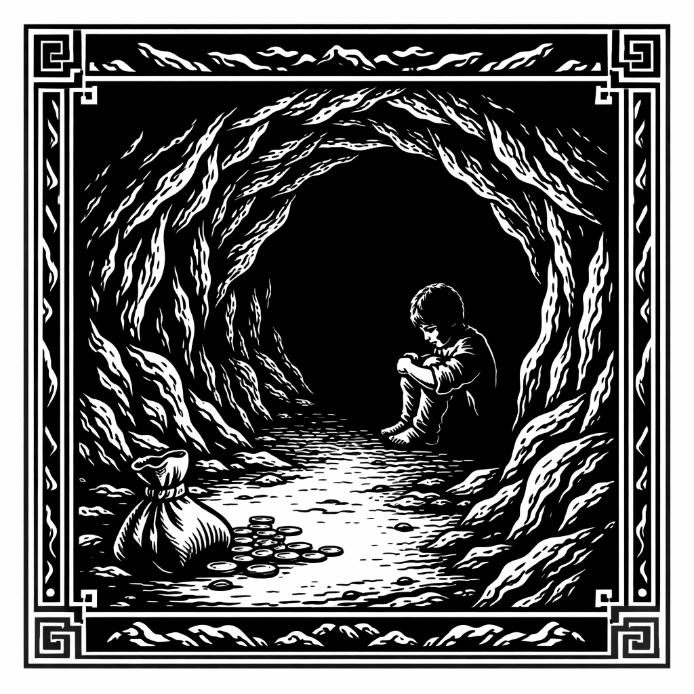{width=80%}


```{=latex}
\end{center}
\vspace*{\fill}
\newpage
```

# 5. Bölüm

Karamatlar köyü'mün ağası Molla Mehmet'in mal varlığı her geçen gün artıyordu. Varlığının artması üretmeyi iyi bilmesinin yanı sıra pazarlamayı da iyi bilmesiydi. Davardan elde ettikleri sütle keçi peyniri yapıyor, bu peynirleri ta Bursa pazarına kadar götürerek pazarlıyordu.

Milletin çoğu yiyecek ekmek için buğday bulamayıp, arpa unundan ekmek yaparken onlar davarı yazın tarlalarda yatırarak gübreledikleri için buğdaylar adam boyuna ulaşıyor, harmanda hasat edilen buğdayları koyacak ambar bulamıyorlardı. Taraklı, kendi nahiyeleri Gölpazarı'na göre daha yakındı, hem de Taraklı'da alış, veriş çok daha hareketliydi. Molla Mehmet buğdaylarını Taraklı'daki fırınlara satıyor, fırınlar verecek peşin para bulamadıklarından, buğdayları öğütüp, un haline getiriyor, bu unlardan yaptıkları ekmekleri satıyor, ondan sonra buğdayların parasını ödüyorlardı. Her yıl satış yaşına gelen erkeçleri, damızlık dışı kalan dişi keçileri Geyve ve Adapazarı pazarlarına götürerek satıyorlardı.

Davar demek, çok şey demekti. Kara Keçi çok kanaatkâr hayvandı. Bütün yılı bir avuç bile ek yem vermeden çıkarırdı. Yazın yiyecek boldu ama kışın daha zordu yiyecek bulmak. Yazın yüzüne bile bakmadıkları yeşil çam pürçüklerini kışın başka yiyecek bulamayınca keçiler iştahla yerlerdi. Kışın zayıflayan keçiler bahar gelip, doğa yeşerdikten sonra iyice semirir, kiloları neredeyse iki katına çıkardı.

Davar aynı zamanda da gübre demekti. Yazın sıcak günlerinde geceleri ekilecek tarlalarda yatırılan davar tarlayı gübreler, ekilecek buğday, arpa, yulaf ve ızanın verimini kat kat arttırırdı. Beş yüz baştan fazla kara keçiden oluşan davar sürüsü yaz boyunca Yahyalar'ın ekilecek tüm tarlalarını gübreliyordu. Fazla keçi demek daha fazla gübrelenen tarla demek, iyi gübrelenen tarla demek, daha fazla tarlalardan verim almak demekti.

Bu yazın tarlalarda yatarken ilginç olaylar da olmuyor değildi. Bir gün çobanlardan birinin anası hastalanmıştı, diğer çobana da İsa,

— Haydi sen de evine git bu gece bre, ben bu akşam tek başıma davarın yanında yatarım.

İsa aga'nın uykusu biraz derindi. Kendisi de uykusunun derin olduğunu bildiğinden gece uyumadan önce cebindeki ipin bir ucunu kendi bacağına diğer ucunu güçlü kuvvetli bir tekenin bacağına bağlayarak yorganı çekti kafasına. Gece davar kalkıp, bir tarafa gidecek olursa teke gitmek isteyeceğinden bağlı ipi çekecek, o da uyanacaktı.

Sabahleyin hava aydınlandığında gerinerek uyandı İsa aga. Bacağına, bir de ipin diğer ucu bağlı olan tekeye baktı. İp ayağına bağlı, teke de yanında yatıyordu. Bir daha baktığında gözleri fal taşı gibi açıldı. Bir kendisi, bir de teke vardı. Davardan ne tek keçi, ne de beş köpekten biri vardı. Aceleyle bacağındaki ipi çözerek koşmak isteyince tekeyle birlikte üst üste yuvarlandılar. Aceleyle ipi çözdüğünü zannetse de ipin her iki ucu hâlâ bağlıydı. Bir taraftan gülerken, bir taraftan da tekenin ayağındaki ipi çözerken kendi kendine söylendi.

— Bre koca kafalı İsa, keçinin bacağındaki ipi çözmeden nereye gidersin. İnşallah canavarlar keçileri parçalamamışlardır.

Tekeye bakarak,

— Bre koca boynuzlu teke, başka zaman olsa yerinde durmaz, başka keçileri de rahatsız edersin. Anlayamadım bana kıyamadın mı, yoksa çekiştirdin de ben mi duymadım, anlayan varsa beri gelsin vallaha.

Onların oralarda kurtlara canavar denilirdi. Epey koştuktan sonra davarın dul bir koca karının tarlasına dağılarak tarlada kelle çıkarmış olan buğdayları iştahla yediklerini görünce eyvah diyerek fesini dizine çarptı. Hemen davarı tarladan çıkardı ama tarlada zarar büyüktü. Davar kellelerin neredeyse yarısını yemişti.

Çobanlar gelince davarı onlara teslim ederek köyün yolunu tuttu. Çobanlar da o gece olmadıklarından kendilerini suçlu hissetmişti. İsa aga köye doğru gidiyor ama ayakları geri geri gidiyordu. Bre Molla Mehmet babama ne diyeceğim ben, bir davarın hakkından gelemedin mi dese adam haklı. Hele hele tekeyi bacağıma bağladığımı, tarlada bir tekeyle ben kaldığımı anlatmayayım, ev halkının diline pelesenk olurum vallaha diye düşündü.

Köye geldiğinde ev halkının sabah çorbasını içtiğini görünce selam verdikten sonra o da sokuldu yer sofrasına. Çorba içildikten sonra Molla Mehmet,

— İsa sen bu gün akşama gelecektin eve, hayırdır bir şey mi oldu?

İsa başına gelenleri bir bir anlattı. O anlatırken karısı Çakır Emine ile kardeşi Hüseyin birbirlerine bakarak kıs kıs gülüyorlardı.

Molla Mehmet,

— İsa hangi koca karının tarlasına girmiş davar?

— Bre baba hani şu karşı komşu Hanife yenge yok mu onun tarlası.

Fatma ana,

— Üzülme İsa, gelen mala gelsin, cana gelmesin, çaresi bulunur.

— Mehmet ağa ben bir yol gideyim de Fadime kadınla konuşayım.

Fatma ana örtmesini örterek Hanife kadının evinde aldı soluğu. Hanife kadın hemen karşılarındaki evde oturuyordu. Eve varınca tahta giriş kapısına elindeki değnekle vurarak,

— Hu kız Hanife evde misin?

— Gel, gel Fatma yenge, evdeyim ya, nerede olacağım?

Fatma ana altına sürülen minderin üzerine oturduktan sonra konuşmaya başladı.

— Hanife bacım bizim İsa bu gece davarın yanında yatarken uyuya kalmış, davar gidip senin buğday tarlasına girmiş, epey de zarar vermiş galiba.

— Vah vah ne yaparız Fatma yenge bir orası, bir parça daha, bu kış aç kaldık desene.

— Fadime bacım niye aç kalasın, ne zarar verdiyse davar, o zararı biz karşılarız, zaten ben de onu söylemeye geldim sana.

Hanife kadının tarlası iki dönümdü. Fatma ana Hanife kadına hasatta iki dönümden ne kadar buğday beklediğini sordu. Hanife kadının söylediği miktarı hasatta vereceklerini, kalan kelleleri de yine Hanife kadının toplamasını söyleyince Hanife kadın pek sevindi.

— Fatma yenge senden Allah razı olsun, neredeyse davar iyi ki tarlaya girmiş diyeceğim.

Fatma kadın yanında getirdiği iki fasla keçi peynirini de bırakarak oradan ayrıldı.

Dış kapıdan çıkarken geri dönerek,

— Hanife bacım komşu komşunun külüne muhtaçmış, başka bir ihtiyacın olursa çekinme, bizde varsa paylaşırız.

— Sağ ol Fatma yenge söylerim, Allah razı olsun zaten Molla Mehmet ağam kollayıp, gözetliyor zaten.

Molla Mehmet özellikle köy halkının ihtiyaçlarını da gözlerine sokmadan karşılıyordu. Özellikle evde erkeği kalmamış dul kadınların pazara ısmarladıkları kil, sabun, gaz yağı, kibrit gibi ihtiyaçlarını alıveriyor, aldıklarının parasını bazen hiç almıyor, bazen de yarısını alıyordu.

Davar köye girerken önünü çevirmeye çıkan çocukların eline Molla Mehmet'in eşi Fatma ana birer fasla peynir tutuşturuyordu. Oralarda büyük peynir dilimlerine fasla deniliyordu. Kuşluk vakti davar sağılmak için geldiğinde önce davar ağıla konuluyor, sonra ağıldan tek tek çıkarılan sağmal keçiler kadınlar tarafından kova bakırlarına sağılıyordu. Sağılan keçiler ağıla geri sokulmuyor, bu keçiler hangi evin önünde bir gölgelik yer bulurlarsa gidip, oraya yatıyorlardı.

Köyde ipek böceği yetiştiriciliği yapıldığından her evin önünde dut ağaçları vardı. Evlerin önünde gölgelerde yatan keçiler geviş getirdikçe yeniden memelerine süt iniyordu. Ev sahibi kadınlar kapılarının önündeki bu keçileri yeniden sağarak bu sütlerden ihtiyaçları için yoğurt ve peynir yapıyorlardı. Yahyalar bu durumu biliyorlar, komşuları keçileri yeniden sağsınlar diye özellikle sağmal keçileri yeniden ağıla koymuyor, köyün içerisine salıyorlardı.

Bazen bu sütlerden yaptıkları peynirlerden ihtiyaçlarından fazlasını pazarda satanlar bile vardı.

Her kurban bayramı yaklaştıkça diğer köylüler kurban almak için Yahyalar'a gelirler, Molla Mehmet gelenlerle sıkı bir pazarlığa otururdu. Kollar sallanılır, sonunda anlaşılan fiyata hayırlaşılırdı. Kimse bu kurbanların paralarını ödeyemez ama bir yıl sonraki kurban bayramı öncesi aynı pazarlıklar yine yapılırdı. Bu yıllarca böyle sürdü, gitti. Bir gün Molla Mehmet'in eşi Fatma ana,

— Behey adam, kurbanlık paralarını ödeyen yok, ödeyecek olsalar da sen almazsın. Neden her kurban bayramı öncesi dul kadınlarla bile kurbanlık pazarlığı yaparsın?

— Hanım şimdi ben pazarlık yapınca onlar da parasıyla alıyorlarmış gibi her yıl gerine gerine geliyorlar. Onlar da ödeyemeyeceklerini biliyorlar ama olsun. Eğer ben onlara para istemez, kurbanlıklarınız benden desem bazıları gurur yapar, ya da her yıl, her yıl utanırlar, kurbanlık isteyemezler. Şimdi pazarlıklarını yapınca göğüslerini gere gere geliyorlar. Hali hoş olsun. Hem yardım etmek istiyorum, hem de bana minnet duymalarını istemiyorum.

— E adam benim aklım buna ermez, demek ki kolay Molla Mehmet olunmuyor.

Molla Mehmet hissettirmeden elinden geldiğince köylünün yükünün hafiflemesine katkı sağlamaya çalışıyordu.

O yıllarda muhtar, hoca, korucu ücretlerini köylü buğday hesabıyla kendileri ödüyorlardı. Her yıl her hane muhtara birer kile, hocaya birer kile, korucuya 2'şer şinik buğday verirlerdi. Hububatların ölçü birimi kileydi. Dört kabak, bir şinik; dört şinikte bir kile sayılırdı. Bir şinik 8 kilogram, bir kilede 32 kilogram buğday demekti.

Savaşlar nedeniyle erkek nüfus iyice azalmış, bu nedenle tarlalar iyi işlenemediğinden toprakların verimi iyice düşmeye başlamıştı. Köylüler bu hakları ödeyememeye başlayınca önce arazileri bekleyen korucu tutmaktan vazgeçtiler. Daha sonra da hoca ve muhtar haklarını ödemekte zorlanmaya başladılar. Bunun üzerine epey dini eğitim almış olan Molla Mehmet, bu eğitiminden dolayı molla deniliyordu zaten, köyün hocalığını ücretsiz yapmaya başladı. Köylüler artık sadece muhtarın hakkı yılda bir kile olarak ödemeye başladılar. Hoca ücretinden de kurtulan köylüler epey rahatladılar.

O yıllarda çift öküzlerin çektiği kara sabanlarla sürülürdü. Tarlalar 3'e bölünür; bir bölüm keleme, bir bölüm nadasa bırakılır, bir bölümde ekilirdi. Yani her yıl arazinin sadece üçte biri ekilirdi. Tarlalar dinlendirilmeden her yıl üst üste ekilmeye kalkılırsa verim çok düşerdi. Yahyalar tarlalarını gübrelediklerinden tarlaları kelemeye bırakmıyor; bir yıl nadas, bir yıl ekin ekiyorlardı. Bu nedenle başkalarına göre tarlaların üçte biri yerine, yarısını ekebiliyorlardı.

Molla Mehmet'in oğlu Hüseyin ile kardeşi Yakup'un oğlu Hasan ikisi de aynı yaştaydılar, ikisi de 11-12'şer yaşlarına gelmişler, delikanlılığa ilk adımlarını atmaya başlamışlardı. Hüseyin açık tenli, ablası Çakır Emine gibi çakır, çakmak çakmak gözlü, uzun boylu, yakışıklı, sert mizaçlı bir çocuktu. Hasan ise esmer tenli, kısa boylu, yumuşak huylu bir çocuktu. Daha o yaşlarda Hüseyin'e Koca Hüseyin demeye başlamışlardı. Tam o zamanlarda Yunan kuvvetleri Bilecik'i de işgal ettiklerinden top sesleri Karamatlar'a kadar ulaşır olmuştu. Yunan kuvvetleri Ankara'ya ulaşıp yeni kurulan Türkiye Büyük Millet Meclisi'ni kapatmak ve kurucu kadro Mustafa Kemal ve yönetici kadroyu yok etmek için Sakarya nehrini kuzeyinde bırakarak kendine sınır çizmiş, Sakarya'nın kuzeyine geçmeden, doğuya doğru Ankara'ya doğru ilerlemeye başlamıştı.

İşgal altındaki Bilecik Vilayeti'nin evrakları güvenlik açısından Geyve'ye taşınmış, yönetim kadrosu da yakınlığı nedeniyle tüm kadro olarak Gölpazarı'na taşınmıştı. Bilecik Vilayeti Gölpazarı'ndan idare ediliyordu. Gerektiğinde Gemici köyünden sallarla karşıya geçiliyor, gerektiğinde de geri dönülüyordu.

Yazın Sakarya Nehri'nden, özellikle iyice geniş aktığı yerlerden karşıdan karşıya geçmek daha kolay olsa da, bahar ve kış günlerinde nehrin debisi iyice artıyor, karşıdan karşıya geçmek sallar hariç olanaksız hale geliyordu. Salla karşıya geçmek te ustalık işiydi.

Sakarya'nın güney tarafındaki Deresakarı ve Selbükü, diğer kıyıda Gölpazarı tarafında Gemici ve Demirhanlar köylerinde yaşayan köydeki ihtiyarlardan birçoğu çok iyi sal idare etmesini biliyorlardı. Sallar nehir kıyısındaki korunaklı yerlere gizleniyor, kuvvacıların Yunan takibinden kurtulabilmeleri için kuvvacılar sallarla hemen Gölpazarı tarafına geçiriliyorlardı. Bazı Kuvâ-yi Milliye birlikleri karşıya geçerek Yunan kuvvetlerine vurkaç taktiğinde saldırıyor, sonra da Sakarya'dan Gölpazarı tarafına geçiyorlardı. Komuta kademesinden cepheyi genişletmemek için Sakarya Nehri'nin kuzeyine geçmeme talimatı alan Yunan kuvvetleri, Kuvâ-yi Milliye milisleri Sakarya Nehri'ni geçince takibi bırakıyorlardı. Kuvâ-yi Milliye milisleri sıkıştıkları zaman karşıya geçirmek için nehir kenarında söğütlerin dibine gizlenen sallar başlarında sallı kullanacak bir kişiyle birlikte hazır bekletiliyordu.

Gölpazarı'nın Şahinler köyünden olan Bilecik Müftüsü Mehmet Nuri Bey Yunan Kuvvetleri Bilecik'i işgal etmek için Pelitözü köyüne ulaştıklarını duyunca Deresakarı köyüne taşınmıştı. Mehmet Nuri Bey hem müftülük, hem de istihbarat komutanlığı yapıyordu. Bölgede büyüdüğü için dağları, geçiş yollarını, Sakarya Nehri'nin derin ve sığ yerlerini çok iyi biliyordu.

Sallarla karşıya kuvvacı kaçırma faaliyetlerini de Müftü Mehmet Nuri Bey yönetiyordu. Hangi sal nerede gizlenecek, başında kim nöbet tutacak müftü bey belirliyordu. Mehmet Nuri Bey'in görevlendirdiği adamlar gizlilik içerisinde nehir boyunda gezerek bu faaliyetlerin kontrolünü sağlıyordu. Vilayet Kurulu'nda karar alınacağı günler toplantılara katılmak üzere Gölpazarı'na gidiyor, diğer günler Deresakarı köyüne dönerek düşmanı takip ediyordu.

Bir taraftan da asker kaçaklarını ikna ederek ordu birliklerine katılmalarını sağlıyordu. Köyleri dolaşıyor, köyde bulamadıklarının dağlardaki yerlerini öğrendikten sonra onları da dağlarda ziyaret ediyor, vatan sevgisini, şehit ya da gazi olmanın faziletlerini anlatıyor, ikna ettiği kaçakları bir iki gün korunaklı bir yerde misafir ettikten sonra güvendiği bir adamına emanet ederek en yakındaki Türk birliğinin olduğu yere gönderiyordu.

Bazı ilginç olaylar da olmuyor değildi. Kendi köyü Şahinler'den olan bir asker kaçağı gencin her defasında köyde olduğunu görüyor, ikna ederek gönderiyor, yolda vazgeçen kaçak yeniden bir fırsatını bulup, geri kaçıyordu. Müftü Nuri Bey ne ikna etmekten vazgeçiyor, ne de niye geri kaçtın diye başkasının yanında gururunu kırıyordu. O asker kaçağı genç 3 defa geri kaçmış, sonunda dördüncüde giderek birliğe katılmıştı. Müftü Mehmet Nuri Efendi gecesini gündüzüne katarak memleketin kurtuluşu için inandığı Ankara Hükümeti'ne yardım edebilmek için gecesini gündüzüne katıyordu.

Mustafa Kemal ve arkadaşlarının idam fermanını veren saray hükümeti ve şeyhülislamlık kararlarının aksine Ankara müftüsü ve bazı diğer il müftüleri gibi saray fetfasını reddetmiş, Ankara hükümetinin yanında yer almıştı.

Müftü Mehmet Nuri Efendi gündüzleri köy köy dolaşarak halkın moralini yüksek tutmaya, halkın Ankara Hükümeti'nin yanında olmasını sağlamaya çalışıyordu. Halkın zaman zaman kafası karışmıyor değildi. Saray Yunan kuvvetlerine direnilmemesi konusunda sürekli fetvalar, padişah fermanları yayınlıyor, bu bildirileri İngiliz uçakları yerleşim yerlerine havadan atıyordu. Bu uçaklardan biri bu bildirileri alçaktan uçarak atarken yerden ateş eden Türk milis güçlerince düşürülmüştü.

Bazı yerleşik Rum gençlerinin oluşturdukları çeteler de Yunan komutanların adını kullanarak halktan haraç istiyordu. İşgal edilen Bilecik halkının büyük çoğu işgal edilmeyen bölgelere kaçıyordu. Deresakarı, Selbükü, Demirhanlar, Gemici ve Şahinler gibi köylerde hısım ve akrabalarının yanlarına sığınmışlardı. Yunan kuvvetleri Deresakarı köyü Ehmedek Tepesi'ne yerleşmişler, orayı karargah haline getirmişlerdi. Müftü sabah namazından hemen sonra hava aydınlanırken dağdaki kestirme yoldan Ehmedek Tepesi'ne çıkıyor, düşmanın faaliyetlerini izliyordu. Yunan kuvvetlerinin gücü, silah varlığı, moral durumu, hareket yönü gibi konularda askeri komutanlığa hazırladığı raporları aktarıyordu. İnönü, Bozüyük bölgesinde olan Batı Cephesi Komutanı İsmet Paşa'nın karargahıyla direkt irtibat halindeydi. Vurkaç savaşı yapan Kuvâ-yi Milliye güçlerinin organizasyonu, sevkleri konusunda da aktif görev alıyordu.

Müftü Mehmet Nuri Efendi'nin bu faaliyetleri aylarca sürdü. Düşman ani baskınlarda büyük kayıplar verir olmuştu. Mehmet Nuri Efendi bir sabah yine yanına aldığı bir adamıyla birlikte istihbarat toplamak üzere Ehmedek Tepesi'ne çıkmıştı. Hızlı çıktığından soluk soluğa kalmıştı. Boynundaki dürbünle karşıdaki Yunan birliklerini izliyordu. Tam o sırada bir Yunan takımı etrafını sardı. Mehmet Nuri Efendi tabancasına davransa da gelen birlik kalabalıktı ve önceden tertibat aldığı belliydi. Yunan birlikleri Müftü Mehmet Nuri Efendi'yi çapraz ateşe tutarak şehit ettiler. Müftü şehit edilirken yanındaki adamına bir mermi bile isabet etmedi. Yunan komutan, müftü silahlıydı, silah çekmeye davrandı ondan vurduk, öteki adam silahsızdı ona, ondan ateş etmedik dese de; halk arasında şu görüş hâkim oldu. Müftünün yanındaki adam Yunan kuvvetlerinin muhbiriydi. Müftünün o sabah yine Ehmedek Tepesi'ne çıkacağını haber verdi. Bu nedenle Yunan kuvvetleri pusu kurarak müftüyü şehit ettiler. Yanındaki adam Yunan kuvvetlerinin muhbiri olduğu için Yunanlılar muhbirlerini korudular.

Bölge halkı müftü Mehmet Nuri Efendi'yi çok seviyor, genç yaşına rağmen saygı duyuyorlardı. Mehmet Nuri Efendi'nin şehit edilmesi halk arasında büyük infial oluşturdu. Evlerde Kur'anlar okutuldu, gözyaşları döküldü. Kimin yaktığı belli olmayan Mehmet Nuri Efendi adına içli bir ağıt yakıldı. Bu ağıt dilden dile, köyden köye Sakarya Nehri'nin her iki kıyısındaki köylerde yayıldı. Özellikle kadınlar bir araya geldiklerinde bu ağıdı gözyaşları içerisinde söyler oldular.

Mehmet Nuri Efendi'nin şehadetinden sonra halk arasında kısa süreli bir moral bozukluğu oluşsa da, daha sonra yakılan ağıt söylene söylene bölge halkının manevi gücü arttı, yaşlılar, kadınlar, çocuklar vızır vızır Türk birliklerine malzeme ve yiyecek taşıdılar. Mehmet Nuri Efendi'nin şehit edilmesinden sonra ilk zamanlar Türk birliklerinin, Yunan kuvvetlerinin bölgedeki durumu ile ilgili istihbarat sorunu yaşansa da, daha sonra zor şartlara alışık, çok iyi yetişmiş bir subay kadrosu olduğundan yeniden bir organizasyon yapılarak, yeni bir istihbarat ağı oluşturuldu. Yunan kuvvetleri de boş durmuyor, karargah kurdukları köylerde ya gönüllü, ya rüşvet vererek, ya da tehditle kendilerine kolayca muhbir bulabiliyorlardı. Bunda İngiliz uçaklarının Yunan kuvvetlerinin halife ordusu olduğu, halkın yanında, halka yardımcı olduğu yanıltıcı bilgileri içeren bildiri kâğıtları da etkili oluyordu. Kim Ankara Hükümeti ordusuna haber taşıyor, kimin iyi atı var, kimin güzel kızı var, kimin parası çok bu muhbirlerden bilgi alıyorlardı.

Yunan kuvvetleri ilk karargahlarını Yenişehir tarafındaki İlyasça köyüne kurmuşlardı. Daha sonra karargahı Bilecik'e taşıdıklarında, yine de orada askeri bir birlik bırakmışlardı. Bu birlik tüm ihtiyaçlarını köylülerden haraç alarak karşılamaya çalışıyorlardı. Cumalı, Beyce, Taşçılar, Gökpınar, Çukurören gibi köylerin halkı Yunan kuvvetlerinden uzak durmak için gündüzleri Vezirhan'a iniyorlar, geceleri tarlalarına gizlice gelerek, tarlalarındaki ekinleri biçiyorlar, sabah ezanı sırası biçtikleri ekinleri öküz arabalarına sararak yeniden Vezirhan'a iniyorlardı. Vezirhan'a inmelerinin sebebi sıkıştıklarında hemen Sakarya'nın Gölpazarı tarafına geçebilecek olmalarıydı. Biliyorlardı, Yunan'ın hedefi Ankara, bu nedenle Sakarya'nın kuzeyine geçmez.

Bir gün Taşçılar köyünden Ali amca diye anılan yaşlı biri cephede düşmanla çarpışan oğlu Hasan'ın eşi Fatma ve torunu 14 yaşındaki Zeynep'le birlikte gece Vezirhan'dan koştukları öküz arabasıyla birlikte tarlalarındaki ekinleri gizlice biçmeye gelmişlerdi. Biçtikleri ekinleri öküz arabasına sardılar, artık Vezirhan'a inmeye çalışıyorlardı. Ali dedenin biraz tamahkârlığı tutmuştu galiba. Birazcık daha, birazcık daha derken neredeyse hava ağarmaya başlamıştı. Yunan kuvvetleri sabahtan akşama kadar arazilerde dolaşıyor, yakaladıkları mahsule el koyuyorlardı. Arabanın urganlarını iyice sıkan Ali amca,

— Gelin siz eylenmeyin, öküzlere deh deyin. Ben sıkıştım, tuvaletimi yapar ardınızdan yetişirim.

Fatma kadın öküzlerin önüne geçerek, öküzleri çekmeye başladı. Zeynep'te arkadan elindeki değnekle öküzlere hafif hafif vurarak daha hızlı gitmelerini sağlamaya çalışıyordu. Çamlıkların arasında telaşla ilerlemeye çalışıyorlardı. Anası birden Zeynep'in tiz çığlığını duyunca telaşla arkasına baktı. Bir Yunan askeri Zeynep'i kucaklamış, sırıtıyordu. Biraz ötede yerde oturan biri de onları seyrediyordu. Yunan askeri kızı öpmeye, orasını burasını ellemeye çalışıyordu. Öbür asker de mavzerini arkadaşının mavzerinin yanına bırakmış, o da sırıtarak onların yanına gidiyordu. Fatma kadın yerden aldığı taşları hırsla fırlatıyordu. Zeynep'in baş örtüsü yere düşmüş, işliği yırtılmıştı. Fatma kadını yakalayan diğer Yunanlı onu yere çaldı. Fatma kadın yere ah anam diye yuvarlandı. Yunan askeri sırıtarak üzerine doğru geliyordu. Fatma kadın yerden kaptığı taşı Yunan askerine fırlattı. Taş Yunan askerinin alnında şaklayınca Yunan askeri kanlar içerisinde homurdanarak acı içerisinde yere çöktü.

Tam o sırada nereden çıktığı anlaşılamayan Ali Amca torununa musallat olan Yunan askerinin boynuna elindeki ekin biçtiği orağı hızla indirdi. Boynu neredeyse tamamen kopan Yunan askeri kanlar içerisinde yere yığıldı. O sırada Fatma kadın yerde duran Yunan askerlerinin mavzerlerini kapmıştı. Kafasına taşı yiyen Yunan askeri arkadaşını kanlar içerisinde yerde yatarken görünce büyük bir korkuya kapıldı. Mavzerleri de Fatma kadının elinde görünce geriye doğru hızla kaçarak gözden kayboldu. Ali amca öküzleri boyunduruktan boşandırarak seslendi,

— Haydi kızım, öküzleri koşturun. Mavzerlerin birini bana ver. Bu askeri kaçırmasaydık iyiydi. Şimdi o birliğine haber iletir, bir sürü asker yığılır buraya. Onlar gelmeden biz Vezirhan'a inelim.

Telaşla öküzler önde, onlar arkalarında düşe kalka Vezirhan'a doğru patika yoldan koştular. Ali amca sağ elinin işaret parmağı mavzerin tetiğinde arasıra geri bakarak onların beş metre kadar arkalarından koşuyordu.

Hanın önünde sırtında iki mavzerle telaşla etrafına bakan Ali Amca'yı gören Taşçılar muhtarı,

— Ali amca bu ne hal? Siz gelmeyince meraklandık, nerede kaldınız, öküz arabası nerede, ne işi var bu mavzerlerin sende?

— Sorma muhtar başımıza gelenleri, vakit geçirecek zaman değil. Bir komutan bulalım, orada anlatırım.

Kuvâ-yi Milliye milislerini organize eden yüzbaşıyı buldular. Yüzbaşı anlatılanları dinleyince,

— Belki ardınızdan buraya kadar bile gelirler, sizi vakit geçirmeden Gölpazarı tarafına geçirelim.

Hemen bir sal ayarladılar, Ali amca, Fatma kadın ve Zeynep, salla Sakarya'nın karşısına geçirilerek Üyük köyüne birilerinin yanına misafir edildiler.

Onlar saldayken muhtar bağırıyordu,

— Ali amca siz meraklanmayın, öküzleriniz bana emanet. Kalan ekinler için de kaygılanmayın. Evelallah biz köylücek kendilerimizinkilerin yanı sıra, sizin kalan ekinleri de Vezirhan'a indiririz.

Ali amca derin bir iç geçirerek saldan önce Vezirhan'a, ardından da ardında köyünün olduğu tepelere doğru uzun uzun baktı. Daha sonra kafasındaki fesini çıkartarak muhtara doğru salladı. Zeynep annesine sokulmuş, hıçkıra hıçkıra ağlıyordu. Zeynep yaşadığı korkuyu hâlâ üzerinden atamamıştı. Ya dedesi yetişemese ne olurdu sonu, o Yunan askerleri tecavüz ederlerdi ona. Ali amca torununa bakarak,

— Ağlama güzel torunum ağlama, bu günlerde geçer elbet. Bu ülke ne badireler atlattı, bu badireyi de atlatır. Çanakkale'de yedi düveli yenen bu millet, o yedi düvelin tetikçiliğini yapan Yunanlıları da söker atar bu topraklardan.

— Hem sen şehit kızısın, hem de gazisin. Bak anan, sen, ben bir birlik yaptık devirdik bir düşmanı. Siz yine döner gönül rahatlığıyla köyümüzde tarlalarımızı işlersiniz de, o gelecek güzel günlere benim ömrüm yetermi, bilmem.

— Öyle deme dedem, seni rabbim eksik etmesin başımızdan. Sen olmasan biz bir dul kadın, bir kız tek başımıza ne ederiz.

Ali amcalar sağ salim Üyük köyündeki misafir edilecekleri eve ulaştılar. Ev sahipleri onları büyük bir sevgi ve muhabbetle karşıladılar.

Gölpazarı tarafında Yunan askeri yoktu ama buralarda da çeteler aman vermiyordu. Askerler savaşmak üzere sevkedildiklerinden iç güvenliği sağlamak için çok az jandarma bırakılmıştı. Gölpazarı'nda da adı bölük olan 30 kadar mevcudu olan bir jandarma takımı bırakılmıştı. Bu jandarmalardan her gün onar kişilik iki manga ayrı yönlere eşkıya takibine çıkıyorlardı. Karamatlar yönüne takibe çıkan jandarmalar geceleri Molla Mehmet'in evinde konaklıyorlardı. Bu askerlerin yemelerini, içmelerini de Molla Mehmet karşılıyordu. Bazen jandarmaların on günden fazla Molla Mehmet'in evinde kaldıkları oluyordu.

Fakir millet canını dişine takarak düşmanla mücadele etmeye çalışırken diğer çeteler gibi Kara Durası da gününü gün ediyordu. Her geçen gün palazlanıyor, her geçen gün gücü artıyor, çevreye sardığı korku ağızdan ağıza bire on katılarak anlatılıyor, kötü, acımasız namı Taraklı, Geyve, Göynük köylerinde yayılıyordu.

Kendini takibe gelen jandarmaları evinde yatıran, onlara bakan Molla Mehmet'e diş biliyor, ona zarar vermek için planlar yapıyordu. Kendisi ile ilgili anlatılanları, muhbirleri ona biraz da abartarak anlatıyorlar, Kara Durası'nın da egosu artıyor, şişim şişim şişiyor, halkın üzerinde iyice baskı kurmaya çalışıyordu. Köyde çobanken onu kale almayan, var mı, yok mu, onun varlığından bile neredeyse haberi olmayan köylüler şimdilerde adını duyunca korkar olmuşlardı. Köydeki kim olduğu bir türlü öğrenilemeyen muhbiri köye jandarmalar geldiğinde Kara Durası'na haber uçuruyor, jandarmalar köydeyken Kara Durası jandarmaların görev alanlarının dışında kalan Taraklı ve Göynük köylerine geçiyordu.

Jandarmalar da sanki iş yerini bulsun diye görev yapar gibiydiler. Anlaşılan şimdilik bu çeteler baskı altında tutulmaya çalışılıyor, halka verdikleri zarar en aza indirilmeye çalışılıyor, onlarla esas mücadele Kurtuluş Savaşı'nın sonuna bırakılıyor gibiydi.

Kara Durası her takipten kolayca sıyrılınca kendine güveni iyice artmıştı. Çetesindeki adam sayısı 4-10 arasında değişiyordu artık. Çeteye giren ve çıkanlar oluyor ama Kürt Memo hiç değişmiyor, sağ kolu olarak hep yanında oluyordu. Çetenin diğer elemanları bir sorunları olunca direkt Kara Durası'na söyleyemiyor, dertlerini önce iletmesi için Kürt Memo'ya iletiyorlardı.

Eşkıya başı Kara Durası yanındaki adamlarına acımasız ve sert davranıyordu. En ufak hatalarında koca koca adamları tokatlıyordu. Bir defasında bir gece ondan izinsiz ayrılan bir çeteciyi sabahleyin geldiğinde hiçbir şey demeden bir kayanın önüne dikiltmiş, kafasının üzerine de bir elma yerleştirmişti. Adamın karşısına geçerek 25 metre kadar uzaklaşarak tabancasını belinden çıkardı ve adamın kafasındaki elmaya nişan aldı.

— Ulen dua et elmayı vurayım, vururum ya, elim melim titrer maazallah, kurşun bir bakmışsın alnının ortasında.

Adam kayaya yaslanmış soğuk terler döküyor, ağzını açıp, sesini çıkaramıyordu. Diğer adamlar da olacakları endişe ve merakla izliyorlardı. İçlerinden biri sadece merak ediyor, endişe etmiyordu, o da Kürt Memo'ydu. Memo bilirdi, Durası bu mesafeden değil elmayı, meteliği bile ortasından vururdu.

Kara Durası hiç kimsenin beklemediği bir anda silahını bir el ateşledi. Adamın kafasındaki elma ortadan ikiye yarılarak yere düştü. Adam korkudan altını ıslatmıştı. Çete ağlayarak yere çöktü, o akşam çete yemek yemedi. Sabahleyin kalktıklarında o çete yoktu. Atını da bırakarak kaçmıştı. Kara Durası o adamı hiç sormadı bile, kaçacağını tahmin ediyor gibiydi. Adam sırra kadem bastı, bir daha adamı oralarda gören bile olmadı.

Eşkıya başı Kara Durası hem çevredeki halka, hem de yanındaki adamlarına karşı hep acımasızlığıyla anıldı. Bunun dışında kalan iki kişi oldu. Biri karım dediği Şaziye, diğeri hem en güvendiği, hem de ilk adamı olan Kürt Memo.

Sık sık Karamatlar köyünün ortasından adamlarıyla birlikte atlarıyla tozu dumana katarak geçiyor, bazı geceler köyün etrafına gelerek havaya ateş ediyor, köylüleri korkutuyor, köylüleri baskı altında tutuyordu. Bazı köye gelişlerinde adamlarının en önünde cins doru atının dizginlerini çekerek atını durduruyor ve atının üzengileri üzerinde ayağa kalkarak hem ateş ediyor, hem de avazı çıktığı kadar bağırıyordu.

— Ulen molla deyusu, Molla Mehmet misin, nesin, ben dağda olduğum müddetçe sana rahat uyku yok. Sana jandarmaya yataklık yapmak, jandarma beslemek neymiş göstereceğim. Senin ananı belleyecek, evini başına yıkacağım. O evde yıkıntıların altında kalırsa üzüleceğim tek kişi var, o da İsa aga. İsa aga len sen de bu devlet işbirlikçisinden başka damat olacak birini bulamadın mı?

İsa aga duramadı, sindiği yerden bağırdı.

— Bre Durası, Kara Durası, sana kardaşım dedim, ananın naaşını mezara senle birlikte indirdim. Sen evimi yıkmaktan bahsedersin. İyi belle Molla Mehmet benim kayın babam değil, öz ve has babamdır.

— Len İsa aga karışmam vallaha, ben onun canını almaya karar verdiğimde yakınında olursan geçmiş meçmiş dinlemem alnının ortasına yapıştırırım kurşunu. Ha o deyusu öyle kolay öldürmeyeceğim. Önce iliğini, kemiğini sömüreceğim ondan sonra ne zaman keyfim isterse o zaman geberteceğim. Ha ne jandarmaya, ne de efelere güvensin, benim hepsine yetecek kurşunum var evelallah.

Kara Durası adamlarına dönerek,

— Hadin len geçerken şu deyusun sayasından terkinize bir erkeç atın, çobanların yanında ne kadar ekmek, peynir varsa onları da alın. Hak ettiniz hem güzelce karnımızı doyuralım, hem de biraz çakır keyf olalım. Len Memo şarabımız var mı?

— Olmaz mı ağam, hem şarabımız, hem de rakımız var.

Önde Durası ardında adamları atlarını dörtnala kaldırarak, nal şakırtıları eşliğinde köyü terk ettiler.

Kara Durası baskına giderken, ya da başka zamanlarda kalabalık gitmeyi seviyor, etraf köylerdeki acımasız eşkıya adının iyice yerleşmesini istiyordu. Şaziye'sine gitmeden bir haftadan fazla duramıyordu. En geç haftada bir gittiği Şaziye'nin yanına hep farklı günlerde gidiyordu. Giderken de yanına sadece Kürt Memo'yu alıyordu. Hangi gün gideceğini Şaziye bile bilmiyordu. Jandarma, ya da hasım çetelerin Şaziye'yi zorla konuşturmasından ve pusuya düşmekten korkuyordu.

Çok çeteyle dalaşmış, onlarla çekinmeden çatışmaya girmiş, hatta haraca bile bağlamıştı bazı çeteleri. Bazı küçük çeteler topladıkları haracın bir kısmını Kara Durası'na ağa haracı olarak vermek zorundaydılar. Kara Durası'na diş bileyen çok adam vardı dağda.

Kürt Memo geldikten sonra Kara Durası'nın gücüne güç katmıştı. Gerçi Kürt Memo gelmeden önce tek başına eşkıya, çete olmaya çalışan biriydi. Yıllarca cepheden cepheye koşarak düşmanla savaşan Kürt Memo temkinliliği, olaylar karşısında yerinde karar verebilmesiyle Kara Durası çetesinin sakin gücü, çeteye zarar getirebilecek kararların daha baştan engellenmesine çalışan biriydi. Kürt Memo çetenin diğer elemanlarına sık sık talim de yaptırıyordu. Adamlara pusu nasıl atılır, nasıl gizlenilir, olduğundan nasıl daha güçlü görünülür onları bir bir öğretiyordu. Acımasızlık, adam vurma, adam dövme, kadın dağa kaldırma gibi konuları da Kara Durası'ndan öğreniyorlardı.

Çete elemanlarının kıyafetleri birbirine uyumluydu. Çetede acımasız, sert bir disiplin vardı. Durası'nın ağzından çıkan kanun gibiydi. Kimse itiraz edemez, itiraz edecek olanın ağzından burnundan getirirdi Kara Durası. Bu acımasızlığa dayanamayan birçok çete üyesi geceleri kaçmış, bir daha izine rastlanmamıştı. Bu kaçan çete üyelerinin kiminin teslim olarak askere katıldıkları, kimilerinin de izlerini kaybettirerek uzak diyarlara sıvıştıkları biliniyordu. Bir gün çeteden kaçan bir eski adamını bir köyde gören Kara Durası bir kelime bile bir şey demeden köy meydanında bir kurşunla alnının ortasından vurmuş, ardından adamın cesedini atına çiynetmişti.

O güne kadar Karamatlar'da korku salmasının dışında bir eğlemi olmamıştı. Bunun sebebi Çalca Deresi'ndeki mağarasının köye çok yakın olmasıydı. Köylüler orada kaldığını bilseler de korkularından jandarmaya iletememişlerdi. Kara Durası bu mağaranın yanı sıra başka köylerde de uzun süreli kalabileceği yerler belirlemişti. Durum o hale gelmeye başlamıştı ki her görünen eşkıya Kara Durası ve çetesi sanılıyordu. Kara Durası, Kürt Memo'dan stratejik davranmayı, propaganda yapmasını, pusu atmasını, olduğundan fazla güçlü görünmesini öğrenmişti. Kürt Memo, Durası'nın hem en yakın adamı, hem de akıl hocası, hem de ardını toparlayan kişi olmuştu. Dünün kara kuru sessiz oğlanı, bugünün asan, kesen, döven, işkence yapan, çevreye korku salan, kadınların ırzına geçen acımasız biri olmuş, çıkmıştı. Bu Kürt Memo farklıydı. Bugüne kadar rahmetli anası ve Şaziye'sinden sonra bir de bu Memo'ya güvenir olmuştu Durası. Kara Durası dağda bir taşın üzerinde Kürt Memo ile yan yana oturmuş tütün sararlarken, Memo'ya ilk defa ne zaman tam güvendiği, onu Şaziye'sinin yanına nasıl götürdüğü aklına geldi.

Kara Durası, Kürt Memo yanına katıldıktan sonra bir gece,

— Len Memo hazırlan, yengeni özledim, canım çekti, yengene gideceğim, sen de gözcülük yaparsın.

— Tamam ağam, beş dakika sonra çıkarız yola. Atlara arpa torbalarını taktıydım, beş dakikada bitirirler.

— Len Memo az sabret, bir gün olur sana da buluruz bir karı.

— Sen iyisini bilirsin ağam. Bu Memo karı yüzü görmeyeli, on yıldan fazla oldu, ondan önce de gördüğü sanki neyse.

Kara Durası keyifli keyifli güldü. Kürt Memo'nun eğerleyerek hazırladığı atlara atlayıp önce Kuzlar'a, oradan da Dereli'ye doğru at sürdüler. Her defasında güzergâh değiştiriyorlardı, pusuya düşmemek için. Kürt Memo; "Ağam bizi bu mağarada bir tabur asker gelse teslim alamaz. Hele senin açtığın tüneli bizden başka da bilen yok. Sıkıştık mı tünelden sıvışır kaçarız" demişti. Kara Durası da "Tamam da atları tünelden yana bağlıyoruz, sanki bizim bu tarafta kaçacak gizli yolumuz var der gibi" deyince Kürt Memo da hak vermiş, mağaranın giriş yönünde derenin kenarında korunaklı bir yere atlar için sundurma yapmışlardı. Çete genişleyince geceleri farklı yerlerde kalmaya başlamışlardı. Mağarada Kara Durası ve Kürt Memo'dan başkası kalamıyordu. Tüneli de ikisinden başka bilen yoktu. Bu mağara Kara Durası'nın mabedi, mahremi gibiydi. Bir Şaziye'nin evinde soyunup, dökülüyordu, bir de bu mağarada.

Köye girince atlarının dizginlerini çekerek yavaşladılar, köylüler görsün istemiyordu Kara Durası. İstemiyordu da, her gelişinde perde arkasından bakan meraklı bir göz görüyordu Şaziye'nin evine girerken onu. Artık Şaziye'nin, Kara Durası'nın kapatması olduğunu herkes biliyordu. Gerçi Kara Durası, Şaziye'yi; Şaziye de Kara Durası'nı sevse de, köylülere göre o eşkıya kimseyi, hatta hiçbir şeyi sevemezdi. Su gibi kızı ziyan etmişti. Gerçi Kara Durası'ndan önce dışladıkları Şaziye'yi şimdilerde herkes el üstünde tutar olmuştu. Nereye gitseler, bir araya toplansalar mutlaka Şaziye'yi de çağırır olmuşlardı. Hiçbiri Kara Durası ile ilgili bir soru sormaya cesaret edemiyorlardı ama bir gün dul kadınlardan biri kıkırdayarak,

— Kız Şaziye dikkat et o Durası kalın kollarıyla belini kırmasın?

Sinirlenen Şaziye, sinirini belli etmeden,

— Kız yenge gelince söyleyeyim de bir gece senin yanına gönderivereyim, o zaman sen kendi belini kırdırırsın.

Diyivermişti. Dul kadın, "Aman ağzından yel alsın, adım çıkar sonra" diyerek hemencecik uzaklaşmıştı oradan. Şaziye küçük yaşına rağmen hazır cevap bir kızdı, kimsenin lafının altında kalmazdı. Yalnızlığından ve yaşının küçüklüğünden yararlanmak isteyenlerin ağızlarının cevaplarını vermişti her zaman.

Kara Durası ve Kürt Memo sessizce atlarını anasından kalma kendi evlerinin damına çektiler usulca. Kara Durası hafif hafif Şaziye'nin kapısını tıklatırken, Kürt Memo hemen yakındaki devasa ceviz ağacına tırmanarak dalların arasına gizlendi. Olduğu yerden her tarafı 360 derecelik açı çizecek şekilde görebiliyordu. İçeriden bir ses gelince Kara Durası,

— Kapıyı çabucak aç kız Şaziye, kim olacak kocan geldi, başkasını mı bekliyordun yoksa?

Kapıyı açan Şaziye'nin kaşları çatılmıştı. Her defasında hemen kedi gibi sokulup, boynuna sarılan Şaziye bu defa heykel gibi duruyordu. Baltayı taşa vurduğunu anlayan Kara Durası, Şaziye'ye sarılarak,

— Kusura kalma, şaka yapalım derken, hak diyeceğimize bok dedik. Sen kusuruna bakma bu kaba adamın.

— Her şakayı götürürüm ama namusumla ilgili şaka yaparsan, o zaman senin Kara Durası demem tam ağzının ortasına tövbe tövbe.

Kara Durası, Şaziye'yi hiç böyle görmemişti. Uysal tavşan postunun içerisinden birden dişi bir kurt çıkarak, dişlerini gösterivermişti.

Kara Durası, Şaziye'nin saçlarını öptü, kokladı özlemle. Şaziye de sokuldu, Durası'nın beline sıkıca sarıldı. İkisi birden yerde serili döşeğin üzerine yuvarlandılar. Hiç konuşmadan dakikalarca sarıldılar birbirlerine, bir daha birbirlerini hiç göremeyecekmiş gibi sevdiler birbirlerini. Şaziye günlerce, gecelerce bekliyordu kocasını eşkıya, meşkıya da olsa. Ne zaman geleceğini, hiç mi gelemeyeceğini bilmeden özlemle, arzuyla, endişeyle. Kara Durası geldiğinde özlemini, arzusunu sonuna kadar hissettiriyor ama endişesini bir an olsa bile hissettirmiyor, içinde yaşıyordu.

Daha sonra Şaziye kendi elleriyle yıkadı Kara Durası'nı. Şaziye'nin küçük, yumuşak elleri Kara Durası'nın sırtını sabunlarken, Kara Durası zevkten tazı gibi gerindi.

Daha sonra Şaziye yemek hazırladı.

— Durası, şu seninle gelen adamı da çağıralım yemeğe.

— Kız sen benimle gelen adamı nereden gördün?

— Atların ayak seslerini duyunca perdenin aralığından baktım, adam cevize çıktı. Dur ben çağırıp geleyim.

Kara Durası hiçbir şey demeden Şaziye usulca çıktı kapıdan. Cevizin dalına bir taş attı. Çevreyi gözleyen Memo onu fark etmemişti. Yapraklara çarpan taşla irkilerek hemen mavzerine sarıldı.

Şaziye kısık bir sesle,

— Adını bilmiyorum, haydi ağaçtan in de eve gel, yemek yiyeceğiz.

— Yenge ben gelmesem.

— Haydi, haydi gel, Durası çağır dedi.

Kürt Memo ağaçtan usulca kaydı, Şaziye'nin ardından eve girdi. İçeri girince utangaç bir çocuk edasıyla,

— Ağam ben gelmek istemedim de yenge ısrar etti.

— Gel otur birlikte yemek yiyelim. Şaziyem bu sana daha önce anlattığım Haydan bahçelerinde horlarken bulduğum asker kaçağı, şimdilerde can yoldaşım Kürt Memo.

Kürt Memo utandı, kızardı, yere baktı. Şaziye'nin hazırladığı yemeklere iştahla çaldılar tahta kaşıkları. Neden sonra ağzındaki lokmayı yutmaya çalışırken Kürt Memo,

— Yenge ellerine sağlık hayatımda bundan daha lezzetli yemek yemedim.

Şaziye yemekle birlikte Kara Durası'nın daha önce getirdiği rakıdan da toprak kupalara doldurdu. Şaziye bu dev gibi adamın Kara Durası karşısındaki saygılı tavrına şaşırmış kalmıştı. Kürt Memo Şaziye'ye bir yenge, bir bacım diyordu. Sabaha karşı Şaziye de Kürt Memo'ya; Memo abi, Mehmet abi demeye başlamıştı. Bir gecede biri diğerini kız kardeşi gibi, diğeri de ötekini hiç olmayan ağabeyi gibi sevmeye başlamıştı.

Hoca sabah ezanını okumaya başlayınca hemen evden çıkarak Şaziye ile vedalaşarak atlarına bindiler. Bu defa mağaralara doğru sürdüler atlarını. Öperken başı döndüğü aklına gelince Kara Durası'ya diyerek atını dörtnala kaldırdı, ardından da Kürt Memo.

İne gelip, atları bağladıktan sonra mağaraya girince Kürt Memo,

— Ağam senin yoluna canım feda. Şaziye yengemi bırakma, bırakacak olursan önce beni vur. Senin karşında boynum kıldan ince ama Şaziye bacımı bırakırsan sen beni vurmazsan, ben Allah yarattı demem ben sana basarım kurşunu.

— Bırakmam da, başkalarının tadına bakmam diye söz veremem hani.

Bu konuşmadan sonra Kara Durası gevrek gevrek güldü, arkasını döndü, horlayarak uyumaya başladı.

Kürt Memo aklından acaba memlekete ayak basmak nasip olacak mı diye geçirdi içinden. Memlekette askere alınmadan 6 ay kadar önce evlenmişti. Aradan on yıldan daha fazla zaman geçmiş, o cepheden, öteki cepheye koşarken memlekete hiç haber gönderememişti. Şimdi birliği dağıldığında kaybolunca firarını mı, yoksa ölüm haberini mi vermişlerdi, yoksa hiçbir haber vermemişler miydi hiçbir şey bilemiyordu. Çocuğu olduysa neredeyse on yaşından fazla olmalıydı. Ya ölüm haberi gittiyse, ya da karısı döneceğinden umudunu kestiyse, yeniden evlendiyse. Bunları düşünürken derin bir ah çekti, sonra uyudu kaldı.

Kürt Memo gece bir rüya gördü. Kurtuluş Savaşı sona ermiş, Kürt Memo boynundaki kahramanlık madalyasıyla köyüne dönüyor. Köy girişinde, köylüleri onu davul zurna ile karşılıyorlar. Utangaç bakan karısına soruyor,

— Yanındaki bu delikanlı oğlan kim?

— Kim mi, o bizim oğlumuz Nizam. Sen gittikten 6 ay kadar sonra doğdu. Hep bir oğlum olursa dedemin adını koyacağım, benim oğlumun adı Nizam olacak dediğini bildiğimden baban, gelin oğlanın adını ne koyalım diye sorduğunda söyleyince o da sevindi, kulağına ezan okuduktan sonra senin adın Nizam dedi.

Kürt Memo oğlunu sevgiyle bağrına bastı, "Benim aslanım, oğlum" dedi. Oğlu da sıkı sıkı babasına sarıldı. Kürt Memo, karısını, köylülerini, memleketini ne kadar da çok özlemişti. Karşılayan herkese tek tek sarıldı. Buralar Çanakkale'de, Geyve'de olduğu gibi çam ormanlarıyla kaplı değil, dağlar çıplaktı ama buraların güzelliği de bir başkaydı. Kafasını kaldırdı, Ağrı Dağı'nın zirvesine baktı. Ne kadar da yüksekti, sanki semaya ulaşmak ister gibiydi. Hep bir gün bu dağın zirvesine çıkabilmeyi hayal etmişti. Gerçi hayal edip de yollara düşenler ya geri dönmüş, ya da bir daha haber alınamamıştı. Olsun, o yine de deneyecekti. Tam o sırada keyifli keyifli bir türkü tutturdu. Söylediği türkü oralarda çok sevilen ve bilinen bir türküydü. Türkler, Kürtler sarı gelin diye, Ermeniler Sare gelin diye söylüyordu. Ermenilerden öğrenmişti; Sare Gelin demek, dağlı gelin demekti, dağ demekse oralarda Ağrı dağı demekti. Ağrı Dağı'na Ermeniler Ararat diyorlardı. Savaşlardan önce Türk, Ermeni, Kürt, Azeri, İranlı; Müslüman, Hıristiyan; Sünni, Alevi hep birlikte kardeşçe yaşıyorlardı. Gerçi bölgede geçmişe dayanan bir aşiret sistemi vardı, aşiretler arası çatışmalar olurdu ama birileri devreye girer aşiretleri barıştırır, barış yemeği yenilir, düşmanlıklar geride bırakılırdı. Bölgenin en büyük derdi kan davasıydı. Kürt Memo oğlu Nizam'ı yanına alarak tarlalarını dolaşmaya çıkmıştı. Tam oğluna "İşte oğlum ben en son bu tarlada çift sürdüm" derken bir kurt ulumasıyla sıçradı. Tam o sırada Kürt Memo uyandı. Rüya gördüğünü anlayınca büyük bir hayal kırıklığına uğradı. Yanında ne oğlu vardı, ne o memleketi Ağrı'da tarlalarda dolaşıyordu. Kurt uluması sesi bu defa daha yakından geldi. Toraman kurt sesinin geldiği yöne harlayarak ok gibi fırladı. Toraman Kara Durası dağa çıktığından bu yana her gece akşam ezanından sonra buraya inin yanına geliyor, her sabah ezanı sırası ise köye dönüyordu. Tam da mağaraya girilecek kayanın önüne yatıyordu.

Memo önce dizlerini karnına çekerek gözlerinden akan yaşları sildi, daha sonra mağaranın önüne çıkarak bir sarma sigara yaktı. Dumanı efkârlı efkârlı ciğerlerine çekti. Sigara kokusuna uyanan Kara Durası yattığı yerden bağırdı.

— Ulen Kürt Memo neye efkârlandın yine, fazla efkâr eşkıyayı bozar.

— Ne bileyim be ağam, benim eşkıyalığım öyle işte, kader sürükledi buralara olduk eşkıya.

— Len eşkıyalığı beğenmiyorsan git teslim ol karakola, teslim ol da ananı bir bellesinler.

— Yok be ağam çıktık bu yola, anca beraber kanca beraber.

Sonra gördüğü rüyasını anlattı Kara Durası'na. Bu defa Kara Durası da diyecek bir şey bulamadı. Kürt Memo meşe odunlarıyla bir ateş yaktı. Ateşin üzerine bir tencereye su doldurdu, içine de bir tutam ıhlamur çiçeği atarak kaynamaya bıraktı. Sonra ayağa kalkarak tünelin ağzına doğru yürüdü. Tünelden öbür tarafa geçti. Biraz sonra hekimcik otlarıyla birlikte geldi. Hekimcik otlarını kavurdu, kavurduktan sonra içerisine biraz kavurma kattı, üzerine de iki yumurta kırdı. Derede yüzünü yıkayıp, gelen Kara Durası elindeki iki toprak kupaya sıcak ıhlamurları koydu. Kürt Memo tencereyi mağaranın önünde yere koydu. Ekmek epey kurumuştu. Ekmekleri suyla ısladılar. Önlerindeki tencereye bana bana karınlarını doyurdular. O gece diğer 3 adamları Neçinler köyündeki değirmende kalacaklardı. Kara Durası inine Kürt Memo'dan başkasını almıyordu. Her gün mekân değiştiriyorlar, genellikle gecelerini değirmenlerde geçiriyorlardı. On, on beş günde bir de Taraklı yakınlarındaki Kilem hamamına giderek yıkanıyorlardı.

Kara Durası kendine çok iyi işleyen bir muhbir ağı kurmuştu. Her köyde en az bir, ya da 2-3 muhbiri vardı. Bu muhbirler ya kendiliğinden muhbirlik yapmak isteyenler, ya da kapatması olan kadınlar, daha da olmadı silah zoruyla zorla muhbirliğe zorlananlardı. Genellikle bir köyde en az iki muhbiri oluyordu. Bu muhbirlerden gelen haberleri karşılaştırıyor, yalan söyleyenleri acımasızca cezalandırıyordu. Kavak köyünde zorla kapatması yaptığı bir kadını yanlış bilgi verdi diye önce kadınla zorla beraber olmuş, daha sonra da kadını anadan doğma çırıl çıplak soyarak sırtına kırbacıyla yirmi defa vurmuştu. Kadın yirmi gün kadar ne doğrulabilmiş, ne de sırtının üzerine yatabilmişti.

Bir gün Kara Durası'na on gündür Karamatlar'da Yahyalar'ın evinde kalan jandarma müfrezesinin Gölpazarı'na döndüğü, bir hafta kadar önce de Molla Mehmet'in Geyve'ye giderek 50 erkeç sattığı haberi geldi. Bu haber üzerine Kara Durası elini çenesinin altına dayayarak uzun süre düşündü. Sonunda yerinden doğrularak,

— Kürt Memo Karamatlar'ı, Karamatlar'ın ağası Molla Mehmet'i de haraca bağlamanın zamanı geldi. Bakalım Durası oğlan mı, Eşkıya Kara Durası mı öğrensin molla. Ulan Molla Mehmet bu dağlara çıkmamın sebebi sensin, şimdi takaza etme sırası bende, senin ananı bellemezsem, anandan emdiğin sütü fitil fitil burnundan getirmezsem bana da kara Durası demesinler.

Kürt Memo ile birlikte konuşarak bir karara vardılar. Ne yapacaklarını ayrıntılı görüştüler. Adamı Kürt Memo'yu başka bir adamıyla birlikte haraç istemeleri için Yahyalar'ın sayasına gönderdi.

Kürt Memo, çoban başı damat İsa'ya,

— İsa, Kara Durası'nın selamı var. Kayın baban 50 erkeç satmış, Kara Durası 15'inin parasını haraç olarak ister, git bunları kayın babana söyle.

Orada çobanlara bir keçi kestirdi, kesilen keçiyi diğer eşkıyanın atının terkisine atarak parayı nereye getireceklerini söyleyerek atlarını sürdüler.

İsa eve gelerek olanları Molla Mehmet ve kardeşi Yakup'a anlattı. Molla Mehmet, "Ulan seni yerden bitme, ulan bitli koyun çobanı hem keçini çaldır, hem de haraç iste. Ulan sen beni korkutacağını mı sandın" diye söylendi.

Kardeşi Yakup, "Abi üç beş kuruş verelim susturalım, sonra başımıza bela olacak" dese de Molla Mehmet nal dedi mıh demedi.

Ertesi gün Kara Durası 4 adamıyla birlikte buluşma yeri Ziyrat Tepesi'ne gitti. Ne gelen vardı, ne giden. Bir saat kadar bekledi, gelen olmayınca atını hırsla ve sinirle Karaahmetler köyünün içine doğru sürdü. Amacı göz dağı vermekti. Tam köyün içinden geçmiş, öteki yana varmışlardı ki yolda çocuklar oyun oynuyorlardı. Yaşanan savaşlar çocukları da etkilemiş, özellikle erkek çocukların oyunlarına da savaşçılık hâkim olmuştu. Çocuklar askercilik, savaşçılık oyunu oynuyorlardı. Molla Mehmet'in oğlu Hüseyin komutan olmuş askerlerine emirler yağdırıyordu. Beş atlının tozu dumana katarak geldiğini gören çocuklar kenara çekildiler. Kara Durası atının üzerinde Hüseyin'i tanımıştı. Tam yanından geçerken eğilerek Hüseyin'i belinden yakalayarak atının üzerine kucağına çekti. Hüseyin'in debelenmesine aldırmadan atını sürdü.

Hasan koşarak eve geldi, daha avludan girerken avazı çıktığı kadar bağırıyordu.

— Baba, büyük baba, ana, Fatma ana; Kara Durası Hüseyin'i kaçırdı.

Hepsi birden fırladılar dışarı, elinde işi olan işini bıraktı. Molla Mehmet ikindi namazını camide kılmış eve yeni gelmişti. Yaz günleri millet işte güçte olduğundan öğle ve ikindi vakitleri camiye namaz kılmaya gelen pek olmasa da Molla Mehmet tek başına da olsa gidip öğle ve ikindi namazlarını camide kılıyordu. Yahyalar'ın sülalesi kalabalıktı. Bir de çobanlar derken artık Molla Mehmet sadece işleri organize ediyor, pazarlama işleriyle uğraşıyordu. Pazarlara peynir ve erkeç satmaya gittiği günler yerine vekil olarak camide cemaata namaz kıldıracak birini bulmadan ayrılmazdı. Dışarı ilk önce Fatma ana çıktı.

— Dur Hasan, dur evlat, bir soluklan, tane tane anlat.

— Fatma ana, Fatma ana biz öteki kıyıda hep birlikte askercilik oynuyorduk. Köyün içinden doğru tozu dumana katıp gelen atlılar vardı. Biz atlar geçsin diye yana çekildik. O sırada biri kardeşim Hüseyin'i koluyla kavradığı gibi atının önüne aldı. Hüseyin debelendi, çırpındı ama kurtulamadı. Hüseyin'i alan atlıyı tanıdım. Kara Durası, Eşkıya Kara Durası'ydı.

O sırada önde Molla Mehmet ardında damadı İsa mavzerlerini kuşanmış dışarı çıktılar. Yalınayak dışarı fırlamış olan Yakup, çarıklarının sicimlerini bağlarken,

— Dur abi, kalabalıklarmış, güpegündüz çocuk kaçırdığına göre gemi iyice azıya almış. Mutlaka ardında gözcü bırakmıştır. Pusuya düşeriz, ava giderken, avlanırız.

— Kardeşim Yakup, ne yapalım, oğlanı onun insafına mı bırakalım.

— Olur mu ağabey, ben bir gideyim, görüşeyim, bakalım ne ister, bir hal çaresine bakalım.

— Tamam o zaman, jandarmaya gitsek, nasıl olsa kim haber uçuruyor bilmem, anında pusuya haber veriyorlar. Hem de komutanın emrinde yeterli asker yok, bir şey yapabilirler mi, şüpheliyim. O nedenle ya öleceğiz, ya da öldüreceğiz, Hüseyin'imi o eşkıyanın elinden alacağız.

Fatma ana ellerini beline koyarak bağırmaya başladı. O sakin, anaç kadının bu halini görenler şaşırdı. Köy Fatma ananın sesiyle çın çın çınlıyordu.

— Gidin alın gelin benim oğlumu, nasıl alırsanız alın. Ölür müsünüz, öldürür müsünüz, almadan gelmeyin.

O sırada Hüseyin'in ablası Çakır Emine'nin sesi duyuldu.

— Baba, amca, İsa ne durursunuz? Siz gitmeyecekseniz verin mavzeri bana. Şart olsun kadınlığımla düşerim peşine. Kurtaramasam da kardeşimin yolunda ölürüm.

Yakup, Çakır Emine'ye dönerek,

— Dur yeğenim, yangına körükle gitme, bir çaresini bulacağız.

— Ne körüğü amca, kardeşim Hüseyin ellerindeyken, biz ellerimiz bağlı bekleyecek miyiz?

Sonunda Yakup ev halkını ikna etti. Mavzerini kuşandı, atına atladı, Oluklu'ya doğru at sürdü. Abisine dememişti ama Kara Durası'nın Çalca Deresi'ndeki mağarada sık sık kaldığını duymuştu. Hüseyin'i uzağa götürmeyeceğini, pazarlık etmek için yakında tutacağını tahmin ediyordu. Yakup temkinli gidiyordu. Atının üzerinde elinde mavzeri, atını tırısa kaldırmıştı. Tam Oluklu'yu yüz metre kadar geçmişti ki, çamların arasından bir ses gürledi,

— Dur Yakup ağa.

Yakup atının dizginlerini çekti, durdu.

— Ağa atından in, mavzerini de atının eğerine as, ileri yaya yürü.

Yakup ağa sesi tanımıştı, bu Eşkıya Kara Durası'nın has adamı Kürt Memo'nun sesiydi.

Yakup ağa beş, on adım yürüdü, karşısına ellerinde mavzerleriyle biri Kürt Memo, diğeri başka bir eşkıya karşısına çıktılar.

Selamlaştıktan sonra bir çamın gölgesine oturdular. Kürt Memo ile Yakup ağa otururken, diğer eşkıya elinde mavzer ayakta etrafı kolaçan ediyordu.

Kürt Memo başladı lafa.

— Yakup ağa, Kara Durası ağam, istediği haracı Ziyrat Tepesi'ne getirmediğiniz için çok kızdı. Evinizi kurşunlayacaktı. Hüseyin'i görünce karar değiştirdi, onu kaçırdı. Bana şunları söyle dedi.

Şimdi fidye 15 erkeç parasından 25 erkeç parasına çıktı. Yarın 25 erkeç parasını getirdiniz, getirdiniz; getirmezseniz dedi ki Kara Durası ağam, Hüseyin'in sağ eli sırça parmağından başlayarak her gün bir parmağını keserim, daha da getirmediniz, kafasını keserim.

Kürt Memo, "Ben bunları ağabeyime nasıl derim, peşinize bir tabur asker takar, önünde sonunda sizi kıstırırlar" dedi.

— Sakın ha Yakup ağa, Kara Durası ağam Molla Mehmet'e diş bileyip durur zaten, o zaman Hüseyin'i alnının ortasından vurur, nam olsun diye de getirir ölüsünü köyün ortasına atar.

— Tamam Memo bir çaresine bakacağız. Bak Memo sen bu vatan için yıllarca cepheden cepheye vuruşmuşsun. Tam ülke kurtulacakken sen kalkıp bu eşkıyaya kul olmuşsun, yakışıyor mu sana?

— Bırak tatavayı ağa, aklımı karıştırma, ben o treni kaçıralı çok oldu. Benim yerim bundan sonra sonuna kadar Kara Durası'nın yanı. Yarın parayı al Esebe tarlasına gel, orada havaya bir el ateş aç, biz seni buluruz.

— Tamam Kürt Memo ben ağabeyimi ikna etmeye çalışacağım, yarın tam kuşluk vakti Esebe tarlasına gelirim.

Sonra ayrıldılar. Yakup ağa düşünceli, düşünceli köye dönerken, Kürt Memo ve diğer eşkıya Çalca Deresi'ndeki inde aldılar soluğu.

Kara Durası, Kürt Memo ve Hüseyin mağarada, diğer 4 eşkıya diğer kayaların koyuğunda sabahladılar. Hüseyin, Kara Durası ve adamlarının yediği donmuş kavurmadan oluşan akşam yemeğine ağzını sürmedi. Gece yatarken Kara Durası,

— Memo adamlara söyle bu velet uyumuyor, gece kaçmaya çalışabilir, sırayla mağaranın ağzında nöbet tutsunlar.

Kürt Memo mağaranın ağzına çıkarak bir ıslık çaldı.

Adamlardan "Buyur Memo ağam" diye ses geldi.

— Çocuk uyumuyor, Durası ağam çocuk gece kaçmasın diye sırayla mağara önünde nöbet tutmanızı emrediyor.

— Emri baş üstüne ağam, siz meraklanmayın.

Daha sonra Kürt Memo Hüseyin'e baktı. Geçenlerde rüyasında gördüğü oğlu Nizam da Hüseyin yaşlarındaydı. Acaba benim oğlum da olduysa ne yapıyor diye geçirdi içinden. Ya da kızı olduysa, artık neredeyse genç kız olacak diye düşündü. Varlığından habersiz kızı ve oğlu babalarını göremeden büyümüş, belki de hiç göremeyecekti. Kara Durası, Hüseyin'i kaçırırken hiç görmediği, var mı yok mu bilmediği oğlu veya kızı aklına geldi, içi cız etti. Ona kalsa şartlar ne olursa olsun çocuk kaçırmazdı. Kaçırmazdı da Kara Durası'nın yaptığı bir şeyi eleştirmek ne mümkündü. Tüm çete üyelerinin önünde azarlar, belki de sinirini yenemez tokatlardı.

Kara Durası ve Kürt Memo horlayarak uyumaya başladılar. Hüseyin kıpır kıpır, uyuyamıyordu. Hüseyin artık 11 yaşında, delikanlılığa adım atmak üzere olan bir çocuktu. Karanlıkta Kürt Memo'nun bıçağının yerde parladığını gördü. Usulca bıçağa doğru kaydı. Eliyle tam bıçağı kavramıştı ki; mağara önünde nöbet tutan çete kafasını içeriye uzattı. Hüseyin öylece eli bıçağın sapında durdu. Adam sık sık içeri bakıyordu. Ne kadar zaman geçti bilemedi Hüseyin. Uykusuzluğa daha fazla dayanamadı, uyudu kaldı.

Sabahleyin önce Kara Durası uyandı. Hüseyin'in elinde Memo'nun bıçağı uyuduğunu görünce usulca yaklaştı. Kerpeten gibi elleriyle Hüseyin'in elini açarak bıçağı elinden aldı. Tam o sırada uyanan Hüseyin telaşla fırladı. Elinden bıçağın alındığını görünce küfürler savurdu, Kara Durası'na tekmeler attı. Kara Durası onu kocaman elleriyle sıkıca tuttu. Gürültüye Kürt Memo da uyandı. Kapıdaki nöbetçi de mavzerinin namlusunu içeriye uzatmıştı.

Kürt Memo gerinirken güldü,

— Kara Durası ağam, bu civan bir delikanlı olacak. Eğer delikanlılığında karşımıza çıkarsa bizi uğraştırır vallaha.

Kara Durası, "Rahat dur len" diyerek Hüseyin'i hızla ittirdi. Mağaranın tabanına kapaklanan Hüseyin, yere çarpan yanağının sızısını ovuşturarak dindirmeye çalışırken,

— Korkak Kara Durası, sende yürek olsa inine sığınmazsın, adam gibi karşısına çıkarsın babamın. Boşuna uğraşma para mara vermez babam sana, biraz sonra jandarmalar gelir, ananı bellerler senin.

— Sustur şu veledi Memo, kafamı attıracak, elimin tersini yiyecek. Ulan velet dediğin gibi baban fidyeyi getirmezse kim kimin anasını belleyecek o zaman göreceğiz.

— Memo bağla şu veledin ellerini de aklı başına gelsin.

Kürt Memo Hüseyin'in debelenmesine, küfürler savurmasına aldırmadan ellerini bağladı. Geçen gün rüyasında gördüğü oğlu da bu Hüseyin yaşlarındaydı, o da bu Hüseyin gibi civandı. Ondan mıdır nedir hiç kıyamıyordu Hüseyin'e.

Yakup eve geldiğinde olanları anlatınca baştan bir hiddetlenseler de sonra düşünmeye başladılar. Yakup, parayı zamanında götürmezsek sağ elinin sırça parmağından başlayarak, parmaklarını birer birer kesecekmiş demişti. Kadınlar ve çocuklar ağlıyorlardı. Yakup'un küçük oğlu Sadık yaşına bakmadan,

— Hüseyin ağamı kurtarın baba, büyük baba, siz kurtaramazsanız Hasan ağabeyimle gider biz kurtarırız.

Sadık daha 5-6 yaşlarındaydı.

Sessizliği Fatma ana bozdu.

— Parayı vereceğiz, parayı biz kazandık, yine kazanırız. Oğluma bir şey yapacak olursa ben dayanamam. Allah belasını versin, verin istediği parayı. Kurşunlara gelesi, boynuna yağlı urganlar geçesi Kara Durası, ne istedin benim oğlumdan. Hey Allahım gencecik evlatlar cephede düşmana karşı vuruşurken böyle korkaklar, sinsiler, hainler, askerden kaçmaları yetmiyormuş gibi bir de milletin malına, canına, namusuna tasallut ediyorlar.

Molla Mehmet, kardeşi Yakup'a,

— Parayı vereceğiz kardeşim, başka çaresi yok. Oğlum eve gelince jandarmaya haber veririz.

Kuşluk vakti Yakup 25 erkeç parasını sırtındaki huyraya koyarak atına bindi, yedeğine de bir başka at daha aldı.

Esebe tarlasına gelince mavzerin tetiğine dokundu. Eski Harman Tepesi'nden Kara Durası'nın sesi gürledi.

— Yakup ağa, atını oraya bağla, mavzerini de eğere as, yürüyerek buraya gel.

Yakup atını bağladı, mavzerini de eğere astı. Belindeki tabancasını yokladı. Tabancası mermi ağzında ateşe hazır, horozu kaldırılmış şekilde belindeydi. Bir kalleşlik yaparlarsa en azından bir ikisini deviririm, o sırada da belki Hüseyin kaçar diye düşündü. Daha eski harman tarafına doğru beş, on adım atmıştı ki arkasında elleri mavzerli iki çete belirdi. Yakup önde, çeteler arkada eski harmana vardılar.

Yakup ağa,

— Selamünaleyküm, nerede Hüseyin?

Selamını sadece Kürt Memo aldı.

— Aleykümselam, meraklanma burada.

Yakup, yeğenini elleri bağlı görünce,

— Çözün çocuğun ellerini, çocuktan da mı korktunuz?

Deminden beri konuşmayan Kara Durası top gibi gürledi.

— Ne dersin sen Yakup ağa, eceline mi susadın, biz kimseden korkmayız.

— Ne o Durası Allah'tan da mı korkmazsın?

— Korkmam ya, ulan sen bilmez misin, bu dağların Allah'ı da benim, Peygamberi de.

— Tövbe, tövbe, Durası sen iyice azıya gemi almışsın. Eşkıyalık yetmezmiş gibi isyankâr da olmuşsun.

— Senin o molla ağan demiyor muydu, haksız yere adam öldüren cehennemden çıkamaz diye?

— Diyordu da, bir de tövbe kapısı olduğunu söylüyordu.

— Tatavayı bırak Yakup ağa. Ben öldürdüm, öldürmeye de devam edeceğim, tövbeye, mövbeye de niyetim yok. Sen paradan haber ver, getirdin mi 25 erkeçin parasını?

— Getirdim, hepsi bu huyranın içerisinde.

Yakup ağanın fırlattığı huyrayı havada yakaladı Kara Durası. Huyrayı, Kürt Memo'ya uzatırken,

— Ellerini çözün, bırakın şu veleti.

Çetelerden biri Hüseyin'in ellerini çözerek ileri doğru ittirdi. Yere kapaklanan Hüseyin yerden bir taş kaparak, Kara Durası'na fırlattı. Kara Durası çevik bir hareketle eğilince taş arkasındaki, biraz önce Hüseyin'in iplerini çözen çetenin omuzunda patladı. Canı yanan çete küfrederek Hüseyin'e doğru hamle yapacak olduğu sırada Kara Durası,

— Dur, durduğun yerde adım atma.

Kara Durası'nın sesini duyan adam olduğu yerde çakıldı kaldı.

Kara Durası deri kın içerisindeki bıçağı Hüseyin'e doğru fırlattı. Hüseyin bıçağı havada yakaladı. Kara Durası,

— Hani dün gece bizi haklamak için kavradığın bıçak bu. Bu bıçağı hiç kaybetme, hatta hiç yanından ayırma, her görüşünde beni aklına getir.

— Dediğini yapacağım, bu bıçağı yatarken bile yanımdan ayırmayacağım. Hep bu bıçakla senin karnını deştiğim günü hayal edeceğim. O gün geldiğinde bu bıçakla senin karnını deşeceğim.

Kürt Memo,

— Paraları sayayım mı ağam?

Kara Durası bir kahkaha attı,

— Sayma, sayma lüzumu yok, koskoca Molla Mehmet ağa kazık atacak değil ya.

Hüseyin yedek ata atladı, hırsla sürdü köye doğru. Yakup amcası köye kadar ardından yetemedi.

Evin önünde Hüseyin attan yere inince önce ablası Çakır Emine, anası Fatma kadın, daha sonra diğerleri sarıldılar Hüseyin'e. Ablası Çakır Emine elinde sıkı sıkı tuttuğu bıçağı görünce,

— Ablam ne o elinde sıkı sıkı tuttuğun?

— Bıçak abla, Kara Durası verdi, onu unutmayayım diye. Hiç unutmayacağım onu, bu verdiği bıçağı karnına saplayana kadar.

Molla Mehmet atına atlayarak Gölpazarı’nın yolunu tuttu. Bu defa jandarma komutanından  önce Nahiye Mutasarrıfı Osman Kadı Efendi’yle görüştü,

“Buyur Mehmet ağa , hoş safa geldin.”

“Hoş, safa bulduk Mutasarrıf efendi, Allah razı olsun.”“”Bir kahve içelim birlikte, kahve nasıl olsun?”

“Benimki orta şekerli olsun.”

Kahvelerini içerken Molla Mehmet,

“Nasıl söyleyeceğimi bilemiyorum mutasarrıf efendi. Bizim oralardaki çetelerden Eşkıya Kara Durası çetesi iyice gemi ağıza aldı. Her geçen gün acımasızlıkları artıyor. Asker kaçağı, suç işleyip cezadan kaçanlar onun yanında alıyor soluğu. Bazen 15-20 atlı olduklarını görenler var. Milleti haracakestiler. Kimseye acımıyorlar, haraç vermeyeni dövüyorlar, öldürüyorlar. Sizinde işiniz zor. Millet düşmanla savaşırken birde bu çeteler başımıza bela.”

“Mehmet ağa bu günlerde savaş Bilecik topraklarında devam ediyor. Bazen bizim kuvvetler galip geliyor, bazen Yunan kuvvetleri. Bu milletin evlatları canını dişine takmış mücadele ederken böyle eşkıyalarda ortalığı boş bulup, fakir milletin gırtlağına çöküyor, malına, namusuna musallat oluyorlar.Mehmet ağa  elimizde yeterli kuvvet yok. Ben jandarmanın çoğunu Sakarya kenarına gönderdim. Yaralanıp, bu tarafa geçen askerler,düşmandan kaçan köylülerin düzenli bir şekilde bu tarafa geçmelerine, yaralı askerlerin tedavilerine yardımcı oluyorlar.

Geçen dönüşte Üyük köyüne uğradım. Muhtarın evinde misafirler vardı, sorunca anlattılar. Misafirler Bilecik’in Bursa tarafındaki köylerinden Taşçılardanmış. Torununa tasallut eden bir Yunan askerinin boynunu elindeki orakla koparmış dedesi. Onlarda takipten kurtulmak için Sakarya’nın bu yanına geçmişler.”

“Osman Kadı efendi siz nelerle uğraşırken, biz birde kendi derdimizle yoruyoruz sizi. Ben askerler yesin diye 2 teneke peynir getirmiştim, onları bırakayım, izninizle ben döneyim.”

“Dur Mehmet ağa, nedir esas sorun bir anlat hele. Savaşta bile olsak devlet olarak milletin derdini dinleyeceğiz, olabildiğince derdine çare olacağız. Yoksa nerede kalır devletliğimiz. Bu devlet vatanını, milletini korumak için savaşıyor. Düşman yetmezmiş gibi saray hükümetiyle uğraşıyoruz, buda yetmezmiş gibi birde bu çeteler dert.Bu çeteler sadece burada değil memleketin her köşesinde dert. Ben aslen Trabzonlu’yum. Bizim memlekette birde yerel rumların düşmanla iş birliği yapmak için oluşturdukları çeteler var, Türk çetelerin yanı sıra. Anlayacağın at izi, it izine karıştı iyice.”

“Nasıl diyeceğimi bilemiyorum mutasarrıf efendi. Bu Eşkıya Kara Durası benim Geyve pazarında 50 erkeç sattığımı duymuş. Benden 15 erkeç parası haraç istedi, müddet verdi. Bende kale almayınca bu defa 11 yaşındaki oğlum Hüseyin’imi kaçırdı. Bu defa fidye parasını 25 erkeç parasına çıkardı. Oğlumun her gün bir parmağını kesmekle tehdit etti. Kadınlar çok ısrar edince sonunda haracı vererek oğlumu kurtarmak zorunda kaldım.”

“Bitmez bu çeteler Mehmet ağa bitmez. Başka yerlerde de var çeteler ama en acımasızları bu Kara Durası çetesi, nasılda bir adı varsa.Kara Durası çetesi ile ilgili her taraftan şikayet aldık. Hatta Taraklı ve Göynük jandarmalarına da şikayet olmuş. Bir kere olsun kıstıramadık, her defasında haber aldı.”

“Mutasarrıf efendi her köyde muhbirleri var, hemen haber uçuruyorlar, kim olduklarıda belli olmuyor. Ben bizim köydekini bile bulamadım.”

Yakalayamasakta , en azından gözünü korkuturuz. Ben yarın sizin köye bir uzman çavuş komutasında bir manga jandarma göndereyim, takibe çıksınlar.”

“Sağol mutasarrıf efendi. Jandarmalar yanlarına kumanya almasınlar, ben jandarmaların iaşelerini karşılarım.”

“Tamam Mehmet ağa sen selametle dön köyüne, yarın jandarmalar gelir. Ertesi gün Jandarmalar köye gelip Molla Mehmet’in evine yerleştiler. Jandarmaların köye geldiğini duyan Kara Durası adamlarıyla birlikte Neçinler deresine indi. Oradan Akçay’ı takip ederek, Olucak ve Gökçeözü üzerinden göynük’ün Gerişler bölgesine geçti. Gökçeözü’nden geçerken dere kenarında çamaşır yıkayan bir kadın gördü. Kadın eğilince beli açılmıştı. Atının dizginlerini çekti. Memo ötekiler devam etsin, sen az ileride beni bekle dedi. Kadın onu görmüyor ama o kadını görüyordu. Kadın çamaşır yıkarken eğilip kalktıkça Kara Durası kendinden geçti. Kadın çamaşırları alıp, evine gidince atını sürerek ileride bekleyen Kürt MEMO’nun yanında durdu.”Memo çamaşır yıkayan kadın ilik gibi, git bana kimin nesi, kimin nesi, kimi var bir öğren.”

Kara Durası sonra atını Gerişler yanına sürdü. Kürt Memo yanındaki şekerlerden dere kenarında oynayan çocuklara vererek ahbaplık kurdu. Kadınla ilgili ne öğrenmesi gerekiyorsa öğrendi. Atına atlayarak o da artlarından Gerişler yönüne sürdü atını. Kara Durası daha önce haber gönderdiği iki zengin kişiden haracını aldı. O geceyi yakınlardaki bir değirmende geçirdiler. Yemekten sonra Kürt Memo'nun heybesinden alıp, geldiği rakıyı yudumlarken,

— Söyle len memo kimmiş o karı?

— Ağam adı Ayşe'ymiş. O en kıyıdaki ev onunmuş. Ufak bir oğlu varmış, başka kimsesi yokmuş. Yokmuş dediysem kocası askermiş.

— İyi evinin kıyıda olması da iyi, tam ağzıma layık. Bir ara bakarız tadına.

— Ağam Şaziye yengem duymasın?

— Nereden duyacak ulan, kim söyleyecek?

— Şaziye benim dünya ahret bacım, ya ben söylersem.

Kara Durası'nın kaşları çatıldı.

— Ulen Kürt Memo Allah yarattı demem, can yoldaşım demem, alnının ortasından vurur, leşini dağlara atar, yaban hayvanlarına yem yaparım.

— Sen de hiç şakadan anlamıyorsun be ağam, bir şaka yapalım dedik, kursağınızda bıraktın.

— Memo bana bir daha Şaziye ile ilgili şaka yapma, anam avradım olsun acımam vururum seni.

Kürt Memo mevzuyu değiştirmek için,

— Ağam o Ayşe'nin bir de komşusu var, onun da adı Hatice'ymiş, o da dul, onu da bana alır mıyız ne dersin?

— Dur len ağzının suyu akmasın, bize karımı yok tüm kimsesiz karılar bizim.

— Ağam bu fakir karı yüzü görmeyeli on yıldan çok fazla oldu.

Kara Durası göbeğini kaşıyarak gevrek gevrek güldü.

— Dağlar, ovalar, köyler bizim Memo, tabii canımızın çektiği karılar da bizim, sen biraz dur hele.

Kürt Memo bunları söyledikten sonra içi cız etmiş, dediğine, diyeceğine pişman olmuştu ama Kara Durası'na belli etmemişti. Memleketteki kendi karısı da aynı o kadınlar gibiydi. Kocası askere gideli on yıl olmuş, yanında yaşlı bir kayınbabası, bir de kaynanası vardı. Bu on yıl içerisinde onun karısına da birileri göz koyduysa, zorla ırzına geçtiyse. Bunları düşündükçe Kürt Memo'nun içi daraldı. Memo ayağa kalkarak hırsla volta attı. Kara Durası namı duyulduğundan bu yana bölgede dolaşan ve halk tarafından çok sevilen Karamatlar'lı efelerle hiç karşılaşmamışlardı. Gerçi Durası karşılaşmakta istemiyordu ama tesadüf te olsa karşılaşmamışlardı.

Karamatlar'lı efeler de dağa çıkmışlar, onlar da haraç alıyorlardı ama onlar kimsenin karısına kızına zorla sahip olmuyorlardı. Katil Nuri ve Pepe Hasan'ın kadın düşkünlükleri malumdu ama onlar kendilerini seven, kendilerini isteyen kadınlarla beraber oluyorlardı. Kara Durası ise hangi kadınla beraber olmak isterse o kadınla beraber oluyordu. Kadın kabul etmezse dövüyor, zorla tecavüz ediyor ya da öldürüyordu.

Kara Durası kadın razı değilmiş, ağlıyormuş, kadının adı çıkarmış aklının işi bile değildi. Özellikle kocası askerde olan, ya da düşmanla vuruşurken şehit düşen askerlerin eşlerine musallat oluyordu. Köylerde kocaları askerde düşmanla vuruşan taze gelinler Kara Durası korkusundan gözden ırak durmaya çalışıyorlardı. Birçok daha bıyıkları yeni terlemiş vatan evladı, vatanını savunmak için düşmanla vuruşurken, bu Durası gibi eşkıyalar, gününü gün ediyor, milletin malına, namusuna tasallut ediyorlardı.


```{=latex}
\newpage
\vspace*{\fill}
\begin{center}
```

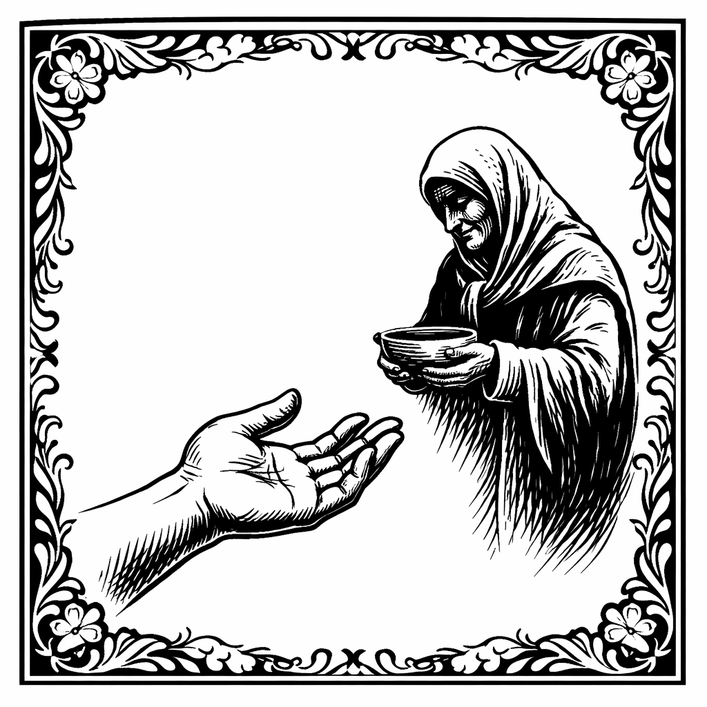{width=80%}


```{=latex}
\end{center}
\vspace*{\fill}
\newpage
```

# 6. Bölüm

Molla Mehmet kasabadan döndüğünde yararı olacağından pek te umudu yoktu. Nasıl umudu olsundu, memleketin dört bir yanında düşmanla vuruşulurken, devlet bir yandan padişah yanlısı güçlerle mücadele ediyor, aynı zamanda bir de bu Durası gibi çetelerle mücadele etmek zorunda kalıyordu. Sabah namazını camide cemaate kıldırdıktan sonra,

— Allahım sen bu fakir millete yardımcı ol, Allahım düşmanla vuruşan askerlerimize komutanlarımıza güç kuvvet, cesaret ver, Allahım sen bu müslüman topraklarını gâvur ayaklarına çiynetme, Allahım sen ordumuzu Hendek, Bedir savaşlarında, Çanakkale Savaşı'nda, Çaldıran, Mercidabık, Kosova savaşlarında olduğu gibi muzaffer kıl.

Duadan sonra evine giderek sabah çorbasını içti.

O sabah Karamatlar'a, Gölpazarı'ndan bir uzman çavuş komutasında 7 askerden oluşan bir manga gelmişti. Askerler Yahyalar sülalesinin fırın evinin üzerindeki 2 odaya yerleştiler. Jandarma köydeyken ne Kara Durası çetesi, ne de Süleyman Efe, Katil Nuri ve Hasan'dan oluşan Karamatlar'lı efeler köy ve köy çevresine uğramadılar. Jandarma köye gelir gelmez haber hem çeteye, hem de efelere çoktan ulaşmıştı.

Eşkıya Kara Durası çetesi bölgedeki diğer çeteler ve efelere korku salar olmuştu ama Kara Durası Karamatlar'lı efelerle karşı karşıya gelmekten hep kaçınmıştı. Kel Süleyman ve Pepe Hasan efeler neyse de, Katil Nuri efe ile karşı karşıya gelmekten hep kaçınmıştı. Katil Nuri de kendisi gibi acımasız, gözü kara ve de yeri geldiğinde çark edip, çalıyı dolanmasını bilen biriydi. Daha çobanlık yaptığı yıllarda az çektirmemişti Durası'na. Karşı karşıya gelirlerse biri ölürdü mutlaka.

Kara Durası esas Süleyman efe ile karşılaşırsa ne yapacağını bilemiyordu. Ekmek yediği kapının insanıydı. Halil şehit düştükten sonra Zekiyeyengegiller'e iç güveyi gelmiş, Halil'i aratmamış, o da Durası'na iyi davranmıştı. Kendi kendine, "Len Halil ağamın yerine geçtiyse, karısının koynuna girdiyse, çocuklarına babalık ediyorsa onları ilgilendirir. Acımak yok, acıyan, acınacak duruma düşer diye boşuna dememişler. Karşılaşırsak o da alır kurşunlarımdan nasibini" diye düşündü.

Kara Durası her an yanında olan en güvendiği adamı Kürt Memo'ya,

— Memo bir gün Karamatlar'lı efelerle karşılaşırsak, vuruşma başlayacağı an ben direk Katil Nuri'ye nişan alırım. Sen ve diğerleri Süleyman ve Hasan'a ateş edin. Silahlarına davranmalarına bile izin vermeyelim. Üçü de iyi nişancılar, ıskalamazlar, ateş etmelerine müsaade edersek postu deldiririz. Her zaman ilk kurşunları biz sıkmalıyız. O katil puştunun yere yuvarlandığını görmek için sabırsızlanıyorum. Katil Nuri ölürse efe grubu dağılır, biz de dağlarda daha rahat ederiz.

Kara Durası çobanlık yaparken Katil Nuri Efe ile ne zaman karşılaşsalar Katil Nuri mutlaka takaza edecek bir şey bulmuştu. Ya "Hadi len Durası bağlara git üzüm getir", ya "Git şu çeşmeden su doldur getir", "Durma len şu atımı gezdir, teri kurusun" gibisinden mutlaka bir şeyler istemişti. Kara Durası her defasında hiç sesini çıkarmadan denilenleri yapmıştı. İtiraz etse ne olacaktı, Katil Nuri kalkar, tokatlardı. O anlarda Durası kinini hep içinde biriktirmiş fırsatın kendi eline geçeceği günlerin hayalini kurmuştu.

Zaman değişmiş Durası, Eşkıya Kara Durası olmuş, bölgenin en acımasız çetesinin reisi olmuştu. Kara Durası çetesinin sayısı 4-5'ten 20'ye kadar ulaşıyor, sayı sürekli değişiyordu. Efelerin sayısı hep aynıydı, hep 3 kişiydiler.

Kimisi efelerle karşılaşmaktan korkuyor Kara Durası, kimileri de o grupta eski iş vereni Süleyman efe olduğundan ona saygısından karşı karşıya gelmekten kaçındığını söylüyorlardı. Aralarında sanki zımnen varılmış bir anlaşma vardı. Efelerin bölgede Kara Durası'nın çetesi var diye yolunu değiştirdiği olmuyordu ama çetenin üzerine üzerine gittikleri de olmuyordu.

Efeler daha ziyade Göynük köyleri Gerişler, Hilaller, Kilciler, Narzanlar, Boyacılar gibi köylerde zenginlerden haraç alıyor, aynı köylerdeki çok fakirlere, özellikle dul kadınlara aldıkları haracın bir kısmını dağıtıyorlardı. Efeler bölgede zenginden alıp, fakire dağıtıyorlar diye nam yaptıklarından haraç aldıkları ağalar dışında bölge halkı tarafından çok seviliyorlardı. Köye girdiklerinde hemen çocuklar etraflarını sarıyor, onlar da çocuklara şeker dağıtıyorlar, çocuklar da atların teri kurusun diye efelerin atlarını gezdiriyorlardı.

Efeler Karamatlar ve çevresindeki köylerden haraç almama konusunda kesin kararlıydılar. Tanıdık bölgeden haraç almayı efeliğin şanına leke sayıyorlardı. Kendilerine göre bir şeref, namus anlayışları vardı. Efeler Karamatlar'a güven içerisinde rahatça dinlenebilmek, sevdiklerini görmek için geliyorlardı.

Kara Durası Süleyman Efe olmadan Pepe Hasan Efe ve Katil Nuri Efeleri tek tek kıstırıp, alınlarının ortasından mıhlayabilmek için yanıp, tutuşuyordu. Dilden dile Karamatlar'lı Efelerin yaptıklarının ballandıra ballandıra, bire bin katılarak anlatılmasını duydukça gıcık oluyor, hırsından kırbacını çizmelerine şaklatıyor, kendi kendine,

— Ah bir aranızda Süleyman Efem olmayacaktı ah, o zaman ben sizin ananızı, avradınızı bellemez miydim. Ulan sizi atın üzerinden bir kurşunla domuz gibi yere düşürmez miydim. Ulan siz yatın kalkın Süleyman Ağam'a dua edin. Ama şart olsun, yazın bir kenara, sizin ölümünüz benim namlumun ucunda olacak. Benden önce biri sizi vuracak olursa nam olsun diye, şart olsun ben de o sizi vuranı nallayacağım. Bakalım Kara Durası'nın avını elinden almak neymiş, göstereceğim onlara.

Süleyman efe'den çok Zekiye yenge'ye olan saygısından kurşun sıkmakta tereddüt ediyordu efeye. Anası bırakıp gittiğinde Zekiyeyenge ona bakmış, bir çoban gibi değil, evin oğlu gibi davranmış, anası öldüğünde de tüm cenaze defin ve mevlüt adetleriyle eksiksiz ilgilenmiş, ne yapmak lazımsa yapmıştı.

Civar köyler efeleri ne kadar çok seviyorlarsa, Kara Durası çetesinden de o kadar nefret ediyor, korkuyorlardı. Efelerin gönülsüz hiçbir kadına tasallut ettikleri görünmemişti. Gerişler, Kilciler, Narzanlar bölgesinde, bölgenin ağaları zamanında fakir halka çok zulüm ettiklerinden efeler, ağalardan haraç aldıkça, köy halkının daha da hoşuna gidiyordu.

Yaşlı kadınlar; "Allah atınızın nalına taş değdirmesin, sizin sayenizde şu yavruların kursağı lokma gördü, dikkatli olun efe oğullarım, Allah sizi başımızdan eksik etmesin" diye dua ediyorlardı.

Karamatlar'lı Efeler'in bölgede olduğu günler, Kara Durası Çetesi'nin dışında başka çeteler de uğramıyordu o bölgeye. Bölgede efelerin olması fakir halk açısından bir güvenceydi.

Bölge savaş dışı kaldığından jandarma birliklerinde sadece çıkacak asayiş olaylarına müdahale etmek için az sayıda asker bulunduruluyordu. Onlar da çoğunlukla Yunan Kuvvetleri'nin Sakarya ötesindeki hareketlerini izlemek üzere Sakarya kıyılarına sevk ediliyorlardı.

Bölgenin zenginleri bedel ödeyerek askere gitmediklerinden fakir halk tarafından içten içe sevilmiyor, efelerin haraç almaları neredeyse mutlulukla karşılanıyordu. Efelere her dertlerini anlatıyorlar, efeler de fakir yerel halk için ellerinden gelenleri yapıyorlardı. Bölge halkı efelere her türlü haberi gönüllü iletiyorlardı.

O gün efelerin köye geleceğini bilen on yaşlarında bir çocuk kırın Göynük yönünde hayvan otlatırken, Göynük Jandarması'nın köye doğru geldiğini görünce, hayvanların yanında bulunan ata eğersiz, çıplak binerek at sürmüş, Dumanköy yakınlarında efelerin önünü keserek,

— Efe amcalar Jandarma köye geldi. Ben de ata atlayarak size haber vermeye geldim, köye gitmeyin diye.

Efeler çocuğa aferin demişler, cebine harçlık, şeker doldurmuşlardı.

Gerişler köyü'ne gelen jandarmalar o gün akşam üstü köyden ayrılmışlardı. Karaahmetler Köyü'ne gelen Gölpazarı jandarması köyde bir hafta kaldılar. Ne Kara Durası çetesi, ne de efelerin yeri ile ilgili hiçbir istihbarat alamadıklarından hiç araziye aramaya çıkmamışlardı. Uzman Çavuş zaten az olan askerlerinden zayiat vermek istemiyordu. Bir hafta sonra askerler Gölpazarı'na geri döndü.

Kara Durası çetesi 15 gün kadar Karamatlar çevresinde görünmedi. Kara Durası çetesi sürekli yer değiştiriyordu. Bölgeden çok fazla uzaklaşmamak kaydıyla 3'erli, 4'erli gruplar halinde dolaşıyor, fazla ilgi çekmek istemiyorlardı.

Süleyman Efe de mecbur kalmadıkça Kara Durası'na kurşun sıkmak istemiyordu. Mecbur kalırsa tereddüt etmez sıkardı kurşunu ama, mecbur kalmak istemiyordu. Halil Efe'nin çobanları olduğu için mi, çocuk denecek yaşta yanlarına gelip, silah tutmayı, nişan almayı, hedef vurmayı şehit arkadaşı, karısının ilk kocası Halil öğrettiği için mi bilinmez bir farklı bakışı vardı. Kara Durası onlara zarar vermedikçe o da Kara Durası'na zarar vermek istemiyordu.

Katil Nuri efe'ye kalsa yılanın başı küçükken ezilmeliydi. "Hemen bir yerde kıstıralım, basalım kurşunu, gelecekte bu bizim başımıza bela olacak" diyordu. Hasan Efe ise ikisinin arasında kalıyor, tartışmalara pek girmiyordu.

Katil Nuri Efe'yi esas kızdıran Eşkıya Kara Durası çetesinin onların haraç aldıkları kişilerden, onun da haraç almaya başlamasıydı. Bir gün Narzanlar'lı zengin bir ağa,

— Efeler, efelik hakkı diyorsunuz, bizden istiyorsunuz. Biz de siz ne isterseniz ikiletmeden veriyoruz. Şimdilerde buralarda türeyen Eşkıya Kara Durası çetesi de bizden zorla haraç alır oldu. Efelik payı diye alacağa bağladıklarını korumak efeliğin şanından değil midir. Siz efelerin bizi bu eşkıyaya karşı korumanız gerekmez mi? Yarın öbür gün bu eşkıya gelir yalnız bize haraç vereceksiniz, biz sizi diğer efeler ve çetelere karşı koruruz derse biz o zaman ne yapacağız?

Bu sözler karşısında efeler baştan diyecek bir şey bulamamışlar, yine en erken kendini toparlayan Süleyman Efe,

— Sen meraklanma ağa, biz bir hal çaresine bakarız.

Demişti. Demişti de Kara Durası her geçen gün onların bölgesine daha fazla tecavüz eder olmuştu. Aslında bu durum pek te yadırganacak gibi değildi. Bölgedeki zengin, parası olan adam sayısı çok ta fazla değildi. Efeler kendi köyleri ve yakın köylerden zenginlerden de olsa haraç almıyor, Kara Durası bölge mölge dinlemiyor, her zengini haraca bağlıyor, hatta gariban insanlardan bile haraç alıyordu.

Kuzlar köyünden yaşlı bir kadının güttüğü 4 keçisiyle, 3 oğlağından birini kadının gözü önünde feryatlarına, yalvarmalarına aldırmadan kesip, adamlarına yüzdürmüştü, oğlağın kafasını yaşlı kadının önüne atarak,

— Koca karı al bu kafayı da sen ye, bu sana yeter.

Demişti gülerek. Kadın, "Evladım Durası rahmetli anan benim ahiretliğimdi, zaten bunlardan başka hayvanım yok. Etme evlat, eyleme, ananın hatırına bırak oğlağımı" dese de Kara Durası duymazdan gelmişti yaşlı kadının yalvarmalarını.

Kadın o gittikten sonra oğlağın kesik başını ellerine alarak; "Allah senin belanı versin Durası, kör kurşunlara gelesin, boynuna yağlı urgan takıp, sallandırsınlar seni, pis eşkıya, benim oğlağıma mı kaldın. Allah senin geberdiğin günü göstersin bana" diye ilenmişti. Yaşlı kadın çete gözden uzaklaştıktan sonra kalan keçi ve oğlaklarını önüne katarak gözyaşlarını sile sile köyünün yolunu tutmuştu.

Kara Durası korkusundan genç kızlar tek başına dağa bağa gidemez olmuşlardı. Kara Durası'ndan cesaret alan adamları da tek başına bir kadın gördüklerinde tasallut ediyorlardı. Kara Durası her gün ayrı bir yerde görünüyordu. Kara Durası kendinin haberi olması şartıyla adamlarının köylüye korku salan her şeyi yapmalarına ses çıkarmıyordu. Onun haberi olmadan kendi kafasına göre hareket eden bir çete üyesi olursa acımadan öldürüyordu.

Bir gün dört adamıyla Cansızlar köyü yakınlarından geçerken yağcılık yapan Hacı Ahmetler'in askerlik çağına yakın oğlu Ahmet'i gördü. Ahmet'in sülalesi haşhaştan yağ çıkarıyorlardı. Yağ çıkartırken, kavurup, sıktıkları haşhaşların yağından çıkarma hakkı alıyorlardı. Bu nedenle köydeki diğer ailelere göre daha varlıklıydılar. Kara Durası atının üzerinden parmağıyla işaret ederek Ahmet'i yanına çağırdı.

— Len delikanlı buraya gel.

— Ne yapacaksın beni?

— Senin adın ne, kimlerdensin sen?

— Benim adım Ahmet, Hacı Ahmetler derler bize. Len Hacı Ahmetler'in Ahmet siz ne iş yaparsınız?

— Çiftçilik yaparız, bir de haşhaştan yağ çıkarırız.

— Len Hacı Ahmetler'in Ahmet 2 gün sonra buraya yeniden geleceğiz. Bize bir teneke yağ, 3 te sarı lira getireceksin. Getirdin, getirdin; getirmezsen çıra gibi yakarım seni. Önce seni sonra sülaleni yakarım.

Atını sürdü gitti. Gökçeözü köyü'nden geçerken daha önce gördüğü kadının evine doğru baktı ama Ayşe gelini göremedi.

Akçapınar, Gökçeözü ve Dumanköy'den alacağı haraçları topladıktan sonra atlarını Kayaboğazı'na doğru sürdüler. Gidip Taraklı yakınlarındaki Kilem Hamamı'nda bir güzel yıkandı. O geceyi hamamda gelen müşterileri ağırlamak için yapılan odalarda geçirdiler. İki gün oralarda dolaştılar.

Hamam yakınlarındaki değirmende haraç aldıkları yerlerden biriydi. Değirmenciden ve haraç alacakları diğer yerlerden haraçlarını topladılar.

Kara Durası değirmenciye yeni öğütülen undan kömme yaptırdı. Kömmenin yanında keçi peyniri, bir de beylerce üzümü vardı. Sıcacık kömmeyi kocaman elleriyle bölen Kara Durası, yakın adamı Kürt Memo'ya seslendi,

— Len Memo heybeden rakıyı kap, gel. Şöyle karşılıklı ikişer kupa parlatalım.

Diğer çetelere dönerek,

— Len kızanlar siz de hem etrafı kolaçan edin, hem de karnınızı doyurun. Hepimize yetecek kadar kömme, peynir ve üzüm var. Rakı sadece Memo ağanız ile bana. Başka rakı içeni görürsem o içtiği rakıyı anam avradım olsun burnundan şelale gibi fışkırttırırım.

Rakıyı içerken Kara Durası gevrek gevrek gülerken,

— Len Memo biz artık bu dağların padişahıyız. Ben dağlar padişahı, sen de veziri. Ulan bir eksik var şimdi olmalıydı şurada ilik gibi bir karı. Önce gözümüzün önünde zilleri şakırdatarak kalçalarını kıvıra kıvıra bir raks etmeliydi, sonunda da döşeğimizi ısıtmalıydı. O da olacak Memo, o da olacak hem de yakında.

Kürt Memo şöyle bir bakınca ne demek istediğini anlayan Durası,

— Ulan Memo şurada üç kuruşluk keyfimiz var, onu da mundar etme. Ulan Şaziye bacını aç bırakmıyoruz, açık bırakmıyoruz. Eşkıya karısıyım diye çalım çalım, çalım satıyor. Zamanı gelince onun da gönlünü yaparız.

Kürt Memo bir şeyler diyecek oldu, yutkundu, ne tepki vereceğini kestiremediğinden sustu. Gece yarısını epey geçe değirmendeki odada değirmencinin yataklarına uzandılar. İkisi de uzanır, uzanmaz horlamaya başladılar. Aradan 3 gün geçmişti.

— Len Kürt Memo, bugün yönümüz hangi yana?

— Ağam hani Cansızlar yakınlarından geçerken bir çocuğa yağ, bir de 3 sarı lira getir dediydiniz. Şaka mı dediniz, gerçek miydi anlayamadım da.

— Ne şakası ulen, haracın şakası, eşkıyanın şakacısı olur mu? Haydi ne durursunuz, sürün atları Cansızlar'dan yana.

Bilyaz, Haceller köyleri üzerinden Cansızlar kırına çıktı. Sarıhacılar yakınında bir davar görünce çobanlara bir oğlak kestirerek, yaktıkları ateşte oğlağı nar gibi kızarttılar. Yanında Memo'dan başka iki adamı daha vardı. Kızarmış oğlak etini iştahla yediler. Su testisini kafasına diktikten sonra Durası kana kana testiden su içti. Elinin tersiyle ağzını sildikten sonra,

— Haydin davranın len, yarım kalmış bir işimiz var, haydi yolcu yolunda gerek.

Daha sonra Cansızlar'lı Ahmet ile buluşacakları yere geldiler. Ahmet'i söyledikleri yerde onları beklerken gören Kara Durası keyiflendi, gevrek gevrek gülerek,

— Aferin len Ahmet bak gelmişsin, gerçi gelmeseydin ne yapacaktın, iğnenin deliğine girsen seni bulup, o delikten çıkartırdım. Olmadı haracı anandan, varsa bacından alır, belki de neyse gelmişsin ya tamam ulan.

Gelmişti ama sadece bir teneke yağ getirmişti.

— 3 sarı lira nerede len Ahmet?

— Yağ getirdim işte, ben nereden bulayım altını, altını kim kaybetmiş ki ben bulayım.

— Ne diyorsun sen len. Ben sana ne dedim, dediklerimi getirdin, getirdin; getirmezsen seni çıra gibi yakarım demedim mi?

— Dedi de, olmayınca ne yapayım, yok işte. Sana dedim ben biz yağ çıkartıyoruz, altın değil.

— Ulan şu sümüklüye bak. Hem altınları getirmemiş, hem de tatava eder. Ulan sen bilmiyor musun Kara Durası'nın affı yok. Ulan Kara Durası adını duyan emzikli kadınların sütü kesiliyor, ağlayan çocuklar susuyor. Yakalayın şunu, bağlayın şu çama, ama iyi bağlayın. Ayakları yerden yukarıda olsun.

İki adam urganla Ahmet'i sıkıca çam ağacına bağladılar. Kara Durası adamlarına dönerek,

— Binin len atlarınıza.

Üç adam bir sıçrayışta atlarına bindiler. Kara Durası cebinden çakmağı çıkararak Ahmet'in bağlı olduğu çamın altındaki kurumuş çam pürçüklerini tutuşturdu. Ardından atına binerek mahmuzladı. Dört atlı tam köşeyi dönerlerken Kürt Memo,

— Siz devam edin, benim tuvaletim geldi, ben size ardınızdan yetişirim.

— Tamam Çabutlu Türbe'de bekleriz seni.

Kara Durası önde, iki adamı ardında Çabutlu Türbe'ye doğru dört nala sürdüler atlarını.

Kürt Memo atını mahmuzlayarak hızla Ahmet'in bağlı olduğu çamın yanına gelerek atından atladı. Çamın dibindeki alev epey büyümüştü. Yanmaya başlayan Ahmet acıyla çığlıklar atıyor, yardım istiyordu ama sesini kimse duymuyordu. Kürt Memo hemen Ahmet'i bağlayan urganları bıçağıyla keserek kurtardı. Ahmet'in elbiseleri yanıyordu. Matarasındaki suyla söndürmeye çalıştı. Söndüremeyince atının terkisindeki kilimi alarak Ahmet'i sardı. Ahmet acılar içerisinde feryat ediyordu. Sonunda söndürmüştü. Ahmet oturduğu yere yığıldı kaldı. Kürt Memo matarasından kafasına su dökerek Ahmet'in kendine gelmesini sağladı. Kucağına alarak Ahmet'i Cansızlar köyü yakınlarına kadar atının üzerinde kucağında götürdü. Ahmet acılar içerisinde kıvranıyor, sık sık kendinden geçiyor, kendine gelince acıyla çığlık atmaya devam ediyordu. Yanmış saç ve elbise kokuları sarmıştı her yanı. Kokuları duyan atta hırçınlaşmış, sağa sola kafasını çevirerek kişnemeye başlamıştı. Daha sonra Kürt Memo, Ahmet'i Cansızlar köyü'nün yakınında atından yere indirerek yere bıraktıktan sonra atını Çabutlu Türbe'ye doğru sürdü. Bir taraftan da ardına doğru bağırıyordu.

— Acele etme yaraların soyulur, yavaş yavaş git evinize. Biraz daha geç kalırsam şüphelenir Durası. Geri gelirse ikimiz de yanarız.

Ahmet sürüne sürüne evinin yolunu zor buldu. Anası onu o halde görünce acıyla çığlık attı.

— Kim yaptı bunu sana, Allah belasını versin, yağlı urganlarda sallansın.

Ahmet sesi duyulur duyulmaz "Kara Durası yaptı" diyebildi, ardından da hemen kendinden geçti yine. Anası onu temiz çarşaflar serili bir döşeğin üzerine usulca yatırdı. Üzerinde kalan yanık giysileri makasla keserek çıkardı. Yaralarının üzerine merhem sürdükten sonra üzerine de bir çarşaf örttü. Ahmet bir hafta acılar ve ateşler içerisinde inledi durdu. Bir hafta sonra biraz kendine geldi. Ancak 15 gün sonra yavaş yavaş yürümeye başladı. Ahmet'in annesi 15 gün boyunca başından ayrılmadı. Ateşi çıkınca vücudunu sirkeli sularla sildi, yaralarına merhemler sürdü.

Kürt Memo Çabutlu Türbe'ye gelince,

— Memo nerede kaldın, nasıl tuvalet bu?

— Sorma ağam, oğlağı sıcak sıcak yiyince onu bozdu ne? İshal olmuşum, zor kalktım.

— Ulen nasıl göt bu, yesen de bozuluyor, yemesen de.

Kara Durası bir kahkaha attı. Kürt Memo kendi kendine,

— Şükür anlamadı, anlasaydı "Sen benim emrimi nasıl çiğnersin" der, bir sürü tatava ederdi, belki adamların yanında tokatlardı bile. Şükür fark etmedi.

Bu olaydan sonra Kürt Memo'nun, Ahmet'i yanmaktan kurtarması dilden dile anlatıldı. Kürt Memo diğer çete üyelerine göre daha farklı gözle görülmeye başlandı. Kara Durası korkusu her bir yanı daha da bir fazla sarmaya başladı. Kara Durası'na muhbirleri her haberi olduğu gibi bu haberi de anında ulaştırmışlardı ama Kara Durası bu olayı Memo'ya hiç sormadı. Duymamış, bilmiyormuş gibi yaptı. Sorsa namını korumak için adamların önünde ya Memo'yu vuracak, ya tokatlayacak, ya da kırbaçlayacaktı. Aslında iyi de olmuştu. Bu olay namına nam katmış, acımasızlığı cümle âleme yayılmıştı.

Artık o çetesiyle atları üzerinde bir köyden geçerken, sokaklarda kimse kalmıyor, ev kapıları sürgüleniyor, köy hayalet köye dönüyordu. Köpekler de havlamasalar köy boşalmış sanılırdı. Kara Durası sık sık yer değiştiriyordu. Bir gün Göynük Gerişler'de görünürken, ertesi gün Gölpazarı Keskin köyü civarında görünüyordu. Kara Durası'nın namı o kadar yayılmıştı ki, at üzerinde görünen yabancı her eşkıya Durası'nın adamı diye anlatılıyordu. Kara Durası, Karamatlar Köyü'ndeki mağarasında kalmadığı geceler çoğunlukla değirmenlerde uyumayı seçiyordu. Değirmenler konumları itibariyle hem köy yerleşim yerlerinin dışında, hem de bir baskın anında kaçılması, ya da savunulması daha kolay yerlerdi.

Bir gün Gerişler yöresinde bir değirmende yiyip içtikten sonra zaman epey ilerlemişti, Kara Durası içtiği rakının etkisiyle kafayı iyice bulmuştu. Önce gerine gerine göbeğini kaşıdı, sonra aklına hoşuna gidecek bir şey gelmiş olacak ki, kendi kendine gülümsedi. Kara Durası gürledi,

— Len Memo atları eğerle, seninkiyle, benimki olacak keklikleri bir avlamaya çıkalım. Gece ay ışığında keklik avlamak pek zevkli olur. Diğerleri siz burada kalacaksınız, yatın zıbarın. Nöbet işini ihmal etmeyin. Döndüğümüzde nöbet tutan görmezsem ya da nöbetçiyi uyur görürsem o nöbetçinin vay haline, alnından nallarım şart olsun. Ne olursa olsun güvenliği elden bırakmak yok.

Kürt Memo daha bıyıkları yeni terlemiş bir çete üyesine bir işaret yapınca, o çete üyesi ok gibi yerinden fırlayarak dışarı çıktı. Genç çeteci Kara Durası ve Kürt Memo'nun atlarını çabucak eğerleyerek atları dizginlerinden tutarak değirmenin giriş kapısına getirdi. Kapıda bekleyen Kürt Memo atları görünce içeri girdi.

— Kara Durası ağam atlar hazır.

— Kara Durası ağam nereye gidiyoruz?

— Sorma len, düş ardıma.

Kara Durası önde, Kürt Memo ardında gecenin karanlığında atları dört nala sürdüler. Gökçeözü tarafına dönünce Kürt Memo olayı anlar gibi oldu. Geçen gün derede çamaşır yıkarken gördükleri kadının evine yaklaşınca önce Kara Durası ardından Kürt Memo atlarından atladılar. Atları eve 50 metre kadar mesafede bir çalılığa bağladılar. Kürt Memo sesini çıkarmadan Durası'nı takip etti. Atlar da kişnemesinler diye Kürt Memo yem torbalarını atların başlarına geçirmişti. Gece karanlığında peş peşe sessizce yılan gibi kaydılar.

— Len Memo o gün gördüğümüzden beri karı aklımdan çıkmıyor. Çamaşır yıkarken uzaktan görünce bile bu kadar iştahımı kabartan karı, yanına varınca ne yapar bakalım. Komşusu karı da senin, tadını çıkar.

Evin önüne gelince Kara Durası tahta kapıyı birkaç kere çaldı. Kürt Memo'ya işaret ederek Hatice kadının evini gösterdi işaret parmağıyla. İçeriden titrek, korkmuş bir ses,

— Kim o, kim var orada?

— Benim, ben Eşkıya Kara Durası. Aç kapıyı.

— Ben yalnız bir kadınım, açamam, git ağam, Allahını seversen git, korkutma beni.

— Aç kız kapıyı. Açmazsan kapıyı kırar girerim. Ben istediğimi yine alırım ama sen rezil olursun, tercih senin.

— Kulun kölen olayım Kara Durası ağam, acı bana, kocam askerde, küçük sabi bir oğlum var, başka kimimiz, kimsemiz yok. Seni gönlüyle seven bir çok kadın vardır, bana kıyma ağam, beni evladıma ve asker kocama bağışla.

— İyi işte kız, kocam asker dersin, çoktandır erkek eli değmemiştir sana. Bak kapıyı gönüllü açmazsan kıracağım kapıyı, çatırtıyı duyan olursa karışmam, gerisini sen düşün.

İçeriden bir süreliğine ses gelmedi. Kara Durası dış kapıyı omuzladı. Kapı çatırdadı, eski kilitin dili şak diye kurtuldu. Kara Durası ok gibi daldı içeriye. Ayşe tam o sırada arkaya bakan pencereyi yukarı kaydırmış, bir bacağını pencereye atmış, pencereden atlamak üzereydi. Kara Durası kadını bir hamlede belinden yakalayarak içeri çekti. Ayşe debeleniyor, çırpınıyor ama bağıramıyordu. Yan odada mışıl mışıl uyuyan evladının sesleri duyup gelmesinden korkuyordu. Ayşe korkudan tir tir titriyordu. Ayşe ağlıyor, yalvarıyordu.

— Bırak beni ağam, bırak. Kulun, kölen olayım bırak. Ufacık bir evladım var. Kocam askerde, düşmanla vuruşur, onun hatırına bırak, ben kocam dönünce onun yüzüne nasıl bakarım.

Kara Durası Ayşe'yi hiç konuşmadan yerdeki yatağın üzerine fırlattı.

— Sus, zırlama. Bu iş bu akşam olacak, ya güzellikle, ya zorla.

Yatağın üzerine fırlatılan Ayşe'nin işliği yukarı sıyrılmış, beli açılmıştı. Ayşe'nin korkudan tir tir titreyen beyaz tenini gören Kara Durası iyice canavarlaştı. "Olacak dedim, olacak" diye düşündü.

— Etme ağam, eyleme ağam bırak beni, sana başka kadın mı yok, ben kocamı seviyorum, ondan başkasıyla olmaz, olamaz.

— Sesini çıkarma dedim.

Kara Durası belinden çıkardığı keskin bıçağı göstererek,

— Kıpırdama zaten kafamda iyi, kesiveririm o güzel boynunu.

Ayşe korkudan ana rahmindeki çocuk gibi büzüldü, yatağın üzerinde. Bir taraftan da kafasından düşen çemberine gözyaşlarını silmeye çalışıyordu.

— Ben bir şeyi, ya da bir karıyı istedim mi o benim olur. Ya isteyerek, ya da zorla. Bu gece de seni istiyorum, ya gönüllü "He" dersin, ya da zorla alırım seni altıma.

Kara Durası aç bir köpek gibi saldırdı Ayşe gelin'e. Ayşe gelin ne kadar debelense, ne kadar kurtulmaya çalışsa da başarılı olamadı. Bir ara Kara Durası'nın sırıtarak elindeki bıçağın sivri ucunu boğazına yaklaştırdığını görünce korkudan neredeyse kanı dondu. Hareket edemedi, sanki canlı bir ceset gibi seddizce uzandı kaldı. Gözlerini sımsıkı yumdu, çektiği işkencenin bitmesini gözyaşlarıyla sessiz sessiz hıçkırarak beklemeye başladı.

Kara Durası işi bitince yatağa sırt üstü devrildi. Ayşe gelin debelense, kurtulmaya çalışsa da Kara Durası'nın kocaman elleri kerpeten gibi onu yatağa yapıştırmıştı. Ayşe gelin yırtılan giysileriyle vücudunu örtmeye çalışırken, bir taraftan da tecavüze uğramanın utancı ve şokuyla gözlerinden akan yaşları silmeye çalışıyordu. Tortop büzülmüş, kendini görmekten utanır gibiydi, kendini kirlenmiş hissediyordu, hem de katran karasından daha kara kirli.

Kara Durası yattığı yerden göğsünün kıllarını kaşıyarak gürledi.

— Su ısıt kız yıkanacağım.

Ayşe gözyaşlarını silerek ocaktaki odunları yaktı, sacayağının üzerine bir tencere koyarak su ısıttı. Hemen öbür odaya koşarak bulduğu bir çarşafı vücuduna sardı. "Allahım ben artık yaşayamam, Allahım verdiğin canı senden başkasının almasını büyük günah olduğunu biliyorum ama bu kirle yaşayamam ben" diye mırıldandı, duyulur duyulmaz.

Kara Durası türkü söyleye söyleye yıkandı. Sonunda giyinerek dışarı çıkarken bir sarı lira fırlattı.

— Bak Ayşe ben ne zaman canım isterse geleceğim. Ya gönüllü girersin koynuma, ya da zorla. Benim yanımdaki adam da yan komşun Hatice'ye gitti. İkiniz de kimseye bahsetmeyin. Şart olsun alır giderim çocuklarınızı, bir daha göremezsiniz ha.

— Artık sen benim, komşun Hatice de Kürt Memo'nun kapatması bundan sonra. Geldiğimde somurtmayacaksın, güler yüzlü olacaksın. Somurtursan o güzel suratını öyle dağıtırım, kendini sen bile tanıyamazsın. Azıcık cilve yapmasını da öğrenirsen, beni memnun edersen bakarsın iki sarı lira veririm sana.

— Eğer daha sonra geldiğimizde sen de, şu komşun olacak karı da surat asarsanız şart olsun dağa kaldırır çetenin tamamını üzerinizden geçiririz.

Ayşe gelin sarıldığı çarşafı sıkı sıkı tutarak sessiz sessiz hıçkırıyordu.

Sonra kapıyı örterek evden çıktı gitti Kara Durası.

Atların yanına geldiğinde Kürt Memo'yu atların yanında buldu.

— Memo ne yaptın len, oldu mu bir şeyler?

— Sayende ağam, dam kapısı açıktı. Damdan eve çıkan ara kapı varmış. Oradan girdim eve. Karı uyuyordu. Zeballah gibi beni karşısında görünce karı korktu, bağırmak istedi. Ben ağzını kapattım. "Ben Eşkıya Kara Durası'nın has adamıyım. Ağam da komşun Ayşe kadında ya gönüllü, ya zorla" dedim. Direndi ama aman vermedim. Sonra kimseye söyleme diye tehdit ettim, evden çıktım, seni bekliyordu.

Kara Durası, Memo'ya dönerek,

— Ulan Memo seni damat gibi kapamak vardı ya neyse, kafalar iyiydi. Madem karı hoşuna gitti, gönlünü alaydın.

— Alaydın da ağam, karı hep ağladı durdu. Ben yine de yastığın üzerine bir sarı lira bıraktım. Bıraktım da ağam kadın hiç yüzüme bile bakmadı. Ben üstünden inip, giyinirken o yüzünü yastığa gömmüş hıçkıra hıçkıra ağlıyordu. Ne bileyim be ağam biraz da içim acımadı desem yalan olur.

— Ulan Kürt Memo sen nasıl eşkıyasın. Hem bir karının koynuna girmek istersin, hem de karı zırlayınca süt dökmüş kediye dönersin. Ulan eşkıyanın yüreğinde merhamet mi olur, yüreğine merhamet düşen eşkıya postu deldirir. Kendine gel sonra bir daha zor görürsün karıyı marıyı.

— Kusura kalma ağam işte bizim eşkıyalığımız bu kadar. Bir gün ya jandarma, ya da eşkıya kurşunuyla postu deldireceğimi ben de bilmez değilim.

Ayşe, Kara Durası gittikten sonra yıkandı, yıkandı. Sanki Kara Durası'nın kirini akıtmak ister gibiydi. Gusül abdesti aldıktan sonra giyindi, iki rekat namaz kıldı, secdede ne kadar kaldığını unuttu. Gözlerinden akan yaşlar seccadeyi ıpıslak yapmıştı. Ne kadar yıkansa kendini çok fazla kirli hissediyordu. Aklını yitirmekte olduğunu hissetti. Allah'a dua etti. Daha sonra elindeki urganı tavana astı. Ayağının altına çeyiz sandığını çekerek üzerine çıktı. Urganın ilmeğini boynuna geçirdi. Allah'ına yalvardı:

— Kurban olduğum Yüce Allahım, ben kirlendim, ben erim gazi dönerse yüzüne bakamam, şehit düşerse öbür dünyada nasıl varırım huzuruna. Allahım sen benim kirimi temizle, sen affedicisin, affetmeyi seversin beni affet. Allahım sübyan evladıma yardım et, onu kurda kuşa yem etme, onun yolunu aç. Anasının kirlendiğini duyurma ona. O anasının tertemiz öldüğünü bilsin.

Ayağıyla çeyiz sandığını ittirecekti ki; beş yaşındaki oğlunun sesini duydu.

— Ana neredesin, çişim geldi.

Hemen boynundan urganı çıkardı, oğlunun yanına koştu. Oğlunu tuvalete götürdü. Kendi kendine;

— Ne yapıyordum ben, ben ölünce oğluma kim bakar, kimimiz, kimsemiz yok ki.

Oğluna sıkı sıkı sarıldı. Oğlunu tuvalete götürdü. Yeniden yatağına yatırdı oğlunu. Oğlu yastığa başını koyar koymaz yeniden uyumaya başladı. Ne kadar da masum uyuyordu evladı. Eğilerek yanağından usulca öptü oğlunu, gözlerinden akan yaşları oğlunun yanağına değdirmemeye çalıştı. "Uyanır da, ana niye ağlıyorsun diye sorarsa ne derdi oğluna" diye düşündü. Ağladı, ağladı. Pencerenin önüne oturdu, daha sonra tavandaki urganı indirdi, çeyiz sandığını yerine itti. Yeniden camın önüne tünedi.

Hava ağarınca komşusu Hatice'nin kapının eşiğine büzülmüş, ağlarken gördü. Hemen kapıdan çıkarak yanına gitti. Gözyaşlarını silerek,

— Hatice abla ne oldu sana, niye ağlarsın?

— Ah Ayşem, ah kardeşim sorma başıma geleni?

— Biliyorum Hatice ablam biliyorum. İkimizin de kötü kaderi bir miş. Haydi senin kocan şehit düştü. Benimki askerde, savaşır. Savaştan sonra döner gelirse ne derim ben. Yüzüne nasıl bakarım, nasıl sarılırım. Canıma kıyacaktım. Oğlumun sesiyle kendime geldim.

Yaşadıklarını Hatice ablasına ağlayarak anlattı.

— Abla ya Allah benim canımı alsın, ya da Nuri'm şehit düşsün. İnsan sevdiğinin şehit düşmesini ister mi istemez ama ben bu kirli halimle onun yüzüne bakamam. Köye geleceği haberini alır almaz geçiririm urganı boynuma ondan sonra o nasıl olsa bakar oğlumuza.

İki kadın birbirlerine sıkı sıkı sarılarak sarsıla sarsıla ağladılar. Köylüler bu iki kadının yüzlerinin güldüğünü bir daha hiç görmediler. Birinin kocası şehit, birininki askerde ondan herhalde dediler. Hatice ve Ayşe sık sık birlikte bir kenara çöküyor, sessiz sessiz ağlaşıyor, kötü kaderlerine kahrediyorlardı.

Bundan sonra Kara Durası ve Kürt Memo haftada bir, on beş günde bir gece gelir, gider oldular. Kadınlar yürekleri yansa da, her defasında onlar gittikten sonra kussalar, dakikalarca yıkansalar da komşuların dedikodularından, çocuklarına bir şey yapılmasından korktukları için seslerini çıkaramadılar. Kara Durası, Ayşe'ye,

— Bundan sonra canım ne zaman isterse geleceğim. Kapıyı aç, bekletilmeyi sevmem, kimseye de söyleme. Biri duyarsa, kapı geç açılırsa sabi mabi demem evladını öldürür, ardından seni dağa kaldırır, tüm adamlarımı üstünden geçiririm. Karar senin, duymuşsundur Durası dedi mi yapar.

Kara Durası ve Kürt Memo Gerişler yakınlarındaki değirmene dönünce sabah kahvaltısını ederlerken adamlarından biri,

— Kara Durası ağam hangi karının koynundaydın. Pamuk gibi olmuşsun. Karı seni güzel yumuşatmış.

Eşkıya Kara Durası'nın kaşları çatıldı. Hiçbir şey demeden belindeki tabancayı çıkararak adama doğrulttu ve bir el ateş etti. Alnında bir delik açılan adam ah bile diyemeden yana devrildi.

— Alın len bu itin leşini, bir yardan aşağı atın, çakallar, kurtlar parçalasın. Bundan sonra biriniz bir densizlik yapacak olursanız, sonunun aynı olacağını bilsin.

Bütün adamların neredeyse kanları donmuştu. Hiçbiri bir şey diyemedi, yerinden bile kıpırdayamadı. Sanki robot gibi hepsi aynı noktaya, ölen çetenin cesedine bakıyorlardı. Kürt Memo kendi kendine, "Bir adam nasıl bu kadar acımasız oluyor anlayamıyorum vallahi. Belirli bir yaş yaşar, bir çok kötülükle karşılaşır, ve bilenir, kendine yapılanların acısını yapanlardan çıkaramasa da başkalarından çıkarır. Bu daha yirmili yaşların başında bir genç, onu bu kadar acımasız yapacak ne yaşamış olabilirdi" diye düşündü.

Hiçbir şey olmamış gibi odaya yatmaya giderken seslendi.

— Len Kürt Memo beni kuşluk vakti kaldır.

Diğer adamlar ölü arkadaşlarının cesedini kendi atına atarak uzaklaşırken Kürt Memo arkalarından Kara Durası duymayacak şekilde seslendi.

— Arkadaşınızı görülmez bir yere gömün, köyden uzak olsun. Ormanların ortalık bir yerine gömün.

Adamlar ölü arkadaşlarını götürürken oturduğu kütüğün üzerinde Kürt Memo duyulur duyulmaz söylenmeye başladı.

— Allahım nereye düştüm ben. Bu adam acımasız, bu adam Allahsız, yarın, öbür gün beni de vurur bu. Boku yedik. Bundan sonra dönüşte yok. Kaçsam ne yaparım. Memlekete varamam ki, varsam asker kaçağıyım. Sen on yıldan fazla düşmanla çarpış, sonra isyan et, dağa çık, çete ol. Alnıma bir kurşun şaklayana kadar gidecek bu öyle, ya da böyle. Bir gün olur genel af çıkarsa, o zaman işte, inşallah çıkar, gideriz memlekete, tüm pisliklerin üzerini örterek. Örteceğiz de karımın, doğduysa çocuğumun yüzüne nasıl bakarım bilmem. Benim Hatice kadına yaptığımı, memlekette başka biri ya benim karıma yapıyorsa. Kendi kendine anam avradım olsun o zaman o kişiyi lime lime doğrarım.

Kürt Memo yalnız kalınca içinde çelişkiler yaşıyordu ama Kara Durası'nın yanında kuklası gibi her dediğini yapıyordu, sorgusuz, sualsiz.

Kara Durası’nı sorgulamak kimin haddineydi. Daha beş on dakika önce bir çete üyesi ağzını açacak olmuş, alnının ortasından yemişti kurşunu. Durası sadece Şaziye’nin yanında farklıydı. Yıllarca Karamatlar’da çobanlık yaparken ona insan gibi davranan , kardaşım bre Durası diyen Yahyalar’ın eski çobanı, iç güveyi damatları İsa aga’ya da acımasız davranıyordu.

Bir defasında bağlar yakasındaki sayaya davarın yanına 3 adamıyla gitmişti Kara Durası. Sayaya varır varmaz atından atlamış,

— Len İsa aga hemen besilisinden iki oğlak kestir, yüzdür. Şu huyrayı da peynirle doldur. Yavaş davranırsan, ya da bir çakallık yapmaya kalkarsan acımam, açarım iki kaşının ortasına bir delik. Çakır Emine yenge ikinciye dul kalıverir maazallah. İlk nişanlısını Yunan göndermiş öteki tarafa, seni de acımam ben gönderiveririm alimallah.

— Bre Durası ben ne zaman senin karnını doyurmadım. Çobanlarla keçi kestiğimizde seni çağırmadım mı hep. Sana ben kardaşım dedim bre, ne oldu, beni de mi vuracaksın?

— Bırak tatavayı İsa aga, eski defterleri kapat. Gel çık dağa, katıl çeteme, Memo gibi has adamım ol, yine İsa agam ol. Sen Molla Mehmet'in damadı olduğun süre benim için sen de karşımdakilerdensin. Önce soyup sovana çevireceğim o mollayı, sonra da canım isterse göbeğine bir delik açarım, tabi gün gelir sıra sana da gelir. Oğlu Hüseyin o mollaya hiç benzemiyor, civan çocuk. Yarın öbür gün büyürse başıma bela olur ama, yine de dokunmayacağım. Bela olursa o zaman düşünürüz, tabi bir mortayı çekmezsek.

Kara Durası yüzülen oğlakları, huyraya doldurulan peynirleri alarak havaya birkaç el silah sıktıktan sonra tozu dumana katarak sayadan uzaklaştı.

O gittikten sonra İsa aga,

— Ulan Durası, koyun çobanı Durası, zamanında besledik seni, şimdilerde zehirli yılan oldun sokmak istersin beni.

Kara Durası sanki bu dağların kralı benim der gibi istediği yerde, istediği zaman adamlarıyla dolaşıyor, etrafa korku salıyordu.

Kara Durası'nın kötü şöhreti dalga dalga yayılıyordu. Halk iyi de olsa, kötü de olsa bir olayı aktarırken abartmayı sevdiğinden her anlatan kendisinden bir şeyler ekliyor, olayın boyutları iyiden iyiye büyüyor, etrafta efsane gibi yayılıyordu.

Bu artık Gölpazarı, Taraklı sınırlarını aşmış; Geyve, Göynük, Mudurnu, Sarıcakaya, Söğüt, hatta Bilecik Vilayeti'nde kulaktan kulağa anlatılır olmuştu. Kimi acımasızca öldürdüğü adamlardan bahsediyor, kimi ara sırada olsa yaşlı, dul kadınlarına ettiği yardımlardan bahsediyor, bunları o kadar abartıyorlardı ki, bazıları neredeyse Kara Durası'ndan bir halk kahramanı çıkarmaya çalışıyordu. Bir bölük asker kuşatmış ta, çatışmalar 3 gün, 3 gece sürmüş te, sonunda Kara Durası vuruşa vuruşa kuşatmayı yarmış çıkmış ta, mış ta, mış ta.

Esasında gelinecek olursa Kara Durası askerle çatışmaktan, hatta karşı karşıya gelmekten hep kaçmıştı. Köylerdeki muhbirleri ona askerin hareketlerini günü gününe bildiriyordu. O da askerin geleceği bölgeden adamlarını alarak hızla uzaklaşıyordu.

Her köyde en az iki muhbiri vardı; ya gönüllü, ya zorla. Gönüllü muhbirlerini arada sırada 3-5 kayme vererek yemliyor, zorla olanlarını ise ya öldürmekle, ya da namusuna tasallut olmakla tehdit ederek muhbirlik yapmalarını sağlıyordu. Bu muhbirler birbirinden habersizdi. Her iki muhbirden de aynı haber gelirse o zaman haberin doğru olduğuna emin olarak anında karar veriyor, yerini değiştiriyordu. Gelen haberler çelişkili ise haberi araştırıyor, yalan haber vereni ibret olsun diye hem acımasızca cezalandırıyor, hem de ifşa ediyordu. Ondan sonra hemen başka birini muhbir olarak görevlendiriyordu.

Halka karşı ne kadar acımasızsa, kendi adamlarına karşı kat kat daha fazla acımasızdı. Hatası olursa görmezden geldiği ya da hafif azarlamalarla, küfretmelerle cezalandırdığı Kürt Memo'ydu. Diğer adamlarına gaddarlık derecesinde acımasızdı. Hata yapan bir adamı eğer izini kaybettirme imkânı varsa Kara Durası duymadan ortadan kayboluyor, ya da Kara Durası duymasın diye dua ediyordu.

Adamlarına karşı tek adil davrandığı an, o da adil değildi ya; toplanan ganimeti dağıtırken. Ganimetten kafasına göre kendi payını ve Kürt Memo'nun payını ayırıyor, kalanı kaç adam varsa aralarında eşit paylaştırıyordu. Tabi kendi payıyla, Kürt Memo'nun payı genellikle ganimetin yarısı, geri kalan yarısı ise tüm adamların oluyordu.

Yemek, silah, mermi, at parası gibi ihtiyaçlar hasıl olursa onları haracı dağıtmadan önce ayırıyordu. Gerçi giysinin dışında diğer tüm ihtiyaçlarını gaspediyorlardı. Neredeyse tek para ödedikleri şey giysilere ödedikleri paraydı.

Askerle karşılaşmaktan uzak durmasının sebebi, askerle çatışmak zorunda kalırsa, bir de birkaç askeri öldürürse hükümetin bölgedeki asker sayısını arttıracağını biliyordu.

Köylerde kadınlar Kara Durası'nın çetesi geldiğinde korkudan kaçarak hemen evlerine giriyorlardı. Çeteden biri görür de göz koyar diye korkuyorlardı. Genç kızlar çeşmeye su doldurmaya giderken bile eski kıyafetler giyiyorlar, gösterişli görünmemeye çalışıyorlardı. Gerçi genç kızların kendini göstereceği, cilve yapacağı oğlan da kalmamıştı ya. Neredeyse 18 yaşın üzerindeki, 40 yaşın altındaki tüm erkekler askere alınmışlardı.

Kara Durası'nın tek istisnası gönlü olmayan evli kadınlara ve çocuk yaştaki kızlara yaklaşmıyor, adamlarına da uzak durmalarını tembihliyordu. Karamatlar ve Dereli'den hiçbir kadına göz koymamıştı. Tek istisna "karım" dediği, onu seven Dereli köyü'nden kapı bir komşu kızı Şaziye'ydi.

Molla Mehmet keçi satsa, peynir satsa hemen haberi oluyor, paranın yarısını haraç olarak istiyordu. Para gecikirse bu defa hemen oğlu Hüseyin'i bir punduna düşürerek kaçırıyor, fidyesini alıyordu.

Molla Mehmet illallah demişti artık. Sanki Kara Durası yanındaydı, haberin ulaşması bir günü geçmiyordu. Çoğu zaman satacağı erkeçleri davardan gece ayırıp, götürüyor, sonuç yine değişmiyordu. Bu haberi ileten muhbirin en yakınında olduğundan emindi artık. Muhbir aileden biri olmadığına göre, mutlaka çobanlardan biriydi. Molla Mehmet şüphelendiği çobanı konuşturmaya çalışıyor ama çobanlar korkudan hiçbir şey söyleyemiyorlardı. Molla Mehmet şüphelendiği çobana yol vererek yeni bir çoban tutuyor; Kara Durası zaman geçirmeden hemen çobanlardan birini muhbiri yapıyordu. Molla Mehmet artık başa çıkamayacağını anlayınca, hem de çoban bulmak zorlaşınca bu işin izini sürmekten vazgeçti. Kara Durası nasıl olsa öğrenmenin bir yolunu buluyordu.

Parayla adamlar tutup, Kara Durası çetesinin peşine düşmeyi bile düşündü ama sonra hemen vazgeçti. Devletten habersiz böyle bir şey yaparsa Kara Durası'ndan ne farkı kalırdı.

Kara Durası Hüseyin'i bir defa daha kaçırmıştı, yine fidyesini almıştı. Molla Mehmet keçi satınca hemen adamlarından birini göndererek haraç istiyor, haraç zamanında gelmezse bir punduna düşürerek Hüseyin'i kaçırıyor, bu defa fidye istiyordu. Sanki Hüseyin'in adım attığı yeri bilir gibiydi.

Artık bölgede husumeti olan biri hasmını öldürüyor, bu olayda Kara Durası'na fatura ediliyordu. Nerede bir adam öldürülse, öldüreni açık açık gören yoksa Kara Durası öldürmüş oluyordu. Bu durum Kara Durası'nın korku iklimine korku eklediğinden sessiz kalarak kabulleniyordu. Ya da araştırıyor, vuranı bularak,

— Ulan madem adam vurdun, suçu da bana attın, o zaman yarın on altın getir, getirdin, getirdin, getirmezsen seni de vurur Eşkıya Kara Durası.

O adam ne yapıp, yapıyor, kesilen cezayı ödüyordu.

O günlerde Neçinler köyünde bir adam ölü bulundu, 3 kurşunla ölmüştü adam. Hemen Kara Durası vurmuş dediler. On altın fidye istemiş te vermeyince vurmuş. Gerçi kurşunlar adama rastgele sıkılmıştı, acemi işi olduğu belliydi. Adam kasığındaki atardamarı parçalayan kurşun yüzünden kan kaybından ölmüştü.

Kara Durası öldürdüğü adamları ya bir, ya da olmadı iki kurşunla ya kafasından, ya da kalbinin üzerinden vurarak öldürürdü.

Kara Durası'nın adam öldürmesine hiç benzemese de yine hesap onun üzerinde kalmıştı.

Bir gün Kürt Memo'yu yanına çağırarak,

— Bu olayı bir araştır, madem bizim üzerimize yıkıldı en azından haracımızı alalım.

Dedi. Çete o sıralar Narzanlar köyündeydi. Kürt Memo yanına güvendiği bir adamı alarak 2 gün araştırma yaptı. Elde ettiği sonuçlarla Kara Durası'nın karşısına 16 yaşlarında tiz sesli bir çocukla çıka geldi.

— Ağam Neçinler'deki adamı bu vurmuş, bu vurmuş ta vurduranlar başka.

— Ulen sen kimsin, nerelisin, neden vurdun adamı, haydi vurdu da niye benim üzerime attın?

— Benim adım Hasan, Sürmeli köyündenim, Hasan teyze derler bana. Beni tehdit ettiler, bana zorla yaptırdılar.

— Hasan nasıl isim ulan öyle Hasan teyze. Sen kız mısın yoksa?

— Ben de bilmiyorum Kara Durası ağam, kız mıyım, erkek miyim, Allah beni de böyle yaratmış işte.

Kara Durası bir kahkaha atarak,

— Tamam, tamam anlaşıldı.

Dedi.

— Bak Hasan seni bunlar Sürmeli yakınlarına bırakacaklar. Sana bu işi yaptıran 3 kişiyi bulacaksın, benim selamımı söyleyeceksin. Madem çıkardıkları dedikoduda ben adamdan on altın istemişim, vermeyince vurmuşum. Onlara söyle zam yaptım. Beşerden 15 altını Köseler köyünün üstüne getirsinler, yanlarında sen de gel, dur caydım 16 altın getirsinler. Seni sevdim, o bir altını sana vereceğim len. Getirmezlerse onları bulur kafalarında sarı lira büyüklüğünde beşer delik açarım.

Neçinler'li ölen adam Sürmelili'lerden birisinin karısıyla sevgili olmuş, gelir gidermiş. Kocası bunu öğrenince yanına iki akrabasını alarak adamı pusuya düşürerek öldürmeye karar vermişler. İçlerinden biri, "Maşa varken, neden ateşi elimizle tutalım. Hasan Teyze pek korkak bir çocuk onu tehdit eder, veririz eline silahı ona yaptırırız. Beceremeyecek olursa o zaman biz devreye gireriz. Nasıl olsa suç Kara Durası'nın üzerinde kalır" demiş.

Üçü birden Hasan Teyze'yi dağda koyun güderken yakaladılar.

— Bak bu adam köyümüzün namusuna tasallut etti, bu adamı vuracaksın, senden kimse şüphelenmez. Vurdun, vurdun, vurmazsan seni dağa kaldırır tecavüz ederiz, sonra da öldürürüz.

Dediler.

Hasan Teyze korkudan titrese, yalvarsa da adamlar geri adım atmadılar. Hasan teyzeye tabanca kullanmasını öğrettiler. Adamlardan biri Hasan teyze ile birlikte 3-4 gün keşif yaptılar, adamın nereye gidip, geldiğini iyice öğrendiler.

Hasan teyze adam tam evden çıkıp, ormanlık alana girince adamın karşısına çıktı. Elleri titrese de tabancayı adamın üzerine doğrultarak ateşledi. Tabancadaki 7 mermiyi adamın üzerine boşalttı. Üç mermi isabet etti adama. Biri ayağına, diğeri dizinin altına, diğeri de kasığına isabet etti. Kasığına isabet eden mermi, kasıktaki atardamarı parçaladı. Adam yere düştü. Hasan Teyze donmuş kalmıştı.

Adam "Koş birini çağır" dedi, kasığını tutarken. Adam önce konuşamaz oldu, sonra rengi attı, sonra ağzından köpükler geldi ve öldü. Adamın vücudundaki kan neredeyse tazyikli bir su gibi fışkırarak vücudundan boşalmıştı. Hasan Teyze katılmış kalmış hareket edemiyordu.

Ona bunu yaptıran 3 adam yanına geldiler, kendine gelsin diye tokatladılar ama nafile Hasan Teyze heykel gibi kaskatıydı. Adamlardan biri "Durun ben askerde böyle bir olay gördüydüm, komutan işettiydi" diyerek gitti Hasan Teyze'nin donlarını indirdi, iyice ufalmış, nohut gibi kalmış pipisini tuttu, "İşe" diye bağırdı. Hasan Teyze'nin kasıkları önce iyice kasıldı, sonra işemeye başladı, ardından da hüngür hüngür ağlamaya başladı.

Adamlar Hasan Teyze'yi olay yerinden uzaklaştırdılar. Yeniden tecavüz etmekle, öldürmekle tehdit ederek Hasan Teyze'yi susturmayı başardılar. Hasan teyze başından geçenleri hıçkıra hıçkıra ağlayarak en ince ayrıntısına kadar Kara Durası'na anlatmıştı.

Kara Durası,

— Len Hasan teyze şimdi kafam daha da attı, bakalım görsünler onlar dediğimi yapmasınlar da nasıl tecavüz edilirmiş adamkılıklılara. Şimdi git anlat onlara dediklerimi, sana en ufak bir şey desinler anam avradım olsun çakallara yem yaparım onları.

Hasan Teyze köye gelince adamları buldu, gerine gerine Kara Durası'nın talimatını aktardı:

— Ulen beni iyi dinleyin; Kara Durası artık benim en yakın arkadaşım, vallaha benim bir sözümü iki etmiyor. Dedi ki, 15 hayır 16 altın getirsinler, altınların biri senin. Getirmezlerse adam kılıklılara nasıl tecavüz edilir göstereceğim onlara. Onları çakallara, tilkilere yem yaparım dedi. Bundan böyle benim kalbimi kırarsanız arkadaşım Kara Durası da sizin kemiklerinizi kıracakmış.

Adamları bir telaş sardı. Az da değil tam 16 altındı. Nasıl bulurlardı. Bulmasalar Kara Durası'nın öldüreceğini biliyorlardı. İki gün sonra 16 altını yanlarına alarak Hasan Teyze ile birlikte Köseler köyünün üstüne buluşma yerine gittiler. Kara Durası'nı karşılarında görünce korkudan tirtir titremeye başladılar.

Kara Durası gürledi,

— Len puştlar, korkak ibneler, hem çocuğa tehditle adam öldürtür, hem de benim üzerime atarsınız e. Ulan sizi kim alacak benim elimden. Altınları getirdiniz mi len.

— Getirdik ağam, getirdik, hepsi tamam.

Keseyi uzattılar, havada kaptı altın dolu keseyi Kara Durası.

— Hasan şimdi bu 3 pezevenkin kıçlarına birer tekme, suratlarına da ikişer tokat at.

— Olmaz, yapamam ağam.

— At dedim len, atmazsan hem onlara hem sana atarım.

Hasan teyze önce adamların kıçlarına mahcup mahcup birer tekme attı. Sonra suratlarına 2'şer tokat. Tokat atarken hırslandı, kinlendi, adamakıllı şaklattı.

Kara Durası gülerek,

— Aferin len Hasan işte böyle olacak. Ulan sizi bir daha Hasan'ın etrafına yaklaştığınızı, bir şey dediğinizi duyarsam sizi alınlarınızdan nallarım şart olsun.

— Olmaz ağam, olmaz, semtinden bile geçmeyiz.

Dediler hep bir ağızdan.

— Koşun len şimdi, şu tepeyi aşana kadar ardınıza bakmadan koşun.

Adamlar can havliyle koşarak tepeyi aşıp gittiler. Bir altın fırlattı Hasan'a doğru, Hasan havada yakaladı.

— Ulen sevdim seni Hasan.

Diyerek bir sarı lira daha fırlattı. Daha sonra da,

— Ulen Memo şu ayağı aksayan atı da ver Hasan'a. Hasan sana kötü at veriyorum sanma, ayağına diken batmış, çıkardılar. Bir haftaya hiçbir şeyi kalmaz.

Hasan hem Kara Durası'nın, hem de Kürt Memo'nun ellerini öptü.

— Kara Durası ağam Allah razı olsun senden de Memo ağam'dan da. Bir de ağam bu 3 pezevenk beni çok korkuttular, korkudan uykularım kaçtı vallaha, neredeyse altıma kaçıracaktım. İzin verirseniz ara sıra onlara siz söylemişiniz gibi "Kara Durası ağamın selamı var" diyerek bir şeyler kopartsam izin verir misiniz?

— Seni sevdim dedim ya Hasan teyze, tamam ara sıra yol onları ama bokunu da çıkarma.

— Tamam ağam usule uygun yaparım.

Diyerek kıkırdadı.

Hasan atının üzerinde sevinçle uzaklaşırken Kürt Memo;

— Hayırdır ağam seni ilk defa birine merhamet ederken gördüm, yaşlanıyor musun yoksa?

— Yok be Memo ezmişler garibimi, onu görünce çocukluğum geldi aklıma. Beni de hiç adam yerine koymadılardı zamanında. Gerçi ben derslerini verdiydim ya neyse. Bak sana yaradan da farklı davranmış garibime. Kız desen kız değil, oğlan desen oğlan değil. Adı bile hem oğlan, hem kız. Memo yine de kulakların delik olsun, bu garibi kollayalım.

— Olur ağam, takip ederim ben.

Hasan'ı Sürmeli köyüne at üzerinde dimdik girerken görenler şaşırsalar da, bir anlam veremediler. Daha sonra köyde fısıltı gazetesi atı Hasan'a Kara Durası'nın verdiği kulaktan kulağa fısıldandı. Hasan ertesi gün atına binerek Gölpazarı'na gitti. Kendine bir çift kundura ayakkabı aldı. Terziye bir mintan, bir de kilotlu pantolon diktirdi. Kafasına da kuvvacıların giydiği bir kalpak geçirdi. Terzinin aynasında kendine baktığında kasıla kasıla,

— Bayağı adama döndüm.

Dedi, ardından kıkırdayarak,

— Kadına benzeseydim de olurdu ya.

Dedi. Hasan teyze kasabadan aldıkları yiyecekleri atının eğerine yerleştirdiği heybenin gözlerine doldurduktan sonra atına atlayarak, atın üzerinde türkü söyleye söyleye köyünün yolunu tuttu.

Kara Durası ve çetesi hava kararana kadar Köseler köyü sırtlarında kaldılar. Kürt Memo, Kara Durası'nın kasaturasıyla bir dikenin dibini oyduğunu görünce,

— Hayırdır Kara Durası ağam neden dikeni sökersin?

— Gel Memo gel. Buna geven dikeni derler. Bu dikenin kökleri ballı, pek tatlıdır. Bak em hele lezzeti fark edeceksin.

Kürt Memo geven dikeni köklerini emerken, "Hakikaten çok tatlı ağam" dedi. Gerçi adamların neredeyse tamamı bu bölgeden olduğundan geven köklerinin tatlı olduğunu onlar da biliyorlardı. Onlar da geven söküp, köklerini emmeye başladılar.

Hava kararıncaya kadar oralarda kaldılar. Kara Durası "Memleketin havası başka" dedi. Dolaştı, kalkan bir tabur kekliğe ateş etti ama bu defa hiç keklik düşmedi. Kürt Memo,

— Hayırdır Eşkıya Kara Durası, nişancılığına ne oldu?

— Vurmak canım istemedi Memo, havaya bir metelik fırlat len.

Kürt Memo havaya meteliği fırlatır fırlatmaz, Kara Durası belinden tabancasını çekerek ateşledi. Havada meteliğin yönü değişti, şangırdayarak yere düştü. Adamları yerdeki meteliği aldıklarında şaşkınlık içerisindeydiler. Metelik tam ortasından vurulmuş, bir delik açılmıştı.

Kara Durası yakınlarda sayası olan bir davarcıya iki oğlak kestirip, temizletti. Oğlakların birini adamlarına uzatarak,

— Alın bu oğlağı Neçinler'deki değirmene kadar gidin. Oğlağı orada pişirirsiniz. Yarın sabah kuşluk vakti Haydan'da Koca Mezarlığın orada buluşuruz.

Adamlar bir şey sormadan atlarına binip, uzaklaştılar. Kürt Memo nereye gideceklerini anlamıştı. Dereli'ye yaklaştıklarında yatsı ezanı okunuyordu. İhtiyarlar camideyken atları Kara Durası'nın anasının damına bağladılar. Kara Durası sessizce giderek Şaziye'nin kapısını çaldı. Şaziye kapıyı açmadı. Defalarca çaldı, camı tıklattı gene açmadı. Halbuki içeride ışık yanıyordu.

Sonunda Şaziye pencereden kafasını uzatarak,

— Sen git, kapıya Memo ağam gelsin.

Dedi. Şaziye bunları söylerken Kara Durası'nın yüzüne bile bakmadı. Kara Durası bir şeylerin ters gittiğini, Şaziye'nin bir şeyler duyduğunu anladı, bir şey demeden geri döndü. Bu muameleyi Şaziye değil başka biri yapacak olsa çoktan alnının ortasına yerdi kurşunu. Geriye dönerek Memo'nun yanına doğru yürümeye başladı. Yürürken suratı asılmış, gördüğü muamele karşısında duyguları allak bullak olmuştu.

Kürt Memo, Kara Durası'nın geriye geldiğini görünce gizlendiği yerden çıkarak ulu cevizin tarafına yürüyen Durası'nın önüne çıktı.

— Eve girmemişsin, hayırdır ağam, kötü bir şey yok inşallah.

— Var Memo, var, bacın beni kapıdan geri çevirdi, "Sen git, Memo ağam gelsin" dedi.

— Niye kızmış ağam, bir şeyler mi duymuş?

— Duymuştur ya, duymaz mı anasını satayım. Millet bizim yaptığımızı abartarak anlatmaya pek meraklı. Ulan şöyle rahatlamak için osursak, "Durası sıçtı" diye haber yayılıyor ortaya.

— E ağam artık sen öyle hafife alınacak biri değilsin. Eşkıya aleminin zirve dağısın. Büyük dağın, büyük derdi olur diye boşuna dememişler. Ağam bizim oralarda bir dağ var adı Ağrı, Ermeniler de bu dağa Ararat derler. Öyle yüksektir ki sanırsın göğü deler. Zirvesine çıkmak isteyeni geri bırakmazmış derler. Dağ dediysem buralardaki gibi ağaç yok bizim dağlarda. Dağlar taş, kaya. Hem öyle kayalar, yalçın kayalar. Geçit vermeyen dik, uçurum kayalar. Tepesinde hep bir duman.

— Len Memo özledin galiba sen memleketi.

— Özledim ya ağam, özlenmez mi, hem de çok özledim.

— Ulan Memo şu çetecilik işleri sona bir ersin, seni memleketine ben göndereceğim. Yanına huyra dolusu altın, altına cins aygır, sırtına mavzer, hem de Alaman filintası.

— Olur mu dersin ağam, o günleri görür müyüz?

— Olur ya Memo, neden olmasın, olmazsa da biz de hayal kurmayalım mı?

— Ağam bu işin sonu yok gibi de neyse.

— Hemen gevşeme len, çete dediğin sert olacak, hem de kaya gibi, senin Ağrı Dağı'ndaki kayalar gibi. Af olur, olur; olmazsa ben vuruşa vuruşa; öldüre, öldüre, ölmeyi yeylerim. Ben bundan sonra jandarmaya teslim olup, ya da yakalanıp, kotezlerde yaşamımı sürdürmeyi göze alamam. Ya af çıkar, diğer insanların arasında biriktirdiğimiz altınlarla bey gibi yaşarız, ya da sonuna kadar haracımızı alır, adam vurur, ev basar şanımızı yürütürüz, sonunda da baktık iş bitiyor gerekirse kendi kafamıza sıkarız bir kurşun. Şart olsun hükümete teslim olmak yok, bunu dile getireni de alnının ortasından vururum.

— Kürt Memo sen bir git bakalım Şaziye bacı'nın evine. Bakalım sana neler diyecek.

— Ağam benim de Şaziye bacı'mın karşısına çıkacak yüzüm yok ama, sen öyle emrediyorsan giderim.

— Git bakalım, gerçi biliyoruz sıkıntısını ama sana anlatacak belki farklı bir şeyleri vardır.

— Ben Çalca Deresi'ndeki sarayda seni beklerim, işin bitince gelirsin.

— Tamam ağam sen meraklanma, ben sonra arkadan gelirim.

Memo'yu ardından izledi Kara Durası. Kürt Memo kapıya yaklaşınca duraladı, biraz düşündü, daha sonra endişeli adımlarla evin kapısına doğru yürüdü. Tam kapıyı tıklatacaktı ki, kapı gıcırdayarak usulca açıldı.

— Buyur Memo ağam, hoş safa geldin.

Şaziye saygıyla Kürt Memo'nun elini öptü.

Kürt Memo sıkılarak,

— Hoş safa bulduk Şaziye bacım. İyisindir, sıhhatin yerindedir inşallah?

— Bilmem ki ağam iyi miyim, kötü müyüm ben de şaşırdım. Sen hele gel şu sedire otur ağam yorulmuşsundur.

Şaziye, Kürt Memo'nun altına, sırtına minderler yerleştirdi.

Kara Durası cevizin dibinde bir on dakika kadar bekledikten sonra atına atlayarak, hırsla atını Çalca Deresi yönüne sürdü.

— Memo ağam karnın açtır, yemeğim var, birlikte yiyelim mi ne dersin?

— Pek aç değilim ama bacım, senin yemeğine tok ta olsam hayır demem.

Yemekleri yediler, ardından Kürt Memo sedirin üzerine oturdu. Şaziye elinde ibrik, leğen ve havluyla geldi. Kürt Memo, Şaziye'nin ibrikten döktüğü suyla ellerini yıkarken sıkıntısından terledi. Ardından Şaziye mangalda pişirdiği kahvelerle geldi. Kahvelerini birlikte içerken Kürt Memo ıkıla sıkıla,

— Şaziye bacım, ağamı eve almamışsın, bir sıkıntı yoktur inşallah?

— Ne desem bilmem ki Mehmet ağam. Boşa koyuyorum dolmuyor, doluya koyuyorum almıyor. Ben Durası'nı dağa çıktığını, eşkıya olacağını bile bile sevdim.

Kara Durası atını dört nala sürerken kendi kendine konuşuyordu. "Niye sinirlenmiş? Kendi kendine geç geldik, ihmal ettik diye düşündü herhalde" dedi.

Kürt Memo bir elinde oğlak eti, diğer elinde hediye torbası ile birlikte girmiş içeriye, elindekileri usulca girişe koymuştu. Şaziye elini öperken gözyaşları Kürt Memo'nun elini ıslatmıştı.

Kahvelerini içerken sıkıntısından yerinde kıpırdanan Kürt Memo,

— Gözyaşına kurban olduğum bacım niye ağlarsın, seni bu kadar üzen ne?

— Otur ağabey, ben her şeyi bilirim. Durası'nın başka kadınlara gittiğini bilirim, hatta bazılarına zorla gittiğini de bilirim. Onun için almam onu içeriye. Tamam eşkıya, sert olması lazım anlıyorum ama ben burada öldü mü, kaldı mı, vuruldu mu, yakalandı mı diye geceleri kabuslar görerek onu beklerken o başka kadınların koynuna giriyor hem de zorla. Yazık değil mi o kadınlara, kendimi o kadınların yerine koyuyorum tüylerim diken diken oluyor.

Ağam ben de ne ana var ne baba, arkamda duracak sağlam akrabam da yok. Bana kimse tasallut etmiyorsa o da Durası korkusundan. Yoksa benim de kapımı zorlarlardı çoktan. Zaten akrabam beni yaşlı bir adama zorla vermeye, hatta satmaya çalışırken dağa kaldırılmakla tehdit etmemiş miydi? Kara Durası'nın o masum kadınlara yaptığını duydukça öfkem kabarıyor, kendimi kaybediyorum.

Kürt Memo hiçbir şey diyemedi, utandı yere baktı. Kendisi de zorla, he ya zorla girmemiş miydi Hatice'nin koynuna.

— Memo ağam sen soluklan, ben oğlağı pişireyim, suyuna da bir bulgur pilavı salayım; götürürsün birlikte yer, karnınızı doyurursunuz, ama o gelmesin, yüzünü görmek istemiyorum. Bu torbayı da al git.

— Torba kalsın bacım, ben getirdim farzet. Sana lazım olur.

Şaziye yemekleri yaparken, Kürt Memo sıkıntıdan terleyerek oturdu sedirin üzerinde. Kürt Memo bir kabahat işlemiş çocuk gibi oturdu sedirin üzerinde hiç sesini çıkarmadan. Şaziye yemekler pişince kaplara yerleştirdi ve ardından,

— Memo ağam yemekler hazır.

— Sağol bacım, bu durumda bile bizi düşünürsün, ellerine sağlık. Bana müsaade bacım, Durası ağam beni bekler.

Kapları Kürt Memo'nun eline tutuşturan Şaziye, saygıyla Kürt Memo'nun elini öptü.

— Selametle git ağam, bu kapı her zaman sana sonuna kadar açık. Bak burda bir bacın var, gözlerimi yollarda koma.

— Gelirim bacım, gelirim benim güzel yürekli, güzel vicdanlı bacım.

Kürt Memo geldiği gibi usulca kapıdan çıktı. Kara Durası'nı cevize dayanmış, düşünceli bir halde buldu. Kara Durası atıyla dört nala Madanlar'a kadar gitmiş, ardından aniden atının dizginlerini sertçe çekerek geriye dönmüş, yine atını dört nala Şaziye'nin evinin hemen karşısındaki ulu cevizin dibine gelene kadar sürmüş, oraya gelince atından atlayarak, Kürt Memo'nun evden çıkmasını beklemeye başlamıştı. Gelene kadar sigara üzerine sigara tüttürmüştü, sıkıntısından.

Olanları Kürt Memo bir bir Kara Durası'na anlattı. Kara Durası derin bir ah çekti,

— Haydi anamın evine gidelim.

Dedi. Uzun süre ağzını açıp bir şey demedi. Kara Durası kendi kendine, "Aslında hak ettim ben bunları. Bu kadar uçkur düşkünü olursan, onunla da kalmaz zorla sahip olursan, o da bu kızın kulağına gelirse ne yapsın haklı tabi. Anasını satayım biz de dağda her gün stres, her gün yer değiştir, insanda namus muş, şeref miş, ırz mış hiçbir şey düşünemiyor, aslında istemesem olmaz, benim de canım öyle istiyor. Şaziye öldürsen söylemez ama bir öğrenirsem Şaziye'me kimin söylediğini şart olsun mavzeri kıçına dayar, kurşunları ağzından çıkarırım. Ulan şu âlemde bizi seven, değer veren biri vardı, onun da kırdık kalbini" diye söylendi.

Şaziye oğlak yahnisi yapmış, yanına karpuz kesmişti. Kara Durası yemeklerini yerken,

— Kız haklı da, biz de haklıyız be anasını satayım. Her an namlunun ucunda bir hayat başka nasıl çekilir.

Kürt Memo yemeğe devam etti, ağzını açıp, bir kelime söylemedi.

İyi de söylese, kötü de söylese, Kara Durası hıncını ondan çıkaracaktı.

Kara Durası gece yarısı,

— Bu gece bu kapı bize açılmayacak Memo, haydi ben atları çıkarayım, sen de Şaziye ile son bir konuş, gidelim.

Kürt Memo usulca kapıyı tıklattı, kapı hemen aralandı.

— Bacım biz gidiyoruz, gelse hiç olmazsa bir dakika yüzünü görse?

— Olmaz ağabey, hiç olmaz, çok kızgın, hem de kırgınım. Ben ona gönlümü, kadınlığımı, sevgimi, saygımı, her şeyimi verdim. Onun bana yaptığına bak.

— Haklısın güzel bacım, ne diyebilirim. Biraz zaman geçsin, belki affedersin.

Şaziye elini öptü, "Güle güle Mehmet ağabey" dedi. Kürt Memo duygulandı, gözlerinden akan yaşları gizlemeye çalışarak,

— Tamam bacım, hoşça kal. Sen bizim gibi dağ eşkıyalarının kusuruna bakma.

Kara Durası olduğu yerden kapıdaki Şaziye'ye hayran hayran baktı, ağzını açıp, bir kelime demeden. Şaziye arkalarından el salladıktan sonra kapıyı örterek içeri girdi.

Hiçbir şey demeden atlarını Çalca Deresi'ndeki mağaraya doğru sürdüler. Atının üzerinde Kürt Memo kendi kendine, "Hey gidi hey, ağaların, beylerin, efelerin, askerlerin, komutanların diz çöktüremediği acımasız eşkıya Kara Durası'na küçücük bir kız çocuğu diz çöktürdü, aferin sana kız Şaziye, aferin sana bacım" diye düşündü. Kürt Memo atını Kara Durası'nın ardından sürerken keyifliydi. Şaziye'nin Durası'nı kapısından geri çevirmesi hoşuna gitmiş, keyiflendirmişti; Kara Durası'ndan korkmasa bir memleket havası türkü çığırmaya başlardı. Korkusundan sustu. Bayır tırmanan atlar ter köpük içerisinde kalmışlardı.

Atlarını bağlayıp, kafalarına yem torbalarını taktıktan sonra mağaraya girdiler.

— Kafam çok bozuk, haydi yatalım Memo.

— Güvenlik ne olacak ağam, sen yat, ben beklerim.

— Yat dedim len, yat zıbar, sokturma güvenliğine. Bir gecede bir insan kaç kere ölür. Benim bu akşam ölüm geldi buraya.

Kürt Memo yattı. Yatar yatmaz horlayarak uyumaya başladı. Uyku tutmayan Kara Durası bir sarma sigara yaktı, ardından bir tane daha.

Kürt Memo sabahleyin uyandığında Kara Durası'nı göremeyince telaşlandı. Mağaranın dışına çıktığında Kara Durası'nın güvenliği hiç düşünmeden sırtını bir kayaya dayayarak oturur vaziyette uyuduğunu gördü. Karşıdan biri çok rahat Kara Durası'nı vurabilirdi.

Derede elini yüzünü yıkadı, tencereye su doldurdu. Yaktığı ateşin üzerine su dolu tencerenin yanına içine kavurma doldurduğu diğer tencereyi koydu. Suyun içerisine bir tutam ıhlamur çiçeği attı. Eriyen kavurmanın üzerine ayrılırken Şaziye'nin eline tutuşturduğu yumurtalardan ikisini kırdı. Ihlamurun güzel kokusuna Kara Durası gerinerek uyandı. Hiçbir şey demeden dereye inerek buz gibi suda yıkandı. Sonra giyinerek Kürt Memo'nun yanına geldi. Birlikte iştahla karınlarını doyurdular sabah sabah. Sonra atlarına atlayarak Sarıcaerik, Dobalanlık ve Haydan üzerinden Alanlar'a vardılar. Kara Durası çok sinirliydi, burnundan soluyordu. Kürt Memo kendi kendine, "Bu gün bundan uzak durmak lazım. Sağı solu belli olmaz insanın, kalbimi kırar vallaha. Ama Şaziye bacıma da helal olsun. Tavrını koydu, seven kadın öyle yapar. Kara Durası bak seni de muma çevirenler var, hem de gencecik bir kız" diye düşündü.

Çetenin diğer elemanları çoktan gelmiş onları bekliyorlardı. Sağ ellerini göğüslerine götürerek onları selamladılar. Eski Kara Durası, Eşkıya Kara Durası geri gelmişti.

— Sürün len atlarınızı, Gerişler tarafına gidiyoruz. Geride kalanı vururum anam avradım olsun.

Tüm çete atlarını birlikte dört nala kaldırdılar.

Karamatlar yakınından geçerken Kürt Memo guruptan ayrılarak köye doğru saptı. Bir saat kadar sonra Çabutlu Türbe’de onlara katıldığında yeni haberlerle gelmişti.

Haberler iyiydi. Molla Mehmet 60 erkeç satmıştı, hem de Bursa pazarına giderek peynir satmıştı. Bu haberleri duyunca Eşkıya Kara Durası’nın keyfi yerine geldi. Haraç almaktan, hemde Molla Mehmet Ağa’dan haraç almaktan çok büyük bir zevk alıyordu.  büyük keyif alıyordu. Ağaların, beylerin o haraçları verirken ellerinin titremesini görmek ona büyük zevk veriyordu. En çokta çocukluğunun geçtiği, çobanlık yaptığı, görmezlikten gelindiği Karamatlar’ın ağası Molla 				Mehmet Ağa’yı köşeye sıkıştırmak, onun canını sıkmak , haraç almak kadar zevkli bir şey yoktu.  Bu güne kadar çocuk kaçırarak fidye sadece Molla Mehmet’tten istemişti. Hüseyin’i bebekliğinden beri bilirdi. Ne kadar çok sevildiğini, el üstünde tutulduğunu bilirdi. Başka yerlerde çocuk kaçırmasına gerek yoktu. Şu kadar haraç vereceksiniz demesi yetiyordu. Kara Durası korkusu her yeri sarmıştı.Haraç istenen elinde yoksa bile borç harç buluşturuyor, tamam ediyor, istenilen haracı veriyordu. Tüm çabasına rağmen bulamayan korkuyla Kara Durası’nın karşısına çıkıyor aman diliyor,, haracın azaltılmasını istiyor, oda olmazsa zaman verilmesini istiyordu istemesine ama Kara Durası inanırsa zamanı uzattığı oluyordu ama haraç istediğine hakaret ediyor, aşağılıyor, milletin içerisinde tokatlıyor, kırbaşlıyordu.

Kara Durası’nın aldığı haraçları hep bir yerde tutmadığını, güvendiği adamları ve gözdeleri kadınlarına saklamaları  için verdiği biliniyordu. Aslında Kara Durası bu haraç aldığı paraları açıklık bir alana koysa bile pek kolay kolay kimsenin el sürebileceği sanılmıyordu. Kara Durası korkusu o kadar büyüktüki, insanlar gözüne görünmemek için her yolu deniyorlardı. . Kime ne verdiğini hiç unutmaz, bir eksik, bir fazla söylediği görünmezdi. Ara sıra verdiklerini alır, bir başkasına verirdi. Teslim ettiği kişi bırak meteliğine dokunmak, harcamak, ihtiyacı olduğunda harcayarak sonra yerine koymaya bile cesaret edemezdi. Ya Kara Durası gelirde isterse, o zaman Kara Durası çok acımasız olurdu.

Kara Durası yanına Kürt Memo ve 2 adamını aldı, diğer 5 adama siz Softalar’a gidin, Softalar değirmeninde 2 gün kalın, 2 günün sonunda kuşluk vakti yine Alanlar’da toplanırız. Elmimün, Keskin tarafına uğramayalı 2 ayı geçti, fazla gevşeklik iyi gelmez. Adamlar önden atlarına binerek ayrıldılar. Kara Durası adamların yemelerini, giysilerini, atlarını karşılıyor, aldıkları haraçtan onlara ne kadar isterse o kadar veriyor, bu hiçbir zaman alınan haracın yarısını bile bulmuyordu ama kimse ağzını açıp, bir şey diyeniyordu. Adamları biliyorduki bir şey sormanın, söylemenin sonu ölüm olurdu.

Yanındaki adamlar sürekli değişikliğe uğrardı. Zaten yanına gelen adamlar ya asker kaçağı, ya katil, ya da başka suçtan aranan, yada öldürülmekten korkan adamlar olurdu. En çokta kendini güçlünün yanında güçlü hisseden , tek başına hiçbir şey yapamayacak adamlar olurdu. Kara Durası adamlarına sık sık atış talimi yaptırıyordu. Attığını vuramayanları yanında pek barındırmazdı. Bu gibi tiplerin  barınabilmesi için aşçılığı, dikiş bilmesi gibi özel becerileri olması gerekiyordu.  Kara Durası yatsı sonrasına kadar arazide dolaştıktan somra ormanlık alanda atlarını ağaçlara bağladılar. Yanına Kürt Memo’yu alarak Gökçeözü’ne zorla kapatması yaptıkları kadınların evlerine gittiler, diğer iki adamda çevre güvenliği aldılar. Sabaha karşı atlarına binerek Karamatlar’a doğru yol aldılar. Köyden geçerken Kara Durası Yahyaların sayasının önünde durdu.

“İsa aga çıklen ortaya, acelem var, çabuk ol.”

“Bre Durası nedir bu acele, gel sana süt içireyim.”

“Breİsa aga ben çocukmuyum süt içecek, aslan sütün varsa içeyim. İsa aga o kaynatan olacak adama söyle erkeç satmış, erkeçlerin parasının yarısını yarın yine aynı yere getirsin, getirmezse karışmam ha. Vallaha bu defa evini kurşunlar, sülalesini kuruturum.”

“Bre  söylerinde veresiye verdim bu defa derdi, para yoktur herhal, sana haber iletiriz.”

“Anlamam ben, onda olmayacak, parada kimde olacak.”

Kara Durası önde Kürt Memo ve diğer iki adamı ardında sürdüler atlarını Çalca’ya doğru. Jandarma artık bu ini biliyordu. Gerçi bilse ne olacaktı. Tüneli bir Kara Durası, bir Kürk Memo, birde Şaziye biliyordu Tepelere adamlarını nöbetçi dikiyordu, baskına uğramazlardı ama uğrasalar bile baskını yapan jandarmalar farketmeden tünelden sıvışır ,kaçarlardı. Bu mağara çok ama çok güvenlikliydi. Mağaraya girebilmek için o da sadece bir kişi derenin kıyısında sırtını dik kayaya dayayarak yan yan mağaraya doğru ilerlemesiyle mümkündü. Kuşatıp,açkalmaları sonucu teslim almayı düşünebilirler,o zaman da Kara Durası ve yanındakiler farkedilmeden tünelden kolayca kaçabilirlerdi.. Şaziye aklına gelince derin bir ah çekti. Daha birkaç saat önce zorlada olsa başka bir kadının koynuna girmişti. Şaziye’yi seviyordu ama diğer kadınlardanda vaz geçemiyordu. Neredeyse her köyde bir kapatması vardı; Kimi gönüllü, kimi zorla Kendi kendine, benimde zayıf noktam bu. Şaziye’yi çok sevsem de, başka karılardan da vaz geçemiyorum. Şaziye’ye kalsa haydı kalk benimle dağa çıkacaksın desem. İkiletmeden mavzeri vurur sırtına çıkar dağa alimallah. İşte o zaman sen gör Kara Durası’nı. Gidebilirmi bakalım başka kadınlara.. Yolda bunları düşünürken çoktan gelmişlerdi Kara Durası’nın inine . Bu defa güvenliği daha sıkı tuttu.Adamlardan birini Çalca Tepesine bıraktı, diğerini mağaranın girişini uzaktan gören bir yere bıraktı. Bölgede mağaraya yakın insan görünürse düdük bir kere çalınacak, bölgede jandarma  görülürse iki kere düdük çalınacak, eğer jandarma mağaraya yaklaşıyorsa düdük 3 kere öttürülecek, arkasından bir 3 kere daha öttürülecek.

Kara Durası, Kürt Memo ile birlikte derenin kenarında atlarından indiler. Derede ellerini, yüzlerini  yıkadıktan sonra mağaraya girince bir ıslık çaldı.

“Gülerek gel len Memo, gel; Burası cennet olmuş, yengen, bacın gelmiş buraya. Vallaha bu kız beni sevmekten vaz geçmedi, hala seviyor.”

“Bacım seni seviyor, seviyorda ağam, birazcık sen de onun kıymetini bilsen.”

“Memo keyfim yerinde, yoksa yerdin zılgıtı. Ulen höst , haddini aşma, dur orada.”

Kürt Memo hiçbir şey demedi.

Kara Durası , Şaziye’ye buraya gelmemesi konusunda tembihlemişti ama o yine gelmişti işte. Dik kafalı kız, aynı benim gibi dedi. Bu alemde Kara Durası’na kafa tutan 2 kişi olmuştu onların biri kadın , biride çocuktu. Kadın Şaziye’ydi, onu evine almamıştı. Çocuk fidye için kaçırdığı Hüseyin’di. Korkmamış, ona taş atmış hatta bıçaklamayı planlamıştı.

Şaziye yorganların kili çarşaflarını yıkamış, asmış kurusunlar diye. Yorganlara yeni çarşaflar geçirmişti. Mağaranın duvarlarını beyaz toprakla sıvamıştı. Mağara duvarları isten simsiyahtı. Gelirken yanında bir teneke peynir, 50 yumurta, birtorba bulgur, bir torba kesme makarna, bir torba kuru fasulye getirmişti. 		Bu erzakları görünce iyice keyiflendi, iyice umutlandı. Memo’ya bir şey diyecek oldu, vaz geçti. Başka zaman her sözünü tartarak söyleyen Memo, konu Şaziye olunca şirazesi kaçıyordu. Kürt Memo Şaziye’yi öz kız kardeş bellemişti, besbelli.

Mağaranın önünde birer sarma sigara yaktılar. Hava kararınca Kara Durası gürledi,

“Len Memo atları eğerle, gidiyoruz.”

Kürt Memo nereye gideceklerini tahmin etmişti. Atları eğerlerken kendi kendine,

“Ah Durası, Eşkıya Kara Durası sen Şaziye bacım seni afetti, eve alacak sanıyorsun ama benim bacım seni kolay kolay afetmez.”

Mağaranın önündeki adama biz sabaha karşı döneriz diyerek atlarına binip. Uzaklaştılar. Kara Durası atının üzerinde keyiften ıslık çalıyor, türkü söylüyordu. Türkü söylemeside fena değildi hani.

Dereli’ye gelince atları anasının damına bağladılar. Kara Durası tedirgin tedirgin Şaziye’nin kapısını çaldı. Şaziye kapıyı açtı. Soğukta olsa hoş geldin dedi, ne bir gülme, ne sarılma. Ardından,

“Mehmet ağabeyimi’de çağır, hazırda yemek var, kahvemde var dedi. Kara Durası şaşkın şaşkın Kürt 	memo’nun dalları arasına gizlendiği cevizin dibine gitti.

“Memo in aşağıya, bacın seninde gelmeni istiyor.”

Kürt Memo usulca kaydı aşağıya. Kara Durası önde, Kürt Memo arkasında  girdiler aralık kapıdan. İçeri girince Kara Durası’na ne kadar soğuk davrandıysa Şaziye, Kürt Memo’ya bir o kadar sıcak davrandı.

“Mehmet ağabey hoş geldin, safa geldin, özledim seni.”

Şaziye, Kürt Memo’nun elini öptü. Elinden tutarak yer gösterdi. Kürt Memo oturunca sırtına minder koydu. Şaziye sofrayı kurdu, birlikte yemek yediler. Yemek boyunca sadece Kürt Memo ile ilgilendi. Kürt Memo kendisine gösterilen ilgiye Kara Durası kızar diye endişelendi, fazla ilgiden sıkıldı.

Yemekten sonra kahvelerini içerken ;

“Şaziyem, gözümün nuru, bu soğukluk daha ne kadar sürecek. Kalbini kırdıysam kusuruma bakma, kendimi nasıl affettiririm?” “Durası sen ne yaptığını çok iyi bilirsin. Yaptıkların ağızdan ağıza anlatılıyor.

Benden başka kaç tane daha karın var ? Beş mi, on mu, yoksa daha fazla mı ? Bunların kaç tanesi zorla ?”

Kara Durası kafasını eğdi, bir şey diyemedi. Bunları başka birisi sorsa, hatta bu soran Kürt Memo bile olsa alnının ortasından vururdu.

“Şaziyem ben acımasız eşkıyanın biriyim, hem de asker kaçağıyım. Ne zaman ne olur, ne zaman bir kurşun, söyletme beni la havleva. Bunlar yaptıklarımı unutturmaz ama benden de normal bir adam olmaz.”

“Bu ev senin evin, bende senin bu can bedende olduğu müddetçe karınım. Mehmet ağabeyim şahit olsun elime ölene kadar senin elinden başka erkek eli deymeyecek. Deymeyecek ama başka kadınlar olduğu sürece sen ancak bu eve yemek yemek, hal hatır sormak, uyumak için girebilirsin. Benim yatağıma asla giremezsin.”

Kara Durası bir şeyler desin diye Kürt Memo’nun gözlerinin içine baktı ama Kürt Memo hiçbir şey demedi, gözlerini yere eğdi.

Kara Durası içinden Şaziye’ye saygı duyuyordu. Kendisi haketmişti bunları. Bu kadın Şaziye değilde başka bir kadın olsa basar tokatı, zorla çıkardı üstüne yabani bir hayvan gibi.

Kendi kendine ben kimim dedi. Keşke Şaziye’nin istediği gibi bir adam olabilseydi. Şaziye aslında onu eşkıya olduğunu bile bile sevmiş, kabul etmişti, etmiştide, o zaman başka kadınlar yoktuki.

Kara Durası gelirken yanında kesilmiş, temizlenmiş bir oğlak, rengarenk kumaşlar, çemberler, örtmeler, kundura ayakkabı, işlik, çatal don, çorap, 5 te sarı lira getirmişti.

Sonunda sabah ezanı yaklaşırken Kara Durası,

“”Şaziyem, gözümün nuru bize müsaade . Yolcu yolunda gerek, biz çıkalım yola.”

Şaziye ellerine birer torba tutuşturdu. Kapıdan çıkarken Şaziye, Kürt Memo’nun elini öptü, soğukta olsa bu defa Kara Durası’na sarıldı, Kara Durası’da Şaziye’yi , alnından öptü. Atlarına binip, el sallayarak uzaklaştılar.Kara Durası’na bu sarılış bile yetmişti.

Çalca Deresine yaklaşınca Kürt Memo kürtçe bir uzun hava söylemeye başladı.

“Len Kürt Memo neşen pek yerinde. Eşkıya Kara Durası boynu bükük döndü diyemi keyiflenirsin ?”

Yok be ağam seni üzen şeyler benide üzer.

“O zaman bu neşe niye, anlatta bizde bilelim.”

“Şaziye gibi bir bacım olduğu için mutluluğum, onunla gururlandım be ağam. Haklı değilmiyim. Bu gurbet ellerde ana yok, baba yok , kardeş yok, karı yok, çoluk çocuk yok derken rabbim bana Şaziye gibi aslan yürekli, ceylan gibi güzel,güçlü,kararlı, güzeller güzeli bir bacı nasip etti. Kırgınlığı sürse de ,azıcıkta olsa sana karşı da yumuşamış görünür ağam. Bak seni de eve aldı,uğurlarken de soğuk bile olsa sana da sarıldı.

“Allah için doğru söylersin, haklısın.”

Kara Durası kendi kendine,

“Bu çirkefin, bu acımasız günlerin içerisinde bu kararmış yüreğim gerçek sevgiylede tanışacakmış, bu acımasız adama aşık olmakta nasip olacakmış bunada şükür. Sıçayım ben böyle işin içine Ben hiç dağa çıkmasaydım. Bir çiftçi olsaydım,Şaziye’de çiftçinin karısı, dahamı iyi olurdu acaba. Neyse bunlar hepsi hayal, olmayacak şeyler. Hem benden çiftçimi olur. Çobanlığı bile ancak yaptık. Ama korkulan eşkıya oldum hani. Yüreğim yumuşamamalı, yumuşadığını kimse hissetmemeli. Bu yürek bir kere yumuşarsa kimse sözümüzü dinlemez Kara Durası eşkıya, Kara Durası acımasız, Kara Durası istediğini alır, istediği kadarını,istediğine verir, Kara Durası vurur, öldürür.

Şaziye onlar gittikten sonra kendi kendine; Gönül işte aman dinlemiyor. Ben bu Durası’nı kendi bilmeden sevdim, hemde çocuk yaşta sevdim. Daha sonra eşkıya oluncada sevdim. Yaptıklarını tasvip etmesemde, yaptıklarını sormadan , sorgulamadan sevdim. Ama işin içerisine kadın girince o zaman işte başka. Bende bir kadınım, benimde bir gururum var. Hem sevdiğini söyleyeceksin, seviyor aslında, gözlerimin içine bile bakamıyor, bakınca sesi titriyor, elleriyle oynuyor. ” Sonra bir çok kadına koşacaksın, hemde bazılarına zorla. Bir insan gönlü olmadan kadın olsun, erkek olsun başka biriyle nasıl birlikte olur anlayamıyorum. Bu nasıl nefis karşında kadın ağlarken, bir erkek nasıl ona zorla tövbe tövbe. Zaten her gece kabuslarla uyanıyorum. Her an yüreğim ağzımda bekliyorum. Vuruldumu, yaralımı, öldümü, jandarma yakaladı mı. Allah biliyorya jandarma yakalar hapse atarsa en az üzülürüm. O zaman belki bir af çıkar , kavuşuruz diye beklerim.

Aynı şekilde Kara Durası’da Şaziye’yi üzdüğü için kahroluyordu. Ulan şu Dünya’da anandan sonra bir kadın sevdi seni, hemde şartsız, hesapsız, sen onu üzüyorsun. Ulen zaten öbür karıları bile bile beni yine koynuna alsaydı öbür gönüllü kapatmalarımdan ne farkı kalırdı. Şaziye sadece benim kadınım değil, karım. Keşke şartlar uygun olsada ileride doğacak çocuklarımın anası olsa. Derin, derin ah çekti.  Sonra kendi kendine kaç kadınla yattım gönüllü veya gönülsüz bilemiyorum. Acaba bu kadınlardan çocuğum varmı, varsa erkekmi, kızmı ? Gerçi hiç hamile karıyla karşılaşmadım ama neyse. Ne olursa olsun, ne yaparsa yapsın Şaziye haklı. Böyle günlerde iyiki Kürt Memo yanımda. Şaziye onu öz abisi gibi seviyor, sayıyor.

Şaziye azda olsa bu günlerin bir gün biteceği, Kara Durası’nın hükümetin çıkardığı bir aftan yararlanarak pişmanlık göstereceği ve bunun sonunda güzel bir hayatları olacağı; Zayıf bir ihtimalde olsa hayal etmek bile güzel diye düşündü.

Sonra yorganı kafasına çekerek, gözlerini yumdu ve uyumaya çalıştı

Şaziye bazen kapısını bile sürgülemeyi unuttuğunu farkediyordu. Artık kendine kimsenin bir kötülük yapamayacağını bildiğinden kendini güvende hissediyordu. Şartlar ne olursa olsun eşkıyada olsa kocam dediği bir adamın bir kadına, hem de kocası asker olan bir kadına zorla sahip olmasını anlıyamıyor, yüreği daralıyor, kızıyordu. Yatakta gözlerinden akan yaşları yorgan çarşafının kenarına silerken uyudu kaldı..


```{=latex}
\newpage
\vspace*{\fill}
\begin{center}
```

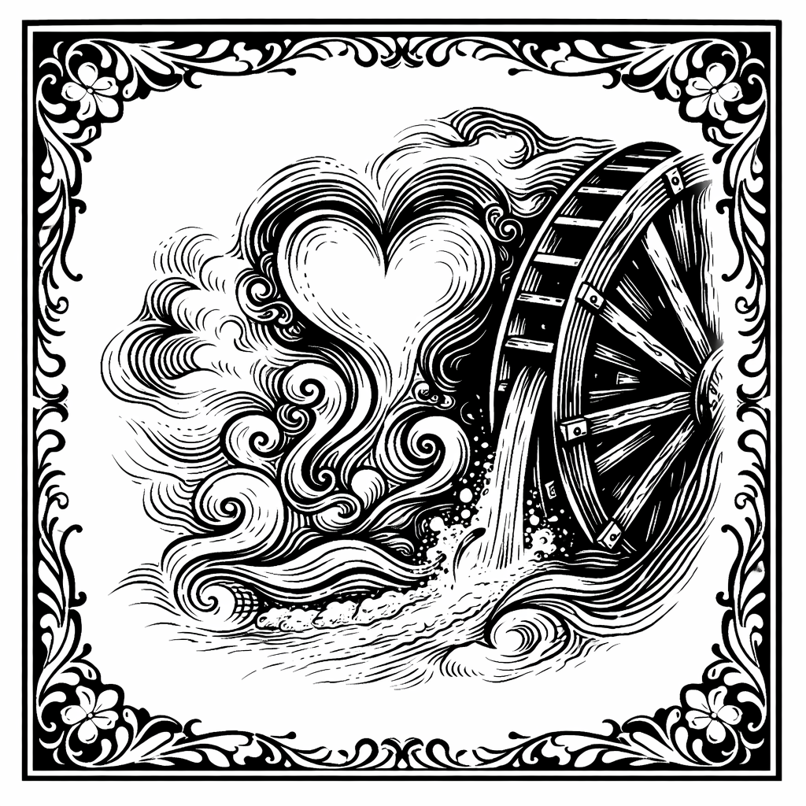{width=80%}


```{=latex}
\end{center}
\vspace*{\fill}
\newpage
```

# 7. Bölüm

Kara Durası o gece Çalca Deresi'ndeki inine geldiğinde karışık duygular içerisindeydi. Kendi kendine bir Şaziye'nin temizliğine bak, bir de benim kirliliğime. O ne kadar beyazsa, ben o kadar karayım; O ne kadar masumsa, ben bir o kadar çirkefim; O ne kadar aydınlıksa, ben o kadar karanlığım; O ne kadar gündüzse, ben bir o kadar geceyim. Kendime geceyim demek, geceye hakaret diye düşünüyordu. Aynı gece Kara Durası, Şaziye'yi, Şaziye Kara Durası'nı düşünerek uyudular. Şaziye'ninkine pek uyumakta denilemezdi aslında. Uykusu gördüğü rüyalarla sık sık bölündü. Hem de ne rüyalar, rüya değil, hepsi peş peşe sıralanmış kabuslar gibiydi. En sonunda Şaziye korkuyla fırladı yatağından. Yüreği daralmıştı. Önce yatağın ortasına oturarak derin derin nefes aldı. Sonra kalkarak bir bardak su içti. Perdeyi aralayarak dışarı baktı. Dışarıda ay ışığı da yoktu, kapkaranlık bir geceydi. Gece o kadar sessizdi ki, hemen yakınındaki ceviz ağacının yaprakları bile hışırdamıyordu. Tam o sırada cama çarparak hızla bir şey geçti. Şaziye korkuyla geri çekilirken yere yuvarlandı. Tahtaya çarpan başı acımıştı. Başını oğuştururken kendine güldü. —Korkak Şaziye, ne olacak uçan bir yarasaydı, bu kadar korkacak ne vardı.

Şaziye başını elleri arasına alarak o halde camın önünde uzun süre oturdu. Pencereden dışarı baktı, ortalıklarda Toraman da görünmüyordu. Toraman da bir kuytuya yatmış, uyumuştu galiba. Son zamanlarda huzursuzluğu epeyce artmıştı. Gördüğü rüyalar hep Kara Durası'na dairdi. Rüyalarında hep ölüm, çatışma, jandarmaların arasında elleri bağlı Kara Durası. Jandarmalar Kara Durası'nı götürürken çevreye toplanan insanlar ona kin ve nefretle bakıyorlardı. Akşam yatarken kapıyı sürgülemediği aklına geldi. Yatağından kalkarak kapının sürgüsünü arkasından sürdü. Pencerenin perdelerini de sıkı sıkı kapattı. Uzun zamandır korku nedir bilmeyen Şaziye'nin yüreğine bu gece derin bir korku çökmüştü. Derin derin nefes aldı, kendi kendine gördüğüm rüyalardan herhalde dedi. Yatağa yeniden sürttü. Gözlerinden akan yaşları yorganın çarşafına sildi, huzursuz huzursuz bir o yana, bir bu yana döndü durdu, daha sonra da yeniden uyudu kaldı. Gördüğü karabasan gibi rüyaların etkisiyle tedirgin ve huzursuz uyumuştu.

Bu karmaşık duygularla uyandı yine. Sabahleyin kalktığında hâlâ gördüğü rüyanın etkisindeydi. Çatışmada Kara Durası ölüyordu. Kara Durası ölünce köylüler hep birlikte Şaziye'nin evine yürüyorlardı. Şaziye tüm ısrarlara rağmen dışarı çıkmayınca evi taşlamaya başlıyorlardı: —Orospu Şaziye, Kara Durası'nın kapatması Şaziye, kirli Şaziye; çık dışarı, senin kanın akmayınca bu kir temizlenmez orospu Şaziye.

Evin tüm camları kırılmıştı. Daha sonra köylüler eve girmeye çalışırken yakınlarda iki el silah sesi duyulunca köylüler etrafta Kara Durası'nın adamları var diye çil yavrusu gibi dağılıyorlardı. Şaziye gece kararana kadar orada öyle kıpırdamadan oturuyordu. Sonra abdest alıp, iki rekat namaz kılıyor, ardından kararlı adımlarla ceviz ağacının dibine gidiyordu. Cevize tırmanan Şaziye ipi daldan geçirdikten sonra ilmeği boynuna geçiriyor, tam kendini bırakacağı sırada Kara Durası —Hayır, yapma— diye bağırarak uyandı.

Kürt Memo —Ne oldu ağam?— diye sordu ama hiç konuşmadı Kara Durası da, Şaziye de birbirlerinden habersiz aynı anda, aynı korkunç rüyayı görmüşlerdi. Kara Durası kafasını ellerinin arasına aldı bir süre düşündü kendi kendine.

—Ulan ben çift silahla dolaşıyorum. Hem mavzer, hem tabanca, bir de çevremde öl desem ölecek, vur desem vuracak bir sürü adam. Ben kabuslar görüyorum, ya o gencecik kız Şaziye ne yapıyor, ben ona ne yapıyorum. Kendimle beraber çirkefe onu da çekiyorum.

E ne len bu duygusallık. Ulan ben eşkıyayım, hem de en azılılarından. Ulan ben çağırmadım ya. O kendi geldi girdi hem koynuma, hem gönlüme. Ulan ne olacaksa olacak. Olacak da ulan ben sağken biri Şaziye'nin kılına dokunursa sülalesini kurutmayan Kara Durası'na bu dağlar haram olsun. Anam avradım olsun o Dereli köyü'nü baştan aşağı yakmazsam bana da Kara Durası demesinler.

Kara Durası uyuyamadı bir daha. Sigara üzerine sigara yaktı, daha sonra mağaranın önüne çıkarak havaya ateş etti, birkaç el. Kürt Memo —Ağam ne yapıyorsun, bir duyan olur— diyecek oldu, sonra yutkundu, vazgeçti. O sabah Kara Durası hiçbir şey yemedi. Çok sinirliydi, sinirinden sanki burnundan dumanlar çıkıyordu. Kaşları iyice çatılmış, kara yüzü iyice kapkara olmuştu.

Sabahleyin kuşluk vakti buluşma yerine gittiğinde İsa'nın onları beklediğini gördü. Atının dizginlerini sertçe çekerek atını durdurdu.

—İsa ağa selamünaleyküm, hazır mı istediklerim?

—Aleykümselam bre Durası kardaş.

—Daha önce de dediğimiz gibi para eksik bre. Veresiye verdik erkeçleri. Para gelince kalanını veririz.

Kara Durası gürledi, galiz bir küfür savurdu.

—Ben anlamam, nereden bulursanız bulun, 2 gün sonra getirin parayı buraya, getirmezseniz o Molla Mehmet'in sülalesini kurutmazsam bana da Kara Durası demesinler. Ulan biz burada oyun mu oynuyoruz, ulan biz Molla Mehmet'in keyfini mi bekleyeceğiz? Ulan biz dağda kelle koltukta yaşıyoruz, o ağa denecek deyyus bana martaval okuyor. Ulan veresiye verirken bana mı sordun.

—Ulan İsa ağa bu gün buraya sen değil de, başka biri gelseydi ibret olsun diye alnının ortasından vurur, cesedimi de köyün ortasına atardım. Zamanında bana iyiliklerin var, onlara say.

—Bre Durası ne bu kadar hiddet bre, vermeyeceğiz demedik ya, vereceğiz de şu anda değil, erkeçlerin parasını alınca diyoruz.

—Ulan İsa ağa ben bilmez miyim onda para olduğunu, bu sefer yastık altından versin deyyus. Hem sen demez miydin davar güderken paralar küpeciğin içerisinde duruyor, lazım olan alıyor diye.

—Bre Kara Durası tamam söylerim bulmaya çalışırlar ama bu deyyus falan ağır oluyor bre.

—Ne ağırı İsa ağa, ben nereden bileyim beni tufaya düşürerek jandarmaya yakalatmaya çalışmadığını. Onun kafasında kaç tilki dolaşıyorsa, benim kafamda on fazlası dolaşıyor. İsa ağa bilirsin benim şakam yoktur. Zamanında dediğimi yaptı, yaptı; yapmadı şart olsun sülalesini kuruturum. Önce o kıymetli oğlu Hüseyin'den başlarım. O veleti öldürür, cesedini kapısının önüne atarım.

—Tamam bre hiddetlenme anlatacağım dediklerini. Ben hâlâ aramızda bir hukuk, sevgi var zannediyordum, sende o da kalmamış herhalde.

İsa'ya doğru döndü: —İsa ağa, İsa ağa o dediğin hukuk olmasaydı çoktan alnının ortasından nalladıydım. Onlar seni gönderdiklerine dua etsinler.

İsa —Tamam bre— diyerek oradan ayrılarak gitti. Yolda atını hızlı sürmedi, atının üzerinde düşüne düşüne gitti. Kara Durası'nın dediklerini nasıl söyleyeceğini düşündü.

Atını dama bağladıktan sonra eve çıkarak Kara Durası'nın isteklerini anlattı. İki günleri vardı. Molla Mehmet, Kara Durası'nın Çalca Deresi'ndeki ininde kaldığını tahmin ediyordu. Hüseyin'i daha önce kaçırdığında oraya götürmüştü zaten.

Karar vermeleri için iki gün vardı. Jandarmaya haber verse belki orada kıstırırlardı ama yakalayana kadar jandarmalardan vurulanlar, ölenler olurdu. Molla Mehmet tüneli nereden bilsindi. Bu düşüncesinden vazgeçti. Jandarmaların vebalini alamazdı.

Parayı vermeye 2 gün sonra kendisi gidecek. Tam parayı verdiğinde belindeki tabancasını çekerek Eşkıya başı Kara Durası'nı vuracaktı. Kara Durası'nın vurulduğunu gören adamları belki dağılırdı. Ardından Memo'yu da vururdu. Adamların içerisinde Kara Durası'nı seven varsa, o da sadece Memo olurdu. Adamlar dağılmasa onu vursalar bile en azından memleket azılı bir eşkıyadan kurtulurdu.

Kendi kendine fırsat eline geçtiğinde akrebin başını ezeceksin, ezmezsen o akrep fırsatını buldu mu seni sokar. Pepe Hasan onu vurduğunda, Hasan elinde silah başında bekliyordu, su su diye inlerken verin su gebersin gitsin diyeceğime, Hasan kafasına bir mermi daha sık gebersin gitsin deseydim ya diye geçirdi içinden.

Molla Mehmet bu düşüncelerinden kardeşi Yakup'a bile bahsetmedi.

O sıralarda Şaziye odada sedirin üzerinde elini çenesine dayayarak saatlerce oturdu, düşündü, düşündü. Kendi kendine doluya koyuyorum almıyor, boşa koyuyorum dolmuyor, ben ne yapacağım dedi. Bir adamı beklemek, ne zaman gelecek, gelebilecek mi, yoksa vurulduğu haberi mi gelecek, hatta ölüm haberi mi gelecek; bunları düşündü durdu Şaziye.

Fadime teyzesi —Sen benim gelinim ol, seni oğlum Durası'na gelin alacağım— sözleriyle uzaktan uzağa sevmişti Durası'nı. Durası'nın eşkıya olduğunu duyunca karışık duygular yaşasa da, onu ilk gördüğünde yüreğinin pırpır atmasına engel olamamış, kendi isteğiyle girmişti koynuna.

Hepsi tamamdı da, bu kadınlara yaptıkları konusunda anlatılanlar hem kadınlık gururunu inciltmiş, hem de kendini o kadınların yerine koymadan alamamıştı kendini. Biliyordu bir gün ölüm haberi gelse sevdiği adamın ölüsüne bile sahip çıkamayacaktı. Tamam eşkıya meşkıyaydı da, bu kadınlara yaptıklarını bir türlü kabullenemiyordu. Bu yaşadıkları Şaziye'nin 17-18 yaşındaki gencecik yüreğine çok fazla geliyordu.

İsa yanlarından ayrılınca Kara Durası,

—Len Kürt Memo bu sinsi mollaya güven olmaz, gider jandarmaya haber verir. Gafil avlayacağız. Hemen yanına iki adam al köyün altından Yahyalar'ın evine sinsice yanaş. Pusuya yat, zamanını kolla. Hüseyin'i fırsatını bulunca kap gel, Hüseyin olmazsa ötekini Hasan'ı kap gel ama önce Hüseyin.

Hüseyin'in adı geçince Kürt Memo'nun yüreğini bir sıkıntı kaplıyordu. Hüseyin cesur çocuktu. Çakır gözleri çakmak çakmaktı. Hayalinde varlığına inandırdığı kendi oğluna benzetiyordu Hüseyin'i. Hüseyin'e bir zarar gelsin istemiyordu. İstemiyordu ama Kara Durası vermişti emrini, karşısından konuşmak olmazdı. Atlarına atlayarak Karamatlar Köyü'ne doğru sürdüler atlarını, yanına aldığı diğer iki çeteyle birlikte.

Kürt Memo yanına aldığı adamlarla sinsice köyün kıyısına kadar yaklaştı. Evin arkasındaki badem bahçesinde pusuya yattı. İşleri yaver gitmişti. Badem ağaçlarının yemyeşil dalları onların görülmesini engelliyordu. Onlar eve gidip geleni rahatça görebiliyorlardı. Uzaktan gelen çocuk sesleri onlara doğru yaklaşmaya başlamıştı. Çocuklar tam eve girecekleri sırada Hüseyin'i hızla kapar, o hengamede oradan atlarına atlayarak hızla kaçarlardı. Eve doğru yaklaşan diğer çocuklardan Hüseyin ile Hasan ayrılarak onların gizlendikleri evin arkasındaki badem bahçesine doğru gelmeye başladılar. Hüseyin ile Hasan tuvaletlerini yapmak için badem bahçesine girdiler. Tam çişlerini yapmış donlarını toplarlarken iki adam çocukların üzerine atlayarak yere yatırdılar. Çocukların debelenmelerine aldırmadan ağızlarını kapadılar. İki adam Hüseyin'in ağzını, ellerini bağlayarak debelenmesine aldırmadan atların bağlı olduğu yere doğru sürüklemeye başladılar. Kürt Memo korkudan büzülen Hasan'a,

—Git büyük babana söyle. Parayı dediğimiz zamanda, dediğimiz yere getirsin. Durası çok sinirliymiş de. Para gelmezse Hüseyin'in boğazını kesecekmiş de.

Kürt Memo atına doğru giderken, Hasan korkmuş bir şekilde ağlayarak eve doğru koştu. Evin giriş portal kapısını hızla açtıktan sonra ahşap merdivenleri hızla tırmanarak evin ikinci katına, evdekilerin birlikte oturdukları hayata çıktı. Hıçkıra hıçkıra,

—Fatma ana Hüseyin'i kaçırdılar, Hüseyin'i yine kaçırdılar.

Hasan Kürt Memo'nun dediklerini bir bir anlattı. Hasan hem korkudan, hem koşarak gelmesinden, hem de hızlı hızlı bir çırpıda anlatmasından nefes nefeseydi, zor nefes alıyordu. Fatma ana feryat ederek,

—Yetti gayrı, bu ne biçim ağalık, bu ne biçim memleket. Bir eşkıyayla başa çıkamadınız. Boyu devrilesi eşkıya bozuntusu geliyor, burnumuzun dibinden, tam da evimizin önünden kaçırıyor evladımızı. Neredeyse gelip yatağında uyurken kaçıracak evladımı. Mehmet ağa yetti gayrı, benim oğlum bu eşkıya bozuntusunun oyuncağı değil. Kadınlığımla ben gidip vuracağım şu pisliği. Ben onu bunu bilmem Mehmet ağa, sana bu güne kadar en ufak saygısızlığım olmadı. Ama yetti gayrı, oğluma bir şey olursa kocam demem, erim demem kalbini kırarım. Bu memleketin evlatları vatan uğruna şehit düşüyor, meydanı boş bulan bir çapulcunun yaptığına bak sen. Ali, Halil, Hüseyin, İsmail, bu köyden birçok genç vatanı uğruna savaşırken şehit düştü. Bu şehit düşen evlatlar, bu eşkıya dağda dolaştıkça, insanların canına, namusuna, malına tasallut ettikçe hem vallahi, hem billahi yerlerinde rahat uyuyamazlar. Dünün insan içine çıkmaya korkan bitlisi, bu gün başımıza bela oldu. Bu yılanın başı ezilmeli, ezilmezse demedi demeyin daha çok masumun canını yakacak.

Molla Mehmet bir şey demedi, diyemedi. Yakup ağabeyinin koluna girdi ikisi birden evden uzaklaştılar. Konuşmadan öylece yürüdüler. Yapılacak bir şey yoktu, vereceklerdi fidyeyi. Paraları yok değildi vardı ama hükümet yetkilileriyle birlikte hareket etmek istemişlerdi. Nereye kadar bu böyle sürecekti. Ne satsalar Kara Durası anında haberdar oluyor, paranın yarısını istiyordu. Kara Durası hep onlardan bir adım öndeydi. Onlara hareket alanı bırakmamak için müddet vermesine rağmen gaflete düşürmüş, tam da Hüseyin'in korumasız olduğu bir anda kaçırmıştı. Aslında Hüseyin'i her an kollar olmuşlardı. Bu gün daha 2 gün mühlet verdiğinden kollamayı bırakmışlardı bir günlüğüne. Sanki Kara Durası onlardan önce onların nasıl davranacağını hesaplar gibiydi. İsa kendi kendine söylenerek,

—Bre ben bu Durası'nı iyi bilirim; tamam tilkiliğe kafası çalışır da, bu kadar da değil hani. Bre neredeyse bizim düşündüğümüzü bile bilir gibi. Bence ona bu taktikleri Kürt Memo veriyor. Adam sanki heykel gibi; ne kızdığı, ne sevindiği, ne üzüldüğü belli.

Adamlar Hüseyin'i dört nala Çalca Deresi'ne kadar götürdüler. Kara Durası —Geldin mi len— diyerek Hüseyin'i atın üzerinden kucakladığı gibi yere indirdi. Hüseyin yere inerken tekmeler savurdu. İndirirken eli Hüseyin'in belindeki bıçağa değdi, çekti aldı bıçağı.

—Len Hüseyin verdiğim bıçağı yanında mı taşıyorsun?

O sırada Kürt Memo, Hüseyin'in ellerini ve ağzını çözdü.

—Evet yanımda taşıyorum, bıçağı her gördüğümde sen aklıma geliyorsun, senin karnını bu bıçakla deştiğim günü hayal ediyorum.

—Beni o kadar mı çok seviyorsun ulen. Bende hasretlik çekmeyesin diye sık sık seni getirtiyorum bak.

Kara Durası kahkahayla güldü.

—Hüseyin sağol be, sen benim karnımı deşecek yaşa gelene kadar ben yaşarsam büyük bahtiyarlık.

—Çok büyümeme gerek yok, elime fırsat geçerse ben bu yaşta da haklarım seni. Hem de şart olsun senin karnını, senin bıçağınla deşeceğim.

Kara Durası bir Şaziye'min, bir de bu Hüseyin'in hakaretlerine ses çıkartmıyordu. Şaziye'yi seviyor, hak veriyor, bu çocuğun da cesareti, korkmaması onun hoşuna gidiyordu. Kendisi o yaşlardayken varlığı yokluğu belli olmayan, herkes tarafından dışlanan bir çocuktu.

Hüseyin küfrediyor, tehditler savuruyor, Kara Durası ona gülüyordu. Kürt Memo da Hüseyin'i seviyor, ona bir şey olacak diye endişe ediyordu. Bu çocuk kaçırma işini Kürt Memo hiç sevmiyordu. Kara Durası yap diyor, o da mecburen yapıyordu. Hüseyin'i görünce eğer doğduysa benim oğlum da bu yaşlardadır diye içinden geçiriyordu. İçin için de Kara Durası bu çocuğa inşallah bir şey yapmaz diyordu. Gerçi Kara Durası da Hüseyin'e farklı davranıyor, onun küfürlerine bile gülüp, geçiyordu ama Kara Durası'nın ne yapacağı belli mi olurdu. Gözünü kırpmadan acımasızca işkence yaptığını, adam öldürdüğünü çok görmüştü Kürt Memo. Molla Mehmet karısı Fatma ananın bağırmalarına sesini çıkarmamış, çıkaramamıştı. Uyumadan saatlerce düşünmüş, sonunda bir karara varmıştı. Fidye verme zamanı gelince bu defa fidyeyi Molla Mehmet ben kendim götüreceğim dedi. Giyinmiş, atına binmek üzereydi. Yakup ağabeyinin amacını anlamıştı. —Olmaz ağabey sen Kara Durası'nı vursan bile, öteki adamlar da seni öldürür. Seni öldürmekle kalmazlar o hengamede maazallah Hüseyin'i de öldürürler. Parayı ben götüreceğim— dedi. Zor da olsa ağabeyini ikna etti. İkna etmesinde Fatma kadın etkili oldu.

—Verin şu itin istediği parayı, oğlumun tırnağına zarar gelirse bu köyü ikinize de dar ederim. Oğlumu alın gelin, ne yapacaksanız ondan sonra kararlaştırın.

Yakup ağa paraları bir huyraya doldurdu, sırtına mavzerini taktı. Beline görünmeyecek şekilde kuşağının arasına tabancasını yerleştirdi.

Esebe tarlasına gelince bir el ateş etti. Sıtma pınarı tarafından bu tarafa gel diye seslendiler.

Yakup ağa atını Sıtma pınarı tarafına sürdü. Onu orada Kürt Memo bekliyordu. Yakup ağa'ya bir işaret yaparak —Beni takip et— dedi. Çalca'dan Demirderesi'ne indiler, oradan Sarıcaerik, Haydan üzerinden Alanlar'a geldiler. Onları Kara Durası ve iki adamı bekliyordu. Hüseyin de elleri bağlı, yerde bir taşın üzerinde oturuyordu.

Yakup ağa selam verdikten sonra,

—Hüseyin yeğenim nasılsın, iyisin değil mi?

—İyiyim amca, iyiyim, şu Kara Durası'nın karnını deşebilseydim daha iyi olacaktı ya.

Kara Durası gevrek gevrek güldü,

—İyi baktık, hem de gözümüz gibi, çarşafları yeni değiştirilmiş yorganlar örtük üzerine ama kerataya bir şey yediremedik Yakup ağa. Bu Hüseyin büyüyünce yaman delikanlı olacak. Ondaki cesaret ne sende ne de ağan olacak o Mollada var.

O sırada çetenin diğer 5 elemanı Softalar tarafından tozu dumana katarak geldiler.

Yakup ağa para dolu huyrayı uzattı.

Kara Durası, —Bu sefer para geç geldi, bu sefer sayacağım vallahi. Memo çöz çocuğun ellerini.

Kürt Memo Hüseyin'in ellerini çözmüştü, Kara Durası da paraları sayıyordu. Tam o sırada yanından geçerken Hüseyin, Kara Durası'nın burnuna bir yumruk fırlattı. Kara Durası elinin tersiyle Hüseyin'i ittirdi. Tam o sırada bir eşkıya mavzerine davranınca Kara Durası,

—Dur ulen çocuğumu vuracaksın. Adamda mangal gibi yürek var. Sen bu güne kadar Eşkıya başı Kara Durası'na yumruk atmaya cesaret eden birini gördün mü?

—Ulen Hüseyin elin amma da ağırmış, baya da acıttın len. Karnımı deşerek kanımı akıtamadın amma, burnumu kanatarak akıttın.

—Onun da zamanı gelecek Kara Durası, merak etme onun da zamanı gelecek.

Kürt Memo bıyık altından gülüyordu. Kara Durası elindeki para dolu huyrayı Kürt Memo'ya fırlattı.

—Bak Yakup ağa bu son olsun. Bir daha yok veresiye verdiydik, yok yan yattı, çamura battı anlamam. Para istediğim zaman gelmezse işte siz o zaman göreceksiniz Kara Durası'nın acımasızlığını.

Hüseyin'e gülerek seslendi,

—Len Hüseyin fazla özletme kendini. Haberin olsun özlersem bu Memo amcanla haber gönderirim, onun terkisine atlar gelirsin. Ben atın terkisine binmem dersen şart olsun sana at da gönderirim len.

Hüseyin dik dik baktı Kara Durası'na. Bir şey diyecek oldu, amcasının karşıdan sus işaretini yaptığını görünce sustu, yutkundu.

Amcası Yakup'un getirdiği ata bindi Hüseyin. Kara Durası yanına gelerek kınlı bıçağı Hüseyin'in beline soktu.

—Unutma len beni, ben yok olsam da bu bıçağa bak beni hatırla, hiç unutma beni.

—Şüphen olmasın Durası, seni hiçbir zaman unutmayacağım.

Hüseyin bindiği atın dizginlerini çekerek atın yönünü köyden yana çevirdi.

Bu defa amcasıyla yan yana sürdüler atlarını. Hüseyin gözlerinden akan yaşları silerek, —Amca her defasında bunların eline düşüyorum. Amca siz kazandığınızı bu eşkıyaya mı yedireceksiniz?

—Sen bunları düşünme aslanım, biz bir çare bulacağız.

—Tamam da amca daha kendimi bile koruyamıyorum, her defasında düşüyorum bu itin eline. Anamın, abamın yüzüne nasıl bakacağım bilemiyorum.

Hüseyin amcasıyla konuşa konuşa, yan yana sürdüler atlarını. Amcası kendi kendine, şu çocuktaki cesarete bak, bir de bize bak. Bir çocuğu korumayı beceremiyoruz. Bir eşkıya bozuntusu ne isterse yapmak zorunda kalıyoruz dedi.

Köye geldiklerinde Hüseyin sanki suçluymuş gibi usulca atından indi. Fatma ana oğluna sıkı sıkı sarıldı. Hüseyin gözlerini yere eğdi, anasının yüzüne bakamadı.

Fatma ana oğlunu bağrına bastırırken, kocasına seslendi:

—Mehmet ağa ne yaparsan yap, bu işe bir son ver, benim yüreğim bunu bir daha kaldırmaz.

Fatma ana oğlunun yanaklarını iki eli arasına aldı. Oğlunun çakır gözlerinden süzülen gözyaşlarını cebinden çıkardığı bir mendille hafif hafif sildikten sonra, oğlunun yanaklarından defalarca öptü. Hüseyin de daha fazla dayanamadı sıkıca sarıldı anasına. Merdivenlerden koşarak gelen ablası Çakır Emine kardeşi ile analarına birlikte sıkıca sarılarak gözyaşlarını gizlemeye çalıştı.

Molla Mehmet karısına ne cevap vereceğini düşünürken kardeşi Yakup girdi lafa:

—Fatma yenge, bizim bu Hüseyin'de mangal gibi yürek var. Kara Durası'nın kanını akıttı. Çaktı burnuna yumruğu, oluk gibi kan akıttı. Bizim yapamadığımızı o yaptı vallaha.

Molla Mehmet gözlerinden akan yaşı göstermemeye çalışarak oğluna baktı. Evden koşarak gelen anasıyla kardeşine birlikte sarılan Çakır Emine kardeşini bir taraftan öperken, bir taraftan da heyecanlı heyecanlı konuşmaya başladı:

—Benim aslan yürekli kardeşim, sana bir şey yapmadılar ya. Gel yukarı sen o çetelerin yemeğini yememişsindir yine. Karnın acıkmıştır, sana sofra kurdum, haydi gel doyur karnını.

Abla kardeş birlikte çıktılar merdivenlerden. Hasan arkalarından yürürken, —Hüseyin kardeşim canını yakmadılar değil mi? Bir beş yaş daha büyük olsaydık biz onların hakkından gelirdik ya neyse— diye söyleniyordu. Hüseyin o kadar acıkmıştı ki sofradakileri sildi süpürdü, üzerine de koca bir kupa ayran içti. Gelen paraların keyfiyle bulunduğu yerde bir sigara tüttüren

Kara Durası para huyrasını Kürt Memo'ya işaret ederek,

—Memo bu paraları götüreceğin yerleri biliyorsun, biz Keskin tarafına gideceğiz, iki gün sonra döneriz. Hani uğrar Şaziye bacının gönlünü edebilirsen iyi de olur hani. Hem Çalca Deresi'ndeki sarayda onun için hazırladığımız torbayı götürmeyi de unutma. Başka bir şeye ihtiyacı var mıymış sor. 2 gün sonra mağarada buluşuruz.

Daha sonra atına atladı, diğer adamlarına,

—Haydin len sürün atlarınızı, arayı açana salarım kurşunu.

Bir saat kadar sonra Sürmeli yanlarında mola verdiler. Onlar atlarını otlatır, terlerini kuruturken Hasan Teyze atıyla çıktı geldi. Hasan Teyze sanki kırk yıllık binici gibi bir çırpıda atından atlayarak ince sesiyle kıkırder gibi konuşmaya başladı:

—Selamünaleyküm Durası ağam, geldiğinizi uzaktan görünce bir halinizi, hatırınızı sorayım dedim. Hoş geldiniz, safa geldiniz.

—Hoş bulduk len Hasan, keyfim yerindeydi, seni görünce daha da keyiflendim.

—Keyifin bol olsun ağam, seni bu kadar keyiflendiren ne?

—Ne olacak len Karamatlar'ın ağası Molla Mehmet'in uykularını kaçırdım. Oğlunu kaçırıp, dağa kaldırdım. Sattığı erkeçlerin yarısını haraç getirince oğlunu saldım.

Kara Durası, Hasan Teyze'nin ağladığını görünce,

—Ne oldu len Hasan bu kadar duygulandın. Duyguların mı kabardı?

—Ağam onlar benim akrabam da, ben Hüseyin'i pek severim, ondan gözyaşlarım.

—Ağlama len karı gibi, kafam atacak sonra, al şu sarı lirayı.

—Olmaz ağam, vallaha olmaz, sen onu Molla Mehmet dayımdan almışsın, ben o parayı alamam.

—Al len şunu kafamın tasını attırma, sana başkasından aldığım haraçlardan vereceğim, keyfim yerindeyken fazla zorlama bence. Ulan Hasan bir daha o molla ile ilgili bir şey söylersen şart olsun elimin tersini yersin. Hem şunu da bil, senin akraban olan o Molla Mehmet deyyusu haracı bir daha yine geciktirirse bu defa hem Hüseyin'i, üzerine de Molla deyyusunu kaçıracağım. Çamlardan sakız toplatıp, o uzun sakalına sakızları yapıştırıp, oğlunun gözü önünde bağırta bağırta sakallarını yolacağım.

Hasan Teyze bir eliyle atının dizginini tutarken, diğer eliyle Kara Durası'nın fırlattığı sarı lirayı havada yakaladı.

—Sağol ağam sayende atım, urbam oldu, cebimde de mangır, daha ne istesin bu fakir.

Kara Durası —Otur gel len— diyerek yanında yer gösterdi. Hasan'a çevrede olup bitenleri sordu. Hasan ne duyduysa, ne gördüyse bir bir anlattı. Hasan da artık Kara Durası'nın gönüllü muhbiri olmuştu. Kara Durası yanı başındaki şarap testisinden bir kupaya doldurarak Hasan Teyze'ye uzattı.

—İçlen şunu Hasan sen de bul biraz kafayı.

Hasan Teyze kupayı su içer gibi kafasına diker dikmez pufkurdu. Kırmızı şarap burnundan, dudaklarından geri püskürdü. Bunu gören Kara Durası yüksek sesle bir kahkaha attı.

Hasan Teyze ağzının kenarından sızan şarabı elinin tersiyle silmeye çalışırken kıkırdadı:

—Durası ağam bu ne, bu afat, bunu nasıl içersiniz. Bende şarap, şarap derler güzel bir şey sandıydım. Bu acı be ağam. Bir de bunu içip, zevklenir karı oynatırlarmış. Bu adama ne zevki verecek ağam, adamın içini yakar bu.

Hasan Teyze'nin bu tavrı Durası'nın hoşuna gitti. Adamlarına seslenerek,

—Ulen şurdan Hasan Efe'ye kuru et getirin, bir de ekmeğe bal sürün getirin.

Hasan gelenleri iştahla yedi, bir taraftan da yudum yudum şarap içmeye başladı. Sonunda Hasan kafayı iyice buldu.

—Ağam bu ateş suyu dediklerinden galiba. Karnımı ateş gibi yaptı şimdiden. Ağam ben karar verdim, ben de eşkıya olacağım.

Hasan sallanarak ayağa kalktı.

—Len kızanlar daha şarap getirin, Hasan çeteciliğe soyunacak.

Diğer eşkıyalar gülmemek için kendilerini zor tutuyorlardı. Gülerlerse Durası ne tepki verecek bilemediklerinden temkinli davranıyorlardı. Sonunda Kara Durası,

—Hasan Efe sen atına bin git evine, bir güzel dinlen, kalanını sonra düşünürüz.

Kara Durası'nın adamları Hasan Teyze'yi çuval gibi attılar atının üzerine. Hasan Teyze türkü söylemeye çalışarak köyüne doğru yollandı. O sırada Kara Durası'nın aklına bir hafta kadar önce Molla Mehmet'e ettiği gelince keyiflenerek güldü.

Bilyaz tarafından geliyorlardı, Karamatlar köyünün içerisinden yine tozu dumana katarak dört nala geçecekler, köylüye korku salacaklardı. Bağdet çeşmesinde su içmişler, atlarını sulamışlar, atları çayırda otlarken biraz da dinlenmişlerdi. Kendi kendine Durası,

—Ulan bizi böyle silahları çayıra uzatmış, kendimiz de çayırda güvenliği düşünmeden Molla Mehmet görseydi ne yapardı acaba— diye düşündü. Daha sonra —Ne yapacak korkar, görvezlikten gelir, sıvışırdı— diye düşündü.

Atlarına yeniden binerek Karamatlar yönüne sürdüler. Bağdet başına gelince tarlada birinin çift sürdüğünü görünce Kara Durası atının dizginlerini çekerek durdu. Hemen atından yere atlayarak çiftçiye doğru seslendi:

—Selamünaleyküm çiftçi, sen kimsin, nerelisin? Karamatlarlı mısın, yoksa Pirler'li misin?

—Aleykümselam Durası, tanıyamadın mı beni?

—Len Molla Mehmet sen misin? Ben seni gökte ararken yerde buldum. Ulen deyyus Molla, çoktan beri adam vurmadım, parmağım kaşınıp dururdu zaten. Bu gün seni öldüreceğim ama söyle nerenden vurayım. Bak bu kadar da gani gönüllüyüm, vurulma yerini sana bırakıyorum. İster alnının ortasından, ister kalbinin üzerinden, ister karnını mermiyle doldurayım, istersen kıçından vurayım. Hani iyi de nişancıyımdır hani, iddiaya girelim ben seni dediğin yerinden vuramazsam, sıra sana geçer, sen beni vurmaya çalışırsın.

Kara Durası belinden tabancasını çıkardı, Molla Mehmet'e seslendi:

—Kuşağını çözlen Molla, o belindeki tabancayı da yere at.

Molla Mehmet belindeki tabancayı yere bıraktı, ardından belindeki kuşağı çözerek kara sabanın üzerine bıraktıktan sonra,

—Durası yettiyse yetti artık. Beni vuracağın belli artık. Vur vur ama beni ölecek yerimden vur. Eğer ölmezsem bu defa ben dağa çıkar, senin peşine düşer, senin leşini yere sererim.

Kara Durası bir kahkaha koyuverdi.

—Kızanlar duydunuz mu Molla dağa çıkacakmış, beni vuracakmış.

Bu defa hep bir ağızdan diğer eşkıyalar güldüler.

—Ulan Molla seni öldürür müyüm hiç, seni öldürmeyeceğim, biraz eğlenelim dedim. Sen benim altın yumurtlayan tavuğumsun, seni öldürürsem bir daha bana artık hangi tavuk yumurtlayacak?

Tabancasını çekerek Molla Mehmet'in kafasının hemen üzerine doğru ateş etti. Silahtan ürken öküzler hızlandılar. Molla Mehmet lahavleva çekerek öküzlerin ardından seyirtti. Bunlar aklına gelince Durası keyiflenmişti. Adamlarına dönerek,

—Haydin len eşkıya yolunda gerek.

Molla Mehmet, Kara Durası'nın çift sürerken kendine yaptıklarını kardeşi Yakup'a bile anlatamadı, utandı. Daha sonra Kara Durası ve adamları yerlerinden kalktılar atlarına bindiler. Hava kararınca Elmümin yakınlarındaki değirmene vardılar. Tüm değirmenleri haraca bağlamıştı Kara Durası. Bu savaş yıllarında ağalardan sonra iyi kazanan başka birileri de değirmencilerdi. İnsanlar ekmek yapabilmek için ne kadar varsa ellerindeki buğdayları öğütüp, un yaptırmak zorundaydılar. Bu unlarla da karın doyurmak için en önde gelen ekmeği yapıyorlardı. Bazen günlerce sadece kuru ekmek yiyorlardı. Buğdayları bitince hayvanlarına yedirmek için ayırdıkları arpaları öğüterek un yaptırıyorlardı. Gerçi arpa unundan yapılan ekmek çok esmer, tatsız-tuzsuz bir şey oluyordu ama aç kalmaktan iyiydi. Değirmenciler gelen müşteri ne kadar buğday veya arpa öğütürse öğütsün o hakkını bilir, hakkını alırdı. Bu nedenle değirmenciler memleketin hali vakti yerinde olan insanlarındandı.

Kara Durası neredeyse değirmenlerin hak olarak aldıklarının yarısına el koyar olmuştu. Bu değirmenci de illallah demişti artık. Değirmenci kendisi gibi değirmencilik yapan diğer değirmencilerle görüştüğünde onlar da Kara Durası'nın aldıkları hakların yarısına el koymasından muzdariptiler. Muzdariptiler ama korkularından ne bir şey yapabiliyor, ne de bir şey söyleyebiliyorlardı. Aralarında konuşurken bile ya bir duyan olursa diye korkuyorlardı. Birbirlerine —Aman kardaş yerin kulağı var, bir yerlerde söylemeyelim, sonra anamızı ağlatır— diyorlardı.

Değirmenci günlerce düşündü, uykusuz geceler geçirdi, sonunda bir karara vardı. Değirmenci kafaya koymuştu artık haraç vermeyecekti. Değirmenci konuyu yanında çalışanlarla konuştu, adamları korkularından başta çok itiraz etseler de, daha sonra razı oldular. Değirmencinin planı doğru işler Kara Durası belasından kurtulurlarsa yanında çalışan adamların maaşlarına yarı yarıya zam yapacaktı. Adamları baştan çok korksalar da, maaşın yarısı kadar zammı duyunca razı oldular, —Sen ne dersen biz onu yaparız— demeye başladılar.

Yanında çalışan iki adamıyla anlaşmışlardı. Değirmencinin genç ve kuvvetli olan yardımcısı Kara Durası'nın yalnız olduğu bir anda sıkıca yakalayacak, değirmenci de elindeki bıçakla delik deşik edecekti Kara Durası'nı. Diğer değirmenci dışarıdaydı. O sırada değirmenciyle genç yardımcısı içerideydi. Kara Durası tek başına girdi içeriye. Kara Durası değirmenin kapısını açar açmaz kükredi.

—Len değirmenci neredesin, ulan değirmenin su oluğuna mı düştün. Yoksa korkudan altına mı yaptın?

—Buradayım ağam, buradayım. Geleceğini duydum, yatacağın odayı hazırlatıyordum.

—Aferin len değirmenci işte böyle ol, sormaya gerek yok her halde, haracım hazır değil mi?

—Hazır ağam, hazır; bu hafta işler kesattı, zor oldu ama hazırladık.

Her şey kolay olacak gibiydi. Kara Durası adamlarına seslendi:

—Köyü kuşatın, bir kontrol edip gelin.

Kara Durası içeri girip, orta yere geldiğinde değirmencinin adamı bir hamle yaptı. Kara Durası hızlı bir hamle yaparak geri zıpladı. Kara Durası belindeki tabancasını hızla çekerek değirmenciden yana doğrulttu:

—Davranmayın ulen, yakarım.

O sırada elleri mavzerlerinin tetiklerinde 3 eşkıya daldı içeriye. Beraber karar almışlardı sözde ama değirmencinin dışarıda kalan adamı Kara Durası'nın muhbiriydi. Alınan kararı hemen iletti Kara Durası'na. Kara Durası da oyunu sonuna kadar devam ettirdi.

Adamlarına seslendi:

—Bağlayın len bunları sıkı sıkı bağlayın.

Adamları her ikisini de değirmenin önündeki ağaca bağladılar.

—Bunlar sabaha kadar burada bağlı kalsınlar, cezalarını sabah keseceğim.

Kara Durası değirmencinin karısına sofra kurdurdu. Karnını doyurdu, rakısını içti, sonra hiçbir şey olmamış gibi gitti, yatıp uyudu.

Sabahleyin yine hiçbir şey olmamış gibi kahvaltısını yaptı. Değirmencinin sesi çıkmıyordu ama adamı sürekli diller döküyor, yalvarıyordu. Elindeki kırbaçla genç yardımcıya defalarca vurdu. Vurdukça genç çırağın çığlıkları arşa ulaşıyordu. Boynundan akan kanlar aşağı doğru sızıyordu. Sonunda adamlarına —Bırakın şu iti gitsin— dedi. Adamları genç yardımcıyı çözdüler. Acılar içerisinde kıvranan yardımcı ayağa kalkmak istese de kalkamadı, yere yuvarlandı. Acılar içerisindeydi ama, korkudan da ölecek gibiydi. Emekleyerek oradan uzaklaştı. Değirmenci sesini çıkarmadan öyle bekliyordu.

Kara Durası'nın adamları köydeki evleri kapı kapı dolaşarak tüm köyün insanlarını değirmenin önüne toplamıştı. Akşam değirmende yaşananlar kulaktan kulağa tüm köylülere ulaşmıştı. Kara Durası'nın adamları kapılarını çalıp, —Hemen değirmenin önünde toplanın— dediklerinde korkularından seslerini çıkaramamış, endişeyle çoluk çocuk değirmenin önünde toplanmışlardı. Köy küçük bir manav köyüydü, neredeyse köyde herkes birbirine akrabaydı. Toplananların kimisinin amcası, kimisinin dayısı, kimisinin eniştesi, kimisinin yeğeni, kimisinin abisi, kimisinin kardeşi, kimisinin komşusuydu değirmenci. Değirmenci köylülerinin gözüne bakmamak için gözlerini yere çevirdi. Olacaklardan korkan değirmencinin karısı, kocasını afetmesi için yalvarıyor ama sanki onu Kara Durası duymuyordu.

Kara Durası yerinden kalkarak gözlerini toplanan insanların üzerinde dolaştırdı. Kime baksa korkudan bakışlarını yere indiriyordu. Kara Durası daha sonra değirmenciden yana dönerken eli belindeki tabancasına gitti.

Kara Durası belindeki tabancayı çıkararak değirmenciye doğrulttu. Tabancayı bir el ateşledi. O sırada çocuklar ve kadınlar korkuyla çığlık attılar. Değirmencinin alnının ortasına bir delik açılmış, delikten kan sızıyordu. Değirmencinin kafası sağ omzunun üzerine düşmüştü. Değirmencinin karısının ağıtları yürekleri dağlıyordu. Kara Durası tabancasını beline soktu, köylülere sert bir bakış fırlattıktan sonra Kara Durası hiçbir şey olmamış gibi atına bindi:

—İbret olsun, bana karşı gelmenin ne olduğunu cümle âlem duysun. Haydi len sürün atlarınızı gidiyoruz. Değirmencinin karısı sana sesleniyorum. Bir daha geldiğimizde haracımızı hazırla. Haracımız hazır olmazsa sizinle birlikte yakarım bu değirmeni ibreti âlem olsun diye.

Kara Durası 5 adamıyla birlikte gelmiş, şimdi 6 adamıyla birlikte tozu dumana katarak ayrıldı. Değirmendeki adamı deşifre olunca onu da yanına alarak ayrılmıştı.

Çiftlik köyü civarına gelince içinde on sarı lira olan bir kese fırlattı adama:

—Senden çeteci olmaz, bana ayak bağı olursun. Bu altınları al, toz ol, altındaki at da senin. Nereye gidersin kendin karar ver. Haydi yolun açık olsun.

—Sağol Kara Durası ağam, ben toz olurum, memleketi terk eder, başka bir diyarda kendime yeni bir hayat kurarım.

Kara Durası adamlarıyla birlikte tozu dumana katarak uzaklaştı. Muhbir adam da atını Gölpazarı yönüne çevirdi. Nereye gitti, kimse bilemedi, bir daha gören de olmadı.

Kara Durası'na muhbirlik yapan kişilerin birçoğu az çok biliniyordu ama böyle hiçbiri aleni deşifre olmamıştı. Bu muhbirlik çok acı sonuçlanmıştı; adamlardan biri acımasızca öldürülmüş, diğeri öldüresiye kırbaçlanmıştı. Köycek köylü; kadını, erkeği, yaşlısı, çocuğuyla büyük acı yaşamış, ama ellerinden hiçbir şey gelmemiş, gözyaşlarını akıtarak olayı izlemek zorunda kalmışlardı. Daha sonra değirmencinin karısı acı içerisinde feryat etmiş, Kara Durası'nın ardından hiç kimse korkusundan bir şey söyleyememişti. Kara Durası ve adamları gözden kaybolunca köylüler değirmenciyi bağlı olduğu yerden indirerek yıkayıp, kefenlediler. Aynı gün değirmenci öğle namazına müteakip, köy mezarlığına defnedildi.

Kara Durası aradan 15 gün kadar geçtikten sonra sanki hiçbir şey olmamış gibi iki adamını değirmene göndererek haracını istedi. Değirmeni ölen değirmencinin karısı, 15 yaşındaki oğluyla birlikte işletmesini sürdürüyordu. Kadın itiraz bile etmeye cesaret edemedi, istenilen haracı verdi.

Kara Durası artık o kadar pervasızlaşmıştı ki, haracını artık sanki bir vergi alıyormuş gibi açık açık yapar olmuştu. Kim ne satsa haberi oluyor, hemen haracını istiyordu. Karamatlarlı efeler Gerişler tarafındaki zenginlerden haraç alıyorlar, başka bölgelere pek uğramıyorlardı. Onlar hep 3 efe birlikteydiler. Sanki Kara Durası çetesi ile aralarında zımnen bir anlaşma oluşmuştu. Her iki gurup da birbiriyle karşılaşmaktan çekiniyordu.

Gölpazarı Nahiye Mutasarrıfı Osman Kadı bir gün Molla Mehmet'i makamına davet etti. Molla Mehmet Bursa pazarından yakın arkadaşı Yamacı Hasan ile birlikte peynir satmaktan dönüyordu. Molla Mehmet haberi Bursa dönüşü uğradığı jandarma komutanından aldı. Arkadaşı Yamacı Hasan'a bacanak diye hitap ederdi.

—Bacanak sen atları hanın damına bağla, ben gideyim mutasarrıf efendiyle bir görüşeyim, bakalım ne istermiş.

—Tamam bacanak sen git, ben atları ahıra çeker, yem torbalarını takarım, bu arada atlar da dinlenmiş olur.

Molla Mehmet hükümet binasında aldı soluğu.

—Selamünaleyküm mutasarrıf efendi, beni istemişsiniz, jandarmaya uğradıydım, komutan söyledi.

—Hoş safa geldin, Mehmet bey. Bir konuşalım dedim, bu Kara Durası olayı iyice canımı sıkmaya başladı. Vilayet'te sıkıştırmaya başladı, bir adamı yakalayamadınız diyorlar. Bu adam iyice gemi azıya aldı. Vergi alır gibi milleti haraca bağladı.

—Öyle mutasarrıf efendi. Ne satsam haberi oluyor, paranın yarısını istiyor, vermezsem oğlumu kaçırıyor. Oğlumu 3 defadır kaçırıyor. En sonunda sattığım hayvanların parasını alamamıştım, veresiye vermiştim. Bir gün bile gecikince oğlumu kaçırdı yine, iyice illallah dedim.

—Mehmet ağa, jandarmaları gönderdik onlar da bir şey yapamadı.

—Mutasarrıf efendi jandarma köye gelmeden adamın haberi oluyor. Her köyde bir de değil, iki muhbiri var. Korkarım kasabada, hatta devlet görevlileri arasında bile muhbirleri var, yoksa nereden haberi olacak. Jandarma en son köye geldiğinde, jandarma köye gelmeden 4-5 saat önce biz jandarmanın geleceğini biliyoruz der gibi dört nala, tozu dumana katarak, kır tarafına geçip, gittiler. Hemen Göynük köylerine geçiyorlar ki, Jandarma Gölpazarı sınırları dışında takip yapmaz diye düşünüyor galiba.

— Öyle bir şey yok Mehmet ağa, eğer yakalama ihtimali varsa Göynük topraklarında da takip ederiz ama ne yazık ki elde yeterli kuvvet yok. Kuvvetlerimizi Sakarya vadisine gönderdik. Orada sürekli giriş, çıkışlar var. Savaş biliyorsun tüm hızıyla devam ediyor. Allahın izniyle bu savaşı kazanacağız. Ege taraflarında oluşturulan Kuvayi milliye birlikleri buralarda da oluşturulmaya başlandı. Bu birlikler Sakarya Nehri'ni geçerek Yunan kuvvetlerine saldırıyorlar, sonra yeniden Sakarya'yı geçerek bu tarafa geçiyorlar. Sık olmasa da bazen Yunan kuvvetlerinin kuvvacıların peşinden bu tarafa geçtiği oluyor, o nedenle elimizdeki az olan kuvvetleri de o yana sevk ettik. Vatanı kurtardıktan sonra bu Kara Durası gibi çetelerin kökünü kazırız da şimdi de meydanı onlara bırakacak değiliz. Mehmet ağa Ankara Hükümeti bir karar aldı, ben seni esas onun için çağırdım. Efeler milli kuvvetlerle işbirliği yaparlarsa af edilecekler, savaş bitince de tezkerelerini alacaklar. Haklarında hiçbir soruşturma yapılmayacak. Sizin köyden de bir efe gurubu vardı galiba değil mi?

— Var mutasarrıf efendi. Onlar üç kişiler, adları Nuri, Süleyman, Hasan. Onlar Göynük köylerinde zenginlerden haraç alıyorlar, aldıklarının bir kısmını da muhtaç insanlara dağıtıyorlar diye duydum.

Mehmet ağa adama ihtiyacımız var, adam kazanmalıyız. Vilayetten efelerle görüşüp, milli kuvvetlerle birlikte hareket etmelerini sağlamamızı istiyorlar.

Mutasarrıf bey üçü de iyi, cesur delikanlılardır. Neden yıllarca cephelerde savaştıktan sonra efe olup, dağa çıktılar bir türlü aklım almaz zaten. Nuri deli doludur amma Süleyman ve Hasan sakin delikanlılardır.

— Sen onlara bir haber versen, benim yetkilendireceğim bir memurla senin evde görüşseler. Teklifimiz şu: Kara Durası çetesinin takibine çıkacaklar, jandarma ile birlikte, devlet de onları af edecek.

— Konuşurum mutasarrıf efendi, akılda veririm, razı etmeye çalışırım.

— Sen bir görüş, bana haber ilet, ona göre bir yol çizelim birlikte. Devlet yıllarca düşmanla savaşmış ardından bir hata yaparak efeliğe soyunmuş evlatlarına kıymak istemiyor, onları yeniden kazanarak, yeniden vatan için mücadele etmelerini sağlamak istiyor. Bu arada Mehmet ağa şu sıralar ovada tarla fiyatları pek uygun. Senin kenarda vardır biraz paran. Gel sana ovadan arazi alalım. Sana istersen Yeniköy'ün sırtlarında, istersen Sandıkaltı mevkiinde davarın için orman arazisinde saya yeri de ayarlarız. Hiç olmazsa seni bu beladan kurtarırız, ne dersin?

— Mutasarrıf efendi memleket zor durumda biz de katlanacağız tabi. Kadınlar ve çocuklar fazla etkileniyor. Kara Durası'nın takibine çıkılacak madem askere kalacak yer lazım, iaşesinin sağlanması lazım, bu nedenle bu dönemde ben köyde kalırsam daha iyi olur. Müsaade ederseniz kardeşim Yakup ile ben de katılırız takibe. Hele biraz daha sabredelim, oğlumu bir daha kaçırmaya kalkarsa o zaman onları kasabaya yerleştirir, davarı da getirir, biz de sonra geliriz. Biraz bekleyelim bakalım, zaman ne gösterecek.

— Mehmet ağa ben sözümdeyim, sen ne zaman istersen ben yardımcı olmaya hazırım.

— O zaman bana müsaade mutasarrıf efendi, yolcu yolunda gerek, bir yolunu bulup, haber göndereyim.

— Selametle git, Mehmet ağa, haberini bekleyeceğim.

Molla Mehmet mutasarrıf ile vedalaştıktan sonra aşağı atların yanında bekleyen bacanağı Yamacı Hasan'ın yanına indi.

Molla Mehmet haberi heyecanlı heyecanlı arkadaşı Yamacı Hasan’a anlattı, bu haber onunda hoşuna gitti.

Atlarına atladılar, köye sürdüler.

Molla Mehmet Çiftlik köyünde evli olan kız kardeşi Ayşe’ye uğramadan gitmezdi. Uzaktan atları gören kardeşinin kızı koşarak dayı diye Molla Mehmet’in boynuna sarıldı.Molla Mehmet yeğenine hediye olarak Bursa’dan aldığı şekerleri ve kunduraları verdi. Zehra dayısının yanaklarından öperek memnuniyetini dile getirdi. Ablasınada hediyeler almıştı, onlarıda verdi.Kız kardeşi Ayşe hep bir mahsundu. Sanki köyünü özler gibiydi. Gerçi iki köy arası yaya 1,5 saat kadardı. Ayşe başka bir köye gelin gitmesine bir türlü alışamamıştı. Kızı vardı, kocasıda iyi adamdı ama o köyünü özlüyordu Molla Mehmet arkadaşıyla birlikte soluklanıp,ayranlarını içtikten sonra kardeşinden yola devam etmek için müseade istedi..Molla Mehmet kardeşine sıkı sıkı sarıldıktan sonra vedalaşarak atına binerek oradan ayrıldı Arkalarından kardeşi ve kızı Zehra el sallarlarken kardeşi sesleniyordu,

— Abi Fatma yengeme çok selam söyle, gönderdiği peynirler pek lezzetliydi, ellerine sağlık.

Köye gelince bu defa ev halkının hediyelerini verdi. Oğlu Hüseyin artık 11 yaşındaydı. Çoktan beri tüfek istiyordu. Oğluna bir av tüfeği almıştı bu defa Bursa’dan. Hüseyin tüfeği görünce havalara uçtu. Molla Mehmet’in bir şartı vardı; Tüfeği Hüseyin kullanırken yanında mutlaka ya kendisi, ya Yakup amcası, ya da İsa eniştesi olacaktı. 2 sene sonra 13 yaşına girdiğinde o zaman kendi başına ateş etmesine izin verecekti. Eğer habersiz alırsa tüfeği o zaman hemen gider satardı.”

Molla Mehmet , mutasarrıf ile konuştuklarını ayrıntılı bir şekilde kardeşi Yakup ile damadı İsa’ya anlattı. Bu konuşmadan 3 ünden başka kimsenin haberi olmayacaktı. Evdeki kadınlardan bile hiç birinin haberi olmayacaktı. Sonunda İsa’nın gidip efeleri bulması ve konuşması kararlaştırıldı. Ertesi sabah İsa atına atlayarak Gerişler tarafına yola çıktı. Kara Durası’nın Taraklı tarafında olduğunuda öğrenince rahatladı İsa. Gece Dumanköy’ünde kaldı. Efelerin Narzanlar’da olduğunu öğrenince rahatladı.Sabahleyin erkenden yola çıktı. Kuşluk vakti efelerin yerini buldu. İsa’yı karşılarında gören efeler şaşırdılar.

Katil Nuri , İsa’ya sarılarak,

“Len enişte senide askere çağırdılarda, sende dağa çıkıp, bize katılarak efe olmayamı karar verdin.”

“Yok be bre, öyle bir şey yok Biz mübadil olduğumuzdan bize askerlik yok bre.”

İsa

Kayınbabasının dediklerini bir bir anlattı. Katil Nuri anında tepki gösterdi, bizi tuzağa düşürecekler biz bu oyuna gelmeyiz  dedi. Kel Süleyman efe ile Pepe  Hasan dur be Nuri, müsaade et adam anlatsın dediler.

İSA her şeyi ayrıntılı olarak anlattı.

“Bre siz kayın babam Molla Mehmet Ağa’yı tanımazmısınız ? O hepinizi de çok sever. O size zarar verecek bir şeye aracı olurmu hiç.	“ Kayınbabam kefil, görüşme kabul ederseniz, bizim evde olacak dedi İsa ilave etti,

“Efeler Ankara Hükümeti başkanı Mustafa Kemal efelere çok değer veriyormuş. Bu efelerden oluşturduğu kuvvetlere Kıvayi Milliye Birlikleri diyormuş. İzmir,Aydın,Kütahya,Uşak dolaylarında bu kuvvacılar düşmana kök söktürüyorlarmış.”.

Efeler aralarında konuştular Süleyman ve Hasan efeler,Nuri Efe’yi ikna ettiler,, en azından bir görüşmeye karar verdiler. Bir hafta sonra gün belirlediler İsa bu işi becermenin gururuyla kalktı efelerin yanından. . İsa vedalaşarak ayrıldı Atını sürerek yine Gerişler, Dumanköy, Akçapınar, Çaputlu Türbe üzerinden köyü Karamatlar’a döndü. Gelirken verilen görevi başarmanın keyfiyle memleketi Balkanlar’a ait bir türkü tutturdu.

“Aman bre deryalar, kanlıca deryalar, biz nişanlıyız, ikimiz de bir boydayız Yusufum, biz deli kanlıyız.”İsa sevinçten,gururdan atıyla yel gibi uçarak gelmişti. Yolun ne zaman bittiğini anlamamıştı bile.

İsa köye gelir gelmez  konuştuklarını kayın babasına ve Yakup amcasına anlattı. Molla Mehmet duyduklarından mutlu oldu. Kardeşi Yakup’a dönerek,

“kardeşim bu görev senin, sen bu gece sabaha karşı kimse görmeden yola çık. Sabahleyin erkenden mutasarrıf efendiyle konuş durumu anlat. Dönüştede yine gece yola çık, daha güvenli olur.

“

“Tamam ağabey,meraklanma sen,aynen dediğin gibi yaparım.” Yakup ağakasabaya giderek mutasarrıf efendiye olanları anlattı Mutasarrıf da anlatılanlardan hoşnut kaldı. Hem bir efe gurubunu takip etmek zorunda kalmayacaklar,hem de Kara Durası Çetesi’ni takibe çıktıklarında bölgeyi çok iyi tanıyan,iyi silah kullanan 3 adamı daha olacaktı.. Belirlenen  günde mutasarrıfın görevlendireceği memurda köye gece gidecekti.

Mutasarrıf jandarma komutanını görevlendirdi efelerle görüşmek için. Önce yatsıya yakın jandarma komutanı geldi Molla Mehmet’in evine. Daha sonra efeler 15 er dakikalık aralıklarla önce katil Nuri, ardından  Hasan, en sonra da Efe Süleyman geldiler. efeler aralarında Süleyman  Efe’yi sözcü seçmişlerdi Süleyman 3 efenin arasında en sakin olanlarıydı. Çabucak parlamaz,düşünmeden konuşmazdı..

Hoşbeş ve kahvelerden sonra komutan söze başladı,

“Efeler üçünüzün de secereleri, hangi cephelerde savaştığınız, ne zaman dağa çıktığınız, kime ne yaptığınız elimdeki dökümanlarda var  Allahın izniyle bu millet Kurtuluş Savaşını kazanacak, emperyalistleri hayal kırıklığına uğratacak. Emperyalistlerin uşağı Yunan kuvvetlerinin son darbeyi almaları yakındır. Ankara Hükümetimiz savaş olan bölgelerde daha önce uygulandığı gibi , kasabamız gibi savaş dışında kalan bölgelerdeki efelerle anlaşarak milli kuvvetlere kazandırmayı düşünüyor. Benim size teklifim vali bey adına; Ben ne zaman istersem benim komutama gireceksiniz. Tam teçhizat silah taşımaya devam edeceksiniz. Hatta tüfek, mermi gibi malzemelere ihtiyaç duyduğunuzda biz size vereceğiz. İstihbarat toplayacaksınız. Eşkıya Kara Durası’nın yerini öğreneceksiniz. Hep birlikte pusu atacağız. Kara Durası ve adamlarını ölü veya diri ele geçireceğiz. Takip anında askerle birlikte hareket edeceksiniz. Takip yoksa o zaman köyünüzde bekleyeceksiniz, anlaşmayı kabul ederseniz bundan sonra haraç almak yok Sadece bu da değil bu Kara Durası çetesini bertaraf ettikten sonra yine benim komutamda ben çağırdığımda birlikte başka eşkıyaların takibine çıkacağız..

“komutan konuşurken Katil Nuri yerinde zor duruyordu. Onun konuşmadan duramayacağını bildikleri için gurup sözcüsü olarak Süleyman  Efe’yi görevlendirmişlerdi. Katil Muri’nin dudakları kıpırdamaya başlayınca susturmak için Pepe  Hasan, Katil Nuri’nin dizine dürtüyordu. Sonunda Kel Süleyman  efe,

“Tamam komutan siz anlattınız, biz dinledik. Bizim neler yapmamız, neler yapmamamız gerektiğini anlattınız. Bu gün bir dönüm noktası olacağı anlaşılıyor. Biz bu anlaşmayı kabul edersek ne olacak, kabul etmezsek ne olacak?”

“Önce kabul etmezseniz ne olacak ondan başlayayım; Bu güne kadar sizleri eşkıyadan ayrı tuttuk, ona göre davrandık, aslında sizlerde suç işliyorsunuz. Bu efelerle ilgili meclis karar aldı kabul edip, milli güçlerin emir ve komutasına girecek olan efeler kuvayi milliye birrlikler i adı altında resmi hüvviyete kavuşacaklar. Vatan kurtulup, düşman sürülünce aynı askerdeki silah altındaymış gibi teskere alacaklar. Size gelince bizim bölgemizde düşman kuvveti olmadığından sizin düşmanla savaşma gibi bir durumunuz yok. Anlaşmayı kabul etmezseniz aynı Kara Durası gibi Eşkıya çetesi muamelesi göreceksiniz. Görüldüğünüz yerde teslim ol çağrısına uymazsanız vurulacaksınız. Eğer anlaşmayı kabul ederseniz, ben etmenizi arzu ediyorum. Askerle birlikte hareket edeceksiniz. Verilen görevleri yapacaksınız. Savaş bitip, vatan kurtulunca aynı şu anda milli kuvvetlerdeki askerler gibi teskere alacaksınız, firarınız iptal edilecek. Köyünüze dönüp normal yaşamınıza devam edeceksiniz. Bu arada yaptığınız eylemlerle ilgili soruşturma geçirmeyeceksiniz. Bizim sizden tek isteğimiz Kara Durası çetesi ile ilgili istihbarat toplamanız ve askerle birlikte eşkıya takibine çıkmanız, bunun dışında köyde normal hayata devam etmeniz gerekecek. Köydeyken normal vatandaştan farklı mavzerinizle dolaşabileceksiniz. Bizin sizi göreve çağırdığımız zamanlar dışında işinizi, gücünüzü yapabileceksiniz Köyde duracaksınız derken, hep köyde durmayacaksınız tabi. Yine serbestçe her yerde silahlı dolaşacaksınız. Yine her zaman gittiğiniz yerlere gideceksiniz. Bu arada Kara Durası yakalanana kadar, o anlamasın diye yine bazı ağalardan daha seyrekte olsa haraç alacaksınız, alacaksınızda bu aldıklarınızın listesinide tutmayı ihmal etmeyeceksiniz.. “

Süleyman  efe yutkundu,

“Komutanım bize 5 dakika müsaade et dışarı çıkalım aramızda biraz istişarede bulunalım.”

“Size bir saat mühlet, görüşün, kararınızı bildirin.”

Efeler evden dışarı çıktılar.  Hasan,

“Bunda düşünecek bir şey yok arkadaş, bu işin sonu yok, sonumuz ya mapus, yada bir kurşun, ben kabul ederim derim.”

Katil Nuri,

“Bu Durası iti her geçen gün güçleniyor, her geçen gün acımasızlaşıyor, bu güne kadar karşı karşıya gelmedik ama karşı karşıya gelirsek ne o geri adım atar, ne de biz, ben de Hasan’a  katılıyorum, kabul edelim.”

“Süleyman  efe,

“Ben de aynı şeyleri düşünüyorum arkadaşlar. Bu güne kadar sırt sırta verdik, Gerişler kırında nam saldık. Zamanında bir hata yapıp dağa çıktık, şimdi sanki hiçbir şey yapmamışız gibi bizi afediyorlar, onurlandırıyorlar. Nuri senin adam vurmuşluğunda var, kabul etmezsek en azından senin sonun yağlı urgan , Birde benim canımı sıkan Süleyman  Efe olmasa ben onlara yapacağımı bilirim diyormuş orada, burada. Bence de bize verilen bir imkan bu ddeğerlendirelim Açık açık söylemesekte üçümüzün de içinde bir pişmanlık hep vardı.Hepimiz yanlış yaptığımızın farkındaydık aslında.

“Katil Nuri ve Hasan efeler de haklısın der gibi kafalarını salladılar.”

Konuşmaları sadece beş dakika sürdü üçü birden birbirlerinin ellerinden sıkıca tutarak her zaman olduğu gibi biriz işaretini yaptıktan sonra , hemen içeri girdiler. İçerigirer girmez üçü birden asker selamı verdiler. Kel Süleyman  efe,

“Üç kişiden oluşan Karamatlar efeleri emir ve görüşlerinize hazırdır komutanım.”

Jandarma Komutanı rahat efeler, gelin oturun dedi.

Konuşmalarını sürdürdüler. Efeler sürekli yer değiştiriyormuş imajı verecekler, Kara Durası çetesi ile ilgili sürekli istihbarat toplayacaklar ve bu istihbaratı Süleyman  Efe geceleri kasabaya at sürerek komutana iletecek ve komutanın emirleri doğrultusunda hareket edecekler Aldıkları kararlardan sonra komutan da,efeler de mutlu olarak evden dışarı çıktılar. Hep birlikte Molla Mehmet ve Yakup Ağa’larla vedalaştılar..

Komutan kasabaya dönerken Çiftlik köyüne kadar efeler eşlik ettiler.

Onlar bu müzakereleri yaparken Eşkıya Kara Durası yeni bir cinayet işliyordu. Artık  kendine güveni o kadar artmış, egosu o kadar büyümüştükikendisi ve çetesinin her şeyi yapabileceğini, jandarmanında hiçbir şeyyapamayacağını düşünüyordu. İş yoğunluğundan son olaylarında jandarma takibe çıkmamıştı. Belkide jandarma komutanı eşkıyanın rahavete düşmesini istiyordu.

Kara Durası zorla kapatması yaptığı Kavak köyündeki kapatmasına gitmişti. Giderken yanına güvenlik olarak sadece Kürt Memo’yu almıştı. Diğer 5 çete üyesine siz gidin kilem hamamı yakınındaki değirmene, gece bizde geliriz dedi.

Kavak köyündeki kapatmasının  kocası askerdeydi. Kocasının kardeşi yengesinin ağladığını görünce yengesine niye ağladığını sorduğunda yengesi baştan bir şey söylememiş, sonunda kaynının ısrarlarına dayanamayarak anlatmıştı.

“Bu Kara Durası denilen eşkıya bana zorla sahip oluyor, yarın öbürgün ağabeyin askerden dönünce ben ağabeyinin yüzüne nasıl bakacağım. Kendi canına kıyanın cehennemlik olduğunu bilmesem bir gün durmayacağım, kıyacağım canıma.”

Kaynı boynunu eğdi, yengesine hiçbir şey diyemedi, gözlerinden akan yaşları gizlemeye çalıştı. Geceleri tilki uykusuna yatıyor, Kara Durası’nın geleceği geceyi takip ediyordu.

Tıkırtı duyunca yattığı odadan dışarı baktı. Kara Durası ve Kürt Memo atlarını çamlıkta bırakıp, eve doğru gelmişlerdi. Kürt Memo evi karşıdan gören bir yerde çömelerek, mavzerini dizlerine koydu.

Bu köyde Kara Durası'nın zorla kapatması yaptığı bu kadından başka yolunu gözleyen gönüllü bir kapatması daha vardı. İki kadının evleri birbirine yakındı. Gönüllü kapatması Nurten Kara Durası'nın geldiğini görünce hemen telaşlandı. Çabucak sürdü, sürüştürdü. Kara Durası ona her gelişinde hediyelerle gelirdi. Her gelişinde kumaş, fındık, fıstık, tabi bir de altın getirirdi.

Nurten camın arkasından kapıya gelmesini beklerken Kara Durası'nın öbür kadının evine yöneldiğini görünce hayal kırıklığına uğradı. Kendi kendine,

“Zorla olunca daha mı tatlı oluyor ne ? Bu Durası’nı da anlamak zor. Güzellikse ben daha güzelim, gençlikse ben daha gencim. Güler yüzlülükse bende, ben kollarımı açmış onu koynuma almak için beklerken, o gidiyor zorla mendebur bir karının koynuna giriyor. Bu eşkıya adamları her şeyi zorla almayı seviyorlar anlaşılan. Aman ne olacak 2 gün sonrada bana gelir, gelecekleri iki gün daha bekleriz.”

Kara Durası'nın getirdiği altınları koyduğu keseyi aldı eline, içinde 5 tane sarı lira vardı. Hırsla perdeyi çekerek gitti oturdu.

Kara Durası kadının camını tıklattı. Kadın korkuyla camı açınca Kara Durası camdan odaya girdi. Kara Durası aç kurt gibi saldırdı kadına. Kadın gözyaşları içerisinde yatakta uzanırken, Kara Durası zevkten öküz gibi böğürüyordu.

Tam o sırada kadının kaynı usulca odaya sızdı. Elinde bıçakla yaklaştı. Yengesi onu görünce hem utandı, hem de çok korktu. Çocuk yatağa doğru iyice yaklaştı. Tam hamle yapacağı sırada ayağı yere takılarak çocuk sendeledi.

Tam o sırada Kara Durası çevik bir hareketle sırt üstü döndü. Çocuk bıçağı saplayamadan Kara Durası yatağın yanındaki tabancasını alarak çocuğu alnından vurdu. Çocuk çığlık bile atamadan yere yuvarlanarak öldü.

O sırada silah sesini duyan Kürt Memo evin tahta kapısını kırarak elinde mavzeri eve daldı. Kadın şoka girmişti. Çarşafı çıplak vücuduna dolayarak yatağın bir kenarına sanki yok olmak istermiş gibi büzülmüş sessiz sessiz ağlıyordu. Yatağın hemen ayak ucunda 15 yaşında gencecik delikanlının ölüsü upuzun yatıyordu.

Diğer odadaki kadının yaşlı kayınatası ve kaynanası korkudan odadan bile dışarı çıkamadılar. Kara Durası hiçbir şey olmamış gibi giyindikten sonra,

“Haydi len Memo düşelim yola, buna ava giderken avlanma denir. Len zamanında tepki veremeseydim velet neredeyse beni şişleyecekti.”

Kadın bir taraftan giyinmeye çalışıyor, bir taraftan da —Ah be kardeşim, benim için verdin canını. Ah benim bahtsız kardeşim, ah benim yürekli kardeşim— diye ağlıyordu.

Neden sonra yaşlı karı koca gözyaşları içerisinde odadan çıkıp, gelerek yerde kanlar içerisinde yatan oğullarının üzerine kapaklandılar.

Kara Durası gitti gece gece Kilem Hamamı'nı açtırdı, yıkandı, sonra değirmene giderek hiçbir şey olmamış gibi yedi içti, daha sonra da yine hiçbir şey olmamış gibi yattı, uyudu.

Kürt Memo kendi kendine bir insan nasıl bu kadar gaddar, bu kadar acımasız olabilir. Öldürdüğün bir çocuk, insanların yüreklerini yaktı, geldi sanki hiçbir şey olmamış gibi eğlenmesine devam ediyor. Ben nasıl bir çirkefin içerisine düştümdiye söylendi. Diğer kapatması Nurten silah seslerini duyunca meraklanmıştı.  Nurten silah sesini duyunca hemen yeniden pencereye koştu. Kara Durası ve Kürt Memo’yu çalılığa doğru hızla giderken görünce şaşırdı. Demek bir şeyler olmuştu içeride. Kara Durası evden çabuk çıkmıştı, bu silah sesideneyin nesiydi.  Evden feryat sesleri gelmeye başlayınca örtmesini örtünerek o eve koştu. Duyan diğer komşularda gelmeye başlamışlardı. Herkes ağlıyor ama Kara Durası’nın adını bile ağızlarınalmaya korkuyorlardı. Aslında bu işi KaraDurası’nın yaptığını hepsi biliyorlardı.

Ertesi gün gencecik çocuğun cenazesi öğle namazından sonra mezarlıkta toprağa verildi. Köylüler olayı korkularından jandarmaya bile bildiremediler. Kara Durası’nın zorla kapatması yaptığı kadın günlerce konuşamadı, bir şey yemedi. Daha sonra kayın validesi ve kayın babasının destekleriyle yavaş yavaş kendine gelmeye başladı. Kocası askerden gelince ona söylemeyeceklerdi,, aralarında kararlaştırdıkları gibi anlatacaklardı. Kara Durası onlardan haraç istemişti. Onlarda haraç parasını bulamayınca evin babası Durmuş’u kırbaçlamaya başlamıştı. Canı çok yanan Durmuş bağırıyordu. Babasının acı feryadına dayanamayan 15 yaşındaki Hidayet belindeki bıçakla Kara Durasına saldırmış, farkeden Kara Durası saldırıdan kurtulmuş, sonrada Hidayeti vurmuştu. Aynen böyle anlatacaklardı askerdeki kocası Mustafaa’ya. Mustafa’ya öyle anlatacaklardıda, ya o kendisine nasıl anlatacaktı. Vücudundaki kirlenmişliği nasıl atacaktı. Kirli vücuduyla Mustafa’nın yüzüne nasıl bakacaktı.

Kara Durası o kadına bir daha gelmedi, evine zorla girmedi ama canı çektikçe gönüllü kapatmasına geldi, gitti.

Gönüllü kapatmasıda bu olayı kimseye anlatmadığından köylüler şüphelenselerde öğrenemediler Fer şey herkesin gözü önünde oluyordu ama korkudan kimse ağzını açamıyordu. İnsanlar kendi kendilerineyken bile ya bir duyan olursa diye bu konuları konuşamaz olmuşlardı. Artık ellerindeki, avuçlarındakileri haraç vermeye de razı olmuşlardı da; Bu namusa tasallut kabullenecek şey değildi. Eli silah tutabilen her erkek cephede savaşıyordu. Köyde kalanlar ya kadınlar, ya çocuklar, ya yaşlılar, ya da savaşta ağır yaralanarak çürüğe ayrılanlardı.  Her geçen gün köylüler daha da fakirleşiyorlardı. Ölen öküzün yerine yenisini alamıyor, yerine ineği, eşeği koşuyor, onlardan biri ölüncede ellerine aldıkları çapalarla ekin ekmeğe çalışıyorlardı. Dağlardan ahlat, kızılcık, dağeriği, üvez toplayarak kurutuyorlar, bunları kışın yiyorlardı. Hayvanları için ormanlardan buruç (ökse otu) , geven kökü topluyorlar bunları da hayvanlarına yem yapıyorlardı. Gölpazarı’nın köyleri savaş görmemiş ama bu eşkıyalar onları hayatlarından bezdirmişti.Durumu iyi olan Molla Mehmet kimseye duyurmadan el altından ihtiyacı olan köylülerine yardımcı oluyordu.

Molla Mehmet bir Cuma günü iki erkeç kestirmiş, etli bulgur pilavı yaptırmıştı. Tüm Karamatlar köyüve çevre köylerden  gelen  insanları kadın, erkek, çoluk çocuk okunan mevlütten sonra yapılan duadan sonra dibek  başında yere serilen çulların üzerinde yufkayla birlikte etli bulgur pilavı yiyor, ayran içiyorlardı. Kara Durası tozu dumana katarak on adamıyla birlikte gelerek atından yere atladı.

“Len İsa enişte hemen şuraya sofra kurdur, iki tepsi pilav gönder, fazla etlisinden. Çabuk olun ulen karnımız aç.”

İsa kafasını büke büke iki tepsi pilav koydu önlerine, yanınada bir testi ayran  koydu. Kara Durası karnı doyunca,

“Ulan Molla Mehmet sana demedimmi ben, bana her yaptığın şeyden haraç vereceksin. Ulen pilavın haracı olmazmı sandıydın. Len İsa koş sayadan bir besili oğlak getirt. Karnım tok, yoksa oğlaklar iki olurdu ha.”

Kara Durası getirilen oğlağın boynunu bir bıçak darbesiyle kopardı, oğlak melemeye bile fırsat bulamadı. Sonra oğlağı bir adamına fırlattı. Eşkıyalar atlarına binerek yine tozu dumana katarak uzaklaştılar.

Arkalarından Fatma ana,

Boyu devrilesi, kurşunlara gelesi, boynuna yağlı urganlar geçesi Durası senin Allah belanı versin. Şu yediğimiz yemeğide kursağımızda bıraktın ya. Senin öldüğün günü duyduğumda değil iki, dört erkeç kestirip, mevlüt okutacağım.”

Köylülerden hiç birisi ya biri söylerse diye ağızlarını açıp, bir kelime bile lafedemediler.

Köylülerin kim bilir ne zamandır kursaklarından bir lokma et geçmiyordu, bırak eti,buğday ekmeği bile geçmiyordu. Buğdayları bittiğinden epeydir arpa ekmeği yiyorlardı.Kara Durası gelerek yedikleri pilavı da kursaklarında bırakmıştı.Köylüler sanki yerin kulağı olur dercesine sessizce dağıldılar evlerine. Molla Mehmet uzun bir süre hiçbir şey demeden evin önündeki kütüğün üzerinde oturdu. Dudakları bıdır bıdır kımıldıyordu. Dua mı ediyor,yoksa bir şeyleri sesli mi düşünüyor kimse anlayamadı. Sonra oturduğu yerden kalkarak camiye yöneldi. İkindi vakti gelmişti. Minareye çıkarak ikindi ezanını okudu. Daha sonra minareden inerek sarığını sarıp,mimbere geçerek cemaata namaz kıldırdı.


```{=latex}
\newpage
\vspace*{\fill}
\begin{center}
```

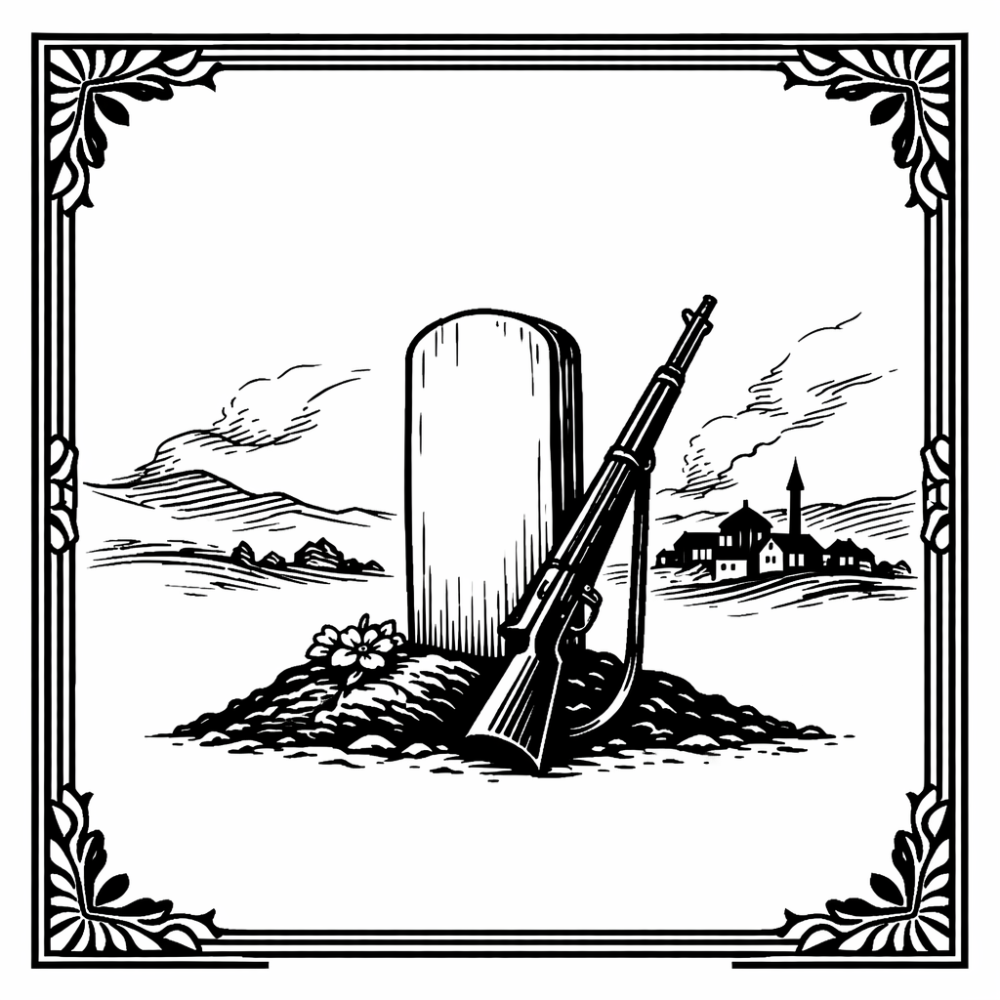{width=80%}


```{=latex}
\end{center}
\vspace*{\fill}
\newpage
```

# 8. Bölüm

Karamatlar'lı Efeler devletle anlaşarak asker kaçağı durumundan kurtulmuş, Kuvayi Milliye'ci olmuşlardı. Varılan anlaşma gereği bu anlaşma gizli tutulacak, Kara Durası'nın duymasının önüne geçilecek. Bu haberden mutasarrıf ve görev verdiği sivil yetkililer, jandarma komutanı, üç efe, Molla Mehmet ve kardeşi Yakup dışında kimsenin bilgisi olmayacak, bundan sonraki gelişmelerden de sadece yine aynı kişiler haberdar olacak, anlaşmadan ailelerine bile bahsetmeyeceklerdi.

Gerektiğinde devlet yetkilileriyle efeler arasında Molla Mehmet aracılık yapacaktı. Efeler sadece karakol komutanından emir alacaklar, onun talimatlarına göre hareket edeceklerdi. Karakoldaki diğer rütbeli personel uzman çavuşlar efelere talimat vermeyeceklerdi. İşi o kadar sıkı tutmuşlardı ki! Yapılan anlaşmadan, alınan kararlardan İsa'nın bile haberi olmamasına karar verildi.

Başlangıçta efeleri bulması için Klanoz kırı (Gerişler, Narzanlar, Kilciler, Hilaller civarını kaplayan bölge) na İsa gönderilmiş, haberi efelere o iletmişti ama sadece o kadar. İsa ara sıra kayın babasına, ya da amcasına soruyor ama her defasında görüşüyorlar ama ne görüşüyorlar bizde bilmiyoruz. Sanırım bir anlaşma olmadı, görüşüp duruyorlar, bir sonuç çıkacağını da zannetmiyoruz gibi laflarla geçiştiriyorlardı.

Aslında İsa'ya hem Molla Mehmet, hem de komutan güvenirdi ama İsa'nın ara sıra Kara Durası ile görüştüğünü biliyorlardı. Kara Durası'nın bu civarda isteyerek zarar vermeyeceği iki kişiden biri Süleyman Efe ise diğeri de İsa'ydı. İsa çocuk denilecek yaşta Karamatlar'a çoban gelen Durası'na hep kol kanat germiş, onu hep insan içerisine sokmaya çalışmıştı. Durası'nın da konuştuğu, içinden geçenleri az da olsa anlattığı tek kişi İsa agasıydı.

Kara Durası bir keresinde sağ kolu Kürt Memo'ya,

— Ulan Memo, bu Molla deyusuna o kadar gıcığım, o kadar kinleniyorum ki! Gönül diyor bir gece evini ev halkı uyurken ateşe ver hepsi cayır cayır yansınlar ama beni tek durduran İsa aganın da o evde yaşaması.

Eşkıya olana kadar beni adam yerine koyan tek insan o. Kara Durası şu Dünya'da bir Şaziye, bir Zekiye yenge, bir İsa aga, bir Efe Süleyman, bir de Kürt Memo dışında tüm insanlar yansa, kavrulsa umrumda bile olmaz diye düşündü.

Aslında tam anlamıyla güvendiği sadece iki kişi vardı; o da Şaziye'siyle, Kürt Memo. Süleyman efe, Zekiye yenge ve İsa aga'nın da onu ilk fırsatta jandarmanın önüne atmaktan çekinmeyeceklerini bilirdi. Bilirdi ama olsundu, onlar da onu zamanında insan yerine koyan birkaç kişiden biriydi.

Son zamanlarda Şaziye'si de yüzüne bakmaz olmuştu. Onu bir it yavrusu gibi kapının önünde bırakıp, kapıyı yüzüne kapamıştı. O hareketi bir başkası yapacak olsaydı, kimse yapmaya cesaret edemezdi de, alnının ortasından vururdu.

Kara Durası'na göre bu alemde hayatta kalmanın tek yolu acımasız olmak, etrafa korku salmak, bunları yaparken de postu deldirene kadar gününü gün ederek yaşamak. Ah Şaziye onu bir anlayabilse, anlamıyordu. Kendi kendine ulan nasıl anlasın daha gencecik kız. Sen elalemin karılarının evine gir, bazılarına gönüllü, bazılarına zorla tebelleş ol, bir de millet bire bin katarak anlatsın, bunlar sonunda katlana katlana Şaziye'nin kulağına gitsin, nasıl katlansındı.

Şaziye de aynı anda karışık duygular yaşıyordu. Köylü kadınları yüzüne gülüyor, Durası korkusundan onu el üstünde tütüyor, onun olmadığı yerde arkasından dedikodusunu yapıyorlardı. Köy çeşmesine su doldurmaya gittiğinde derin bir sohbete dalan köy kadınları onun çeşmeye yaklaştığını fark etmiyorlar, çeşme başında arkasından dedikodusunu yapmaya devam ediyorlardı.

— Kız Hatice bu Şaziye'de hiç akıl yok gardaş. Su gibi kız, gitti, Eşkıya Kara Durası'nın kapatması oldu. Bu sıralarda araları açık galiba. Dün gece bizim ihtiyar görmüş pencere arkasından. Bu Şaziye Durası'nı içeri almamış. Kara Durası da geri geriye dönmüş gitmiş.

— Deme kız Emine, yaşı ufak mufak ama yürekli kızmış. Memleketi titreten eşkıyayı kapıdan çevirmek öyle kolay değil. Hem napsın bu kızcağız. Kara Durası'ndan başka erkek yüzü gördü sanki. Anaları kavilleşmişler zamanında kızcağız da onları dinleye dinleye içi ısınmış her hal. Daha anası ölür ölmez kızcağızı yaşlı adamlara, çocuklu adamlara vermeye kalkmadılar mıydı. Gitmezsen bak kimsen yok seni dağa kaldırırlar demediler miydi? Ne yapsın bu tazem? Kara Durası'nın kapatması oldu herkes korkusundan yanına yaklaşamaz oldu.

— Kız sen bakma bu iki yüzlülere. Yarın Kara Durası'na bir şey olsun şart olsun rahat bırakmazlar onu. Sanki Durası'ndan hınç alacakmış gibi çullanırlar üstüne. Uçkurunu bağlayamayan yaşlılar bile düşmese peşine ben bir şey bilmiyorum.

— Deme kız içim acıdı vallaha. Garibim de ne ana var, ne de baba. Gerçi görenler olmuş bazen dağlara çıkıyor, kendi kendine atış talimi yapıyormuş. Öyle birkaç erkeğe papuç bırakacak biri değil bence.

— Öyle deme kardeşim; Durası bir ölsün, Durası'na hıncı olanlar hep birlikte çullanırlar üstüne.

Bunları duyan Şaziye görünmeden testileri boş dönüyordu evine.

Savaş zamanı günleriydi, ortalık karışıktı. Dünün kahramanı, bugün eşkıya, yarın yine kahraman olabiliyordu. Yıllardır süren Balkan, Rus, Filistin, Doğu Cephesi savaşları, hele de savaşlarda peş peşe gelen yenilgiler onlarca yıldır silah altında olan askerleri bezdirmiş, yılgınlığa sebep olmuştu.

Çanakkale Savaşlarıyla alınan galibiyet ordunun maneviyatını yükseltmiş, hele Kurtuluş Savaşı'nda alınan galibiyetler hem askerin, hem sivillerin, topyekün milletin moralini yükseltmiş, geleceğe dair umutlarını tazelemişti.

Katil Nuri, Süleyman ve Hasan efeler yıllarca düşmanla vuruşmuşlar, kahramanlıklar göstermişler, sonunda yaralanıp, hava değişimine gelmişlerdi. Bu kahraman askerler iyileştikten sonra yeniden silah altına çağrılınca, çağrıya uymayarak dağa çıkıp, efe olmuşlardı. Tabi devletin gözünde aranan asker kaçağı durumuna düşmüşlerdi. Şimdi yine devlet yetkilileriyle anlaşarak düzenli askeri birliklerin emrine girerek Kuvayi milliye milisi olmuşlardı. Tabi asker kaçaklıkları da düşmüştü.

Her geçen gün ortalık karışıyordu iyiden iyiye. At izi, it izine karışmıştı iyice. Şaziye hemen hemen her gece kabuslar içerisinde terden sırılsıklam olmuş şekilde uyanıyordu. İyi ki Karamatlar'lı efeler hiç gelmiyorlardı Dereli taraflarına. Gerçi artık gitmese de, daha önce gittiğinde Kara Durası'nın ini civarında atıyla da, yayan da dolaşmış, başkalarıyla karşılaşmış ama Efelerle hiç karşılaşmamıştı. Bir defasında Kara Durası,

— Bak Şaziye, sana benim haberim olmadan buralara gelme diyorum, dik kafalık yapıyorsun, geliyorsun. Bu Karamatlar'lı efelerle karşılaşırsan dikkatli ol. Süleyman efe'den bir zarar gelmez ama Katil Nuri ve Pepe Hasan'ın ne yapacağı belli olmaz. Gerçi sen hangisinin Nuri veya Hasan olduğunu nereden bileceksin. Altında atın, sırtında filinta mavzerin var. Silahlı bir erkek gördüğünde yaklaştırma yanına. Dinlemez gelirlerse ateş etmesini biliyorsun nasıl olsa, acıma bas kurşunu.

Şaziye de gülümseyerek,

— Sen merak etme, ben Kara Durası'nın karısıyım, bana kimse yaklaşamaz. Yaklaşmayı deneyen de yer mavzer kurşununu.

Bunu duyan Kara Durası gevrek gevrek gülerek,

— Sen yine de dinle sözümü, gelme buralara. Dağda her türlü insan var bu günlerde.

Ertesi gün 3 efe atlarını Cansızlar yönüne sürdüler. Mengan'da atlarından inerek kuytu bir yere oturdular. Atlarını da otlamaları için serbest bıraktılar.

Mengan Cansızlar, Sarıhacılar, Nasuflar köylerinin ortasında suyu bol, rüzgarı kavi serin bir yerdi. Savaş kızışmadan önceki yıllarda bu üç köy Mengan çayırında Hayır yaparlar (bölgede hıdırelleze hayır denir), etli bulgur pilavları ayran eşliğinde yenildikten sonra yağız delikanlılar karakucak güreşlerine tutuşur, güreşler baş pehlivan belli olana kadar gece yarılarına kadar sürerdi. Hava kararınca çıralı çam kütüklerinden ateş yakılır, yakılan ateşin alevleri gök yüzüne çıkar, pehlivanlar bu alevlerin ışığında güreşe devam ederlerdi.

Son yıllarda neredeyse eli silah tutan herkes vatan savunması için askere alındığından hayırlarda güreşecek genç kalmamıştı. Savaş günlerinde hayırlar da pek düzenlenmez olmuştu, düzenlense de eski tadı yoktu.

Buraya birlikte istişare etmek için gelmişlerdi üç efe. Kurtuluş Savaşı başlayalıdan beri bu çayırda hayırlar da düzenlenmez olmuştu. Üç efenin de bu çayırla ilgili güzel anıları vardı. Üçü de bu çayırda güreşmişler, Kel Süleyman efe ve Pepe Hasan efe baş pehlivan bile olmuşlardı.

Efeler gibi bu çayırda Kara Durası'nın da anıları vardı. Kara Durası çocukluğunda da, delikanlılığa adım atmaya başladığı ilk yıllarda arkalardan ürkek ürkek güreşleri seyretmiş, bir kendisinin de bu çayırlarda güreştiğini hayal etmişti. O yıllarda bir kişi haydi Durası sen de çık bir güreş tut dememişti.

Efeler çayırda soluklandıktan sonra başladılar hasbihal etmeye. Süleyman efe,

— Arkadaşlar karar almalıyız, aldığımız kararları komutana iletmeliyiz, komutan onayladıktan sonra hep birlikte tavizsiz uymalıyız derim ben.

Katil Nuri efe,

— Arkadaşlar uzun zamandan beri kendi kafamıza göre hareket ettik. Kafamız esti haraç aldık, kafamız esti, istediğimiz yere gittik, geldik. Şimdi yeniden birinden emir almak zor olacak.

Hasan efe,

— Nuri bilen bilmeyen seni 40 yıllık efe zannedecek. Daha birkaç yıl öncesine kadar emir alan rütbesiz askerlerdik.

— Hasan sen kendine bak son zamanda Süleyman da ben de onbaşıydık.

Hep birlikte gülüştüler.

Süleyman efe,

— Arkadaşlar biz de hatırı sayılır, bölgenin en bıçkın efeleriyiz. Üç kişilik bir efe grubu olmamıza rağmen 8-10 kişilik efe ve çete grupları bizi gördüler mi yollarını değiştiriyorlar. Eşkıya Kara Durası'nın zaman zaman 20'leri bulan, hatta bazen geçen çetesi bile bizi gördüğünde yolunu değiştirdiğini bilmeyen yok. Yok bana karşı çok saygısı varmış ta, ondan karşı karşıya gelmek istemiyor da falan. Bunlar hepsi hurafe, hurafe değilse bile kendi korkularını örtme çabası. Bizi gören yanlış bir şey yapmışsa yolunu değiştirir olmuştu. En iyi yanı bizi kimse eşkıyalıkla suçlamadı. Hele o dul kadınlara harçlık verdiğimizde gözlerindeki sevinci hepimiz gördük. Çocuklar bizim yollarımızı gözler olmuşlardı. Adımız onlar Karamatlarlı efeler, zenginden alır, fakire verir çıkmıştı. Arkadaşlar bu bizim için bir fırsat, kaçak durumuna düşmek hepimizi de üzüyordu aslında, elimize geçen bu fırsatı iyi değerlendirelim bence.

Katil Nuri Efe,

— Ah be Süleyman'ım, ah be benim aslan kardeşim. Keşke bir çıksaydı karşımıza, keşke bir çıksa o Durası puştu ve adamları, ulan alnının ortasından şaklatmazsam bana Katil Nuri demesinler. O deyyus biliyor, biz üçümüz sırt sırta verdik mi beş, on, yirmi adammış vız gelir, tırıs gider. O Durası denilen yerden bitme bizden hem korkuyor, hem de diş biliyor. Hani o ilk jandarmadan kaçıp, kırlara çıktığında Süleyman Efe beni yanınıza alın diye yalvarırken korkudan eli ayağı titriyordu. O zaman alsaydık yanımıza hala bizim kulumuz kölemiz olurdu.

Süleyman Efe,

— Arkadaşlar bazen keşke yanımıza alsaymıydık diye düşündüğüm olmuyor değil. En azından bizim kontrolümüzde olurdu, memlekette böyle bir pislikle karşılaşmazdı. Bundan sonraki davranışlarımızda ben de zorlanacağımızı biliyorum. Millet komutanın emrine girdiğimizi duyarsa o zaman bize karşı tavırları ne olur onu kestiremiyorum işte.

Hasan efe,

— Süleyman her şey bitmiş gibi konuşursun hala dağlar bizim, hala haraç alabileceğiz. Bu efelik bitince karıların gözündeki yerimiz de yerle bir olacak anasını satayım.

Katil Nuri Efe,

— Arkadaşlar bizim bu Hasan'ın uçkur düşkünlüğü dillere destan oldu, gülerek Süleyman sen de ondan aşağı kalmazsın ya. Bir de benim canımı sıkan şu Kara Durası puştunun orada burada yaydığı dedi kodular. Yok Süleyman efe için içerisinde olmasa bizi çoktan nallarmış, biz onun için leşte sinekmişiz falan filan. Ben size dedim bırakın ben şu çocuğu tahtalı köye göndereyim. Tek kurşunluk canı vardı.

— Arkadaşlar o günler geride kaldı. Adamın şimdi 20 kişiyi bulan adamı var, biz hala 3 kişiyiz. Şu günden sonra bizim onu kolayca haklamamız için çeteyi gruplara böldüğü an. O zaman biz 3 kişi 6-7 kişiyi haklarız. Pusu dışında 20 kişiyi haklamamız zor. Gerçi artık bundan sonra bunları konuşmak ta anlamsız. Artık komutanla birlikte hareket edeceğiz.

Hasan efe,

— Arkadaşlar bu güne kadar beraberdik, bundan sonra da sonuna kadar beraberiz. Madem Süleyman komutanla aramızda haberci, koordinasyonu o sağlayacak. Süleyman Gölpazarı'na görüşmeye giderken ben yalnız göndermeyelim derim. Biz de en azından Kaynar'a kadar gidelim.

Katil Nuri efe,

— Bence Hasan haklı; anca beraber, kanca beraber. Bence güvenlik ve çevre kontrolü açısından birimiz Kaynar'da kalsın da diğerimiz Çay Mahallesi'ne, gerektiğinde kasabanın içine kadar gitsin. Bu Kara Durası puştunun her yerde muhbiri var. Güvenliği almak lazım, yaşayacaksak ta beraber, öleceksek te hep beraber.

Süleyman efe,

— Tamam arkadaşlar hep birlikte hareket ederiz. Zaten hep öyle değil miydi?

Süleyman efe sol elini çenesinin altına dayamış, çayırda uzanırken eski günler geldi aklına. Çanakkale Savaşı'ndan hemen sonraydı, Süleyman efe sırım gibi delikanlı olmuştu. O yılda hayırlarda güreşler yapılmıştı. Taraklı'nın Akçapınar köyündeki güreşlerde baş pehlivanlığı gece yarısına doğru Dumanköy'den Çanakkale Savaşları'na katılmış kendinden 4-5 yaş büyük bir gaziye yenilmişti. Akçapınar hayırından bir hafta sonra Mengan hayırında yine güreşler gece yarılarına kadar sürmüştü. Yine o Dumanköylü gazi peş peşe 3 kişiyi yenmiş, dördüncü olarak ta biraz zorlansa da Hasan'ı devirmişti. Hasan göbeği aya bakar vaziyette çayırda karnı yukarı yatarken Dumanköylü gazi,

— Gölpazarı tarafı kalmadı mı bir eriniz. Karşıma çıkaracak yiğidiniz kalmadı mı? Demek ki bu defa da baş pehlivan Taraklı-Göynük'ten çıkacak.

O yıllarda güreşler Gölpazarı bir taraf - Taraklı, Göynük bir taraf düzenlenirdi.

Arkalardan bıdırdaşmalar başladı. Karamatlar'lı Halil yok mu, yoksa korkusundan çıkamıyor mu, diyorlardı.

Hasan yerden kalkarak Halil'in yanına geldi,

— Halil ne durursun, duymaz mısın konuşulanları?

Halil arkadaşının kulağına eğilerek,

— Dur sesini çıkarma. Akçapınar'da acemiliğime geldi, farkına varmadan bacağımı kaptı. Şimdi de korkuyor zannetsin, zaten epey yoruldu. Ben şimdi ona yapacağımı bilirim.

Halil yavaş yavaş ortaya doğru yürüdü. Ortaya yaklaştığında Dumanköylü alay edercesine bıyık altından gülüyordu. Dumanköylü Veysi önce buyıklarını burdu, sonra haydi bre pehlivan diye nara attı.

Güreşi yönetecek hakem,

— Pehlivanlar birbirinize sarılın, helalleşin.

Halil ve Veysi ellerini birbirlerinin bellerine dolayarak helalleştiler.

Hakemin "Haydi pehlivanlar, er meydanı sizin" sözleri biter bitmez Halil efe yıldırım gibi saldırdı. Veysi ne olduğunu anlayamadan çayıra sırt üstü düştü.

Çayırda bir kargaşa koptu. Kimi galibiyeti kutluyor, kimi de olmadı, gafil avladı, hile yaptı diyorlardı. Hakem her iki pehlivanı çayırın ortasına çekti.

— Pehlivanlar siz ne dersiniz?

Halil efe gayet sakin,

— Yeniş olmuştur, hakem er meydanı sizin sözlerinden sonra daldım ben.

Veysi yorgunluktan derin derin soluyarak,

— Ben elimi kaldırmadan daldın, bence adil değil, yeniş olmadı.

Güreş hakemi her ikisine bakarak,

— Yeniş olduysa da yiğitçe olmadı, bence yeniden tutuşun.

Halil Efe Veysi'nin yorgunluğunu da görünce,

— Tamam, ben de varım, pilavdan dönenin kaşığı kırılsın.

Güreş yeniden başladı, her iki tarafın taraftarları da heyecanla bağırıyorlardı. Halil bu defa kaçak güreşiyordu. Veysi ise yorulduğunu bildiğinden bir an önce yakalayıp, sırtını yere getirmek istiyordu. Halil çayırın ortasında Veysi'nin her hamlesinde geri zıplayarak kurtuluyordu. Sinirlenen Veysi hırsla saldırınca sendeledi, bir eli yere deydi. Tam o sırada Halil ok gibi ileri fırlayarak Veysi'nin boynunu yakalayarak eliyle bastırırken bir hamlede arkasına dolandı. Yüklenerek Veysi'yi yere düşürdü. Kollarını Veysi'nin koltuk altlarından geçirerek ellerini Veysi'nin ensesinde birleştirerek boyunduruk kurdu. Veysi ne kadar çabalasa kurtulamadı. Halil ayağını da takarak Veysi'yi karnı yukarı düşürdü. Gölpazarı tarafı hep bir ağızdan bağırarak ayağa fırladı. Kimsenin ağzını açacak hali kalmamıştı. Bundan daha açık yeniş olamazdı.

Süleyman Efe'nin dalıp dalıp gittiğini gören Hasan Efe,

— Len Süleyman Efe, Halil kardeşimizin bu çayırda Veysi'yi yenişi mi geldi aklına? Şehit Halil kardeşimiz onu yenemeseydi bu kırda bizim efeliğimizi kim takardı.

Süleyman Efe düşünceli, düşünceli,

— Halil kardeşimizin adı kaldı gönlümüzde, kardeşi Ali'den sonra o da şehit düştü. Bana iç güveyi gel dediklerinde; kendi kendime nasıl olur, biz kardeş gibiydik, olmaz desem de, hem çifte çubuğa, hem de çocuklarına sahip çıkarsın deyince kabul ettim. Kadere bak bizi de gazi derler almazlar askere derken, yeniden askere çağırınca çıktık dağlara, soyunduk efeliğe.

— Veysi'ye gelince, yine cephede düşmanla vuruşuyor, belki de şehit oldu, ya bir de bize bak. Burada çayıra uzanmışız, ah ulan ah.

Katil Nuri efe,

— Bırakın bu şöyle olsaydı, böyle olsaydı demeyi. Neyse ne, olanlar oldu. Bak biz de kuvvacı olacağız.

Efeler komutanla birlikte hareket etmekte kararlıydılar, birlikte hareket etmezseler bu aftan yararlanmalarının söz konusu olmayacağını biliyorlardı. Arazide bilgi toplayacaklar, topladıkları bilgileri komutana anlatacaklar, onun talimatları doğrultusunda hareket edeceklerdi.

Çok dikkatli olmalıydılar zira Kara Durası'nın çok iyi çalışan bir muhbir ağı vardı. Süleyman efe'nin Gölpazarı'na toplanan haberleri götürdüğünde birinin Kaynar'da, diğerinin Çay Mahallesi girişinde pusuda beklemesinin bir nedeni vardı. Onlar yola çıktığında eğer Kara Durası çetesi durumu bir türlü öğrenerek Gölpazarı'na giden görüşmeciyi takibe kalkarlarsa Kaynar'da pusuya yatan takipçileri arkadan takip edecek, Çay Mahallesi girişinde bekleyen ikinci efe önden pusuya düşürecek ve takipçiler iki ateş arasında bırakılacaktı.

Kara Durası’nın en kolay kapatmalarının evine keyif yapmaya gittiğinde kıstırabilecekleri konusunda karara vardılar. Kapatmaların evlerinde ne kadar kalıyor, önlemleri nasıl alıyor ayrıntılı bilgi toplanacaktı.

Dumanköy, Gerişler tarafında Katil Nuri'nin, Kavak, Neçinler, Nardın taraflarında ise Hasan'ın bağlantıları daha iyiydi. Her efe bağlantılarının iyi olduğu bölgelerde faaliyet gösterecek, Süleyman Efe ise hem koordinasyonu, hem de komutanla irtibatı sağlayacaktı. Aynı günlerde Şaziye'nin tavır koyması sonucu Şaziye ile Kara Durası epey zamandır görüşemez olmuşlardı.

Diğer taraftan Şaziye hem korkular, hem de karışık duygular yaşıyordu. Kara Durası'nı hem çok seviyor, hem de onu anlamaya çalışıyor ama duydukları da onu çok üzüyor, onu düşüncelere sevk ediyordu.

Kara Durası ile ilgili haberler çok hızlı yayılıyor, hem de bire bin katılarak yayılıyordu. En son Elmümin yakınlarındaki değirmencinin öldürülmesi ile, Kavak köyündeki çocuk yaşta birini öldürmesi haberleri gelmişti. Kara Durası bu iki olaydan sonra Şaziye'nin yanına gitmeye cesaret edemiyordu, bu olaylardan sonra Şaziye mümkünü yok onu içeri almazdı.

Şaziye bir taraftan gelmesini istemiyor, bir taraftan da yüzleşerek bunları sormak istiyordu.

Kara Durası’nın en son yaptığına  efeler bile şaşırmışlardı. Kara Durası gibi aşırı temkinli bir adam bunu nasıl yapmıştı.

Sakarı Hamamları'na 12 adamıyla giderek kadın oynatmıştı. Hem böyle halkın yavaş yavaş çetelere direnmeye başladığı bir dönemde. Bir de Sakarı Hamamları, Sakarya Nehri'nin karşısında Sarıcakaya'daydı. Hamamda göbek taşının üzerinde 4 dansöz kadına çıplak oryantal dans yaptırdığı, hamamda rakı içtiği anlatılıyordu. Görülmüş şey değildi. Kara Durası Sakarya'nın karşısında alenen eğlence düzenlemişti. Sadece eğlence düzenlemekle kalmamış, daha önceden tespit ettikleri paralı kişilerin ocaklarına çökerek haraç almışlardı.

Kara Durası eğlenceden döndükten sonra hız kesmemiş yeniden Keskin Köyü tarafına giderek haraç toplamıştı. Aynı günlerde efeler de bir hafta kadar istihbarat topladıktan sonra topladıkları bilgileri kararlaştırılan günde komutana iletmek için kasabaya doğru yola çıkmışlardı. Kara Durası sanki olaylardan haberdarmış gibi hem gücünü gözlere soka soka gösteriyor, hem de sık sık yer değiştiriyor, bir günde farklı yerlerde görünüyordu.

3 efe bir gece hava karardıktan sonra silahlarını kuşanarak, atlarına bindiler ve üçü birlikte yola çıktılar. Yaptıkları araştırmalarda Kara Durası'nın ara sıra Dereli köyünde bir kızın evine gittiğini öğrenmişlerdi. Efeler Madanlar altına inince yol değiştirmeye karar verdiler. Kara Durası'nın evine gittiği Şaziye adındaki kızın evi yola yakındı. Kara Durası bu gece evdeyse çevrede güvenlik almış olan adamları onları fark ederlerdi, fark ederlerse bu tarafta ne işleri var diye şüphelenirdi Kara Durası. Kara Durası, Karamatlar'lı efelerin bu tarafta işleri olmadığını bilirdi. Onların faaliyet alanı kırtarafı, ağırlıklı olarak ta Gerişler, Narzanlar, Kilciler, Boyacılar, Akçapınar, Dumanköy ve Yenipazar civarlarıydı.

Efeler Nalçacılar tarafına geçtiler, Köseler köyünden sonra Akçay yakınlarında yeniden Taraklı-Gölpazarı yoluna indiler. Kaynar'da kendileri su içip, atlarını suladılar. Kararlaştırdıkları gibi Hasan burada kalacaktı. O gece hava bulutluydu. Ay zaman zaman yüzünü göster se de genellikle görüş mesafesi azdı. Hasan atını Koca Mezarlığa bağlayarak yolu görebilecek şekilde pusuya yattı. Hasan Efe'nin atı güçlü kuvvetli bir aygırdı. Uzun fuleli adımları vardı. Hem çok hızlı, hem de çok dayanıklı bir hayvandı. Eksik bir yanı vardı bir kısrağı uzaktan görsün, kokusunu alsın kişnemeden duramaz, ön ayaklarıyla yeri eşeler, bazen de arka ayakları üzerine şaha kalkardı. Kel Hasan Efe yoldan bir kısrak geçer de atı kişner diye atının karnının tok olmasına rağmen yem torbasını başına geçirdi. Bu aygırın iştahı da çok fazlaydı, doymak bilmezdi. Pepe Hasan Efe kilo alıp, yağlanmaması için yemini biraz kısıyordu. Üç efe birlikte yola çıktıklarında düz yollarda vücudu ağır olduğundan Hasan Efe'nin aygırı biraz geri kalsa da yol uzadıkça, ya da rampa tırmandığında hangi at olursa olsun nal toplatırdı. Süleyman Efe ve Katil Nuri efe yola devam ettiler. Koca Mezarlık ağaçlık olduğundan atın görünmesi mümkün değildi. Aradan bir saat kadar bir zaman geçmişti. Gecenin karanlığında sıkılan Hasan Efe cebinden tabakasını çıkararak bir sigara sararak yaktı. Daha iki nefes çekmişti ki Sürmeli köyü tarafından at nalı sesleri gelmeye başladı. Hemen bir çalının içerisine girerek sigarasını söndürdü. Tüfeğinin ve tabancasının namlularına mermi sürdü. Çalının içerisine tam siper yattı. Nal sesleri gitgide yaklaşıyordu. Sanki gelen atlar tam üzerine geliyorlardı. Bir ara ay buluttan sıyrılınca gelenlerin 3 atlı olduğunu gördü. Atlar tam üzerine geliyorlardı. Benim bu adamlarla işim yok, beni fark etmezlerse, ben de onları görmemiş gibi yaparım dedi kendi kendine. Üç atlı Kaynar'da atlarından indiler, su içip, atlarını suladılar. Daha sonra bir sarma sigara yakarak konuşmaya başladılar. Sesler sanki tanıdık gibiydi. Bir ara yabancı gelmeyen bir sesin "Len Memo" diye seslendiğini duyar gibi oldu. İyice yere yapışarak konuşulanları duymaya çalıştı. O sıra ay buluttan yarım da olsa sıyrılır gibi oldu. Gördüklerine inanamadı. Kaynar'da sigara içenler Kara Durası, Kürt Memo ve bir diğer adamıydı. Kel Hasan olduğu yerde heyecanlandı. Fırsat ayağına mı gelmişti ne? Mesafe Kel Hasan Efe'nin atış menzili içerisindeydi, bu mesafeden birini rahatlıkla vurabilirdi. Tüfeğini omuzuna dayadı. Gözünü, tüfeğin gezine dayadı. Göz, gez, arpacık tam ayarladı. Sağ elinin işaret parmağıyla tetiğin boşluğunu almaya hazırlanırken ay yeniden bulutların arkasına gizlenince görüş mesafesi daraldı, insanlar zor seçilir oldu. Baştaki Kara Durası, ortadaki Kürt Memo, diğeri de öbürkü adamdı. Tam tetiğe basacağı sırada nereden geldiklerini fark edemediği 4 atlı beş metre kadar önünden tozu dumana katarak geçerek Kara Durası'nın yanında atlarından atladılar. Tam Kara Durası'nın olduğu yere odaklanmışken diğer 3 adamı fark edememişti. Mavzeriyle peş peşe 5 mermi atabilirdi, mesafe tabanca menzilinin dışındaydı. Her mermiyle bir adam indirse bile, bu neredeyse imkansızdı, geriye yine de bir adam kalırdı. Ay da bulutun arkasına girmiş, görüş mesafesi iyiden iyiye azalmıştı. Kendi kendine ah pusuyu keşke Katil Nuri ile birlikte atsaydık, o zaman bunların hepsini tek mermi atmalarına fırsat bile vermeden haklardık diye düşündü. Adamlar artık neredeyse görünemez olmuştu. Hasan Efe kendi kendine,

— O kadar da önlem aldık, o kadar da dikkat ettik, bu adamlar bizim Gölpazarı'na gideceğimizi nasıl haber aldılar. Anlaşılan onlar buraya bize pusu atmak için geldiler.

Konuşmalar anlaşılmıyordu. Kel Hasan efe hızlıca düşündü. Sürünerek atının yanına gidecek, mezarlığın arkasından Akçay'a inerek yolda arkadaşlarını karşılayarak pusuya düşmelerini önleyecekti. Tam sürünmeye hazırlanırken adamlarda bir kıpırdanma fark etti. Adamlar atlarına biniyorlardı. Kel Hasan Efe kendi kendine,

— Demek ki burası onların buluşma yeri. Pusuyu Gölpazarı'na daha yakın yerde atacaklar herhalde. Umarım pusuya düşmeden onlardan önce arkadaşlarıma ulaşırım ama bu durumda zor görünüyor.

Adamlar atlarına atlayarak dörtnala yola çıktılar. Atlar peş peşe 4-5 metre kadar önünden geçtiler. Kel Hasan birden rahatladı. Adamlar Gölpazarı yönüne değil, tam tersine Taraklı yönüne gidiyorlardı. Rahatladı Hasan. Demek Kara Durası onlarla ilgili bir bilgi alamamıştı, burada karşılaşmaları tesadüftü. Hasan yeniden bir sigara yakarak arkadaşlarını beklemeye başladı. Katil Nuri Çay Mahallesi'ne varmadan atından inerek pusuya yatmıştı. Süleyman Efe görüşmeye yalnız başına gitti. Süleyman Efe jandarma karakoluna vardığında komutan karakolda yoktu. Nöbetçi uzman çavuş Efeye karakolda çay söyleyerek sohbete başladı. Havadan sudan konuşuyorlardı. Efe komutanla görüşmeye geldiğini söyleyince uzman komutanın evine bir haberci gönderdi. Bir 15 dakika kadar sonra komutan geldi. Komutan hemen Süleyman Efe'yi odasına aldı.

— Süleyman Efe hoş geldin, nasıl yeni gelişmeler var mı?

— Hoş bulduk komutanım, var, tendimize göre çalışmalar yaptık.

— Meraklandım şimdi, anlat hele.

— Komutanım Kara Durası ve çetesi sürekli yer değiştiriyor, çeteyi bölüyor 4-5'li gruplar halinde ayrı bölgelerde dolaşıyorlar, birbirleriyle irtibatları da çok iyi.

— Efe bunlar bizim de bildiklerimiz, sen bilmediğimiz bir şeyler var mı onu anlat.

— Var komutanım. Bu adamı dağda kıstırmamız çok zor. Biz iki yerde kıstırabileceğimizi düşünüyoruz. Ya Kilem hamamında yıkanırken, ya da kapatmalarının evinde uçkur derdine düşmüşken. Hamamda da epey zor, çok asker lazım. Hamama giderken en az on adamıyla gidiyor. Biz en kolay kapatmalarının yanına gittiği zaman kıstırabiliriz diye düşünüyoruz. Bu adamda karı bol komutanım. Bizim tespit ettiğimiz en az 10 kadına gidiyor. En fazla Dereli, Kavak ve Dumanköy'deki kapatmalarına gidiyor.

— Hani Kavak'ta öldürdüğü çocuğun bu kadın meselesi ile ilgisi var mı?

— Var komutanım var da o iş biraz karışık. Kadına zorla sahip oluyormuş. Çocuk bunu öğrenince Kara Durası'nı öldürmeye kalkmış, çocuk hata yapınca Kara Durası onu öldürmüş. O olaydan sonra o kadına gittiği görülmemiş. Görülmemiş te komutanım, o kadının evine hemen yakın, yolunu gözleyen bir de gönüllü kapatması var, ona gitmeye devam ediyor.

— Bu adamı çözemedim ben, ama sen iyi tanıyorsun, onu sen yetiştirmişsin, silah kullanmayı sen öğretmişsin. Pis herif milleti o kadar korkutmuş ki, bir köyde kadına tasallut ediyor, bu durumu kaldıramayıp onu öldürmeye çalışan gencecik fidan gibi çocuğu katlediyor; ne anası-babası, ne de köyden bir kişi gelip jandarmaya ihbar ediyor. Haydi tamam savaş zamanı ortalık karışıktı, şimdi zaferin getirdiği umut toplumu sarmasına rağmen yine de karşı koyan, bırak karşı koyanı, ihbar bile eden yok. Beni üzen bunların hepsi korkudan değil, kimisi de sanki bana dokunmayan yılan bin yaşasın der gibi. Efe biz bu yılgınlığı nasıl yeneceğiz bilemiyorum.

— Öğretmez olaydım komutanım, başımıza bela oldu. Komutanım bir de Dereli'de bir kız var. O komşusunun kızı, eskiden tanıdığı yani. Ona da ne zaman geleceği hiç belli olmuyor, geldiğinde önlemleri de çok iyi alıyor. Bu kız yavuklusu galiba, anlatılanlara göre kız onu gerçekten seviyor. Yılgınlığa gelince komutanım, yıllardır süren bu yılgınlığı kırmak çok zor, epey zaman geçmesi lazım. Utanıyorum ama söylemeden geçemeyeceğim. Komutanım aynı yılgınlığı yaşayarak asker kaçağı durumuna düştük biz üç arkadaş. Bir de millet son yıllarda ardarda gelen yenilgilerden iyice sindi. Artık bu kazanılan Kurtuluş Savaşı'ndan sonra her şey değişir bence. Köylü düşmanın vatan topraklarından kovulduğunu duydu ama daha henüz devletin gücünü yanında göremediğinden henüz olayı tam kanıksayamadılar. Düşman işgaline uğrayan yerler bunun çok iyi farkındalar, bu topraklar Allah'a şükür düşman mezalimi görmedi. Biz elbirliğiyle bu Kara Durası itini sağ veya ölü ele geçirirsek bu devletin gücünü milletin gözünde görünür hale getirmeye çok fayda sağlayacaktır. Bak o zaman görün komutanım ya diğer çeteler sıvışıp kaçacaklar, ya teslim olacaklar, teslim olmayanları da halk peş peşe ihbar edecek.

— Kızı konuştursak?

— Faydası olmaz komutanım, kızın normal bir insandan fazla bir şey bildiğini zannetmiyorum. Biz bu Durası'nı, en başta da ben fazla hafife almışız. Bunun kafası hinliğe çok iyi çalışıyor. Bir de şansı yanında bir kapı köpeği gibi sadık, aynı zamanda cephelerde on yıldan fazla savaşmış, attığını vuran, pusu atmayı çok iyi bilen Kürt Memo var. Biz Dereli'deki yavuklusunu sorgularsak hiçbir şey öğrenemeyeceğimiz gibi, Kara Durası'nı da uyandırmış oluruz. Jandarmanın daha ciddi bir şekilde takibe çıkacağını anlar, daha da dikkatli davranır. Bununla da kalmaz köyden birileri ihbar etti diye ummadık bir zamanda köyü basar, masum bir çok kişiye zarar verir. Biz bunun zaaflarından yararlanarak en ummadığı, en zayıf olduğu bir anda tepesine çökeceğiz.

— Ne yapacağız o zaman? Öyle zaafa düştüğü bir anı nasıl yakalayacağız?

— Komutanım bir Gökçeözü köyünde, bir de Taraklı'nın Dumanköy'ünde kapatması var. Dumanköy'deki de aynı Kavak'taki gibi gönüllü kapatmasıymış. Dumanköy'deki kapatmasında daha uzun kalıyormuş. Onun yemeklerini, mezelerini çok seviyor, sofra kurduruyormuş. Kadın gerçekten gönüllü mü, yoksa korkudan mı öyle yapıyor öğrenemedik. Bir de Dumanköy, Taraklı'nın köyü olduğundan daha rahat davranıyormuş. Bir de kapatmalarına gittiği zaman yanına güvenliği sağlasınlar diye bir veya iki adamını alıyor, diğerlerini bir tehlike anında kısa zamanda ulaşabilecekleri yakınlıkta başka bir köye gönderiyormuş.

— Süleyman Efe bir haftada bu kadar bilgiye nasıl ulaştınız?

— Komutanım daha önceden de bildiklerimiz vardı. Bir haftadır da 3 koldan araştırıyoruz. Komutanım özellikle Kalanoz Kırı denilen Kilciler, Gerişler, Narzanlar, Hilaller bölgesinde halk bizi çok seviyor. Bizi kahraman gibi görüyorlar. Halk bize kendiliğinden duyduğu her şeyi anlatıyor. Biz de bunları karşılaştırarak arasından gerçekten doğru olanları seçiyoruz. Komutanım Kara Durası Çetesi bizden ne kadar çekiniyorsa, biz de ondan o kadar çekiniyoruz. Bizim çekincemiz bire bir, hatta bire üç karşı karşıya gelsek haklarından geliriz de bazen çetenin sayısının yirmi, otuz hatta kırkı bulduğu biliniyor. O bizi kollayıp, bizim hakkımızda sürekli bilgi topluyor, biz de onu kolluyor, hakkında bilgi topluyoruz. Sanırım bu güne kadar bir defa bile bu yüzden karşı karşıya gelmedik. Orada burada ben mecbur kalmadıkça Süleyman Efe'ye kurşun sıkmam diyormuş ama ben hiç sanmıyorum, belki de ilk kurşunu bana sıkar.

— Sizin son düşünceniz ne?

— Haklısın efe, akrep sıkıştığında hemen en yakınındakini sokarmış, sokacak birini bulamazsa sonunda kendini sokar, öldürürmüş. Bu Kara Durası da tam bir zehirli akrep.

— Ben akrep pek bilmem ama zehirli yılanı iyi bilirim komutanım. Dediğiniz gibi bu Durası iti tam bir zehirli yılan, hem de en sinsisinden. Biz bu Kara Durası itini en kolay Dumanköy'de kıstırabileceğimizi sanıyoruz. Kapatması kadının hemen yakınındaki ev bizim Nuri efe'nin asker arkadaşının evi. Çanakkale Cephesi'nde birlikte savaşmışlar, ikisi de yaralanmışlar. Arkadaşı bir gözünü kaybetmiş savaşta, ondan tamamen terhis edilmiş. Karısıyla, Kara Durası'nın kapatması samimiymiş. Yenge ağzından Kara Durası'nın ne zaman gideceğine dair bilgi almaya çalışacak. Kara Durası'nın gideceği günden iki gün önce bizim Nuri Efe yanına yengeyi de alarak arkadaşına misafirliğe gidiyormuş gibi giderek evde pusuya yatacak. Topladığı bilgileri bize aktaracak. Tam halvet halindeyken bastırırsak Kara Durası da devre dışı kalır, sadece karşılık verecek Kürt Memo, bilemedin bir adamı daha olabilir. Baskını öyle hızlı yapmalıyız ki komutanım adamların diğerleri gelmeye bile cesaret edememeliler, gelecek olsalar bile bu itin vurulduğunu, ya da ele geçtiğini gördüklerinde dağılır giderler.

— Siz baya ayrıntılı plan yapmışsınız efem. Emeklerinize sağlık. Sizden haber bekleyeceğim. Haber gelince ben de müfrezemle gelir uygun yere yerleşirim. Biz de uzman çavuşlarla birlikte kafa kafaya vererek bu sizin anlattıklarınızı bir güzel değerlendirip, ayrıntılı alternatif planlar oluşturalım.

— Tamam komutanım, bu defa ben arazide olacağımdan haberi Yakup ağa getirir.

— Tamam efe haberinizi bekleyeceğim. Allah'ın izniyle elbirliğiyle bu düşman mezalimi görmemiş memleketi, Kara Durası Çetesi'nin mezaliminden kurtarırız.

Vedalaşarak ayrıldılar. Süleyman efe atına binerek yola düştü, ona Çay Mahallesi çıkışında Katil Nuri Efe katıldı. Katil Nuri arkadaşını heyecanla beklemişti.

— Süleyman kardeşim hele anlat bir komutanla neler konuştunuz?

— Nuri efem acelemiz var, haydi atına bin de sürelim atlarımızı. Hasan'la buluşunca ikinize birden anlatırım.

Nuri atına atlayınca ay ışığında Kaynar'a doğru atlarını dörtnala sürdüler. Kaynar'a gelince Hasan Efe'yi heyecanla onları bekler buldular.

Hasan Efe yaşadıklarını heyecanlı heyecanlı anlattı. Pepe Hasan, Kara Durası'ndan bahsederken "Ka, ka, Kara Durası" diye kekeledi.

Katil Nuri efe çok heyecanlandı, sol elinin tersini, sağ elinin içine vurarak,

— Ah Hasan keşke yanında biz de olsaydık o an, Kara Durası'nın işini bitirmiş olurduk. Aslında kısmet ayağımıza kadar gelmiş anasını satayım. Hasan sen yine sakin adamsın, senin yerine ben olsaydım önünü sonunu düşünmeden basardım kurşunu. Len Hasan korktun mu ne, adını söylerken kekeledin de.

— Ne korkması len Nuri, attırma benim kafamı. Benim heyecanlandığım zaman kekelediğimi bilmezmişsin gibi. Ben onun yaşamasına izin verdiğime bin pişmanım zaten. Vurduğum zaman su, su diye inlerken Molla Mehmet Ağa, verin şuna su, gebersin, gitsin dediydi de, biz vermediydik suyu. O zaman bu ite vereydik suyu geberip, giderdi.

Söze Süleyman Efe girdi. Önce komutanla konuştuklarını en ince ayrıntısına kadar anlattı ve konuşmaya devam etti,

— Efeler artık olan olmuş. Şimdi biz bundan sonrasına bakalım. Komutan bizden haber bekler. Hasan sen doğrusunu yapmışsın arkadaşım. Öldüremeseydin, onlar seni mutlaka öldürürlerdi, ondan sonra da daha fazla önlem alırlardı. Hem de komutandan habersiz hareket ettiğimizden af işimiz tehlikeye girerdi. Biz artık kuvvacı efeleriz. Emir komuta altına girdik, komutandan habersiz hiçbir şey yapmayacağız. Komutan kendiniz inisiyatif kullanabilirsiniz derse ne ala. Arkadaşlar bu gece o puşt Dereli'ye gidiyor. Şimdi onun adamları oraları tutmuşlardır. Bizi görürlerse aramızda ya çatışma çıkar, ya da bizim bu tarafta ne aradığımızı merak eder, işkillenirler. Biz en iyisi Köseler'e çıkalım. Daha sonra Nalçacılar'dan iner, Kovalca'dan köyümüz Karamatlar'a çıkarız.

Hasan efe,

— Ah Nuri arkadaşım ben de keşke Nuri de burada olsaydı, o zaman ikimiz sırt sırta verdiğimizde hepsini haklardık diye düşündüm, bir taraftan da benim aygır kişnerse diye korktum. Biliyorsunuz benim aygır bir kısrak görsün mü yerinde duramaz. Kişneseydi atı bırakıp tarlalara doğru sürünerek uzaklaşacaktım.

Nuri efe gülerek,

— Boşuna sahibine çekmeyen mal harammış dememişler. Adamın atı da sahibi gibi dişi görsün mü zaptedene bravo.

— Önlemini aldıydım, kafasına yem torbasını geçirdiğim gerçi de. Tamam Süleyman Efe'nin dediği gibi bence de yolumuzu değiştirelim.

Üç efe keyifle sarma sigaralarını tüttürdükten sonra oturdukları yerden kalkarak, atlarına doğru yürüdüler. Aynı sıralarda atının üzerinde Kara Durası Şaziye'yi düşünüyor, karşılaştıklarında ne tepki göstereceğini kestiremiyordu.

Kara Durası en son Kavak olayını duyduktan sonra Şaziye'nin kendisine tavır koyacağını biliyordu. Kendi gitmeye cesaret edemedi. Şaziye'ye hazırladığı hediyelerle Kürt Memo'yu gönderdi. Kendisi yanına güvendiği bir adamını alarak Çalca Deresi'ndeki inine gitti. Daha sonra onlara Kürt Memo da katılacaktı. Diğer 3 adamını Neçinler köyündeki değirmene gönderdi. Kendi kendine bu Kürt Memo'ya güvendiğim kadar kimseye güvenmiyorum. Bir Şaziye, bir de Kürt Memo, Kara Durası'nın kayıtsız şartsız güvendiği iki kişiydi.

Kürt Memo Dereli köyünde arkadaşlarından ayrıldı. Atını usulca Kara Durası'nın annesinin damına bağlayarak usulca Şaziye'nin kapısını çaldı. Şaziye hemen kapıyı açtı. Anlaşılan perdenin arkasından onun geldiğini görmüştü.

— Selamunaleyküm Şaziye bacım.

— Aleyküm selam Mehmet ağabey. Hoş, sefa geldin.

Şaziye, Kürt Memo'nun elini öperek, baş köşede yer gösterdi. Şaziye sofra kurdu, birlikte yemek yediler. Yemekten sonra bakır cezveyi ocağa sürerek kahve yaptı. Karşılıklı kahvelerini yudumlarken,

— Şaziye bacım, Durası'nı hiç sormayacak mısın?

— Nesini sorayım Mehmet ağabey, duymak istemediğim bir çok şey duyuyorum zaten.

— Bizim de yaşamımız zor be bacım. Ben mesela, sen kalk ta Ağrı Tutak'tan gel, yıllarca düşmanla savaş, sonunda bir çetenin içinde bul kendini. Memlekete bir daha gidebileceğime hiç inanmıyorum. Bizim reis Durası da dağa çıkmak zorunda kalmış. Her gün bir kör kurşuna hedef olmak, jandarma tarafından yakalanmak endişesiyle yaşamak kolay mı zannediyorsun.

— Mehmet ağabey sizin hayatınızın ne kadar zor olduğunu biliyorum. Ben onun çete olacağını, olduğunu bile bile sevdim. Ben kendimi bildim bileli erkek olarak ondan başkasını sevmedim. Daha çocukken rahmetli anası kız ben seni Durası oğluma alacağım, sen benim gelinim olacaksın derdi, onun bunu demesi hep benim hoşuma giderdi. Ben onu severek büyüdüm ağabey. Onun da beni sevdiğini biliyorum aslında.

— Biliyorsun da bu soğukluk niye bacım?

— Ben ağabey onunla uyuyor, onunla uyanıyorum. Rüyalarımda bile o var. Çoğunlukla kabus görerek uyanıyorum. Rüyalarımda onu ve seni öldürülmüş görüyorum. Ağabey kusuruma bakmazsan söyleyeceğim; ben onu düşünür, onun yolunu gözlerken o başka kadınların koynuna giriyor, yüreğime nasıl söz geçireyim, benim de bir gururum var.

Şaziye'nin gözlerinden yaşlar sicim gibi akmaya başladı.

— Ağlama kurban olduğum bacım, sen ağlama. Gözyaşına kurban olduğum ağlama.

Kürt Memo da gözyaşlarını tutamadı.

— Mehmet ağam ben onun yolunu gözlerken onun başka bir kadının koynundan çıkarak benim yanıma gelmesini, koynuma girmesini kabullenemem ağabey. Hiç mi gelemez, gelir tabi. Erim demişim, kocam demişim. Gelir eve yemeğini yer, isterse yatar uyur ama o kadar. Ne zaman ben onun başka kadınlara gitmediğine inanırım, o zaman hoş safa geldi, kadını burada bekliyor olacak onu. En son Kavak'taki durumu öğrenince günlerce uyuyamadım abi. Mehmet ağabey bunları sana söylerken utanıyorum ama ne yapayım söylemek zorunda kaldım. Sen benim öz ağabeyimsin, senden başka kimim var, sana söylemeyeceğim de kime söyleyeceğim?

Kürt Memo, Şaziye'nin bu kararlı, hem de haklı tavrı karşısında kafasını yere eğdi, onun kadar olmasa da ben de gidiyorum kadınlara demedi, diyemedi.

— Bacım sen de benim öz kız kardeşim, bacımsın. Senin yoluna kurban olurum. Ben onun kulağını çekerim desem, olacak iş değil. Karşımızdaki Kara Durası; hem eşkıya, hem de buraların en acımasızı. Bacım su akar, yolunu bulur derler. Ben biliyorum siz ikiniz de birbirinizi sevmekten vazgeçemezsiniz. Şaziye bacım şimdi Kara Durası beni merakla bekler. Gideyim. Afetmiş diyeyim mi?

— O benim kocam ağabey, onun sözünden çıkmam, ondan başkasının eli değmez bana, her zaman gelebilir tabi evine, onun evi burası. Ben üzerinde başka kadınların kokusu varken, esvaplarında başka kadınların saç telleri varken onu evime alırım ama gönlüme alamam. Ne zaman başka bir kadın olmadığına beni ikna ederse o zaman ancak alırım onu hem gönlüme, hem de ruhuma.

Şaziye, Kara Durası'nın gönderdiği hediyeleri kabul etti. Memo'nun eline de iki torba tutuşturdu.

— Bacım nedir bunlar?

— Havalar soğuyor Mehmet ağabey. Size ikişer çift yün çorap, birer de kazak ördüm, güle güle giyin.

— Bacım siz ikiniz de birbirinizi çok seviyorsunuz, inşallah bu işler bir gün yoluna girer, inşallah af çıkar da biz de normal insanlar gibi yaşamaya başlarız.

Şaziye, Kürt Memo'nun elini öptü, vedalaşarak ayrıldılar. Kürt Memo ahırdan çıkardığı atına binip, uzaklaşırken ardından Şaziye uzun süre dalgın dalgın baktı. Bir kuş sesiyle kendine gelince eve girerek kapısını dayadı.

Kürt Memo mağaraya geldiğinde Kara Durası onu bekliyordu. Memo atından indikten sonra eğerini aldı, dizginlerini çıkardıktan sonra atını yerine bağlayarak mağaraya kayaya sırtını vererek dikkatli yan yan girdi.

— Len Memo anlat bakalım bacın ne dedi?

— Haberler biraz iyi, biraz da kötü ağam.

— Anlat len, merakta koyma adamı.

— Ağam Şaziye bacım hediyeleri aldı, bir şey demedi. Seni çok sevdiğini, istediğin zaman gidebileceğini söyledi ama sen başka kadınlara giderken, başka kadınların kokusu bile üzerinden çıkmadan ona gidersen seni ne koynuna, ne de gönlüne almazmış.

— Tastamına öyle mi dedi len, kardeşim her haber anında yayılıyor. Öldürdüklerimiz, dövdüklerimiz, haraca bağladıklarımız anlatılsın da, benim karı kız işim kime ne?

— Ağam en son Kavak olayını da duymuş, nasıl duyduysa. Başka kadın olmadığı konusunda beni ikna etmeden bu eve sadece yemek yemeğe, uyumaya gelebilir, bu evin erkeği o, bu kapı her zaman açık dedi. Bir de ağam ikimizin vurulduğunu görüyormuş rüyalarında, anlatırken ağladı, ne yalan söyleyeyim ben de gözyaşlarımı tutamadım vallaha. Vallaha ağam bu Şaziye bacım yaşı küçük ama çok mert bir kız. O konuştukça ben utandım, ufaldım, bu koca boyumla küçücük kaldım.

Tamam Şaziye haklı haklı olmasına da, anasını satayım ben de haklıyım. Kader işte eşkıyanın aşık olmak nesine. Önünde sonunda üzer birini. Ulan o kadar güzel kızsın, hem de akıllı, hem de mangal gibi yürekli. Bok mu vardı benim gibi bir acımasız eşkıyaya aşık oldun, aşık olmakla kalmadın, kendine de aşık ettin. Hey Allah'ım benim de imtihanım bu galiba.

Bak Memo artık benim önümde iki yol var gibi, bu gidişle ya ben diğer karıların tadından vazgeçeceğim, ya da Şaziye benden vazgeçecek.

Kara Durası şarap testisini dikti kafasına, testiden kana kana şarap içti. Çenesine doğru akan şarapları elinin tersiyle sildi. Şaziye'den vazgeçemem de, ulan diğer avratlar da çok tatlı, nasıl vazgeçeceğim zor vallaha dedi. Daha sonra ikisi de bir şey demeden yataklarına girerek uyudular. Aynı akşam Karamatlar'lı efeler Akçay'ı geçince sol tarafa Köseler köyü'ne doğru atlarını sürdüler, Nalçacılar köyü'nün hemen arkasından inerek Kovalca'dan köylerine yöneldiler. Köye ayrı ayrı beşer dakika arayla sessizce girdiler. Kim olduğunu bilemedikleri Kara Durası'nın muhbirinin onları görüp, haber uçurmasını önlemeye çalıştılar. Efeler köylerine el ayak çekildikten sonra gece yarısı giriyorlar, yine mecbur kalmadıkça köyden gece yarısından sonra çıkıyorlardı. Aynı günlerde efelerin tek işi Kara Durası'nı takip olmuştu. Moralleri düzelmiş, keyifleri yerine gelmişti. Artık dağda kanun kaçağı değil, Kuvayi milliye milisleriydiler. Bir gün 3 efe köyün üzerindeki Kıranlar Tepesi'nde oturmuşlar, yapacaklarını planlıyorlardı. Tam o sırada Kara Durası ininden çıkmış, Gerişler yönüne gidiyordu. Şaziye'nin dedikleri canını sıkmış, Karamatlar yönüne giderken köy içerisinden geçmek istememiş canı, atının yönünü Oluklu deresi'nde, Kıranlar yönüne çevirmişti. Hem köye uğramamış olacak, hem de yolu kısalacaktı. Tam Kıranlar tepesine yaklaşınca sesler duydu ve bir yılan gibi atından süzüldü, hemen ardından Kürt Memo da atından indi. Atları bağladıktan sonra parmakları tetikte sesin geldiği yana ses çıkarmadan yürüdüler. Adamlar 3 kişiydiler, onlara arkaları dönüktü. Mermi menziline girince yere yatarak nişan vaziyetine geçtiler. Ortam sessizdi. Sesleri dinleyince bunların Karamatlar'lı efeler olduklarını anladılar. Durası, benden hemen sonra ateşe başlar der gibi bir işaret yaptı Kürt Memo'ya. Memo da anladım der gibi kafasını salladı. Kara Durası filintanın tetiğinin boşluğunu aldı, tam tetiğe basacağı sırada mavzeri yüzünden indirdi. Sonra yerinden kalkarak usulca atların olduğu yere doğru yürürlerken belinden çıkardığı bir bıçağı yolun kenarındaki çama sapladı. Kürt Memo neden bıçağı sapladın ağam diye sorunca Süleyman efe anlar demekle yetindi. Kürt Memo, Kara Durası'nın kaşlarının çatıldığını görünce ne ağam onlar kimdi, ne de neden ateş etmekten vazgeçtik diyebildi. Hem 3 kişi olmalarından, hem de Kara Durası'nın bıçağı çamın gövdesine saplarken Süleyman Efe anlar demesinden Kıranlar Tepesi'nde oturan 3 kişinin Karamatlar'lı efeler olduğunu anladı. Atlarını Cansızlar yönüne sürdüler. İşleri biten 3 efe atlarına binip, köye inerken yolun kıyısındaki çama saplı bıçağı görünce durarak atlarından indiler.

Katil Nuri sinirle,

— Şimdi bu ne, bence bu bir işaret, bize bu işaretle haber göndermek kimin haddine?

Süleyman efe bıçağı saplı olduğu yerden çıkarırken,

— Evet arkadaşlar bu bir işaret, hem de Kara Durası bırakmış bu işareti. Bu bıçağı yeni geldiğim sıralarda ona ben vermiştim. Sizi öldürebileceğim menzildeydiniz, ama ben öldürmedim, bir daha çıkarsanız karşıma öldürürüm diyor.

Pepe Hasan sinirden kekeleyerek gürledi.

— Puştu zamanında yaralı bırakmayacaktım, alacaktım canını, bak hergele bize haber salıyor.

Katil Nuri kalpağını çarptı yere.

— Ulan karşı karşıya bir gelelim, kim ölür, kim kalır o zaman görürüz.

Süleyman efe,

— Durun arkadaşlar hiddetlenmeyin, sakin olun dedi. İsteseydi bizi vuracağı menzile girmiş, bizi vurabilirdi. Kendine göre var bir düşüncesi demek ki. Hem komutana söz verdik, ondan habersiz hiçbir şey yapmayacağız. Hem bir hata yaparsak, af şansımızı da yitiririz.

Gece yarısına kadar Kıranlar Tepesi'nde kaldılar, sonra farklı yerlerden köye girdiler. Aradan 2 gün geçmişti, Katil Nuri bir akşam üstü karısına bir şeyler anlatıyor, ona birkaç gün gelmezse merak etmemesini söylüyor, biraz da para bırakıyordu. Tam o sırada alt katta ana giriş kapısı çalınmaya başladı. Kapıyı çalanı ikisi de merak ettiler. Katil Nuri mavzere mermi sürerek merdiven çıkışını gören bir odaya girerek siper aldı. Gelen Katil Nuri Efe'nin Dumanköy'ündeki asker arkadaşının karısıydı. Dumanköy'ündeki Katil Nuri Efe'nin arkadaşının karısı eşeğe binerek çıkagelmişti. Hoşbeşten sonra Nuri efe'nin karısıyla bir odaya çekilerek saatlerce konuştular.

Arkadaşının karısı,

— Ahiretliğim sorma çok önemli şeyler öğrendim galiba, sanırım Nuri efelerin işine yarar.

— Deme ahiretliğim hele anlat şöyle.

— Geçen bizim komşu Fikriye bize gelmişti, şıkır şıkır giyinmiş, boynunda da bir beşibiryerde Reşat altın vardı. Kız bu ne güzellik, üzerindeki de pek güzel şeyler, hele o boynundaki ne öyle? Millet yiyecek ekmek bulamazken sen beşibiryerde takıyorsun, hem de Hamit bile değil, en pahalısından Reşat dedim. Kıkırdayarak geçen gün benimki getirdi dedi. Ben de seninki kim kız dedim bilmezmiş gibi. Kim olacak abla Kara Durası dedi. Ardından ben de kız bu sıralar sık geliyor galiba deyince; geliyor ya abla gene gelecek dedi. Ben de ne zaman kız diye sorunca Göynük Pazarı günü akşamı abla dedi.

Katil Nuri efe heyecanla bekliyordu. Kadınlar odaya gelerek olanları anlattılar. Duyduğu haberler Katil Nuri efe'yi çok heyecanlandırdı. Günlerden Perşembe'ydi. Göynük Pazarı günü Pazartesi olduğuna göre daha 4 gün vardı. Katil Nuri efe,

— Yenge sen Salı gününe kadar burada kalacaksın, bana neden deme, ben yarın gider asker arkadaşımın misafiri olur, senin burada kaldığını anlatırım. Salı günü ahiretliğinle birlikte sizin köye gidersiniz. Aman kadınlar bu anlatılanlar üçümüzün arasında kalacak. Aman ha zinhar başka kimseye anlatmayın. Çok önemli, ağzınızdan kaçırırsanız her şey bozulur. Bana neden diye sormayın, ben size daha sonra anlatırım.

— Sen öyle diyorsan bir bildiğin vardır Nuri efe.

Kadın Nuri Efe'yi sever, sayardı. Kocasını sürekli ziyaret eder, her gelişinde yiyecek, giyecek, para bırakırdı. Katil Nuri efe o gece heyecandan bir türlü uyuyamadı, bir o yana, bir bu yana dönüp, durdu. Onu dönüp, dururken gören karısı gece yarısından sonra,

— Ne oldu Nuri uyuyamadın mı, yoksa başka karılar mı geldi aklına?

Katil Nuri Efe yatakta kolunu uzatarak karısına sarıldı.

— Fesatlık yapma Halime, ne başka karısı, nereden çıkardın başka karıları?

— Aman Nuri herkesin dilinde, duymadım mı sanırsın, çocuklarımın babasısın susarım işte.

— Halimem hakkını helal et. Ben dağda sırtında mavzerle dolaşan bir efeyim. Her an ölümle karşı karşıyayım. Sana biraz daha para bırakacağım, bana bir şey olursa bu paralar size epey yeter.

— Aman be Nuri ne oldu sana, senden hiç duymadığım sözleri söylersin. Çocuklarımın babasısın, benden tarafa helal olsun.

Nuri karısına yeniden sıkı sıkı sarıldı.

Katil Nuri efe sabahleyin hemen olup bitenleri iki efe arkadaşına anlattı. Hemen bir plan yaptılar. Nuri efe hemen yarın gece Dumanköy'üne gizlice giderek arkadaşının evine yerleşecek, Süleyman ve Hasan efeler ise bir taraftan Kara Durası'nın çetesini takip ederken, bir taraftan da gelecek askerlerle birlikte kimseye görünmeden Dumanköy'üne sızmanın yollarını bulacaklar, Katil Nuri efe de Kara Durası eve girince görünmeden gizlendiği evden çıkarak ekibe katılacaktı. Efeler durumu Molla Mehmet ve kardeşi Yakup ağalara anlattılar. Yakup ağa haberleri komutana iletmek için aynı gün atına atlayarak Gölpazarı'na gitti. Komutan daha önce bir uzman çavuşu göndererek kuşatma anında nasıl hareket edecekleri konusunda ayrıntılı bilgiler aktarmış, onların da konuya dair fikirlerini almıştı.

Nuri Efe ertesi gece Dumanköy'ünün yolunu tuttu. Arkadaşına olanları ayrıntılı bir şekilde anlattı. Arkadaşıyla cephede yıllarca sırt sırta savaşmışlardı zamanında. Arkadaşının görevi kuşatma anında köydeki evleri muhtarla birlikte boşaltmak olacaktı. Muhtar kuşatma anında haberdar edilecekti. Dumanköy'ündeki arkadaşı bir çatışma anında gözünü kaybettiğinden çürüğe çıkartılmış, köyüne dönmüştü. Rüyalarında düşmanla vuruşuyor, uyanınca hayal kırıklığı yaşıyor, yüreğindeki eziklik bir kat daha artıyordu. Katil Nuri'nin anlattıklarını heyecanla dinleyen arkadaşının heyecanı iyice artmış, yerinde duramaz olmuştu.

— Desene Nuri efem bir gözümüz olmasa da kaderde sonunda vatana sırt sırta vererek hizmet etmek varmış, Allah'a şükürler olsun dedi.

Katil Nuri ve arkadaşı evde sırayla nöbet tutuyor, ağırlıklı olarak Kara Durası'nın kapatmasının evi olmak üzere köye giren çıkanı takip ediyorlardı. Arkadaşı kimse şüphelenmesin diye ara sıra evden dışarı çıkıyor. Hele yatsı zamanı köy camisine giderek yatsı namazını cemaatle birlikte kılıyordu.

Süleyman Efe de karısı Zekiye ile helalleşmiş, o da eve üzerindeki tüm parayı bırakmıştı. Şehit Halil arkadaşlarının yadigarı, Halil'den sonra ona baba diyen biri erkek, biri kız iki çocuğu yataklarında uyurlarken onları uyandırmadan öperek vedalaşmıştı. İkisinin de yataklarının yanına daha önce Gerişler'de onlar için diktirdiği dokuma gömlekleri bıraktı. Onu sessizce ağlayarak izleyen Zekiye Yenge gözyaşlarını göstermemek için usulca beyaz örtmesinin ucuyla sildi. Süleyman efe karısına sessizce sarıldı, Allah'a emanet olun dedi. Zekiye yenge son zamanlarda farklı, iyi bir şeylerin olduğunu fark etmişti. Süleyman çok neşeli, gözlerinde umut vardı. Görmüş geçirmiş kadın kocasına bir şey sormadı, zamanı gelince anlatır diye düşündü. Güle güle git, güle güle gel diyerek arkasından bir maşrapa su döktü. Pepe Hasan kimseyle vedalaşmadan buluşma yeri olan Harmanlar'da aldı soluğu. Katil Nuri beş gündür Dumanköy'ündeydi. İki efe mezarlık altına doğru bir süre at sürdükten sonra önde at süren Hasan efe arkasındaki Süleyman efe'nin ıslığını duyunca atının gemini çekerek atını yavaşlattıktan sonra geri baktı.

— Ne oldu Süleyman, neden ıslık çaldın, bir şey mi oldu?

— Hasan kardeşim heyecandan her şeyi unuttuk, hani Molla Mehmet Ağa'nın askerler için hazırlayacağı kumanyaları alacaktık.

— He ya nasıl unuttuk, dönelim.

Molla Mehmet Ağa erzakları çuvallara doldurmuş, çuvalları bir ata sarmış onları bekliyordu.

Süleyman ve Hasan efeler Molla Mehmet ile vedalaştılar. Arkalarından Molla Mehmet,

— Efeler komutana selam söyleyin, Allah işinizi kolaylaştırsın, gazanız mübarek olsun.

Arkalarında bıdır bıdır dua etti. Efeler Harmanlar mevkii'ne gelince, birlikte atlarının yönünü köyden yana çevirdiler, hiçbir şey demeden sanki kavilleşmişler gibi hep birlikte arkalarına dönerek köyden yana baktılar ve daha sonra yine hiçbir şey demeden atlarını sürdüler. Daha önceden planladıkları gibi jandarmalarla buluşma noktaları olan Tuzkayası'na doğru sürdüler atlarını. Jandarma Komutanı baş çavuş komutasındaki 2 uzman çavuş, 15 er ve erbaştan oluşan müfreze Pazar günü akşam ezanından sonra Karamatlar'ın Tuzkayası mevkiine gelmişlerdi. Molla Mehmet askerler ve efeler için ekmek, keçi peyniri, kavurma ve kurutulmuş etten oluşan erzak hazırlamıştı. Efeler Hasan ve Süleyman efe erzakları aldıktan sonra atlarına binerek askerlerle buluşacakları yere gitmişlerdi. Tozu dumana katarak gelen üç atlıyı görünce komutan yanındaki uzman çavuş Ramazan'a,

— Ramazan Çavuş bizim efeler iki kişiydi, hayırdır, gelen üç atlı.

— Bilmem ki komutanım, şimdi geldiklerinde belli olur.

Efeler gelince komutanla, uzman çavuşun birbirlerine bakıp, gülüştüklerini gördüler. Komutan gülmeye devam ederek,

— Efeler hoş geldiniz, biz de bu üçüncü attaki kim diye düşünüyorduk, meğer erzak atıymış.

Efeler hoş bulduk dedikten sonra komutanın elini öptüler, diğer askerlerle tokalaştılar. Askerler de, efeler de hem heyecanlı, hem de hırslıydılar. Yeniden bir durum değerlendirmesi yaptılar. Kafileye bölgeyi iyi tanıyan efeler kılavuzluk yaptılar. Aslında Karamatlar'dan Dumanköy'üne en kestirme yol olarak Pirler köyü ve sonra Haceller köyü üzerinden gidilirdi. Onlar hedef şaşırtmak için her ihtimale karşın önce Kayaboğazı'na indiler, oradan Haceller köyü'nün Dumanköy tarafına çıktılar. Haceller köyü'nün altından geçerek Dumanköy yakınlarına sabaha karşı vardılar. Komutan efeleri ve askerleri etrafına toplayarak bir konuşma yaptı.

— Şimdi erzaklarla kahvaltılarımızı yapacağız. Ardından Ramazan Çavuş'un belirleyeceği 2'şerli, 3'erli gruplara ayrılarak ormana dağılacağız. Hava kararınca bir araya toplanacağız. Mümkün oldukça köylülere görünmemeye çalışacağız. Eğer olur da gören olursa sanki muhtara bir evrak götürüyormuşuz gibi davranacağız. Unutmayın şu anda biz Taraklı İlçesi sınırları içerisindeyiz. Soran olursa Taraklı Jandarması'ndan olduğumuzu söyleyeceğiz. Dağılıyoruz ki, gören olursa bile bizi az görsün. Kalabalık görünürsek haber çabucak uçar. O zaman da planımız sekteye uğrar. Şimdi afiyet olsun evlatlarım. Dediğim gibi hava kararınca tam da burada toplanacağız.

Kahvaltılarını ayak üstü yaptıktan sonra akşam hava kararınca buluşmak üzere ikişerli gruplara ayrıldılar. Uzman çavuş kalan erzakları öğle ve akşam yemekleri için askerlere ve efelere eşit bir şekilde dağıttı. Erzaklarını alanlar ikişerli, üçerli gruplar halinde ormanlık alanda kayboldular.

Nuri efe hava kararmadan Kara Durası'nın kapatmasının evini tam gören bir pencerenin önüne yerleşti. Hoca daha yatsı ezanını yeni okumuştu ki, 10'un üzerinde atlı peş peşe geldiler. Diğer atlılar durmadan Gerişler yönüne devam ettiler. İki atlı köyün kıyısında durarak atlarını çamlığın içerisine bağlayarak Kara Durası'nın kapatmasının evine doğru yürüdüler. Katil Nuri Efe adamları tanıdı. Biri Kara Durası, diğeri Kürt Memo'ydu. Kara Durası çevreyi kolaçan ettikten sonra sırtındaki heybeyle aralık olan kapıdan içeri girdi. Kürt Memo evi tam gören bir yere eline mavzerini alarak yere çömeldi. Katil Nuri yerine gözcü olarak arkadaşını bıraktıktan sonra evin ters yönündeki pencereden yere atlayarak kimseye görünmeden kafilenin yanına gitti. Kafile akşam yemeklerini yemiş, Katil Nuri efe'yi bekliyorlardı. Katil Nuri efe çok heyecanlıydı. Başta komutan olmak üzere tüm askerlere ve efe arkadaşlarına tek tek sarılarak gazamız mübarek olsun dedi.

Katil Nuri efe'nin anlattıklarını dikkatli dinleyen komutan ayağa kalkarak son talimatlarını verdi.

— Arkadaşlar Ali uzman çavuş emrindeki askerlerle kuzey ve doğu yönü kuşatacak, Ramazan uzman çavuş ta güney ve batı yönünü kuşatacak emrindeki askerlerle. 3 efe benimle birlikte olacak. Nuri efe'nin Gazi arkadaşı kuşatma başladıktan sonra köy muhtarını alıp gelecek. Kuşatma tam bir çember kuşatması olacak, her asker sağındaki, solundakini sürekli takip edecek, aralardan sızmaya izin vermeyeceğiz. Gazi kardeşimiz ile köy muhtarı çemberin dışında kalan evlerdeki halkı köyün dışına çıkaracak. Çember yavaş yavaş sürekli daraltılacak. Çember içerisinde tek ev kalana kadar daraltılacak. Öyle dikkatli olmalıyız ki Kürt Memo bizi fark etmemeli. Eğer Kürt Memo bizi fark edecek olursa Kürt Memo'nun fark ettiğini anladığımız an harekete geçemeden Kürt Memo'yu vurun. Durası'na teslim ol çağrısını yapacağım, teslim olmaz sanırım ama bizim ilk amacımız canlı yakalamak. Teslim olmazsa bile benden ateş emri almadan ateş etmeyin. Çevredeki evlerin tamamen boşaltılmasını beklemek istiyorum. Köylülerden bir kişinin bile burnunun kanamasını istemiyorum.

Ramazan uzman çavuş,

— Komutanım Kürt Memo'ya çok dikkat etmeliyiz. Çanakkale Savaşı'nda aynı bölükteydik. Hem gözü kara biridir, hem de attığını vurur.

Komutan talimatları verirken Katil Nuri efe yerinde duramıyor, bir o yana, bir bu yana hareket edip duruyordu. Sanki rahat değilmiş bir sıkıntısı varmış gibi davranıyordu.

Komutan ilk çemberi oluşturmaya çalışırken Katil Nuri efe karnını tutarak yere çöktü.

— Ah karnım, karnıma acayip bir sancı saplandı. Yandım anam. Ben bir kuşak çözeyim, karnım kötü gurulduyor.

Komutan Nuri efe'nin yanına giderek,

— Ne oldu sana Nuri Efe yediğin bir şey mi dokundu?

— Bilmem ki komutanım ama bildiğiniz gibi değil, çok ama çok fenayım. Asker arkadaşımın evinde buraya gelmeden önce yemek yediydik, o mu dokundu ne? Tam da zamanını buldu şu karın ağrısı. Sanki karnımı bir bıçakla kazıyorlar, bağırsaklarımda gürül gürül ötüp duruyor.

Durum karşısında Süleyman ve Hasan efeler de şaşkınlık içerisindeydiler. Onu öyle kıvranır, yerde yuvarlanırken görünce hepsi şaşırmışlardı.

Sonunda komutan,

— Nuri efe yanına sıhhiye erini vereyim, siz burada kalın o bir baksın sana. Hafiflerse ağrın gelirsin, hafiflemezse bizi burada bekle, ya da Haceller'e git, bir tanıdığın evine git yat, dönüşte sıhhiye iyice bakar.

— Sıhhiyeye hacet yok komutanım, ishal de olmuşum ben, orada sıhhiye lazım olur, yaralananlar olur maazallah.

— Tamam ama güvenliğinden bırakma, iyi gizlen, silah seslerine çevrede olan adamları gelirse seni tek başına bu hasta halde kıstırmasınlar.

Pepe Hasan Efe, Kel Süleyman Efe'nin kulağına eğilerek başkası duymayacak şekilde,

— Karın ağrısı numaradan değilse adımı değiştiririm. Korktu deyyus, Durası'nın ilk kurşunu ona sıkacağını bilir baksana gözleri fıldır fıldır dönüyor, bizden tarafa da hiç bakmıyor.

Süleyman efe,

— Bana da öyle geliyor Hasan, yine yaptı yapacağını. İçimizde bir de en gözü kara, en cesurumuz o görünürdü.

Katil Nuri Efe iki büklüm karnını tutarak önce komutana, sonra efe arkadaşlarına sarılarak muvaffakiyetler diledi. Efe arkadaşlarına sarılırken onların yüzlerine bakamadı. Efeler de sağol kardaşım bile demeden sadece adet yerini bulsun dercesine ona sarıldılar. Süleyman efe arkadaşı Pepe Hasan'a iyice yaklaşarak fısıltıyla,

— Bu Kara Durası itinin hakkından Nuri olmadan da geliriz ama Nuri'nin bu yaptığı efeliğe sığmaz. Yıllardır her şeyimizi paylaştık, canlarımızı birbirimize emanet ettik arkadaşım Hasan ama bu Nuri sattı bizi, hem de gavur parasıyla bir meteliğe sattı. Biz arkamızı kime yasladık farkında değilmişiz. Tamam ben başka köydenim, ne kadar iyi arkadaş olsak ta şu son yıllarda efe olup, dağa çıkınca çok iyi tanıdık birbirimizi, belki de tanıdık sandık. Hasan bu sizin çocukluk arkadaşınız, hiç sezmedin mi bunun böyle yapacağını.

— Deli doludur Süleyman efem, çabuk parlar, çabuk geçerdi ama bu kadarını ben bile tahmin edemezdim. Yalnız şunu bir kenara yaz Süleyman efe, inşallah yanılırız, eğer düşündüğümüz gibi, korktu ve ondan numara yaptıysa bu Kara Durası pisliğini temizledikten sonra artık benim Nuri ile işim olmaz. Sen arkadaşlığını sürdürürsen benim seninle de işim olmaz.

— Anca beraber kanca beraber Hasan kardeşim. Beni en yanımda olması gereken anında satan, yalnız bırakan adamla benim de işim olmaz. Allah'a dua ediyorum, inşallah gerçekten ağrıyordur karnı. Gerçekten yediği bir şey dokunmuştur. Biz bu adamla aynı cephelerde sırt sırta vuruştuk, aynı çatışmada yaralandık.

Süleyman efe iki sigara sardı. Cebinden çıkardığı kav ve çakmak taşıyla sigaraların birini yaktı sonra yanık sigarayla diğerini de yaktı. Sigaraların birini Pepe Hasan efe'ye uzatırken kendi sigarasından içine derin bir nefes çekti. Sigarasının dumanını savururken bu defa sesini alçaltmadan,

— Biz bu iti haklarız da, olur da bir terslik olur ölürsem, hakkını helal et Hasan kardeşim. Bana Halil kardaşımızdan emanet kalan evlatlarını o zaman sen kolla, gözetle olmaz mı? Benim hakkım varsa helali hoş olsun. Eğer ben ölürsem, sen kalırsan, Nuri numara yapmışsa bakma onun yüzüne.

— Neler söylersin sen Süleyman efem. Evelallah haklarız Durası denilen dünün çobanı, sümüklü oğlanını. Sen meraklanma bir haklayalım şu iti, bir feraha çıksın şu memleket, alnımızın akıyla peş peşe yine hayırlarda güreş tutacağız. Olmaz da, olur birimize hak vaki olursa benden yana haklarım kat kat helal olsun, sen de helal et haklarını kardaşım. Öyle görünüyor bundan böyle iki arkadaş bu vatan görevini halledince artık 3 değil, 2 arkadaş sırt sırta vereceğiz galiba, durum öyle gösteriyor. Şehit kardeşim Halil, bir gün bana Hasan'a hiç şüphelenmeden dayarım sırtımı ama Nuri'ye aynı ölçüde güvenemem demişti, her zaman olduğu gibi yine haklı çıktı, mekanı cennet olsun.

— Şehit kardeşim Halil hem akıllı, hem de çok olgundu, demek görmüş bu günleri, ruhu şadolsun kardeşimizin.

Pepe Hasan efe önce biraz kekeledikten sonra gürledi,

— Üç efe demek isterdim ama, kaderde iki demek varmış. Karamatlar'lı iki efe emrindeyiz komutanım, Allah'ın izniyle memleketi bu Kara Durası denilen eşkıyadan temizleyeceğiz.

— Var olun efeler, yanımdan ayrılmayın. Emrime göre hareket edin. Ben emir vermeden ateş yok.

Süleyman efe elini havaya kaldırarak,

— Yirmi yaşında ilk düşmana kurşun attığım Çanakkale Savaşı'ndaki kadar heyecanlıyız komutanım. Biz iki efe diğer er ve erbaşların gibi emrine amadeyiz. Sen ne emredersen biz onu yaparız.

— Gazamız mübarek olsun, sağolun efeler.

Daha önceden kararlaştırıldığı gibi Kara Durası'nın içerisindeki evi ortaya alarak komutanın işaretiyle çember oluşturulmaya başlandı. Askerler ve efeler mavzerleri ellerinde, işaret parmakları mavzerlerinin tetiklerinin üzerinde çok dikkatli hareket etmeye başladılar.

Askeri müfrezeden karnını tutarak iki büklüm bir şekilde ayrılan Katil Nuri bir çalının dibine çömelmiş, tuvalet yaparmış numarası yapıyordu. Tuvaletini yapıyormuş numarası yaparken canı çok acıyormuş gibi inleme sesleri çıkarıyordu bir taraftan da şu çember uzaklaşsa da, şuradan bir sıvışsam diye düşünüyordu.

Kafile çemberi daraltarak uzaklaşırken, görülmeyeceği kanısına varan Katil Nuri efe yerden kalkarak hemen koşarak Haceller tarafına doğru uzaklaşarak gözden kayboldu. Koşarken bir gören var mı diye sağına, soluna bakıyordu. Birkaç dakika koştuktan sonra atını unuttuğunu hatırlayınca zınk diye yerinde durdu. Kendi kendine Süleyman ve Hasan benim şu halimi bir görseler beni tefe koyarlar vallahi dedi.

Geri dönerek atının yanına geldi. Atının yanına geldiğinde oluşturulan çember çoktan uzaklaşmıştı. Atını bağlı olduğu yerden çözdükten sonra bir sıçrayışta atının eğerine oturdu ve hızla atını Haceller yönüne sürdü. Nuri o gece hiç durmadan atını Karamatlar'a kadar sürdü. Tabi Haceller'den geçerken muhtara şöyle bir görünmek için durmasını saymazsak.

Katil Nuri hem arkadaşlarını, hem de askerleri yalnız bırakmıştı.

Askerler ilk geniş çemberi oluşturduklarında Gazi muhtarı alıp, geldi.

— Komutanım, asker kardeşlerim, efeler hoş geldiniz, gazanız mübarek olsun. Komutanım kardeşim Nuri efe'yi göremem aranızda, nerede kendisi, başka bir vazifeye mi gönderdiniz?

— Sorma gazi evladım. Nuri Efe'nin karnına bir ağrıdır saplandı. Yemekte bozuk bir şeyler mi yediniz yoksa?

— Yok be komutanım, aynı şeyleri yedik, bozuk olsa bana da dokunmaz mıydı?

— Haklısın gazim de ne yapalım biz de anlayamadık, çok sancısı vardı, hem de tuvalete koşuyordu durmadan.

Komutan muhtara yapacaklarını anlattı. Çember yavaş yavaş daraltılıyor, çemberin dışında kalan evlerde yaşayanlar uyandırılarak ters yönde köyün dışına çıkartılıyordu.

Çember darala darala sürdürülüyordu.

Kara Durası ise sevgilisinin evinde sevgilisinin sunduğu rakıyı kavun, peynir eşliğinde içiyor, keyifle sevgilisine sarılıyordu. Sevgilisinin kollarında Şaziye'yi çoktan unutmuştu bile. Bırak Şaziye'yi, dünyasını unutmuştu sanki Kara Durası. Sevgilisi göğsündeki kıllarla oynarken o zevkten sırıtıyordu.

Çember daraldıkça, çemberin dışında kalan evlerdeki köy halkı gazi ve muhtar önderliğinde boşaltılıyor, köy halkının köyün dışındaki harmanlar mevkii'nde sessizce oturmaları tembihlenmiş, sigara bile yakmamaları istenmişti. Küçük çocuklu kadınlar çocuklar ağlarsa diye biraz daha uzağa yerleştirilmişlerdi. Köylüler tembihleniyor; kimsenin çıtırtı bile çıkarmaması, ateş yakmaması sağlanıyordu.

Kara Durası'nın kapatmasının evine çember iyice yaklaşılana kadar hiçbir sorunla karşılaşılmamıştı. Komutan kendi kendine,

— Allah'a şükür her şey planladığımız gibi gidiyor, tereyağından kıl çeker gibi sessiz ve başka kimse zarar görmeden halledeceğiz galiba bu işi.

Geceyi ay ışığı aydınlatıyordu. Ay ışığı ne çemberdeki askerlerin gizlenmesini zorlaştıracak kadar aydınlık, ne de kuşatmayı zorlaştıracak kadar karanlıktı. Komutan kendi kendine böyle uygun bir ortamı planlasaydık bile bulmak zor olurdu diye düşündü.

Çemberdeki asker ve efeleri kimse görmemiş ama başta Ramazan uzman çavuş olmak üzere pusudaki Kürt Memo'nun hareketleri ve hangi oda ve odalarda ışık yandığı komutan ve görevlendirdiği diğer askerlerce yakından takip ediliyordu.

Kürt Memo ana giriş kapısının yanındaki bir direği kendine siper almış, parmağı mavzerin tetiğinde, gözleriyle etrafı durmadan tarıyordu. Evin ön tarafında hemen bir meydanlık alan vardı. Bu alanın bitiminde çalılıklar başlıyor, beş on metre çalılıklardan hemen sonra kara çamlardan oluşan ormanlık alan başlıyordu.

Çalılık alan gerçe meşesi çalıları ve ardıç pardalarından oluştuğundan çemberdeki askerler kolayca görünmeden çemberi daraltabiliyorlardı. O kadar yavaş hareket etmeye başlamışlardı ki, en küçük çıkan çıtırtıdan sonra uzun süre hareket etmeden, sessizce duruyorlardı.

Çember darala darala içerisinde tek ev kalacak şekilde daralmıştı.

Ramazan çavuş, Kürt Memo'yu kollayarak ona en yakın ardıç pardasının ardına kendini atmak üzereyken hemen arkasındaki askerin bir kuru dala basması sonucu çıkan çatırtıya Kürt Memo'nun ani bir refleksle döndüğünü görünce kendini pardanın arkasına yüzükoyun attı. Yattığı yerden baktığında Kürt Memo'nun hareketlerinden kendini gördüğünü anladı.

Çember içerisinden Kürt Memo'nun hemen karşısına denk gelen Ramazan uzman çavuş Kürt Memo'nun kendini fark ettiğini anlayınca daha önceden kararlaştırdıkları gibi komutanına bir işaret yaptıktan sonra sadece Kürt Memo'nun duyacağı şekilde konuşmaya başladı.

— Memo ben Çanakkale Cephesi'nden siper arkadaşın Ramazan. Teslim ol, yardımcı olurum sana. Sen asker adamsın, ne işin olur eşkıyayla. Bir yanlışlık sonucu düşmüşsün eline. Sana söz kardeşim, teslim ol, sana yardımcı olurum ben.

Kürt Memo, Ramazan Çavuş'a hiç cevap vermedi. Ramazan Çavuş'tan tarafa büyükçe bir taş fırlattı ve Ramazan Çavuş'un dikkatinin biraz dağılmasını fırsat bilerek ok gibi fırladı evin giriş kapısına doğru. Kürt Memo ok gibi fırladı evin kapısına. Ramazan uzman ateş etti ama Kürt Memo çok atik bir hareketle eve girerek kapıyı arkasından dayadı. Paldır küldür eve dalan Kürt Memo'nun karşısına anadan üryan çıkan Kara Durası,

— Memo ne oldu len, ne bu telaş.

— Ağam pusuya düştük. Askerler kuşattılar, hem de çember kuşatması. Ya çatışacağız, kurtulmanın yolunu arayacağız, ya da teslim olacağız.

— Ne teslim olması len, bizi sağ bırakırlar mı sanırsın. Bir saat dayanabilirsek bizimkiler yetişir onları kuşatır, o zaman kurtuluruz. O zamana kadar olabildiğince evdeki yerimizi belli etmeyeceğiz. Eve girmeye çalışmadıklarınca ateşe ateşle cevap vermeyeceğiz. Çatışma olursa sırt sırta verir ya vuruşa vuruşa kurtulur, ya da vuruşa vuruşa ölürüz.

Kara Durası konuşurken ,bir taraftan da acele acele giyiniyordu. Yere serili yatakta çıplak vücudunun açılan yerlerini örtmeye çalışan Kara Durası’nın sevgilisi,korkudan büzülmüştü.

Sevgilisi korkudan ağlamaya başlamıştı.

— Zırlama kahbe, duyacaklar, yerimizi belli edeceksin, hemen kalk şu döşekten, giyin esvaplarını. Evde yanık ışık kalmasın. Söyle kapıdan başka nereden çıkabiliriz?

— Ana kapıdan başka bir de dam kapısı var.

— Dam kapısı olmaz, o hemen ev kapısının yanında.

Kürt Memo tuvaletin küçük camından dışarısını kolaçan ederken çemberin hemen dışında komutanın yanında Hasan ve Süleyman efeleri görünce telaşla Kara Durası'nın yanına koştu.

— Ağam kuşatmaya Karamatlar'lı efeler de katılmış, Süleyman Efe, Kel Hasan efe hemen çemberin dışında komutanın yanındalar. Katil Nuri de kimbilir hangi hinlik peşindedir. Onu da görürsem gördüğüm yeri söylerim ağam. Çok dikkatli olalım bu Katil Nuri itinin nereden çıkacağı belli olmaz.

— Bak Memo bu Katil itini görür görmez söyle bana, eğer burada postu deldirmek varsa kaderde anam avradım olsun, şart olsun o Katil Nuri'nin alnının tam ortasında bir delik açmadan deldirmeyeceğim postu. Biz ne badireler atlattık Memo. Yeteri kadar mermimiz var. Dayanabilirsek bizimkiler yetişir, o zaman kolay gerisi.

— Tamam ağam acımak yok basacağız kurşunu. Ben komutan başçavuşu gözlüyorum. Atış menzilime girerse basacağım kurşunu. Sen de bak şu karşıdaki uzman var ya o Ramazan. Çanakkale Cephesi'nden benim mevzi arkadaşım. Gözü karadır, hem de kafası tilki gibi çalışır. Sen de bas kurşunu ona. Eğer çatışma başlar başlamaz komutan ile Ramazan uzmanı indirirsek telaşa düşerler, büyük bir ihtimalle çemberi bozarlar.

— Tamam Memo, komutanı sen tanıyorsun sen komutanı indir, ben de o Ramazan uzmanı nalları.

— Hemen ardından da anam avradım olsun gördüğümde üçünü de mıhlamazsam bana Kara Durası demesinler. Ulan sizi öldürmeden ölmeyeceğim. Ulan bana asıl Katil Nuri puştu lazım, ölmeden önce onu mıhlamadan ölürsem gözlerim açık gider. Len Memo Nuri puştunu görür görmez bana haber ver.

— Söyle kaltak başka çıkacak yer yok mu?

— Ağam tavana çıkan bir delik var, evin arka tarafında saçaklar yere yakın. Tavan aralığına çıkarak kiremitlerin üzerine çıkarsınız, eğer görünmeden atlayabilirseniz belki kurtulursunuz. Biliyorsun saçağın hemen ötesinde çalılıklar başlıyor. Evin önünde bir alan vardı ama evin arkası çalılığa bitişik durumdaydı. Ev çalılığın eteğine kurulduğundan çalılık tarafındaki çatı yere epey yakındı.

O sırada komutanın sesi duyuldu.

— Kara Durası etrafın tamamen çevrildi, kaçış şansın yok, adalete teslim ol. Belki af çıkar kurtulursun. Bak bu Türk askerinin karşısında Çanakkale'de yedi düvel duramadı, sen mi duracaksın? Sen bilmezsin ama yanındaki o asker kaçağı Kürt Memo'ya sor, o iyi bilir.

Komutan sonra Kürt Memo'ya seslendi.

— Mehmet evladım bir hatadır yaptın katıldın çetelere. Bak teslim ol evladım. Anana, babana, karına, köylülerine yıllarca düşmana kurşun sıkan Memo, sonunda askere kurşun sıkarken öldü haberin gitmesin. Bak senin bu vatana hizmetin fazla, afedilmene ben de yardımcı olacağım, sana söz veriyorum.

Kürt Memo kararlı bir şekilde tuvalet penceresinden dışarısını kolluyordu. Sen meraklanma der gibi gözünü kırptı Kara Durası’na. Kara Durası,Kürt Memo’nun omuzunu sıkarak kendi mevzisine yöneldi.

Evden hiç ses gelmedi. Komutan bu puşt bir hinlik peşinde ama haydi hayırlısı dedi. Komutan onları konuşurken yanında bir mavzer ateşlendi. Komutan şaşkınlıkla baktığında mavzer Pepe  Hasan  efenin yüzüne dayalıydı.Kürt Memo dışarıyı kontrol etmek için tuvaletin küçük penceresine gelmişti yine. Görebilmek için bir an kafasını hafif gösterince Kel Hasan efe basmıştı tetiğe.Kafasından vurulan Kürt Memo acıyla bağırıyordu. Tuvalete yuvarlanmıştı.

— Durası başının çaresine bak. Kel Hasan vurdu beni, benden fayda yok, kaç, kurtul.

Daha sonra anlaşılır, anlaşılmaz Kürtçe bir ağıt tutturdu, daha sonra sesi kesildi.

Pepe Hasan efe komutana dönerek,

— Komutanım Kürt Memo'yu alnının ortasından vurdum. Şimdi bu Kara Durası iti tek kaldı. Şimdi işimiz daha kolaylaştı. Şimdi bu it telaşa düşer, o sırtını Memo'ya dayıyordu, Memo'suz o bir hiç. Beş dakikaya varmaz onu da nallarız.

— Sağol Hasan efe, elin dert görmesin, ama biz yine de çok dikkatli olalım. Bi itin yüzünden bir askerimin burnunun bile kanamasını istemiyorum.

Komutan evi çepeçevre çevreleyen çemberi şöyle bir kontrol etti. Çember çok sağlamdı. Çemberdeki her asker hem sağındaki, hem de solundaki diğer askeri görüyordu.

Komutanla beraber çemberi izleyen Hasan efe, gördükleri karşısında keyiflendi, kendi kendine bu çemberden bırak Kara Durası, fare bile sıyrılamaz diye düşündü. Kel Hasan hafif bir sesle,

— Komutanım Kürt Memo öldü, alnında açılan deliği gördüm ben. Evde bir Durası, bir de kadın var.

— Acele etmeyelim efeler, Durası tek başına kaldı, hata yapacaktır muhakkak, bir askerimin bile burnunun kanamasını istemiyorum.

Süleyman efe girdi lafa,

— Tamam da komutanım bu puşt çok kurnaz, ne yapacağı belli olmaz. İzin ver Hasan ve ben çatıdan girelim eve. Hasan patırtıyla onu oyalarken ben onu nallarım. Hem komutanım evin önünü kollamak kolay da, arkası hemen çalılık, o tarafı iyi kollamak gerek.

— Durun efeler kafanıza göre hareket etmeyin, benim emrimi bekleyin.

Efeler ikisi birden emredersin komutanım dediler.

Komutan yeniden seslendi.

— Kara Durası tek başına kaldın, teslim ol, amacım seni sağ yakalamak, öldürmek istemiyorum. Seni istesem kolayca öldürebiliriz. Ya evi ateşe verir, cayır cayır yakarız seni, ya da eve bomba atar, evle beraber havaya uçururuz seni.

Kara Durası duramadı gürledi,

— Kuşatmayı kaldır komutan, askerleri öldürmek istemiyorum. Biraz sonra benimkiler de sizi kuşatır zaten. Benden sana beş dakika. Kuşatmayı kaldırdın kaldırdın yoksa sonra askerlerini tek tek keklik gibi avlamaya başlayacağım. O yanındaki anasını bellediğim Karamatlar efelerine söyle onları tek tek avlayacağım, hem de o avrat kılıklıları alınlarından namlayacağım. Süleyman Efe'yi adam sanırdım, o da ötekiler gibi avrat kılıklıymış. Katil Nuri nerede, korkudan altına mı yaptı yoksa? Sen beni salak mı sandın komutan, ben bu eve girmeden önlemini aldım zaten. Çoktan benim çete de sizin etrafınızı ikinci bir çemberle çevirmeye başlamışlardır. Biraz sonra ben evden, adamlarım çemberin dışından vurmaya başlayacağız sizi, iki ateş arasında kalacaksınız. Len Kekeme Hasan o gün Karamatlar'da beni öldürmediğine pişman edeceğim seni, sen beni öldürmedin ama biraz sonra hem de tek kurşunla eşek cennetine göndereceğim seni.

Süleyman efe'nin sinirden dudakları seyrimeye başladı. Efe,

— İzin ver komutan tek başıma dalayım eve, alıp geleyim şu çotura kılıklıyı. Hem bülöf yapıyor bu it komutanım. Yakında fazla adamı olsa en azından taciz atışında bulunurlardı diğerleri gelene kadar. Yine de elimizi çabuk tutmalıyız. Yakınlarda mutlaka ikinci bir gözcüsü varmıştır. Silah sesini duyar duymaz, çetenin geri kalanını toparlamak için sürmüştür atını. Yarım saatı geçmez ulaşır eşkıya, eğer korkudan dağılmazsa.

— Dur efe sıkışan o, donuna yapacak olan da o.

Kara Durası silah sesi duyulsun diye havaya peş peşe beş kurşun sıktı. Aslında yakında haberci bir adamı, ondan bir beş yüz metre kadar ötede de başka bir adamı vardı. Kendi kendine inşallah korkup sıvışmamıştır bizim adamlar. Eğer sıvıştılarsa buradan kurtulunca sorarım ben onlara.

Yakınlarda gözcü bekleyen çete silah sesi duyunca atını dörtnala kaldırarak Gerişler'deki diğer çete üyelerine haber vermiş. Çeteler dörtnala Dumanköy'üne doğru gelmişlerdi bile.

Eve yakın çete evi gören yüksek bir noktadan evin etrafındaki çemberi görünce atını arkadaşlarının geliş yönüne doğru sürdü. Çeteler selamlaştıktan sonra atlarının üzerinden inmeden bir durum değerlendirmesi yaptılar. Gözcü çete gördüklerini diğer eşkıyalara anlattı.

Kıdemli bir çete üyesi başladı konuşmaya:

— Çeteler bir araya gelince onlar da bir çember yaparlarsa çatışma amansız olur, kim kimi yener belli olmaz. Biz çemberi hilal gibi yapalım, Haceller köyü tarafı açık olsun. Hedef gözetmeden önce çok şiddetli bir atışa başlayalım. Olduğumuzdan daha fazla imajı oluşturalım. Askerler hilalin açık yerinden geri çekilmek zorunda kalırlar, biz de Reis Kara Durası ve Kürt Memo ağalarımızı alır kaçarız.

Yanlarında onlar için 2 de yedek at getirmişlerdi. Olduklarından daha kalabalık oldukları imajını oluşturmak için Haceller tarafı açık geniş bir hilal oluşturmaya başladılar.

Kara Durası'nın teslim olmayacağını bilse de komutan yine ona bir şans vermişti teslim olması için.

Köylülerden Kara Durası çetesinin diğer eşkıyalarının hepsinin Gerişler yönünden tozu dumana katarak geldikleri haberi gelmişti. Tam o sırada gittikçe artan bir sis çökmeye başlamıştı. Komutan kendi kendine nereden çıktı bu sis şimdi, daha beş dakika önce her taraf ay ışığıydı. Görüş mesafesi daralmaya başladı diye söylendi.

Komutan karar verme zamanının geldiğini düşündü. Komutan bir taraftan da sis başladığını görünce Kara Durası'na karşı uyguladığı sinirlerini bozarak hata yapmasına yönelik bekle gör politikasına son vermeye karar verdi. Daha 5 dakika önce ay ışığı ortalığı gün gibi aydınlatırken, bu sis te nereden çıkmıştı.

Uzman çavuşları ve efeleri yanına çağırdı.

— Sis artmaya başladı, bu deyyusun da teslim olmaya niyeti yok. Görev yerlerinize dağılın, uzmanlar emrinizdeki askerlere duyurun, ben ateş emrini verince hep birlikte başlayacağız yaylım ateşine. İlk ateşten sonra oluşacak telaştan sonra uzmanlar siz efelerle birlikte önce dalacaksınız eve.

— Uzman çavuşlar ve efeler emredersiniz komutanım diyerek görev yerlerine döndüler.

Komutan ateş diye emrini verince çemberin her yanından eve doğru ateş edilmeye başlandı. Kara Durası sık sık pencere değiştirerek dört bir yana ateş ediyordu. Belirli bir aşamadan sonra Kara Durası tabancayla ateş etmeye başladı. Komutan mavzer mermileri bitti, tabancayla ateş ediyor dedi. Ramazan uzmanı çağırarak eve girmek için yanına 2 adam al hazırlan dedi.

Komutan sonradan karar değiştirmiş, efeler değil askerlerin eve girmesine karar vermişti. Tam o sırada uzaktan da olsa her bir yandan silah sesleri gelmeye başlamıştı. Efelerim kinle itiyatsız davranabileceklerini düşünmüştü.

Uzaktan silah seslerinin geldiğini duyan Kara Durası çetesinin gelmekte olduğunu anlayınca heyecanlandı, kurtulma umudu arttı. Kendi kendine,

— Hadin len mavzerlerde mermi bitti. Hadin len kahbenin evlatları çabuk olun, tabancamda da mermi bitecek sonra. Hadin len kara dinliler, yetişin len.

Süleyman efe, izin ver komutanım ben de gireyim dese de komutan izin vermedi.

Komutan Ramazan çavuş şimdi deyince üç kişilik ekip hızla kapıyı kırarak eve girdiler. Bu arada sis te artmaya devam ediyordu.

Uzman Çavuş Ramazan hızla odaları aradı. Bir odada yorganın altında bir kıpırdanma görünce yorganı hızla çekti. Yorganın altındaki kadın korkudan tir tir titriyordu.

— Kara Durası nerede kadın?

— Ta ta tavan arasına çıktı, oradan da çatıya çıkacak, evin üst tarafına atlayacak komutanım.

Uzman çavuş camdan bağırdı.

— Kara Durası kiremitlerin üzerinde, evin üst tarafına atlayacak, ben arkasından çatıya çıkıyorum, dikkatli olun komutanım.

Kara Durası kendini son anda koruyabilmek için tabancasında 2 mermi bırakmıştı. Tabanca elinde kiremitlerin üzerinde ses çıkarmadan ilerlemeye çalışıyordu. Arkasından gelen ayak seslerini duyunca hemen çatının yere yakın olan evin üst tarafından yere atladı.

Artan sis Kara Durası'nın gizlenmesini kolaylaştırıyordu, kolaylaştırıyordu ama bir taraftan da bir askerle burun buruna gelmesi hiçten bile değildi.

Çatıda kiremitlerin üzerinde çömelerek ilerleyen uzman çavuş,

— Komutanım çatının kuzey yönünden atladı, dikkatli olun dedi.

Hepsi birden pat diye bir atlama sesi duymuşlardı ama sis iyice arttığından kimseyi görememişlerdi. Sesin geldiği yere yaylım ateşi başlattılar.

Kara Durası karanlıkta atlarken dengesini kaybetmiş, elindeki tabanca yere düşmüştü. El yordamıyla arasa da bulamadı. Elinde silah olarak sadece kasatura kalmıştı. Kendi kendine etrafını kollarken söylendi; ulan işte buna eşkıya şansı derler, elde kasaturadan başka silah yok ama etrafı zifiri karanlık yapan bir sis var. Şu çalılığa bir ulaştım mı ondan sonrası kolay dedi.

Her şey Kara Durası'nın lehine görünüyordu. Emekleyerek ilerledi. Eli çalılara deyince sevindi. Çalılığa kendini atarsa bir daha onu kimse bulamazdı.

O arada sis biraz açılır gibi oldu. Elinde mavzeriyle bir askerin üzerine doğru geldiğini fark etti. Kara Durası çabucak karar vermesi gerektiğini biliyordu. Sis te yeniden hafif hafif artmaya başlamıştı. Sisin yeniden yoğunluğunu arttırması Kara Durası'nın kurtulabilme şansını arttırıyordu.

Çetenin diğer elemanlarının hala yetişerek ateşe başlamamaları Durası'nın iyice canını sıkmıştı. Kendi kendine,

— Ulen nerede kaldınız kahbe analılar. Ulan aleme mi daldınız? Ulan şuradan bir kurtulayım hepinizin analarını bellemez miyim?

Kara Durası'na doğru gelen asker Durası'ndan tarafa rastgele ateş ediyordu. Asker yaklaşınca Kara Durası vurulmuş taklidi yaparak kendini yere atarak ah anam dedi ve yuvarlanmaya başladı.

Kara Durası'nı öldürdüğünü zanneden asker itiyatı elden bırakarak yerde sırt üstü yatan Kara Durası'nı ölmüş zannederek ters çevirmek istedi. O anda çevik bir hareketle yana dönen Kara Durası yerden doğrulurken kasaturasını askere savurdu. Kasatura askerin kasığından girdi, karnını boydan boya yardı.

Asker yandım anam, Kara Durası beni yaraladı diye bağırdı. Sesin geldiği yöne diğer askerler telaşla koşmaya başladılar. Yaralanan askerin acı çığlıkları geliyor fakat asker görünmüyordu. Sis her yanı kaplamış göz gözü görmüyordu.

Kara Durası yaralı askerin mavzerini ve fişekliklerini el yordamıyla aldı. Bir taraftan el yordamıyla mavzere mermi sürerken, bir taraftan da emekleyerek oradan hızla uzaklaşmaya çalışıyordu.

O ara sis yine biraz açılır gibi oldu. Kara Durası hangi yöne gittiğini bilmeden ilerliyordu. Mavzer elinde sağ elinin işaret parmağı tetiğin üzerindeydi. O anda önünde ona arkası dönük iki karaltı gördü.

Sis biraz daha açılınca ona arkası dönük iki karaltının Karamatlar'lı efeler olduğunu anladı. Ellerinde mavzerleri, yaralı askerin sesinin geldiği yöne bakıyorlardı. Efeleri önünde, hem de ona arkaları dönük bir vaziyette gören Kara Durası heyecanlandı, tam siper ere yapışarak gözlerini ve namlusunu efelere çevirdi.

Kara Durası'na göre en yakın olan Süleyman efe, onun yanında Pepe Hasan Efe, duruyordu. Kendi kendine eli tetikte, ulan bu Katil Nuri nerede diye söylendi. Nişan alarak peş peşe iki el ateş etti.

Süleyman Efe ve Hasan Efe peş peşe yere düştüler. İkisi de peş peşe yere devrildiler, düşerken ah bile diyemediler.

Yakınındaki efelerin yere düştüğünü gören uzman çavuş hızla kendini bir çalının arkasına attı. O arada mavzeri erişemeyeceği bir yere fırlamıştı.

O sırada çevreden silah sesleri duyulmaya başladı. Rastgele ateş sesleri dört bir yandan geliyordu. Kara Durası'nın adamlarının çevrede olduğu, taciz atışında bulundukları anlaşılıyordu. Askerlerin dikkati yaralı arkadaşlarına odaklanmıştı.

Sis yeniden iyice arttı, göz gözü görmez duruma geldi. Kara Durası bir elinde askerden gasp ettiği mavzer, diğer eliyle çalılara tutunarak, olabildiğince sessiz çalılıkta ilerlemeye çalışıyordu.

Kara Durası bu kaostan yararlanarak evden uzaklaşmaya başladı. O sırada karnında bir sızı hissetti. Elini karnına götürdüğünde yaralandığını anladı. Kara Durası da karnından yaralanmıştı.

Karnını tuta tuta çalılıkta ilerledi. Sis te biraz da olsa sıyrılmaya başlamıştı. Kendine doğru gelen bir çıtırtı duyunca bir ardıç pardasının arkasına gizlendi ve eli mavzerin tetiğinde beklemeye başladı.

Sis biraz daha fazla açılmaya başlamıştı. Karşıdan gelenlerin atlı olduğunu görünce pür dikkat izlemeye başladı, atlılar yaklaşınca Kara Durası derin bir oh çekti. O anda karşısında iki atlı adamını 4 atla birlikte yanında buldu.

Çete üyelerinden biri,

— Şükür ağam bulduk seni. Ağam yaralısın, ata binebilir misin, Memo ağam nerede?

— Çabuk olun ata bindirin beni. Ulan nerede kaldınız, sanki Göynük'ten mi gelirsiniz? Memo öldü.

Kara Durası zorlansa da atın üzerine atladı. İki çeteci onu aralarına alarak ilerlemeye başladılar. Diğer çete üyeleri taciz ateşine devam ediyorlardı. Adamları Kara Durası'nı Gerişler yönüne götürüyorlardı.

Kara Durası iyice eğerin üzerine yığılmıştı. Kara Durası atın üzerinde durmaya çalışıyor, bir taraftan da acısından inliyordu.

Taciz atışına devam eden çetecilere uzaklaştılar haberi gelince ateşi sürdürerek geri çekilmeye başladılar. Komutan çemberin çok geniş olduğunu anlayınca, hem de şehitleri ve yaralıları olduğundan taciz ateşinin üzerine gitmedi. Taciz ateşi açanlar uzaktan ateş ediyor, yaklaşmıyorlardı da.

Anlaşılan Kara Durası hengameden yararlanarak kaçmıştı. Askerin yaralanması, efelerin komutanın hemen yakınında şehit düşmeleri, Kara Durası çetesinin dört bir yandan yaptıkları taciz atışlarına, sis in de iyice artması sonucu komutanla askerler arasındaki irtibat iyi sağlanamadığından bir kargaşa oluştu, oluşturulan çember bozuldu.

Sisin yoğunluğundan dolayı askerler birbirlerini vurma endişesi de yaşar olmuşlardı.

Kara Durası anlatıldığı gibi acımasız bir eşkıyaydı. Zamanında kendisini kollayan, silah kullanmasını öğreten Süleyman efe'yi bile hiç tereddüt etmeden tek kurşunla devirmişti. Hem Süleyman, hem de Hasan efe'yi tek kurşunla kafalarının arkasından vurmuştu. Iskalasa mavzerinde 3. cü bir mermisi daha yoktu. Hem iyi nişan alması, hem de peş peşe ateş etmesi gerekiyordu.

Süleyman, ne de Hasan efeler mavzerlerine davranacak bile vakit bulamamışlardı, belki de kendilerini kimin vurduğunu bile görememişlerdi.

Süleyman efe arkadaşı Halil'den sonra Durası'na nişan almayı, hedefi vurmayı öğretmişti, öğretmişti de, sen gel kaderin cilvesine bak; silah kullanmayı öğrettiği Durası'nın mavzerinden çıkan kurşunla ölüp, gitmişti.

Kara Durası çetesi yaralı olan reislerini çok fazla hırpalamamak için yavaş hareket ediyorlardı.

Kara Durası atın eğerinde iyice eğilmiş, eğer üzerinde zor duruyordu. Mesafe de biraz açıldığından çete üyelerinden biri atından yere atlayarak Kara Durası’nın atının dizginlerini kendi atının terkisine bağlayarak kendi atına yeniden bindi. Artık daha ağır ilerliyorlardı.

Kara Durası'nın inler gibi yarı duyulur, yarı duyulmaz bir şeyler mırıldandığı duyuluyordu. Adamlardan biri bağırdı.

— Ağam iyi misin, mola verelim mi, devam edebilecek misin?

Kara Durası'nın zor duyulan sesi duyuldu,

— Ne durması ulen, komutana yem mi olalım, kimse benim yaralı olduğumu görmemeli, Gerişler'e kadar devam edeceğiz. Ben kendimden geçsem de durmayın, Gerişler'e kadar devam edin.

Kara Durası yine mırıldar gibi kendi kendine konuşmaya devam etti.

— Ulan Katil Nuri esas seni haklayacaktım ki, yüreğim soğusun. Deyyus görünürlerde hiç yoktu, kaçmadıysa anam avradım olsun. Bir de cesur görünüyordu. Ben biliyordum onun korkak olduğunu ama bir türlü tek başına kıstıramadım. Şart olsun şuradan bir kurtulayım, bir kendime geleyim, o korkak tilkiyi alnının ortasında nallamazsam bana da Eşkıya Kara Durası demesinler.

Kara Durası çetesi Gerişler köyüne doğru yavaş yavaş ilerlemeye devam ettiler. Bir taraftan da geride kalan gözcüler takip edilip,edilmediklerini kontrol ediyorlardı. Arkadan takip edilmiyoruz ıslığı duyulunca çete biraz daha rahatladı.

Ramazan uzman çavuş komutana dönerek yerdeki kan izlerini gösterdi.

— Komutanım, Kara Durası yaralı, izin verin kan izlerinden izini sürelim.

— 2 şehidimiz, bir ağır yaralımız var. Askerin morali bozuk, hem de sis hala etkili. Kuşatmayı sonlandırıyoruz, eşkıyayı yakalamak bir başka kuşatmaya kaldı. Şehitlerimize son görevlerimizi yapalım, yaralı askerimizi de hastaneye ulaştıralım. Siz moralinizi bozmayın aslanım. Bu defa elimizden kurtuldu ama bir defaki sefere hakkından geliriz. Zaten ordumuzda Yunan karşısında dengeyi sağlamaya başladı. Önünde sonunda zafer ordumuzun. İşte o zaman bu eşkıyalar saklanacak fare deliği arayacaklar ama bulamayacaklar. O zaman onlara yataklık yapacak ahalide bulamayacaklar, iyot gibi ortada kalacaklar.

Ramazan çavuş yutkundu.

— Komutanım onu yakalamadan, ya da leşini sermeden dönmek zoruma gidiyor. Bir de yeni tanıdık ama bu şehit düşen efeleri çok sevmiştim ben be komutanım. Bir de hak etse de Kürt Memo'ya üzülüyorum. Sen Çanakkale'de düşmanla vuruş, yanında onlarca arkadaşın şehit düşsün, sen hayatta kal, sonunda memleketinden binlerce kilometre uzakta bir eşkıya olarak vurul, öl. Komutanım içim sızlıyor. Bu Kürt Memo ile biz çok sırt sırta vuruştuk. Bir defasında beni ölümden bu Memo kurtardı. Bir gün gece intikalindeydik. Düşman öncü kuvvetlerinin pususuna düştük. Ben önde ilerlerken hemen ardımdan bir silah patladı. Önümüzdeki ağaçtan bir Fransız askeri çuval gibi yere düştü. Meğer Fransız askeri bana nişan almış, tam tetiğe basacağı sırada bu Kürt Memo fark etmiş, mavzerini ateşlemiş. Adamı tek kurşunda armut gibi avlamıştı.

— E Ramazan çavuş, memleketine kahraman olarak dönmek varken, kurşuna gelerek öldürülen bir eşkıya olarak haberi gidecek şimdi.

Muhtar Kürt Memo'nun cesedini göstererek,

— Bunu ne yapalım komutanım?

— Alın götürün bir yere gömün. Kaldırın gözümün önünden, gözüm görmesin.

Muhtar yanına birkaç köylüyü alarak Kürt Memo’nun cesedini bir çuvala doldurarak alıp, gittiler.. Keşke bu duruma düşmeseydi  diye kendi kendine söylendi komutan Askerlerin morali bozuktu. Bir arkadaşları yaralanmış,onlarla kader birliği yapan iki efe şehit düşmüş, üstüne üstlük Kara Durası’da kaçarak,kurtulmuştu. Tek tesellileri Kürt Memo öldürülmüştü. .”

>Yaralı askeri yapılan sala yerleştirdiler. Yaralı asker kendinde değildi. Sal iki atın arasına yerleştirilerek yaralı askeri Taraklı’ya götürmek için Ramazan uzman , iki asker ve muhtar birlikte yola çıktılar. Komutan vediğer askerler Süleyman  Efe ve Pepe  Hasan efelerin ölülerini alarak Karamatlar’a doğru yola çıktılar.atların arasındaki salla yaralı askeri taşımak zor olmuştu. Taraklı’ya varınca yaralı asker bir at arabasına alındı, yanınada bir sağlık memuru verildi. Ramazan uzman’la iki asker atlarına atlayarak arkadaşlarını taşıyan at arabasını takip etmeye başladılar. Yolda defalarca yaralı askerin sağ olup, olmadığını kontrol ettiler.Geyve’deki sahra hastanesine ulaştıklarında yaralı askerin durumu hiç iyi değildi. Doktor morfin bile vermeden hemen ameliyata aldı. Yaralı asker ameliyattan sonra bir hafta ölü gibi hareketsiz yattı.Uzman çavuş ve iki asker endişe ile bekliyorlardı. Yaralı asker bir hafta sonra bana ne oldu diye inliyerek uyandı ramazan uzman ve iki asker arkadaşlarının kendine geldiğini görünce sevinçten birbirlerine sarıldılar.. Uzman Çavuş ve iki asker bir gün daha Geyve’de kaldıktan sonra arkadaşlarının iyiye gittiğini görünce atlarına atlayarak Şeyran, Köprücek üzerinden Gölpazarı’na döndüler. Yaralı asker 15 gün daha hastanede yattıktan sonra terhis edilerek memleketine gönderildi.

Kafile cenazelerle birlikte Karamatlar'a döndüler. Komutan Haceller köyüne gelince muhtara Katil Nuri efe'yi sordu.

— Muhtar Nuri efe'nin sancıları tuttu, sizin köye gelecek, burada bizi bekleyecekti. Nerede kendisi, sağlığı nasıl? Sıhhiye bir baksın.

— Komutanım o buraya geldiğinde karnı falan ağrımıyordu. Benim evde karnını doyurdu, bekledi. Dumanköy'den biri geldi, Kara Durası kuşatmadan kurtuldu, Kara Durası Süleyman Efe ile Hasan efe'yi vurdu, ikisi de öldüler deyince hiçbir şey demeden telaşla atına binerek Karamatlar'a doğru sürdü atını.

Komutan uzman çavuşa bakarak,

— Adam kıvranıyordu, tuvaletten de kalkamıyordu, Allah allah iyileşmiş demek ki. Tamam da neden bizim dönüşümüzü beklememiş?

— Komutanım Süleyman ve Hasan efelerin öldüğünü duyunca bu defa Kara Durası'nın kendi peşine düşeceğini sandı, korkarak kaçtı herhalde.

Katil Nuri önce Haceller köy'ünün dışından, Pirler köyü'ne doğru telaşla sürmüş atını. Sonra olacakları merak ettiğinden, bir de komutan ararsa ne derim diye dönerek Haceller Köyü'nün muhtarının evinde beklemeye karar vermişti. Kendi kendine numara yaptığımı ya anladılarsa diye endişe ediyordu. Efelerin şehit düştüğünü ve Kara Durası'nın da kurtulduğunu öğrenince telaşla atına atlayarak muhtara hiçbir şey demeden atını Karamatlar'a gitmek üzere Pirler'e doğru sürmüştü.

Jandarmalar Haceller yönünde ilerlerken, Kara Durası ve adamları ters istikamette Gerişler yönüne ilerliyorlardı. Gerişler'e yaklaşınca diğer adamlar köy çevresinde önlem aldılar. İki adamı atları üzerinde Kara Durası ile birlikte köye girdiler.

Kara Durası yarı baygın, atın yelelerine iyice yapışmış, inliyordu. Adamları Kara Durası'nı gece yarısı Gerişler Köyü'ndeki Kara Durası'nın muhbirinin evine yerleştirdiler.

Kara Durası kendindeydi, canı yanıyor ama yine de yürüyebilecek durumdaydı. Kurşun sağ yanında bel boşluğunu bıçak gibi yararak gitmişti.

Kara Durası'nı oraya bırakan adamları Kara Durası'dan aldıkları talimatlar doğrultusunda 3 erli gruplar halinde dört bir yana dağılarak izlerini kaybettirdiler. Hem izlerini kaybettirecek, hem de her an, her yerde olacaklardı.

Bu arada bir çok dedikodu yayıldı ortalığa. Yaralı kaçan Kara Durası sonra ölmüş müş, adamları gizlice gömmüşler. Kara Durası çok ağır yaralıymış. Kara Durası Gölpazarı Karakoluna saldıracakmış.

Kara Durası'nın adamları 15 gün boyunca sık sık farklı yerlerde göründüler, haraç aldılar, adam dövdüler, kadına, kıza musallat oldular ama Kara Durası'nı hiç gören olmadı.

Kara Durası 15 gün muhbirinin evinde dinlendi. İyice iyileşti. 15 gün boyunca evden hiç dışarı çıkmadı. Kurşun sol tarafını bıçak gibi yarıp, geçmişti. Kurşun iç organlara hiç zarar vermemişti. Domuz gibi sağlıklı olan Kara Durası çabucak iyileşti.

Bu on beş günde düşünecek çok fazla zamanı oldu. Bundan sonra Şaziye'yi üzmeyecek, onun gönlünü yeniden kazanmaya çalışacaktı. Af çıkarsa ne ala, çıkmazsa, ya da çıkana kadar daha da acımasız olacaktı. Vurmaktan, kırmaktan, öldürmekten geri durmayacaktı.

Çok sıkışırsa başka bölgelere kaçıp, izini kaybettirecekti. Daha sonra gelir Şaziye'yi bulurum diye düşündü, ardından hemen bu fikrinden vaz geçti. Ne olursa olsun Şaziye'siz gitmeyecekti. O yok olduğunda jandarma konuşturmak için onu sıkıştırır, köylüler de rahat vermezlerdi.

Muhbirleri epeydir Kara Durası'na af çıkarılacağına dair haberler getiriyorlardı. Söylentiye göre Ankara hükümeti savaşı kazanınca bunun şerefine geniş kapsamlı bir af çıkaracakmış. Bunu duyan Durası bazen de umutlanmıyor değildi hani.

Kara Durası kendi kendine,

— Ah be Memo kardeşim, Kürt Memo kardeşim, benim uğruma feda ettin kendini. İsteseydi teslim olur askerlere, canını kurtarabilirdi. Askerlerin arasında Çanakkale Savaşları'ndan manga arkadaşı Ramazan Uzmanın da bulunduğunu biliyordu. Ramazan uzmanın ona yardım edeceğini biliyordu. Bir de Raziye var, Raziyem Kürt Memo'yu öz ağabey gibi severdi, nasıl anlatacağım ona Memo'nun vurulduğunu. Gerçi benim de sonum ondan farklı olmayacak ya. Kendimi yapayalnız hissediyorum. Meğer Kürt Memo benim için tahminimden de öte önemliymiş. Onun gibi ardına bakmadan sonuna kadar güveneceğim bir adamı bir daha nereden bulacağım. En kötüsü de nereye gömdüler, mezarı nerededir, bilen yok. Mezarını öğrensem bile benden başka mezarını kim ziyaret edecek. Yaban ellerde, tek başına, hem de bir eşkıya leşi bölge halkının gözünde. Ama yine de bulacağım Memo'nun mezarını.

Jandarma kafilesi ise Haceller’de biraz mola verdikten sonra yeniden Karamatlar’a doğru yola devam etti.

Kafile Karamatlar’a dönerken çok moralsizdi. Ne komutanın, ne Uzman çavuş’un, ne de diğer askerlerin ağızlarını bıçak açmıyordu.Karamatlar’a haber ulaşmış, tüm köy ağlıyordu neredeyse. İki arkadaşını kaybeden Katil Nuri Efe sankiyürüyen ölü gibiydi Kendi içerisinde büyük çalkantılar yaşıyordu. Yaptığı kurnazlık mı yoksa korkaklıkmıydı. Numara yaptığı anlaşılırsa komutanın yüzüne nasıl bakardı. Bir korkusu da ya korkup, kaçtı diye affı kaldırılır, yeniden asker kaçağı durumuna düşerse o zaman ne yapardı.

Katil Nuri asker kafilesini köyün yakınlarında Alma Deresi mevkiinde karşıladı. Köyde karşılarsa komutan farkettiyse köylülerin önünde azarlar, belkide kollarına kelepçe takardı.

Katil Nuri atından atlayarak iki gözü iki çeşme komutanın atının özengilerine yapıştı.

— Ah komutanım, kaçmış e Durası, arkadaşlarım Süleyman ve Hasan da şehit düşmüşler e. Nereden çıktı bu karın ağrısı, keşke ben de arkadaşlarımın yanında olaydım da, sırt sırta vuruşa vuruşa ben de şehit düşseydim.

— Nasıl oldun sen şimdi iyisin ya? Haceller'de bizi neden beklemedin?

— Ben şükür iyiyim komutanım. Karın ağrım birkaç defa tuvalete çıktıktan sonra geçti. Ben Haceller'de sizi beklerken gazi arkadaşım bana efe arkadaşlarımın şehit düştüğü haberini getirdi. Mavzerimi kapıp, Kara Durası itinin peşine düşmek istesem de sizin benim emrin dışında hareket etmeyin emriniz aklıma gelince durdum. Ben de beklemektense bazı şeyleri halledeyim bari dedim. Yediğim bir şey dokundu herhalde, ah şu elimi ayağımı bağlayan karın ağrısı, beni arkadaşlarımdan ayrı düşürdü. Biz kavilleşmiştik aslında ölsekte beraber, kalsakta beraber. Kafilenin dönüşe geçtiğini duyunca hazırlık yapılsın, mezar yerleri kazılsın diye köye haber vermeye geldim.

— Neyse Nuri efe buralardan kaybolma.

Ertesi gün öğle namazını mütaakip iki efenin cenazeleri kalabalık bir cemaat eşliğinde mezarlığa defnedildi.

Katil Nuri komutanın yanından hiç ayrılmıyor, hemen bir adım arkasından yürüyordu. Komutanından emir bekleyen emireri gibiydi. Kendi içerisinde çelişkiler yaşamaya devam ediyordu.

Ulan Nuri senin bu yaptığın kurnazlık değil, korkaklık. Bu ahalinin içerisinde komutan yaptıklarını yüzüne vurur, ulan korkak fare, senden efe mefe olmaz. Arkadaşların kendilerini kurşunlara siper ederken sen fare gibi kaçtın. Alın şunun mavzerini, fişekliklerini de derse; ben o zaman bu ahalinin yüzüne bir daha nasıl bakarım. Kimse efe diye bakmaz yüzüme, maskara oluruz elaleme diye düşündü.

Cenaze merasiminde imam meftaaları nasıl bilirdiniz diye sorduğunda iyi bilirdik derken komutan gözlerinden akan yaşlara mani olamadı.

Cenaze merasimine mutasarrıf başta olmak üzere çok fazla devlet adamı, akın akın gelen diğer köylerden gelenler, köy nüfusunun tamamı katılmıştı. Gerişler, Kilciler tarafından yaşlı kadınlar, yaşlı adamlar, kocası şehit düşmüş dul kadınlar, hatta efelerin haraç aldıkları zenginlerden bazıları bile katılmışlardı efelerin cenaze merasimlerine.

Cenazede en fazla da Zekiye yenge ağlıyordu. Bir taraftan gözlerinden akan yaşları siliyor, bir taraftan ağıt yakıyordu.

— Ulan eşkıya bozuntusu Durası, sen yemek yediğin kabı pisletenlerden misin. Biz sana ne kötülük yaptık. Ahretliğimizin öksüz oğlu dedik, herkes dışlamış, sahip çıkalım dedik. Süleyman sana ne yaptı, bir fiske tokat mı attı. Karnını doyurduk, çobanlık parası diye vereceğimiz oğlaklardan bir sene olsun sana bir tek eksik mi verdik. Kendimize oğlak kalmasa bile senin çobanlık hakkı oğlaklarını mutlaka vermedik mi? Boyu devrilesice sana nişan almayı, hedefi vurmayı öğreten kim, Halil ardından da Süleyman efe değil mi? İnşallah seni sonun daha kötü olur. Boynuna yağlı urganlar geçirilir, boynun kopar, dilin bir karış dışarı uzar inşallah.

Efelerin ölümü Karaahmetler ve çevresinde büyük üzüntüye ve hayal kırıklığına sebep oldu. Kara Durası korkusu ise aksine kulaktan kulağa iyice arttı.

Bu olay devlet yetkilileri ve çevre halkı nezdinde büyük bir hayal kırıklığı yarattı. Kara Durası korkusu  daha da fazla artmaya devam etti. İnsanlar bu bela yakalanamayacak diye birbirleriyle konuşurken, bir duyan, bir gören olur diye korkuyla etraflarına bakınıyorlardı.

Tüm yaşananları Şaziye de duymuştu. Şaziye günlerce gece yarısı çeşmeden su almaya gitmenin dışında evden dışarı çıkmadı. Günlerce göz yaşı döktü. Pencerenin önünde akan gözyaşları yanaklarından süzülerek şalvarını ıslattı.

Aradan on beş gün geçmesine rağmen ne Kara Durası kendisi gelmiş, ne de bir haber göndermişti. Kürt Memo'nun ölümü Şaziye'yi anasının ölümünden sonra en fazla üzen ölüm olmuştu. Şaziye sedirin ucuna ilişiyor, Memo ağabeyi için göz yaşları döküyordu.

Kara Durası'nın kurtulduğunu duymuştu ama hiçbir haber de alamamıştı. Günlerce jandarmalar gelecekler, sorguya çekecekler diye korkuyla beklemiş ama gelen giden olmamıştı.

Şaziye geceleri usulca ahıra iniyor, ahırda atının boynuna sarılarak dakikalarca ağlıyordu. At sanki onu anlar gibiydi. Hiç kıpırdamıyor, kafasını iyice Şaziye'nin kolunun altına sokuyordu.

O gece de atını sevdi, onu yemledi, dışarı çıkınca kuyruk sallayan köpeği toramanı sevdi. Eve girdikten sonra toramana bir topak kavurma attı. Toraman zıpladı, neredeyse 2 metre yükseklikte kavurma topağını havada ağzıyla yakalayarak bir lokmada yuttu.

Kara Durası'nı bekleyecekti on gün de olsa, yirmi gün de olsa, iki ay da olsa bekleyecekti. Ağlaya ağlaya neredeyse göz pınarları kurumuştu. Abi dediği Memo ölmüş, Durası da yaralı haberi gelmişti.

Sanki Kara Durası korkusu her yanı iyice sarmıştı. Köy halkı sanki Şaziye'nin evine bile yaklaşamıyorlardı. Köylülere göre durum iki yüzü de keskin bıçak gibiydi. Şaziye'ye kötü davransalar Durası duyarsa ne yapacağı belli olmazdı. Şaziye'ye yardımcı olsalar, yanında dursalar; muhtar veya başka biri jandarmaya bildirirse, jandarma onları da Kara Durası'nın muhbiri zannederse ne yaparlardı.

Şaziye kaderine razı olmuştu bir kere. Eşkıya karısı olmanın sonucu buydu. Şaziye kendi kendine ben onu eşkıya olmadan ikimiz de çocuk denecek yaştayken sevdim, hem de o hiç bilmeden sevdim çocuk yüreğimde büyüttüm. Benim de sonum ne olacaksa olur, bu günden kahretmenin, karaları bağlamanın anlamı yok diye düşünürken Memo ağabeyi aklına gelince yeniden gözleri yaşardı, derin bir ah çekti.

— Ah Memo ağabey senin yokluğun, hem de mezarının yerini bile bilememek kahrediyor beni diye söylendi.

Kendini toparlayarak ayağa kalktı. 15 gündür neredeyse ekmek peynir yemiş, banyo bile yapmamıştı. Su ısıtarak ovuna ovuna yıkandı. Sonra Kara Durası'nın hediye ettiği çiçekli geceliği giyerek yatağa girdi.

O gece deliksiz uyumuştu. Ezan sesine uyandı. Sabah olmuş diyerek gerinerek yataktan çıktı. Pencereden dışarı bakınca zamanın sabah değil, öğle olduğunu anlayınca; amma da uyumuşum dedi. Dinlenmişti, kendini daha mantıklı düşünür buldu.

Şaziye ocak başındaki ocağa (günümüzde kullanılan şöminelerin atası) iki kalın odun sürdü. Birkaç çam mozalağını tutuşturdu önce, sonra çıralı çam odunları çatırdayarak yanmaya başladı. Ocağa yanan ateşin üzerine bir sacayağı oturttu, onun da üzerine dışı kara büyük bir tencere. Tencereyi su ile doldurarak ısıttı.

Isınan suyla banyo dolabında güzelce yıkandı. Daha sonra saçlarını tarayarak, saçlarını ördü, güzel kokular süründü.

Canı tarhana çorbası istemedi. Kümesten aldığı iki yumurtayı peynirle çırptıktan sonra kendine güzel bir omlet yaptı. Ocakta kaynayan ıhlamurdan da bir kupa doldurarak güzelce karnını doyurdu. Ne varsa silmiş, süpürmüştü. Kendi kendine amma da acıkmışım dedi. Neredeyse 15 gündür kuru ekmek, biraz peynir ve sudan başka bir şey yiyip, içmemişti.

Dama inip atı Akyeli sevdi, yem torbasını taktı, köpeği Toraman'ın da karnını doyurdu. Yanına temiz çarşaf, 30 yumurta, yeni kesip kuruttuğu erişte makarnadan bir torba doldurarak bunları heybenin gözlerine yerleştirdi.

Daha sonra atı Akyeli dışarı çıkararak eğerledi. Günlerdir dışarı çıkıp, güneş yüzü görmeyen kısrak Akyel keyifli keyifli kişnedi. Birkaç meraklı komşu göz onları izliyordu.

Başına bağladığı örtmesini atın üzerindeyken uçmasın diye çene altından tutturdu. Bir sıçrayışta atı Akyeli'nin üzerine sıçradı. Ya diye bağırınca kısrak ot gibi fırladı. At Taraklı yönüne doğru ok gibi fırladı.

Meraklı gözler bu kız acaba nereye gidiyor diye gizlice izliyorlardı. Sonunda yaşlı Fatma yenge komşusu Hatice teyzeye seslendi.

— Hu kız Hatice bu Şaziye kız nereye gidiyor acaba?

— Nereye gidecek kız Fatma kocam dediği Eşkıya Kara Durası ile buluşmaya gidiyordur, başka nereye gidecek.

— Anam bununki deli cesareti, biri gider jandarmaya haber verir, jandarma peşime düşer korkusu da yok. Hoş baksana bir bölük jandarma 3 efe bile yakalayamadılar adamı.

— Kız Fatma sus, yavaş konuş, yerin kulağı var derler. Bu Kara Durası'nın her yerde adamları var derler. Bir duyan olur maazallah, maazallah bu Kara Durası gelir sonra evimizi başımıza yıkar. Buralarda Kara Durası'nın adamları olmasa bu Şaziye kız bu kadar rahat, hem de çalımlı çalımlı böyle gidebilir miydi.

— Kardeşlik ne me lazım, aramızda kalsın bunlar, geçenlerde bu Durası muhtara Şaziye'ye bir şey diyen olsun, kendi köyüm demem yakarım Dereli köyü'nü demiş.

— Aman komşum neme lazım, başımıza dert almayalım. Görmedin mi hasbam giyinmiş, giyiştirmiş, bir dirhem, bir çekirdek.

— Heya vallaha sürdüğü kokuları ta buradan duydum ben. Hasbam ben eşkıya karısıyım der gibi yel gibi sürdü atını. Kız bir görsen giydiği şeylerde şehir karılarınki gibi. Geçenlerde bizim toruna bir ipek baş örtüsü vermiş, bir göreceğin komşu öyle böyle değil. Örtünmeye kıyamazsın. Saf ipek, hem de atlas mavisi.

Akyel yel olup, uçtu. Sanki gideceği yeri bilir gibiydi Şaziye takip edilebilirim kaygısıyla atını önce Nalçacılar yönüne sürdü, ardından karşıya geçerek Kuzlar yönüne sürdü, katip edilmediğinden emin olunca Çalca Deresi’ne doğru Kara Durası’nın mağarasına doğru sürdü atını..şaziye kendini kısrağın üzerinde Çalca Deresi’ndeki mağaranın önünde buldu. Atından bir sıçrayışta yere atladı. Hava çok güzeldi, aylardan Haziran ayı neredeyse sona ermek üzereydi. Atını bağladıktan sonra Şaziye bu defa dolanarak mağaranın giriş önüne gitmedi. Çalılıkların arasındaki mağaraya giden tünelin ağzındaki kayayı yana çekerek tünele girdi. Ardından kayayı yeniden tünelin ağzına çekti.Mağaraya gelince önce yerleri süpürdü. Her zaman geldiğinde yaptığı gibi kap kacağı ova ova yeniden yıkadı. Yorganların çarşaflarını temizleriyle değiştirdi.

Burnuna çok güzel ıhlamur kokuları geldi. Mağaradan karşıya bakınca derenin karşısındaki ıhlamur ağacının çiçek açtığını gördü. Hemen eline sepetini alarak derenin karşısına geçti. Bir sincap çevikliğiyle ıhlamur ağacına çıktı.

Ihlamurlar ne kadar da güzel kokuyordu. Sepetini ıhlamur çiçekleriyle doldurarak mağaraya döndü. Ihlamurları serdiği bir bezin üzerine mağara tabanına serdi.

Birden aklına Sarıcaerik'teki, Yamacılar'ın tarlasındaki kirazın olgunlaşmış olacağı aklına geldi. Geçen sene bu zamanlarda geldiğinde kirazlar ıhlamurlar çiçek açtığı aynı zamanda olgunlaşmıştı.

Koluna çam tahtalarından örme sepetini takarak hoplaya zıplaya kirazın yanına gitti. Yaklaştıkça kirazların yanakları gibi alal olduğunu görünce sevinçten koştu.

Şaziye daha 18 yaşındaydı. Sevinçle tırmandı kiraz ağacına. Önce tıka basa karnını doyurdu, bu yıl ilk defa kiraz yiyordu. Sonra sepetini kirazla doldurarak yere indi. Yere inince kendi kendine gülerek; inşallah Yamacı Hasan amca haram etmez diye gülümsedi.

Kiraz Haydan köyünden, Karamatlar köyü'ne göç eden Yamacılar'ındı. O sırada Demirderesi tarafından sesler gelmeye başladı. Biraz sonra bir kadın yanında 11-12 yaşlarında bir erkek çocuğuyla birlikte bindiği eşeğe deh deh diyerek çıkageldi. Şaziye baştan bir kaçmayı düşündü ve sonra utanarak vazgeçti.

Gelen kadın,

— Selamünaleyküm kızım, sen kimsin, nerelisin.

— Benim adım Şaziye teyze, Dereli'liyim. Aleyküm selam.

— Kız başına ne yapıyorsun buralarda?

— Atımla dolaşmaya çıkmıştım teyze, bu kirazlar sizin mi?

— He ya bizim kızım. Ben Karamatlar'lı Yamacı Hasan'ın karısı Arife'yim, bu da benim oğlum Mehmet.

— Arife teyze kirazlarınızdan yedim, sepetime de topladım, helal et teyze. Teyze buralar Karamatlar'a uzak değil mi?

— Helal olsun kızım, helal olsun. Uzak ya kızım. Bizimkiler Karamatlar'a Haydan köy'ünden göçmüşler. Bizimkilerin eski köyü Haydan şu dobalanlık tepesinin arkasında. Şimdilerde köyde kimse kalmamış kızım. Eskiden büyük bir köymüş. Kimi Dereli, kimi Kuzlar, kimi de Karamatlar'a göçmüşler.

— Kızım buralarda fazla dolaşma. Eşkıya Kara Durası Çetesi buralarda fazla görünüyormuş. Yalnız başına karşılaşırsın maazallah sana bir kötülük yapar. Sen biliyor musun bilmem kızım, bu Kara Durası varya bir çok dul kadını dağa kaldırıp, zorla kapatması yapmış diyorlar. Ben asıl Kavak köyündenim kızım, Karamatlar'a gelin geldim. Bizim köyde kocası askerde şehit düşmüş bir kadın vardı. Kadına benim karım olacaksın demiş, kadın da korkusundan kaçmış. Kadın kaçınca bu eşkıya kadıncağıza acımamış, arkasından yetişmiş, kasaturasını saplamış, kadını öldürmüş. Bu deyyus bizim Karamatlar'da çobandı, askerlik vakti gelince, askere gitmedi, dağa çıkarak çete oldu. Ah kızım o kamasını saplayarak öldürdüğü kadıncağız pek akça pakça bir kızcağızdı. Yalvarmış, ayağına kapanmış ama yine dinlememiş kızım. Bu pek sünepe bir şeydi. Köyde var mı, yok mu belli olmazdı. Nasıl oldu da o insanlarla konuşmaktan bile kaçan çocuk gitti, yerine bu kadar gözü kara, bu kadar acımasız bir eşkıya geldi benim aklım bir türlü ermedi. Ha sen Dereli'liyim dediydin değil mi kızım, sizin köylü, sen de bilirsin dir her halde. Benim de çenem düştü, anlatıp dururum işte. Kızım sen Dereli'den kimlerdensin?

— Benim babam askerde şehit düşmüş, anam da öldü, benim kimim, kimsem yok teyze.

— Sen yine de dikkatli ol kızım, geç te kalma, istersen gel birlikte bizim köye gidelim, sonra sen yarın bizim köyden gidersin.

— Sağol Arife teyze, aha şuracıkta benim atım bağlı, ben şimdi atıma binerim yel gibi giderim.

Şaziye, Kara Durası benim kocam, ben de onun karısıyım, o bana bir şey yapmaz, o beni korur daha diyemedi. Evli olduğunu söyleyememek, bu benim kocam diye göğsünü gere gere söyleyememek zordu.

Şaziye utanmadan, korkmadan, heyecanla bu benim kocam diyebileceğim günler olacak mı acaba diye düşündü. Gerçi o her şeyi göze alarak kendisi Kara Durası'na ilanı aşk etmişti.

İnsanlar dağın başında bile Kara Durası'ndan konuşurken korkuyor, yerin kulağı var diyorlardı. Şaziye kendisini de kandıracak olsa haraç almasını, acımasız olmasını, adam dövüp, adam öldürmesini dağda hayatta kalmak için yapıyor diye kendini kandırabilirdi ama şu dağa kaldırdığı kadınlar, zorla ırzına geçtiği kadınlar olmasaydı. Bir de Kavak köyü'nde öldürdüğü daha 15 yaşında olan çocuk vardı.

Şaziye atını iyi bağlamamış mıydı ne? At ardından gelmiş, geldiğini Şaziye hiç duymamıştı. Ardında bir at kişneyince Şaziye birden irkildi. Ardında atını boynunu ona uzatmış beklerken görünce boynuna sarılarak atını sevdi. Kiraza da çıkmadan hemen yakınındaki bir meşe ağacına atını bu defa sıkıca bağlamıştı. Arife kadın oğluyla gelmeden hemen önce atının yanına doğru gitmeye çalışıyordu.

Şaziye, Arife kadının elini öpüp, vedalaştıktan sonra atına binerek atını dört nala köye doğru sürdü. Köye geldiğinde akşam epey yaklaşmıştı. Atının eğerini çıkardıktan sonra dama ahırına bağladı.

Tam eve çıkacaktı, köy meydanında bir kalabalığın olduğunu fark etti. Köy meydanı köye bir çerçi geldiği zaman genellikle böyle olurdu. Merak etti, yanına biraz para alarak köy meydanına geldi. Köy meydanında bir satıcının kuru üzüm sattığını görünce sevindi. Kuru üzümü kendi de, atı da çok severlerdi.

Köyleri Dereli'ye Bedi köyü'nden bir karı koca kuru üzüm, pekmez satmaya gelmişti Dereli'ye. Kara Durası'nın Dereli'li olduğunu öğrenince korkarak ta olsa içinde tutamamış, anlatıvermişti. O sırada da Şaziye diğer köy kadınları gibi hem kuru üzüm, pekmez alıyor, hem de kadını dinliyordu.

Kocası işaretle sus be kadın, başımızı belaya mı sokacaksın demeye çalışsa da, kadının çenesi açılmıştı bir kere, anlatmaya heyecanlı heyecanlı devam ediyordu.

— Bize yakın Tarpak diye bir köy var. Hem hanesi çok, hem de zengini çok. Bu Tarpaklı'lar nar satarlar, iyi para kazanırlar. Tarpak köyünün zenginlerinden birinin daha bir haftalık taze gelini giyinmiş, giyiştirmiş; takmış, takıştırmış köy çeşmesine su doldurmaya gitmiş. O sırada Kara Durası 5 adamıyla tozu dumana katarak oradan geçiyormuş. Gelinin boynunda sıra sıra dizili beşibiryerdeleri görünce gelinin yanında durarak, geline ver şu boynundakileri, yoksa boynunu, boynundakilerle birlikte koparırım demiş. Genç ve güzel gelin kaçmaya başlayınca atını arkasından sürmüş. Geline arkadan yetişince altınların dizisi dahil gelinin üzerindeki işliği birlikte tutunca işlik yırtılmış, altınların dizisi kopmuş. Bu Kara Durası birden çekince altın dizisiyle birlikte işlik te gelinin üzerinden sıyrılarak Kara Durası'nın elinde kalakalmış. Adam ne kadar işaretleriyle, mimikleriyle karısını susturmaya çalışsa da kadın bir türlü susmuyor, anlatmaya devam ediyordu. Kadının kocası karısını bir türlü susturamayınca kafasını bir o yana, bir bu yana büküp duruyordu. Kara Durası bunları duyarsa ademin arpa tarlası gibi cayır cayır yandık der gibiydi.

Kadın bir başlamış anlatmaya dururmu.

— Ah kadınlar bu Kara Durası işliği çekince taze gelin köyün ortasında belden üstü anadan üryan ortada kalakalmış. Yere çökmüş elleriyle göğüslerini örtmeye çalışıyormuş. Gelinin göğüsleri maşallah karpuz gibiymiş. Elleriyle örtmeye çalışıyor ama elleri ufak geliyormuş. Kara Durası o sırada geline gülerek,

— Kız sen baya güzelmişsin, haydi gel atla atımın arkasına hoşuma gidersen belki altınlarını geri veririm demez mi, gelin utancından yerin dibine girmiş. Bir çok atlı genç çeteci yiyecek gibi ona bakıyormuş. Sonunda Kara Durası hadi yine şanslısın taze gelin, aklıma başkası geldi, senden vazgeçtim. Demiş, elindeki gelinin örtmesini ona doğru atarak al şununla ört kendini demiş. Gelin örtmesiyle göğüslerini sıkıca örtmüş. Kara Durası adamlarına hadin len gidiyoruz demiş. Atlılar gidince gelinin kaynanası koşarak büyük bir çarşaf getirerek gelininin çıplak vücudunu sarmış ve ardından evlerine götürmüş. O günden sonra o gelini sokakta bir daha gören olmamış kardeşler.

Şaziye aldığı kuru üzümlerden birer avuç etraftaki çocuklara verdi. Daha sonra

Şaziye hiçbir şey demeden aldıklarının parasını ödeyerek evine gitmişti. Şaziye Arife kadının söyledikleri yeniden aklına geldi. Arife kadının yanındaki çocuğu görür görmez pek sevmişti Şaziye. Onu görünce ne bizim kirazın üzerinde ne yapıyorsun, ne sen kimin nesisin demiş, o güzel yüzüyle sıcacık gülüvermişti. bunlar bir hayal gibi geçmişti gözünün önünden.

O sırada Şaziye, Mehmet’in cebine bir şeyler koydu.

— Kızım haydi sen geç kalma hemen atına bin git. Bak biz oğlum Mehmet'le kiraz toplayacağız, bir şey olursa seslen biz buralardayız kızım. Bir daha da böyle yalnız çıkma buralara. İti var, uğursuzu var, hırsızı var, Kara Durası gibi hem acımasız eşkıya olanı, hem de ırz düşmanı var. Aman kızım bu anlattıklarım aramızda kalsın, aman ha başkalarına anlatma, yerin kulağı var.

— Sağol Arife teyze, ben kimseye anlatmam, hemen şimdi atıma binip gideceğim ben.

Şaziye az ileride bağlı olan beyaz kısrağı akyele binerek el salladıktan sonra dörtnala uzaklaştı.

Mehmet Şaziye’nin arkasından baka kalmıştı.

— Ana, ana baksana bu abla zengin galiba. Hem atı güzel, hem de kendi güzel, esvapları da pek güzel ana.

— Len Mehmet kıza aşık mı oldun yoksa?

— Yok be ana o benden çok büyük, hem de zengin, o bana yaşıtta olsak varır mı sanırsın?

Mehmet  elini cebine atıp Şaziye’nin cebine sıkıştırdığı şeyi  görünce gözleri fal taşı gibi açıldı.

— Ana, ana bir baksana abla benim cebime ne kadar çok para koymuş. Baksana ana bu parayla pazara gitse kirazın üzerindeki kirazlardan çok daha fazla kiraz alır.

— O kızdan Allah razı olsun oğlum. Biz de o parayla yağ, kil alırız. Dereli'liyim dedi ya, kimlerden olduğunu da söylemedi. Yoksa bu melek miydi oğlum?

— Bilmem ki ana melek miydi, peri miydi ben de anlayamadım. Baksana atı kanatlı gibi uçtu gitti.

Şaziye atıyla uçar gibi giderken karmaşık duygular içerisindeydi. Arife teyzeye ben Kara Durası’nın karısıyım, o bana bir şey yapmaz diyemedim. Yarabbim ben böyle bir adamı nasıl sevdim, hemde deliler gibi. Benim imtihanımda bu olsa gerek.Benkendimi bildiğim bileli  hep bu adamı sevdim. Sevdim de bu adam bu kadar nasıl acımasız olabiliyor. Öldürüyor, kadınları dağa kaldırıyor, yakıyor, yıkıyor. Çocukları bile öldürüyor. Bir benim yanımda değilken olan ve anlatılan Kara Durası’na bak, bir de benim yanımdayken olan Kara Durası’na. Gözlerimin içine bakarken utanan, gönlümü alacak sözler söylemeye çalışan, çeşit çeşit hediyeler getiren, kızıp, gönül bırakıp eve almadığımda bırak zorla girmeyi, ısrar bile etmeden boynunu büküp giden Kara Durası’na bak.

Bunların çoğunu olduğundan daha güçlü görünmeye çalıştığı için, korkusundan karşısındakilerin her dediğini yapsın diye yapıyor ama ya o öldürdüğü çocuk, ya o zorla dağa kaldırarak ırzına geçtiği kadınlar. Bunları düşünmek istemiyorum, düşündükçe kafayı bozacağım. Ben seni gönlümden çıkardım artık gelme, git desem; Hiçbir şey demez gider biliyorum. Hadi dedim, sevgisini de yüreğime gömdüm bu defada bu köylüler, başka çeteciler rahat bırakırlarmı beni. Ben böyle rahatsam, hürmet görüyorsam oda Kara Durası korkusundan. Allahım bana yardımcı ol, Allahım benim aklımı koru.

En fazlada ağabey dediği

, öz ağabeyinin yerine koyduğu Kürt Memo’nun ölümü sarsmıştı Şaziye’yi. Millet birin yanına bin katarak anlatıyordu. Kürt Memo’nun öldüğü kuşatmada Kara Durası’nın da ağır yaralı olduğunu duymuştu. Gerçi daha sonra Kara Durası’nın yeniden iyileşerek dağlara çıktığını duymuştu ama Kara Durası o olaydan sonra ne gelmişti, nede şu zaman gelirim demişti. Sadece bir gece Kara Durası’nın bir adamı gelerek yenge meraklanma  ağam iyi, ağam bunu bilsin yeter dedi demişti sadece Adam para, yiyecek, içecek, kumaş , bir çok şey bırakarak geldiğigibi bir emrin varmı yenge dedikten sonra atına atlayarak gözden kaybolmuşhu. Şaziye içine çöken kasveti dağıtmak için sık sık atına atlayıp,atını kırlara sürüyordu.Şaziye atına atlayarak , atını kırlara doğru dörtnala sürdü. Tarlalarda ne kadar dolaştı, nerelere gitti farkında bile değildi. Sonunda at bir derenin üzerinden atlarken sarsılınca kendine geldi. Atının dizginlerini çekti. Atından yere atlayarak taşın üzerinde biraz oturdu. Etrafta ne güzel kır çiçekleri kokuyordu. Ballıca otunun bal gibi tatlı özsuyunu emdi. Yeri  bir halı gibi kaplayan papatyalardan bir demet çiçek topladı. O sırada yandaki ağaçta iki sincabın peşpeşe daldan dala atladıklarını görünce uzun süre onları seyretti. Belliki erkek sincap, dişi sincaba kur yapıyordu. Ne kadar güzeller, ne kadar da özgürler diye düşündü. Yerinden kalkarak atına atladı. Atı yeşil otlarla karnını epey doyurmuştu. Atını bu defa tırısa kaldırarak köyüne doğru yol aldı. Atının üzerinde düşünmeye devam ediyordu, tabi düşünceleri hep Kara Durası’na dairdi.

Şaziye herhalde Durası beni korumaya çalışıyor, bu karışık günlerde beni olaylardan uzak tutmaya çalışıyor, jandarma beni bilirse rahat bırakmaz diye böyle davranıyor diye düşünürken evine geldi. Bu defa acele etmedi. Atını köy çeşmesinin oluğunda suladı, kendide ağzını çeşmeye dayayarak kana kana su içti. Atını dama çektikten sonra eve girerek soyundu  üzerine Kara Durası’nın hediye ettiği bir gecelik geçirerek yatağın üzerine öylece uzandı. Kiraz çok yediğinden canı bir şey istemedi, yemekte yemedi Şaziye hiç bir şeyden korkmuyordu. Sık sık atıyla gezer olmuştu. atının üzerinde yel gibi uçarken. Her taraf eşkıya dolu diyorlar,en acımasız eşkıya benim kocam diye düşündü. Tanıyanlar yanına bile yaklaşamazdı ama Kara Durası’nın karısı olduğunu bilmeyen biri zarar vermek isterdi belki ama onun atının hızına yetişmek kolay değildi. Yerdeyken biri bir şey yapmaya kalksa bu defa toraman bir canavar olur dişlerini gösterirdi..

Arife Kadın kirazı oğlu Mehmet ile birlikte toplamışlar, eşeğe bimmiş, Mehmet’te ardında Karamatlar’dan yana Demirderesi’ne doğru giderlerken Dobalanlık yönünden  4 atlı eşkıya tozu dumana katarak geldiler,Sarıcaerik’ten Çalca Deresi’ne döndüler.

Mehmet telaşla,

— Ana, ana bu eşkıya Kara Durası ile adamları.

— Haydi oğlum bizi görmeden gidelim, bu eşkıyaların ne yapacağı belli olmaz. Kızcağız da iyi ki gitmiş. Belki görseydi kızcağızı ziyan ederdi.

Kara Durası mağaraya gelince dereye doğru bağırdı.

— Duyun len dağlar, dereler; kurtlar, kuşlar dağların kralı Kara Durası geldi.

Kara Durası kendi kendine en fazla rahat ettiğim, huzur bulduğum yerlerden biriside burası diye düşündü. Kendi kendine Kara Durası’nın sarayıda burası dedi. Kara Durası’nın Şaziye’nin evinden sonra kendini en fazla rahat ve huzurlu hissettiğiyer burasıydı. Gburanın farkı çok güvenli olmasıydı. Burada yanında bir tek adamı olsa bir bölük askere karşı durabilirdi. Sırtını duvara vererek mağaraya girdi. Mağaraya girince yüzüne bir gülümseme yayıldı. Şaziye, Kara Durası’nın Şaziye’si gelmişti buraya. Mağara  tertemiz süpürülmüş, yorganların çarşafları değiştirilmiş, ocakta tencerede yemek bile pişirilmişti. Yemek daha tam soğumamıştı bile. Kendi kendine Şaziye bu gün buradaymış dedi

Şaziye’ye ne kadar tembihlese, ne kadar buraya bir daha gelme, bir gören olur, başına bir şey gelir desede , Şaziye’ye bir türlü sözünü geçirememiş, Şaziye her kafası estiğinde, canı istediğince gelmişti buraya. Yerde serili ıhlamurları görünce iyice şaşırdı. “Ulan ben deliyim ya, bu kız benden de deli. Tek başına yarın başındaki ıhlamura çıkmış, toplamış. Ihlamurun dalları çok gevrek olur, deli kız tek başına ya düşseydin. Ulan dağları inlettik, bizi gören emzikli kadınların sütü kesilir oldu, çocuklar korkudan altına kaçırır oldu ama bir bu Şaziye’ye sözümüzü geçiremedik.”

Kara Durası karar verdi ne olursa olsun o gece Dereli’ye gidecek, Şaziyesini görecekti. Başarabilirse gönlünü almaya çalışacaktı. Eve almazsa kırılmaz, sadece üzülürdü. Şaziye ne yapsa haklı. Benim gibi birinin kahrını da, sevdasını da çekmek zor diye düşündü.

Yaz günüydü, hava sıcaktı. Adamları tepelere yerleşmişken dereye inerek yıkandı. Yaz olmasına rağmen su soğuktu. Geçen yıl bu zamanlar aynı yerde Şaziye yıkanmış, aynı Kara Durası’nın oturduğu taşın üzerine oturmuştu. Aklına gelince sanki görüyormuş gibiyine derin bir iç geçirdi.

Yıkanıp, giyindikten sonra adamlarına seslendi.

— Gelin len buraya. Yengeniz buraya gelmiş, bize yemek yapmış. Haydi gelin kavurma, kuru ekmek yemekten kurtuldunuz bu gece. Siz yiyin, ben yemeyeceğim, ben yengenizle yerim artık.

Dört adam Şaziye’nin yaptığı güveç ve bulgur pilavını sildi, süpürdüler Kara Durası keyifle gerindi. Üzerine kokular sürdükten sonra atına binerek yönünü Dereli’ye çevirdi.

Kara Durası Dereli köyü’ne geldiğinde epey tedirgindi. Ya Şaziye yine eve almazsa, alsa bile soğuk davranırsa. Haydi hiç biri olmasa da Kürt Memo’nun öldürülmesini nasıl anlatacaktı.

Şaziye yatsı ezanı okunurken uyandı. Kendi kendine ammada uyumuşum ama dinlenmişim dedi. Hiç su ısıtmakla uğraşmadı, banyo dolabına girerek buz gibi suyla yıkandı. Soğuk su onu kendine getirdi. Getirdiği kirazlardan bir tabak yıkayarak pencerenin kenarına oturarak gecenin karanlığında dışarıyı seyretmeye başladı. İki kişinin atları çekerek Kara Durası’nın annesinin damına doğru götürdüklerini görünce heyecanlandı. Demekki Durası gelmişti. Biraz sonra Kara Durası’nı gördü. Kapıya gelmeye cesaret edemez gibiydi. Sonra içtiği sarma sigarasını yere atarak ayağıyla ezerek, söndürdü. Tam kapıyı tıklatacağı sırada kapı usulca açıldı. Kara Durası şaşırdı, demekki Şaziye onun geldiğini görmüştü.

Kara Durası eve girip, giriş kapısını örtünce Şaziye, Kara Durası’na sıkıca sarıldı. Şaziye sessizce ağlıyor, gözlerinden sicim gibi yaşlar akıyordu. Sonra hıçkırarak Mehmet ağabeyim diyebildi. Kara Durası yutkundu, uzun süre konuşamadı. Sedirin üzerinde Şaziye kafasını Kara Durası’nın göğsüne dayamış durumda öylece uzun süre oturdular. Bu defa Şaziye’nin saçları salıktı, omuzlarından aşağı dökülüyordu. Kara Durası ürkek ürkekŞaziye’ninsaçlarını sevdi, neden sonra,

“Şaziye Memo kardeşim, Mehmet ağabeyin beni kurtarmak, beni korumak için öldü. İsteseydi teslim olurdu, ya da kaçmaya çalışırdı. Oikisinide yapmadı beni uyarmak için, beni korumak için vurulmayı göze aldı, yanıma koştu. Son nefesini verirken bile Şaziye bacımı koru, onu üzme dedi. “

Şaziyem söz veriyorum, şart olsun, bundan sonra başka kadınlar diyecek oldu, ne diyeceğini anlayan Şaziye eliyle onun ağzını kapatarak susturdu. Kara Durası’nın ağzından  başka kadın lafını bile duymaya tahammül edemeyeceğini anlamıştı. Kara Durası sustu, kendi kendine bundan sonra Şaziye’den başka kadın yok, o inansa da, inanmasa da, beni yeniden koynuna alsa da , almasa da başka kadın yok, olmayacak.

Sonra Şaziye bir yer sofrası kurdu, birlikte yemek yediler. Yemekten sonra Şaziye , Kara Durası’na bir kupaya rakı, kendine de beyaz şarap koydu. Yanına da beyaz peynir, birde yıkadığı kirazları koydu. O gece sabah ezanı okunana kadar hep birbirlerinin gözlerinin içine baktılar. Hiç durmadılar , hep konuştular. En çokta Kürt Memo’dan konuştular. Şaziye o evde ne işiniz vardı diye sormadı bile. O sormadıkça Kara Durası daha da çok utandı.

Sabah ezanı okunduktan hemen sonra Kara Durası , Şaziye ‘yi sevgi ve saygıyla öptü. Kapıdan çıkarken,

“Şaziyem bundan sonra her şey daha farklı olacak, sen beni düşünme, benim seni her zaman hep çok sevdiğimi, seveceğimi bil.”

“Biliyorum kocam, sende senin için burada hep çarpan bir yürek olduğunu unutma, bu ev senin evin, hep yolunu gözleyeceğim.”

Kara Durası atına atlayarak el salladı, Şaziye’de ona el salladı. Kara Durası dörtnala at sürerken mutluluktan sarhoş gibiydi.

Kara Durası zamanın daraldığının , iyi veya kötü bir şeyler olacağının farkındaydı Kendi kendine artık ne olacaksa olsun dedi. Keyifliydi, Şaziye onu afetmişti,hem de hiçbir şey sormadan. Onu aşağılamadan,kinayeli bile bir laf söylemeden.. Dağlar artık eskisi kadar güvenli değil, artık eskisi kadar onun değildi. Kara Durası ,Şaziye olmasa bunları düşünmezdi bile. Bilirdi su testisi, su yolunda kırılır.İşi öldürmek olan bir gün kendide ölür. Bunları düşünürken bir taraftanda umutlu olmaya çalışıyordu. Hem defalarca padişah fermanları yayınlanmamışmıydı suçluların, suçlarının afedildiğine dair.

Bu Ankara TBMM hükümeti de savaşı kazanınca  herhalde bir af çıkarırdı. Çıkarsada, çıkarmasa da o dağa çıkarken her şeyi göze alarak çıkmıştı. Ya Şaziye olmasaydı dedi bir ara ama ardından iyiki var dedi.

Ankara TBMM hükümeti Yunanlıları Anadolu topraklarından attıktan sonra diğer Emperyalist ülkeleride yurdu terketmek zorunda bırakmıştı. Dış güvenlik işi yoluna konulduğuna göre şimdi sıra iç güvenliği sağlamaktı. İlk yapılacak şeylerden biri de halka büyük sıkıntılar yaratan çoğu asker kaçaklarından oluşan çetelerden memleketi temizlemekti. Hayatında tek güzel şey, tek öğünebileceği şey Şaziye’ydi. Kara Durası kendine ne olursa olsun, Şaziye’ye zarar gelmeyecek, onu bu çirkefin dışında tutabilecek biryolu bulmalıydı.Bulmalıydı da nasıl ? Kara Durası çetesiyle dağdayken , Kara Durası korkusuyla herkes saygı gösterir, yanında olmak için yarışırlardı ama ya Kara Durası’na bir şey olursa, Kara Durası bir çatışmada ölürse, yada yakalanırsa. O zaman işler tersine dönerdi. Kara Durası’ndan korkan, sinen insanlar, Kara Durası’ndan sonra acısını Şaziye’den çıkarmaya çalışırlar, düşmanlıklarını, kinlerini Şaziye’ye yönlendirirlerdi.

Kara Durası gittikten sonra Şaziye’de kendi kendine yeniden düşündü. Memo ağabeyi ölmüş, gitmişti işte. Ne mezarı belliydi., ne de ne için öldüğü. Ailesine, memleketine haber verilmişmiydi, verilecekmiydi, yoksa hiç haber gitmeyecekmiydi. Kara Durası’nın da sonucu böyle giderse farklı olmayacaktı. Devlet güvenliği bozan, halkı haraca boğan, taciz , tecavüz eden bu çeteleri daha fazla dağlarda barındırmayacağı açıktı. Kara Durası eğer vurulmadan, yakalanmadan bir karara varabilirse, yada şartlar onun işini kolaylarsa önünde iki şans olabilirdi. Birincisi devletin genel bir af çıkarması ve bu aftan yararlanabilmeleri, yada kimlik değiştirerek halkın içerisine katılabilmeleri. Savaşlarda, yada hastalıklar sonucu ölen ve nüfustan düşürülmeyen bir çok kişi vardıGölpazarı civarında olmasa bile başka diyarlarda o Ali ,Ahmet veya Hasan,Şaziye’de Ayşe,Fatma yada başka bir adla yaşayabilirlerdi. El memleketlerinde kim tanıyacaktı onları., Her ikiside kendikendilerine hayal kuruyorlardı,geleceğe dair.


```{=latex}
\newpage
\vspace*{\fill}
\begin{center}
```

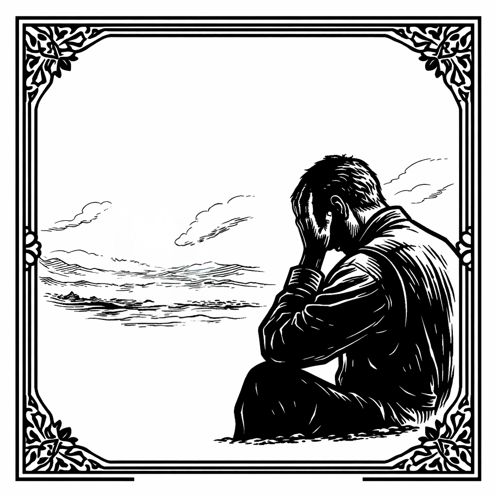{width=80%}


```{=latex}
\end{center}
\vspace*{\fill}
\newpage
```

# 9. Bölüm

Katil Nuri Efe Dumanköy'ü çevirmesinde başta kader birliği yaptığı iki arkadaşını yitirince bir daha eski Nuri efe olamadı. Arkadaşları Kara Durası'nın kurşunlarına hedef olarak yaşamlarını yitirmişlerdi. Hem de o yokken yitirmişlerdi. Yıllardır sırt sırta verdikleri efe arkadaşlarını bu defa Katil Nuri efe yalnız bırakmıştı, hem de yalan söyleyerek, çatışmadan kaçarak. Aslında en fazla da Kara Durası ile karşılaşmak istediğini söyleyen kendisi değil miydi? Bu 3'lü Karamatlar'lı efeler grubunu oluşturma fikri de ilk Katil Nuri efe'den çıkmamış mıydı? Hem bu 3 Karamatlar'lı efenin en cesuru, en acımasızı, en gözü karası Katil Nuri efe bilinmiyor muydu? Bilinmesine biliniyordu ama ilk gerçek tehlike karşısında karın ağrısı numarası yaparak arkadaşlarını satan da yine Katil Nuri olmuştu. Hem de orada burada Kara Durası bir karşıma çıksın, bir karşı karşıya gelelim, alnının ortasına bir delik açacağım deyip dururken. Komutana da, siz merak etmeyin komutanım o Kara Durası denen it beni karşısında görünce korkudan eli ayağına dolaşır demişti.

Katil Nuri karmaşık duygular yaşıyor, kendi yaptığını kendisine bile anlatamıyordu. Kendi kendine Süleyman ve Hasan benim numaradan karın ağrısı çıkardığımı anlamışlar mıdır diye düşündü. Anlamazlar mı, anlamışlardı tabi. Hem de önce Pepe Hasan çözmüştü karın ağrısı olayının numara olduğunu. Belki başka bilenler vardı bu durumu, belki de yoktu ama Nuri kendi biliyordu ya, arkadaşlarını yalnız bırakmanın utancını yaşamı boyunca yaşayacağı belliydi. Yine kendi kendine Hasan belki anlamamıştır ama Süleyman ince fikirlidir, anlamıştır diye düşündü.

Katil Nuri efe, Şehit arkadaşım Halil bu Durası itini 14 yaşındayken çoban olarak yanına aldı, onun eline silah verdi, atış yaptırdı, daha sonra da Süleyman yine onunla sanki arkadaşı Şehit Halil'in emaneti gibi ilgilendi, herkes dışlarken kollayıp gözettiği, eline silah verdiği, nişan almasını, ateş etmesini, hedefi vurmasını öğrettiği Durası tarafından öldürülmeleri onu çok fena etkilemişti. Kara Durası hiç acımadan kurşunu Süleyman Efe'nin tam kafasına sıkmıştı, kalleşçe arkasından vurmuştu.

Katil Nuri ruh gibi dolaşıyordu. Başta komutan olmak üzere ona hiç kimse bir şey demese, suçlamasa da, o kendini suçluyor, bu korkaklığı, hatta kalleşliği nasıl yaptım can arkadaşlarıma diyordu. Katil Nuri Efe komutan bizden habersiz hiçbir şey yapmayacaksın dese de Kara Durası ile yüz yüze gelmeyi, arkadaşlarımı neden arkalarından kafalarına ateş ederek öldürdün diye sormayı, ondan sonra o da Kara Durası'nın kafasına tek kurşun sıkmayı hayal etmişti, arkadaşlarını kara toprağa verdiği andan itibaren. İstemişti de Kara Durası ile bir araya gelme şansı bulamamıştı. Araya Kara Durası'nın çok güvendiği adamlarını koymuş ama Kara Durası ne görüşürüm demiş, ne de görüşmem demiş, hep suskun kalmış ama hiçbir zaman görüşmemişti. Katil Nuri Efe, Kara Durası'ndan haber çıkmadıkça iyice sinirleniyor, iyice kabuğuna çekiliyor, Kara Durası tarafından kendini aşağılanmış, adam yerine konulmamış gibi hissediyordu. Aslında karın ağrısının oyun olduğu anlaşılsa kendi köyü Karamatlar'da bile insan içine çıkamazdı.

Süleyman ve Hasan efeler arkalarından tek kurşunla vurulduklarından belki de ölmeden önce kim tarafından vurulduklarını bile anlayamamışlardı. Yılların kurdu, cepheden cepheye koşmuş uzman çavuş Ramazan, Katil Nuri'nin karın ağrısının numara olduğunu Haceller köyü muhtarıyla görüştükten sonra anlamıştı ama komutan bir şey sormayınca, o da bir şey söylememişti. Bu durum ortaya çıksa Nuri efe af kapsamı dışına çıkarılır, yargılanır, daha önce adam öldürdüğünden muhtemelen asılarak idam edilirdi. Ramazan çavuş biraz da kendisi yüzünden birinin idam edilmesini göze alamamıştı.

Yirmi yılı aşkın askerlik macerasının çoğu cephelerde düşmanla vuruşarak geçmişti. Öyle kişiler görmüş önce cepheden kaçmış, daha sonra büyük kahramanlıklar göstermişti. Öylelerini de görmüş, tam tersi olmuştu, baştan kahraman, sonra vatan haini. Aklına Kürt Memo geldi. Sen yıllarca kahramanca düşmanla vuruş, gözünü budaktan esirgeme, sonunda Kara Durası gibi bir acımasız eşkıyanın kölesi ol, onun uğruna bir hiç için öl. Kendi kendine inşallah memleketine haber savaşta öldü ya da kayboldu olarak bildirilmiştir, Allah taksiratını afetsin dedi.

Katil Nuri efe artık komutanın emrinde bir Kuvayi Milliye milisiydi. Yaptıklarına, yaşantısına dikkat etmesi gerekiyordu. Akçapınar Köyü'ndeki bir kapatmasının Katil Nuri Efe ile olan birlikteliği iyice ayyuka çıkmıştı. Efenin arkadaşlarının ölmesi, kendisinin de hükümetin emrine girmesi dolayısıyla bir şey yapamayacağını bilen köylüler kadını köyden sürdüler. Bacağının biri biraz aksak olan kadın Yenipazar'da evli olan ablasının yanına sığınmak zorunda kaldı. Birkaç ay orada kalan kadın eniştesi tarafından taciz edilmeye başlayınca iyice bunaldı ve Katil Nuri Efe'ye beni bu duruma sen düşürdün, ne yapacaksan yap, bu işi temizle. Sana bir hafta müddet veriyorum, bir haftada beni buradan aldın aldın, almazsan ibretialem olsun diye Yenipazar'ın ortasına kendimi asacağım.

Katil Nuri bu haberi aldığı günlerde arkadaşlarına yaptığı hayınlığın utancıyla avare avare dolaşıyordu. Haberi alınca kendine geldi. Kadını tanıyordu, dediğini yapardı. Kadın onu hep çok sevmişti. Ne yapacağını derin derin düşündü. Kadın kendini asarsa hakkındaki af kararı düşer, komutan da af kararını kaldırtır, hapsi boylar, adam öldürdüğünden belki de sonu yağlı urgan olurdu. Osmanlı İmparatorluğu döneminde 4 evliliğe kadar ruhsat olsa da Karaahmetler Köyü'nde bırak dört evli, iki evli bile yoktu. O kadını karım diye evine getiremezdi. Evde karısı, çocukları vardı, efeliğin şanına sığmazdı. Köyde Durmuş adında akrabası bir eli çolak biri vardı. Durmuş'u bir gün karşısına aldı. Durmuş eskiden beri Katil Nuri'den çok korkar, bir dediğini ikiletmezdi.

— Bak Durmuş benim Akçapınar'daki yengen köyden Yenipazar'a sürülmüştü. Orada dapuşt eniştesi dirlik göstermemiş, sarkıntılık etmiş. Yengen haber gönderdi bu işi temizle yoksa kendimi asarım diye. O kadınla ilişkimi keseli çok oldu. O artık benim Dünya ahret bacım. Öylecede bırakamam. Onu Yenipazar'dan alıp geleceğim. O kadını sen nikahla, senin karın olsun.

— Emrin başın üstüne efem ama nasıl olacak, bizim köyde hiç iki evli yok ki.

— Durmuş dinimizde dört evliliğe kadar ruhsat var, sen evlen, sen ilk olursun ne olacak. Ben sana altın vereceğim, sizin her ihtiyacınızı yaşadığım sürede karşılayacağım.

— Bilemedim ama efem, sen öyle diyorsan, öyle olsun.

Katil Nuri efe kadını alıp geldi, Durmuş ile nikahlarını kıydırdı. Durmuş'a 5 sarı lira verdi. Meteliğe kurşun atan Durmuş havalara uçtu. O kadın Karamatlar'da 90 küsür yaşına kadar yaşadı ve köyde herkes ona Akçapınar'lı yenge diye seslendi. Çok iyi, herkesin yardımına koşan bir kadındı. Köycek köylü tarafından ölümüne kadar çok sevildi.

Katil Nuri kadın meselesini sonunda çözmüştü ama kafasında dolaşıp duran arkadaşlarına ihanetini zihninden bir türlü uzaklaştıramamıştı, ben ne yaptım duygusu beynini kemirip duruyordu. Katil Nuri efe neredeyse birkaç ayda on yaş kadar yaşlanmıştı. Jandarmayla birlikte operasyonlara katıldığı günlerin dışında evden pek dışarı çıkmıyor, kimseyle de pek konuşmuyordu. Zamanında jandarma onu kovalarken, o şimdi jandarma ile birlikte bölgede kalan çete ve çete artıklarını kovalıyordu. Ara sıra Molla Mehmet ile görüşüyordu. Bir de Taraklı'nın Bilyaz köyü'ndeki sevgilisinin yanına gidiyordu. Tek onun yanında huzur bulur gibiydi. Haftada bir gecede olsa onun güler yüzünü görmek, onunla sohbet etmek, onu sevmek, onun sevgisini hissetmek iyi geliyordu Katil Nuri Efe'ye. Sadece onun yanında mutlu, onun yanında huzurluydu. Bu yasak aşkın ila ebet sürmeyeceğini ikisi de biliyordu aslında.

Katil Nuri Efe son günlerde itiyatsız da davranmaya başlamıştı. Gidiş gelişlerinin başkaları tarafından fark edilmesine pek te aldırmaz olmuştu. Yasak aşkından başka tek vazgeçemediği şey ata binmekti. Atına atlıyor, atını dört nala kaldırarak kendini rüzgara bırakıyordu. İçkiyi de çok fazla içmeye başlamıştı. Artık kuvvacı olarak düzenli ordunun emrinde çalışıyordu. Komutan bir operasyon olacağı zaman onu çağırıyor, diğer zamanlar köyde duruyordu.

Katil Nuri efe Köprücek tarafında jandarma ile birlikte katıldığı bir eşkıya takibinde yaralanmış, 15 günde ancak iyileşebilmişti. Komutan olayı Molla Mehmet'e anlatırken sanki ölüme gider gibiydi, eşkıyaların üzerine kendini korumadan fişek gibi atıldı. Yaralandığını yere dökülen kanından öğrendik. Tedavi ettirebilmek için zor durdurduk demişti. Molla Mehmet'te, Komutanım köyde de ruh gibi neredeyse evden dışarı çıkmıyor. Efe arkadaşları şehit düştükten sonra bu Katil Nuri'ye bir haller oldu. Evlerimiz karşı karşıya, bazen pencerenin önüne oturuyor, önünden geçiyorum, ben selam vermesem fark etmiyor bile demişti. Komutan her eşkıya takibinden önce Katil Nuri Efe'yi uyarır olmuştu. Katil Nuri efe sanki duygusuz gibiydi, ne olacaksa bir an önce olsun der gibiydi.

Şehit düşen Süleyman efenin iç güveyi geldiği evin oğlu Halil ve kardeşi Ali vatanı savunmak için şehit düşmüştü. Evin tek erkeği oydu. Şimdi bir de hükümetçe af edilmişti. Ailesi umutlanmış, geleceklerini ona göre düşünmeye başlamışlardı. Süleyman efenin eşi Zekiye ve şehit düşen babalarından sonra ona baba diyen çocukları sevinmişlerdi her şey yoluna girecek diye. Süleyman Efe'nin şehit haberi ailesini yıkmıştı. Aynı ev birkaç yılda peş peşe 3 şehit vermişti. Ali ve Halil'den sonra Süleyman'da şehit düşmüştü. Zekiye yenge'nin öksüzleri ikinci defa babasız kalmışlardı. Katil Nuri efe'yi en fazla da arkadaşının ailesinin bu durumu üzüyor, onların yüzlerine bakamıyordu.

Rüyasında Zekiye yenge karşısına geçerek Nuri, korkak Nuri, arkadaşlarını yalnız bırakıp, kaçtın, sende hiç utanma yok mu diyordu. Pepe Hasan için üzülen Süleyman'a göre daha azdı. Hacı Veliler'in şehit karısı dul kızları iki çocuk anası Hatice, baskılara dayanamamış Pepe Hasan ile evlenmek zorunda kalmıştı. Jandarma tarafından evin sarılarak kurşuna tutulmasından sonra çocuklarını korumak için Pepe Hasan'ı bir daha eve almamıştı. Hacı Veliler ile Zekiyeyengegiller'in evleri saçak saçağaydı. Bir gün Zekiye yenge;

— Hatice abla seninde başın sağolsun, senin de kocan şehit düştü ama sen ardından göz yaşı dökmedin hiç.

— Zekiye benim kocam evet şehit düştü, o da Hüseyin'imdi. Ben Hasan ile çocuklarıma sahip çıkar diye, evimizde bir erkek olsun diye evlendim. O ne yaptı, kadından kadına koştu. Ben yine de karılık görevimi yaptım. Mevlüdünü, kuranını okuttum, mevlüt pilavını yaptım, Allah taksiratını afetsin.

— Kader Hatice abla, Süleyman, Halil'imin iyi arkadaşıydı. Ben de senin gibi baştan evimizde bir erkek olsun diye evlendim. Niye yalan söyleyeyim daha sonra ısındım Süleyman'a. Babaları Halil şehit düştüğümde iki evladım da daha ufacıktılar, Süleyman'a baba diye sarıldılar, o da öz babalarıymış gibi sarıldı onlara. Allahı var, kendisi yok ben Süleyman'ın başka bir kadına gittiğini hiç duymadım. Haftayı geciktirmez gelir, evin her ihtiyacını görürdü. Hem erim Süleyman'a, hem de kader arkadaşı Hasan'a Allah rahmet eylesin. Ne yapalım bizim de yazımız böyleymiş. Erlerim boşuna ölmediler, vatan düşmandan temizlendi ya o tesellimiz.

— Öyle ya Zekiye vatan kurtuldu, bizim erkeklerimiz de ya şehit, ya da gazi olarak vatana borçlarını ödediler.

Katil Nuri sık sık üzgün ve dalgın. Atına atlayıp gidiyor, bazen günlerce köye dönmüyordu. Nereye gittiğini, ne zaman geleceğini kimseye söylemiyordu. Ev halkı onun jandarmayla sık sık eşkıya takibine çıktığını bildiklerinden hiçbir şey sormuyorlardı.

Katil Nuri Efe yine bir gün atına atlayarak köyden ayrılmış, günlerdir köye dönmemiş, bir haber de göndermemişti. Bu uzun gelmeyişleri ilk olmadığından ailesi pek te merak etmemişti. Daha önce de Bilyaz köyü'ndeki sevgilisinin evinden günlerce çıkmadığını görenler olmuştu. Komutanın emrinde jandarma ile birlikte eşkıya takibine çıkarken de nereye gittiğini ailesine hiç söylememişti.

Bir gün Molla Mehmet'in kardeşi Yakup, Badet çayırında Katil Nuri efenin atını kendi kendine otlarken gördü. Merak edip baktığında Katil Nuri Efe'yi meşenin dibinde uyur buldu. Silahı da çayıra sanki atılmış gibiydi. Yanına gelene kadar uyanmadı Nuri efe.

— Katil Nuri efe ne bu uyku. Ne bu itiyatsızlık, sabaha kadar beşik mi salladın, ya eşkıya baskınına uğrasan.

— Aman be Yakup ağa çok itiyatlıydık ta ne oldu? Süleyman ve Hasan yoldaşlarım şimdi yok. Bizimde sonumuz bir kurşun değil mi? Ha beş gün önce, ha beş gün sonra.

— Ağzından yel alsın be efem, o nasıl lakırtı. Artık sen kuvvacı oldun. Artık devlet afetti seni, tezkerenide alacaksın, toparla kendini. Seni böyle kıstırırsa Kara Durası anında basar kurşunu.

— Doğru değil mi be Yakup ağa. Ben arkadaşlarım Dumanköy kırında toprağa düşünce orada benimde yarım öldü zaten. Kara Durası'na gelince yaşıyorsam o deyusu öldürmeden ölmemek için yaşıyorum. Ya ben onu, ya o beni haklayacak. Allah artık kime fırsat verirse. Bu güne kadar kötü şeyler yaptım Allah duamı kabul eder mi bilmem ama ben yine her gün Allahıma o Kara Durası'nı vurmama nasip etsin diye dua ediyorum. Katil Nuri efe yattığı yerden ayağa kalkarak atına bindi. İki atlı yan yana laflayarak köye doğru at sürdü. Köye gelince atının eğerinin kolanını çözerken Molla Mehmet seslendi,

— Nuri Efe kahve cezvesini mangala sürdüm, gel birer fincan kahve içelim, ondan sonra gidersin eve.

— Sana afiyet olsun Mehmet ağam, benim hiç keyfim yok, hastamı olacağın ne, eve çıkıp biraz uzanacağım.

Katil Nuri efe 2-3 gün evden hiç dışarı çıkmadı. Bir gün Katil Nuri Efe akşam ezanından hemen sonra kimseye bir şey demeden atına bindi, yel gibi gözden kayboldu. Katil Nuri Efe o gece Karamatlar'a dönmedi. Ertesi sabah atı tek başına, Katil Nuri Efe'nin filintası eğere asılı çıkageldi. At evin önünde kişniyor, bir o yana, bir bu yana bir şey dermiş gibi koşuyor, evin önünden ayrılmıyordu. Atı tek başına gören akrabaları büyük endişeye düştüler. Katil Nuri Efe bölgenin en iyi at binicilerindendi. Attan düşmesi mümkün değildi. Başına mutlaka bir şey gelmişti. Atı da çok cins bir attı. Öyle durup dururken süvarisini bırakıp, tek başına köye dönmezdi. Mavzer de atın eğerinde duruyordu.

Köyden başta Molla Mehmet 5 erkek aramaya çıktılar. Herkes Katil Nuri Efe'nin o gece Bilyaz'a sevgilisinin yanına gittiğini tahmin ediyorlardı. Karamatlar'dan Bilyaz'a giden yolda atı olan atlı, olmayan yaya yola düştüler. Tam Gövemcik çeşmesini geçmiş, Bilyaz tarafındaki çamlığa girmişlerdi, elli metre kadar gitmeden Katil Nuri Efe'yi yolun ortasında upuzun yatar buldular. Göğsünde kalbinin üzerinde iki mermi deliği vardı. Katil Nuri Efe öleli çok olmuştu, muhtemelen gece ölmüştü. Vücudu katılaşmış, akan kan kurumuştu. Mermilerin giriş açısına baktıklarında yol kıyısındaki bir çamın üzerinden ateş edilmişti. Yakup ağa ateş edildiği tahmin edilen çama çıktığında yanılmadıklarını anladı. Çamın yolun Bilyaz tarafını gören dalları kesilmiş, rahatça oturulabilecek bir yer hazırlanmıştı. Kesim yerlerine baktıklarında en fazla daha bir gün önce kesildiği belli oluyordu. Katil Nuri Efe'nin o gece Bilyaz'a gittiğini bilen biri daha önceden buraya gelerek tertibat almış ve pusuya yatmıştı. Katil Nuri Efe'de ay ışığında atının üzerinde gelirken ateş ederek kalbinden vurmuş ve öldürmüştü.

Katil Nuri Efe'nin cenazesi bir atın üzerine konularak köye getirildi. Katil Nuri efe'yi bu defa atın eğerine bir heybe gibi asıldığını gören köylüler çok üzüldüler. Ah Nuri efe, attığını vuran efe sen bu duruma düşecek adam mıydın diye ağıtlar yaktılar.

Akçapınar'lı bir kenara çöktü, göz yaşlarını başkalarından gizlemeye çalışarak, Ah Nuri, Katil Nuri, Gönlüme giren, gönlümün eri Nuri, Kadınlar seni sevdi ama sen bilirim benden başka hiçbir kadını sevmedin, sevmedinde uçkuruna söz geçiremedin. Senin bu uçkur düşkünlüğün yedi sonunda işte başını. Seni uzaktan da olsa görürüm diye geldim buraya, uydum dediğin söze, kaderimdir dedim katlandım her şeye ama şimdi sen de gittin, ne eylerim, niye sarılırım ben bu yabancı köyde diye için için ağladı.

Molla Mehmet kardeşi Yakup ağa'yı göndererek haber iletti. Kasabadan gelen komutan ve memurlar cenaze merasimine katıldılar. Komutanın cenaze namazında imamın meftayı nasıl bilirdiniz diye sorarken gözlerinden akan yaşları gizlemeye çalışarak sildiği görüldü. Katil Nuri Efe'yi Kara Durası vurdu, vurmuştur, başka kim vuracak dediler. Bu dilden dile yayıldı. Kara Durası ne yaptığını, ne yapmadığını söyledi, kendisi üzerine atılan diğer cinayetlerde olduğu gibi sessiz kaldı, böylece kabullenmiş oldu.

Katil Nuri efe ve Kara Durası'nı iyi tanıyanlar bu cinayeti işleyenin kesinlikle Kara Durası olmadığına emindiler. Kara Durası bu güne kadar Katil Nuri Efe ile karşılaşmaktan kaçınmıştı. Hem de Kara Durası böyle bir pusu kurmazdı. Kara Durası bu güne kadar öldürdüğü adamları öldürmedim dediği hiç olmamıştı. Kara Durası'nın Katil Nuri efe'den hem çekindiği, hem de ona karşı büyük kini olduğunu cümle alem biliyordu. Kara Durası, Katil Nuri efe'yi öldürmüş olsa kimseden gizlemez, bana askerle birlikte pusu kuranların sonu bu olur, sonuncusunu da öldürdüm işte diye övüne övüne anlatırdı.

Aslında Katil Nuri Efe Bilyaz'a girdikten hemen sonra Katil Nuri Efe'nin sevgilisinin 16 yaşındaki erkek kardeşinin elinde silahla köyün dışına çıktığını görenler olmuştu. Hem Katil Nuri Efe, hem de Kara Durası'nı tanıyanların, kadının kardeşinin vuran kişi olduğuna emindiler. Kara Durası öldürülen kişilerin kendi üzerine suçun atılmasının namına nam kattığı düşüncesiyle kabullenmesi olayın hiç araştırılmamasına sebep olmuştu. Savaş zamanı bu karışık işlere ayıracak ne zaman, ne de jandarma vardı. Katil Nuri Efe'de öldürülmüştü, hem de Kara Durası tarafından. Kara Durası kimsede intikamını bırakmıyordu işte. Jandarmayla kendini takibe çıkan 3 efeyi de tek tek kıstırarak öldürmüştü. Bu Kara Durası'ndan korkulurdu. Bu eşkıya Kara Durası zamanında onu efeler grubuna aldırmayan, onunla alay eden, ona kötü davranan, sümüklü diyen, çoktan beri diş bilediği Katil Nuri Efe'yi bile acımadan, hem de kalbinden vurmuştu.

Katil Nuri Efe Dumanköy kuşatmasında efe arkadaşlarının ölümünden sonra sanki ben de öleyim, öleyim de bu hayattan kurtulayım der gibiydi. Bir yere giderken mavzerini de yanına iş olsun diye alır gibiydi. Kendi güvenliğini düşünmek aklının ucundan bile geçmiyordu. Dumanköy kuşatmasındaki karın ağrısının çakallık olduğunu ondan korkularından kimse söyleyememiş olsa da, o kendi yaptığı çakallığı biliyor, onun pişmanlığını yaşıyordu. Onun tek düşündüğü Jandarma Komutanının bilip, bilmediğiydi. Kendi kendine hep bilseydi beni eşkıya takibine çıkarken yanına alır mıydı. Vuruşmalarda hep beni yanında tutar, kendi güvenliği için sonuna kadar bana güvenir miydi diye düşünmüştü. Eşkıya takibinde Katil Nuri Efe defalarca komutan ve diğer askerler için kendi canını hiçe saymıştı. Aslında neredeyse kendini öldürtmek ister gibiydi.

Molla Mehmet bir gün kardeşi Yakup ile konuşurken,

— Yakup kardeşim bu Durası'nın işi değil. Sende bilirsin Durası'nın bu memlekette en fazla sevmediği iki kişi varsa, bunların biri bensem, öteki de Nuri Efe'dir. Kara Durası, Katil Nuri Efe'yi öyle itiyatsız tek başına yakalayacak, sadece öylece öldürerek bırakacak. Baksana Nuri mavzerini bile atının eğerinden çekmeye davranmamış, ya da davranamamış. Kara Durası olsa önce kollarına ateş eder, onu kendine zarar veremeyecek hale getirdikten sonra saatlerce işkence ederek öldürür, hem öldürür, hem de ölüsünü atıyla sürükleyerek getirir köy meydanına atardı.

— Haklısın ağam, Hüseyin'i kaçırarak fidye istediği zamanlardan birinde; Şu Dünya'da atımın kuyruğundaki kıllardan biri kadar sevmediğim iki kişi varsa bunların birisi Molla Mehmet deyusu, öteki de kendini cesur gösteren ama aslında kedi kadar korkak Katil Nuri efe. Bu iki deyyusun ölümleri önünde sonunda benim mavzerimden çıkan kurşunla olacak. Onları tabancayla değil, illada mavzer kurşunuyla vuracağım. Kurşun vücutlarından çıkarken cep aynası gibi delik açsın.

— Pis herif beni sonuna kadar öldürmez, ben ölürsem haracı kimden alacak. Merak etme sen kardeşim bu günlerde biraz itiyatlı davran sen de. Bu devlet üç beş çapulcu eşkıyasına papuç bırakmaz. Şu zafer sevinci biraz geçsin, bu eşkıyalarıda bir bir avlarlar. İşte tam bu zamanda Kara Durası papuçun pahalı olduğunu anlarsa ölmeden önce bizi öldürmek ister.

Çocuklar, özellikle de Hüseyin köyden ayrılmasınlar. Olabildiğince dikkatli davranalım.

— Haklısın ağabey, bu eşkıya bozuntusunun ne yapacağı belli olmaz. Ağam Hüseyin aldığımız av tüfeğini çok güzel kullanır, versek te yanlarına alsa.

— Olmaz Yakup, olmaz kardeşim. Onlar daha çocuk, maazallah yanlışlıkla birbirlerini vururlar. Silahla şaka olmaz. Durası kaçırdığında fidyeyi verip geri alıyoruz. Ya biri ölürse kimse geri getiremez.

Katil Nuri Efe öldürüldükten sonra bu ölüm haberi dilden dile yayılır oldu. Çoğunluk Kara Durası vurmuş, hem de tek kurşunla kalbinden dese de, fısıltı gazetesi yok, yok Durası değil, o Bilyaz'daki sevgilisinin kardeşi vurmuş. Aferin çocuğa hem mangal gibi yüreği varmış, hem de iyi nişancıymış, bir kurşunda indirmiş adamı. E su testisi su yolunda kırılır diye boşuna dememişler.

Kara Durası'nın kendisinin peşine jandarmayla birlikte düşen namlı 3 efeyi hepsini de öldürdüğüne dair haberler dilden dile anlatılır, Kara Durası'nın çevreye yaydığı korku dağ gibi büyür oldu. Kara Durası'nın kötü namı artık komşu iller Bolu, Adapazarı, Bursa, Kütahya, Eskişehir köylerinde de anlatılır olmuştu. Kara Durası daha da rahatlamıştı. Dumanköy kuşatmasından sonra onu öldürmek için ortada ruh gibi dolaşan Katil Nuri tehlikesi de kendiliğinden ortadan kalkmıştı.

Ankara Hükümeti'nin milli ordusu Sakarya Meydan Savaşı'ndan sonra Baş Komutanlık Meydan Savaşı'nda Yunan Kuvvetlerini yenilgiye uğratmış, düşmanı önüne koyarak kovalamaya başlamıştı. Genel Komutan Mustafa Kemal Afyon, Kocatepe'de işaret parmağıyla İzmir yönünü göstererek,

— Ordular ilk hedefiniz Akdeniz'dir, ileri.

Emrini vermişti. Yunan kuvvetleri geri bozgun halinde kaçarken geçtikleri şehirleri ateşe veriyorlardı. Düşman güçleri Bilecik’i ateşe vermişler, neredeyse Bilecik’in tamamı yanmıştı. Günümüzde belediye binası olarak kullanılan bina, Valilik binası, Orhan Gazi Camii ve beş, on ev sağlam kalmıştı.

Türk Kuvvetlerinin bu başarısı tüm eşkıyalar gibi Kara Durası'nı da telaşa düşürmüş, acımasızlığını iyice arttırmıştı. Savaşın kazanılması sonucu haraç alınan kişilerde de mızırdanmalar başlamıştı. Son istenilen haracı Molla Mehmet vermemişti, vermemişti ama oğlu Hüseyin'i de hiç yanından ayırmaz olmuştu.

Savaşın kazanılması, düşmanın vatan topraklarından kovulması bölgede yaşayan halk üzerinde büyük bir olumlu etki yaratmış, halkın umudu, direnci yeniden artmaya başlamış, daha önce çetelere istediklerini sorgusuz sualsiz veren gariban halk direnir, çetelerin istediklerini vermez olmuşlardı.

Kara Durası durumun aleyhlerine geliştiğinin farkındaydı. Bu nedenle acımasızlığını daha da arttırmış, daha sık yer değiştirir olmuş, daha fazla yerde görünür olmuştu. Tek yaptığı iyi şey zorla kadınlara gider, onlara zorla sahip olmaz olmuştu. Bu konuda Şaziye'ye verdiği sözü tutar gibiydi. Bir de ortalık çok karışık olduğundan uçkur düşünecek zamanı bulamıyordu. Kara Durası son Şaziye'nin evine gittiğinden bu yana Şaziye'ye verdiği sözü tutuyor, başka kadınlara gitmiyordu.

Kara Durası hiç durmadan yer değiştiriyordu. Diğer bazı çetelerin dağılması sonucu Kara Durası'na gelip, katılanların sayısı her geçen gün artar olmuştu. Kara Durası çevreye verdiği korkuyu artırmak için çetenin sayısının 15 ile 20 arasında olmasına dikkat ediyordu. Kontrol etmenin zorluğunu düşünerek çetenin 20'nin üzerine çıkmamasına dikkat ediyordu. Göynük köylerinde jandarma daha sık araziye çıkarak çete takibi yapmaya başlamıştı. Kara Durası çetesini 4-5 kişilik gruplar halinde ayrı ayrı bölgelerde görünmelerine dikkat ediyordu. Bir çete Göynük köylerindeyken, diğeri Taraklı köylerinde, bir diğeri Geyve köylerinde, bir diğeri ise Sarıcakaya köylerinde görünebiliyordu. Güvenlik kuvvetleri de hangi grubun peşine düşeceklerine karar veremiyorlardı.

Kimlerden, ne kadar haraç alınacağına tek başına Kara Durası karar veriyordu. Yanlış yapan çete üyeleri acımasızca cezalandırılıyordu. Ceza kırbaçlamadan, çeteden kovulmaya, çeteden kovulmadan öldürülmeye kadar varabiliyordu.

Kara Durası en fazla bir yıl içerisinde dağlarda barınabilmenin mümkün olamayacağının farkındaydı. Çete faaliyetlerini yürüttükleri ana merkez Bilecik'in Gölpazarı ve Söğüt, Sakarya'nın Taraklı, Bolu'nun Göynük, Eskişehir'in Sarıcakaya ilçelerinin birleşim noktası köylerdi, yani ilçe merkezlerine en uzak, dağlık alanlardı.

Kurtuluş Savaşı'nın kazanılması tüm ülkede olduğu gibi bölgede de hızla dalga dalga yayılmıştı. Yıllarca süren ve peş peşe gelen yenilgilerden sonra morali bozulan sinen halka bu yeniden bir güç, güven sağlamıştı. Genç erkekler yirmi yıla yakın bir zamandır sürekli askere alınıyor, bu askere alınan gençlerin çoğundan ya şehit haberi geliyor ya da hiç haber alınamıyordu. Askere alınan 3 gençten ancak biri köye dönebiliyor, onların da yarıdan fazlası yaralı dönüyordu. Köyde çiftçiliği kadınlar, çocuklar ve yaşlılar yapmak zorunda kalıyorlardı. Onlar da tarım alanlarını yeterince işleyemediklerinden insan yiyeceği ve hayvan yemi kıtlığı yaşanıyordu. Çift süren öküzü hastalanarak ölen, ya da yaşlanan biri öküzünün yerine öküz alamıyor, tek öküzünün yanına damdaki ineğini ve eşeğini koşuyordu.

O yıllarda eşek çok önemli ve faydalı bir hayvandı, eşeği olmayan ev olmazdı. Eşekle odun getirilir, eşekle değirmene öğütmek için buğday götürülür, eşekle küfelere üzüm doldurularak, bağdan üzüm getirilir, semerine binilerek dağa, bayıra gidilir. Eşek ulaşımın ve taşımacılığın vazgeçilmez bir hayvanıydı. At ise asil hayvandı. Cins atlara ancak ağalar, beyler binebilirlerdi.

Kurtuluş Savaşı'nın mutluluk dalgası karakollarda sayıları az olan jandarma müfrezelerini de sarmıştı. Hükümet yetkilileri Ankara Hükümeti'nin alacağı kararları beklemeye başlamışlar, eşkıya takiplerini şikayet gelmedikçe pek yapmaz olmuşlardı. Adı sanı pek bilinmeyen küçük çeteler kendiliğinden dağılmaya başlamış, dağılan çete üyeleri halkın arasına karışarak izlerini kaybettirmeye çalışmışlardı. Kara Durası çetesinin namı tüm vilayeti hatta çevre ilçeleri bile sarmıştı. Kara Durası kendini ve çetesini ne kadar göz önünde tutmaya çabaladıysa, bir o kadar Şaziye'yi gözlerden uzak tutmaya çalışmıştı. Şaziye'nin de Kara Durası'nın hediye ettiği ve çok sevdiği yel gibi koşan bir atı vardı.

En son gittiğinde Kara Durası, Şaziye'nin atının öldüğünü öğrenmişti.

Kara Durası Şaziye'nin atının öldüğünü de tesadüfen öğrenmişti. O gidişinde de, her defasında olduğu gibi Şaziye’ye bir çok erzak, giysinin yanı sıra at için yem de götürmüştü. Yem çuvallarını gören Şaziye,

— Yemlere lüzum yok aslanım.

— Neden Şaziyem, atın ne yiyecek?

— Atım öldü kocam, bir hafta kadar önce atım öldü.

Bunları derken Şaziye'nin her iki gözünden de yanaklarına doğru göz yaşları akmıştı. Kara Durası bir şey dememiş, hayran hayran Şaziye'nin yüzüne bakmıştı. Kendi kendine, bir kadına her şey nasıl bu kadar güzel yakışır, ağlamak bile diye söylenmişti. Kara Durası bir şey dememişti ama aklına koymuştu. Şaziye'ye yeni bir at bulacak, hem de en asilinden, en uysalından, en hızlısından.

Bir gün Taraklı yakınlarındayken adamlarını göndererek Taraklı'nın en iyi semercisini yanına getirtti. Dükkanından hiçbir şey denilmeden palas pandıras alınan semerci Kara Durası'nın karşısına çıkarıldığında korkudan titriyor, elleri ayakları birbirine dolaşıyordu. Kara Durası adamın bu halini görünce egosu kabardı, keyifle gülerek,

— Ulan semerci seni buraya canını almak için çağırmadık, haraç istemek için de çağırmadık zaten senin etin ne, budun ne? Korkma, seninle bir işimiz var, seni buraya ondan çağırdık. Bak semerci, şimdi sana diyeceklerimi kulağını aç iyi dinle. Biri eksik olursa, eksik duyan kulağını keserim o zaman.

Semercinin eli gayriihtiyari kulağına gitti. Bunu gören Kara Durası bastı kahkahayı, ona daha düşük tonda da olsa adamları katıldılar.

— Bak semerci sen Taraklı'ya gidince şöyle gelin gibi beyaz, genç bir kısrak at bulacaksın. Genç olacak, hem de sakin ve yumuşak başlı olacak. Aynı zamanda hızlı koşacak. Şimdi böyle bir at aldıktan sonra sen bu ata yepyeni bir eğer, bir de semer yapacaksın. Tabi yuları kayışları her şey yepyeni olacak. Heybesi, atın yem torbası da yepyeni olacak.

Bir de heybeleri köpük helvası, leblebi, fındık, fıstık, şeker, kahve fasulye, nohut aklına ne gelirse ağzına kadar dolduracaksın. Bir hafta sonra herhangi bir gün gelip adamlarım atı senden alacaklar.

— Alacağımda ağam, bunları alacak para bende nerede?

— Kaygılanma len semerci, para vereceğim sana. Sana 4 altın vereceğim, 3 altın alacaklarına yeter, 1 altında sana kalır. Sayi hani şu süslü tahta kaşıklardan iki düzüne, 4 tanede güzel kepçe koy. Bir de su koymak için çotura koy. Tabi at içinde bir çuval arpa koy.

— Tamam ağam bu dediklerinin hepsini bir haftaya varmaz hazır ederim, sen meraklanma.

— Ben meraklanmam semerci. Emrederim, yapılmazsa cezasını veririm.

Adamlar semerciyi yeniden alarak geri götürdüler.

Bu defa dönüşte nalbant birini yanlarına alarak geldiler. Nalbant 15 eşkıyanın 15 atının nallarını bir güzel yeniledi, Kara Durası ona da ücretini ödedi. Kara Durası haraç alacağından haraç alır ama iş yaptırdığı birine de ücretini fazlasıyla öderdi.

Kara Durası durmadan yer değiştiriyordu. Onu şaşırtan bir şey olmuştu. Başkomutanlık Meydan Savaşı'ndan sonra eşkıya takipleri neredeyse hiç yapılmaz olmuştu. Küçük çetelerin çoğu sırra kadem basmış, izlerini kaybettirmişlerdi. Kara Durası gibi aşikar olanlar, hala dağda, hala haraç almaya devam ediyorlardı.

Kara Durası bir gece yarısı iki adamını Taraklı'ya gönderdi. Adamları daha önce semercinin evinin yerini tespit etmişlerdi.

Gece yarısı semercinin kapısını çaldılar. Kapıyı açan semercinin karısı kapıda baştan aşağı silahlı, pos bıyıklı iki adam görünce korkudan bir çığlık attı. O sırada semercide kapıya gelerek;

— Korkma hatun, onlar tanıdık. Hoş geldiniz ağalar.

— Hoş bulduk, ağam hazırladıklarınla birlikte seni bekler, haydi gidelim.

Semerci kendi atını, hazırladığı atı eğerledi, hazırladığı semeri, istenilenleri atlara sardı, eşkıyaların peşine düştü. Dumanköyü yakınlarında Kara Durası diğer adamlarıyla onları bekliyorlardı. Sabah ezanı okunma zamanıydı. Ortalık yavaş yavaş aydınlanmaya başlamıştı. At Kara Durası'nın çok hoşuna gitti. Kır kısrak 3-4 yaşlarında çok güzel ve çok sakin bir attı.

Kara Durası semerciye seslenerek,

— Semerci diğer söylediklerimide hazırladın mı?

— Hazırladım Kara Durası ağam, hem de fazlasını hazırladım.

— Len semerci fazlası ne?

— Ağam gelin kızımıza giysiler hazırlattım, bizim hanım terzi, kendi elleriyle dikti.

— Bir geline gideceğini nereden bildin semerci?

— Ağam at hem beyaz, hem genç, hem sakin olacak, hem de kısrak olacak; Böylesi ancak genç bir hanıma layıktır diye düşündüm. Daha sonra emin olmak için beni götüren arkadaşlara sordum, hazırlığımı yaptım.

Semercinin bu hareketi Kara Durası'nı çok fazla mutlu etmişti. — Sen bunu hakettin len — diyerek semerciye bir sarı lira fırlattı. Semerci sarı lirayı yere düşmeden havada yakaladı. Daha sonra semerci sarı lirasını cebine yerleştirirken,

— Kara Durası ağam ne zaman isterseniz, ben emrinize amadeyim.

Semerci sevinerek atına atladı ve Taraklı’ya döndü.

Semerci döner dönmez Kara Durası adamlarına emirler yağdırmaya başladı.

— Bu sıralar Karamatlar'lı Molla Mehmet'ten uzak duralım, askerler evinde pusuda olabilir. Birinci 5 kişilik grup siz Narzanlar, Kilciler ve Gerişler'den, ikinci beş kişilik grup siz Nardın ve Belenören'den, üçüncü grup siz Tarpak, Harmanköy ve Gümele'den söylediğim kişilerden haraçlarımızı alacaksınız, 3 gün sonra Kilem hamamında gece yarısını geçe buluşacağız. Bir kişiden bile haracı alamayan, hatta eksik alan buluşma yerine gelmesin. Gelirse orada, gelmezse sonra bulduğum yerde anasını bellerim, haberi olsun.

Beşer kişilik 3 grup atlarına atlayıp, ayrıldılar. Kürt Memo'nun ölümünden sonra en yakınına aldığı ve Kürt Memo'dan sonra en fazla güvendiği iki adamı Hasan ve Ahmet'i yanına alarak atlarına atlayıp Bilyaz yönüne doğru hareket ettiler. Bilyaz'dan Kavak yönüne sürdüler atlarını, gedik pınarından atlarını Nalçacılar'a doğru sürdüler, oradan karşıya geçerek Çalca Deresi'ndeki inine gittiler.

Buraya gelince Kara Durası'nı bir huzur kaplıyordu, bu mağara onun sığınağı değil, sanki sarayıydı. Oraya gelince önce atlarını gizlediler. Sonra mağaraya girdiler. Kara Durası,

— Ocakta su ısıtın len, yengenizin yanına gideceğim. Gerçi beni koynuna almıyor ama yine yanına kirli gitmek olmaz.

Havalar soğumaya başlamıştı, yoksa Kara Durası sıcak su aramaz, derede yıkanırdı. Adamlarını dışarı nöbete gönderdi. Isınan suyla bir güzel yıkandı, misler süründü. Üzerine Şaziye'nin elleriyle diktiği mintanı giydi, altına da poturdan dikilme külot pantolonu giydi, kafasına da bir kalpak geçirdi, ayaklarına da bir ayakkabı geçirdi.

Adamlarına gelin, yemeğimizi yiyelim diye seslendi. Adamları ağam tam damat olmuşsun diye takılacak oldular, yavşamayın len diye uyardı. Kavurma et ve helvadan oluşan akşam yemeklerini iştahla yedi üç adam. Sonra haydi gidiyoruz dedi ve atların olduğu yere yürüdü.

Atlarını Dereli'ye doğru sürdüler. Şaziye için hazırlattığı beyaz atta yedeklerindeydi. Dereli'ye varınca adamlar diğer 3 atı alarak Kara Durası'nın rahmetli annesinin damına bağladılar. Kara Durası Şaziye için hazırlattığı atı dizginlerinden çekerek evin önüne götürdü. Usulca küçük bir taşı Şaziye'nin camına fırlattı. Taşın tıkırtısını duyan Şaziye perdeyi aralayınca sırıtan Kara Durası'nı gördü. Kara Durası eliyle aşağı gel diye bir işaret yaptı. Şaziye meraklanmıştı, eri ilk defa onu dışarı çağırıyordu. Baş örtüsünü başına taktı, usulca kapıyı açarak dışarı çıktı. Beyaz atı görünce şaşırdı.

— Bu güzel at yeni atım mı, neden bunu da öteki atların yanına bağlamadınız? Bir gören olacak sonra.

— Görürlerse görsünler be Şaziyem, yetti artık. Hem bu atı sana getirdim. Bak bakalım beğenecekmisin, hem de kısrak.

— Bu güzel at benimmi şimdi? Ne kadarda güzelmiş, tüyleri ay ışığında mücevher gibi parlıyor.

— Senin güzelliğin yanında sönük kalır ama beğenmene sevindim.

Kara Durası semeri avluya taşırken işte bu da semeri, ister eğerler, ister semerler binersin dedi. Atın eğerini, dizginlerini de çıkardı. Şaziye de atı severek ahıra çekti. Kara Durası ardından yem torbasına arpa doldurarak ahıra girdi. Torbayı atın kafasına taktıktan sonra birlikte eve girdiler.

Kara Durası elindeki iki gözü dolu heybeyi uzatarak, bunlar da senin Şaziyem dedi.

Şaziye'nin gözleri doldu, hıçkırarak keşke Mehmet ağabeyim de şimdi burada olabilseydi diyebildi. Kara Durası da keşke Şaziyem, keşke diyebildi, ardından bizim ne olacağımız belli değil, belki yarın ben de diyecek oldu, Şaziye söyleme öyle diyerek sokuldu. Kara Durası, Şaziye'nin bu sokuluşunu ne kadar da özlemişti, kim bilir ne zamandan beri hayal ediyor, rüyalarına giriyordu. Şaziye'nin o uzun, pırıl pırıl parlayan saçlarını öptü, saçlarının kokusunu doya doya içine çekti. Yavaş yavaş ellerini tek saç örgüsünün örgü boğumlarında dolaştırmaya başladı. Şaziye'nin gür saçları tek örgü olarak örüldüklerinden kolayca açılarak Şaziye'nin omuzlarına döküldü. Doğrulan Şaziye, Kara Durası'nın yeni traşlı yanağına hafif bir öpücük kondurarak doğruldu.

— Dur kocam, ben sofrayı hazırlayayımda, birlikte yemek yiyelim.

Kara Durası ben tokum demedi, diyemedi. Şaziye'nin hareketlerini hayranlıkla izledi. Birlikte yemeğe oturdular. Yemekten sonra Şaziye, Kara Durası'nın kupasına rakı doldurdu. Yanına da bir kalaylı sahanın içerisine dilimlediği kavun dilimlerini, peynir dilimlerini, biraz da zeytin koydu. Kara Durası rakısını içerken Şaziye gelen hediyelere bakıyordu. İpekli, pamuklu giysileri görünce mutlulukla Kara Durası'na baktı.

— Ay bunlar çok güzel, hangi aralık kime diktirdin bunları?

— E eşkıyada olsak, dağda da yaşasak bizimde kadınımıza ayıracak, onu düşünecek zamanımız var.

Şaziye arka odaya gitti. Kara Durası'nın getirdiği giysileri bir bir üzerinde denedi. İpekliler, pamuklular, yünlüler her şey en ince ayrıntısına kadar düşünülmüştü. Şaziye gelmekte geciktikçe Kara Durası'nın merakı da, heyecanı da artıyordu.

Kara Durası aceleci adamdı, her istediği anında olan adamdı. Gerçi dağa çıkıp, eşkıya olmadan önce herkesin görmezden geldiği, sessiz, içine kapanık bir çocuktu. Daha çobanlığa gitmeden önce bir anasıyla, bir de küçük komşu kızı Şaziye ve onun anasıyla konuşurdu. Çoban durduktan sonra da bir Zekiye yenge, ara sıra eve geldiğinde Halil Efe, bir de çobanlık yaparken dağda bayırda karşılaştığı İsa enişteyle konuşurdu. Diğer zamanlar köyündeyken ya evinde olur, ya dağlarda gezerdi. Karamatlar'da çobanlık yaparken ise kulübesinde oturur, ya da kranlara doğru çıkar, çoban köpeği toramanla koşardı.

Bu hayatta en fazla sevdiği varlıklardan biri de toramandı. Toraman Kara Durası ininde olsun olmasın geceleri oraya gidiyor, sabah ezanı vakti köye dönüyordu. Bundan bir yıl kadar önce Kara Durası inindeyken önce acı acı bir kurt uluması sesi duydu. Ardından toramanın dişlerini çat çat birbirine vurarak harlayan sesi duyuldu. İnin önünden geçen dere boyu bir kurt gidiyor, toraman da hırsla ardından takip ediyordu. Derede su çok olmamasına rağmen kurt dereden atlamıyor, dereyi takip ediyordu. Sanki kurdun dereyi geçmekten korkar gibi bir hali vardı.

O sırada Durası'nın kafasında şimşekler çaktı. Bu kurt kuduz olabilirdi. Kuduz hayvanların sudan korktuklarını, suyu geçemediklerini biliyordu. Hemen toraman toraman diye bağırdı, toramanın dönmeye hiç niyeti yoktu. Toramanı çevirebilmek için yalın ayak, giyinmeden koştu. Onun bu durumunu gören o zaman daha sağ olan has adamı Kürt Memo da şaşırmıştı. Kara Durası çok koştu ama toramana yetişemedi. Toraman arkadan kurda yetişince kafasıyla, kurdun sağrısına sert bir şekilde vurdu. Darbeyi alan kurt yuvarlandı. Toraman hemen üzerine atıldı. Toraman ile kurt arasında amansız bir dalaş başladı. Toraman kurdun yerden kalkmasına izin vermiyordu. Toraman sonunda kurdu boğdu. Ölen kurt yerde upuzun yatıyordu. Soluk soluğa kalan toraman kanlar içerisindeydi.

Kara Durası ne yaptın toraman diye söyleniyordu, bunu duyan Kürt Memo , ağam kahraman köpek boğmuş işte kurdu, niye ahlanıyorsun dediğinde,

— Memo hemen kovayla su dök toramanın üzerine kanlar ve kurdun salyaları yıkansın. Bu kurt suyu geçemiyordu, yanılmıyorsam bu kurt kuduz. İnşallah toraman da kudurmaz.

Kürt Memo kovayla toramanın üzerine su dökmeye başladı. Toraman kaçmaya çalışınca Kara Durası sertçe toraman otur dedi. Köpek hemen yerine oturdu. Kürt Memo köpeğin üzerine kovalarca su döktü.

Sonunda Kürt Memo derin bir çukur açtı. Bu çukura kurdun ölüsü sopalarla ittirilerek düşürüldü, kurdun ölüsünün üzerine önce taşlar ardından toprak atıldı. En üstüne de kestikleri pürçüklü çam dallarını attılar.

Kara Durası ertesi gün haber vermesi için Kürt Memo'yu Zekiye yengeye gönderdi. Kürt Memo bir akşam yatsıdan sonra Kıranlar dağından Karamatlar'a hemen Zekiyeyengegillerin evinin üst tarafına inerek durumu Zekiye yengeye anlattı.

Zekiye yenge de duruma üzüldü ardından ben o Durası'nı kardeşim yerine koymuştum ama o hayinlik yaptı, ben yine de ona kıyamıyorum al şu iki ekmekle, peynirleri yiyin birlikte. Ona söyle aklı varsa teslim olsun. Gittiği yol, yol değil dedi. Kürt Memo kafasını eğerek söylenenleri sessizce dinledi. Daha sonra atına atlayarak oradan ayrıldı.

Kara Durası'nın tahmini doğru çıktı. Kırk gün kadar sonra toramanın ölüsü de bir su kenarında bulundu. Kara Durası kendi kendine bu hayatta 4 canlının ölümüne çok üzüldüm. Birisi anam, diğeri Kürt Memo, ötekisi Halil efe, en sonuncusu da toraman diye geçirdi içinden. Yaptığım tek şeyden pişmanım o da Katil Nuri Efe'yi ben öldürmediğim halde fatura benim üzerime kalması, benim de hayır Katil Nuri Efe'yi ben öldürmedim dememem. Aslında iyi bir göz bunu çok rahat anlayabilirdi. Katil Nuri Efe mavzer mermisiyle değil, dolma av tüfeğiyle atılan dom dom kurşunuyla öldürülmüştü. Kara Durası dağa çıkıp, eşkıya olduğu günden bu yana eline av tüfeği almamıştı.

Kendi kendine ben onunla karşılaşabilmek için hep pundunu kolladım. Hep vurmak istedim, hem de tek kurşunla alnının çatından vurmak istedim. İstedim ama öyle dağda bayırda değil; Karamatlar köyünün ortasında, herkesin gözü önünde vurmak istedim. Belki köpek gibi yalvarır bana, ondan sonra keyifle ateşlerdim mavzerimi. Ben onun köyde olduğu günleri, ne zaman evden dışarı çıktığı zamanları hep takip ettirdim ama o ben ve diğer çeteleri vurmak için jandarmayla birlikte eşkıya takibine çıktı diye düşündü.

Daha önce Katil Nuri Efe defnedildikten iki gün sonra mezarlığa gitmiş; kendisi vursa da Süleyman Efe'ye dua etmişti, hemen yakınında olan Katil Nuri efe ve Kel Hasan efelerin mezarlarına da tükürmüştü. Kürt Memo aklına gelince Katil Nuri Efe'nin mezarına bir tekme savurdu. Ulan katil Nuri sen benim bu hayattaki en yakın adamımı, sırdaşımı ölümüne sebep oldun ama ben de seni mıhlamak, hem de köy meydanında mıhlamak, ibret olsun diye köy meydanına sermek için fırsat kollarken, bana fırsat bırakmadan bir sübyanın dom dom kurşunuyla kuyruğu titrettim. Ah elime düşecektin, seni lime lime doğruyarak, bağırta bağırta alacaktım canını, ardından köy meydanında atın arkasında sürükleyecek, sonra leşini meydana serecektim. Gerçi Süleyman Efe olmasaydı çok daha önce nallardım seni ya. Ulan izimi süreceklermiş, beni pusuya düşüreceklermiş, gördünüz mü ulan kendi attığınız pusuya kendiniz düştünüz. Avcı olmak isterken av oldunuz. Ulan sizin mezarınıza işemek var ya neyse.

Kara Durası artık eski Kara Durası değildi. Ne dağa çıkmadan önceki sessiz, kendi halinde çocuk ve delikanlı, ne dağa çıktıktan sonra çok acımasız, vuran , kıran, yarın ne olacakmış hiçbir şey düşünmeyen Kara Durası.

Kara Durası bunları düşünürken kapalı olan kapı usulca açıldı. Kara Durası , kapıdan görünen Şaziye’yi görünce nutku tutuldu, dizlerinin bağı çözüldü. İçini sıcacık bir duygu kapladı. Şaziye , Kara Durası’nın getirdiği giysiler içerisindeki kırmızı ipekten geceliği giymiş, saçlarını tarayarak omuzlarına bırakmış, güzel kokular sürünmüştü. Kokusu o mesafeden bile Kara Durası’nın kalbinin daha hızlı atmasına sebep oldu. Şaziye’yi daha önce Çalca Deresinde çıplak yıkanırken de görmüştü ama şimdi o zamankinden bile çok daha güzel görünüyordu. Kara Durası elini yere dayamış, kıpırdayamıyordu. Kalkmak istiyor, kalkamıyordu. Sessizliği Şaziye'nin yumuşacık, kadife gibi sesi bozdu.

— Çok güzel şeyler bunlar, ben böyle güzel şey daha önce ne giydim, ne de gördüm. Gerçi bunların çoğu köyde giyilmez ya, artık onları seninle evde ikimiz yalnızken giyerim.

Gülümseyerek Kara Durası'nın elinden tuttu. Kara Durası ayağa kalktı. Kara Durası sana söz verdikten sonra hiçbir kadının eline, elim deymedi diyecek oldu, Şaziye parmağıyla dudaklarını kapattı. Şaziye kocam diyerek kollarını Kara Durası'nın boynuna doladı. Kara Durası, Şaziyem diyebildi. Kalın kollarıyla Şaziye'nin incecik belini sardı. Şaziye yüzünü Kara Durası'nın boynuna gömdü, öylece epeyce kaldılar. Sonra Şaziye kafasını kaldırarak neredeyse aynı boyda oldukları Kara Durası'nın gözlerinin içine menekşe gözleriyle sıcacık baktı. Daha sonra dudaklarını Kara Durası'nın dudaklarına doğru uzattı. Dudakları birleştiğinde her ikisi de mutluluk ve heyecandan titriyorlardı.

Kara Durası Şaziye ile öpüşürken aklından şunlar film şeridi gibi geçiyordu.

Büyük Allahım senin adaletinden de, ikramından da, kahrından da, hiddetinden de, mükafatından da sorgu edilmez. Benim gibi onca insanı üzmüş, onca insanın kanına girmiş, acımasız bir eşkıyaya bile böyle bir güzelliği, böyle bir mutluluğu nasip ediyorsun ya ben ne diyeyim. Yarın canımı alsan bu mutluluk yeter de artar bile.

Şaziye uyandığında Kara Durası sırt üstü yatağa uzanmış, o da onun göğsüne kafasını koymuş, birlikte kucak kucağa uyurken buldu kendilerini. Sanki böyle bir mutluluğu bir daha yaşayamayacakmış gibi kıpırdamadan epey zaman öyle durdu. Sonra perdenin aralığından sızan ışığı görünce ortalığın aydınlanmaya başladığını anladı. Kara Durası'nı öperek uyandırdı. Gözlerini açan Kara Durası kalın kollarıyla iyice kendine çekti Şaziye'yi.

Şaziye gülümseyerek,

— Kalk kocam, acele et, hava ağarmaya başlamış, bir gören olacak sonra.

— E görürlerse görsünler artık, sıkıldım bu kaçar gibi gelip, gitmelerden. Zaten yeni kavuştum karıma, bu kadar kolay mı sandın senin koynundan çıkarak, dağlara at sürmek.

— Ben ne yapayım, her gün yüreğim kuş gibi pır pır. Ya yakalandıysa, ya vurulduysa, ya başka kadın.

Bunlar Şaziye'nin dudaklarından dökülüvermişti. İçinde fırtınalar, endişeler yaşasa da her gün rüyalarında Kara Durası'nın vurulduğunu, yakalandığını görse de bunlardan ona hiç bahsetmemişti. Başka kadınları, hele de bir de zorla kapatması yaptığı gözü yaşlı kadınları duyunca tavrını koyarak evine almamış ama bunları suratına car car da söylememişti.

Bu defa Şaziye'nin ağzını Kara Durası kapattı. Kara Durası hemen giyindi, gitmek üzere kapıya yürüdü. Kapı eşiğinde yeniden birbirlerine sıkı sıkı sarıldılar. Kara Durası bu defa alnından öperek Şaziye'yi Allah'a ısmarladık, Allah'a emanet ol diyerek kapıdan çıktı. Arkadaşlarını cevizin kuytusunda, atların dizginleri ellerinde beklerlerken buldu. Hemen atına atladı, kapıdaki Şaziye'ye atının üzerinden el salladı, Şaziye de kapı aralığından ona.

Kara Durası hedef şaşırtmak için Kuzlar köyüne doğru sürdü atını, ardından da iki adamı. Kuzlar köyünün içinden geçti, daha sonra Alanlar ve ardından Neçinler yönüne yöneldi. Ardından atını sola çevirdi, biraz gittikten sonra doksan derece yine sola çevirdi. Güngörmez'e indi. Oradan Sarıcaerik'ten Çalca Deresi'ne indi. Adamlarına birinin gün doğumundan gün batımına kadar diğerinin gün batımından gün doğumuna kadar nöbet tutmalarını emrederek inine girerek yattı.

Sadece yemek vakti, yemek yemek için ya da tuvaletini yapmak için ininin önüne çıktı, diğer zamanlar inin içerisinde ya uyudu, ya da derin derin düşündü. Kürt Memo aklına gelince içini bir sıkıntı kapladı. Haydan Bahçelerinde onu bulduktan sonra hiç ayrılmamışlar hep en güvendiği, en sadık adamı olmuştu. Onu sevmişti de galiba, ondan fazla da Şaziye sevmişti, abi diyerek. Memo da Şaziye'yi kız kardeşi gibi sevmişti. Ah Kürt Memo ah dedi. Sonunda da Kara Durası'nı korumak için hayatını vermişti. Garibim memleketim, memleketim diye sıla hasretiyle öldü dedi.

Adamlarından hangisi nöbetçi değilse onunla birlikte yemek yerken iki kelam konuşabildiler. Diğer zamanlarda yanına bile yaklaşmaya cesaret edemediler. İki gün, 3 gece burada ininde kaldı. Üçüncü günün akşamı atlarını eğerleyerek atlarını Madanlar'a doğru sürdüler. Oradan Gölpazarı-Taraklı yolunu geçerek, Gedik Pınar'ını geçerek, Kavak köyü'nün Bağışlar Mahallesi'nin solundan Uzun çam deresindeki buluşma yerine gittiler. Diğer 15 adamı çoktan oraya gelmişlerdi. Gruplar tahsil ettikleri ganimetleri teslim ettiler. Kara Durası kafasına göre belirlediği bir miktarı çete elemanlarına dağıttı. Kalan ganimetleri güvendiği bir adamına teslim ederek nereye götürmesini talimatladı ve o adamı atını dört nala sürdü. Yanına 3 adamını ayırarak diğer adamlarına 3 gün izin verdi. Üç gün sonra Kayaboğazı'nda Haceller yoluna yakın bir yerde buluşmak üzere ayrıldılar. Adamları paylarına düşen ganimetlerle dört bir yana dağıldılar.

Kara Durası 3 adamıyla birlikte hava kararınca atını Kilem hamamına sürdü. Kilem hamamında yıkandı, kese oldu, göbek taşına uzanarak keyif yaptı. Oradan yatmak için yakınlardaki değirmene gitti. Bu değirmenin sahibi de sürekli haraç aldığı kişilerden biriydi. Değirmencinin kazancının yarısını haraç olarak alıyordu. Haracını ya sarı lira ya da kaime denilen kağıt para olarak alıyordu. Değirmenci haraç vereceği öğütürken hak olarak aldığı buğdayı Taraklı'ya götürüp, satarak haracı para olarak hazırlamak zorundaydı.

Değirmenci her öğüttüğü bir kile buğday için bir kabak hak alıyordu. Bir kile buğday 32 kilogram geliyordu. Bir kabak buğday ise 2 kilogram geliyordu. Değirmenci öğüttüğü her 32 kilogram buğdayın 2 kilogramını hak olarak alıyordu. Bu iki kilogramın bir kilogramı, değirmencinin, bir kilogramı Kara Durası'nın demekti. Değirmencinin canına tak etmişti bu haraç. Gidip jandarmaya da söyleyemiyordu. Kara Durası jandarmaya gittiğini duyarsa bu defa acımaz, onu öldürürdü. Kara Durası 1.65 boylarında, değirmenci 1.80 metrenin üstünde boyda, neredeyse Kara Durası değirmencinin omuzlarına geliyordu.

Kara Durası o gece çok ama çok neşeliydi. Nasıl neşeli olmasındı. Şaziye'si onu bağışlamış, hatta koynuna bile almıştı. Ardından istediği haracın tamamı toplanmış yani işler tıkırında gidiyor gibiydi. Zaman zaman diklenecek birileri olsa Kara Durası çetesiyle birlikte yırtıcı kuş gibi üzerine çullanıyor, ibretialem olsun diye acımasızca cezalandırıyordu.

O akşam değirmenciye sıcak kömme yaptırdı, güzel bir sofra kurdurdu. Tıka basa yedi içti. Rakıyı da epey fazla içti. Kara Durası'nın nadir kafayı bulduğu anlardan biriydi. Kara Durası sallanarak ayağa kalktı. Adamlarına dışarıda nöbet tutmaları için talimatlar verdi. Değirmenciye dönerek,

— Ulen kıspir değirmenci senin haracı verirken ellerinin titrediğini biliyorum. Bu gece kömmeni, sofranı çok beğendim. Bu seferliğine senin bu akşam vereceğin haracı afediyorum, rahat uyu len değirmenci.

Sonra gidip değirmencinin yatağına yattı

Değirmenci Kara Durası'nın birkaç defa tuvalete kalktığını biliyordu. Verdiği haraçtan illallah demiş, bundan kurtulmanın yollarını aramaya başlamıştı. Artık cesaretini iyice toplamıştı. Bir gün yanında çalışan adamını yanına çağırdı. Eğer Kara Durası'nın değirmene geldiği gece fırsat bulabilirlerse adamı usulca değirmenden ayrılarak Taraklı'ya giderek jandarmaya haber verecek, jandarmanın baskın yaparak Kara Durası'nı yakalamalarına yardımcı olacaklardı.

Kara Durası uyuyunca dışarıdaki 3 adamı kontrol ettiler. Adamlar kuş uçurtmuyor, bir saniye bile dikkatlerini dağıtmıyorlardı. Bunu başaramayacaklarını anlayınca ikinci planı uygulamaya koymaya karar verdiler. Kara Durası gece tuvalete kalkınca sarhoşluğundan yararlanarak uzun boylu, güçlü, kuvvetli değirmenci arkadan Kara Durası'nı sımsıkı yakalayacak, adamı da hazırladıkları demirle Kara Durası'nın kafasına defalarca vurarak öldürecekti. Silah kullanmayacaklardı, silah sesine Kara Durası'nın adamları gelir, onları anında öldürürlerdi. Kara Durası'nı öldürdükten sonra bir fırsatını bulduklarında değirmenin su oluğu girişinden usulca çıkarak Taraklı'ya gider, jandarmaya haber verirlerdi. Kara Durası'nın adamlarının su oluğu girişini gözlemeyeceklerini umut ediyorlardı.

Kara Durası odanın kapısını açarak sallana sallana tuvalete kalktı. Tuvalette öküz gibi böğürüyordu. Çok fazla içtiğinden istifra ettiği anlaşılıyordu. Tuvaletten çıkması neredeyse yarım saati buldu. Sedirde uyur gibi yapan değirmenci usulca arkasından yaklaşarak odaya girmeden hemen önce Kara Durası'nı arkadan sımsıkı kavradı değirmenci.

Neye uğradığını anlayamayan Kara Durası debelenmeye başladı. Kara Durası'nın ayakları yerden kesiliyordu. Kara Durası'nda sarhoşluktan eser kalmamıştı. Değirmencinin adamı elindeki demir çubuğu havaya kaldırmış geliyordu ama bir taraftan da korkudan tir tir titriyordu. Kara Durası'nın nefesi kesilmeye başladı. Tam elinde demir çubukla değirmencinin adamı yaklaşmış aralarında 3 metre kadar mesafe kalmıştı ki; Kara Durası sağ eliyle belindeki tabancasını zor da olsa çekti, çekti ama değirmenci o kadar sıkıyordu ki, neredeyse Kara Durası'nın kaburgaları çatırdıyordu. Kara Durası'nın elinde tabancayı gören eli demir çubuklu değirmencinin adamı korkarak geri bir adım attı. Kara Durası bir fırsatını bulup değirmenciyi vurmayı hesaplıyordu, hesaplıyordu ama değirmenci o kadar sıkıyordu ki bileğini bükemiyordu. Sonunda Kara Durası tabancasını ateşledi. Kendi sol omuzunu delip geçen kurşun arkasındaki değirmencinin tam kalbine saplandı. Kalbinden vurulan değirmenci cansız yere yuvarlandı. Kara Durası arkasını göremeden öyle ince hesap yapmıştı ki kendisini de vurmayı göze alarak değirmenciyi tam da kalbinden vurmuştu.

Silah sesine Kara Durası’nın 3 adamı biri kapıyı kırarak, diğeri pencereyi kırarak içeri girdiler. Diğer adam çevre kontrolü almıştı. Giren adamlar Kara Durası ve değirmenciyi kanlar içerisinde yerde buldular. Değirmencinin adamıda elinde demir çubuk

Donmuş kalmış bir vaziyette bekliyordu. Adamlar ikisi birden mavzerlerini değirmencinin çırağına doğru ateşlediler, adam delik deşik olarak yere yuvarlandı. Adamları Kara Durası’nın sağ olduğunu görünce hemen yerden kaldırdılar. Kara Durası’nın sol omzunu mermi delip, geçmişti. Hemen Kara Durası’nın omzunundaki giysileri keserek yarayı sardılar..

Adamlardan biri,

— Ağam bu durumda ata binebilir misin, binemezsen birimiz kucağımıza alalım.

— Binerim len, düştüğüm yere kadar gideriz, düşersem o zaman çaresine bakarsınız.

Hemen atlarına binerek Bilyaz tarafına at sürdüler. Bilyaz'dan Kavak köyünün Şıhlar mahallesinin yanından geçtiler. Kara Durası atın üzerinde acı içerisinde sallansa, bazen düşecek gibi olsa da dayanıyordu. Karamatlar'lı Yahyalar'ın bağlar yakasındaki sayasına geldiler. Sayada Molla Mehmet'in Balkan göçmeni damadı ve iki çobanı vardı. Köpekler onlara doğru harladılar. Kara Durası inler gibi aslan oğlum dedi. Yahyalar'ın köpeklerinin ikisi Kara Durası'nı tanıdıklarından kuyruklarını sallamaya başladılar. Kara Durası'nın adamları hemen onu telaşla atından indirerek çobanların yatağına yatırdılar.

Kara Durası inleyerek İsa aga bir erkeç kestir hemen dedi. Çobanlar bir erkeç keserek hızlıca yüzdüler. Kara Durası'nı anadan üryan soyarak sıcak erkeç derisinin içerisine soktular. Adamlardan biri atını dört nala Taraklı'ya doğru sürerek sıhhiye almaya gitti. Diğer iki adam İsa aga ve iki çobanı karşılarına alarak tehditler, talimatlar yağdırmaya başladılar.

Çobanlar davarı gütmeye gittiklerinde yanlarında silahlı bir adam onları sürekli izleyecekti. Diğer bir silahlı adam da sayada Kara Durası'nın yanında kalacak, onun güvenliğini sağlayacaktı. Molla Mehmet'in damadı İsa sürekli sayada Kara Durası'nın yanında kalacaktı. İsa hiç köye gitmeyecekti. Köye erzak almaya sadece çobanlardan biri gidecekti. Kara Durası'nın burada olduğu haberi sızarsa sayayı 600'ün üzerinde keçiyle birlikte yakacaklar, İsa ve çobanları öldüreceklerdi.

Kara Durası yeni yüzülmüş erkeç derisinin içerisinde bir süre inledi durdu. Daha sonra ateşi iyice yükseldiğinden sayıklamaya başladı. Sözlerinden anlaşılır anlaşılmaz, bava, ana, Şaziye, Memo dedikleri anlaşılıyordu. Sonunda da kendinden geçerek sesi soluğu kesildi.

İsa aga bir ara,

— Bre bu defa imamın kayığına binecek gibi bu Durası, ateşler içerisinde yanar bu.

Kara Durası'nın adamı,

— Ne dersin sen eğer Kara Durası reisim burada ölsün hepinizin leşini sermezsem anam avradım olsun. Sesini keste dua et. O yaşasın ki, sen de yaşayasın.

— Bir şey demedik bre. Ben Durası'nı daha 14 yaşında kızan halinden beri tanırım. Anacığını mezara birlikte indirdik bre. Çok fazla güvenme, belki uyanırsa benim sözüme güvenir belki bre.

— Ben onu bunu bilmem ağa, sen dua et Kara Durası iyileşsin, iyileşmezse kendimiz yanmadan önce buraları da yakarız şart olsun diye.

Kara Durası gittikten sonra Şaziye'nin içini bir sıkıntı kaplamıştı. Pencerenin önüne oturarak, kıpırdamadan saatlerce oturmuştu. Daha sonra oturduğu yerden kalkarak açık olan saçlarını savurdu. Koyu kahverengi saçları ne kadar da güzeldi. Kendi kendine,

— Benim burada kukumav kuşu gibi düşünmemin kime yararı var. Ne olursa olacak artık. İyi düşüneyim, iyi olsun.

Ardından Kara Durası’nın getirdiği hediyeleri koyduğu odaya girdi.

Kara Durası gittikten sonra Şaziye ne kadar öyle oturmuştu, kendi bile farkında değildi. Kara Durası'nın getirdiği hediyeleri bir bir inceledi, kendi kendine gülümsedi. Getirilen şeyler şehirli kadınlara göreydi çoğu. Gerçi köyde giyilebilecek şalvar, işlik, hırka gibi giysiler vardı ama onlar da şıkır şıkır renkli güzel şeylerdi. Çoğu da ipektendi. İlk defa başına bir ipek baş örtüsü örtüyordu Şaziye. Başına koyuyor, ipek örtü hemen kayıyordu, başında tutana kadar epey uğraştı, kendi kendine güldü.

Dama indi, at onu görünce mutluluk sesleri çıkardı. Atın yanına gidince at sevsin diye başını uzattı, Şaziye atı sevdi, eğildi öptü. Atı dışarı çıkardı, gezdirdi. Komşular uzaktan uzağa bakıyorlardı. Şaziye atını ağaca bağladı. Sonra atın üzerine eğerini yerleştirdi. Eğerin kolonunu sıktıktan sonra atın başına dizginini taktı. Eğerin üzerine heybesini yerleştirdi. Eve giderek yeni gelen giysilerden kendine bir şalvar, bir işlik, bir hırka, bir de kundura ayakkabı giyerek hazırlandı. Kara Durası'nın daha önce hediye ettiği tabancasını da beline yerleştirdi. Atını Kuzlar köyündeki akrabalarını ziyarete gitmek için atı sürdü. Atı önce tırıs koşturuyordu, baktı atın üzerinde güzel durabiliyor, ata ya deyince at dörtnala kalktı. Baş örtüsünü çenesinin altında bir çatal iğne ile tutturmuştu, eğer tutturmamış olsaydı baş örtü at ilk dörtnala kalkışında uçar giderdi.

Kara Durası artık benim mağara tehlikeli, sakın oraya gitme dese de o yine kendine hakim olamadı atını Kuzlar yerine Çalca Deresi'ne sürdü. Belki Kara Durası oradadır diye düşündü, zayıf bir ihtimal olsa da. Derenin kenarında atı bir kızılcık köküne bağladı. İçeri girerek ocağa sıcak su koydu. Su kaynarken dereye inerek kana kana su içti. Bu suyu çok seviyordu. Daha önce bu derede anadan doğma yıkandığı aklına geldi. Havalar iyice serinlemişti ya. Aklına hınzırca bir fikir geldi. Yine soyunup derede çabucak yıkansaymıydı. Daha sonra bir gören olursa diye geçirdi içinden. Sonra da kendi kendine gülerek kim görecek beni, Kara Durası'nın korkusundan kim yaklaşabiliyordu buralara. Görürse Kara Durası gelir, o görürdü, o da adamlarıyla gelir, o zaman adamları da görürlerdi Şaziye'yi çırıl çıplak. O zaman onu gören adamlarını vururdu Kara Durası. Bu aklına gelince korkudan titredi. Sadece baş örtüsünü açarak saçlarını ıslattı, işliğinin düğmelerini çözerek göğüslerine soğuk su serpti, içi titredi. Hemen işliğinin düğmelerini ilikledi.

Yeniden mağaraya dönerek yorganların kirli çarşaflarını yanında getirdiği temiz çarşaflarla değiştirdi, kirli çarşafları toparlayarak heybeye doldurdu. Isıttığı suyla tüm tencere, sahan ve kaşıkları yeniden yıkadı. Yanında getirdiği 30 yumurtayı görünecek bir yere koydu. Mağaranın içini, önünü çalı süpürgesiyle bir güzel süpürdü. Zamanda ikindiyi geçmişti. Atını çekerek Sarıcaerik'e çıktı, orada atının üzerine atladı. Beyaz at çok genç olmasına rağmen, Kara Durası'nın istediği gibi bir o kadar uysaldı. Şaziye sahibine çekmeyen mal harammış derler, doğru galiba. Atım da bana benziyor; hem genç ve taze, hem güzel, hem de uysal. Bunları söylerken atının üzerinde kıkırdadı.

Atını Dobalanlık'a doğru sürdü. Haydan'dan sonra Kuzlar'a döndü. Haydan'da eski evlerden kalan temel taşlarının yanında bir an durarak atının üzerinde dua etti. Yanında durduğu temeller, dedelerinin evlerinin temelleriydi. Yıllar önce ailesi buradan Dereli'ye göçmüştü. Haydan ve Alanlar köylerinin zamanında ne kadar büyük köy oldukları aklına gelince yüreği burkuldu. Haydan'da oturan ailelerin çoğu Dereli'ye bazıları Karamatlar. Bazıları da Neçinler köylerine göçmüşlerdi.

Kuzlar köyüne girerken köy gelinlik bir kızın gelin gibi güzel beyaz bir atın üzerinde geldiğini görünce şaşırdılar, meraktan o yana baktılar. Akrabaları gelenin Şaziye olduğunu görünce şaşırdılar. Şaziye atından inerek heybesini de indirdi. Akrabaları atın eğerini indirerek atı dama çektiler. Şaziye bir de yanında getirdiği hediyeleri akrabalarına verdi. En fazla da çocuklar sevindiler. Akrabaları bunları nereden buldun diye hiç sormadılar. Kara Durası ile birlikte olduğunu onun karısı ya da kapatması olduğunu biliyorlardı. Biri Şaziye için kapatma dese bu da Kara Durası'nın kulağına gitse alnının ortasından acımadan vururdu.

Akrabaları pek misafirperver davrandılar Şaziye'ye. Gece yarısına kadar sohbet ettiler. Sabahleyin Şaziye dinlenmiş uyandı. İlk defa bu ata bindiğinden miydi ne kendini kasmıştı galiba. Kasık kasları, sırt kasları sızım sızım sızlamışlardı.

Sabah çorbasından sonra atına atlayarak Dereli'ye doğru sürdü atını. At sanki yel gibi kayıyordu. Daha önceki atı Akyel de çok iyi bir attı ama bu ondan da iyi gibiydi. Asil, cins hayvan olduğu belliydi, bu atının adını da daha önceki atının adı olan Akyel koymak istedi ama sonra vazgeçerek Fırtına koydu. Fırtına dağ yolunu uçar gibi geçerek köye geldi. Şaziye Fırtına'nın eğerini indirdi, dama çekti. Fırtına'nın başına bir yem torbası geçirdi. Dışarı çıktığında toraman onunla oynamak istiyor, etrafında dönüyor, havaya zıplıyordu. Şaziye kendinde toramanla oynayacak enerji bulamadı. Toramanın başını okşadıktan sonra eve girdi. Pencereyi açarak toramana bir topak kavurma fırlattı. Toraman zıplayarak kavurma topağını havada yakalayarak bir yudumda yuttu. İçinde büyük bir huzursuzluk vardı. Kara Durası neredeyse on gündür ne kendi gelmiş, ne de bir adamıyla bir şey göndermiş, ne de bir haber gelmişti.

Eve çıkarak, üzerindekileri çıkardı. Kendine yeni rahat pamuklu giysilerden giydi. Sedire uzanarak derin düşüncelere daldı. Kendi kendine hayırdır inşallah, içimde kasıp kavuran bir sıkıntı var. İnşallah Durası'na bir şey olmamıştır. Sıkıntısını bastırmak için derin derin nefes alıp verdi. Aslında bu duyguyu sık sık yaşıyordu ama bu defa başkaydı. Kara Durası kendi gelemese, başkasıyla bir şeyler göndermeyi bahane eder onu habersiz bırakmazdı. Daha sonra kalkarak bakır cezveyi ocağa sürerek kendine orta şeker bir kahve yaptı. İçinden şu anda Durası da yanımda olsaydı, kahveleri, birlikte içseydik, ne güzel olurdu diye geçirdi.

Kara Durası son geldiğinde ikisi de çok mutlu ayrılmışlardı. Şaziye bir gün Durası'nın ölüm haberi gelecek diye ödü patlıyordu. Daha önce Dumanköy'de vurularak yaralandığı haberi geldiğinde ölüp, ölüp dirilmişti. Şaziye çok iyi biliyordu, Kara Durası ölürse köylüler onu bu köyde barındırmaz, barındırsa bile çok eziyet ederlerdi. Şimdi el üstünde tutanlar, o zaman horlar, dışlarlardı.

Şaziye huzursuzca uzanırken uyuyup kaldı.

Şaziye bir rüya görerek uyandı. Rüyasında Kara Durası'nı jandarmalar bir takipte öldürüyorlardı. Kara Durası'nın delik deşik olmuş cesedini mezara bile koymuyorlar, bir yardan aşağı atarak kurda kuşa yem olsun ibretlik olarak diyorlardı.

Uyanınca hıçkıra hıçkıra ağladı. Keşke Kara Durası normal bir insan olsaydı, öküzlerle çift sürseydi, ben de akşam yemek yaparak onu bekleseydim diye düşündü. Kahvesini eline alarak pencerenin kenarına oturdu. O kahvesini yudumlarken daldı daldı gitti Şaziye bunları düşünürken, Kara Durası Karamatlar'lı Yahyalar'ın sayasında yeni yüzülmüş erkeç derisinin içerisinde yaralı yarı, baygın yatıyordu.

Kara Durası birkaç saat sonra ateşinin çok yükselmesi sonucu kendini kaybederek bayıldı. Adamları Taraklı'da sıhhiyenin evini neredeyse basarak palas pandıras alıp gelmişlerdi. Sıhhiye Kara Durası'nı hemen erkeç derisinin içinden çıkarttırdı. Yarayı temizledi, pansuman yaptıktan sonra temiz sargı bezleriyle sardı. Adamları sıhhiyenin eline bir sarı lira tutuşturdular. Adamı sıkı sıkı tembihlediler.

— Sıhhiye Kara Durası iyileşince seni memnun eder. Bu gördüklerinden kimseye bahsetme, bahsedecek olursan seni Kara Durası iyileşene kadar bir arkadaşımız izleyecek, ağzını açarsan seni öldürecek. Karına, çocuklarına bile bahsetmeyeceksin.

— Bahsetmem, yara öldürücü değil, kendinden geçmesi ateşinin yükselmesinden. Enfeksiyon artmazsa hiçbir şey olmaz, bir hafta sonra kendine gelir. Enfeksiyonu iyileştirecek, ağrılarını dindirecek ilaçlar bıraktım, akşam sabah günde ikişer tane yutturun. Dört gün sonra gelin beni alın, yarayı bir kontrol edeyim.

Bir adam sıhhiyeyi alarak oradan ayrıldı. Çobanların biri davarı yaymaya gitti, onu kontrol etmek için bir silahlı adam da onunla gitti. Çobanlardan biri de köye erzak almaya gitti. İsa neye gelmedi diye sorarlarsa hasta oğlaklar var, onlarla ilgileniyor diyecekti giden adam. Önemli olan köyden birinin kendiliğinden sayaya gelmemesiydi, işte o zaman Kara Durası'nı saklamak çok zor olurdu. Sayada bir Kara Durası, bir silahlı eşkıya, bir de İsa vardı.

İsa baltasını odun yarmak için odadan aldı. Dışarı baktığında eli silahlı çete dayandığı çam kütüğünün dibinde uyuyakalmıştı. Kendi kendine şöyle düşündü. Nasıl olsa silahlı adam uyumuştu, Kara Durası da içeride ateşler içerisinde baygın yatıyordu. Tam o sırada Kara Durası'nın kafasına baltayı indirir, öldürürsem hem ailemizi, hem de cümle elalemi büyük bir beladan kurtarırım diye düşündü. Önce baltayı Kara Durası'nın kafasına indirerek öldürecek, sonra usulca dışarıdaki uyuya kalan ve silahı yere düşen adamın kafasına vurarak öldürecekti.

İsa uzun boylu, güçlü kuvvetli bir adamdı.

İsa içeri girerek baltasını Kara Durası'nın kafasının üzerine kaldırdı. Kafasına vurursa belki saçlardan kayar diye boynuna hizaladı. Bir vuruşta, olmadı iki vuruşta Kara Durası'nın boynunu koparacaktı. Baltayı tam indireceği sırada elleri titredi, vuramadı, baltayı yere indiriverdi.

Ya o anda dışarıdaki adam gürültüye uyanırsaydı. O zaman o da İsa'yı öldürür, Kara Durası'nı ölü görünce onu öldürmekle kalmaz, adamları toplayarak köyü basarlar, önlerine geleni öldürürler, hele Yahyalar'dan sağ insan bırakmazlardı. Dışarı çıkarak hırsla odun yarmaya başladı. Dışarıda oturduğu yerde uyuyan, elinden silahı düşen eşkıya balta sesine uyanarak, hemen mavzerini kucakladı.

Kara Durası 3 gündür ölü gibi yatıyor, bazen sayıklıyordu. Kara Durası 5 gün ölü gibi yattı. Ateşi yüksekti, anlaşılan ateşinin yüksekliğinden halüsinasyon görüyordu. Beşinci gün adamlardan biri yeniden Taraklı'ya giderek sıhhiyeyi getirmeye gitti. Diğer adamlarına olabildiğince duyurmamaya çalışıyorlardı. Ne kadar az kişi bilirse o kadar iyi düşüncesindeydiler. Jandarmanın baskın yapacağını haber alsalar bile bu durumda bir yere sevk edebilmeleri mümkün görünmüyordu. Jandarma daha Gölpazarı, Taraklı, ya da Göynük'ten çıkmadan muhbirler çeteye haber uçuruyordu.

İsa odadan bir şey alırken bir inilti duydu. Ses Kara Durası'ndan geliyordu. Duyulur duyulmaz bir sesle, ben neredeyim dedi.

İsa aga,

— Bre Kara Durası, Yahyalar'ın sayasındasın. Kefeni yine yırttın bre.

Kara Durası yine zor duyulur bitkin sesle,

— İsa aga bir yudum su ver, dudaklarım kavruldu.

İsa çoturanın ibriğini Kara Durası'nın ağzına dayadı, Kara Durası baştan zorlansa da ardından kana kana su içti.

İsa dışarıdaki iki çete üyesine seslendi.

— Bre ne durursunuz, içeri gelsenize, reisiniz gözlerini açtı.

Adamlar Kara Durası'nı dirseklerinin üzerine doğrulmaya çalışırken görünce şaşırdılar.

Kara Durası adamlarına gülerek,

— Len ölmüşte, dirilmiş birini görmüş gibi neden şaşırırsınız. Yardım edin de doğrulayım.

Adamları arkasından destek olarak doğrulmasına yardım ettiler.

Biraz sonra sayanın önünde iki at durdu. Sıhhiye ile onu almaya giden eşkıya gelmişlerdi. Kara Durası'nı oturur gören sıhhiye de şaşırdı. Selam verdikten sonra,

— Kara Durası ben seni yatakta baygın beklerken, sen kanlı canlı oturmuşsun bile.

— Kötülere bir şey olmaz sıhhiye.

Kara Durası kahkaha atmaya çalıştı ama zorlandı. Sıhhiye muayene etti, yanında yeni ilaçlar getirmişti.

— Yarada enfeksiyon neredeyse kalmamış, yarada iyileşmeye başlamış, bir hafta sonra bir şeyin kalmaz, geçmiş olsun.

Kara Durası ellerine sağlık sıhhiye beni çabuk iyileştirdin diyerek pantolonuna uzanarak cebinden bir kese aldı. Kesedeki altınlardan ikisini sıhhiyeye uzattı. Sıhhiye sıcacık bir çorba pişirin, içsin dedikten sonra müsaade isteyerek yola çıktı.

İsa aga ateşe dışı kara bir tencere koyarak su kaynatmaya başladı. Suya biraz et suyu ilave etti, taranasını katarak karıştırdı. Kara Durası çok acıkmışım diyerek neredeyse bir tencere çorbayı içti. Daha sonra da İsa aga bir oğlak kestir de yiyelim, bu vücut zor toparlanır sonra dedi.

Üç gün boyunca Kara Durası oğlak eti yedi, peynir yedi, keçi sütü içti. Kendine geldikçe İsa aga'ya takılmadan duramadı.

— İsa aga bu sıralar kayınbaban olacak o Molla Mehmet'ten haraç almadık, erkeç paraları küpeciği doldurdu mu? Nasıl olsa kefeni yine yırttık. İyileşince biraz yolalım deyusu.

— Bre Kara Durası hem onun sayasında yırtarsın kefeni, hem de ne dersin.

Kara Durası 3 gün sonra ata binebilecek duruma geldi.

Kara Durası adamlarına,

— Toparlanın len, İsa ağaya çok zahmet verdik. Burası güven açısından da tehlikeli olmaya başladı. Bu gün olmasa yarın, öbür gün jandarmaya haber uçar.

Cebinden çıkardığı iki sarı lirayı İsa'ya uzattı.

— İsa aga bana iyi baktın, sen merhametli adamsın. Bu köye çocuk yaşta çoban olarak geldiğimde bana merhamet gösteren birkaç kişiden biri yine sendin.

İsa altınları alıp, almamakta tereddüt etti. Almasa bu Kara Durası'nın sağı soluna uymaz, hakaret eder, belki daha kötü şeyler yapardı. İsa o altınlardan ne eşi Çakır Emine'ye ne Fatma anasına, ne de kayın babası Molla Mehmet'e bahsedebildi.

Kara Durası çobanlara da teşekkür etti. Herkes şaşırmıştı. Kara Durası birilerine teşekkür ediyordu. Kara Durası tam atına binmek üzereyken cebinden iki altın çıkararak birer tane çobanlara fırlattı.

— Ulen çobanlar bana iyi baktığınız için alın size birer altın. Yalnız burada gördüklerinizi birine anlatacak olursanız işte o zaman yandınız. Buraya gelir kafalarınıza bu sarı liralar büyüklüğünde delikler açarım, anlaşıldı mı le.

— Anlaşıldı ağam, sen meraklanma.

Kara Durası ve adamları atlarına binerek rahvan yürüyüş tarzında yola koyuldular. Kara Durası izi takip edilemesin diye önce Kavak köyü tarafına sürdü atını, bağlar başına çıkınca atını Bilyaz tarafına çevirdi, Gövemcik'ten geçtikten sonra Pirler ve Haceller köylerinin arasından Dumanköy'üne, oradan da Gerişler tarafına geçti. Dumanköy kuşatmasında yaralandığı zaman gizlendiği has adamının evine gitti. Burada bir hafta daha dinlenerek iyice iyileşti. Yaralanmasından bu yana 15 gün geçmiş ama Kara Durası iyice iyileşmişti.

Adamlarını topladı, yanında 10 adamı kalmıştı. Ne kadar gizlemeye çalışsalar da, Kara Durası'nın ağır yaralı olduğunu adamları duymuştu. Haberi duyan eşkıyalar arasında bir panik havası oluşmuş; bazı eşkıyalar Kara Durası bu defa ölür, ölmese de iyileşene kadar jandarmaya haber ulaşır, gelir kıskıvrak yakalarlar diyerek çeteden ayrılarak sırra kadem basmışlardı.

Adamlarına talimatlar yağdırdı.

— Bu zor zamanımızda yanımızda durmayarak, sıvışıp, kaçan adamlarla bundan sonra benim işim olmaz. Onlar bir daha Kara Durası çetesi üyesi olamazlar. Yakınımıza bile uğramasınlar, ben görürsem affetmem, alınlarından nallarım onları.

Çete üyeleri bu zaman zarfında telaştan, bir de Kara Durası uyanınca ne der diyerek kimseden haraç almamışlardı. Kara Durası yeniden güçlendi, kuvvetlendi, eski haline geldi. Kendine geldi ama her fırsatta başkasına göstermeden omuz boşluğundaki yarasına bakıyor, kendi kendine bu defa ölüme baya da yaklaştık diyordu.

Dumanköy'den her geçişinde Kürt Memo aklına geliyor, daha fazla kinleniyordu. Dumanköy'den geçerken kapatmasının perdenin arkasından merakla baktığını fark etti ama o tarafa bakmadı bile. Uzun zamandır Molla Mehmet'in de semtine uğramamıştı Kara Durası. Atını mahmuzladı. Artık başka karı yok, Şaziye'ye söz verdik dedi kendi kendine Karamatlar'lı.

Molla Mehmet epey rahatlamıştı. Neredeyse bir aydan fazla bir zamandır Kara Durası haraç istememişti. Kara Durası Gerişler tarafına gittikten sonra yaralı halde bir hafta kadar kendi sayalarında kaldığını öğrenmişti. Damadı İsa'ya,

— İsa be evladım ölü gibi baygın yatarken, beynine bir kurşun sıksaydın ya.

— Bre düşündüm baba, düşündüm de, sonradan vazgeçtim. Tabancamı eşkıyalar almıştı da, şu kısa saplı baltayı Kara Durası'nın kafasının üzerine kaldırdım, tam baltayı boynuna indirecektim vazgeçtim. Dışarıda uyuyan adam uyanır önce beni öldürür, sonra intikam almak için gelir köydeki evimizi basarlar, önlerine geleni öldürürler diye korktum.

Hüseyin bir kahkaha attı.

— Ah be İsa enişte, fırsat geçmiş eline, o fırsat geçecekti benim elime, o baltayla kabak sapı keser gibi keserdim o Kara Durası'nın boynunu.

Molla Mehmet oğluna ve damadına dönerek,

— Bak Hüseyin sen yine bir yere ket başına gitme, bu eşkıyanın ne yapacağı belli olmaz. Sıkışınca bize zarar vermek isteyebilir. Benim aldığım bir duyuma göre bizim evde sürekli jandarma var diye, bir de biraz gözlerden uzak olmak için bizden haraç istemediğini duydum. Sen üzülme İsa, hükümet düşmanı yurttan kovdu, şimdi içerideki düşmanları temizlemeye sıra geldi. Hükümet kısa zamanda düşer eşkıya peşine.

— Bre baba zaten bu Kara Durası iti kayın baban sattığı erkeç paralarıyla küpeciği doldurdu mu, yakında alırız ondan haracımızı dedi.

— Siz bu sıralar dikkatli olun dediğim gibi, silahsız gitmeyin bir yere. Sıkışan it önce en yakınındakini ısırırmış. Uzak tutmaya çalışalım şu kudurmuş iti.

O sıralarda Durası da rahat değil, huzursuzdu.

Kara Durası yolun sonuna yaklaştığının, bir karar aşamasına geldiğinin farkındaydı.

Kendi kendine bu güne kadar astık, kestik, bundan sonra, bakalım ne olacak. Kendi kendine ulen demirden korksaydık trene binmezdik dedi. Bu sözlerine kendi de güldü. Bu yaşa kadar treni uzaktan görmüş ama bir kere bile binmemişti. Treni de ilk defa Efe Pepe Hasan tarafından vurulduktan sonra yattığı Bilecik Hastanesi'nden kaçtıktan sonra görmüştü. Önce iki sıra halinde tren yaylarını görünce şaşırmış, daha ne olduğunu anlayamadan uzaktan bir ses gelince bir çalının arkasına saklanmıştı. Önünden çifpof, çifpof diye geçen şeyin tren olduğunun farkına içindeki askerleri görünce farkına varabilmişti. Trendeki askerlerin elbiseleri hiç Türk askerinin kıyafetine benzemiyordu, bunlar Yunan askerleri olmalıydı; zaten Bilecik İstasyonu Yunan askerlerinin işgali altındaydı.

Ankara hükümeti düşmanı yenmiş, ülkede bayram havası esmeye başlamıştı. Çok geçmez eşkıya avına çıkardı güvenlik kuvvetleri. Kara Durası'nın yüzü hiç gülmez olmuştu son zamanlarda. Artık eskisi gibi değil, çok daha itiyatlı davranır olmuştu. Kendi kendine,

— Ah Kürt Memo sağ olacaktı, tam böyle zamanların adamıydı. Bulurdu bir hal çaresini — diye düşündü.

Kara Durası'nın insanlarla arası hiç iyi olmamıştı. Çocukluğunda hep dışlanan, görmezden gelinen bir çocuk olmuş, Karaahmetler'de çobanlık yaparken de hep kendisi insanlardan uzak durmuştu. Çete olup, dağa çıkınca da sanki insanlardan intikam almak istermiş gibi önüne geleni ezmiş, korkutmuştu.


```{=latex}
\newpage
\vspace*{\fill}
\begin{center}
```

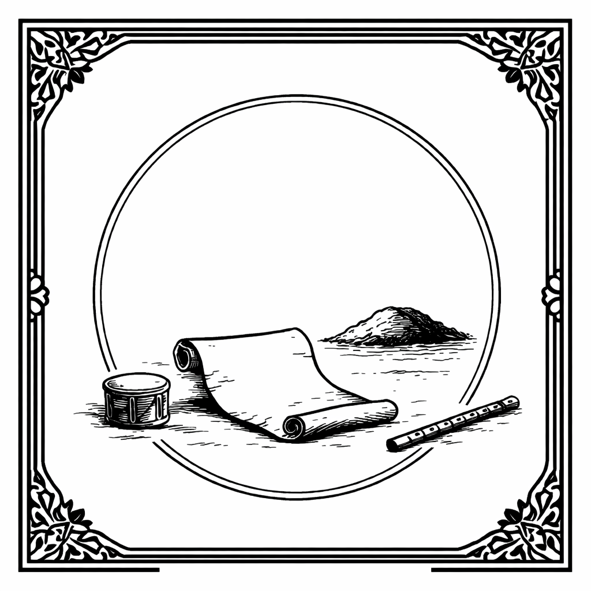{width=80%}


```{=latex}
\end{center}
\vspace*{\fill}
\newpage
```

# 10. Bölüm

Eşkıya Kara Durası bekle gör politikası izliyordu. Adamlarının hepsi büyük korku içerisindeydi. Kiminin asker kaçağı olmaktan, kiminin adam öldürmekten, kiminin zorla dağa kadın kaldırarak ırza geçmekten, kiminin gasptan suçları vardı. Halk deyimiyle hepsi ipten, kazıktan kaçma insanlardı. İçlerinde bulunan kötülük güçle birleşince hepsi acımasız eşkıyalar olup çıkmışlardı. Kara Durası'nın adamı olduğu bilinmek insanların yüreklerine korku, endişe saçmaya yetiyordu. Hepsi arananlar listesindeydiler. Biraz morallerini düzelten şey Yunan geri kaçarken Bilecik'i yakmış, adliyenin evrakları da yanmış diyorlardı. Adliye yandıysa, mahkeme evrakları da yanmıştır, o zaman bizim evraklar da yanmıştır. Evraklar yandığına göre suç muç ta kalmamıştır diye seviniyorlardı. Bir de onlar İmparatorluk zamanında işlemişlerdi suçlarını, Ankara hükümeti yeni bir devlet kuruyor olduğuna göre eskileri eskide bırakırdı herhalde. Bazen de endişeye düşüyorlardı. Söylentiye göre Bilecik adliyesi yanmadan önce evraklar trenle Geyve'ye nakledilmiş. Ya eski evrakları yeni hükümet yeniden karıştırırsa. Kara Durası'nın mahkemelik, evraklık asker kaçaklığından başka kayıtlı suçu yoktu. Jandarma kovalıyordu ama onu resmen şikayet eden Molla Mehmet'ten başka kimse olmamıştı. Onun da suçlaması çocuk kaçırma ve karşılığında fidye istemekten başka bir şey değildi. Kara Durası'nın çetesinin arasında kaydı kuydu hiç olmayanlar vardı. Nüfus kütüğüne kaydedilmemiş, kütükte kaydı da olmadığından askere çağrılmamışlardı. Devlet yetkilileri muhtarlara haber göndererek askerlik çağı geçip de askere çağrılmayanların listesini istemişler, bunun üzerine muhtarlar bu durumda olanların listesini devlet yetkililerine bildirmişlerdi. Devlet yetkilileri de bunların nüfus kütüğüne kayıt olmak için başvurmalarını, ardından da askere sevk edileceklerini bildirmişlerdi. Bunun üzerine bazıları nüfus dairelerine başvurarak, kayıt altına alınmış, ardından da cepheye sevk edilmişlerdi. Bazıları da nasıl olsa kaydım kuydu yok diye nüfusa başvurmamış, jandarmaya yakalanmaktan da korktuklarından dağa çıkarak çetelere karışmışlardı. Ankara Hükümeti emperyalistlerin uşağı Yunan kuvvetlerini İzmir'de denize dökmüş, İstanbul'daki padişah Sultan Mehmet Vahidettin bir İngiliz zırhlısına binerek kaçmış diyorlardı. Söylentiler padişahlık yerine yeni bir yönetim kurulacağıydı. Yeni devlet, yeni bir sayfa açarmıydı, dağda çete olanların suçlarını af edermiydi, kim bilir belki de af ederdi. Molla Mehmet o yıllarda fazla keçilerini de satamadığından sürüdeki hayvan sayısı da gün geçtikçe artıyordu. Kurban Bayramlarında köylüye kurban satıyor ama paralarını almıyordu. Gölpazarı Jandarması'na sattığı erkeçlerin parasını da almıyordu. Öyleyken davardan sağılan süt her geçen yıl artmaya başlamıştı. Savaş nedeniyle Bilecik tamamen boşalmış, bu nedenle Bilecik'teki satışları iyiden iyiye azalmıştı. Bursa pazarına da gitmek zorlaşmıştı ama düşman denize döküldüğüne göre geride kalan artıkları da temizlendikten sonra Bursa Pazarı'na gitmek daha kolay olurdu herhalde.

Molla Mehmet yine Bilecik ve Bursa’ya peynir satmaya gidiyordu. Molla Mehmet bacanak dediği Yamacı Hasan’ıda yanına alarak 4 atla Bilecik pazarına peynir satmaya gidecekti. O yıllarda da Bilecik’te Pazartesi günleri Pazar kuruluyordu. Hemde bir günde iki Pazar. Sabahtan Edebali Türbesinin olduğu vadide, öğleden sonra vilayet binasının önünde kuruluyordu Oyıllarda Türkler çoğunlukla Edebali Türbesi’nin olduğu vadide Ermeni ve Rum’lar yukarıda Valilik binası çevresinde ikamet ediyorlardı.. Dereli köyü ile birlikte olan muhtarlığın muhtarı o dönem Karamatlar’dan seçilmişti. Muhtar Ali Çavuştu. Ali Çavuş muhtar kendisi olmasına rağmen her gelen devlet görevlisinin Molla Mehmet’in misafiri olması, hatta nahiye mutasarrıfının bile yapacağı işler konusunda Molla Mehmet’in fikrini almasını bir türlü içine sindiremiyordu.

Molla Mehmet Pazar günü arkadaşı Yamacı Hasan ile birlikte yola çıkmaya hazırlanıyordu. Muhtar Ali Çavuş yanına gelerek,

— Mehmet ağa Bilecik'e gidecek resmi bir evrak var. Bu evrağın aciliyeti var. Bir ara bu evrağı askerlik Şubesine veriver.

Molla Mehmet evrağı alarak ceketinin cebine soktu. Savaş bittiğine göre teskere alacak askerlerin işleriyle ilgili bir evrak diye düşündü. Sabahtan aşağı Bilecik’te , öğleden sonra yukarı Bilecik’te peynirlerini sattılar. Bilecik’te nüfus azaldığından peynirlerin neredeyse üçte biri kalmıştı. Daha önceki gelişlerinde peynirlerinin tamamını kolayca satardı.

Atlarını valilik yanındaki Askerlik Şubesi önüne çektiler.

Molla Mehmet kalan peynirleri Askerlik Şubesinin aşçısına askerler yesin diye teslim etti. Daha sonra Yamacı Hasan’ı atların yanında bırakarak Askerlik Şubesi komutanı albayın yanına çıkarak muhtarın verdiği evrağı teslim etti

Albay, Molla Mehmet'e,

— Ağa Pazar nasıldı, getirdiklerini satabildin mi? Sizin Gölpazarı düşman işgali görmedi, siz buralara göre daha rahattınız. Ben de epey Gölpazarı'nda kaldım. Göynük, Mudurnu, Taraklı tarafından toplanan askerleri o hat üzerinden cepheye sevk ettik.

— Pazarın pek tadı yok komutanım. Pazarda insan yok neredeyse. Her iki pazarda da tezgah açtık ama getirdiğimiz peynirlerin neredeyse üçte biri elimizde kaldı. Ben de buraya gelmişken askerler yesin diye aşçıya teslim ettim. Şubeye uğramasaydık dönüşte kasabada jandarmaya bırakacaktım.

— Sağ ol ağa, keçi peyniri lezzetli de olur.

— Komutanım müsaden olursa ben kalkayım. Atlarımız dışarıda, yolumuz uzun.

— Selametle git ağa, yolun açık olsun.

Aşağı inmiş, atlara binmek üzereyken iki asker geldi. Gölpazarı, Dereli köyü, Karaahmetler Mahallesi’nden Mustafa oğlu Mehmet senmisin dediler. Molla Mehmet benim deyince , komutan seni istiyor diyerek, alıp, götürdüler.

Molla Mehmet yeniden Şube başkanı albayın karşısına çıkartıldı.

— Mehmet ağa sen asker kaçağı mısın?

— Hayır komutanım ben askere gitmedim ama ben askerliği bedelli yaptım.

— Tamam da Mehmet ağa elimdeki muhtarınızın mühürlediği resmi evrak. Bak bu evrakta ne diyor. Bu evrağı getiren Mustafa oğlu Mehmet asker kaçağıdır, bu evrağı teslim ettiğinde derhal tevkif edilmesi diyor.

Molla Mehmet şaşırmış, ne diyeceğini bilemiyordu.

— Benim okumam yok komutanım ama muhtar niye öyle yazdı bilemiyorum. İsterseniz Gölpazarı mutasarrıfına sorun, benim durumumu o da biliyor komutanım.

— Hem ben bedelli yaptım diyorsun da, Kurtuluş Savaşı başlayınca tekalifi milliye kararlarıyla birlikte askerliğini bedelli yapanlar da silah altına çağrıldı, senin haberin yok mu ağa?

— Var elbet komutanım var tabi. Beni de çağırdılar tabi ama sağlık muayenesinden geçemedim. Dişlerimde eksik çok fazla diye beni askere almadılar. Kardeşim Yakup'ta bedelli yapmıştı ama tekalifi milliye kararlarından sonra onu itiyat askeri olarak bir süre silah altına aldılar, sonra da terhis ettiler.

— Doğru söylediğini söylüyorsun ama öyleyse muhtar niye böyle bir yazı yazdı. Diğer taraftan da asker kaçağı olsan kendi ayaklarınla askerlik şubesine neden gelesin.

— Dışarıda beraber geldiğim arkadaşım var, durumu o da biliyor komutan. İşte bakın ağzımda neredeyse diş yok. Hem sizin evraklarınızda belli değil midir komutanım?

— Belli olmasına bellidir de ağa; Yunan buraları yakınca evrakları kurtarmak için Geyve'ye gönderdik. Evrakların oradan bulunması lazım.

— İyi ya komutan ben buradan köyüme dönünce hemen Geyve'ye gider, evrağımı araştırırım.

— Olmaz ağa bu resmi evraktan sonra seni bırakamam. Ben senin doğru söylediğine inansam da evraklar gelene kadar seni göz altına almak zorundayım. Hem sizin oralarda asker kaçağı Kara Durası diye bir eşkıya var, teslim olmuyormuş. Nerelerde olabileceğine dair bir bilgin var mı?

— İyi bilirim komutan, her yerde olabilir, bir yerde durmaz ki. En çok canını yaktığı insanlardan biri de benim. 3 defa oğlumu kaçırdı, defalarca zorla haraç, fidye aldı benden. Duymuşsunuzdur, en son Taraklı, Kilem hamamı yakınındaki değirmenin sahibini öldürdüğünde kendisi de ağır yaralanmış. Sonra yaralı yaralı bizim sayaya gelmiş. Benim damadımı ve çobanlarımı tehdit etmişler, yaralı halde bir hafta bizim sayada kalmış, bizim bile haberimiz olmadı. Beni hiç sevmez. Taraklı, Dumanköy'de jandarmayla efelerin birlikte sıkıştırdıkları zaman jandarmaları ben evimde ağırladım diye bana diş biler durur. Beni defalarca ölümle tehdit etti. Bu güne kadar ne sattıysam yarısına el koydu. Komutanım onun da sonu yakın bence. Yedi düvele kök söktüren Ankara Hükümeti, baş komutan Mustafa Kemal onun gibi çetelerin mi hakkından gelemeyecek?

— Ağa hep devletinin yanında durmuşsun, anlattıklarından bu anlaşılıyor ama bu evraktan sonra evraklar ortaya çıkana kadar seni bırakamam. Seni göz altına alıyorum.

— Komutanım en azından on dakika müsaade edin. Dışarıda atlarla birlikte bekleyen arkadaşıma durumu anlatayım.

Komutanın izni üzerine Molla Mehmet dışarı çıkarak durumu arkadaşına anlattı. Duyduklarına Yamacı Hasan da inanamadı. Bir yolda ben anlatayım dese de, Molla Mehmet ben söylenecek her şeyi söyledim arkadaşım, söylenecek başka bir şey kalmadı. Sen hemen köye dön, evraklar Geyve'deymiş. Kardeşim Yakup ile birlikte gidin o evrakları buldurun, yoksa benim işim zor. Dedi.

Yamacı Hasan ağız dolusu bir küfür savurdu,

— Deyyus sonunda bunu da yaptı. Bu deyyusun aklına gelen şeytanın aklına gelmez. Bacanak bu muhtar bozmasının seni sevmediğini hep bilirdik te, bu kadar ileri gideceğini hiç düşünemedik. Bacanak gideyim köyün ortasında alnının ortasından vurayım şu deyyusu.

— Sakin ol bacanak, şimdi yapacak daha önemli işlerimiz var. Sonrasını ben köye gelince düşünürüz.

Hasan atın birine bindi, diğer atları peş peşe bindiği atın arkasına bağlayarak yola çıktı. Durmadan at sürdü, ertesi sabah köye vardı. Molla Mehmet'in karısı Fatma ana Yamacı Hasan'ı tek başına dört atla birlikte döndüğünü görünce,

— Hasan bu ne hal, söyle hele, neden yalnız döndün, Mehmet ağa nerede?

O sırada yanlarına Yakup ağa’da geldi. Yamacı Hasan yaşanılanları bir bir anlattı. Yakup ağa hiddetlendi, silahını kaptığı gibi muhtar Ali Çavuş’un evine doğru seyirtti. Yarı yolda yetişerek zor durdurdu Yamacı hasan.

— Bilirsin Yakup kardeşim, Muhtar Ali Çavuş ezelden beri kıskanır Mehmet ağayı. Eline fırsat geçince yaptı, yapacağını. Hem gideceksin de ne olacak. Zaten ortalık karışık, ne evrak var, ne bir şey. Bu defa seni de şikayet edecek, ağabeyini kurtaracak evrakları kim bulacak. Hem bacanak dedi ki, sakin olun şimdi önce çok önemli işlerimiz var. Önce onları halledin, gerisini ben köye gelince düşünürüz.

O sıralarda Molla Mehmet jandarmadaki nezarethanede tutuluyordu. İyi davranmasına iyi davranıyorlardı ama zaman geçmek bilmiyordu.

Bilecik Cezaevi Yunan yangınında yanarak kül olmuştu. Molla Mehmet o gece nezarette tutuldu. Ertesi sabah trenle Adapazarı cezaevine sevk edildi. Molla Mehmet şaşkındı. Ülke özgürlüğüne kavuşmuş ama o bir iftira sonucu özgürlüğünü kaybetmişti. Hem de onur kırıcı bir suç yüzünden. Böyle bir dönemde asker kaçağı demek, vatan haini demekti onun gözünde.

Yakup ağa ve Yamacı Hasan önce Gölpazarı Nahiye Mutasarrıflığına gittiler. Mutasarrıf beyde bu duruma çok şaşırdı. Nahiye’de temin edilebilen evrakları hazırlatarak teslim etti onlara. Ardından durumu anlatır Geyve hükümet yetkililerine bir telgraf çekti. Karaahmetler’e bir jandarma göndererek muhtar Ali Çavuş’u çağırttı.

Gelen muhtarı mutasarrıf bey hemen odasına aldı.

— Muhtar sen de benim kadar iyi biliyorsun ki, Mehmet ağa asker kaçağı değil. Neden böyle bir ihbarda bulundun Bilecik Askerlik Şubesine?

— Siz muhtarlara yazdınız mutasarrıf bey, asker kaçaklarının listesini bildirin diye.

— Ne güzel söylüyorsun asker kaçaklarının listesi diye. Hem Mehmet ağa asker kaçağı değil, hem de sizin köyde daha asker kaçakları var, onların da listesini getirdin mi?

— Getirdim, yanımda getirdim, işte liste.

— Behey adam hem cevabın bize verileceğini biliyorsun da, neden Mehmet ağa'yı hem de kendi eline verdiğin evrakla Bilecik Askerlik Şubesine şikayet ettin?

— Mutasarrıf bey o hiç askere gitmediği için acil olacağını düşündüğümden yazdım.

— A muhtar sanki bunda başka bir şey var gibi. Kardeşi Yakup ağa da aynı durumda, hem sen de yapmadın askerlik.

— Muhtarlarla, hocalar askere alınmıyor ya mutasarrıf bey. Yakup ağa da hiç aklıma gelmedi.

— O zaman gelmedi de, bu listede de yok Yakup ağa'nın ismi.

— Muhtar bu ülke, bu millet ne zor günlerden geçti, ne badireler atlattı, yaralarını sarmaya, küllerinden yeniden doğmaya çalışıyor. Ben bu tür olayları anlayamıyorum, anlamsız olduğunu da düşünüyorum.

— Mutasarrıf bey eğer benim muhtarlığımdan memnun değilseniz istifa edeyim. Zaten Mehmet ağa suçsuzsa çabucak salıverilir.

— Muhtar salıverilir zaten de, salıverilene kadar cezaevinde yatacak, yazık değil mi?

— Bir hatadır olmuş mutasarrıf bey, isterseniz yeni bir yazı götüreyim şubeye.

— Gerek yok, işler daha da fazla karışır. Ben durumu anlatır bir telgraf çektim zaten şubeye. Geyve'den gelecek evrakları bekliyorlarmış.

Geyve'de evrakları depodan bulup, Bilecik'e ulaştırana, Bilecik'in yazısının yeniden Adapazarı Cezaevi Müdürlüğüne ulaştırılana kadar aradan bir ay zaman geçti. Mehmet ağa suçsuz yere pisi pisine bir ay Adapazarı'nda hapis yatmış oldu. İlk günler kızdı, kendi kendine bilendi. Bir gideyim köye ben o muhtar Ali Kahya deyyusuna gösteririm el mi yaman bey mi yaman. Adamın bu kadar kötülüğe nasıl kafası çalışıyor, pes vallaha dedi. Durumunu öğrenen hapishane görevlileri de ona çok iyi davrandılar. Zaman geçtikçe siniri geçti. Bu zor zamanlarda sorun çıkarmanın zamanı değil, Allah nasıl bilirse öyle yapsın o deyyusa dedi.

Molla Mehmet köye dönünce sanki hiçbir şey olmamış gibi davrandı. Sanki onu şikayet eden Muhtar Ali Çavuş değilmiş gibi, sanki Adapazarı Cezaevi'nde bir ay hapis yatan o değilmiş gibi. Tüm ev halkına da öyle davranmalarını tembihledi. Can arkadaşı, bacanağı Yamacı Hasan; Ya arkadaş, senin bu sabrına şaşıyorum dediğinde Molla Mehmet; Yaptığından o da utanıyor şimdi, o utanma ona yeter de artar bile dedi.

Molla Mehmet arkadaşı Yamacı Hasan’a,

— Hapse girdik girmesine de bacanak. Zamanı da hani öyle fazla değil, bir ay yattık, yanlışlık ortaya çıktı salıverildik. İşte hapistekilere meram anlatmak zordu. Her gören soruyor dayı, amca senin suçun ne? Diyorsun bir yanlışlık oldu. İnanan yok, adam diyor senin evrağında da askerlik kanununa muhalefet diyor, besbelli sen de bizim gibi asker kaçağısın diyor. Hapishane şimdiden dolmuş, yatacak yer yok. İçerde yatanların çoğu asker kaçağı. Asker kaçaklarının hepsi toplanmaya başlayınca mümkünü yok hapishaneler falan almaz. Bir af kanunu çıkar ama ne zaman?

Çabuk çıksa bari. En büyük korkum da ben hapisteyken Kara Durası gelir gene haraç isterse, istenilen parayı Yakup bulamaz, bulamayınca bu it yine oğlum Hüseyin'i kaçırır diye çok korktum. Şansım varmış daha önce Gölpazarı jandarmasında görev yapmış, görev yaparken de takibe çıktıklarında evimde misafirim olmuş Mustafa adında bir uzman çavuş hapishanede görevliydi. Allah razı olsun onun çok yardımı oldu. O görevlilere de, mahkumlara da ben Mehmet Ağa'yı çok iyi tanırım, evinde de çok misafir oldum. Bu işte bir yanlışlık var, o asker kaçağı değil, yakında ortaya çıkar dedi de; hem görevlilerin, hem de mahkumların bakışları bana karşı değişti. Özellikle görevliler asker kaçaklarına vatan haini gibi bakıyorlar haklı olarak. Senden de, kardeşim Yakup'tan da Allah razı olsun. Gecenizi, gündüzünüze kattınız, koşturdunuz, beni temize çıkaracak evrakları buldunuz.

— Lafı mı olur be bacanak, sen olsaydın çok daha fazlasını yapardın. Sağ olsun mutasarrıf beyin çok yardımı oldu. O olmasaydı bu evraklara ulaşmak bir ayı bulurdu. Çok teşekkür etmek istiyorsan sür cezveyi mangala, köpüklü birer kahve yap, karşılıklı içelim.

— Kahvenin lafı mı olur be bacanak, içeceğin kahve olsun, cezveyi hemen sürüyorum mangala.

— Yakup, gel kardeşim, bak biz evrakları çabucak toparlamışız diye ağabeyin bize kahve yapacakmış. Hep sen ağabeyine yapacak değilsin ya, bu defa da o sana yapıversin.

— İyi olur ya Hasan ağabey, geliyorum, Molla Mehmet Ağa'nın ellerinden içelim bakalım köpüklü kahvemizi.

Molla Mehmet önce kavrulmuş kahve çekirdeklerini pirinçten yapılma kahve değirmeninin içine doldurdu, sonra kolunu çevire çevire kahveleri öğüttü. Kahve değirmeninin kapağını açınca evin içerisini mis gibi kahve kokusu kapladı. Sonra kalaylı bakır cezveye kahve ve su koyarak mangalda yanan közlerin üzerine yerleştirdi. Karıştıra karıştıra pişirdi orta şekerli Türk kahvesini. Kahveleri fincanlara doldurup bacanağı Hasan ve kardeşi Yakup'a uzattı.

Üçü birlikte köpüklü kahvelerini içtiler. Üçü birden aynı zamanda sarma sigaralarının dumanlarını savurdular. Yamacı Hasan derin bir nefes çekti, eski köyleri Haydan geldi aklına. Yamacı Hasan'ın ailesi Haydan köyünde barınabilmek için sonuna kadar direnmişlerdi. Zamanında zengin bir köy olan Haydan 1470'li yıllarda Denizli ilinin Çivril İlçesinin Haydan köyünden gelen Haydan Türklerinin kurduğu bir köydü. Köy savaşa giden gençlerin çoğunun şehit düşerek dönmemesi sonucu nüfus her geçen yıl azalmış; köyde oturan aileler birer ikişer Gölpazarı, Dereli, Çiftlik, Kuzlar köylerine göç etmişlerdi. Sonunda köyde iki hane kalmıştı; biri Velioğulları, diğeri de Yamacıoğulları. Velioğulları da tarlalarının olduğu taraf olan Softalar Köyü'ne göçmeye karar verince onlar da arazilerinin bulunduğu taraftaki köy olan Karaahmetler'e göçmeye karar vermişlerdi. Köye geldikten sonra ağabeyi Mehmet Yukarıboğaz Köyü'ne iç güveyi olarak gitmişti. Molla Mehmet'in karısı Fatma ana bu yeni gelen delikanlıyı pek sevmişti. Hasan terbiyeli, saygılı, becerikli bir delikanlıydı. Fatma ana Hasan'ı kız kardeşi Zeyniler'in küçük kızı Ayşe ile evlendirdi. Hasan-Ayşe çiftinin çocukları olmadı. Ayşe gelin yakalandığı amansız bir hastalık sonucu ölünce bu defa Fatma ana kız kardeşinin acısı dinince yine Hasan'ı kendi elleriyle Kavak köyünden bir tanıdıklarının kızı Arife'yle evlendirdi. Molla Mehmet, Hasan'a hep bacanak dedi, onu hep çok sevdi, ona çok güvendi.

Kara Durası da o sıralarda boş durmuyor; hem namını yürütmeye çalışıyor hem de gelecek günlerde yapacaklarını düşünüyordu.

O günlerde Kara Durası iyice iyileşmişti. Gölpazarı sınırlarından uzak durur olmuştu.  Göynük ve Sarıcakaya köylerinden daha fazla haraç alır olmuştu.

Sürekli yer değiştiriyor, bir yerde iki günden fazla kalmıyorlardı. Artık millette haraç vermemek için direnir olmuştu. Dağda yeri geldiğinde 20 kişiyi bulan çeteyi beslemek, giydirmek, atların yemi kolay olmuyordu. Şu günlerde adam öldürmekten biraz geri duruyorlardı ama acımasızca adam dövmekten, kırbaçlamaktan geri durmuyorlardı. Narzanlar köyünden birinden haraç istenmişti, adam haracı zamanında ödemedi. Tam Kara Durası çetesi köye haracı zorla almak üzere gelirkenbunu haber alan adam atına binerek hızla Göynük’e doğru sürdü. Kara Durası’nın muhbiri hemen bu haberi çete köye girer girmez ulaştırdı. Kara Durası 3 adamını işaret ederek,

— Haydi yel olun, uçun. Bu pezevenki Göynük'e varmadan alın, gelin.

Üç adam atlarını dörtnala Göynük yoluna sürdüler. Dahaa adam yolu yarılamadan adama yetiştiler. Adamı yakalayıp, ellerini atının eğerine bağladılar. Atın dizginlerini çıkararak başına bir yular taktılar. Yularından atı kendi atlarının birinin arkasına bağlayarak köye döndüler.

Kara Durası adamı görünce gülledi.

— Bağlayın şu deyyusu ağaca, sıkı bağlayın.

Çeteler adamı köy meydanındaki kocaman üvez ağacına urganla sıkıca bağladılar. Kara Durası tabancasını çıkardı, başladı ateş etmeye. Kurşunlar adamın saçlarını sıyırarak geçiyor, kollarının, bacaklarının yanından geçiyordu. Amacı öldürmek olsa çoktan alnının ortasına ateş ederdi, amacı korkutmaktı. Sonunda kırbacını alarak adama vurmaya başladı, adamın boynundan kanlar sızıyor, adam acıyla bağırıyordu.

Sonunda çözün şu pezevengi diye bağırdı. Adamı ağaca bağlayan urganları çözdüler adamları. Urganları çözülen adam yere kapaklandı, sonra doğruldu. Kara Durası gürledi,

— Ulan haracı iki katına çıkardım. Sana on dakika mühlet. Haracı getirdin getirdin, getirmezsen anam avradım olsun evini tüm içindekilerle beraber yakarım, sülaleni kuruturum.

Giden adam 5 dakika sonra topallaya topallaya iki kat haracı getirip, Kara Durası'nın ellerine teslim etti. Artık Kara Durası haraç istediğinde direnmeyi düşünen köylülerin gözü yaşanan son olaydan sonra iyiden iyiye korkmuştu. Kendi kendilerine Karamatlarlı efeler ölünce bu işi iyice azıttı zaten. Düşman yurttan kovuldu, bu da korkar, sıvışır mı dedik ama daha da azıttı zalim. Halkın kafası da karışmıştı. Hem hükümet kuvvetleri dağdaki eşkıyaya aman vermeyecek diyorlardı, hem de bu Kara Durası eşkıyası köy meydanında adam kırbaçlıyor, neredeyse devlete kafa tutuyordu. Kara Durası ne yapacağına karar veremediğinden her akşam iyice zom olana kadar içer oldu. İçiyordu ama içerken en güvendiği adamlarından birine ağzına bir damla içki koymadan etrafında olmasını, onu kollamasını istiyordu.

Kara Durası bunları yaparken bir taraftanda gelecekte neler yapması gerektiğini düşünür olmuştu. Çetesinde Kürt Memo’nun ölümünden sonra en fazla güvendiği adamlardan biride Ahmet’ti. Ahmet İstanbul’luydu. İkinci İnönü Savaşları sırasında bir arkadaşıyla tartışmış, çok sinirlenmiş, sinirlerine hakim olamayarak arkadaşını vurmuştu. O güne kadar Filistin Cephesinde, Çanakkale Anafartalar’da Mustafa Kemal’in komutasında çarpışan Ahmet arkadaşını cephede öldürünce yargılanmak üzere tutuklanmıştı. Ahmet iyi bilirdi, cephede arkadaşını vuran büyük ceza alırdı. O da kaçarak SakaryaNehrini Gümele( Mihalgazi ) yakınlarında geçmiş, daha sonra Nardın yakınlarında Kara Durası ile karşılaşarak onun çetesine girmişti.

Ahmet Rüştiye mezunu görmüş , geçirmiş bir İstanbul çocuğuydu Kürt Memo’dan sonra en yakın adamı olan Ahmet,Kürt Memo kadar gözü kara ve hiç sorgulamadan emirlerine harfiyen uyacak biri olmasa da, daha akıllı,konuşmasını bilen ,devlet adamlarından kolayca haber alabilen biriydi. O günlerde Kara Durası’na da öyle bir adam lazımdı.. Kara Durası ,Şaziye’sini görmeye gittiğinde yanında götürdüğü 2-3 adamından biri mutlaka Ahmet oluyordu. Ahmet, Kara Durası’nın ininde yatma şerefine ulaşmış nadir çete üyelerinden biriydi Ahmet’i iyice kendine bağlamak için bazen kendi payına düşen haraçtan fazladan bir sarı lira veriyordu. .

Bölgenin dışına hiç çıkmayan Kara Durası İstanbul, Bursa gibi şehirlerle ilgili bilgiler alıyordu. Ahmet ona ,

— Bu hep böyle gitmeyecek ağam. Ortalık durulunca jandarma eşkıya avına çıkacak. Önünde sonunda bizi de kıstıracaklar bir gün. İstanbul kocaman bir şehir. O gün geldiğinde sen yengemi de alırsın, birlikte İstanbul'a gider, izimizi kaybettiririz. Sen de bu cesaret ve para, ben de bu akıl varken evelallah İstanbul'da izimizi kaybettiririz, bir iş sahibi olur, geçinir, gideriz. Ben İstanbul'a da, Bursa'ya da giden tren yollarını, araba yollarını hatta keçi patikalarını bile ezbere bilirim.

— Bakalım be Ahmet zamanı gelince düşünürüz. Af çıkacak dedikoduları var, bakarsın genel bir af çıkar.

— Çıkmasa da bir çaresine bakarız be ağam.

Ahmet cebinden 4 farklı kimlik çıkardı.

— Bunlar cephede yanı başımda ölen arkadaşların kimlikleri. Komutana teslim etmeye fırsat olmadıydı. İşte bu kimliklerden birine bürünürüz, sahte kimlikle sanki onlar şehit düşmemiş, biz onlarmışız gibi, onların kimlikleriyle yaşar gideriz, ne dersin be ağam?

— Bakalım Ahmet zamanı gelince bunları da düşünürüz artık.

Kara Durası artık Ahmet'i hiç yanından ayırmaz olmuştu. Ne zaman bir yere otursalar onunla sohbet ediyordu. Ondan daha eski çete üyeleri onu kıskanıyor, bazıları da ona diş bileyor olmuşlardı. Ahmet bir yolunu bulup başka bir kimliğe kolayca bürünebilirdi de, Kara Durası'nda çok para olduğunu biliyordu. Beraber izlerini kaybettirirlerse Kara Durası'nın altınlarıyla ya bir iş kurarlar, ya da iş kurmasalar bile bozdur bozdur rahat yaşar giderlerdi. Ahmet çeteciliği bıraktıktan sonra Kara Durası'nın kendine muhtaç olduğunu bildiğinden rahat davranıyordu. Ahmet, Kara Durası ile ya da yalnız nasıl kaçacak alternatif planlarını yapıyordu. Fazladan aldığı altınları ceketinin iç cebinde saklıyor, her an izini kaybettirecekmiş gibi hazırlıklı oluyordu.

Aynı zamanlarda Şaziye de ne yapacağını bilemez durumdaydı.

Şaziye de tedirginlik ve karışık duygular yaşıyordu. Bir taraftan ülkenin kurtuluşuna çok seviniyor, şehit babamın kanı yerde kalmadı, boşuna şehit düşmüş olmadı diye seviniyor, öteki taraftan Kara Durası'na ne olacağı aklına geldikçe uykuları kaçıyordu. Son zamanlarda Kara Durası'nın hiç yanından ayırmadığı sanki Kürt Memo ağabeyinin yerine koyduğu Ahmet'i pek sevmiyordu. Sanki Durası'na her an bir kötülük yapacakmış gibi düşünüyordu. Birkaç defa Kara Durası'na çıtlatmak istemiş, sonradan vazgeçmişti. Kara Durası'nın yanında normal denilecek bir adam yoktu ki zaten. Hepsi de korkmasalar bir tek altın için bile Kara Durası'nı veya bir başkasını öldürmekten geri durmazlardı. Ahmet sanki zaruretten Kara Durası'nın yanında durur gibi, bir fırsatını bulduğunda kendi yoluna gidecek biri gibiydi.

Şaziye son zamanlarda insan içine pek çıkmaz olmuştu. Evinden pek dışarı çıkmıyor, çıktığında da atını eğerleyerek, atına atlıyor, saatlerce kırlarda dolaşıyordu. Bu günlerde onu mutlu eden tek şey dağlarda açan çiçeklerin güzelliği, ağaçların dallarındaki kuşların ötüşleriydi. Bazen papatya falı bakıyordu. Bir papatya çiçeği koparıyor, çiçeğin yapraklarını seviyor, sevmiyor diye bitene kadar kopartıyor, seviyor çıkınca seviniyordu.

Atını kırlarda dolaştırırken atının başını Çalca Deresi'ne çevirdi. At yel olup uçmuştu, at durunca mağaraya geldiğini fark etti. Atı bu defa tünel tarafına Kara Durası'nın hazırladığı gizli at barınağının olduğu yere atını bağladı. Burası eğer atın sesi duyulmazsa yanına gelmeden atı görmek mümkün değildi. Atının yanından ayrıldıktan sonra tünelden geçerek mağaraya girdi. Mağaradan dereye inerek su içti, elini yüzünü yıkadı. Tencereye dereden su doldurarak mağaraya çıktı. Yaktığı ateşe su dolu tencereyi koydu. İçerisine bir tutam ıhlamur çiçeği attı. Kaynayan ıhlamurun kokusunu içine çekti. Yanında getirdiği iki domates ve biberleri bir tencereye doğrayarak bulduğu şişeden biraz şırlan yağı akıttı. Domates ve biberleri kavurduktan sonra üzerine bir yumurta kırdı. Pişen melemenini banarken, bir taraftan da toprak kupaya koyduğu ıhlamurunu içiyordu. Sonra tabancası elinde öylece uzandı yorganın üzerine. Uyandığında gerindi, rahatlamış, kendini mutlu hissediyordu. Kara Durası artık burası tehlikeli olmaya başladı, buraya gelme diye sıkı sıkı tembihlese de, o yine buraya gelmekten kendini alamıyordu. Kara Durası buraya gelirse geldiğini anlasın diye oyalı yazmasını Kara Durası'nın yorganının içine koydu. Sonra dereye bir daha baktıktan sonra tünelden geçerek atının olduğu yöne yürüdü. Bir çalının dibinde bir tavşan yavrusu gördü. Sessizce yaklaştı. Ellerini usulca uzattı, tam tavşan yavrusunu yakalayacağı sırada, tavşan yavrusu fark etti ve hoplayarak çalılıkta kayboldu. Şaziye atına atlayarak Dereli Köyü'nün yolunu tuttu. Evinin önünde atından inerken hoca minareye çıkmış akşam ezanını okuyordu.

Atının eğerinin kolonlarını çözdü, atın eğerini indirerek iç avludaki yerine astı. Atın başından çıkardığı dizginini de duvara astı. Yerde duran süslü semere baktı bir süre. Kara Durası ata eğerle binemezse, semerle binsin diye bir de süslü semer yaptırmıştı semerciye. Şaziye ilk binişinde biraz tereddüt etse de hemen eğerli ata binmeyi öğrenmişti. Bunda atın çok uysal olması da işi kolaylaştırmıştı. Eline aldığı kaşağıyla yeniden dama girdi. Atının yelelerini sevdi. Kaşağıyla sırtını, karnını hafif hafif kaşağıladı. At hoşuna gittiğini gösterir sesler çıkararak kafasını Şaziye'nin koltuğuna soktu. Şaziye atını eğilerek öptü. Atın önüne biraz kuru ot, biraz da arpa koyarak atın yiyişini izlemeye başladı. Halbuki Çalca Deresi'nde otlamış, karnını doyurmuştu. Çok iştahlı sağlıklı bir hayvandı. O anda atına Fırtına ismini verdiği geldi aklına. Birden bu adın hoşuna gitmediğini düşündü. Yeniden eski atının adı Akyel adını koymaya karar verdi birden. Akyel diye seslenince at sanki eskiden beri adı Akyel'miş gibi kişnedi, kafasını salladı. Şaziye atının boynuna sarılarak akıllı güzel kızım benim dedi. Damın kapısının önünde toraman kuyruğunu sallayarak onu bekliyordu. Koştu hemen toramana sarıldı. Köpek hep atla ilgileniyor diye sanki onu kıskanır gibiydi. Şaziye atıyla kırlara giderken toramanın peşlerinden gelmesine izin vermiyordu. Hem havlayarak yerlerini belli ediyor, hem de başka köpeklerle karşılaşır, dalaşırlar diye endişe ediyordu. Bu defa toramanla dakikalarca oynadı, sonunda toramanı çeşmenin oluğuna götürerek bir güzel yıkadı. Yıkanan toraman üzerindeki suları üzerinden atmak için hızla silkelenince Şaziye ıslandı. Şaziye önde, toraman arkada eve doğru koştular. Şaziye eve girince toraman bir defa daha silkelendikten sonra gidip cevizin dibine yattı.

Şaziye daha sonra eve çıkarak üstündekileri çıkardı. Üzerine Kara Durası'nın hediye ettiği kırmızı saten geceliği giyerek, yatağa upuzun uzandı. Saten geceliğin içerisinde kendini çıplak gibi hissetse de, ipeğin yumuşacık cildine dokunması hoşuna gitti. Ellerini yastığın üzerinde, kafasının altında birleştirerek derin derin düşünmeye başladı. Kara Durası'nı düşündü, kendini düşündü, ikisini düşündü, aslında ikisi diye bir şey olacak mıydı. Keşke olsaydı ama çok zordu. Kara Durası bölgenin acımasız eşkıyasıydı. Gözleri doldu, dudaklarını büzdü. Az da olsa şarap içmişti ama hiç rakı içmemişti. Ama efkarlanınca canı içki çekti. Kara Durası ve rahmetli Mehmet ağabeyi bu mereti içtikleri zaman efkarlı da olsalar neşelenmiyorlar mıydı. Evde rakı da vardı, şarap ta. Kara Durası ona da ikram etmiş zamanında ama Şaziye çok az içmişti. Onların erkekleri içer ama kadınları zinhar içmez, ayıplanılırdı. Kim ayıplayacaktı, ayıplasa ne olacaktı, zaten hoca yatsı ezanını da okumamış mıydı. Bu saatten sonra kapısını kim çalacaktı. Biliyordu kapısını çalanlar da onu çok sevdiklerinden değil, Kara Durası'ndan korkularından, ona yaranmak için halini hatrını soruyorlardı.

Şaziye kırmızı saten geceliğinin içinde bir kuğu gibi doğruldu, içkilerin konduğu dolabı açtı. Eli önce Durası'nın içtiği rakıya gitti, o anda Kara Durası'nın dedikleri aklına geldi. Ben yokken canın çekerse rakı içme, rakı serttir. Şaraplardan iç. Kırmızı olan biraz buruk olur, sen beyaz olanından iç.

Şaziye toprak kupaya yarısına kadar beyaz şarap doldurdu. Büyükçe bir yudum aldı. İlk yudumu yutamadı, şarap ağzından geri şelale gibi fışkırdı, öksürmeye başladı. Boğulur gibi olan öksürüğü durunca bu sefer ufak bir yudum aldı, zorlansa da yuttu şarabını. Bir yudum, bir yudum daha derken kupadaki şarabı bitirdi. Canı bu defa kırmızısını denemek istedi. Bu defa kupayı ağzına kadar kırmızı şarapla doldurdu. Evet Durası'nın dediği gibi tadı biraz buruktu. Aklına gelenle biraz yüzü düştü. Kadınlar aralarında konuşurlarken duymuştu. Kara Durası kapatması kadınların göbeklerine şarap döküyor. Göbek deliklerinden şarap içiyormuş diye. Efkarla dikti kupayı kafasına. Bu defa öksürmedi, pufkurmadı. Kendi kendine bir türkü tutturdu, başladı söylemeye. Kendi kendine sesim fena da değil hani dedi.

Oğlan adın İsmail, İsminwe oldum nail, Oğlan ben sana varacağım, İster al, ister ail diye başladı, türkünün sözlerini değiştirerek söylemeye devam etti.

Oğlan adın Durası, Kaşların kömür karası, oğlan ben senin koynuna girdim, akşamla yatsı arası.

Oğlan adın Durası, Kalın kolların belimi sarası, seviyorum seni çaresi yok, hep yüreğimde kalası.

Oğlan adın Durası, çalca deresi şurası,  geçenlerde görürmüyüm diye geldim yine, nerelerdeydin kör olmayası.

Bunları neredende buluverdim çabucak diye kendi kendine şaşırdı ve ardından bir kahkaha attı. Kendi kendine bu mey şişede durduğu gibi durmaz, suskun dilsizleri dilbaz yapar diye, benide türkücü yapıverdi.

Sonra öylece uzandı yatağın üzerine. Birkaç dakika sonra uyudu kaldı. Sabahleyin uyandığında neredeyse kuşluk vakti olmuştu, pencereden içeriye tamda üzerine sıcacık bir güneş ışığı sızıyordu. Kendine bakınca birden telaşlandı. Kırmızı saten geceliği beline kadar yukarı sıyrılmıştı, belden aşağısı neredeyse çıplaktı. Kendi kendine beni bir görse nederdi. İyiki sabah sabah kapıyı çalan biri olmadı. Telaşla kapıya koşsam, biri beni böyle görseydi, tövbe tövbe dedi. Hemen öbür odaya giderek geceliğini omuzlarından aşağı kaydırdı. Hışırtıyla omuzlarından aşağı kayan gecelik ayaklarının dibine yığıldı, kaldı. Hemen pamuklu bir şalvar ve işlik geçirdi üzerine, başınada beyaz bir örtme örttü. Geceliğini güzelce katlayarak dolaba koydu. Bir çotura,birde ibrik alarak köy çeşmesine su doldurmaya gitti. Su doldurmaya gelen ondan bir iki yaş küçük bir kız kıkırdayarak,

— Kız Şaziye abla şalvarında, işliğinde pek güzelmiş, sana da pek yakışmış. Yüzünde güller açıyor. Durası ağam mı geldi bu gece yoksa?

— Nereden çıkarıyorsun kız sen bunları, senin ağzın neler söyler. Her zaman giydiğim şeyler, e artık savaş bitti, ülke kurtuldu, şimdi artık gülme zamanı.

— He ya Şaziye abla, ne de güzel söylersin, yetti artık bu karaları bağlamak.

— Kız senin hiç yavuklun yok mu?

— Şey kız Şaziye abla, hani şu Osman var ya geçen gün su doldururken yanıma geldi; ben sana yangınım, rüyalarıma giriyorsun, yavuklum olur musun dedi ama ben utandım hemen eve koştum.

— Kız o sana yangınmış belli de, senin onda gönlün var mı?

— Bilmem ki Şaziye abla, ben de bazen onu düşünürken bulurum kendimi.

— Kız tamam bu iş, ateş bacayı çoktan sarmış desene?

— Tamam da Şaziye abla nasıl he diyeceğim?

— Kız ondan kolay ne var. O sana doğru bakınca sen de ona bakar hafifçe gülümsersin olur biter. Bir daha gördüğünde hafifçe gülümserken kimseye fark ettirmeden hafifçe bir de el salladın mı oldu bitti.

İki kız gülüştüler. Kapları dolmuş, epeydir muhabbet ediyorlardı. Ayşe kızın anası pencereden beline kadar sarkarak bağırdı.

— Kız Ayşe nerede kaldın. Ocağa yemek koyacağım, çeşmeye suya gittin, su oldun, nerede kaldın?

— Geliyorum ana Şaziye ablamla iki lafladık ana.

— Kız Şaziye akşama patatesli börek yapacağım. Akşama bize yemeğe gel emi.

— Tamam Halime yenge, bir aksilik karışmazsa gelirim.

Camdaki Halime kadın kendi kendine,

— Kara Durası gelmezse gelirsin tabi, gelirse nereye geleceksin diye kıkırdadı.

Şaziye akşama yemeğe davetliydi nasıl olsa, kendine bir tarhana çorbası pişirdi. Ocakta kızdırdığı şırlan yağının üzerine biraz toz kırmızı biber serpti. Şırlan yağıyla toz biberin kokusu birleşince ortaya nefis bir koku yayıldı. Bu yağı cos diye tarhana çorbasının üzerine döktü. Bir sahan çorba koydu, içine de biraz ekmek doğradı. Sonra çorbasını işlemeli tahta kaşıkla kaşık kaşık yedi.

Kendi kendine Şaziye olabildiğince her şeyi kafaya takmamaya, gönlünü olabildiğince rahat tutmaya karar verdi. Elinden ne gelirdi ki. Bu günden sonra dedikleri gibi genel bir af çıkmazsa Kara Durası'nın sonu ya bir kurşun, ya yağlı urgan, ya da bilinmedik bir yerlerde kaçak yaşamaktı. Bunları düşünürken gözleri doldu yine. Her şeye hazırlıklı olmalıydı. Yükte hafif, pahada ağır şeylerini bir torbaya doldurdu. Bir torbaya da her yerde kolaylıkla giyilebilecek bir kaç giysi, ayakkabı koydu. Bundan böyle hazır bekleyecekti, gerçi kocası Kara Durası ona böyle bir şey dememişti ama o her an hazır durumda olacaktı. Kocası ona haydi dediğinde beş dakikada hazır olabilirdi. Atı Akyel sanki onun hüznünü anlar gibiydi. Dama yanına girince çeşitli sesler çıkartıyor, kuyruğunu sallıyor, kafasını Şaziye'nin koltuk altına sokuyordu. Artık dam kapısını açar açmaz Şaziye Akyel, benim Akyel kızım, güzel kızım, can yoldaşım diye sesleniyordu.

Şaziye'nin köpeği Toraman bundan 6 ay kadar önce havlayarak dağlara doğru koşmuş, bir daha geri dönmemişti. Halbuki gündüzleri nereye giderse gitsin Toraman akşam ezanı olmadan köye döner, evin önünden asla ayrılmazdı. Şaziye Toraman'ı günler geceler boyu beklemiş ama Toraman geri dönmemişti. Bir gün pencereden bakarken Şaziye'nin gözleri sevinçten faltaşı gibi açıldı. Gözlerini köy çeşmesinden yana çevirdiğinde evin önünde beyaz bir köpek yavrusu havlaması duydu. Kapının önünde pencereye doğru bakarak havlıyordu. Şaziye hemen bir parça ekmek alarak aşağı indi. Beyaz yavru köpek ekmekleri bir solukta iştahla yedi, belli ki karnı çok acıkmıştı. Ardından tahta bir kabın içerisine su koydu. Suyu da çabucak diliyle çeke çeke ağzını şapırtatarak içti. Belli ki başka köylerden birileri kurtulmak için onların köyün yakınına bırakıvermişlerdi. Köpek yavrusu bir daha Şaziye'nin evinin yanından bir daha ayrılmadı. Şaziye birken, iki, ikiyken üç olmuştu. Şaziye nasıl ilk atının adını Akyel olarak nasıl ikinci atına verdiyse, ölen köpeğinin adı Toraman'ı da bu yeni gelen yavruya verdi. Bu yavru da, adını aldığı Toraman'a benziyor muydu ne? Şaziye evde olduğu zamanlarda gününün bir kısmını bu yavru köpek Toraman'la geçirir oldu. Şaziye evin önündeki kütüğün üzerine oturduğunda Toraman hemen gelip Şaziye'nin kucağına yatıyordu. Başta çeşitli oyunlar yapıyor, sonunda da Şaziye'nin kucağında uyuyup kalıyordu. Şaziye de o uyanana kadar oturduğu kütüğün üzerinden kalkmıyordu. Eve iyice alışsın diye Şaziye Toraman'ı geceleri Akyel'in yanına dama koyuyordu. Akyel ile Toraman arasında da yavaş yavaş bir dostluk başlıyor gibiydi. Akyel ve Toraman Şaziye'nin can yoldaşları olmuşlar ona yalnızlığını unutmasına yardımcı oluyorlardı. Allah'a şükür bir sıkıntısı yoktu. Kara Durası her şeyi fazlasıyla yağdırıyordu. Tek sıkıntısı Kara Durası'na ne olacağı, geleceklerinin belirsizliğiydi. Köpek yavrusu hızla büyüdü, Şaziye'nin kucağına sığmaz oldu. Yine de Şaziye'nin kucağına yatmaya çalışıyordu. Tüyleri bembeyaz, suratı siyah gürbüz bir çoban köpeği olmuştu. Şaziye onun adını kaybolan köpeğinin ismi olan Toraman koymuştu. Toraman iyi bakılınca serpilmiş, iyice büyümüş, daha bir yaşına gelmeden kocaman çok güçlü bir köpek olmuştu. Toraman tek başına Karaçobanlar'ın 5-6 köpeğine kafa tutuyordu. Kimseyi Şaziye'nin kapısının önüne sokmuyordu. Sert sert havlayarak sanki gelene dur diyordu. Sesi duyarak ya pencereye, ya da kapıya çıkan Şaziye tamam Toraman, otur yerine demeden kimseyi evin önüne bile sokmuyordu.

Şaziye bazen atını otlasın diye evin etrafına boş olarak bırakınca bu defa Akyel'in etrafından ayrılmıyordu. Gerçi Akyel çok sakin bir attı, evin etrafından ayrılmazdı ama Toraman bekçilik görevini eksiksiz yerine getiriyordu. Ceviz ağacının dalları arasında oynaşan sincapları görünce sanki yakalayabilecekmiş gibi havaya zıplayarak havlıyordu.

İlk zamanlar Kara Durası da gelince havlayarak eve yaklaştırmamış, Şaziye ile birlikte seve seve ona da alışmıştı. Artık Kara Durası geldiğinde havlamıyor, kuyruğunu sallıyordu. Kara Durası da ona heybesinden çıkardığı bir topak kavurmayı havaya fırlatarak ödüllendiriyordu. Toraman zıplıyor, kavurma topağı iki metre havadayken ağzıyla yakalıyor, anında yalayıp, yutuyordu.

İyi ki Toraman kendiliğinden çıkıp, gelmişti. Şaziye istemeden Kara Durası'ndan başka hiç kimsenin eve bırak girmesi, yaklaşması bile mümkün değildi. Kara Durası ilk zamanlar kendi kendine; ulan ben bunu daha önceleri nasıl düşünemedim, Şaziyem şimdi daha güvende diye söylenerek hayıflanmıştı.

Şaziye de artık çok rahattı, bazen evinin kapısını kilitlemeyi unutarak uyuduğu oluyordu. Gerçi tahta kapı, biri bir omuz atsa kapı çatır çutur menteşelerinden sökülürdü. Gerçi buna Kara Durası korkusundan kimse cesaret edemezdi ya.

Şaziye, Akyel, Toraman ayrılmaz üçlü olmuşlardı. Akyel beyaz, Toraman beyaz, Akyel'in sırtındaki Şaziye'nin örtmesi her zaman kar gibi beyaz. Şaziye atına atlayıp, kırlara doğru sürdüğünde görenler bir daha, bir daha bakıyorlardı. Şaziye bu yeni Toraman'ı da dağlara gittiğinde yanında götürüyordu. Bu Toraman'ı kendisi yetiştirmişti, otur dediğinde oturur, Şaziye haydi Toraman demeden hiçbir şeye saldırmaz, hiç havlamazdı. Şaziye haydi Toraman şimdi dediğinde parmağının gösterdiği yöne havlayarak, ok gibi fırlardı. Şaziye'nin gözünün önünden eski günler şerit gibi geldi, geçti.

Köylerde yaşlılar, çocuklar, genç kızlar ve kadınlar vardı. Genç erkeklerin çoğu yıllardan beri süren savaşlarda cepheden cepheye koşarak çarpışıyor, kimileri şehit düşüyor, kimileride yeni cephelere koşuyordu. İçerlerinde esir düşenlerde vardı. Fransızlar ve İngilizlere esir düşenler gemilerle İngiltere veya Fransa’ya götürülüyorlar, esir değişimi olup vatanlarına dönebilmeleri için bazen yıllar geçiyordu. Bazende hiç dönmeyenler, dönemiyenler oluyordu. Bazen köyden ayrıldıktan birkaç yıl sonra şehit haberi geliyor. Halbuki o asker şehit değil, ağır yaralı oluyor, tedavi olup, dönmesi ayları alıyor, esir düşüyor, aradan yıllar geçiyor, kimide yanlış şehit haberi geliyor, o asker köyüne teskere alarak, yada izinli olarak 5-6 yıl sonra geldiğindeşehit haberini alan karısının haberi aldıktan 3-4 yıl sonra başka biriyle evlendiğini öğreniyor, kimselere görünmeden boynu bükük geri dönüyordu çoğu kez.

Bu ülke yıllarca süren Balkan Savaşları, Galiçya cephesi, Filistin Cephesi. Kanal Cephesi, Rus Savaşları, Sarıkamış Cephesi, Çanakkale Cephesi derken sonunda Sakarya meydan Savaşı ardından Başkomutanlık Meydan Savaşı sonucu emperyalistler ve uşakları bir daha geridönememek üzere Anadolu ve Doğu Trakya topraklarından temizlenmiş, yıllar süren yenilgiler sonucu morali bozulan millet yeniden moral bulmuş, yeniden gelecek adına umutlanmıştı Ankara Hükümeti dış tehlikeleri bertaraf ettikten sonra sıra içeride huzursuzluk çıkaranları bertaraf etmeyi planlıyordu..

Ankara Hükümeti tüm Vilayetlere gönderdiği emirle toprakların çetelerden ve çetelerin zulmünden temizlenmesini istemişti. Bilecik Valiliği Yunan kuvvetlerinin bıraktığı yıkıntıları temizlemeye çalışırken  il genelinde halkı bezdiren çetelerin bir çoğunu temizlemişti. Bazı çeteler Kurtuluş Savaşı sonucu kendiliklerinden dağılmışlar. Bazı çeteleri güvenlik kuvvetleriyle birlikte Kuvayi Milliye Birlikleri yok etmişlerdi Sayıları az da olsa bazı çeteler faaliyetlerini sürdürmeye devam ediyorlardı. Bunların en azılısı, en acımasızı Gölpazarı’ Dereli köyünden olan, Karamatlar köyünden dağa çıkarak çeteciliğe başlayan Kara Durası çetesiydi. Çetenin ne kadar insan öldürdüğü, ne kadarını sakat bıraktığı, ne kadar insandan ne kadar haraç aldığını, ne kadar adam ve kadının zorla dağa kaldırdıklarını, ne kadar kadını zorla kapatma yaparak ırzına, namusuna tasallut edildiğini kimse bilemiyor, tahmin bile edemiyordu Gölpazarı düşman işgaline uğramadığından bölge için görevlendirilen asker sayısı çok azdı bu nedenle Kara Durası çetesi gibi çeteler daha kolay faliyet alanı bulabilmişler,güçlendikçe güçlenmişlerdi..

Eşkıya Kara Durası çetesini yakalayabilmek için peşine defalarca jandarma birliklerince düşülmüş, bırakın yakalamayı neredeyse karşı karşıya gelmek, çeteyi görmek bile mümkün olmamıştı. Çetenin her köyde, kasabada, hatta devlet yetkililerinin bile arasında ya gönüllü, yada zorla, korkutarak bir çok muhbiri olduğu aşikardı. Bir defasında Karamatlar’lı efelerle işbirliği yapılarak Taraklı’nın Duman köy’ünde bir evde Kara Durası çembere alınmış, sonunda sisin ve çıkan kargaşanın yardımıyla Kara Durası o çevirmeden de kurtulmuştu. Kurtulmuştu, bunun yanında güvenlik kuvvetleri 2 efeyi şehit vermiş, bir askerde ağır yaralanmıştı. O olaydan sonra Bir daha Kara Durası çetesini güvenlik kuvvetleri bulamamıştı.

Güvenlik kuvvetleri artık Kara Durası’nı çok iyi tanıyorlardı. Askerle karşı karşıya gelse hiç acımadan askere kurşun sıkardı. Bunu valilik yetkililerinede aktarmışlardı. Artık hiç kimsenin şüphesi yoktu Bilecik yöresinin en acımasız, en gaddar, en kurnaz çetesi Eşkıya Kara Durası’nın çetesiydi. Valilik önünde sonunda bu çeteyi yakalayacağını biliyordu ama artık hiç asker zaiyatı vermeden yakalamak istiyordu. Takibi azaltmışlar, hatta takibi durdurmuşlar, bu yolla Kara Durası çetesini zaafiyete düşürmeye çalışmışlar ama bir türlü başarılı olamamışlardı. Bazen çeteden kaçan çete üyelerini yakalayarak konuşturmuşlar ama bu yollada bir sonuca ulaşamamışlardı. Adamlarda ancak yetkililerin bildikleri kadarını biliyorlardı. Çete guruplara ayrılarak, sürekli yer değiştiriyordu. Nereye , ne zaman gidilecek, kimden, ne kadar, ne zaman haraç alınacak Kara Durası’ndan başka kimse bilmiyordu. Her şeye Kara Durası tek başına karar veriyordu. Yetkilileride şaşırtan buydu. Okuma yazma bile bilmeyen, daha yirmili yaşların başında çocuk sayılabilecek yaştaki bir gencinbunları  nasıl yapabildiğine akıl sır erdiremiyorlardı. Hem bir insan nasıl bu kadar gaddar, bu kadar acımasız, bu kadar cani ruhlu olabilirdi. Sanki tüm parası olan yada olduğunu sandığı insanlardan acımasızca, kin ve nefretle intikam alır gibiydi. İhtiyar, kadın, kız, çocuk demiyor acımasızca cezalandırıyordu. Bölgede tüm insanların, hatta diğer çetelerin yüreklerine büyük bir korku salmıştı. Göynük’te bir muhbirinin aynı zamanda jandarmaya çalıştığını öğrenince dilinin ucunu keserek, gece yarısı şehir meydanındaki bir direğe ters , ayakları yukarı, kafası aşağı gelecek şekilde asmış, direğede hainlerin sonu bu olur diye yazdırmıştı. Sabahleyin gün ışığınca adamı böyle asılı görenler yetkililere bildirmişler, adam direkten indirilmiş ama bir daha zorlanarak konuşur olmuştu. Kara Durası aynı adamı tehditle sonuna kadar yeniden muhbir olarak kullanmıştı. Bundan sonra yapacağı ilk yanlışta bu defa boynunu keseceğini söylemişti. Ondan sonra o adam Göynük şehrinden en fazla ve en doğru istihbaratları getiren adam olmuştu. Aynı konuda en az iki muhbirden haber alıp, haberi doğrulamadan harekete geçmiyordu.Fısıltı gazetesininde verdiği katkıyla Kara Durası Çetesinin yaptıkları bire bin katılarak anlatılıyordu. Dağlardaki diğer çetelerde Kara Durası Çetesi ile karşılaşmamak için sürekli kolluyorlar, Kara Durası Çetesi’nin bulunduğu yerlerden uzak duruyorlardı Kara Durası sanki kötülükten başka bir şey bilmez gibiydi. Hele Kürt Memo’da öldükten sonra daha da acımasızlaşmış,kötülüğüne kötülük katar olmuştu. Hele bir de Ankara hükümetinin Yunan askerlerini önüne katarak İzmir’e kadar sürmesinden sonragüçlü görünmeye çalışsada geleceğinden korkar olmuştu.Her an jandarmanın çok daha güçlü eşkıya takibine çıkacağını tahmin ediyordu. Her an tetikte yaşamak,kimseye güvenmemek iyice sinirlerini yormuştuBir gün olur bir yerde kıstırılırsam ölmeden önce en az 20 jandarmayı öldürmeden ölmeyeceğim. Kara Durası eşkıyasına da bu yakışır. Ölsekte namımız birebin katılarak yıllarca anlatılır,belki adıma türkü bile yakılır dedi..

Bilecik  Valiliği el altından hızlı bir şekilde oluşturduğu bir dedi koduyu yaymaya başladı. Kara Durası’nın yakalanamamasını Ankara Hükümetide duymuştu. Ankara Hükümeti bu duruma çok ama çok kızmıştı.Valiliğe bir talimat göndermişti, bu talimat şöyleydi.

“Eğer Kara Durası çetesi , Kara Durası ve tüm adamlarıyla birlikte 1 ay içerisinde yakalanamazsa  eskiden bir ara ilçe merkezi olduğu halde sonradan nahiyeliğe düşürülen ve hala ilçe olmak için müracaat eden Gölpazarı asla ilçe yapılmayacak, hep nahiye olarak kalacak, Bilecik Vilayetinin de Valilik statüsü kazalığa düşürülerek Bursa’ya bağlanacak.”

Eşkıya Kara Durası bu haberi ilk duyduğunda inanmadı, kahkahalarla güldü. Daha sonra bu haber öyle hızlı yayıldıki, tüm yöreyi kapladı. Hükümet yetkililerinden çıkıp, bu haberi yalanlayanda olmuyordu. Bazı alt devlet yetkililerinden de konuyla ilgili sanki doğruymuş gibi haberler geliyordu. Böyle haberler yayılıyordu,  yayılıyorduda ama çeteyi takibe çıkan güvenlik kuvvetide yoktu. Bazen arazide neredeyse karşı karşıya gelecek gibi olsalar güvenlik kuvvetleri çatışmaya girmiyor ,yolunu değiştiriyordu. Bu durum Kara Durası’nın egosunu iyice kabarttı. Bölgede Kara Durası korkusu azalmaya başlamışken bu durum korkunun yeniden artmasına sebep olmaya başladı. Hatta bazı ağalara devlet yetkilileri Kara Durası çetesi tarafından haraç istenirse belirli bir süre direnmemeleri tavsiye ediliyordu el altından. Bu durumu ağalarda anlayamıyor, şaşırıyor, devlet adamlarının bir bildiği vardır diye susuyorlardı Kara Durası artık jandarmanın ,onun çetesiyle karşı karşıya gelerek çatışmaktan korktuklarına kendini iyice inandırmıştı..Aynı haber el altından Karamatlar’ın ağası Molla Mehmet’e de gelmişti. Gerçi Kara Durası onların sayada yaralı bir hafta yattıktan sonra Kara Durası onlardan bir daha o güne kadar haraç istememişti Molla Mehmet biraz rahatlasa da, itiyatı da elden bırakmıyordu.Bu Kara Durası ‘nın ne yapacağı belli olmazdı. Bakmışın nereden çıktığı belli olmadan çıkıvermiş karşılarına. Son haftalarda gerçi Molla Mehmet’in evinden Jandarma müfrezesi eksik olmuyordu Kara Durası’na muhbirlerinden jandarma köyden gitse bile en az iki jandarmanın Molla Mehmet’in evinde gizlenerek bir saldırı anında Kara Durası’nı pusuya düşürmek için beklediklerini söylenişlerdi.. .

Kara Durası kendini her şeyin üzerinde görmeye başlamış, iyice pervasızlaşmıştı Narsizliği iyice tavan yapmış,kendini olduğundan da fazla güçlü görmeye başlamıştı. Kendi kendine,ulan korkumdan emzikli kadınların sütü kesilir oldu. Ağlayan çocuklar adımı duydumu tık diye susuyor anında. Hele Jandarma beni ve çetemi gördüğünde yolunu değiştiriyor. Jandarma bile artık Kara Durası çetesiyle vuruşmaktan korkuyor tabi. Dumanköy’de o çok gübendikleri Karamatlar’lı efelerin analarını bellemedim mi ? İsteseydim 3-5 askeri de tahtalı köye gönderiverirdim alimallah .Oaskerin sadece karnını yardım, isteseydim orada alırdım canını.Efeleri vurduktan sonra ah tabancamda bir mermi daha olsa o mermiylede komutanı indirirdim,ateş ederken kılım kıpırdaydıysa anam avradım olsun Kara Durası 2 günden fazla zamanı kapsayan bir plan yapmıyordu,bazen aynı gün içerisinde defalarca yaptığı planı değiştiriyordu..Kara Durası şehir merkezlerinden daha uzak köylerde daha fazla görünür olmuştu..

Gölpazarı, Taraklı, Göynük gibi merkezlerde olmasa bile Yenipazar, İnhisar, Tarpak, Türkmen Alpagut, Harman köy gibi büyük köylerde yaya bile dolaştığı görünür olmuştu. Her yerde korkudan büyük saygı görüyor, yirmili yaşlarda olmasına rağmen atmış yaşının üzerindeki yaşlılar bile hoş geldin Durası ağam diye elini öpüyorlardı Babası,dedesi yaşındaki adamlara elini uzatıyor, onlar elini öperken kasım kasım kasılıyordu..

Bir gün Kara Durasına çok güvendiği bir muhbir aracılığıyla bir haber gönderildi. Gölpazarı Nahiye yetkilileri onunla görüşmek istiyorlardı. Eğer görüşme olur, görüşmeler olumlu geçerse o zaman daha büyük yetkililerde onunla görüşebilirlerdi.

Kara Durası bu haber ilk geldiğinde pek ciddiye almadı, tuzak olabileceğini düşündü. Düşündü ama yanında Kürt Memo’nun ölümünden sonra en fazla güvendiği adamı Ahmet ile de sürekli  görüşme yapıyor, onun fikrini alıyordu. Ahmet İstanbul’da büyümüş, okumuş, orduda çavuşluk yapmış çok akıllı biriydi. Bu haber birde Dereli köyü muhtarı aracılığıyla gelince düşünmeye başladı. Adamı Ahmet’i karşısına alarak,

— Ahmet kardeş böyle bir teklif bir daha geldi, ne yapalım, ne dersin, tuzak olabilir mi?

— Ağam çok devlet galip geldikten sonra halkını çabucak rahatlatmak için böyle görüşmeler yapmıştır hep. Bir görüşelim, istersen ben de yanında olurum. Şu anda çetemiz yirmi kişinin üzerinde, hepsi de çakı gibi genç. Gölpazarı Jandarması bizimle karşılaşmayı bile göze alamıyor bu günlerde. Çete takibi de olsa savaş bittikten sonra askerin eline silah verip, çatışmaya sokmak çok kolay değil. Orduda terhisler de başlamış diyorlar.

Görüşmeyi Karamatlar'da Molla Mehmet ağa'nın evinde isteyelim. O köyde kendimizi korumamız kolay. Hangi yönden asker gelecek olursa görürüz. Görüşmeye 2 devlet yetkilisinin gelmesini isteriz. Ben yanıma bir adam alarak 2 gün önceden Molla Mehmet ağa'nın evine yerleşirim. Sen de bir arkadaşla hükümet yetkilileri geldikten biraz sonra gelirsin. Çetenin diğer adamları da köyün çevresini sarar, kuş uçurtmazlar. Ev halkının tamamını da evde tutarız. Bir oyunla karşılaşırsak önce 2 hükümet adamını sonra evdekilerin tamamını öldürürüz. Bu aşamadan sonra zaten kaybedecek fazla bir şey yok. Eğer anlaşamazsak, çeteyi dağıtır, sen, ben, Şaziye yengem bir yolunu bulur İstanbul'a ulaşırız.

— Tamam bir görüşelim bakalım. İstanbul, İstanbul sonraki işler.

Kara Durası'nın böyle devlet işlerine aklı ermez, böyle şeylerle uğraşmazdı ama Ahmet efe de dememiş miydi, savaşı kazanan devletler geniş kapsamlı af çıkarırlar. Üzerine jandarma salsalar, çatışma çıksa çok jandarma telef ederdi. Kendi kendine bu dağların ağası da, paşası da benim. Bu dağları benden daha iyi bilen kim var. Belki önünde sonunda beni de kıstırırlar ama ben de kıstırılana kadar onlarca jandarma gönderiveririm tahtalı köye. Hem Ahmet var yanımda o hem büyük şehirleri iyi biliyor, hem de devleti iyi biliyor. Ben de güç var, altın var, Ahmet'te de akıl var, devleti tanıma var. Sıkışırsak başka vilayetlere sıvışır, halkın arasına karışır gideriz.

Kara Durası Dereli Muhtarını Haydan’a görüşmeye çağırdı, çağırdı dediysem bir gece yarısı 4 adamı gidip, gece yarısı yatağından kaldırarak alıp, geldiler.

Kara Durası şartlarını anlattı muhtara. 4 gün içerisinde devlet adına görüşmeye katılacak iki kişinin adını yine muhtar getirecek, gelen isimleri Kara Durası soruşturacak, sonunda kararını bildirecekti. Dereli muhtarı defalarca geldi, gitti. Her defasında bilmediği bir zamanda muhtar evinden alındı, her defasında farklı bir yere götürüldü. Sonunda bir hafta sonra muhtarla hükümet görevlilerini Karamatlar’ın Badet mevkiinden almaları konusunda anlaştılar. Eşkıya Ahmet ve yanındaki adamı 2 gün önceden Molla Mehmet Ağa’nın evine yerleştiler, Durumu Molla Mehmet ve kardeşi Yakup’a anlattılar. Ev halkından 3 kişiyi sürekli yanlarında tuttular.Çete Ahmet’in tavrı Molla Mehmet Ağa’ya inandırıcı gelmişti. İki gün evde hiçbir sorun çıkarmadılar. İki gün sonra muhtarla birlikte daha önceden beri Molla Mehmet Ağa’nın tanıdığı 2 devlet görevlisi çıkıp, geldiler, onları getiren 3 çete son sürat atlarıyla köyden ayrıldılar. Ondan yarım saat kadar sonra Kara Durası bir adamıyla birlikte geldi. Molla Mehmet hiçbir şey demedi, sessiz kaldı. Kara Durası rahat ve neşeliydi, çokta sağlıklı görünüyordu. Hükümet memurlarının olduğu odaya girmeden hayatta karşılaştığı Molla Mehmet’in Bulgaristan göçmeni damadı İsa’yı görünce; Vay benim İsa agam diye sarıldı, İsa heykel gibi durdu, hiç tepki vermedi.

Kara Durası içeri girerek memurların ellerini sıktı 		Kahveler içilirken karşılıklı hal hatır soruldu. Kara Durası’nın mavzeri kucağında,parmağı tetikteydi..

Memurlar konuşmaya başladılar.

— Ankara Hükümeti düşmanı yurttan kovduktan sonra yurt içinde de kabul edenlerle barış yapmak istiyor. Valilikler yetkilendirildi. Valilerin görevlendireceği yetkililer çete liderleriyle görüşülecek. Görüşmeler sonucunda bir anlaşmaya varılırsa yazılı anlaşma yapılacak ve taraflar bu anlaşmaya uyacak. Kara Durası seninle anlaşma imzalama konusunda mutasarrıf bey yetkili, biz bu akşam onun adına geldik.

Adamlar iki kağıdı Kara Durası’na uzattılar, Kara Durası’da kağıtları Ahmet’e uzattı. Ahmett belgeleri sesli okumaya başladı. Sırayla elindeki belgeleri okudu.

“Aşağıda isimleri yazılı ve tatbik imzaları bulunan iki müdürlüğümüz memuru Kara Durası ile görüşmek , bir karara varmak maksadıyla Valilik adına tarafımdan görevlendirilmiştir. İmza Gölpazarı Nahiye Mutasarrıfı.

Bilecik Vilayet Makamına;

Ülkemizi düşmanlardan temizleyen hükümetimiz ülke genelinde kan dökülmeden iç barışı sağlamak amacıyla genel bir af çıkarmıştır. Bölgede daha önceleri istenmeyen olumsuz faaliyetlerde bulunan gurupların liderleriyle görüşme yapmak üzere Valilik Makamı ilçelerde kaymakamları, nahiyelerde nahiye mutasarrıflarını görevlendireceklerdir. Gerei emrolunur.

türkiye Büyük Millet Meclisi Hükümeti-Ankara.

Ahmet evrakların mühürlerinin ve imzalarının asıl olduğunu söyledi diğerlerine çaktırmadan anlaştıkları işaretlerle. Görüşmeler sabaha kadar sürdü. Sabahleyin anlaşma taslağı tamamdı, taraflar el sıkıştı. Anlaşma şöyle olacaktı.

“Kara Durası tüm adamlarıyla birlikte Bilecik Valiliğine giderek teslim olacak. Valinin odasına Kara Durası mavzeri, fişekliği ve tabancası üzerinde girebilecek. Tüm adamlar kanun gereği afedilecek. Kara Durası ölene kadar belinde dolu tabanca taşıyabilecek. Tüm adamlar askerlikten terhis edilecek, Kara Durası ve hiçbir adamı bundan önce yaptıklarından sorumlu tutulmayacak, haklarında hiçbir soruşturma yapılmayacak İçlerinden biri bir cinayete karışırsa o zaman daha önce işledikleri suçlardanda yargılanabilecek. Eğer bir cinayete karışmazlarsa başka suç işleseler bile, daha önceki suçlardan yargılanamayacaklar, sadece en son işledikleri suçtan yargılanacaklar. Bu anlaşma Kara Durası ve Nahiye Mutasarrıfı arasında imza altına alınacak. İmza tarihinden sonra silahlı ilçe ve nahiye merkezlerine inmedikleri taktirde hiçbir takip ve soruşturmaya maruz kalmayacaklar. Çetede yetkili mutasarrıf ile Kara Durası’nın anlaşmayı imzalamalarından sonra kendilerine saldırılmadıkça hiçbir haraç alma, adam kaçırma gibi olaylara karışmayacak, karışırsa bu olaylardan sorumlu olacak.”

İki gün sonra Kara Durası’nın belirleyeceği bir yerde Mutasarrıf ile Kara Durası’nın buluşarak anlaşmayı imzalamaları konusunda anlaştılar.Anlaşmaya göre çete üyeleri kuvvacıymış gibi muamele görecekler, Kara Durası ise Kuvayi Milliye reisleri gibi muamele görecekti. Mutasarrıfın yanında 2 silahlı adamı olabilecek, Kara Durası’nın iki adamı onları Doğancılar altındaki Koca Mezarlık’tan alarak anlaşmanın yapılacağı yere götürecek.

İki gün sonra Mutasarrıf belirlenen saatte Koca Mezarlık yanına geldiklerinde Kara Durası’nın iki adamı onları bekliyordu. Selamlaştıktan sonra onları takip etmelerini istediler. Mutasarrıf ve yanındaki silahlı iki uzman çavuş atlarıyla hiçbir şey demeden onları takip ettiler. Adamlar Mutasarrıf ve iki uzman çavuşu, Dereli Muhtarının evine getirdiler. Mutasarrıftan on dakika sonra da Kara Durası ve has adamı Ahmet geldiler. Selamlaştılar, Kara Durası gayet ciddi bir şekilde sertçe Mutasarrıf ve uzman çavuşun ellerini sıktı. Nezaketen birkaç kelime konuştuktan sonra Mutasarrıf ;

— Kara Durası seni sonunda görebildim, hem de hayırlı bir iş için. Yaman adammışsın vesselam, bizi çok uğraştırdın.

— Mutasarrıf bey olanlar oldu, biz artık olanları ardımızda bırakmaya geldik, bundan sonra geleceğe olacak olanlara bakalım.

— Haklısın Kara Durası maksat üzüm yemek, bağcıyı dövmek değil. Düşmanı yendik, yurdumuzdan attık. Sıra iç barışa geldi, yanlış şeyler de yapsanız sizler de bu memleketin çocuklarısınız. Ankara kan dökülmeden, kimsenin burnu kanamadan, analar bir daha ağlamadan bu işi çözmek istiyor. Ben de Mutasarrıf olarak çok sevindim bu işe. Devlet şefkatli ellerini uzattı siz yaramaz çocuk evlatlarına, size de uymak düşer artık.

Yaramaz çocuk lafını duyan Kara Durası ve adamı Ahmet birbirlerine bakarak hafifçe gülümsediler.

— Mutasarrıf bey devletimiz bize kucağını açmış, bize de uymak düşer.

Ahmet, Mutasarrıfın uzattığı 3 nüsa anlaşma metnini sesli okudu, anlaşma metni daha önce Karamatlar’da Molla Mehmet’in evinde vardıkları mutabakatla birebir aynıydı.  Kara Durası adamı Ahmet’in gösterdiği 3 kağıttaki adının yazıldığı yerin altına imzasını atarak Mutasarrıf’a uzattı. Mutasarrıf ta her 3 kağıdı kendiside imzaladı. İmzaladıktan sonra nahiye mührünü siyah mürekkepli stampaya sertçe vurdu, daha sonra mühürü kendi imzalarının altına bastı. Mühürler kuruduktan sonra kağıtların birini ,hayırlı olsun diye Kara Durası’na uzattı. Diğer ikisini ayrı ayrı olmak üzere yanındaki imza sirküsünün içerisine yerleştirdi. Biri Nahiye’de kalacak, birinide yarın kuryeyle Vali beye göndereceğim demeyi ihmal etmedi.

Daha sonra muhtarın hazırlattığı oğlak yahnisi, etli bulgur pilavı ve ayrandan oluşan yemeklerini iştahla yediler. Yemekten sonra muhtar onlara mangal üzerine sürdüğü kalaylı bakır cezveyle kendi elleriyle orta kahveyaparak ikram etti. Muhabbet çok keyifliydi. Şakalaşmalar, gülüşmeler gırla gidiyordu. Bir ara uzman çavuşlardan biri Çete Ahmet’e,

— Sen Çanakkale'de Anafartalar'da bulundun mu?

Ahmet biraz durdu, uzman çavuşu tanımıştı.

— Bulundum hem de savaştım.

— Çavuş beni tanımadın mı, ben senin takımındaydım. Takımda sağ kalan 4 askerden biri benim.

— Tamam şimdi tanıdım, sen Gönen'li Hasan'sın değil mi?

— Evet oyum ya. Göğüs göğüse, yan yana, sırt sırta savaştık seninle.

İki eski arkadaş bir şey demeden birbirlerine sarıldılar. Uzman çavuş, Ahmet’in neden kaçarak çeteye karıştığını biliyordu ama bir şey söylemedi.

Sonunda mutasarrıf ayağa kalkarak, bize müseade, yolcu yolunda gerek, kasabada işler bizi bekler dedi. Kara Durası bu defa mutasarrıfın elini öptü, mutasarrıfta ona sarıldı. Kara Durası daha sonra uzmanların ellerini sıktı. Aşağı inerek Kara Durası ve yanındaki 3 adamı neşeyle mutasarrıfı ve adamlarını uğurladılar. Mutasarrıf köyün her tarafına gizlenmiş bir sürü çete üyesini farketti giderken. Kendi kendine bu işide hallettik hayırlısıyla dedi

Şaziye sabah güneşiyle perdesini araladığında evinin karşısındaki cevize sırtında mavzeri olan bir adamın tırmandığını gördü. Gözünü cama dayayarak kendini göstermeden izlemeye başladı. Demekki bu adamı toraman görmemişti, görse havlardı. Perdenin arkasından bakarken başka silahlı adamlarda gördü. Adamların birini tanıyınca rahatladı. Bunlar Kara Durası’nın adamlarıydı. Demekki sık sık Kara Durası ile birlikte gelip, dışarıda güvenlik alan bu adamı toraman tanımıştı. Daha sonra Gölpazarı yönünden tozu dumana katarak 3 atlı geldi. Ortadaki atta sivil kıyafetli biri, diğer iki atta asker kıyafetli biri vardı. Köyün içine doğru giderek muhtarın evinin önünde durarak, muhtarın evine girdiler. Şaziye kendi kendine bu ortadaki adam önemli bir adam galiba diye düşündü. Bir ondakika sonra Kara Durası ve en has adamı Ahmet atlarıyla geçtiler. Kara Durası Şaziye’nin evinin önünden geçmesine rağmen dönüp bakmadı bile.

Akşam ezanına yakın yine o önemli adam atının üzerinde önde, atlarının üzerinde iki asker arkasında kasabaya doğru yol aldılar. Ondan sonra çeteler yavaş yavaş köylülere pek hissettirmemeye çalışarak köyden çekildiler. Arkalarından Kara Durası ve Ahmet’te aynı yöne gittiler. Kara Durası Muhtarın evinden ayrılmadan,

— Muhtar bak bu iş bir aksilik karışmazsa sona erecek galiba. Şaziye'nin benim karım olduğunu bir sen, bir de yakın komşusu biliyor. Bu olay bittikten sonra ben istemedikçe bu olay duyulacak olursa, köyden Şaziye'ye biri bir şey diyecek olursa artık anlaşma imzaladı bir şey yapamaz diye düşünme sorumlu seni bilirim. Seni kimse görmeden dağa kaldırır, leşini serer, kimsenin bulamayacağı bir yere gömerim. Bana bir şey olacak olursa adamlarıma tembihledim, aynı şeyi onlar yapar haberin olsun. Valilik beni vilayete çağıracakmış, gideceğim tarih bir belli olsun o zaman köyde 7 gün çalgı çaldıracak, yemekler vereceğim.

— Muhtar tamam Durası sen nasıl istersen öyle olsun, ben ağzımı sıkı tutarım.

Şaziye'nin senin karın olduğunu zaten köyde herkes biliyor diyecek oldu Kara Durası'nın ne tepki vereceğini bilemediğinden yutkundu, bir şey diyemedi.

Kara Durası atına atlayarak, atını Nalçacılar'a doğru sürdü. Kara Durası Nalçacılar mevkiinde adamlarıyla buluştu. Orada Kara Durası ile birlikte 18 adam vardı. Adamlarına talimatlar yağdırdı. Bu günlerde 3'er kişilik gruplar halinde nerelerde bulunmaları gerektiğini talimatlandırdı. Mutasarrıf 2 gün sonra Valilik buluşmasının tarihini bildirecekti, aynı günün akşamı Alanlar'da buluşmak üzere ayrıldılar.

Kara Durası yanına Ahmet ve 2 adam daha aldı. Kara Durası geri Dereli'ye döndü, adamlar yine her ihtimale karşı çevre güvenliği aldılar. Kara Durası Şaziye'nin camına küçük bir taş attı. Taşın sesini duyan Şaziye hemen perdeyi araladı. Kara Durası'nı görünce telaşla kapıya koşarak, evin kapısını açtı. Kara Durası eve girince sımsıkı boynuna sarıldı. Kara Durası her defasında olduğu gibi, bu defa da Şaziye'nin saçlarının kokusunu içine çekince sanki sarhoş oldu. Şaziye heyecanlı heyecanlı,

— Ne oldu, neler oldu, o kadar çete neyin nesiydi, gelen hükümet adamları kimdi, anlat, sabahtan beri öldüm meraktan.

— Güzel şeyler oldu, güzel şeyler olacak Şaziyem. Bizim için çok güzel şeyler olacak. Dağdan ineceğim, çeteciliği bırakacağım. Artık normal bir adam olacağım, artık sadece senin kocan olacağım.

Kara Durası yaşananları tek tek en ince ayrıntısına kadar Şaziye'ye anlattı. Şaziye bu kadarını hayal bile edememişti. Şaziye mutlulukla Kara Durası'na iyice sokuldu. Her ikisi de çok mutluydu. Gelecekten konuştular. Kara Durası,

— Biz başka memleketleri bilmeyiz Şaziyem, buralarda kalalım. Dereli'de kalıp, yaşayalım, mutlu bir hayatımız olsun. Olmazsa gider kasabaya yerleşiriz.

— Olmaz Durası, olmaz kocam. Senin buralarda bildiğin, bilmediğin bir çok düşmanın var. İlk zamanlar korkudan yanına yaklaşamazlar belki, ya sonra? Adam öldürdün, haraç aldın, dağa çocuk, adam, kadın kaldırdın. Bunlardan dolayı sana bir çok diş bileyen insan vardır. Dereli'de ya da kasabada yaşayarak her an tereddüt içerisinde mi yaşayacaksın. Seni bir fırsatını bulsa öldürmek isteyecek onlarca kişi vardır. Nasıl olsa paran var. Bilecik'te askerlik terhis ve af belgelerini aldıktan sonra İstanbul mu olur, Bursa mı olur, Eskişehir mi olur, hatta yeni başkent olacak Ankara mı olur; büyük bir şehre gider izimizi kaybettiririz. Sen bir iş kurarsın, ben de sana yardımcı olurum.

Birbirlerine hep sarılıyorlar, sanki ayrılmak istemiyorlardı. Sabaha kadar öylece konuştular. Şaziye birden,

— Durası son defa birlikte mağaraya gidelim mi ne dersin?

— Gidelim Şaziyem, gönlümüzün sarayına son defa gidelim.

Kara Durası,

— Şaziye sen hazırlan, ben adamlarımla bir görüşeyim, atları da eğerlerim, sonra çıkarız yola.

Kara Durası dışarı çıkarak adamlarıyla görüştü.

— Ahmet kardeşim 2 gün yengenle biz yokuz. Siz bu arada anamın evini tamir ettirin, temizletin, eşyalar temin edin. Yaptırdığınız her işin, aldığınız her eşyanın parasını ödeyin. İş yapanları memnun edin. İki gün sonra burada buluşuruz, sonra buluşma yerine gideriz.

Şaziye hazırlanarak çıktı dışarıya. Kara Durası da her iki atı eğerlemiş bekliyordu. Atlarına binerek Kuzlar köyüne doğru at sürdüler. Kuzlar'dan Haydan'a indiler, oradan Dobalanlık, Sarıcaerik üzerinden Çalca Deresi'ne indiler.

Atlarını bağlayıp, yem torbalarını atlarının kafasına taktıktan sonra Şaziye önde, Kara Durası ardında kayaya sırtlarını dayayarak mağaraya doğru ilerlediler. Mağaraya girince Şaziye önce mutluluktan bir çığlık attı, daha sonra sevgiyle Kara Durası'nın boynuna sarıldı. Kara Durası, Şaziye'yi havaya kaldırdı, öylece birkaç defa döndüler.

Sonra Şaziye ocak yakarak üzerine içlerine dereden su doldurduğu iki tencereyi yerleştirdi. Birinde yanında getirdiği yumurtaları kaynattı. Diğerinin içerisine bir tutam kuru ıhlamur çiçeği atarak ıhlamur çayı demledi. Yumurta, peynir, bal, zeytinden oluşan kahvaltılarını iştahla yediler.

İki gün, iki gece Çalca Deresi'nde, Kara Durası'nın ini denilen mağarada kaldılar. Hava soğumaya başlamıştı ama ne gam, ocak yaktılar ısındılar. Geceleri yorganın altına sürterek birbirlerine sıkıca sarılıp, uyudular. Birinci günün sabahı Şaziye'nin hınzırlığı tuttu. Durası, eşkıya eskisi, haydi gel bir yarış yapalım, gel sana biraz nal toplatayım diyerek, Kara Durası'nı tahrik etti. Kara Durası tamam, yarışalım anasını satayım dedi.

Yarış Sarıcaerik'ten başlayacak, Alanlar'da Koca Mezarlık'tan dönülecek, yine Sarıcaerik'te sona erecek. Atlarına bindiler önce Şaziye, ardından Kara Durası atlarını dört nala kaldırdılar. Akyel, gerçekten yel gibi gidiyordu. Koca Mezarlık'a kadar Şaziye hep 2 at boyu öndeydi. Dönüşte Kara Durası'nın daha dayanıklı olan doru aygırı arayı kapatmaya başladı. Mesafe önce bir at boyuna, sonra bir başa düştü. En sonunda varış noktasına yirmi adım kala Kara Durası'nın doru aygırı, Şaziye'nin kısrağı Akyel'i bir at boyu geçerek yarışı kazandı.

Atından yere atlayan Şaziye hırsından tepiniyordu. Tam kazanacaktım, son anda nasıl geçtin beni diyordu.

Kara Durası sen atına kıyamadın, ben son anda atımı mahmuzladım, mahmuzlanan doru at son bir sıçrayışla senin Akyel'i geçti dedi.

Ertesi gün Kara Durası;

— Bu tüneli kapatalım Şaziyem. Şükür kullanmak zorunda kalmadık. Bu tüneli bir ben, bir sen biliyorsun, bir de rahmetli Memo biliyordu.

Memo adını duyunca Şaziye'nin gözleri sulandı. Derin bir iç geçirerek, ah benim Mehmet ağabeyim ah dedi.

Kara Durası tünelin giriş ve çıkışlarını kaya ve taşlarla kapattı. Şaziye de ona malzeme taşıyarak yardımcı oldu. Taşların üzeri eski toprakla örtüldü, hatta yeşil çayırlar yerleştirildi. Bakıldığında burada bir tünel olduğunu anlamak mümkün değildi.

Şaziye, Kara Durası'na sokularak,

— Durası, zor günler sona eriyormu, hayalde yaşar gibiyim. Bir tarafım çok mutlu, bir tarafım ise sanki sonunda bir aksilik çıkacakmış gibi endişeli.

— Merak etme Şaziyem, her şey olacağı yere varır. Koca hükümet görevlileri yalan söyleyecek değil herhalde. Zaten benim sonum ya yağlı urgan, ya da kurşun değil miydi? Kötü veya kötü, e iyi bir şey olma ihtimali var, değerlendirmek lazım. Merak etme sen ben postu deldirmeden önce en az 5-10 kişiyi öbür tarafa gönderirim.

— Kocam, eğer her şey yoluna girer, biz de normal bir hayata dönebilirsek, ara sıra yeniden buraya gelir miyiz?

— Hele bir her şey yoluna girsin, geliriz Şaziyem, hem o zaman benim yine kullanabileceğim silahım da olacak.

— Olsa da Durası ben bundan sonra senin silah kullanmanı istemiyorum.

— Şaziyem ben silahsız kendimi çıplak hissederim.

— Hele bir vilayete git gel de sonrasına o zaman karar veririz.

— Hem Şaziyem bize Ahmet de yardımcı olacak, buralarda duramayız gayrı. Benim bildiğim, bilmediğim yüzlerce düşmanım var buralarda. İstanbul veya başka bir yer neresi olursa gideriz gayrı. Nasıl olsa bize rahat rahat yetecek paramız da var. Bilecik'ten döner dönmez çeteyle helallaşıp, ayrılmadan o altınları saklasınlar diye verdiğim yerlerden toparlayacağım. Sen ne olur ne olmaz ben gidince her an gidecekmiş gibi hazırlıklı ol, benimle ya da bensiz.

— Ben sensiz bir yere gitmem.

— Sen benim dediğimi dinle, bana bir şey olursa seni rahat bırakırlar mı sanırsın. Dediğim gibi sana verdiğim altınları heybeye koy, her an Akyel'e binip, gidecekmişsin gibi hazırlıklı ol.

— Tamam tamam hazırlıklı olurum ama inşallah bir şey olmaz.

Kara Durası, Şaziye ile birlikte at sürdüler. Gölpazarı-Taraklı yoluna inince Kara Durası Akyel'in arkasından sağrısına bir şamar şaklattı. Haydi Akyel, Şaziye'yi uçur dedi. Akyel fırtına gibi dörtnala fırladı. Kara Durası Akyel'in ardından yerinde duramayan doru atının dizginlerini hafifçe çekti. Şaziye atının üzerinde ipek, beyaz baş örtüsüyle bir kuğu gibiydi.

Şaziye, Dereli'ye Kara Durası'ndan on dakika kadar önce girdi. Kara Durası rahmetli anasından kalan evin önüne atını bağladı. Merak etmişti, Ahmet ve diğer adamlar evde bir şeyler yapabilmişler miydi. Eve girince bir ıslık çaldı, evi tanıyamamıştı.

Duvarlar beyaz badana yapılmış, pencerelerin ahşapları tamir edilmiş, kırık camlar değiştirilmiş, evin taban ve tavan döşemeleri elden geçirilmiş, evin çatısı tamir edilmiş, kiremitler aktarılmış, evin bitişiğindeki bahçe bellenmişti. Evde harıl harıl bir çalışma vardı. Yerlere yeni kilimler serilmiş, duvarlara yan yastıkları dayanmış, yeni döşekler, yeni kalaylı bakır tencereler, sahanlar, işlemeli tahta kaşıklar gelmişti. Kara Durası adamı Ahmet'e dönerek,

— Vallaha helal olsun hepinize, bu kadarını beklemiyordum.

— Taraklı'dan Gölpazarı'ndan ustalar getirttik, köylüler de yardımcı oldu. Yaygı, tencere sahan gibi şeylerin temininde Taraklı'lı semerci ve karısı çok yardımcı oldu, iki günde elimizden geleni yaptık ağam.

Ahmet bundan iyisi Şam'da kayısı güzel, güzel. Bir yol git şu bizim muhtarı al gel.

Biraz sonra Ahmet efe muhtarı aldı geldi.

Kara Durası yaslandığı yastıktan kafasını hafif kaldırarak.

— Len muhtar söyle bakalım, Vilayet'ten bir haber var mı?

— Var Durası ağam, iyi haberler var, bu Bilecik pazarı günü değil, ondan sonraki Bilecik pazarı günü vali bey seni makamında kabul edecekmiş. Orada mavzerini ve fişeklerini teslim alacaklar, teskereni ve af beratını törenle verecekler miş.

Kara Durası iyiden iyiye keyiflenmişti. Bir yamukluk olsa bu kadar ayrıntılı şeyler niye yapılsındı. Bir adamını yanına çağırarak,

— Len Arif sana iş düştü. Bak vilayete gitmemize on gün var. Bu Pazartesi günü ikindi vaktinden gelecek Pazar günü ikindi vaktine kadar Dereli'de eğlence düzenleyeceğiz. Git 3 takım çalgı bul, çalgılar Pazartesi günü öğle vakti burada olsunlar. Senin işin bu, haydi hazırlan, senin işin bu.

Diğer adamına seslendi.

— Len İsmail sen de Karaçoban'ın sayasına git, besilisinden kırk erkeç ayırsın, parasını da vereceğiz hani. Söyle bizi kazıklamaya kalkmasın, yoksa parasını ödemekten vazgeçerim.

İsmail de Karaçoban'ın sayasına giderek 40 erkeç ayırttı.

İki günde tüm hazırlıklar yapıldı. Köylü kadınları 2 gün önceden başladı her gün yufka, ayran yapacaklardı. Çuval çuval bulgurlar köy odasına yığıldı. Köy meydanına getirilen çam ve meşe odunları katar katar yığıldı.

Pazartesi günü öğleyin tüm hazırlıklar tamamlanmıştı. Gelen silahlı çete üyesi sayısı şimdiden 25 olmuştu. Köyün dışında çete üyeleri toplandılar. Çete üyeleri kol kola girdiler. Önde komutan edasıyla Kara Durası, ardında çeteleri, 3 kol çalgı eşliğinde köye girdiler.

Pazartesi günü ikindi namazından sonra köy imamı dua ettirdi. Ardından klarnet, cümbüş, keman ve davuldan oluşan 3 kol çalgı grubu hep birlikte Cezayir'i çalmaya başladılar. Daha ilk günden köy meydanı dolmuştu. Her yere haber gönderilmiş, Kara Durası davet ediyor denmişti. Kara Durası davet edince kimi meraktan, kimi korkudan akın akın insan gelmeye başladı.

İlk 6 günde, her gün 5 erkeç kesilecek, son gün Pazar günü on erkeç kesilecekti. Kara Durası'nın adamları hemen o gün meydanda besili 5 erkeci kestiler. Köylüler yüzdüler, etleri parçaladılar, kazan kazan etli bulgur pilavı yaptılar. Çalgılar eşliğinde oyunlar oynandı, havaya silahlar sıkıldı. İlk oyun havası çalmaya başladığında Söğüdün Erenleri'ni kaşıklarla Kara Durası, Ahmet efe ile karşılıklı oynadı. Muhtar oyundan sonra Kara Durası'nın yanına korkarak gitti.

— Ağam evde kocakarı çok hasta, ben bu muhtarlığı götüremeyeceğim, müsaaden olursa kasabaya gidip istifamı vermek isterim.

— Tamam muhtar da, senden sonra muhtarlığı kime verirler?

— Karamatlar'dan Ali Çavuş birinci aza, herhalde ona verirler ağam.

Muhtar bir terslik olursa Kara Durası'nın gazabından korkmuştu, karısının hastalığını bahane ederek istifa etmek istemişti. Kara Durası bir yanlış olursa seni öldürürüm, ölünü de bulamazlar dememiş miydi.

Birinci gün Karamatlar'dan eğlencelere sadece Ali Çavuş gelmişti. Ertesi gün muhtar yanına Ali Çavuş'u da alarak Gölpazarı'na gitti, dediği gibi istifa edince muhtarlık birinci aza Ali Çavuş'a verildi. Ali Çavuş muhtarlığa pek hevesliydi zaten. Gece olunca gelenlerin bazıları köylerine döndü, bazıları Dereli'de misafir kaldı. Çete üyeleri Kara Durası'nın anasının evinde kaldılar. Dört çete iki saat gece nöbet tutacak, iki saat sonra değişeceklerdi. Kara Durası da Şaziye'sinin evine gidecekti.

Ali Çavuş 40 yıllık muhtar gibi hemen kontrolü eline aldı. Eğlencenin organizasyonunu idare ediyordu. Ali Çavuş yıllar önce Karamatlar'a iç güveyi olarak gelmişti. Öne çıkmayı seven bir kişilikti. Gösterişi sever, hep olduğundan daha fazla bir kişiliğe bürünmek isterdi. Ali Çavuş akşamları da Dereli'de kalıyor, sanki kendi oğlu evleniyormuş gibi her ayrıntıyla ilgileniyor, gelen misafirleri, özellikle kasabadan gelen memur takımını özel bir misafirperverlikle karşılıyordu.

Kara Durası anasının evinde gece yarısına kadar çete üyesi arkadaşlarıyla oturdu, sohbet etti. Gece eletek çekilince usulca evden çıkarak hemen yan tarafta olan Şaziye'nin evine gitti. Kapıyı çalmadan ayak seslerini duyan Şaziye kapıyı açmıştı. Kara Durası içeri girince ayağıyla kapıyı ittirerek örttü. İçeri girince Şaziye mutlulukla Kara Durası'nın gözlerinin içerisine bakarak gülümsedi. Kara Durası'nın elinden tutarak, buyur kocacığım diyerek yer gösterdi. Kara Durası her zaman olduğu gibi gözlerini Şaziye'den alamıyordu.

Şaziye, Kara Durası'nın yanağına bir öpücük kondurarak,

— Kocacığım, bundan sonra acaba ölüm haberini ne zaman alacağım, yakalandığını ne zaman duyacağım endişesiyle yaşamayacağım.

Şaziye eğlence yerine hiç gitmemişti. Gerçi erkekler meydanda ateş başında çalgı eşliğinde eğlenmişler, kadınlar da evlerin pencerelerinden onları seyretmişlerdi. Şaziye, Kara Durası'nın karnının tok olduğunu biliyordu bu nedenle hazırladığı yer sofrasına kavun, beyaz peynir, zeytin ve pastırma dilimlerinden oluşan meze tabağı koymuştu. Kara Durası'na rakı, kendine de beyaz şarap koydu. Saatlerce sohbet ettiler. Geleceklerinden, doğacak çocuklarından bahsettiler. Her ikisi de bir kız, bir de erkek çocukları olsun istiyorlardı. Kara Durası ilk çocuklarının kız olmasını istiyordu. Onun hiç kız kardeşi olmamıştı. Ama anasına benzemeli, anası gibi güzel olmalıydı. Gülerek kızımız babası Kara Durası'na benzeyecek olursa, kimse almaz, evde kalır maazallah dedi.

Bir ara Şaziye diğer odaya girerek odanın kapısını örttü. Zaman geçtikçe Kara Durası'nın merakı ve heyecanı iyice arttı. Neredeyse odanın kapısını açarak bakacaktı. Hemen o anda kapı açıldı, kapıda Şaziye göründü. Kara Durası nefesini tuttu. Bu ne güzellikti. Her görüşünde, ilk defa görüyormuş gibi heyecanlanıyordu. Şaziye bu defa yeşil bir saten gecelik giymişti. Gecelik ayaklarına kadar uzanıyordu. Saçlarını omuzlarına salmıştı. O güzel ve içten gülümsemesiyle Kara Durası'nın yanına gelerek sokuldu. Kara Durası, Şaziyem diye kendine çekti. Kara Durası Şaziye'nin saçlarını öptü, sürdüğü kokular içini gıcıkladı. Sıkı sıkı sarıldı, sonra çenesinden tutarak Şaziye'nin kafasını kaldırdı, dudakları arzu ve sevgiyle birleşti. Kara Durası her zaman olduğu gibi sabah ezanı okunurken Şaziye'nin evinden çıktı. Bu defa Kara Durası evden çıkarken Şaziye hala uyuyordu. Bacaklarını karnına çekmiş, ne kadar da güzel, ne kadar da masum görünüyor diye düşündü Kara Durası.

Kara Durası benim hayatımdaki tek masum, tek temiz şey Şaziye diye geçirdi içinden. Şaziye ile birlikteyken, onunla aynı yatağı paylaşırken, hele bacaklarını hafif karnına doğru çekmiş masum masum uyurken ben bu kıza ne yapıyorum, kendimle birlikte onuda belirsizliğe sürüklüyorum diye düşünüyordu.

Hele o öyle masum uyurken ona bakınca kendinden utanıyordu. Şaziye sadece onun kadını olmuşken o ne kadar başka kadınla birlikte olmuştu. Kimileriyle gönüllü, kimileriyle zorla. Bazılarının adlarını, yüzlerini, hangi köyden olduklarını bile hatırlamıyordu. Bu acımasız, sevgisiz, çirkinlikler içerisinde bu kadar güzellik ona nasip olmuştu. Şaziye benim en büyük şansım, o benim kaderim diye geçirdi içinden. Acaba Şaziye o duyduklarını, başka kadınları unutabilecekmiydi, unutamazdı elbet ama en azından yüreğindeki acıyı küllendirebilecekmiydi, gelecekte bunları yüzüne vuracakmıydı. Bunları düşündükçe içi daraldı, Aane yani , her şey olacağına varır, olanları geri getirmek mümkün olmadığına göre geleceğe bakmak gerekiyordu; Galiba  Şaziye’de öyle yapıyordu.Aslında bende böyle bir hayatım olsun istermiydim bilmiyorum diye düşündü Kara Durası. Yaşam onun önüne büyük zorluklar , itilmişlikler, aşağılanmışlıklar çıkarmıştı ama o bu yolu birazda kendisi seçmişti aslında. Askerlik yaşı geldiğinde gitseydi askere, orada herkes aynıydı; zengini de, fakiri de; yakışıklısı da, çirkini de; uzunu da, kısası da. O bu durumu kendisi seçmişti. Vatan için düşmanla savaşma yerine, dağa çıkıp çeteliğe soyunmuş, zaman geçtikçe iyice acımasız  biri olmuş çıkmış , öldürmeyi, işkence etmeyi yaşamın bir parçası gibi görmeye başlamıştı. Aslında güç başını döndürmüş, kendini savaş ortamında dağların sahibi ilan etmişti.

Öldürdüğü bazı adamların adını, yüzünü bile hatırlamıyordu. Hele başkasının öldürüpte, Kara Durası öldürmüş denilenlerin sayısını bile hatırlamıyordu.Üç şeyi hiç unutmuyordu ama; Birincisi Kavak Köyü’nde yengesinin namusuna tecavüz ederken kendisini öldürmek için saldıran çocuk yaştaki gencin alnından vurduğunda  yere düşerken yüzündeki masumluğu, korkuyu, şaşkınlığı. İkincisi Gökçeözü köyünde zorla, çocuğuyla tehdit ederek sahip olduğu kadının, sahip olurken gözlerindeki nefret, utanç, tiksinme. Üçüncüsüde bunları duyan Şazi’ye’nin onu eve almayarak kapıda bıraktığı gün Şaziye’nin gözlerindekikırgınlık, mutsuzluk ve bunu gören kendisindeki utanma duygusu. Kara Durası ilk utanma duygusunu, ilk pişmanlığını o anda duymuştu. Daha çocuk yaşta köylerinde kendisini aşağılayan kendisi yaşındaki Naci’yi öldüresiye dövdüğünde bile duymamıştı.

Onun belkide yaşamındaki vicdanı olduğunu anımsatan tek şey Şaziye’nin varlığı ve ona karşı olan sevgisiydi . Şaziye nasıl olmuşta kendisini sevmiş, kendisine sevdalanmıştı. Ne yakışıklı biriydi, ne ağzı güzel laf yapan biriydi. Tam tersi kısa sayılacak boyda, kalın vücutlu, kalın kollu, kalın bacaklı, hatta vücuduna göre çok fazla uzun kolları olan biriydi.  Başkalarına göre farklı olan diğer yanları güçlü olması, herkese korku salması, fazla altını, parası olması. Şaziye’de bunlarda gözü olacak bir kız değildi. Onun dağda neler yaptığı, kimlerden , ne kadar haraç aldığı, kaç adamı olduğu, ne kadar parası olduğu gibi konularda bir kere bile lakırtı etmemişti. Kara Durası ihtiyacı için bıraktığı paraları bile ona hep zorla vermişti. Aslında Şaziye ona hep keşke her an yanında olsada, kuru ekmek yeseler, onu istediğini hissettirmişti.

Her gün kuşluk vakti üç kol çalgı başlıyordu oyun havalarını çalmaya. Yemek hazırlıklarına köyün kadın ve erkekleri daha sabahın erken saatlerinde başluyordu.Eğlencelerin ikinci günü Bedi köy’nden getirtilen 20 teneke rakı ve şarapta çevreden eğlenceye gelenlerden , içki içmesini sevenler su gibi içki içtiler.

Şaziye eğlenceler boyunca hiç evinden dışarı çıkmadı. Her akşam hazırlandı Kara Durası’nın gelmesini bekledi. Evdem tek çıktığı an atı akyeli yemlemek ve sulamak içindi. Köy çeşmesinden suyunu bile Kara Durası’nınadamları getirdiler.

Her gün köy panayır yeri gibiydi. Köylerden, kasabalardan insanlar akın akın geliyorlardı. Hatta Gölpazarı’ndan devlet memurları, rütbeli askerler’de eğlencelere katılıyorlardı. Bizzat davet ettiği halde davetine katılmayan iki kişi vardı; Biri Karamatlar’lı Molla Mehmet Ağa, diğeri ise Armutçuk’lu Halil ağa.

Molla Mehmet Ağa davete katılmamış, hemde davetle ilgili tek kelam etmemişti. Armutçuk’lu Halil ağa kendisine,

— Halil ağa bak devlet de af etmiş onu, sen de affetseydin, affetmek büyüklüğün şanındandır, belki filintanı geri verecektir diyenlere acı acı gülümseyerek, onu Allah affetsin. Savaşta düşmana mermi sıkan askerlerin zorla sahip olduğu karılarından, zorla haraç aldığı insanlardan, acımasızca öldürdüğü adamların karılarından, çocuklarından af dilesin. Hem ben onu bir defa af ettim. O önünü kestiğim zaman tetiğe basmamakla af ettim, keşke affetmeyip bassaydım tetiğe. O zaman belki ömrüm boyunca benim vicdanım ağlardı ama Kara Durası'nın tecavüzleri, gaspları, talanları, zorla haraç almaları, cana kıymaları sonucu bu kadar ana, baba, çocuk, kadın, koca ağlamazdı demişti.

Karamatlar'dan bir kişinin dışında eğlencelere katılan kimse olmadı. O tek kişi de yeni muhtar Ali Çavuş'tu. O tarihlerde Dereli, Karaahmetler, Kuzlar tek muhtarlıktı. Haydan, Alanlar, Nalçacılar tamamen boşalmıştı. Ali Çavuş'un karısı bile bir defa olsun eğlencelere katılmamıştı.

Muhtar Ali Çavuş ilk iki gün Dereli'de kalmış, sonraki günler Karamatlar'dan gelip, gitmişti. Ali Çavuş her sabah atına atlayarak Dereli'ye gitmiş, her gece köyüne dönmüştü. Muhtar Ali Çavuş, Kara Durası'nın şölenine katılmayan köylülerine, devlet af etmiş onu, size ne oluyor, niye gitmiyorsunuz eğlencelere. Hiç olmazsa yer içer, biraz eğlenirsiniz. Bizim kocakarıya ne oluyorsa, o bile gelmiyor. Her zaman olduğu gibi yine benim ardımda değil, Molla Mehmet ağa'nın ardında durdular diye söylenmişti.

Ali Çavuş köylülerinin gelmemesine aldırmadan her sabah atına atlayıp, Dereli'de almıştı soluğu. Ali Çavuş özellikle gelen devlet görevlileriyle kırk yıllık muhtar gibi itinayla ilgilenmişti. Yapılan yemekleri, kurulan sofraları tek tek denetlemişti. Kendi köyünün ağası Molla Mehmet'i de askerlik şubesine asker kaçağı olarak şikayet ettiği, şikayet dilekçesini de Mehmet Ağa'nın kendisiyle gönderdiği günler, daha birkaç ay önce muhtar vekilliği yaptığı zamanlara tekabül ediyordu.

Kalabalıktan yararlanarak Kara Durası’nı öldürmek için gelenler olmuş ama Kara Durası’nın adamlarının sıkı korumasından yanına yaklaşma fırsatı bulamamışlardı. Kara Durası’nı belki devlet afediyordu ama o malına, canına, namusuna zarar verdiği insanlar ve yakınları nasıl afedeceklerdi.

Eğlenceler günlerce sürdü, yenildi içildi. Son gün Pazar günü 10 erkeç kesildi, etli pilavlar, ayranlar, yufkalar yapıldı, bu defa kazan kazan kavurmalarda yapıldı.Bedi’dem yeni teneke teneke rakılar, şaraplar geldi.

Son akşam Kara Durası ve Şaziye sabaha kadar uyumamışlar, geleceklerinden konuşmuşlardı. Kararlarını vermişlerdi. Kara Durası vilayetten askerlik teskeresi, af beratını alıp gelince İstanbul'lu olan yakın adamı Ahmet ile birlikte İstanbul'a giderek yeni bir hayat kuracaklardı kendilerine. O gece hiç yatağa girmemişler sabaha kadar hep konuşmuşlar, konuşmuşlardı.

Sabahleyin Kara Durası evden çıkarken Şaziye,

— Selametle git, selametle gel, yolunu tüm aşkımla, tüm kalbimle gözleyeceğim.

Kara Durası, Şaziye'yi öperek,

— Bekle karım, bekle bu kara hayatımın tek ışığı, geleceğim, geçmişimi olabildiğince geride bırakarak mavzersiz, tek başıma geleceğim.

O son gün kalabalık başka bir kalabalık, eğlence başka boyutta bir eğlenceydi. Yeme ve içmenin sınırı yoktu.

Pazar günü ikindi namazından sonra köy imamı dua ederek, katılanlara amin dedirtti. Kara Durası ve adamları atlarına atladılar. Çetenin sayısı 40'a ulaşmıştı. Hepsi yeni kilotlu pantolonlarını, çizmelerini, mintanlarını, ceketlerini giymişlerdi. Çapraz fişekliklerini takmışlar, mavzerlerini omuzlarına asmışlardı.

Üç kol çalgının çaldığı Cezayir ve Söğüdün Erenleri havaları eşliğinde mavzerleriyle hep birlikte havaya 5'er el ateş ettiler, sonra atlarını Gölpazarı yönüne dörtnala sürdüler. Şaziye bu son gidişlerini de evinin penceresinden takip etti. Kırk atın dörtnala kalkmasıyla oluşan toz bulutu havaya yükseldi.

Kara Durası liderliğindeki 40 kişilik atlı çete çımışkı altından Demirhanlar köyüne ulaştı. Eski bir Ermeni köyü olan Demirhanlar'da Ermeniler bölgeyi terk ettiklerinden evlerin çoğu boştu. Çete geceyi Demirhanlar'da geçirdi.

Sabahleyin salla karşıya geçmek için toplandıklarında 25 atlıydılar. Çetenin 15 üyesi o gece firar etmişlerdi. Kara Durası olacak olanları tahmin etmiş olacaktı ki yakın adamlarına giden gider, kalanlar bizimledir, gidenlere dokunmayın demişti. Adamların kaçmalarına neden aralarındaki şu konuşma sebep olmuştu.

— Arkadaş devletle yapılan anlaşmada sadece reis olarak Kara Durası'nın adı varmış, görüşmelere sonuna kadar katılan Ahmet'in adı bile yokmuş. O zaman adımız olmadığına göre belki bizim işlediğimiz suçlardan haberleri bile yoktur. Olsa bile af olunca herkes af edilmeyecek mi zaten. Ya anlaşma sadece Kara Durası'nı kapsıyorsa.

Bu dedikodular suçu az olan 15 çete üyesinin gecenin karanlığından yararlanarak sessizce sıvışmasına neden olmuştu. Bazıları atlarını, hatta silahlarını bile almadan kaçıp, gitmişlerdi. Çete üyelerinin çoğu asker kaçağı olduğundan, mavzerlerin çoğu askeri birliklere kayıtlı devlete ait silahlardı.

Salla tek tek karşıya geçtiler. İlk önce Kara Durası ardından Ahmet, daha sonra sırayla diğerleri geçtiler. Onlar için 3 sal hazırlanmıştı. Çete karşıya geçerken on çete üyesi daha sırra kadem bastı. Sakarya'nın karşısına geçen çete üyesi 15 kişiydi, on çete üyesi daha ortadan kaybolmuştu.

Öğleden sonra Bilecik'e ulaştıklarında Kara Durası ile birlikte 9 kişiydiler. Vilayet binasının önüne geldiklerinde Kara Durası ile birlikte 6 kişi kalmışlardı. Ahmet, İsmail, Arif, Durmuş ve amcasını öldürerek dağa çıkmış daha çocuk yaştaki Kemal.

Kara Durası has adamı Ahmet'e doğru eğilerek,

— Gördün mü Ahmet, eşkıyanın bağlılığı bu kadar olur işte. Dereli'den 40 kişi çıktık, Bilecik'te vilayet kapısına geldik kaldık 6 kişi.

— Olsun ağam her şeyin hayırlısı, onlar kayıtlarının olmayacağını düşündüklerinden kaçtılar. Hepsi zaten ipten kazıktan kopmuş eşkıyalar. Hem dönüşte sen onlara ödül olarak altın da verirdin, onlar da bize kalır.

— Eşkıyalıkta benim de onlardan aşağı kalır yanım yok, fazla yanım var, bir sen ve şu bizim çocuk Kemal farklı. Siz de adam öldürmüşsünüz ama sizinki farklı.

Vilayet kapısında Kara Durası ve adamlarını bir manga askerle birlikte bir yüzbaşı, hoş geldiniz diye karşıladı. Yüzbaşı gayet resmi bir şekilde Kara Durası'nın elini sıktı. Hep birlikte Valilik kapısına yürürlerken yüzbaşı,

— Diğerleriniz burada kalacaksınız, Vali bey reisiniz Kara Durası'nı makamında tek başına kabul edecek.

Çete üyeleri arasında bir tereddüt yaşandı.

Yüzbaşı çete üyelerine dönerek,

— Af beratı Vali bey tarafından Durası'na teslim edilene kadar hala hepiniz suç işlemiş çetelersiniz. Hem Vali bey karşısına böyle silahla çıkılamaz.

Kararsızlığı Kara Durası sona erdirdi. Adamlarına dönerek,

— Tamam arkadaşlar, ben gidip, valinin bir kahvesini içeyim, beratımızı alıp, geleyim. Yüzbaşı gösteriş yapar gibi olmasın diye buraya sadece 6 kişiyle geldim, diğer çete üyeleri mahallenin hemen dışında elleri tetikte beklerler.

— Tamam Kara Durası sorun yok, amacımız üzüm yemek, bağcıyı dövmek değil. Bu gün buraya barış için gelmedin mi?

Adamları atlarının dizginleri ellerinde, mavzerleri omuzlarında beklemeye başladılar. Kara  Durası , yüzbaşı ile birlikte valiliğin merdivenlerinden çıkmaya başladılar.

Valilik kapısındaki iki asker onları selamladı.

Özel kalem müdürü valinin odasına girerek, Kara Durası’nın geldiğini haber verdi. Dışarı çıkarak Durası bey, Vali bey sizi bekliyor dedi.

Kara Durası belinde tabanca, sırtında çift çapraz dolu fişeklik, omuzundaArmutçuk’lu Halil Ağa’dan gaspettiği filinta mavzer, potur kilot pantolonlu, çatkılı mintanlı, potur ceketli, ayağında çizmeli, kafası kalpaklı vali odasına girdi. Vali bey, Kara Durası’nı çok sıcak karşıladı. Elini sıkarak ,

— Barışa, geleceğe, suçsuz günlere hoş geldin Kara Durası.

— Hoş bulduk vali bey, hoş bulduk, şeref bulduk.

Kara Durası, vali beyin hemen masasının karşısında gösterdiği koltuğa oturdu. Vali bey,

— Birlikte birer kahve içelim, kahveni nasıl içersin Durası?

— Şekerli olsun vali bey. Tatlı içelim de, tatlı konuşalım.

Vali bey seslendi.

— Evladım bize iki kahve, benimki her zamanki gibi sade, Durası bey'inki şekerli olsun.

— Vali bey bu kahveyi nasıl acı içiyorsunuz, ben bu mereti bir türlü acı içmeyi beceremedim.

— Yıllarca cepheden cepheye koştuk Durası bey, cephede şeker bulamayınca biz de acı içmeye alıştık.

Kahveler süslü fincanlarda geldi, yanında birde

Lokum tabağı vardı.

Lokumları gören Kara Durası,

— O vali bey bu ala ala oldu, bir de yanında lokum ha. Rağbet iyi, ben buraya yerleşsem mi ne?

— Neden olmasın Durası bey, misafirimiz olursunuz.

Kara Durası mavzeri omuzundayken kahve içmekte zorlanınca , mavzerini omuzundan çıkararak yanındaki büyük sehbanın üzerine koydu. Kahvesini höpürteterek içmeye başladı. Ağzına güllü bir lokum attı, tam bir yudum daha kahve ağzına aldığında, Perdenin ve karşı duvardaki panonun arkasından 2 şer asker silahları ellerinde fırlayarak 4 ü birden silahlarının namlularını Kara Durası’na dayadılar. Başlarındaki komutan,

— Davranma Kara Durası, canını seviyorsan kıpırdanma, oturduğun yerde ellerini havaya kaldır.

Kara Durası bir ara elini belindeki silaha götürmeye çalıştı ama iki mazzerin namluları farklı yönlerden kafasına dayanmış, iki mavzerin namlusu da yine farklı yönlerden tam kalbini gösterecek şekilde nişan alınmıştı. Gönülsüzce ellerini yavaşça havaya kaldırdı.

Şok içerisindeydi, ağzını açıp bir kelime söyleyemiyordu.

Dört asker Kara Durası’na yöneldikleri sırada kapıdan dalan yüzbaşının elindeki tabanca ateş almış, mermi odanın tavanına saplanmıştı. Silah sesi bina dışında da duyulmuştu. Silah sesi duyan görevliler arasında bir telaş oluştu, koşuşturmaya başladılar. Kapıda nöbet tutan iki askerde silahlarıyla içeri koşuşturdular. Dışarıda 5 çete  üyesi yalnız kalmışlar, onlarda şaşırmış, şok içerisindeydiler. Kendini ilk toparlayan Ahmet oldu.

— Arkadaşlar içeride iyi şeyler olmuyor, bu bir tuzak, bizi tuzağa düşürdüler. Bizi fark etmeleri uzun sürmez. Haydi kaçalım buradan.

Beş çete üyesi atlarına binerek rast gele bu defa valiliğin arkasına, Çakallı Dere yönüne doğru atlarını dört nala sürdüler. Boş kalan Kara Durası’nın cins doru atı bir süre atlıların ardından tek başına koştu, sonra atları geçti, sonra durarak sağda solda avare dolaşmaya başladı Kara Durası o hengamede en azından valiyi vurur öyle  postu deldiririm diye düşünürken elini beline doğru kaydırdı ama şok içerisindeydi. Belinde tabancası yoktu . Tam o sırada içeri gizlenen timin komutanı yüzbaşı hışım gibi atlayarak Kara Durası’nın belindeki tabancayı almıştı. Kara Durası kendi tabancasını yüzbaşının elinde namlusu kendisine dönük görünce derin bir iç çekti. Kara Durası o anda her şeyin artık bittiğini anladı.. .

Kara Durası’nı derdest eden güvenlik kuvvetleri dışarı diğer çeteleri tutuklamak üzere çıktıklarında çetelerin yerinde yeller estiğini gördüler. Beş çete üyesi çoktan sırra kadem basarak izlerini kaybettirmişlerdi.

Vali bey, Kara Durası'na dönerek,

— Buraya kadar Kara Durası. Şu andan itibaren Türkiye Büyük Millet Meclisi Hükümeti'nin tutuklususun. Hakim huzuruna çıkacaksın, Türkiye Mahkemeleri önünde sorgulanacaksın.

— Şey vali bey, imzaladığımız anlaşma, af kararı, onlar neydi, benim Gölpazarı Nahiyesi Mutasarrıfı ile imzaladığım anlaşma neydi. Sizin yetki imzanız da vardı.

— Kara Durası senin dediklerin senaryoydu, şimdi gerçekleri yaşıyoruz. Sen o kadar insanı öldürdün, o kadar kadının ırzına geçtin, o kadar insandan zorla haraç aldın, devletin askerine silah sıktın. Bunları yaptın, ardından ellerini kollarını sallaya sallaya gideceğini mi zannettin. Sen bir de devletin gücünün seni yakalamaya yetmediğini zannetmişsindir. Bu devlet büyük bir devlettir. Zaman zaman sarsılır ama yıkılmaz. Sen bu büyük milletin kurduğu devlete kafa tutacağını mı zannettin. Bu devlet bir çok emperyalist devlete papuç bırakmadı, senin gibi birkaç eşkıyaya mı papuç bırakacaktı.

— Vali, vali şimdi ben senin elindeyim, sen benim anamı belleyebilirsin. Kurtulursam, bir yolunu bulur kaçarsam ben senin.

— Götürün şu çapulcuyu, gözüm görmesin, götürün şunu.

Kara Durası askerler tarafından karga tulum götürülürken, yarı kapalı ağzıyla bağırmaya çalışıyordu hala.

— Vali, vali sen beni salak mı sandın. Ben Dereli'den 40 silahlı adamla çıktım yola, yolda toplanan adam sayısı 100'ü geçti. Bir oyun olur diye onları Bilecik dışında bıraktım, ben ve 5 adamım 2 saatte buradan ayrılmazsak valiliği basacaklar, bakalım o zaman ne yapacaksınız?

Vali bunları duymadı, Kara Durası'nın ayakları yerden kesilmiş, debelene debelene nezaret haneye götürülüyordu. O sırada sinirlenen bir asker Kara Durası'nın suratına bir tokat şaklattı. Yüzbaşı askere vurma, bizim görevimiz onu sağlıklı savcıya teslim etmek, biz de ona işkence yaparsak ondan ne farkımız kalır dedi.

Askerler o kargaşada dışarıdaki 5 çete üyesini unutmuşlardı. Dışarı çıkıp onları göz altına almak istediklerinde kimseyi bulamadılar. Sadece Kara Durası’nın atının oradan oraya koşturduğunu gördüler. Bir asker giderek atı yakaladı. Atın eğerini, dizginini çıkardı. Suladıktan sonra başına yem torbasını takarak öbür atların yanına bağladı.

Kara Durası at edilip, normal hayata dönemesede, Kara Durası’nın atı valilik ahırındaki devlet atlarının arasına karışarak, devlet atı oldu oda.

Bilecik, Yunan kuvvetlerince yakılduğında Bilecik Cezaevi’de yanmıştı. Bilecik adliyesince cezalandırılan, yada güvenlik kuvvetlerince tütüklanan tutuklu ve hükümlüler yakın merkezlerdeki ceza evlerine sevkediliyordu. Kara Durası’nı da koyacak cezaevi olmadığından en yakın ceza evi olan Geyve cezaevine sevki kararlaştırıldı.

Bir uzman çavuş komutasında bir manga asker Kara Durası’nı Geyve Ceza Evine götürmek üzere yola çıktılar. Kafile atlada değil, trenlede değil, yaya sevkedilmişti. Kara Durası’nın elleri önden bağlı, yürüyerek yola çıktılar. Yola çıkalı 2 saate yakın zaman olmuş, Gülümbe köyü , Bahçe Çukuru Mevkii ( Bu günkü Bilecik Şeyh Edebali Üniversitesi Kampüsü’nün olduğu yer) geldiklerinde Kara Durası sıkıştığını, tuvaletini yapmak istediğini söyledi. Manga Komutanı Uzman Çavuş,

— Onbaşı şunu şu çalının arkasına götür de tuvaletini yapsın.

Onbaşı çalının arkasına götürdü Kara Durası'nı.

— Onbaşı ellerimi çöz, böyle bağlıyken nasıl tuvaletimi yapacağım?

— Ne çözmesi, çözme mözme yok, ellerin bağlı kalacak haydi hallet işini.

— Onbaşı bu kadar eli silahlı askersiniz, silahsız bir adamdan mı korkuyorsunuz? Benim adım sizi epey korkutmuş herhalde.

— Tatavayı bırak Kara Durası, beynini dağıtırım şimdi.

Onbaşının tüfeğinin namlusu Kara Durası’na çevrilmiş, sağ elinin işaret parmağı mavzerin tetiğinin üzerinde bekliyordu. Bulundukları yer bayırdı biraz.Kara Durası kendi kendine bu son şansım. Burada kurtuldum,kurtuldum yoksa sonum yağlı urgan. Yağlı urgan olacağına kurşun olsun. Onları telaşlandırırsam bellimi olur,belkide kurtulurumdiye söylendi içinden,ardından  yetiştiniz demekki aslanlarım,haydi basın kurşunları diye bir nağra attı. Kara Durası birden bayırdan aşağı doğru yuvarlanmaya başladı. Onbaşı tereddüt etmedi bastı kurşunu. Silah sesine diğer askerlerde geldiler. Hepsi birden aynı noktaya ateş etmeye başladılar. Ateşi kestiklerinde Kara Durası’nın yanına indiler. Kara Durası’nın vücudu delik deşik olmuş, yerde upuzun ölü yatıyor, vücudunun her yerinden kanlar sızıyordu. Onbaşı, manga komutanı uzman çavuşa,

— Komutanım bu itin leşini ne yapacağız?

— Ne yaparsanız, yapın, bir yere gömün, mezarı belli olmasın.

5 asker Kara Durası'nın cesedini sürükleyerek götürdüler. Nereye gömdüler, yoksa gömmediler de kurda kuşa yem olsun diye bir yardan aşağı mı attılar, kimse bilemedi. Askerler bir olay yeri tutanağı tutarak Bilecik'e döndüler.

Valilik yetkilileri Kara Durası'nın Geyve'ye sevkiyle görevlendirilen manga komutanı uzman çavuş, mangada bulunan çavuş, onbaşı ve askerlerin isimlerinin gizli tutulma kararı alındı. Mangada bulunan komutan ve askerlere de konuyla ilgili konuşmama yasağı getirildi. Bunun nedeni muvazzaf olan uzman çavuş dışındaki çavuş, onbaşı ve erlerin kısa zamanda terhis edilecek olmaları ve memleketlerine gidecek olmaları. Mangadaki askerlerin çoğu bölgenin çocuklarıydı. Konuşurlarsa çevrelerinde farkında olamayacakları Kara Durası'nın eski bir çete üyesi intikam almaya çalışabilir, bu terhis edilen askerlere zarar verebilirlerdi. Tüm bu gizlilik çalışmaları terhis olacak askerleri korumak içindi. Askerlik yapanlar çok iyi bilirdi. Bu toplum askerliği sever, askerlik anılarını anlatmayı da sever. Askerlik anıları dinleyiciler tarafından ilgiyle izlendiğinden genellikle bu anıların anlatımında abartıya kaçılır. Bu kadar önemli bir olay, hem de bu kadar önemli bir olayda görev alan askerler, gizlilik kararı olmasa bu durumun anlatılmaması düşünülemezdi bile.

Haber Dereli köyü’ne iki gün sonra ulaştı. Köylüler konuşuyorlardı.

Kara Durası öldürülmüş. Kara Durası'nın bir mezarı bile yokmuş. Cesedi kurda, kuşa yem olsun diye bir yardan aşağı atılmış. Zaten o kadar mermi deliği varmış ki vücudunda, tanınacak halde değilmiş. Eşkıya Kara Durası hak ettiğini bulmuş. E su testisi, su yolunda kırılırmış. Memleket Kara Durası denilen acımasız bir eşkıyadan kurtulmuş. E insanlar rahat bir nefes almış. Kara Durası korkusuyla istifa eden muhtar, muhtarlığı Karaahmetler'e kaptırmış, acaba hükümete başvursa muhtarlığını geri verirler miymiş. Eşkıya Kara Durası'nın zorla kapatması yaptığı, ya da gönüllü kapatması olan kadınlardan kaç çocuğu varmış acaba, bunların kaçı erkek, kaçı kızmış. Armut dibine düşermiş, acaba çocukları da ona çeker miymiş. Bazıları da devlet yetkilileri Kara Durası'nı sevk ederken diğer çete üyeleri sevkiyatı yapan manganın önünü keser, çatışma çıkar diye Bilecik'in dışında Kara Durası'nı vuracaklarına daha baştan karar vermişler. Öyle veya böyle onlarca değişik söylenti anlatılıyordu.

Şaziye gözünü kapalı olan perdenin arkasından pencerenin camına dayadı. Gelip, gidenlerin konuşmalarını pür dikkat dinledi. Ağladı, ağladı, göz yaşları kurudu neredeyse. Pencereden ancak tuvalete gitmek için ayrıldı. Uyumak için hiç yatağa gitmedi. Bazen yarım saat, bazen on dakika oturarak uyukladı. Kolları, bacakları uyuştu, aldırmadı. Konuşulanların rüya olmasını, hayal olmasını, bunlar olmazsa gerçek olmamasını, dedikodu olmasını diledi. Aslında daha 2 gün önce her şey ne kadar da farklıydı. Gelecekten umutluydular, hayaller kuruyorlardı geleceğe dair. Davullar çalınıyor, oyunlar oynanıyor, yemekler yeniyor, herkes Kara Durası'nın özgürlüğünü kutluyordu. Şaziye'nin beyni durmuş gibiydi, hiçbir şey düşünemiyordu. Olacaklardan korkuyor, eli ayağı titriyordu. Şaziye'nin camını kıranlar, Toraman'ı öldürenler daha iki gün önce, Kara Durası'na şirin görünebilmek için birbirleriyle yarışıyorlardı. Her şey nasıl da sahici görünüyordu, herkes nasıl da inanmıştı. Her şeyden kuşku duyan, bir haberi en az iki yerden doğrulatmadan, doğru olduğuna inanmayan Kara Durası bile tamamen inanmış, kuşku duymamıştı. Belki de inanmak istemişti, inanmaya hazırdı. Dağda tutunabileceği günlerin sayılı olduğunu eşkıya başı Kara Durası da biliyordu. Af çıkmazsa tek kurtuluş yolunun Ahmet'in dediği gibi başkalarının kimliğine bürünerek büyük şehirlerde hiçbir şey olmamış gibi insanların arasına karışmak, başka bir isimle yaşamaya çalışmaktı. Gerçi Şaziye'nin o temiz yüreğine ara ara bir sıkıntı çöküyor, içi daralıyordu, daralıyordu ama kocası Kara Durası'nın umudunu kırmak, hayallerine ket vurmak istemiyordu. Kara Durası ise son zamanlarda devletin kendisini yakalayamadığı dedikodularına inanmak istemiş, ilk defa egosu, kuşkuculuğundan üstün gelmişti. Bu güne kadar onu hayatta tutan şeylerin başında acımasızlığı, çevreye korku salmasının yanı sıra kuşkuculuğu, haber toplamaya çok fazla önem vermesi geliyordu. Böyle af olayı ortaya çıkınca, koca koca hükümet yetkililerinin ayağına kadar gelerek anlaşma imzalamalarına inanmış, inanmak istemişti. Af olmazsa, başka birinin kimliğine bürünüp, ortadan kaybolamazsa önünde sonunda sonu ölüm değil miydi. Ne fark ederdi ha yağlı urgan, ha kurşun. O kurşunu daha iyi bilir, illa da ölecekse tercih hakkı da olursa, o zaman tereddüt etmeden kurşunu seçerdi. Şaziye pencerenin ardında dalıp dalıp gidiyor, tüm olanları o küçücük yüreğine sığdıramıyor, daralıyordu. Hayal de mi, gerçek te mi yaşıyor, karıştırıyordu. Sonunda yaşananların ne hayal, ne de rüya olmadığını tastamam gerçek olduğunu idrak etti. O anda içi cız etti. Damdaki, avludaki canları ne yapmışlardı bu iki günlük sürede. Hele damdaki Akyel'i onun yolunu gözlemiş, durmuş olmalıydı. İki günün sonunda damdaki atı Akyel ile kapıdaki köpeği Toraman'a ne yem ne su verdiğini hatırladı, kendisi de bir şey yiyip, içmemişti. Gece yarısı bir gölge gibi giderek köy çeşmesinden su kaplarını doldurdu. Toraman çeşmenin oluğundan su içti. Kendisi de kana kana su içti. Aç karnına içtiğinden midesi bulandı, çeşmenin yanına kustu. Birileri duymasın, görmesin diye ağzını kapattı. Elini, yüzünü yıkadı, kendine gelince yavaş yavaş evinin yolunu tuttu. Atı Akyel'i önce suladı, sonra kafasına içi arpa dolu yem torbasını geçirdi. Eve girdi, kocaman bir topak kavurma kopararak yesin diye Toraman'ın önüne attı. Kendisi de mide bulanmasını bastırsın diye bir dilim yavan ekmek yedi.

Ertesi gün bir ara evine doğru yaklaşan sesler duydu, Toraman huysuzlanmaya başladı. Kuyruğunu simit gibi kıvırmış, ayaklarının üzerinde yaylanarak bekliyordu. Bunlar daha önce olmamış mıydı? Evinin camları kırılmamış mıydı, Toraman ölmemiş miydi?

Şaziye aman Allahım deliriyorum galiba, daha öncekiler mi hayaldi, şimdikiler mi hayal derken bir taş pencerenin camını kırarak kafasının hemen yanından geçerek odanın ortasına düştü. O sırada kendine geldi. Toraman dışarıda dişlerini birbirine çat çat vurarak havlıyor, evi, Şaziye'yi korumaya çalışıyordu. O sırada bir taş camını kırarak evin içine düştü. Toraman havlayarak taşın geldiği yöne atıldı. Bir erkek sesi hoşt, kudurmuş köpek diye kaçmaya başladı. Ardından 4-5 kişi Toraman'a doğru taş yağdırıyordu. Toraman vücuduna isabet eden taşlara aldırmadan üzerlerine doğru atılıyordu. O anda bir kurşun Toraman'ın kafasına isabet etti. Toraman mayk, mayuk diye sesler çıkardı, sonra yere yığıldı kaldı. Şaziye olanları göz yaşları içinde perdenin arkasından izledi, izlemek zorunda kaldı. Çaresizliği, hiçbir şey yapamamanın zorluğunu iliklerine kadar hissetti. Toraman taşlanmış ardından kurşunlanmıştı, sıranın kendine geleceğinin farkındaydı. Şaziye karar verme zamanının geldiğini anladı. Evde bir ileri, bir geri gitti geldi. Urganı eline aldı, kendini asmayı düşündü, sonra kendine kızarak, hırsla urganı yere çaldı. Odaya girdi. Altına kalın, pamuklu koyu renkli bir şalvar, üzerine de yine aynı pamuklu kumaştan işlik giydi. Üzerine kalın kışlık hırka giydi. Ayaklarına da çizmelerini giydi. Başına da beyaz ipekten örtüsünü taktı, çenesinin altından çatal iğneyle tutturdu. Atının heybesinin bir gözüne evde yükte hafif, pahada ağır ne varsa doldurdu. Öbür heybeye de yedek giysi ve yiyecek bir şeyler koydu. Tabancasını şalvarının beline soktu. Yedek mermileri şalvarına diktiği cebine koydu. Kapıdan çıkarak dama indi, atı Akyel'i dışarı çıkararak bağladı. Atının eğerini üzerine koydu. Eğerin kolonunu sıktı. Kırbacını eline aldı. Evi taşlayan kadınlı, erkekli grup onu bu halde kafası dimdik, tabancası belinde görünce oldukları yerde kaldılar, bir adım daha atamadılar. Atının üzengisine basarak bir sıçrayışta atının üzerine atladı.

Akyel hafif dizgini çekilince kişnedi. Şaziye daha önce Kara Durası ile yalnızken bazı türkülerin sözlerini değiştirerek ona türküler söylemişti. Atının üzerinde dimdik dururken yüksek sesle kocası Kara Durası'na yaktığı türküyü söylemeye başladı.

Dereli köyünden gece mi geçtin?

Dereli köyünden gece mi geçtin?

Ecel şerbetini be Durası,

Ecel şerbetini be Durası,

Gene mi içtin?

Gene mi içtin?

Uğurlar olsun kısa boylu Durasım, uğurlar olsun

Uğurlar olsun, kısa boylu Durasım, uğurlar olsun

Seni vuranı ben bilemedim

Seni vuranı ben bilemedim

Jandarma bulsun.

Jandarma bulsun.

Bilecik'ten çıktımda başımda selamet

Bilecik'ten çıktımda başım da selamet

Kanlıda dereye varınca Durasım koptu da kıyamet

Kanlıda dereye varınca Durasım, koptu da kıyamet

Uğurlar olsun kısa boylu Durasım, uğurlar olsun

Uğurlar olsun kısa boylu Durasım, uğurlar olsun

Seni vuranı ben bilemedim

Seni vuranı ben bilemedim

Jandarma bulsun.

Jandarma bulsun.

Dereli köyünün yolları tozlu, dumanlı

Dereli köyünün yolları tozlu, dumanlı

Seni de vurdular gece yarısı Durasım, her yanın kanlı

Seni de vurdular gece yarısı Durasım, her yanın kanlı

Uğurlar olsun kısa boylu Durasım, uğurlar olsun

Uğurlar olsun kısa boylu Durasım, uğurlar olsun

Seni de vuranı ben bilemedim

Seni de vuranı ben bilemedim

Jandarma bulsun.

Jandarma bulsun.

Tek konuştuğu kız olan 15 yaşlarındaki yoldaşı Ayşe  bu türkünün sözlerini ve müziğini hafızasına kazıdı.

Şaziye atına ya deyince Akyel ok gibi fırladı. Dörtnala Gölpazarı tarafına doğru uzadı at. Şaziye'nin ipek baş örtüsü rüzgarda bayrak gibi uçuşuyordu. Çenesinin altında tutturduğu çatal iğne olmasa ipek baş örtüsü uçar giderdi. Köylüler arkasından bakakaldılar. Kimi dizlerini döverek yazık oldu gencecik kıza derken, kimi de e su testisi su yolunda kırılır derler. Kara Durası'nın kapatmasını bu köyde yaşatırlar mı sandıydın sen Şaziye. E altınlar, ipekliler, atlar, fındıklar, fıstıklar, şaraplar gelirken iyiydi değil mi? Tek konuşmayan Şaziye'nin köyde tek güvendiği kişi olan komşusunun kızı 15 yaşındaki Ayşe'ydi. Ayşe gözlerinden akan yaşları silerken bir taraftan da içinden Şaziye'nin söylediği türküyü tekrarlıyor, hafızasına kazımaya çalışıyordu.

Şaziye’nin gideceğini anlayan bir genç ondan önce atına binmiş, yüz metre kadar ileride atının üzerinde bekliyordu. Şaziye’nin atının hareket ettiğinigörünce atını kasaba yönüne dörtnala kaldırdı. Nahiye yetkililerine gelerek, Kara Durası’nın karım dediği Şaziye’nin kasaba tarafına geldiğini haber verdi. Jandarma hemen yola düşerek Çay Mahallesi çıkışında yolu çevirdi. Jandarma 2 saat kadar bekledi ama ne gelen vardı ne giden.Birileri beyaz atlı, beyaz baş örtülü bir kadının Gölpazarı yönüne giderken sağa  dönerek Sürmeli köyü tarafına döndüğünü söylediler. Birileri Köprücek köyünden Geyve’nin Şeyran köyüne geçtiğini, geçerken atını Göynük Suyu’nda suladığını gördüklerini söylediler. Bazıları Mekece üzerinden İznik, Bursa tarafına gittiğini söylediler. Bazıları Alifuat Paşa’da atını ağlayarak öptüğünü sonra atının sağrısına bir şamar atarak atının uzaklaşmasını istediğini, atın 3-4 metreden sonra durarak beyaz örtülü kadına baktığını gördüklerini, Beyaz örtülü kadının heybe omuzunda tirene bindiğini, onun trene bindikten sonra atın daha saatlerce oralarda dolaştığını, hatta bazıları 2 gün oralarda dolaştığını gördüklerini, daha sonra dağa doğru yel gibi koşarak gözden kaybolduğunu gördüklerini söylediler. Hatta daha sonraki yıllarda Şaziye’yi İstanbul’da. Bursa’da, Kütahya, Eskişehir, hatta yeni pahitat Ankara’da gördüklerini, çok zengin bir kadın olduğunu söylediler. Hatta Kara Durası’nın ölmediğini, yine yuvarlanarak  kurtulduğunu, Şaziye ile buluştuklarını, uzun yıllar birlikte yaşadıklarını, çocukları, torunları olduğunu, çocuklarına, torunlarına geçmişlerini hiç anlatmadıklarını söylediler. Hatta Karamatlar’lı molla Mehmet’in Bulgaristan göçmeni damadı İsaa’nın öyküsünden etkilenerek Balkan Savaşlarında tüm ailelerinin öldüğünü, çocuk yaşta akrabalarının yanına sığınarak Anadolu’ya geldiklerini, kader onları buluşturduğunu anlattıklarını söyleyenler oldu. Türküyü Şaziye adı belli olmasın diye Ayşe adıyla yaktığını söyleyenler, türküyü Şaziye’nin değil, Dereli’deki başka sevgilisi olan Ayşe adında başka bir kadının yaktığını söylediler. Aslında Şaziye diye birinin olmadığını, halkın sonradan ilave ettiklerini  söyleyenler bile oldu

Hatta yıllar sonra bu yaşanmış hikayeyi dinleyen bir kadının bu türküyü yaktığını söyleyenler de  oldu.

Kara Durası milletten yıllarca haraç aldı. Geyve, Taraklı, Göynük, Mudurnu, Sarıcakaya, Söğüt, Bilecik.Gölpazarı, Osmaneli köyleriniharaca bağladı. Ağalardan, fakir halktan kese kese altınlar, kaimeler topladı. Bu altınları, paraları saklamaları için güvendiği, yada korkuttuğu insanlara   teslim etti. . Öldürüldükten sonra bu altınların biri bile ortaya çıkmadı. Hiç kimse bende Kara Durası’nın şu kadar altını var diye devlete baş vurmadı. Halk arasında Kara Durası’nın altınları, şundaydı, bundaydı diye bir çok söylenti dolaştı durdu. Hatta Kara Durası’nın öldürülmesinden sonra birden zengin olan bazı ailelerin zenginliklerinin kökeni Eşkıya Kara Durası’nın altınları olduğu söylendi.   Daha sonraki yıllarda bu hızla zenginleşenlerin varlıklarını kaybettiklerini görenler; Bak gördünüzmü ahlı maldı. Ağlayanın malı, gülene yaramaz dendi. Yalanla, haram malla abad olanın ,sonu berbat olur atasözü hatırlatıldı.

Bu anlatılanların en absürt olanı Eşkıya Kara Durası’nın yaşadığıydı. Yıllar sonra Bilecik’ten, Geyve’ye sevkedilirken , sevkiyatı yapan manganın komutanı uzman çavuş, Kara Durası’nın delik deşik olan cesedini, askerlerine götürün bir yerlere gömün, isterseniz bir yardan atın, kurda kuşa yem olsun dediğini söyledi. Bunu da söylerken bu millet bazı şeyleri abartarak anlatmayı sever. Bir hıristiyan keşişin mezarını türbe haline getirip, dua eden, şefaat bekleyen, çocuğu olmayan kadınlar çocuk bekleyen insanımız varken; Bir gün gelir azılı eşkıya,tecavüzcü, acımasız katil, millet düşmanı Kara Durası’nı anlata anlata  zenginden alarak, fakire dağıtan bir kahraman yapar, mezarını türbe haline getirir, medet bekler, dua eder, sonunda da günaha girer diye mezarı belli olsun istemedim diyecekti Bunları anlatan uzman çavuşun Şerif Çavuş olduğu anlatıldı. Şerif Çavuş günümüzde Gölpazarı İlçemizde Hopalı soyadını taşıyan ailelerin dedesidir.  Bu aile Gölpazarı’na Hopa’dan göç etmişler, Cumhuriyet döneminde soyadı kanunu çıktıktan sonra Hopalı soyadını almışlardır. .

Bilecik Vilayeti tarihinde bilinen en acımasız, en gözü kara, en fazla can alan, en fazla mala, ırza tasallut olan

En gaddar eşkıya reisi Kara Durası’nın hikayesi  devlet yetkilililerinin akıllı planlaması ve planı uygulamaya koyması sonucu bir askerin bile burnu kanamadan sonuçlandırılması, belanın bertaraf edilmesi büyük başarıydı.

Kara Durası’nın sonunda 40 kişiye ulaşan hepsi atlı, hepsi tepeden tırnağa silahlı genç insanlardan oluşan çetesi sanki buharlaşarak havaya karıştı ve yok oldu. Halk arasında çetenin bazı adamlarının intikam almak için birilerine, belirli yerlere saldıracağı dedikodusu yayıldı ama hiçbir saldırı olayı yaşanmadı. Kara Durası haricinde bu çete üyelerinin hiç birinin devlet nezdinde kaydı olmadığından hiç biri özel soruşturma geçirmedi. Yeniden kurulmakta olan devlet milletine huzur getirmek için af kanunu çıkararak asker kaçaklarını afedince bu çete üyelerinin kayıtlı tek suçlarının askerlik kanununa muhalefet olması  dolayısıyla hiç biri yargı  karşısına çıkmadı. Sanki hiçbir şey yapmamışlar gibi köylerine evlerine dönerek yaşamaya devam ettiler. Köylerinde ağır suç işledikleri bilinenler köylerine dönmeyerek, başka yerlere göçerek izlerini kaybettirdiler. Devlet onları afetmişti ama millet afetmişmiydi, eğer vicdanları varsa, vicdanları afetmişmiydi.


